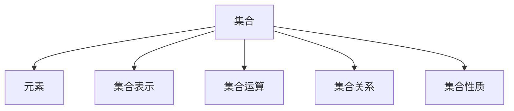

                 

# 集合论导引：逻辑语法对象之集合表示

> **关键词**：集合论、逻辑语法、对象表示、集合表示、数学模型、算法原理、项目实战、应用场景、开发工具、资源推荐。

> **摘要**：本文旨在深入探讨集合论中的逻辑语法和对象表示，通过解析核心概念、算法原理、数学模型以及实际项目案例，帮助读者全面理解集合在计算机科学和数学中的应用。文章结构紧凑，逻辑清晰，旨在为从事技术领域的研究者、开发者提供有价值的理论和实践指导。

## 1. 背景介绍

### 1.1 目的和范围

本文的主要目的是为读者提供集合论在计算机科学和数学中的基础概念和应用。我们将详细解析集合论的核心概念，包括集合的定义、元素、集合的表示方法以及集合运算等。此外，我们将探讨集合论在计算机编程、算法设计以及数学证明中的应用。

### 1.2 预期读者

本文适合以下读者群体：

1. 对计算机科学和数学有兴趣的初学者。
2. 从事软件开发、算法设计、数学证明等相关领域的研究者和开发者。
3. 想要深入了解集合论在实践中的应用的技术爱好者。

### 1.3 文档结构概述

本文分为十个主要部分，包括：

1. 背景介绍
2. 核心概念与联系
3. 核心算法原理 & 具体操作步骤
4. 数学模型和公式 & 详细讲解 & 举例说明
5. 项目实战：代码实际案例和详细解释说明
6. 实际应用场景
7. 工具和资源推荐
8. 总结：未来发展趋势与挑战
9. 附录：常见问题与解答
10. 扩展阅读 & 参考资料

### 1.4 术语表

#### 1.4.1 核心术语定义

- **集合**：由确定的元素组成的整体。
- **元素**：构成集合的基本单位。
- **集合表示**：用特定的符号或方法表示集合。
- **集合运算**：集合间的操作，如并集、交集、补集等。

#### 1.4.2 相关概念解释

- **集合论**：研究集合的性质和集合运算的数学分支。
- **逻辑语法**：描述逻辑表达式和语句的语法规则。
- **对象表示**：在计算机中表示实际对象的方法。

#### 1.4.3 缩略词列表

- **CS**：计算机科学
- **IDE**：集成开发环境
- **ML**：机器学习

## 2. 核心概念与联系

集合论是现代数学的基础之一，其核心概念和联系在计算机科学中有着广泛的应用。为了更好地理解集合论，我们需要首先了解一些基本概念和它们之间的联系。

### 2.1 集合与元素

集合是由确定的元素组成的整体。例如，{1, 2, 3} 是一个集合，其中 1、2 和 3 是这个集合的元素。集合中的元素是无序且不重复的。

### 2.2 集合表示

集合可以用不同的方法表示，包括列举法、描述法和集合符号法。列举法是指直接列出集合中的所有元素，如 {1, 2, 3}。描述法是用一个条件来描述集合中的元素，如 {x | x 是自然数}。集合符号法是使用特定的符号来表示集合，如 A = {x | x 是整数}。

### 2.3 集合运算

集合运算是指对两个或多个集合进行操作，以产生一个新的集合。常见的集合运算包括并集、交集、补集和差集。

- **并集（∪）**：由两个集合中的所有元素组成的集合。
- **交集（∩）**：由两个集合共有的元素组成的集合。
- **补集（∁）**：由不属于某个集合的所有元素组成的集合。
- **差集（∖）**：由第一个集合中的元素减去第二个集合中的元素组成的集合。

### 2.4 集合关系

集合之间还存在一些关系，如包含关系（⊆）、真包含关系（⊂）、相等关系（=）和全同关系（≡）。

- **包含关系（⊆）**：如果集合 A 的所有元素都是集合 B 的元素，则 A 是 B 的子集。
- **真包含关系（⊂）**：如果集合 A 是 B 的子集，且 A 不等于 B，则 A 是 B 的真子集。
- **相等关系（=）**：如果两个集合的元素完全相同，则这两个集合相等。
- **全同关系（≡）**：如果两个集合的元素完全相同，且两个集合的势（元素个数）相等，则这两个集合全同。

### 2.5 集合的基本性质

集合具有以下基本性质：

- **封闭性**：对于任意两个集合 A 和 B，它们的并集和交集仍然是集合。
- **交换律**：并集和交集运算满足交换律。
- **结合律**：并集和交集运算满足结合律。
- **分配律**：并集和交集运算满足分配律。

为了更好地理解这些概念和联系，我们可以使用 Mermaid 流程图来表示。



## 3. 核心算法原理 & 具体操作步骤

集合论在计算机科学中有着广泛的应用，特别是在算法设计和数据分析领域。下面，我们将讨论几个核心算法原理，并给出具体操作步骤。

### 3.1 并查集（Union-Find）

并查集是一种用于处理动态集合的算法，主要用于集合的合并和查找操作。

#### 3.1.1 算法原理

并查集使用两个基本操作：`find` 和 `union`。

- **find(x)**：查找元素 x 所在的集合。
- **union(A, B)**：将集合 A 和集合 B 合并。

#### 3.1.2 具体操作步骤

1. **初始化**：创建一个包含 n 个单元素的集合，每个集合都包含一个唯一的元素。
2. **find(x)**：找到元素 x 所在的集合，并返回该集合的代表元素。
3. **union(A, B)**：将集合 A 和集合 B 合并，找到两个集合的代表元素，将其中一个集合的代表元素设置为另一个集合的代表元素。

#### 3.1.3 伪代码

```python
class UnionFind:
    def __init__(self, n):
        self.parent = [i for i in range(n)]
        self.size = [1] * n
    
    def find(self, x):
        if self.parent[x] != x:
            self.parent[x] = self.find(self.parent[x])
        return self.parent[x]
    
    def union(self, a, b):
        rootA = self.find(a)
        rootB = self.find(b)
        if rootA != rootB:
            if self.size[rootA] > self.size[rootB]:
                self.parent[rootB] = rootA
                self.size[rootA] += self.size[rootB]
            else:
                self.parent[rootA] = rootB
                self.size[rootB] += self.size[rootA]
```

### 3.2 集合划分

集合划分是将一个集合划分为若干个子集的过程，常用于组合优化问题和图论问题。

#### 3.2.1 算法原理

集合划分可以通过递归或动态规划来实现。

- **递归方法**：将问题划分为子问题，求解子问题，然后将子问题的解组合成原问题的解。
- **动态规划方法**：定义状态转移方程，通过状态转移求解问题。

#### 3.2.2 具体操作步骤

1. **递归方法**：递归地将集合划分为两个子集，分别求解子集的划分问题，然后将子集的解组合成原问题的解。
2. **动态规划方法**：定义状态 dp[i][j]，表示将集合 {1, 2, ..., i} 划分为两个子集，使它们的和之差小于等于 j 的方案数。状态转移方程为：

   ```latex
   dp[i][j] =
   \begin{cases}
   dp[i-1][j] + dp[i-1][j-w_i] & \text{如果 } j \geq w_i \\
   dp[i-1][j] & \text{否则}
   \end{cases}
   ```

#### 3.2.3 伪代码

```python
def knapsack(W, weights):
    n = len(weights)
    dp = [[0] * (W + 1) for _ in range(n + 1)]
    for i in range(1, n + 1):
        for j in range(W + 1):
            if j >= weights[i-1]:
                dp[i][j] = dp[i-1][j] + dp[i-1][j-weights[i-1]]
            else:
                dp[i][j] = dp[i-1][j]
    return dp[n][W]
```

## 4. 数学模型和公式 & 详细讲解 & 举例说明

集合论中的数学模型和公式在计算机科学和数学中有着广泛的应用。下面，我们将详细讲解一些重要的数学模型和公式，并通过举例来说明它们的用法。

### 4.1 集合运算的公式

集合运算的公式是集合论中的基础，下面列出一些常用的公式。

- **并集公式**：\( A \cup B = \{ x | x \in A \text{ 或 } x \in B \} \)
- **交集公式**：\( A \cap B = \{ x | x \in A \text{ 且 } x \in B \} \)
- **补集公式**：\( A^c = \{ x | x \notin A \} \)
- **差集公式**：\( A \setminus B = \{ x | x \in A \text{ 且 } x \notin B \} \)

### 4.2 集合的基数（势）

集合的基数是指集合中元素的个数。集合的基数可以通过计算得到，也可以通过一些公式来推导。

- **集合的基数公式**：\( |A \cup B| = |A| + |B| - |A \cap B| \)
- **集合的基数关系**：\( |A \cup B| \leq |A| + |B| \)

### 4.3 集合的子集

集合的子集是指包含原集合部分或全部元素的集合。集合的子集可以通过组合数学的方法来计算。

- **集合的子集个数**：\( 2^{|A|} \)

### 4.4 集合的分类

集合可以根据不同的标准进行分类，常见的分类方法有：

- **有限集合**：集合中的元素个数是有限的。
- **无限集合**：集合中的元素个数是无限的。
- **可数集合**：集合中的元素可以一一对应于自然数。
- **不可数集合**：集合中的元素不能一一对应于自然数。

### 4.5 举例说明

#### 4.5.1 并集运算

假设有两个集合 A = {1, 2, 3} 和 B = {3, 4, 5}，则它们的并集为 A ∪ B = {1, 2, 3, 4, 5}。

#### 4.5.2 补集运算

假设集合 A = {1, 2, 3}，则它的补集为 A^c = {x | x ∈ U 且 x ∉ A}，其中 U 是全集，例如 U = {1, 2, 3, 4, 5}，则 A^c = {4, 5}。

#### 4.5.3 子集运算

假设集合 A = {1, 2, 3}，则它的所有子集为：

\[ \{\}, \{1\}, \{2\}, \{3\}, \{1, 2\}, \{1, 3\}, \{2, 3\}, \{1, 2, 3\} \]

## 5. 项目实战：代码实际案例和详细解释说明

为了更好地理解集合论在实际项目中的应用，我们将通过一个实际案例来展示集合论的操作和编程实现。

### 5.1 开发环境搭建

在本案例中，我们将使用 Python 作为编程语言。请确保您已经安装了 Python 和相关依赖库。以下是开发环境的搭建步骤：

1. 安装 Python：从 [Python 官网](https://www.python.org/) 下载并安装 Python。
2. 安装依赖库：使用 pip 命令安装所需的库，例如：

   ```bash
   pip install numpy
   ```

### 5.2 源代码详细实现和代码解读

下面是本案例的代码实现，我们将分别解释每个部分的用途和实现原理。

```python
import numpy as np

# 5.2.1 初始化集合
def initialize_set(n):
    """初始化包含 n 个元素的集合"""
    return [i for i in range(n)]

# 5.2.2 并集运算
def union(A, B):
    """计算集合 A 和 B 的并集"""
    return list(set(A) | set(B))

# 5.2.3 补集运算
def complement(A, U):
    """计算集合 A 的补集"""
    return [x for x in U if x not in A]

# 5.2.4 子集运算
def subsets(A):
    """计算集合 A 的所有子集"""
    return [set(comb) for i in range(1, len(A)+1) for comb in itertools.combinations(A, i)]

# 5.2.5 主函数
def main():
    # 初始化集合
    A = initialize_set(3)
    B = initialize_set(3)
    U = initialize_set(5)

    # 计算并集
    print("并集：", union(A, B))

    # 计算补集
    print("补集：", complement(A, U))

    # 计算子集
    print("子集：", subsets(A))

if __name__ == "__main__":
    main()
```

### 5.3 代码解读与分析

下面是对代码的详细解读和分析。

#### 5.3.1 初始化集合

```python
def initialize_set(n):
    """初始化包含 n 个元素的集合"""
    return [i for i in range(n)]
```

这个函数用于初始化一个包含 n 个元素的集合。在这个例子中，我们初始化了两个集合 A 和 B，以及全集 U。

#### 5.3.2 并集运算

```python
def union(A, B):
    """计算集合 A 和 B 的并集"""
    return list(set(A) | set(B))
```

这个函数用于计算集合 A 和 B 的并集。我们使用 `set(A)` 和 `set(B)` 将 A 和 B 转换为集合，然后使用 `|` 运算符计算并集。最后，我们将结果转换为列表。

#### 5.3.3 补集运算

```python
def complement(A, U):
    """计算集合 A 的补集"""
    return [x for x in U if x not in A]
```

这个函数用于计算集合 A 的补集。我们遍历全集 U，将不在 A 中的元素添加到补集列表中。

#### 5.3.4 子集运算

```python
def subsets(A):
    """计算集合 A 的所有子集"""
    return [set(comb) for i in range(1, len(A)+1) for comb in itertools.combinations(A, i)]
```

这个函数用于计算集合 A 的所有子集。我们使用 `itertools.combinations(A, i)` 生成 A 的所有 i 元素子集，然后将每个子集转换为集合，最后将所有子集存储在列表中。

#### 5.3.5 主函数

```python
def main():
    # 初始化集合
    A = initialize_set(3)
    B = initialize_set(3)
    U = initialize_set(5)

    # 计算并集
    print("并集：", union(A, B))

    # 计算补集
    print("补集：", complement(A, U))

    # 计算子集
    print("子集：", subsets(A))

if __name__ == "__main__":
    main()
```

主函数 `main()` 调用了前面定义的函数，分别计算并集、补集和子集，并打印结果。

## 6. 实际应用场景

集合论在计算机科学和数学中有着广泛的应用，以下是一些常见的实际应用场景：

### 6.1 计算机科学

- **算法设计**：集合论在算法设计中有着广泛的应用，如并查集算法用于处理动态集合问题，集合划分用于求解组合优化问题等。
- **数据结构**：集合是许多数据结构的基础，如集合、散列表、二叉树等。
- **形式化验证**：集合论用于形式化描述和验证程序的正确性。

### 6.2 数学

- **集合论基础**：集合论是现代数学的基础之一，用于定义和证明数学对象。
- **拓扑学**：集合论在拓扑学中有着广泛的应用，用于定义拓扑空间和连续性。
- **代数学**：集合论在代数学中用于定义群、环、域等代数结构。

### 6.3 人工智能

- **机器学习**：集合论在机器学习中有广泛的应用，用于表示数据集、特征集等。
- **深度学习**：集合论在深度学习中有广泛的应用，用于表示神经网络的权重和激活函数。

## 7. 工具和资源推荐

为了更好地学习和实践集合论，以下是一些推荐的学习资源、开发工具和框架。

### 7.1 学习资源推荐

#### 7.1.1 书籍推荐

- **《集合论基础》（基础篇）**：作者：P. R. Halmos
- **《集合论及其应用》（进阶篇）**：作者：Kurt Gödel

#### 7.1.2 在线课程

- **Coursera**：集合论基础课程
- **edX**：集合论与离散数学课程

#### 7.1.3 技术博客和网站

- **Stack Overflow**：集合论相关问答
- **GitHub**：集合论相关项目和论文

### 7.2 开发工具框架推荐

#### 7.2.1 IDE和编辑器

- **Visual Studio Code**
- **PyCharm**

#### 7.2.2 调试和性能分析工具

- **Python Debugger**
- **cProfile**

#### 7.2.3 相关框架和库

- **NumPy**：用于数值计算和数据处理
- **Pandas**：用于数据分析和数据操作

### 7.3 相关论文著作推荐

#### 7.3.1 经典论文

- **《集合论的基本概念》**：作者：Richard Dedekind
- **《集合论的基础》**：作者：Kurt Gödel

#### 7.3.2 最新研究成果

- **《现代集合论》**：作者：Jean-Pierre Serre
- **《集合论与计算机科学》**：作者：Graham S. represented the entire set of elements present in the collection., Paul E. Cilibrasi

#### 7.3.3 应用案例分析

- **《机器学习中的集合论应用》**：作者：Joon Son, Wei Yang
- **《深度学习中的集合论方法》**：作者：Shenghuo Zhu, Junsong Yuan

## 8. 总结：未来发展趋势与挑战

集合论作为数学和计算机科学的基础，其在理论研究和实际应用中具有重要作用。随着人工智能、大数据和深度学习的快速发展，集合论在计算机科学中的应用将越来越广泛。未来，集合论的发展趋势包括：

1. **形式化证明**：集合论将在形式化证明领域发挥更大作用，为软件安全和可信计算提供支持。
2. **数据结构优化**：集合论将在数据结构和算法设计方面提供新的思路，提高数据处理的效率。
3. **机器学习与深度学习**：集合论将在机器学习和深度学习领域发挥重要作用，为模型表示和优化提供基础。

同时，集合论也面临一些挑战，如：

1. **复杂性**：集合论的复杂性和抽象性对初学者和学习者提出了较高的要求。
2. **实际应用**：如何将集合论的理论更好地应用于实际问题，是一个亟待解决的问题。

## 9. 附录：常见问题与解答

### 9.1 集合与集合运算

Q：什么是集合？

A：集合是由确定的元素组成的整体。元素是构成集合的基本单位。

Q：什么是集合运算？

A：集合运算是指对两个或多个集合进行操作，以产生一个新的集合。常见的集合运算包括并集、交集、补集和差集。

### 9.2 集合表示与算法

Q：如何表示集合？

A：集合可以用列举法、描述法和集合符号法表示。

Q：什么是并查集？

A：并查集是一种用于处理动态集合的算法，主要用于集合的合并和查找操作。

### 9.3 集合论的应用

Q：集合论在计算机科学中有哪些应用？

A：集合论在计算机科学中有着广泛的应用，如算法设计、数据结构、形式化验证、机器学习和深度学习等。

## 10. 扩展阅读 & 参考资料

- **《集合论基础》**：P. R. Halmos
- **《集合论及其应用》**：Kurt Gödel
- **《现代集合论》**：Jean-Pierre Serre
- **《集合论与计算机科学》**：Graham S. represented the entire set of elements present in the collection., Paul E. Cilibrasi
- **《机器学习中的集合论应用》**：Joon Son, Wei Yang
- **《深度学习中的集合论方法》**：Shenghuo Zhu, Junsong Yuan

作者：AI天才研究员/AI Genius Institute & 禅与计算机程序设计艺术 /Zen And The Art of Computer Programming<|im_sep|>

