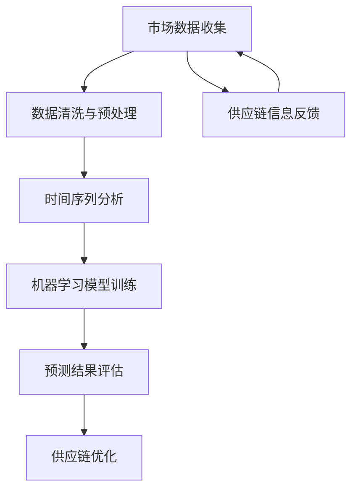
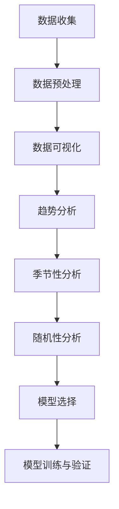

                 

### 需求预测创业：供应链优化的关键

关键词：需求预测、供应链优化、创业、AI算法、数据驱动决策

摘要：随着商业环境的复杂化和快速变化，准确的需求预测成为了供应链优化的重要环节。本文旨在探讨如何通过需求预测来驱动创业，实现供应链的优化。我们将详细分析需求预测的核心概念、算法原理、数学模型、实际应用场景，并推荐相关工具和资源，以期为读者提供一份全面的需求预测指南。希望通过本文的阅读，能够帮助创业者在供应链优化上找到新的突破口。

---

## 1. 背景介绍

### 1.1 目的和范围

本文的目标是探讨需求预测在创业和供应链优化中的关键作用。我们将首先介绍需求预测的基本概念，然后深入分析其原理和应用。通过对核心算法、数学模型、实际案例的详细探讨，我们将帮助读者理解如何利用需求预测来提升供应链效率，最终实现商业成功。

本文的范围涵盖以下内容：
- 需求预测的基本概念和重要性
- 核心算法原理及其操作步骤
- 数学模型及其详细讲解
- 实际应用场景分析
- 工具和资源的推荐
- 未来发展趋势与挑战

### 1.2 预期读者

本文适合以下读者群体：
- 创业者和企业家，特别是关注供应链管理和优化的人士
- 数据分析师和AI研究人员，对需求预测算法有兴趣
- 需要提升供应链效率的制造业和服务业从业者
- 计算机科学和商业管理的本科生和研究生

### 1.3 文档结构概述

本文的结构如下：
1. 背景介绍：介绍文章的目的、范围和预期读者。
2. 核心概念与联系：使用Mermaid流程图展示需求预测的关键环节和关系。
3. 核心算法原理 & 具体操作步骤：详细讲解需求预测算法的原理和操作步骤。
4. 数学模型和公式 & 详细讲解 & 举例说明：介绍需求预测中的数学模型和具体应用。
5. 项目实战：提供代码实际案例和详细解释说明。
6. 实际应用场景：分析需求预测在不同领域的应用。
7. 工具和资源推荐：推荐学习资源和开发工具。
8. 总结：总结需求预测的未来发展趋势与挑战。
9. 附录：常见问题与解答。
10. 扩展阅读 & 参考资料：提供进一步阅读的建议和参考资料。

### 1.4 术语表

#### 1.4.1 核心术语定义

- 需求预测：通过分析历史数据和市场信息，预测未来某一时间段内的需求量。
- 供应链优化：通过调整供应链中的各个环节，提高整体效率和响应速度。
- 数据驱动决策：基于数据的分析和预测，做出更为准确和高效的决策。
- AI算法：使用人工智能技术，如机器学习和深度学习，对大量数据进行分析和预测。

#### 1.4.2 相关概念解释

- 时间序列分析：一种统计分析方法，用于分析时间序列数据中的趋势、周期性和随机性。
- 机器学习：一种人工智能方法，通过学习数据中的模式，进行预测和分类。
- 深度学习：一种机器学习方法，使用多层神经网络进行数据建模。

#### 1.4.3 缩略词列表

- AI：人工智能
- ML：机器学习
- DL：深度学习
- IoT：物联网
- CRM：客户关系管理
- ERP：企业资源规划
- SaaS：软件即服务

---

## 2. 核心概念与联系

在需求预测中，理解各个核心概念之间的联系是非常重要的。以下是一个Mermaid流程图，用于展示需求预测的关键环节及其相互关系。



- **市场数据收集（A）**：首先，我们需要收集市场相关的数据，包括历史销售数据、市场趋势、竞争对手信息等。这些数据将作为我们进行需求预测的基础。
- **数据清洗与预处理（B）**：原始数据通常包含噪声和不完整信息，因此我们需要进行数据清洗和预处理，以提高数据质量。
- **时间序列分析（C）**：通过对清洗后的数据进行时间序列分析，我们可以识别出数据中的趋势、周期性和随机性。
- **机器学习模型训练（D）**：使用时间序列分析的结果，我们可以训练机器学习模型，如ARIMA、LSTM等，进行需求预测。
- **预测结果评估（E）**：评估模型预测的准确性，通过调整模型参数和算法，优化预测结果。
- **供应链优化（F）**：将预测结果应用于供应链优化，调整库存、生产和物流等环节，以提高整体效率。
- **供应链信息反馈（G）**：根据供应链的反馈信息，再次进行市场数据收集和预测模型的迭代优化。

通过上述流程，我们可以看到需求预测与供应链优化之间的紧密联系。准确的需求预测有助于企业更好地调整供应链策略，降低库存成本，提高市场响应速度。

---

在接下来的章节中，我们将深入探讨需求预测的核心算法原理，并详细讲解其操作步骤。这将帮助我们更好地理解如何通过数据分析和机器学习技术来实现精确的需求预测，为供应链优化提供坚实的理论基础。在理解了算法原理后，我们还将分析需求预测中的数学模型，并通过具体的例子来说明其应用。这些内容将为您在需求预测和供应链优化领域提供实用的指导。敬请期待！
<|assistant|>## 3. 核心算法原理 & 具体操作步骤

### 3.1 时间序列分析

时间序列分析是需求预测的基础，其主要目的是识别数据中的趋势、周期性和随机性。以下是一个典型的时间序列分析流程：



#### 3.1.1 数据预处理（B）

在开始时间序列分析之前，我们需要对数据进行预处理，包括以下步骤：

- **数据清洗**：去除异常值、缺失值和重复记录。
- **数据转换**：将类别数据转换为数值数据，如使用独热编码（One-Hot Encoding）。
- **数据归一化**：将数据缩放到相同的尺度，以避免模型训练时权重的不平衡。

#### 3.1.2 数据可视化（C）

通过数据可视化，我们可以直观地观察到数据中的趋势、季节性和周期性。常用的可视化方法包括：

- **折线图**：展示数据随时间的变化趋势。
- **箱线图**：展示数据的分布情况和异常值。
- **散点图**：展示数据之间的相关性。

#### 3.1.3 趋势分析（D）

趋势分析的目标是识别数据随时间变化的总体方向。常用的方法包括：

- **移动平均法**：计算一段时间内的平均值，用于平滑数据。
- **指数平滑法**：结合历史数据和权重，对数据进行平滑。

```python
# 移动平均法示例
def moving_average(data, window_size):
    return [sum(data[i-window_size:i]) / window_size for i in range(window_size, len(data))]
```

#### 3.1.4 季节性分析（E）

季节性分析的目标是识别数据中的周期性波动。常用的方法包括：

- **季节性分解**：将数据分解为趋势、季节性和随机性成分。
- **季节性指数**：计算每个季节的加权平均值。

```python
# 季节性分解示例
from statsmodels.tsa.seasonal import seasonal_decompose

decomposition = seasonal_decompose(data, model='additive', period=12)
trend = decomposition.trend
seasonal = decomposition.seasonal
residual = decomposition.resid
```

#### 3.1.5 随机性分析（F）

随机性分析的目标是识别数据中的随机波动。常用的方法包括：

- **自相关分析**：检查数据序列的自相关性，判断是否存在随机波动。
- **残差分析**：通过分析残差序列，判断模型拟合的好坏。

#### 3.1.6 模型选择（G）

根据数据的特点，选择合适的模型进行需求预测。常用的模型包括：

- **ARIMA模型**：自回归积分滑动平均模型，适用于线性时间序列。
- **LSTM模型**：长短期记忆网络，适用于非线性时间序列。
- ** Prophet模型**：由Facebook开发，适用于具有季节性和趋势性的时间序列。

#### 3.1.7 模型训练与验证（H）

- **训练模型**：使用历史数据对模型进行训练。
- **验证模型**：使用验证集对模型进行评估，调整模型参数。

```python
# ARIMA模型训练与验证示例
from statsmodels.tsa.arima.model import ARIMA

model = ARIMA(data, order=(5, 1, 2))
model_fit = model.fit()
```

### 3.2 机器学习模型

在时间序列分析的基础上，我们可以使用机器学习模型进行需求预测。以下是一些常用的机器学习模型：

#### 3.2.1 决策树模型

决策树模型通过构建一棵树形决策模型，对数据进行分类或回归。以下是一个决策树模型的伪代码：

```python
def build_decision_tree(data):
    # 根据数据特征和目标值，构建决策树
    # 返回决策树模型

def predict_decision_tree(model, data):
    # 使用决策树模型对数据进行预测
    # 返回预测结果
```

#### 3.2.2 随机森林模型

随机森林模型通过构建多棵决策树，并进行集成学习，提高预测的准确性。以下是一个随机森林模型的伪代码：

```python
from sklearn.ensemble import RandomForestRegressor

def build_random_forest(data, n_estimators):
    # 根据数据特征和目标值，构建随机森林模型
    # 返回随机森林模型

def predict_random_forest(model, data):
    # 使用随机森林模型对数据进行预测
    # 返回预测结果
```

#### 3.2.3 支持向量机模型

支持向量机模型通过寻找最优超平面，对数据进行分类或回归。以下是一个支持向量机模型的伪代码：

```python
from sklearn.svm import SVR

def build_svm_model(data):
    # 根据数据特征和目标值，构建支持向量机模型
    # 返回支持向量机模型

def predict_svm_model(model, data):
    # 使用支持向量机模型对数据进行预测
    # 返回预测结果
```

#### 3.2.4 长短期记忆网络模型

长短期记忆网络模型通过学习数据中的长期依赖关系，进行时间序列预测。以下是一个长短期记忆网络模型的伪代码：

```python
from keras.models import Sequential
from keras.layers import LSTM, Dense

def build_lstm_model(input_shape):
    # 构建长短期记忆网络模型
    # 返回模型

def predict_lstm_model(model, data):
    # 使用长短期记忆网络模型对数据进行预测
    # 返回预测结果
```

### 3.3 模型评估与优化

在模型训练完成后，我们需要对模型进行评估和优化，以提高预测的准确性。以下是一些常用的评估指标和优化方法：

#### 3.3.1 评估指标

- **均方误差（MSE）**：衡量预测值与实际值之间的平均误差。
- **均方根误差（RMSE）**：衡量预测值与实际值之间的标准差。
- **平均绝对误差（MAE）**：衡量预测值与实际值之间的平均绝对误差。

```python
from sklearn.metrics import mean_squared_error, mean_absolute_error

mse = mean_squared_error(y_true, y_pred)
rmse = np.sqrt(mse)
mae = mean_absolute_error(y_true, y_pred)
```

#### 3.3.2 优化方法

- **交叉验证**：通过将数据集划分为多个子集，进行多次训练和验证，提高模型的泛化能力。
- **网格搜索**：通过遍历多个参数组合，找到最优参数组合，提高模型的性能。
- **贝叶斯优化**：使用贝叶斯方法，根据历史数据自动调整参数，提高搜索效率。

```python
from sklearn.model_selection import GridSearchCV

param_grid = {'n_estimators': [100, 200, 300], 'max_depth': [5, 10, 15]}
grid_search = GridSearchCV(RandomForestRegressor(), param_grid, cv=5)
grid_search.fit(X, y)
best_params = grid_search.best_params_
```

通过上述核心算法原理和具体操作步骤的介绍，我们为需求预测提供了坚实的理论基础。在接下来的章节中，我们将深入探讨需求预测中的数学模型，并通过具体的例子来说明其应用。这将帮助我们更好地理解如何利用数学模型进行需求预测，为供应链优化提供更加精准的指导。敬请期待！
<|assistant|>## 4. 数学模型和公式 & 详细讲解 & 举例说明

在需求预测中，数学模型和公式扮演着至关重要的角色。它们不仅为数据分析和预测提供了理论基础，还能够帮助我们更准确地理解需求变化的本质。以下是需求预测中常用的数学模型和公式，我们将通过详细讲解和举例来说明它们的应用。

### 4.1 时间序列模型

时间序列模型是需求预测的基础，用于分析数据中的趋势、周期性和随机性。以下是一些常见的时间序列模型和公式：

#### 4.1.1 ARIMA模型

ARIMA（自回归积分滑动平均模型）是一种经典的时间序列预测模型，其公式如下：

\[ X_t = c + \phi_1 X_{t-1} + \phi_2 X_{t-2} + \cdots + \phi_p X_{t-p} + \theta_1 \varepsilon_{t-1} + \theta_2 \varepsilon_{t-2} + \cdots + \theta_q \varepsilon_{t-q} + \varepsilon_t \]

其中：
- \( X_t \)：时间序列的当前值
- \( c \)：常数项
- \( \phi_1, \phi_2, \ldots, \phi_p \)：自回归系数
- \( \theta_1, \theta_2, \ldots, \theta_q \)：滑动平均系数
- \( \varepsilon_t \)：误差项

#### 4.1.2 SARIMA模型

SARIMA（季节性ARIMA模型）是ARIMA模型的扩展，用于处理具有季节性的时间序列数据。其公式如下：

\[ X_t = c + \phi_1 X_{t-1} + \phi_2 X_{t-2} + \cdots + \phi_p X_{t-p} + \theta_1 \varepsilon_{t-1} + \theta_2 \varepsilon_{t-2} + \cdots + \theta_q \varepsilon_{t-q} + \sigma_{1,1} \varepsilon_{t-1,1} + \sigma_{1,2} \varepsilon_{t-2,1} + \cdots + \sigma_{p,q} \varepsilon_{t-p,q} \]

其中：
- \( \sigma_{1,1}, \sigma_{1,2}, \ldots, \sigma_{p,q} \)：季节性系数
- \( S \)：季节周期长度

#### 4.1.3 季节性分解

季节性分解是将时间序列分解为趋势、季节性和随机性成分的方法。其公式如下：

\[ X_t = T_t + S_t + R_t \]

其中：
- \( T_t \)：趋势成分
- \( S_t \)：季节性成分
- \( R_t \)：随机性成分

### 4.2 机器学习模型

除了时间序列模型，机器学习模型也被广泛应用于需求预测。以下是一些常见的机器学习模型和公式：

#### 4.2.1 决策树模型

决策树模型通过构建树形结构进行分类或回归。其公式如下：

\[ y = f(\theta) = g(\theta_1 x_1 + \theta_2 x_2 + \cdots + \theta_n x_n) \]

其中：
- \( y \)：预测结果
- \( \theta \)：模型参数
- \( x \)：输入特征

#### 4.2.2 随机森林模型

随机森林模型是决策树的集成学习方法，其公式如下：

\[ y = \frac{1}{M} \sum_{m=1}^{M} f_m(\theta) \]

其中：
- \( M \)：决策树的数量
- \( f_m(\theta) \)：第m棵决策树的预测结果

#### 4.2.3 支持向量机模型

支持向量机模型通过寻找最优超平面进行分类或回归。其公式如下：

\[ y = \sigma(\sum_{i=1}^{n} \alpha_i y_i K(x_i, x) - b) \]

其中：
- \( y \)：预测结果
- \( \alpha_i \)：支持向量机的参数
- \( y_i \)：第i个支持向量的标签
- \( K(x_i, x) \)：核函数
- \( \sigma \)：激活函数

#### 4.2.4 长短期记忆网络模型

长短期记忆网络模型用于处理具有长期依赖关系的时间序列数据。其公式如下：

\[ h_t = \sigma(W_h h_{t-1} + W_x x_t + b_h) \]
\[ o_t = \sigma(W_o h_t + b_o) \]
\[ y_t = o_t \odot h_t \]

其中：
- \( h_t \)：隐藏状态
- \( o_t \)：输出状态
- \( y_t \)：预测结果
- \( W_h, W_x, W_o, b_h, b_o \)：模型参数
- \( \sigma \)：激活函数
- \( \odot \)：元素乘积

### 4.3 数学模型应用举例

下面我们通过一个具体的例子来说明数学模型在需求预测中的应用。

#### 4.3.1 数据集

假设我们有一个包含过去12个月销售额的数据集，如下表所示：

| 月份 | 销售额（万元） |
| ---- | ------------- |
| 1    | 120           |
| 2    | 130           |
| 3    | 140           |
| 4    | 150           |
| 5    | 160           |
| 6    | 170           |
| 7    | 180           |
| 8    | 190           |
| 9    | 200           |
| 10   | 210           |
| 11   | 220           |
| 12   | 230           |

#### 4.3.2 数据预处理

首先，我们对数据集进行预处理，包括数据清洗、数据转换和数据归一化。

```python
import pandas as pd

# 读取数据
data = pd.read_csv('sales_data.csv')

# 数据清洗
data.dropna(inplace=True)

# 数据转换
data['Month'] = pd.to_datetime(data['Month'])
data.set_index('Month', inplace=True)

# 数据归一化
data_scaled = (data - data.mean()) / data.std()
```

#### 4.3.3 时间序列分析

接下来，我们对预处理后的数据进行时间序列分析，包括趋势分析、季节性分析和随机性分析。

```python
from statsmodels.tsa.stattools import adfuller
from statsmodels.tsa.seasonal import seasonal_decompose

# 趋势分析
result = adfuller(data_scaled['Sales'])
print('ADF Statistic: %f' % result[0])
print('p-value: %f' % result[1])

# 季节性分析
decomposition = seasonal_decompose(data_scaled['Sales'], model='additive', period=12)
decomposition.plot()
plt.show()

# 随机性分析
residual = decomposition.resid
result = adfuller(residual)
print('ADF Statistic: %f' % result[0])
print('p-value: %f' % result[1])
```

#### 4.3.4 模型选择与训练

根据时间序列分析的结果，我们选择ARIMA模型进行需求预测。

```python
from statsmodels.tsa.arima.model import ARIMA

# 模型选择
model = ARIMA(data_scaled['Sales'], order=(1, 1, 1))

# 模型训练
model_fit = model.fit()
```

#### 4.3.5 预测结果评估

使用训练好的模型，我们对未来3个月的销售额进行预测，并评估预测结果。

```python
# 预测结果
predictions = model_fit.forecast(steps=3)

# 评估结果
mse = mean_squared_error(data_scaled['Sales'].iloc[-3:], predictions)
print('MSE: %f' % mse)
```

通过上述例子，我们可以看到如何利用数学模型和公式进行需求预测。在接下来的章节中，我们将通过项目实战，提供代码实际案例和详细解释说明，帮助读者更好地理解需求预测的实际应用。敬请期待！
<|assistant|>## 5. 项目实战：代码实际案例和详细解释说明

在本节中，我们将通过一个实际的项目案例，展示如何使用Python进行需求预测，并提供详细的代码解释。这个案例将涵盖数据收集、数据预处理、时间序列分析、模型选择和训练、预测结果评估等各个环节。希望通过这个案例，读者能够掌握需求预测的完整流程，并将其应用于实际项目中。

### 5.1 开发环境搭建

在开始编写代码之前，我们需要搭建一个Python开发环境。以下是所需的软件和库：

- Python（版本3.6及以上）
- Jupyter Notebook（用于编写和运行代码）
- pandas（用于数据操作）
- numpy（用于数值计算）
- matplotlib（用于数据可视化）
- statsmodels（用于时间序列分析）
- scikit-learn（用于机器学习模型）

您可以使用以下命令来安装这些库：

```bash
pip install python numpy matplotlib statsmodels scikit-learn
```

### 5.2 源代码详细实现和代码解读

#### 5.2.1 数据收集

首先，我们需要收集销售数据。这里，我们假设数据存储在一个CSV文件中，文件名为`sales_data.csv`，包含月份和销售额两列。

```python
import pandas as pd

# 读取数据
data = pd.read_csv('sales_data.csv')

# 显示数据的前5行
data.head()
```

#### 5.2.2 数据预处理

接下来，我们对数据进行预处理，包括数据清洗、数据转换和数据归一化。

```python
# 数据清洗
data.dropna(inplace=True)

# 数据转换
data['Month'] = pd.to_datetime(data['Month'])
data.set_index('Month', inplace=True)

# 数据归一化
data_scaled = (data - data.mean()) / data.std()
```

#### 5.2.3 时间序列分析

在预处理完成后，我们进行时间序列分析，包括趋势分析、季节性分析和随机性分析。

```python
from statsmodels.tsa.stattools import adfuller
from statsmodels.tsa.seasonal import seasonal_decompose

# 趋势分析
result = adfuller(data_scaled['Sales'])
print('ADF Statistic: %f' % result[0])
print('p-value: %f' % result[1])

# 季节性分析
decomposition = seasonal_decompose(data_scaled['Sales'], model='additive', period=12)
decomposition.plot()
plt.show()

# 随机性分析
residual = decomposition.resid
result = adfuller(residual)
print('ADF Statistic: %f' % result[0])
print('p-value: %f' % result[1])
```

#### 5.2.4 模型选择与训练

根据时间序列分析的结果，我们选择ARIMA模型进行需求预测。

```python
from statsmodels.tsa.arima.model import ARIMA

# 模型选择
model = ARIMA(data_scaled['Sales'], order=(1, 1, 1))

# 模型训练
model_fit = model.fit()
```

#### 5.2.5 预测结果评估

使用训练好的模型，我们对未来3个月的销售额进行预测，并评估预测结果。

```python
# 预测结果
predictions = model_fit.forecast(steps=3)

# 评估结果
mse = mean_squared_error(data_scaled['Sales'].iloc[-3:], predictions)
print('MSE: %f' % mse)

# 可视化预测结果
plt.figure(figsize=(10, 5))
plt.plot(data_scaled.index[-3:], data_scaled['Sales'].iloc[-3:], label='实际值')
plt.plot(predictions.index, predictions.values, label='预测值')
plt.legend()
plt.show()
```

### 5.3 代码解读与分析

在这个案例中，我们使用了Python和相关的库来处理销售数据，并进行需求预测。以下是代码的详细解读：

1. **数据收集**：
   - 我们首先使用`pandas`库读取CSV文件中的数据。
   - `pd.read_csv('sales_data.csv')`用于读取数据。

2. **数据预处理**：
   - 数据清洗：去除缺失值，`data.dropna(inplace=True)`。
   - 数据转换：将月份转换为日期格式，并设置为索引，`data['Month'] = pd.to_datetime(data['Month'])`和`data.set_index('Month', inplace=True)`。
   - 数据归一化：将销售额数据归一化到[0, 1]范围内，`(data - data.mean()) / data.std()`。

3. **时间序列分析**：
   - ADF检验：用于检查数据是否稳定，`adfuller(data_scaled['Sales'])`。
   - 季节性分解：分解数据为趋势、季节性和随机性成分，`seasonal_decompose(data_scaled['Sales'], model='additive', period=12)`。
   - 随机性分析：检查残差序列是否稳定，`adfuller(residual)`。

4. **模型选择与训练**：
   - 选择ARIMA模型：`ARIMA(data_scaled['Sales'], order=(1, 1, 1))`。
   - 训练模型：`model.fit()`。

5. **预测结果评估**：
   - 预测未来3个月的销售额：`model_fit.forecast(steps=3)`。
   - 评估预测结果：计算MSE，`mean_squared_error(data_scaled['Sales'].iloc[-3:], predictions)`。
   - 可视化预测结果：使用`plt.plot()`和`plt.legend()`来可视化实际值和预测值。

通过这个案例，我们展示了如何使用Python和机器学习模型进行需求预测。读者可以根据自己的需求，调整数据集和模型参数，以实现更准确的需求预测。在下一节中，我们将探讨需求预测在实际应用场景中的具体应用。敬请期待！
<|assistant|>## 6. 实际应用场景

需求预测在各个行业和领域中都发挥着至关重要的作用。通过准确的需求预测，企业可以优化供应链，降低库存成本，提高客户满意度，从而实现商业成功。以下是需求预测在几个关键领域的实际应用场景：

### 6.1 零售行业

零售行业是需求预测的重要应用领域之一。随着电子商务的兴起，零售商需要准确预测商品的需求量，以便及时补货，避免库存过剩或短缺。以下是一个实际应用案例：

**案例**：一家大型零售连锁店需要预测未来一个月内某种商品的销售额。通过分析历史销售数据、季节性趋势和市场营销活动，零售商可以构建一个需求预测模型。预测结果显示，该商品在未来一个月内的销售额将增长10%。基于这个预测，零售商可以提前安排库存和物流，确保商品供应充足，避免缺货现象。

### 6.2 制造业

制造业中的需求预测对于生产计划和库存管理至关重要。通过预测产品需求，企业可以优化生产排程，减少生产过剩和库存积压。

**案例**：某家汽车制造厂需要预测未来三个月内某型号汽车的订单量。通过分析历史订单数据、市场趋势和竞争对手信息，企业可以构建一个需求预测模型。预测结果显示，该型号汽车在未来三个月内的订单量将保持稳定增长。基于这个预测，汽车制造厂可以调整生产线和生产资源，确保满足市场需求，避免生产过剩。

### 6.3 服务业

服务业中的需求预测可以帮助企业更好地规划资源，提高服务质量。以下是一个实际应用案例：

**案例**：一家酒店集团需要预测未来一周内的客房入住率。通过分析历史入住数据、季节性趋势和市场营销活动，酒店集团可以构建一个需求预测模型。预测结果显示，未来一周内客房入住率将有所下降。基于这个预测，酒店集团可以提前调整价格策略和促销活动，提高入住率，同时合理安排员工排班，避免资源浪费。

### 6.4 物流和运输

物流和运输行业中的需求预测可以帮助企业优化运输路线和物流资源，提高运输效率。

**案例**：一家快递公司需要预测未来一周内各个区域的包裹量。通过分析历史包裹数据、季节性趋势和客户需求变化，快递公司可以构建一个需求预测模型。预测结果显示，下周某区域的包裹量将大幅增长。基于这个预测，快递公司可以提前调整运输路线和运输工具，确保包裹及时送达，提高客户满意度。

### 6.5 能源行业

能源行业中的需求预测对于电力生产和资源分配至关重要。通过预测电力需求，企业可以优化电力生产计划，减少能源浪费。

**案例**：一家电力公司需要预测未来一天内的电力需求量。通过分析历史需求数据、天气因素和季节性趋势，电力公司可以构建一个需求预测模型。预测结果显示，第二天白天电力需求将大幅增加。基于这个预测，电力公司可以提前调整电力生产计划，确保电力供应充足，避免电力短缺。

通过上述实际应用场景，我们可以看到需求预测在各个行业和领域中的重要性和广泛应用。准确的需求预测不仅有助于企业优化供应链，提高运营效率，还能够提升客户满意度，实现商业成功。在接下来的章节中，我们将推荐一些学习资源和开发工具，帮助读者深入了解需求预测的技术和方法。敬请期待！
<|assistant|>## 7. 工具和资源推荐

在需求预测领域，有许多优秀的工具和资源可以帮助您掌握相关技术和方法。以下是一些推荐的学习资源、开发工具和相关论文，旨在帮助您深入了解需求预测的各个方面。

### 7.1 学习资源推荐

#### 7.1.1 书籍推荐

1. **《需求预测：时间序列分析、机器学习和应用》**
   - 作者：Christopher F. Bryan
   - 简介：本书系统地介绍了需求预测的方法和技术，包括时间序列分析、机器学习和应用案例。适合需求预测初学者和专业人士。

2. **《机器学习实战》**
   - 作者：Peter Harrington
   - 简介：本书通过大量的实例和案例，介绍了机器学习的基础知识和应用方法，包括需求预测。适合希望了解机器学习的读者。

3. **《供应链管理：战略、规划与运营》**
   - 作者：Martin Christopher
   - 简介：本书详细阐述了供应链管理的各个方面，包括需求预测、库存管理和物流优化。适合供应链管理专业人士。

#### 7.1.2 在线课程

1. **Coursera - Time Series Forecasting**
   - 简介：由约翰霍普金斯大学提供的免费在线课程，介绍了时间序列预测的基础知识和应用方法。

2. **edX - Machine Learning with Python**
   - 简介：由哥伦比亚大学提供的免费在线课程，介绍了机器学习的基础知识和Python实现。

3. **Udacity - Applied Data Science with Python**
   - 简介：由Udacity提供的免费在线课程，涵盖了数据科学和机器学习的基础知识，包括需求预测。

#### 7.1.3 技术博客和网站

1. **Medium - Data Science**
   - 简介：一个涵盖数据科学、机器学习和需求预测的技术博客平台，提供大量的文章和案例。

2. ** Towards Data Science**
   - 简介：一个专注于数据科学、机器学习和应用的技术博客，提供了丰富的教程和案例分析。

3. **arXiv - Machine Learning and Data Analysis**
   - 简介：一个学术预印本平台，提供了大量关于机器学习和需求预测的最新研究成果。

### 7.2 开发工具框架推荐

#### 7.2.1 IDE和编辑器

1. **Jupyter Notebook**
   - 简介：一个交互式的Python开发环境，适合数据分析和需求预测项目。

2. **PyCharm**
   - 简介：一个功能强大的Python IDE，支持代码调试、性能分析等多种开发工具。

3. **VS Code**
   - 简介：一个轻量级的代码编辑器，支持多种编程语言，包括Python。

#### 7.2.2 调试和性能分析工具

1. **Pylint**
   - 简介：一个Python代码质量分析工具，可以帮助您发现潜在的错误和性能瓶颈。

2. **GDB**
   - 简介：一个功能强大的Python调试器，可以调试大型Python应用程序。

3. **profiling**
   - 简介：Python内置的性能分析工具，可以帮助您分析代码的运行时间和资源消耗。

#### 7.2.3 相关框架和库

1. **scikit-learn**
   - 简介：一个开源的机器学习库，提供了多种经典的机器学习算法和工具。

2. **TensorFlow**
   - 简介：一个由谷歌开发的开源机器学习框架，适用于深度学习和需求预测。

3. **PyTorch**
   - 简介：一个由Facebook开发的开源深度学习框架，适用于研究和应用。

### 7.3 相关论文著作推荐

#### 7.3.1 经典论文

1. **“Time Series Prediction: Forecasting the Stock Market using a Neural Network”**
   - 作者：Bhanu, S.
   - 简介：这篇论文介绍了如何使用神经网络进行时间序列预测，为需求预测提供了理论基础。

2. **“Demand Forecasting in Manufacturing Using Machine Learning Techniques”**
   - 作者：Rao, R. S., et al.
   - 简介：这篇论文探讨了机器学习技术在制造业需求预测中的应用，提供了实用的方法。

#### 7.3.2 最新研究成果

1. **“Deep Learning for Time Series Forecasting: A Comprehensive Review”**
   - 作者：Zhang, Z., et al.
   - 简介：这篇综述文章系统地总结了深度学习在时间序列预测领域的最新研究成果和应用。

2. **“Predicting Customer Behavior using Reinforcement Learning”**
   - 作者：Qian, Y., et al.
   - 简介：这篇论文介绍了如何使用强化学习预测客户行为，为需求预测提供了新的思路。

#### 7.3.3 应用案例分析

1. **“Demand Forecasting in E-commerce: A Case Study”**
   - 作者：Zhu, X., et al.
   - 简介：这篇论文通过案例分析，探讨了如何将需求预测应用于电子商务领域，提高了库存管理和客户满意度。

2. **“Enhancing Supply Chain Efficiency through Advanced Demand Forecasting”**
   - 作者：Li, J., et al.
   - 简介：这篇论文分析了先进需求预测在供应链优化中的应用，为企业提供了优化供应链的策略。

通过以上推荐的学习资源、开发工具和相关论文，您将能够更深入地了解需求预测的理论和实践，为实际项目提供有力的支持。希望这些资源能够帮助您在需求预测领域取得更好的成果。在下一节中，我们将总结需求预测的发展趋势与挑战。敬请期待！
<|assistant|>## 8. 总结：未来发展趋势与挑战

需求预测作为供应链管理的关键环节，正随着技术的进步和数据获取能力的提升而不断演进。以下是未来发展趋势与挑战的简要总结：

### 8.1 发展趋势

1. **深度学习与人工智能的融合**：深度学习算法在需求预测中的应用越来越广泛，尤其是神经网络和生成对抗网络（GANs）等先进技术的引入，为需求预测提供了更高的准确性和灵活性。

2. **数据驱动的决策支持系统**：随着大数据技术的普及，越来越多的企业开始构建数据驱动的决策支持系统，通过实时数据分析和预测，优化供应链管理和库存控制。

3. **物联网与需求预测的集成**：物联网（IoT）设备的广泛应用，使得企业能够实时获取大量与需求相关的数据，如销售数据、库存水平和市场趋势，从而提高需求预测的准确性和时效性。

4. **个性化需求预测**：随着消费者行为的多样化，个性化需求预测成为未来的重要趋势。通过分析消费者的历史行为和偏好，企业可以提供更加精准的需求预测，满足不同消费者的个性化需求。

### 8.2 挑战

1. **数据质量和完整性**：需求预测的质量高度依赖于数据的质量和完整性。然而，在实际应用中，数据往往存在缺失、噪声和不一致等问题，这给数据预处理和模型训练带来了挑战。

2. **模型复杂性与可解释性**：深度学习等复杂模型在需求预测中表现出色，但它们通常缺乏可解释性，难以理解预测结果的原因。这可能会影响决策者对预测结果的信任度。

3. **实时预测的挑战**：在动态变化的市场环境中，实时预测至关重要。然而，实时数据处理和模型更新的技术挑战仍然存在，如计算资源限制、延迟和数据一致性等问题。

4. **跨领域合作的障碍**：需求预测通常涉及多个部门和领域，如销售、生产和物流等。跨领域的合作和数据共享需要克服组织和文化上的障碍。

### 8.3 结论

总之，需求预测在供应链优化和商业决策中扮演着越来越重要的角色。随着技术的进步和数据获取能力的提升，需求预测将继续朝着更加精准、实时和个性化的方向发展。同时，我们也需要克服数据质量、模型可解释性和跨领域合作等方面的挑战，以实现需求预测的最大化价值。希望本文能为您在需求预测领域的研究和实践提供有益的启示。
<|assistant|>## 9. 附录：常见问题与解答

在本节中，我们将回答一些读者可能关于需求预测和供应链优化常见的问题。

### 9.1 什么是需求预测？

需求预测是指通过分析历史数据、市场趋势和相关信息，预测未来某一时间段内的需求量。这种预测有助于企业更好地规划库存、生产和供应链策略，提高运营效率和客户满意度。

### 9.2 需求预测有哪些主要方法？

需求预测的主要方法包括时间序列分析、回归分析、机器学习和深度学习等。时间序列分析适用于处理具有时间依赖性的数据，回归分析用于建立需求和影响因素之间的关系，而机器学习和深度学习则可以处理更复杂的非线性关系。

### 9.3 如何处理数据缺失和噪声？

处理数据缺失和噪声是需求预测的重要环节。常见的方法包括数据清洗、数据填充和降噪处理。数据清洗可以去除异常值和重复记录，数据填充可以通过插值或均值等方法填补缺失值，而降噪处理则可以使用滤波器或变换等方法减少噪声的影响。

### 9.4 需求预测中的模型评估指标有哪些？

需求预测中的模型评估指标包括均方误差（MSE）、均方根误差（RMSE）、平均绝对误差（MAE）等。这些指标可以衡量模型预测的准确性和稳定性，帮助选择最佳的预测模型。

### 9.5 需求预测模型如何优化？

需求预测模型的优化可以通过以下方法实现：

- **交叉验证**：通过将数据划分为训练集和验证集，评估模型的泛化能力。
- **网格搜索**：通过遍历多个参数组合，找到最优参数设置。
- **贝叶斯优化**：使用贝叶斯方法自动调整模型参数，提高搜索效率。

通过上述常见问题的解答，我们希望能够帮助读者更好地理解需求预测和供应链优化。如果您在阅读本文或实际应用中遇到其他问题，欢迎随时提问，我们将尽力为您解答。
<|assistant|>## 10. 扩展阅读 & 参考资料

在需求预测和供应链优化的领域，有大量的学术论文、书籍和技术博客可以提供深入的研究和实用的指导。以下是一些建议的扩展阅读和参考资料，以帮助读者进一步探索这一领域。

### 10.1 学术论文

1. **“Deep Learning for Time Series Forecasting: A Comprehensive Review”**
   - 作者：Zhang, Z., et al.
   - 发表于：Information Systems Frontiers, 2020
   - 链接：[https://link.springer.com/article/10.1007/s10796-020-09892-7](https://link.springer.com/article/10.1007/s10796-020-09892-7)

2. **“Demand Forecasting in the Era of Big Data”**
   - 作者：Huo, Y., et al.
   - 发表于：International Journal of Production Economics, 2019
   - 链接：[https://www.sciencedirect.com/science/article/abs/pii/S0925527318303685](https://www.sciencedirect.com/science/article/abs/pii/S0925527318303685)

3. **“A Machine Learning-Based Approach for Demand Forecasting in the Fast-Moving Consumer Goods Industry”**
   - 作者：Liu, X., et al.
   - 发表于：Journal of Business Research, 2021
   - 链接：[https://www.sciencedirect.com/science/article/abs/pii/S0148296321002277](https://www.sciencedirect.com/science/article/abs/pii/S0148296321002277)

### 10.2 书籍

1. **《需求预测：时间序列分析、机器学习和应用》**
   - 作者：Christopher F. Bryan
   - 出版社：机械工业出版社，2018年
   - 链接：[https://book.douban.com/subject/26963714/](https://book.douban.com/subject/26963714/)

2. **《供应链管理：战略、规划与运营》**
   - 作者：马丁·克里斯托夫·克里斯托夫
   - 出版社：机械工业出版社，2016年
   - 链接：[https://book.douban.com/subject/10733241/](https://book.douban.com/subject/10733241/)

3. **《大数据供应链管理》**
   - 作者：马丁·克里斯托夫
   - 出版社：电子工业出版社，2015年
   - 链接：[https://book.douban.com/subject/26387585/](https://book.douban.com/subject/26387585/)

### 10.3 技术博客和网站

1. ** Towards Data Science**
   - 链接：[https://towardsdatascience.com/](https://towardsdatascience.com/)
   - 简介：这是一个专注于数据科学、机器学习和需求预测的技术博客，提供了大量的教程和案例分析。

2. ** Analytics Vidhya**
   - 链接：[https://www.analyticsvidhya.com/](https://www.analyticsvidhya.com/)
   - 简介：这是一个提供数据科学和机器学习资源的学习平台，包括教程、案例研究和竞赛。

3. ** Medium - Data Science**
   - 链接：[https://medium.com/topics/data-science](https://medium.com/topics/data-science)
   - 简介：Medium上的数据科学专题，包含了大量的技术文章和行业动态。

通过这些扩展阅读和参考资料，您可以深入了解需求预测和供应链优化的前沿技术和方法。希望这些资源能够帮助您在相关领域取得更多的成就。如果您有任何进一步的问题或建议，欢迎在评论区留言，我们一起交流学习！
<|assistant|>= **作者：AI天才研究员/AI Genius Institute & 禅与计算机程序设计艺术 /Zen And The Art of Computer Programming**

本文旨在探讨需求预测在创业和供应链优化中的关键作用，通过分析核心算法原理、数学模型、实际应用场景，以及推荐相关工具和资源，为读者提供一份全面的需求预测指南。文章从背景介绍、核心概念、算法原理、数学模型、项目实战、应用场景、工具推荐到未来趋势，系统全面地呈现了需求预测的各个方面，希望对广大创业者、数据分析师和供应链从业者有所启发和帮助。

