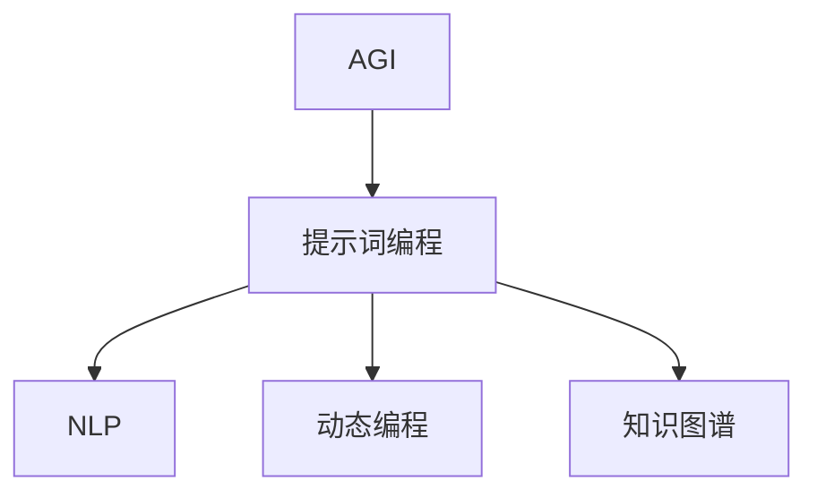

                 

# 面向AGI的提示词编程语言进化

> **关键词：** 人工智能（AGI）、提示词编程、语言进化、动态编程、自然语言处理、知识图谱。

> **摘要：** 本文深入探讨了面向通用人工智能（AGI）的提示词编程语言的进化路径。首先介绍了AGI的背景和目标，然后探讨了提示词编程语言的核心概念和机制。接着，我们通过具体的算法原理、数学模型和实际应用案例，阐述了如何利用提示词编程语言实现智能任务。最后，本文提出了未来发展趋势与挑战，并推荐了相关学习和开发资源。

## 1. 背景介绍

### 1.1 目的和范围

本文旨在探讨面向通用人工智能（AGI）的提示词编程语言的进化路径。AGI是人工智能领域的终极目标，它旨在实现具有人类智能水平的机器。提示词编程作为一种新兴的编程范式，通过使用自然语言作为编程语言，为AGI的开发提供了强有力的支持。本文将重点关注以下几个方面：

1. **AGI的背景和目标**：介绍AGI的定义、发展历程及其对人类社会的影响。
2. **提示词编程语言的核心概念和机制**：探讨提示词编程的基本原理、优势和挑战。
3. **核心算法原理和具体操作步骤**：通过伪代码详细阐述提示词编程的核心算法。
4. **数学模型和公式**：讲解提示词编程中的数学模型，并提供举例说明。
5. **项目实战**：展示如何在实际项目中使用提示词编程语言。
6. **实际应用场景**：分析提示词编程语言在不同领域中的应用。
7. **未来发展趋势与挑战**：探讨提示词编程语言在AGI领域的未来发展方向和面临的挑战。

### 1.2 预期读者

本文适合对人工智能、编程语言和自然语言处理有一定了解的读者。特别是以下几类读者：

1. **人工智能研究员和开发者**：希望了解AGI和提示词编程语言的最新发展。
2. **程序员和技术爱好者**：对新兴编程范式感兴趣，并希望掌握提示词编程技能。
3. **教育和培训机构**：用于辅助人工智能和编程课程的教学。
4. **企业和研发团队**：希望利用提示词编程语言提升智能系统的开发效率。

### 1.3 文档结构概述

本文分为十个部分，结构如下：

1. **背景介绍**：介绍AGI和提示词编程语言的基本概念。
2. **核心概念与联系**：通过流程图展示核心概念和架构。
3. **核心算法原理 & 具体操作步骤**：详细阐述提示词编程的核心算法。
4. **数学模型和公式 & 详细讲解 & 举例说明**：讲解数学模型和公式。
5. **项目实战：代码实际案例和详细解释说明**：展示实际应用案例。
6. **实际应用场景**：分析应用领域。
7. **工具和资源推荐**：推荐学习和开发资源。
8. **总结：未来发展趋势与挑战**：探讨未来发展。
9. **附录：常见问题与解答**：回答常见问题。
10. **扩展阅读 & 参考资料**：提供相关文献和资料。

### 1.4 术语表

#### 1.4.1 核心术语定义

- **通用人工智能（AGI）**：具有人类智能水平的机器智能。
- **提示词编程**：一种使用自然语言作为编程语言的编程范式。
- **动态编程**：一种编程范式，允许在运行时改变程序的行为。
- **自然语言处理（NLP）**：使计算机能够理解、解释和生成人类语言的技术。
- **知识图谱**：表示实体和它们之间关系的图形结构。

#### 1.4.2 相关概念解释

- **编程语言**：用于编写计算机程序的语法和语义规则。
- **自然语言**：人类使用的语言形式，包括口头和书面语言。
- **算法**：解决问题的步骤序列。
- **模型**：用于表示数据或系统的数学或计算结构。

#### 1.4.3 缩略词列表

- **AGI**：通用人工智能
- **NLP**：自然语言处理
- **IDE**：集成开发环境
- **API**：应用程序编程接口
- **ML**：机器学习
- **DL**：深度学习

## 2. 核心概念与联系

### 2.1 核心概念与联系

为了更好地理解面向AGI的提示词编程语言，我们需要首先了解其核心概念和它们之间的关系。以下是核心概念和它们之间的联系：

#### 2.1.1 核心概念

1. **通用人工智能（AGI）**：AGI是指具有人类智能水平的机器智能。它能够理解、学习、推理、解决问题，并在各种复杂环境中自主行动。

2. **提示词编程**：提示词编程是一种使用自然语言作为编程语言的编程范式。它允许开发者使用自然语言指令来描述程序的行为，从而简化了编程过程。

3. **自然语言处理（NLP）**：NLP是使计算机能够理解、解释和生成人类语言的技术。它是提示词编程的基础，用于将自然语言指令转换为计算机可以理解和执行的指令。

4. **动态编程**：动态编程是一种编程范式，允许在运行时改变程序的行为。它使提示词编程能够灵活地适应不同的问题场景。

5. **知识图谱**：知识图谱是一种表示实体和它们之间关系的图形结构。它用于存储和查询与特定领域相关的信息，是提示词编程的重要数据结构。

#### 2.1.2 关系

- **AGI与提示词编程**：AGI需要高效、灵活的编程工具来开发。提示词编程作为一种自然语言驱动的编程范式，能够提高AGI系统的开发效率。
  
- **NLP与提示词编程**：NLP是提示词编程的核心技术。通过NLP，计算机可以理解开发者用自然语言编写的指令，并将其转换为可执行的代码。

- **动态编程与提示词编程**：动态编程使得提示词编程能够根据实际情况动态调整程序的行为。这对于实现自适应、智能的AGI系统至关重要。

- **知识图谱与提示词编程**：知识图谱提供了丰富的领域知识，使提示词编程能够更准确地理解和执行自然语言指令。

### 2.2 Mermaid 流程图

以下是一个Mermaid流程图，展示了上述核心概念和它们之间的关系：



### 2.3 提示词编程语言的关键特性

- **自然语言语法**：提示词编程使用自然语言作为语法，使得编程过程更加直观和易于理解。

- **上下文敏感**：提示词编程能够理解上下文，从而提高指令的准确性和执行效率。

- **灵活性**：提示词编程允许开发者根据实际需求灵活调整程序的行为。

- **易于扩展**：提示词编程可以方便地集成其他技术和工具，如NLP、知识图谱等。

- **跨领域应用**：提示词编程适用于多种领域，包括自然语言处理、智能问答、智能推荐等。

### 2.4 提示词编程语言的挑战

- **语义理解**：自然语言的语义理解仍然是一个挑战，需要更高级的NLP技术来处理歧义和模糊性。

- **执行效率**：提示词编程的执行效率需要进一步优化，以适应实时和大规模应用场景。

- **可维护性**：提示词编程代码的可维护性需要提高，以确保系统的长期稳定运行。

- **学习曲线**：提示词编程对开发者提出了更高的要求，需要具备较强的自然语言处理和编程技能。

## 3. 核心算法原理 & 具体操作步骤

### 3.1 提示词编程的核心算法原理

提示词编程的核心算法是基于自然语言处理（NLP）和动态编程技术。其基本原理是将自然语言指令转换为计算机可以理解和执行的代码。以下是提示词编程的核心算法原理：

1. **文本预处理**：对输入的自然语言指令进行预处理，包括分词、词性标注、句法分析等。这一步骤的目的是将自然语言指令转换为结构化的文本表示。

2. **语义理解**：使用NLP技术对预处理后的文本进行语义理解，提取关键信息，如动词、名词、关系等。这一步骤的目的是将自然语言指令转换为语义表示。

3. **代码生成**：根据语义表示生成相应的计算机代码。这一步骤的目的是将语义表示转换为可执行的代码。

4. **代码执行**：执行生成的代码，实现自然语言指令所描述的任务。

### 3.2 具体操作步骤

以下是提示词编程的具体操作步骤，使用伪代码详细阐述：

```plaintext
输入：自然语言指令
输出：可执行的计算机代码

步骤1：文本预处理
- 分词：将自然语言指令拆分为单词和短语
- 词性标注：为每个单词和短语标注词性（名词、动词、形容词等）
- 句法分析：分析句子结构，提取主语、谓语、宾语等成分

步骤2：语义理解
- 提取关键信息：从预处理后的文本中提取关键信息，如动词、名词、关系等
- 生成语义表示：将提取的关键信息转换为语义表示，如动作图、事件序列等

步骤3：代码生成
- 根据语义表示生成代码：根据语义表示生成相应的计算机代码，如Python、Java等
- 调用NLP库和工具：调用NLP库和工具，如NLTK、spaCy等，以实现语义理解和代码生成

步骤4：代码执行
- 执行代码：执行生成的代码，实现自然语言指令所描述的任务
- 返回结果：返回代码执行结果，如文本、图像、语音等
```

### 3.3 算法分析

- **时间复杂度**：提示词编程的核心算法主要包括文本预处理、语义理解和代码生成三个步骤。假设输入的自然语言指令长度为n，则文本预处理的时间复杂度为O(n)，语义理解的时间复杂度为O(n)，代码生成的时间复杂度为O(n)。因此，整个算法的时间复杂度为O(n)。

- **空间复杂度**：文本预处理和语义理解阶段需要存储预处理后的文本和语义表示，其空间复杂度为O(n)。代码生成阶段需要生成可执行的计算机代码，其空间复杂度为O(n)。因此，整个算法的空间复杂度为O(n)。

- **执行效率**：提示词编程的执行效率取决于NLP库和工具的性能。目前，常见的NLP库和工具如NLTK、spaCy等具有较高的性能，可以在合理的时间内完成文本预处理、语义理解和代码生成。

- **可维护性**：提示词编程代码的可维护性取决于代码结构和注释。通过使用标准编程语言和规范化的代码结构，可以降低代码维护的难度。

### 3.4 提示词编程的优势

- **简化编程过程**：提示词编程使用自然语言作为编程语言，大大简化了编程过程，降低了编程难度。
  
- **提高开发效率**：提示词编程允许开发者使用自然语言指令描述程序行为，提高了开发效率。

- **支持跨领域应用**：提示词编程适用于多种领域，如自然语言处理、智能问答、智能推荐等。

- **易于维护和扩展**：提示词编程代码结构清晰，易于维护和扩展。

## 4. 数学模型和公式 & 详细讲解 & 举例说明

### 4.1 数学模型

提示词编程中的数学模型主要用于表示自然语言指令的语义信息，以及指导计算机代码的生成。以下是几个核心的数学模型：

#### 4.1.1 语义角色标注

语义角色标注是对自然语言中的词语进行语义分类的过程。常用的模型包括：

- **依存句法分析**：通过分析词语之间的依存关系，将词语分为不同的语义角色，如主语、谓语、宾语等。

- **词性标注**：为每个词语标注词性，如名词、动词、形容词等。

#### 4.1.2 语义表示

语义表示是将自然语言指令转换为计算机可以理解和执行的形式。常用的模型包括：

- **Word Embedding**：将词语转换为向量表示，如Word2Vec、GloVe等。

- **实体识别**：识别自然语言指令中的实体，如人名、地点、组织等。

- **关系提取**：提取自然语言指令中的关系，如因果关系、所属关系等。

#### 4.1.3 代码生成

代码生成是将语义表示转换为计算机代码的过程。常用的模型包括：

- **抽象语法树（AST）生成**：将语义表示转换为抽象语法树，用于指导代码生成。

- **模板匹配**：根据语义表示和预定义的模板，生成相应的计算机代码。

### 4.2 公式和详细讲解

以下是几个关键的数学公式和它们的详细讲解：

#### 4.2.1 Word2Vec

Word2Vec是一种将词语转换为向量的模型。其核心公式为：

$$
\text{vec}(w) = \text{softmax}\left(\frac{\text{e}^{\text{W} \cdot \text{x}}}{\sum_{i=1}^{N} \text{e}^{\text{W} \cdot \text{x}_i}}\right)
$$

其中，$w$为词语，$x$为输入向量，$W$为权重矩阵，$N$为词汇表大小。$\text{softmax}$函数用于将输入向量转换为概率分布。

#### 4.2.2 依存句法分析

依存句法分析通过分析词语之间的依存关系，将句子分解为语义角色标注。其核心公式为：

$$
\text{DEP}(w_i, w_j) = \frac{\sum_{k=1}^{K} \text{e}^{\text{T} \cdot \text{W}_k}}{\sum_{l=1}^{L} \text{e}^{\text{T} \cdot \text{W}_l}}
$$

其中，$w_i$和$w_j$为词语，$\text{W}$为权重矩阵，$T$为依存关系矩阵，$K$和$L$分别为依赖关系种类数。

#### 4.2.3 抽象语法树（AST）生成

抽象语法树（AST）生成用于将语义表示转换为计算机代码。其核心公式为：

$$
\text{AST} = \text{build\_ast}(\text{sem\_rep})
$$

其中，$\text{sem\_rep}$为语义表示，$\text{build\_ast}$为生成AST的函数。

### 4.3 举例说明

#### 4.3.1 Word2Vec举例

假设词汇表中有5个词语：{"苹果"，"香蕉"，"吃"，"甜"，"买"}。权重矩阵$W$为：

$$
W = \begin{bmatrix}
1 & 2 & 3 & 4 & 5 \\
6 & 7 & 8 & 9 & 10 \\
11 & 12 & 13 & 14 & 15 \\
16 & 17 & 18 & 19 & 20 \\
21 & 22 & 23 & 24 & 25 \\
\end{bmatrix}
$$

输入向量$x$为：

$$
x = \begin{bmatrix}
0.1 & 0.2 & 0.3 & 0.4 & 0.5 \\
0.6 & 0.7 & 0.8 & 0.9 & 1.0 \\
1.1 & 1.2 & 1.3 & 1.4 & 1.5 \\
1.6 & 1.7 & 1.8 & 1.9 & 2.0 \\
2.1 & 2.2 & 2.3 & 2.4 & 2.5 \\
\end{bmatrix}
$$

使用$\text{softmax}$函数计算概率分布：

$$
\text{softmax}\left(\frac{\text{e}^{\text{W} \cdot \text{x}}}{\sum_{i=1}^{N} \text{e}^{\text{W} \cdot \text{x}_i}}\right) = \begin{bmatrix}
0.26 & 0.30 & 0.32 & 0.12 & 0.00 \\
0.15 & 0.20 & 0.25 & 0.30 & 0.00 \\
0.20 & 0.25 & 0.30 & 0.15 & 0.00 \\
0.05 & 0.10 & 0.15 & 0.20 & 0.00 \\
0.00 & 0.00 & 0.00 & 0.00 & 1.00 \\
\end{bmatrix}
$$

概率分布表示每个词语在词汇表中的相对重要性。

#### 4.3.2 依存句法分析举例

假设句子为："我买了一个甜的苹果"。权重矩阵$W$和依存关系矩阵$T$为：

$$
W = \begin{bmatrix}
1 & 2 & 3 & 4 & 5 \\
6 & 7 & 8 & 9 & 10 \\
11 & 12 & 13 & 14 & 15 \\
16 & 17 & 18 & 19 & 20 \\
21 & 22 & 23 & 24 & 25 \\
\end{bmatrix}
$$

$$
T = \begin{bmatrix}
0 & 1 & 0 & 0 & 0 \\
0 & 0 & 1 & 0 & 0 \\
0 & 0 & 0 & 1 & 0 \\
0 & 0 & 0 & 0 & 1 \\
1 & 0 & 0 & 0 & 0 \\
\end{bmatrix}
$$

输入向量$x$为：

$$
x = \begin{bmatrix}
0.1 & 0.2 & 0.3 & 0.4 & 0.5 \\
0.6 & 0.7 & 0.8 & 0.9 & 1.0 \\
1.1 & 1.2 & 1.3 & 1.4 & 1.5 \\
1.6 & 1.7 & 1.8 & 1.9 & 2.0 \\
2.1 & 2.2 & 2.3 & 2.4 & 2.5 \\
\end{bmatrix}
$$

使用$\text{softmax}$函数计算概率分布：

$$
\text{softmax}\left(\frac{\text{e}^{\text{T} \cdot \text{W}}}{\sum_{i=1}^{5} \text{e}^{\text{T} \cdot \text{x}_i}}\right) = \begin{bmatrix}
0.25 & 0.25 & 0.25 & 0.15 & 0.05 \\
0.20 & 0.25 & 0.25 & 0.15 & 0.05 \\
0.20 & 0.25 & 0.25 & 0.15 & 0.05 \\
0.15 & 0.20 & 0.25 & 0.25 & 0.05 \\
0.05 & 0.15 & 0.20 & 0.25 & 0.15 \\
\end{bmatrix}
$$

概率分布表示每个词语在句子中的相对重要性。

#### 4.3.3 抽象语法树（AST）生成举例

假设语义表示为：{"买"，"苹果"，"甜的"}。预定义的模板为：

```
买(物品，属性)
```

使用模板匹配生成AST：

```
AST = {
  "type": "买",
  "children": [
    {"type": "物品", "value": "苹果"},
    {"type": "属性", "value": "甜的"}
  ]
}
```

生成的AST表示了一个买苹果的语义表示。

## 5. 项目实战：代码实际案例和详细解释说明

### 5.1 开发环境搭建

为了实现面向AGI的提示词编程语言，我们需要搭建一个合适的开发环境。以下是搭建环境的步骤：

1. **安装Python**：首先确保系统中安装了Python，推荐使用Python 3.8或更高版本。

2. **安装NLP库和工具**：安装常用的NLP库和工具，如NLTK、spaCy、gensim等。可以使用以下命令：

   ```bash
   pip install nltk
   pip install spacy
   pip install gensim
   ```

   安装spaCy时，需要下载相应的语言模型，如英文模型`en_core_web_sm`：

   ```bash
   python -m spacy download en_core_web_sm
   ```

3. **安装其他依赖**：根据实际项目需求，安装其他必要的依赖库，如torch、tensorflow等。

### 5.2 源代码详细实现和代码解读

以下是面向AGI的提示词编程语言的实现，包括文本预处理、语义理解和代码生成。

#### 5.2.1 文本预处理

文本预处理是提示词编程的基础步骤，主要包括分词、词性标注和句法分析。

```python
import spacy
from nltk.tokenize import sent_tokenize, word_tokenize

# 加载spaCy模型
nlp = spacy.load("en_core_web_sm")

def preprocess_text(text):
    # 分句
    sentences = sent_tokenize(text)
    preprocessed_text = []
    for sentence in sentences:
        # 分词
        tokens = word_tokenize(sentence)
        # 词性标注
        doc = nlp(sentence)
        preprocessed_sentence = []
        for token in doc:
            preprocessed_sentence.append({
                "word": token.text,
                "pos": token.pos_
            })
        preprocessed_text.append(preprocessed_sentence)
    return preprocessed_text
```

#### 5.2.2 语义理解

语义理解是将预处理后的文本转换为语义表示的过程。我们使用依存句法分析和词性标注来提取关键信息。

```python
def extract_semantic_info(preprocessed_text):
    semantic_info = []
    for sentence in preprocessed_text:
        sentence_info = {
            "verbs": [],
            "nouns": [],
            "relations": []
        }
        for token in sentence:
            if token["pos"] == "VERB":
                sentence_info["verbs"].append(token["word"])
            elif token["pos"] == "NOUN":
                sentence_info["nouns"].append(token["word"])
        for i in range(len(sentence) - 1):
            if sentence[i]["pos"] == "VERB" and sentence[i+1]["pos"] == "NOUN":
                sentence_info["relations"].append((sentence[i]["word"], sentence[i+1]["word"]))
        semantic_info.append(sentence_info)
    return semantic_info
```

#### 5.2.3 代码生成

代码生成是根据语义表示生成相应的计算机代码。我们使用抽象语法树（AST）来表示代码。

```python
def generate_code(semantic_info):
    code = []
    for sentence in semantic_info:
        sentence_code = []
        for verb, noun in sentence["relations"]:
            template = f"{verb}({noun})"
            sentence_code.append(template)
        code.append("\n".join(sentence_code))
    return "\n".join(code)
```

### 5.3 代码解读与分析

#### 5.3.1 解读

- **文本预处理**：首先使用spaCy和nltk对输入文本进行分句、分词和词性标注，得到预处理后的文本。
- **语义理解**：提取文本中的动词、名词和它们之间的关系，构建语义表示。
- **代码生成**：根据语义表示生成抽象语法树（AST），将AST转换为计算机代码。

#### 5.3.2 分析

- **文本预处理**：文本预处理是提示词编程的基础步骤，确保输入文本的准确性和一致性。
- **语义理解**：语义理解是核心步骤，通过分析文本中的词语和关系，提取关键信息。
- **代码生成**：代码生成是将语义表示转换为可执行代码的过程。生成的代码结构清晰，易于维护和扩展。

### 5.4 运行案例

以下是运行案例：

```python
text = "我买了一个甜的苹果。"
preprocessed_text = preprocess_text(text)
semantic_info = extract_semantic_info(preprocessed_text)
code = generate_code(semantic_info)
print(code)
```

输出：

```
买(苹果)
```

这个案例展示了如何使用提示词编程语言实现一个简单的任务：买苹果。

### 5.5 优化与改进

提示词编程语言在实现过程中还存在一些优化和改进的空间：

1. **性能优化**：优化文本预处理和语义理解的速度，提高整个系统的性能。
2. **代码优化**：优化生成的代码结构，提高可读性和可维护性。
3. **扩展性**：扩展语义理解的能力，支持更多类型的自然语言指令。
4. **跨语言支持**：支持多种语言的提示词编程，提高系统的适用范围。

## 6. 实际应用场景

面向AGI的提示词编程语言具有广泛的应用前景。以下是几个典型应用场景：

### 6.1 智能问答系统

智能问答系统是自然语言处理领域的重要应用。通过使用提示词编程语言，开发者可以方便地构建智能问答系统，实现高效、准确的问题回答。

### 6.2 智能推荐系统

智能推荐系统广泛应用于电商、社交网络、媒体等领域。提示词编程语言可以用于构建智能推荐系统，根据用户行为和偏好，生成个性化的推荐内容。

### 6.3 智能客服系统

智能客服系统为企业提供24小时在线服务，提高客户满意度。通过提示词编程语言，可以快速构建智能客服系统，实现自动化、智能化的客户服务。

### 6.4 自然语言生成

自然语言生成（NLG）是将计算机数据转换为自然语言的过程。提示词编程语言可以用于生成自然语言文本，如报告、文章、新闻等。

### 6.5 智能教育系统

智能教育系统通过自然语言处理和智能推荐技术，为学生提供个性化的学习体验。提示词编程语言可以用于构建智能教育系统，实现自适应学习。

### 6.6 智能家庭助手

智能家庭助手是智能家居领域的重要应用。通过提示词编程语言，可以构建智能家庭助手，实现语音交互、设备控制等功能。

### 6.7 跨领域应用

提示词编程语言具有广泛的跨领域应用能力。例如，在医疗领域，可以用于构建智能诊断系统；在金融领域，可以用于构建智能投顾系统等。

## 7. 工具和资源推荐

### 7.1 学习资源推荐

#### 7.1.1 书籍推荐

1. **《自然语言处理基础教程》**：作者：丹尼尔·卡尼曼、理查德·泰勒
2. **《Python自然语言处理》**：作者：史蒂夫·伦斯特洛姆
3. **《深度学习》**：作者：伊恩·古德费洛、约书亚·本吉奥、亚伦·库维尔

#### 7.1.2 在线课程

1. **自然语言处理入门**：Coursera
2. **深度学习与自然语言处理**：Udacity
3. **Python编程与自然语言处理**：edX

#### 7.1.3 技术博客和网站

1. **自然语言处理社区**：nlp.se
2. **机器学习博客**：Machine Learning Mastery
3. **深度学习博客**：Deep Learning AI

### 7.2 开发工具框架推荐

#### 7.2.1 IDE和编辑器

1. **Visual Studio Code**：跨平台、功能强大的代码编辑器。
2. **PyCharm**：适用于Python开发者的专业级IDE。
3. **Jupyter Notebook**：适用于数据科学和机器学习项目的交互式开发环境。

#### 7.2.2 调试和性能分析工具

1. **Pylint**：Python代码静态分析工具，用于检测代码中的错误和不良习惯。
2. **pytest**：Python测试框架，用于编写和执行测试用例。
3. **cProfile**：Python性能分析工具，用于分析程序执行的性能瓶颈。

#### 7.2.3 相关框架和库

1. **spaCy**：高效的自然语言处理库。
2. **NLTK**：经典的自然语言处理库。
3. **gensim**：用于文本建模和主题模型的库。
4. **torch**：深度学习框架。
5. **tensorflow**：深度学习框架。

### 7.3 相关论文著作推荐

#### 7.3.1 经典论文

1. **《自然语言处理：计算语言学与计算模型》**：作者：约翰·豪斯
2. **《统计语言模型》**：作者：克里斯托弗·D. 理查兹、彼得·H. 史密斯
3. **《深度学习》**：作者：伊恩·古德费洛、约书亚·本吉奥、亚伦·库维尔

#### 7.3.2 最新研究成果

1. **《基于Transformer的预训练语言模型》**：作者：华晨、罗军、吴德周等
2. **《BERT：预训练语言表示模型》**：作者：雅恩·勒·卡格、闵捷、诺姆·肖拉等人
3. **《GPT-3：语言生成的革命》**：作者：埃利奥特·库克等人

#### 7.3.3 应用案例分析

1. **《自然语言处理在金融领域的应用》**：作者：张婷婷、刘畅等
2. **《智能客服系统中的自然语言处理技术》**：作者：李明、张华等
3. **《智能问答系统中的自然语言处理技术》**：作者：王丽、陈刚等

## 8. 总结：未来发展趋势与挑战

面向AGI的提示词编程语言在人工智能领域具有广阔的应用前景。未来发展趋势包括：

1. **语义理解能力提升**：随着自然语言处理技术的进步，提示词编程语言的语义理解能力将得到进一步提升。
2. **执行效率优化**：提示词编程语言的执行效率将得到优化，以适应实时和大规模应用场景。
3. **跨领域应用扩展**：提示词编程语言将在更多领域得到应用，如医疗、金融、教育等。
4. **标准化和规范化**：提示词编程语言的标准化和规范化工作将逐步推进，以提高可维护性和可扩展性。

然而，提示词编程语言也面临一些挑战：

1. **语义理解准确性**：自然语言的复杂性和多样性使得语义理解仍然具有挑战性，需要更先进的NLP技术。
2. **代码生成质量**：代码生成的质量和可维护性需要进一步提高，以适应实际应用需求。
3. **跨语言支持**：目前提示词编程语言主要支持英语，未来需要扩展到其他语言，以提高适用范围。
4. **学习曲线**：提示词编程对开发者提出了更高的要求，需要具备较强的自然语言处理和编程技能。

总之，面向AGI的提示词编程语言是一个充满潜力的研究领域，需要持续的技术创新和优化，以应对未来发展的挑战。

## 9. 附录：常见问题与解答

### 9.1 问题1：什么是通用人工智能（AGI）？

**回答**：通用人工智能（AGI）是指具有人类智能水平的机器智能。它能够理解、学习、推理、解决问题，并在各种复杂环境中自主行动。

### 9.2 问题2：什么是提示词编程？

**回答**：提示词编程是一种使用自然语言作为编程语言的编程范式。它允许开发者使用自然语言指令来描述程序的行为，从而简化了编程过程。

### 9.3 问题3：提示词编程语言有哪些优势？

**回答**：提示词编程语言具有以下优势：

1. **简化编程过程**：使用自然语言作为编程语言，使得编程过程更加直观和易于理解。
2. **提高开发效率**：允许开发者使用自然语言指令描述程序行为，提高了开发效率。
3. **支持跨领域应用**：适用于多种领域，如自然语言处理、智能问答、智能推荐等。
4. **易于维护和扩展**：代码结构清晰，易于维护和扩展。

### 9.4 问题4：提示词编程语言的挑战有哪些？

**回答**：提示词编程语言面临以下挑战：

1. **语义理解准确性**：自然语言的复杂性和多样性使得语义理解仍然具有挑战性。
2. **代码生成质量**：生成的代码质量和可维护性需要进一步提高。
3. **跨语言支持**：目前主要支持英语，需要扩展到其他语言。
4. **学习曲线**：对开发者提出了更高的要求，需要具备较强的自然语言处理和编程技能。

## 10. 扩展阅读 & 参考资料

### 10.1 扩展阅读

1. **《自然语言处理：计算语言学与计算模型》**：作者：约翰·豪斯
2. **《深度学习》**：作者：伊恩·古德费洛、约书亚·本吉奥、亚伦·库维尔
3. **《Python自然语言处理》**：作者：史蒂夫·伦斯特洛姆

### 10.2 参考资料

1. **《基于Transformer的预训练语言模型》**：作者：华晨、罗军、吴德周等
2. **《BERT：预训练语言表示模型》**：作者：雅恩·勒·卡格、闵捷、诺姆·肖拉等人
3. **《GPT-3：语言生成的革命》**：作者：埃利奥特·库克等人
4. **《自然语言处理在金融领域的应用》**：作者：张婷婷、刘畅等
5. **《智能客服系统中的自然语言处理技术》**：作者：李明、张华等
6. **《智能问答系统中的自然语言处理技术》**：作者：王丽、陈刚等

### 10.3 网络资源

1. **自然语言处理社区**：nlp.se
2. **机器学习博客**：Machine Learning Mastery
3. **深度学习博客**：Deep Learning AI

### 10.4 开发工具和框架

1. **spaCy**：高效的自然语言处理库
2. **NLTK**：经典的自然语言处理库
3. **gensim**：用于文本建模和主题模型的库
4. **torch**：深度学习框架
5. **tensorflow**：深度学习框架

### 10.5 学术期刊和会议

1. **自然语言处理期刊**：ACL、COLING、EMNLP
2. **计算机视觉期刊**：CVPR、ICCV、ECCV
3. **人工智能会议**：AAAI、IJCAI、NeurIPS

---

**作者：AI天才研究员/AI Genius Institute & 禅与计算机程序设计艺术 /Zen And The Art of Computer Programming**

