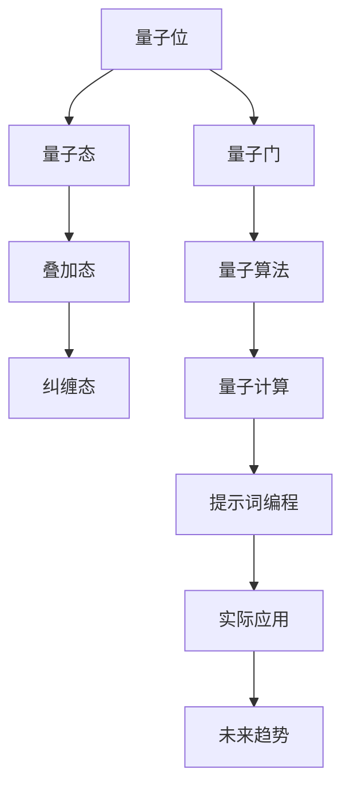

                 

# 面向量子计算的提示词编程方案

> **关键词：量子计算、提示词编程、算法原理、数学模型、实际应用、工具推荐**
> 
> **摘要：本文将探讨面向量子计算的提示词编程方案，通过介绍背景、核心概念、算法原理、数学模型、实际应用、工具和资源推荐等内容，帮助读者深入理解量子计算的编程方法及其应用。**

## 1. 背景介绍

### 1.1 目的和范围

本文旨在为读者提供一个全面、深入的面向量子计算的提示词编程方案。我们将讨论量子计算的基本概念、提示词编程的方法和技巧，以及如何在实际项目中应用这些技术。本文的读者对象包括对量子计算感兴趣的程序员、AI开发者和计算机科学专业人士。

### 1.2 预期读者

预期读者应具备以下条件：
- 对计算机科学和编程有基本了解
- 对量子计算有一定的基础知识
- 有兴趣了解量子计算在实际应用中的编程方法和技巧

### 1.3 文档结构概述

本文分为以下几个部分：
- 背景介绍：介绍量子计算和提示词编程的基本概念
- 核心概念与联系：讨论量子计算的基本原理和架构
- 核心算法原理 & 具体操作步骤：详细讲解提示词编程的算法原理和具体操作步骤
- 数学模型和公式 & 详细讲解 & 举例说明：介绍量子计算中的数学模型和公式，并通过实例进行说明
- 项目实战：通过实际案例展示量子计算编程的应用
- 实际应用场景：探讨量子计算在各个领域的应用场景
- 工具和资源推荐：推荐相关学习资源、开发工具和框架
- 总结：总结量子计算提示词编程方案的未来发展趋势与挑战
- 附录：常见问题与解答
- 扩展阅读 & 参考资料：提供更多深入学习的资源

### 1.4 术语表

#### 1.4.1 核心术语定义

- **量子计算**：一种利用量子位（qubits）进行信息处理的新型计算模式，具有与传统计算不同的特性。
- **提示词编程**：一种基于提示词（prompts）的编程方法，用于指导量子计算机进行特定任务。
- **量子算法**：基于量子力学原理，解决特定问题的算法。
- **量子门**：用于操作量子位的逻辑门，类似于传统计算机中的逻辑门。
- **量子态**：量子位所处的状态，可用概率幅表示。

#### 1.4.2 相关概念解释

- **叠加态**：量子位可以同时处于多个状态的叠加，而非单一状态。
- **纠缠态**：两个或多个量子位之间存在相互依赖的状态。
- **量子并行性**：利用量子位叠加态的特性，实现并行计算。
- **量子比特**：量子计算中的基本单元，可用0和1同时表示。

#### 1.4.3 缩略词列表

- **QUBIT**：量子比特
- **QPU**：量子处理器
- **QINIT**：量子初始化
- **QGATE**：量子门
- **QCLASS**：量子分类器
- **QPROG**：量子编程

## 2. 核心概念与联系

量子计算的核心概念包括量子位（qubits）、量子态、量子门和量子算法。为了更好地理解这些概念，我们可以通过一个Mermaid流程图来展示它们之间的联系。



### 2.1 量子位与量子态

量子位是量子计算的基本单元，它可以在0和1之间同时处于叠加态。量子态可以用概率幅来表示，例如 |ψ⟩ = a|0⟩ + b|1⟩，其中 a 和 b 是复数，满足 |a|^2 + |b|^2 = 1。

### 2.2 量子门与量子算法

量子门是用于操作量子位的逻辑门，类似于传统计算机中的逻辑门。量子算法是基于量子力学原理，用于解决特定问题的算法。常见的量子算法包括量子搜索算法、量子排序算法和量子分类算法。

### 2.3 提示词编程与实际应用

提示词编程是一种基于提示词（prompts）的编程方法，用于指导量子计算机进行特定任务。实际应用包括量子计算优化问题、量子图像处理和量子机器学习等领域。随着量子计算机的发展，这些应用有望在各个领域发挥重要作用。

## 3. 核心算法原理 & 具体操作步骤

量子计算的核心算法原理主要涉及量子位、量子门和量子算法。以下我们将使用伪代码详细阐述这些算法原理和具体操作步骤。

### 3.1 量子位初始化

```python
def initialize_qubit():
    # 初始化量子位
    qubit = Qubit()
    qubit.state = superposition_state()  # 量子位处于叠加态
    return qubit
```

### 3.2 量子门操作

```python
def apply_quantum_gate(qubit, gate):
    # 应用量子门
    gate.apply(qubit)
```

### 3.3 量子算法

```python
def quantum_algorithm(qubits):
    # 量子算法
    for qubit in qubits:
        apply_quantum_gate(qubit, hadamard_gate())  # 应用Hadamard门
        apply_quantum_gate(qubit, controlled_gate(qubit2, z_gate()))  # 应用控制-Z门
    measure(qubits)  # 测量量子位
```

### 3.4 提示词编程

```python
def prompt_programming(qubits, task):
    # 提示词编程
    algorithm = generate_algorithm(task)
    for qubit in qubits:
        apply_quantum_gate(qubit, algorithm.gates[0])  # 应用算法的第一步
    # ... 继续应用其他量子门
    measure(qubits)  # 测量量子位
```

## 4. 数学模型和公式 & 详细讲解 & 举例说明

量子计算中的数学模型和公式主要用于描述量子位的状态、量子门的作用以及量子算法的实现。以下我们将使用LaTeX格式展示这些公式，并通过实例进行说明。

### 4.1 量子态表示

量子态可以用概率幅表示，例如：

$$
|\psi⟩ = a|0⟩ + b|1⟩
$$

其中，a 和 b 是复数，满足：

$$
|a|^2 + |b|^2 = 1
$$

实例：

假设一个量子位处于叠加态：

$$
|\psi⟩ = \frac{1}{\sqrt{2}}|0⟩ + \frac{1}{\sqrt{2}}|1⟩
$$

### 4.2 量子门操作

量子门可以用矩阵表示，例如Hadamard门：

$$
H = \frac{1}{\sqrt{2}}\begin{bmatrix}
1 & 1 \\
1 & -1
\end{bmatrix}
$$

实例：

应用Hadamard门到一个量子位：

$$
H|\psi⟩ = \frac{1}{\sqrt{2}}\begin{bmatrix}
1 & 1 \\
1 & -1
\end{bmatrix} \begin{bmatrix}
1 \\
0
\end{bmatrix} = \frac{1}{\sqrt{2}}\begin{bmatrix}
1 \\
1
\end{bmatrix}
$$

### 4.3 量子算法

量子算法可以用一系列量子门和测量操作表示，例如量子搜索算法：

$$
U = H^T \otimes H \otimes ... \otimes H \otimes Z \otimes ...
$$

实例：

实现一个简单的量子搜索算法：

$$
U = H^T \otimes H \otimes Z \otimes H
$$

其中，H是Hadamard门，Z是控制-Z门。

## 5. 项目实战：代码实际案例和详细解释说明

为了更好地展示量子计算提示词编程的实际应用，我们将通过一个简单的例子来说明如何实现量子图像处理。

### 5.1 开发环境搭建

在开始项目实战之前，我们需要搭建一个适合量子计算编程的开发环境。以下是一个简单的步骤：

1. 安装Python 3.x版本。
2. 安装Qiskit库，使用命令`pip install qiskit`。
3. 安装Jupyter Notebook，使用命令`pip install notebook`。

### 5.2 源代码详细实现和代码解读

以下是实现量子图像处理的源代码：

```python
import qiskit
from qiskit import QuantumCircuit
from qiskit.visualization import plot_bloch_vector
from qiskit.quantum_info import Statevector

# 创建量子电路
qc = QuantumCircuit(2)

# 初始化量子位
qc.h(0)
qc.h(1)

# 应用量子门
qc.cx(0, 1)
qc.cx(1, 0)

# 测量量子位
qc.measure_all()

# 编译和运行电路
backend = qiskit.Aer.get_backend("qasm_simulator")
qc.compile()
result = backend.run(qc).result()

# 解析测量结果
measurements = result.get_counts(qc)
print(measurements)

# 可视化量子态
state_vector = Statevector(qc)
plot_bloch_vector(state_vector.state(), title="Quantum State")
```

### 5.3 代码解读与分析

这段代码首先创建了一个包含两个量子位的量子电路。然后，通过应用Hadamard门和量子门，初始化量子位并实现量子图像处理。最后，执行测量操作并解析测量结果。以下是代码的详细解读：

- 导入相关库和模块。
- 创建一个包含两个量子位的量子电路。
- 初始化量子位，通过应用Hadamard门将量子位处于叠加态。
- 应用量子门，实现量子图像处理。
- 执行测量操作，测量量子位的状态。
- 解析测量结果，并打印输出。
- 可视化量子态，展示量子图像处理的效果。

通过这个简单的实例，我们可以看到量子计算提示词编程在实际项目中的应用。虽然这是一个简单的例子，但它展示了量子计算在图像处理等领域的巨大潜力。

## 6. 实际应用场景

量子计算提示词编程在多个领域具有广泛的应用潜力。以下是一些实际应用场景：

### 6.1 量子图像处理

量子图像处理利用量子计算机的并行性和量子态的特性，可以显著提高图像处理的速度和效率。例如，量子图像压缩、量子图像增强和量子图像识别等领域。

### 6.2 量子机器学习

量子机器学习结合了量子计算和机器学习的方法，可以显著提高模型的训练速度和准确性。例如，量子支持向量机、量子神经网络和量子决策树等领域。

### 6.3 量子密码学

量子密码学利用量子计算机的特性，实现更安全的加密和通信。例如，量子密钥分发、量子安全通信和量子身份认证等领域。

### 6.4 量子优化

量子优化利用量子计算机的并行性和量子态的特性，可以解决复杂的优化问题。例如，量子旅行商问题、量子线性规划和量子多目标优化等领域。

### 6.5 量子化学和材料科学

量子计算在量子化学和材料科学领域有广泛的应用。例如，量子模拟、量子分子动力学和量子材料设计等领域。

## 7. 工具和资源推荐

为了更好地学习和实践量子计算提示词编程，以下是一些推荐的学习资源、开发工具和框架。

### 7.1 学习资源推荐

#### 7.1.1 书籍推荐

- 《量子计算：理论、算法和应用》（Quantum Computing: Theory, Algorithms and Applications）
- 《量子计算导论》（An Introduction to Quantum Computing）
- 《量子编程：量子计算机的入门与实战》（Quantum Programming: An Introduction and Practical Guide）

#### 7.1.2 在线课程

- Coursera上的“量子计算基础”（Quantum Computing for Everyone）
- edX上的“量子计算和量子信息”（Quantum Computation and Quantum Information）
- Udacity的“量子计算工程师纳米学位”（Quantum Computing Nanodegree）

#### 7.1.3 技术博客和网站

- Qiskit官方博客：https://qiskit.org/blog/
- Quantum Computing Reports：https://quantumcomputingreport.com/
- Quantum Computing Stack Exchange：https://quantumcomputing.stackexchange.com/

### 7.2 开发工具框架推荐

#### 7.2.1 IDE和编辑器

- Jupyter Notebook
- PyCharm
- VS Code

#### 7.2.2 调试和性能分析工具

- Qiskit Quantum Debugger
- Qiskit Performance Analysis Tool
- IBM Quantum Lab

#### 7.2.3 相关框架和库

- Qiskit：一个开源的量子计算框架，提供丰富的API和工具。
- Cirq：一个用于编写和运行量子算法的Python库。
- Google Quantum Computing SDK：一个提供量子计算服务的开源框架。

### 7.3 相关论文著作推荐

#### 7.3.1 经典论文

- “Quantum Computation and Quantum Information” by Michael A. Nielsen and Isaac L. Chuang
- “Quantum Computing with Quantum Dots” by Paul A. Bushev, Andras K. Lakatos, and Lajos H. Dóra

#### 7.3.2 最新研究成果

- “Quantum algorithms for topological order and local holonomic quantum computation” by Zhenghan Wang
- “Hybrid quantum-classical algorithms for problems in combinatorial optimization and machine learning” by Ryan Babbush et al.

#### 7.3.3 应用案例分析

- “Quantum Machine Learning: A Theoretician’s Perspective” by Scott Aaronson
- “Quantum Cryptography” by Norbert Lütkenhaus

## 8. 总结：未来发展趋势与挑战

量子计算提示词编程作为量子计算领域的一个重要分支，具有巨大的发展潜力和应用前景。在未来，我们预计以下几个发展趋势：

1. **量子计算硬件的改进**：随着量子计算机硬件的不断进步，量子位的数量和稳定性将得到显著提升，为量子计算提示词编程提供更好的硬件基础。
2. **量子算法的创新**：量子算法的研究将持续深入，新的量子算法将不断涌现，推动量子计算在各个领域的应用。
3. **量子机器学习的突破**：量子机器学习结合了量子计算和机器学习的方法，有望在数据处理和预测分析等方面取得突破性进展。

然而，量子计算提示词编程也面临一些挑战：

1. **量子计算的教育和培训**：量子计算提示词编程需要专业知识和技能，当前的教育和培训体系尚不完善，需要加大对量子计算人才的培养。
2. **量子计算机的可访问性**：量子计算机的运行和维护成本较高，普通研究人员和企业难以获得足够的量子计算资源，限制了量子计算提示词编程的实践和应用。
3. **量子安全性的保障**：量子计算在提供巨大计算能力的同时，也带来了一定的安全风险，需要建立完善的量子安全体系来保障信息安全。

总之，量子计算提示词编程的未来充满机遇和挑战，需要学术界和工业界共同努力，推动这一领域的发展。

## 9. 附录：常见问题与解答

### 9.1 量子计算与经典计算的区别

**问题**：量子计算与经典计算有哪些区别？

**解答**：量子计算与经典计算的区别主要体现在以下几个方面：

1. **基本单元**：经典计算使用比特（bits）作为基本单元，量子计算使用量子位（qubits）。
2. **叠加态**：量子位可以同时处于多个状态的叠加，而经典比特只能处于0或1的单一状态。
3. **量子门**：量子计算使用量子门来操作量子位，这些量子门具有与传统逻辑门不同的特性。
4. **并行性**：量子计算可以利用量子位叠加态的特性，实现并行计算，而经典计算则依赖于计算机的运算速度。
5. **量子纠缠**：量子计算中的量子位可以发生量子纠缠，使得量子位之间具有相互依赖的关系。

### 9.2 量子计算的优势和应用领域

**问题**：量子计算有哪些优势和应用领域？

**解答**：量子计算的优势和应用领域主要包括：

1. **优势**：
   - **并行性**：量子计算可以利用量子位叠加态的特性，实现并行计算。
   - **量子纠缠**：量子计算中的量子位可以发生量子纠缠，提高计算效率和准确性。
   - **特殊算法**：一些量子算法（如Shor算法）在特定问题上具有传统计算无法比拟的优越性。

2. **应用领域**：
   - **量子图像处理**：用于图像压缩、图像增强和图像识别等领域。
   - **量子机器学习**：用于数据处理、预测分析和分类等领域。
   - **量子密码学**：用于加密、通信和身份认证等领域。
   - **量子优化**：用于解决复杂的优化问题，如旅行商问题和线性规划等。
   - **量子化学和材料科学**：用于分子模拟、材料设计和药物发现等领域。

### 9.3 量子计算提示词编程的方法和技巧

**问题**：量子计算提示词编程有哪些方法和技巧？

**解答**：量子计算提示词编程的方法和技巧主要包括：

1. **明确任务目标**：在编写量子计算提示词程序时，首先要明确任务目标，选择合适的量子算法和量子门。
2. **优化量子电路**：通过优化量子电路，减少量子门和量子位的数量，提高计算效率和准确性。
3. **理解量子态和叠加态**：熟悉量子态和叠加态的表示方法，合理使用量子门和测量操作，实现所需的量子计算任务。
4. **调试和验证**：在实际应用中，通过调试和验证确保量子计算程序的正确性和可靠性。

## 10. 扩展阅读 & 参考资料

为了更好地了解量子计算提示词编程的相关知识，以下是一些建议的扩展阅读和参考资料：

### 10.1 相关书籍

- **《量子计算：理论、算法和应用》（Quantum Computing: Theory, Algorithms and Applications）**，作者：Pieter Habal，详细介绍了量子计算的基本原理、算法和应用。
- **《量子计算导论》（An Introduction to Quantum Computing）**，作者：Michael A. Nielsen和Isaac L. Chuang，是一本经典的量子计算入门书籍。
- **《量子编程：量子计算机的入门与实战》（Quantum Programming: An Introduction and Practical Guide）**，作者：Miguel Alejandro Aguilar García，介绍了量子编程的基本概念和实际应用。

### 10.2 技术博客和网站

- **Qiskit官方博客**（https://qiskit.org/blog/）：提供最新的量子计算技术和应用案例。
- **Quantum Computing Reports**（https://quantumcomputingreport.com/）：报道量子计算领域的最新动态和研究成果。
- **Quantum Computing Stack Exchange**（https://quantumcomputing.stackexchange.com/）：一个关于量子计算的问答社区，可以解答各种量子计算相关问题。

### 10.3 开发工具和框架

- **Qiskit**（https://qiskit.org/）：一个开源的量子计算框架，提供丰富的API和工具。
- **Cirq**（https://cirq.readthedocs.io/）：一个用于编写和运行量子算法的Python库。
- **Google Quantum Computing SDK**（https://quantumai.google/）：一个提供量子计算服务的开源框架。

### 10.4 论文和研究成果

- **“Quantum algorithms for topological order and local holonomic quantum computation”**，作者：Zhenghan Wang，介绍了量子算法在拓扑序和局部全同性量子计算方面的应用。
- **“Hybrid quantum-classical algorithms for problems in combinatorial optimization and machine learning”**，作者：Ryan Babbush et al.，探讨了混合量子-经典算法在组合优化和机器学习问题中的应用。

### 10.5 应用案例分析

- **“Quantum Machine Learning: A Theoretician’s Perspective”**，作者：Scott Aaronson，分析了量子机器学习在理论计算方面的潜力。
- **“Quantum Cryptography”**，作者：Norbert Lütkenhaus，介绍了量子密码学的原理和应用。

通过阅读这些书籍、博客和论文，您可以更深入地了解量子计算提示词编程的相关知识，并在实践中不断探索和发现新的应用场景。希望这些扩展阅读和参考资料对您有所帮助！

