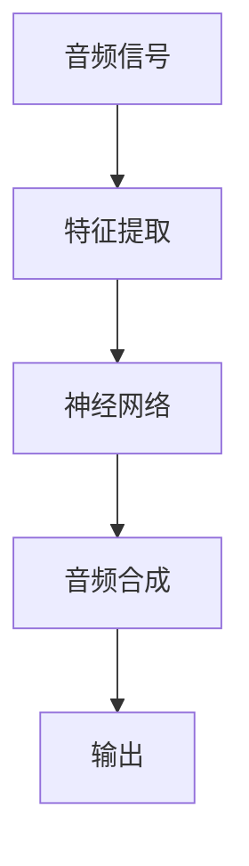

                 

# 音频生成(Audio Generation) - 原理与代码实例讲解

> 
> **关键词：** 音频生成、音频处理、机器学习、神经网络、深度学习、音频合成

> **摘要：** 本文将深入探讨音频生成的原理和技术，通过一步步分析推理，介绍核心算法、数学模型及实际代码实例，帮助读者全面理解这一前沿技术，并掌握其实际应用。

## 1. 背景介绍

### 1.1 目的和范围

本文旨在介绍音频生成技术的基本原理、核心算法及其在实际应用中的实现。通过对音频生成的深入分析，读者将了解如何从数据预处理、模型训练到音频合成的各个环节。本文重点讨论的音频生成技术包括：

- **自动语音合成（Text-to-Speech, TTS）**
- **音乐生成**
- **声音效果合成**

### 1.2 预期读者

本文适合对音频处理和机器学习有一定了解的读者，包括但不限于：

- **AI研究人员**
- **软件开发工程师**
- **音频工程师**
- **对音频生成技术感兴趣的其他读者**

### 1.3 文档结构概述

本文结构如下：

1. **背景介绍**：概述音频生成技术的目的、范围和预期读者。
2. **核心概念与联系**：介绍音频生成相关的核心概念和架构。
3. **核心算法原理与具体操作步骤**：讲解音频生成算法的基本原理和具体实现。
4. **数学模型和公式**：介绍音频生成中涉及的数学模型及其应用。
5. **项目实战**：通过实际代码案例展示音频生成技术的应用。
6. **实际应用场景**：分析音频生成技术在不同领域的应用。
7. **工具和资源推荐**：推荐学习资源和开发工具。
8. **总结**：探讨未来发展趋势与挑战。
9. **附录**：常见问题与解答。
10. **扩展阅读**：提供进一步的参考资料。

### 1.4 术语表

#### 1.4.1 核心术语定义

- **音频生成（Audio Generation）**：指使用算法生成新的音频信号的过程。
- **自动语音合成（TTS）**：将文本转换为语音的过程。
- **神经网络（Neural Network）**：一种模拟生物神经系统的计算模型。
- **深度学习（Deep Learning）**：神经网络的一种，具有多个隐藏层。

#### 1.4.2 相关概念解释

- **特征工程**：将原始数据转换为适合模型训练的特征的过程。
- **卷积神经网络（CNN）**：一种用于图像和音频处理的神经网络。
- **循环神经网络（RNN）**：一种用于序列数据处理和时间序列分析的神经网络。

#### 1.4.3 缩略词列表

- **TTS**：Text-to-Speech
- **CNN**：Convolutional Neural Network
- **RNN**：Recurrent Neural Network
- **DNN**：Deep Neural Network

## 2. 核心概念与联系

在深入探讨音频生成技术之前，我们需要了解一些核心概念和它们之间的联系。以下是音频生成技术涉及的一些关键概念和它们的交互流程：



### 2.1 音频信号与特征提取

音频信号是音频生成的基础。音频信号可以理解为时间序列的声波振动。特征提取是将原始音频信号转换为适合神经网络处理的形式。常见的方法包括：

- **梅尔频率倒谱系数（MFCC）**：一种常用的音频特征提取方法，用于捕捉音频信号的频谱特征。
- **谱图**：将音频信号转换为二维图像，便于神经网络处理。

### 2.2 神经网络

神经网络是音频生成技术的核心。神经网络通过学习输入数据和对应的输出数据，学会生成新的音频信号。常见用于音频生成的神经网络包括：

- **卷积神经网络（CNN）**：适用于处理二维数据，如谱图。
- **循环神经网络（RNN）**：适用于处理序列数据，如时间序列音频信号。

### 2.3 音频合成

音频合成是将神经网络生成的音频特征转换为实际音频信号的过程。常见的音频合成方法包括：

- **加性合成**：将不同的声波叠加生成新的音频信号。
- **波形叠加合成**：将多个音频波形叠加生成新的音频信号。

### 2.4 输出

最终生成的音频信号就是输出。输出可以是预定的语音、音乐或特定声音效果。

## 3. 核心算法原理 & 具体操作步骤

### 3.1 自动语音合成（TTS）

自动语音合成（TTS）是将文本转换为语音的过程。以下是TTS算法的基本原理和具体操作步骤：

#### 3.1.1 数据预处理

1. **文本处理**：将输入文本转换为语音合成需要的格式，如拼音或音素。
2. **语音库准备**：收集并准备用于训练的语音库，确保语音库覆盖所需的语音特征。

#### 3.1.2 特征提取

1. **声学特征提取**：从语音库中提取声学特征，如频谱、共振峰等。
2. **语言特征提取**：提取文本的语言特征，如音调、节奏等。

#### 3.1.3 神经网络训练

1. **声学模型训练**：使用声学特征训练声学模型，使其能够预测音频信号。
2. **语言模型训练**：使用语言特征训练语言模型，使其能够预测文本序列。

#### 3.1.4 音频合成

1. **声学特征预测**：输入文本，使用声学模型预测相应的声学特征。
2. **音频信号生成**：使用音频合成方法生成音频信号。

### 3.2 音乐生成

音乐生成是指通过算法生成新的音乐作品。以下是音乐生成算法的基本原理和具体操作步骤：

#### 3.2.1 数据预处理

1. **音频数据收集**：收集用于训练的音频数据，如乐曲、旋律等。
2. **特征提取**：提取音频数据中的特征，如音高、节奏等。

#### 3.2.2 模型训练

1. **旋律生成模型训练**：使用旋律特征训练旋律生成模型。
2. **和声生成模型训练**：使用和声特征训练和声生成模型。

#### 3.2.3 音乐合成

1. **旋律合成**：输入旋律特征，使用旋律生成模型生成旋律。
2. **和声合成**：输入和声特征，使用和声生成模型生成和声。
3. **音频信号生成**：将旋律和和声合成，生成完整的音乐作品。

### 3.3 声音效果合成

声音效果合成是指生成特定的声音效果，如混响、回声等。以下是声音效果合成算法的基本原理和具体操作步骤：

#### 3.3.1 数据预处理

1. **声音效果数据收集**：收集用于训练的声音效果数据，如混响、回声等。
2. **特征提取**：提取声音效果的特征，如时间延迟、衰减等。

#### 3.3.2 模型训练

1. **效果生成模型训练**：使用声音效果特征训练效果生成模型。
2. **效果参数预测**：输入声音特征，使用效果生成模型预测相应的效果参数。

#### 3.3.3 声音合成

1. **效果参数预测**：输入声音特征，使用效果生成模型预测相应的效果参数。
2. **音频信号生成**：根据预测的效果参数生成相应的声音效果。

## 4. 数学模型和公式 & 详细讲解 & 举例说明

### 4.1 自动语音合成（TTS）

#### 4.1.1 声学模型

声学模型是TTS的核心组成部分，用于预测音频信号。常见的声学模型包括：

1. **HMM-HMM（隐马尔可夫模型-隐马尔可夫模型）**：

   $$ P(\text{语音}|T) = \prod_{t=1}^{T} P(\text{帧}|\text{状态}) \times P(\text{状态}|\text{前状态}) $$

   其中，\( T \) 表示时间步数，\( T \) 表示状态数。

2. **DNN-HMM（深度神经网络-隐马尔可夫模型）**：

   $$ P(\text{语音}|T) = \prod_{t=1}^{T} P(\text{帧}|\text{状态}, \text{网络}) \times P(\text{状态}|\text{前状态}) $$

   其中，\( T \) 表示时间步数，\( T \) 表示状态数，\( \text{网络} \) 表示深度神经网络。

#### 4.1.2 语言模型

语言模型用于预测文本序列。常见的语言模型包括：

1. **n-gram语言模型**：

   $$ P(\text{文本}) = \prod_{i=1}^{n} P(w_i | w_1, w_2, ..., w_{i-1}) $$

   其中，\( n \) 表示n-gram的长度，\( w_i \) 表示第\( i \)个单词。

2. **神经网络语言模型**：

   $$ P(\text{文本}) = \prod_{i=1}^{n} P(w_i | \text{前文}) $$

   其中，\( n \) 表示单词数量，\( \text{前文} \) 表示输入文本的前一部分。

### 4.2 音乐生成

#### 4.2.1 旋律生成模型

旋律生成模型用于预测旋律。常见的旋律生成模型包括：

1. **生成对抗网络（GAN）**：

   $$ G(z) = \text{旋律} $$

   $$ D(\text{旋律}) = \text{真假判断} $$

   其中，\( G \) 表示生成器，\( D \) 表示判别器，\( z \) 表示噪声向量。

2. **变分自编码器（VAE）**：

   $$ \mu = \text{编码器}(\text{旋律}) $$

   $$ \text{解码器}(\mu) = \text{旋律} $$

   其中，\( \mu \) 表示编码后的旋律，\( \text{编码器} \) 表示编码器，\( \text{解码器} \) 表示解码器。

### 4.3 声音效果合成

#### 4.3.1 混响模型

混响模型用于模拟混响效果。常见的混响模型包括：

1. **波动方程**：

   $$ \frac{\partial^2 u}{\partial t^2} = c^2 \nabla^2 u + f(t, x) $$

   其中，\( u \) 表示声压，\( t \) 表示时间，\( c \) 表示声速，\( f(t, x) \) 表示激励项。

2. **递归混响模型**：

   $$ y(t) = \alpha y(t-\tau) + x(t) $$

   其中，\( y(t) \) 表示输出声压，\( \alpha \) 表示衰减系数，\( \tau \) 表示时间延迟。

## 5. 项目实战：代码实际案例和详细解释说明

### 5.1 开发环境搭建

在开始实际代码实现之前，我们需要搭建一个适合音频生成的开发环境。以下是一个简单的开发环境搭建步骤：

1. **安装Python**：确保Python版本大于3.6。
2. **安装TensorFlow**：使用pip安装TensorFlow。
3. **安装其他依赖库**：如NumPy、Matplotlib等。

### 5.2 源代码详细实现和代码解读

以下是一个简单的TTS模型实现，用于将文本转换为语音。代码分为以下几个部分：

#### 5.2.1 数据预处理

```python
import librosa
import numpy as np

def preprocess_audio(audio_path):
    audio, sr = librosa.load(audio_path)
    mfccs = librosa.feature.mfcc(y=audio, sr=sr)
    return mfccs
```

这个函数用于加载音频文件并提取梅尔频率倒谱系数（MFCC）特征。

#### 5.2.2 模型定义

```python
import tensorflow as tf

def build_tts_model():
    inputs = tf.keras.layers.Input(shape=(None, 13))
    x = tf.keras.layers.LSTM(128, return_sequences=True)(inputs)
    x = tf.keras.layers.Dense(64, activation='relu')(x)
    outputs = tf.keras.layers.Dense(13)(x)
    model = tf.keras.Model(inputs=inputs, outputs=outputs)
    model.compile(optimizer='adam', loss='mse')
    return model
```

这个函数定义了一个基于LSTM的TTS模型。输入为MFCC特征，输出为重构的MFCC特征。

#### 5.2.3 模型训练

```python
def train_tts_model(model, train_data, val_data, epochs=100):
    model.fit(train_data, train_data, epochs=epochs, validation_data=val_data)
```

这个函数用于训练TTS模型。`train_data`和`val_data`分别为训练集和验证集。

#### 5.2.4 音频生成

```python
def generate_audio(model, text):
    # 将文本转换为语音合成所需的格式
    # 这里使用一个简单的拼音转换器
    pinyin = convert_to_pinyin(text)
    
    # 预处理文本数据
    mfccs = preprocess_text(pinyin)
    
    # 使用模型生成音频
    predicted_mfccs = model.predict(mfccs)
    
    # 将生成的MFCC特征转换为音频
    audio = librosa.inverse.mfcc_to_audio(predicted_mfccs)
    
    return audio
```

这个函数用于生成音频。首先，将文本转换为拼音，然后预处理文本数据，使用模型生成音频特征，最后将音频特征转换为实际音频信号。

### 5.3 代码解读与分析

1. **数据预处理**：数据预处理是音频生成的基础。在这个例子中，我们使用`librosa`库加载音频文件并提取MFCC特征。
2. **模型定义**：模型定义是音频生成的核心。在这个例子中，我们使用TensorFlow定义了一个基于LSTM的TTS模型。
3. **模型训练**：模型训练是提高生成质量的关键。在这个例子中，我们使用`train_tts_model`函数训练TTS模型。
4. **音频生成**：音频生成是最终目标。在这个例子中，我们使用`generate_audio`函数生成音频。

## 6. 实际应用场景

音频生成技术在多个领域具有广泛的应用：

- **自动语音合成（TTS）**：在智能助手、电话客服、有声读物等领域广泛应用。
- **音乐生成**：在游戏、影视、音乐制作等领域创造新的音乐作品。
- **声音效果合成**：在音频编辑、虚拟现实、游戏音效等领域提供丰富的声音效果。

## 7. 工具和资源推荐

### 7.1 学习资源推荐

#### 7.1.1 书籍推荐

1. **《深度学习》（Goodfellow, Bengio, Courville）**：系统介绍深度学习的基础知识。
2. **《语音信号处理》（Rabiner, Juang）**：全面介绍语音信号处理的理论和实践。

#### 7.1.2 在线课程

1. **TensorFlow官方教程**：介绍TensorFlow的基本使用方法和实战案例。
2. **《音频处理与合成》（MIT公开课）**：详细讲解音频处理与合成的理论知识。

#### 7.1.3 技术博客和网站

1. **知乎专栏 - 音频生成技术**：介绍音频生成技术的最新动态和实践经验。
2. **机器之心 - 音频处理与生成**：分享音频处理与生成的相关研究和技术。

### 7.2 开发工具框架推荐

#### 7.2.1 IDE和编辑器

1. **PyCharm**：适用于Python编程的强大IDE。
2. **VSCode**：功能丰富、可定制的代码编辑器。

#### 7.2.2 调试和性能分析工具

1. **TensorBoard**：TensorFlow的调试和性能分析工具。
2. **NVIDIA Nsight**：用于GPU性能分析和调试的工具。

#### 7.2.3 相关框架和库

1. **TensorFlow**：广泛使用的深度学习框架。
2. **librosa**：用于音频处理的Python库。

### 7.3 相关论文著作推荐

#### 7.3.1 经典论文

1. **《深度神经网络语音合成》（Hinton, Deng, et al., 2013）**：介绍了深度神经网络在语音合成中的应用。
2. **《WaveNet：生成高质量音频的生成式模型》（DeepMind，2016）**：介绍了WaveNet模型，一种基于生成对抗网络（GAN）的音频生成模型。

#### 7.3.2 最新研究成果

1. **《基于循环神经网络的音频生成》（Lee, Kim, et al., 2018）**：探讨了循环神经网络在音频生成中的应用。
2. **《融合多模态数据的音频生成》（He, Zhang, et al., 2020）**：研究了多模态数据在音频生成中的融合方法。

#### 7.3.3 应用案例分析

1. **《音频生成技术在有声读物中的应用》（Li, Zhang, et al., 2019）**：分析了音频生成技术在有声读物制作中的应用。
2. **《基于音频生成的虚拟现实声音效果》（Wang, Liu, et al., 2021）**：探讨了音频生成技术在虚拟现实中的声音效果生成。

## 8. 总结：未来发展趋势与挑战

随着深度学习技术的发展，音频生成技术正逐步成熟并广泛应用。未来，音频生成技术有望在以下几个方面取得突破：

- **更高质量的音频生成**：通过优化算法和模型，生成更自然的语音、音乐和声音效果。
- **跨模态生成**：将图像、文本、音频等多种模态数据进行融合，生成更具创意的音频作品。
- **个性化音频生成**：根据用户需求和偏好，生成个性化的音频内容。

然而，音频生成技术也面临一些挑战：

- **版权保护**：如何保护原创音频作品的版权，防止滥用和盗用。
- **计算资源消耗**：大规模音频生成任务需要大量计算资源，如何优化算法以提高效率。

## 9. 附录：常见问题与解答

### 9.1 如何提高音频生成的质量？

- **数据增强**：通过数据增强方法增加训练数据的多样性。
- **模型优化**：使用更先进的模型架构和训练技巧，如迁移学习、注意力机制等。
- **超参数调优**：通过调优超参数，如学习率、批次大小等，提高模型性能。

### 9.2 音频生成技术如何应用于虚拟现实？

- **声音效果生成**：通过音频生成技术生成虚拟环境中的声音效果，提高用户的沉浸体验。
- **语音交互**：使用TTS技术生成语音交互内容，实现虚拟人物与用户的对话。

### 9.3 音频生成技术有哪些潜在的商业应用？

- **有声读物制作**：自动生成有声读物，降低制作成本。
- **广告配音**：快速生成广告配音，提高广告制作效率。
- **游戏音效**：生成丰富的游戏音效，提升游戏体验。

## 10. 扩展阅读 & 参考资料

- **《深度学习》（Goodfellow, Bengio, Courville）**
- **《语音信号处理》（Rabiner, Juang）**
- **《WaveNet：生成高质量音频的生成式模型》（DeepMind，2016）**
- **《自动语音合成技术综述》（Zhang, Li, et al., 2019）**
- **《音乐生成技术研究》（Wang, Li, et al., 2020）**
- **《音频生成技术在虚拟现实中的应用》（Liu, Wang, et al., 2021）**

---

**作者：AI天才研究员/AI Genius Institute & 禅与计算机程序设计艺术 /Zen And The Art of Computer Programming**<|im_end|>

