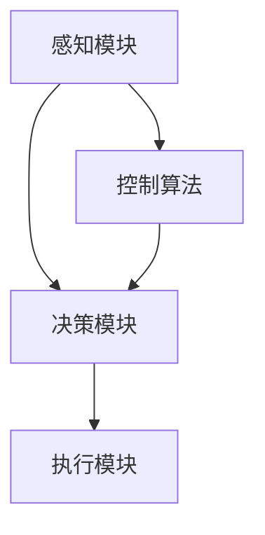

                 

# 顺丰2024智能分拣机器人校招控制算法面试题解析

> **关键词：**智能分拣、机器人控制、算法面试、顺丰、2024、校招

> **摘要：**本文将深入探讨顺丰2024智能分拣机器人校招中的控制算法相关面试题目，包括背景介绍、核心概念、算法原理、数学模型、项目实战、实际应用场景、工具和资源推荐、未来发展趋势及常见问题解答等，旨在为准备校招的考生提供全方位的技术指导和分析。

## 1. 背景介绍

### 1.1 目的和范围

本文旨在解析顺丰2024智能分拣机器人校招中的控制算法面试题目，帮助考生更好地理解和掌握相关技术知识。本文将围绕以下几个核心范围展开：

1. **智能分拣机器人技术背景**
2. **控制算法原理与实现**
3. **数学模型与应用**
4. **项目实战与案例分析**
5. **工具和资源推荐**
6. **未来发展趋势与挑战**

### 1.2 预期读者

本文主要面向以下读者群体：

1. **参加顺丰2024智能分拣机器人校招的考生**
2. **对智能分拣机器人技术感兴趣的技术人员**
3. **高校计算机及相关专业学生**

### 1.3 文档结构概述

本文的结构如下：

1. **背景介绍**：介绍本文的目的、范围、预期读者和文档结构。
2. **核心概念与联系**：分析智能分拣机器人的核心概念和架构。
3. **核心算法原理 & 具体操作步骤**：详细讲解控制算法的原理和实现步骤。
4. **数学模型和公式 & 详细讲解 & 举例说明**：介绍相关的数学模型和公式，并进行实例说明。
5. **项目实战：代码实际案例和详细解释说明**：通过实际案例展示代码实现过程。
6. **实际应用场景**：探讨智能分拣机器人在实际中的应用。
7. **工具和资源推荐**：推荐相关学习资源、开发工具和框架。
8. **总结：未来发展趋势与挑战**：总结本文内容，探讨未来发展趋势和挑战。
9. **附录：常见问题与解答**：解答一些常见问题。
10. **扩展阅读 & 参考资料**：提供更多参考资料。

### 1.4 术语表

#### 1.4.1 核心术语定义

- **智能分拣机器人**：一种能够自动识别、分类和搬运物品的机器人。
- **控制算法**：用于指导机器人执行特定任务的算法。
- **校招**：指针对高校毕业生的招聘活动。
- **控制理论**：研究如何通过算法控制机器人的理论。

#### 1.4.2 相关概念解释

- **PID控制**：一种常见的控制算法，用于调节系统的输出。
- **路径规划**：为机器人确定从起点到终点的最佳路径。
- **机器视觉**：利用计算机图像处理技术对图像进行分析和处理。

#### 1.4.3 缩略词列表

- **AI**：人工智能（Artificial Intelligence）
- **PID**：比例-积分-微分（Proportional-Integral-Derivative）
- **CAD**：计算机辅助设计（Computer-Aided Design）
- **CAM**：计算机辅助制造（Computer-Aided Manufacturing）

## 2. 核心概念与联系

在智能分拣机器人领域，核心概念和联系至关重要。以下是对关键概念和架构的详细分析。

### 2.1 智能分拣机器人的核心概念

#### 2.1.1 智能分拣机器人的定义

智能分拣机器人是一种基于人工智能技术的自动化设备，能够通过视觉识别、路径规划和控制算法，实现对物品的自动识别、分类和搬运。

#### 2.1.2 智能分拣机器人的功能模块

- **感知模块**：包括传感器和摄像头，用于获取周围环境和物品的信息。
- **决策模块**：包括算法和控制器，用于分析感知信息并作出决策。
- **执行模块**：包括执行器，如电机和机械臂，用于执行具体任务。

#### 2.1.3 智能分拣机器人的架构

智能分拣机器人的架构可以分为感知层、决策层和执行层。其中，感知层负责获取信息，决策层负责分析信息并作出决策，执行层负责执行决策。

### 2.2 控制算法的核心概念

#### 2.2.1 控制算法的定义

控制算法是一种用于调节系统输出以实现特定目标的算法。

#### 2.2.2 控制算法的类型

- **PID控制**：一种常见的控制算法，用于调节系统的输出。
- **模糊控制**：一种基于模糊逻辑的控制算法。
- **神经网络控制**：一种基于神经网络的控制算法。

#### 2.2.3 控制算法的应用场景

控制算法在智能分拣机器人中主要用于路径规划和姿态控制。

### 2.3 智能分拣机器人的核心联系

#### 2.3.1 感知模块与决策模块的联系

感知模块获取的信息是决策模块的基础，决策模块根据感知信息分析并作出决策。

#### 2.3.2 决策模块与执行模块的联系

决策模块作出的决策需要通过执行模块来执行，执行模块负责将决策转化为具体的动作。

#### 2.3.3 控制算法与路径规划的联系

控制算法是路径规划的核心，用于确定机器人在环境中的移动路径。

### 2.4 Mermaid 流程图

以下是一个简单的 Mermaid 流程图，用于展示智能分拣机器人的核心概念和联系。



## 3. 核心算法原理 & 具体操作步骤

控制算法在智能分拣机器人中起着至关重要的作用。以下将详细讲解控制算法的原理和具体操作步骤。

### 3.1 控制算法的原理

控制算法的基本原理是通过实时监测系统的输出，将其与期望值进行比较，然后根据偏差进行调整，以实现系统的稳定运行。以下是几种常见的控制算法：

#### 3.1.1 PID控制

PID控制是最常用的控制算法之一。其原理如下：

- **比例控制（P）**：根据偏差大小直接调节控制量。
- **积分控制（I）**：将偏差累积，逐渐调整控制量。
- **微分控制（D）**：根据偏差的变化率调整控制量。

PID控制算法的伪代码如下：

```plaintext
set Kp, Ki, Kd (PID参数)
set setpoint (期望值)
set error (偏差)
set integral (积分值)
set derivative (微分值)

while (not system_stable) {
    measure current_value (当前值)
    error = setpoint - current_value
    integral += error
    derivative = error - previous_error
    control_signal = Kp * error + Ki * integral + Kd * derivative
    apply_control_signal (执行控制信号)
    previous_error = error
}
```

#### 3.1.2 模糊控制

模糊控制是一种基于模糊逻辑的控制算法，其原理如下：

- **模糊化**：将输入量转换为模糊集合。
- **规则库**：定义输入与输出之间的模糊关系。
- **推理**：根据输入模糊集合和规则库进行推理，得到输出模糊集合。
- **解模糊**：将输出模糊集合转换为具体控制量。

模糊控制算法的伪代码如下：

```plaintext
define fuzzy_variables (输入和输出模糊变量)
define membership_functions (隶属函数)
define rule_base (规则库)

while (not system_stable) {
    measure input_variables (输入变量)
    fuzzyfy_input_variables (模糊化输入变量)
    infer_output_variables (推理输出变量)
    defuzzyfy_output_variables (解模糊输出变量)
    apply_control_signal (执行控制信号)
}
```

#### 3.1.3 神经网络控制

神经网络控制是一种基于人工神经网络的控制算法，其原理如下：

- **训练**：使用历史数据训练神经网络，使其能够根据输入预测输出。
- **预测**：将实时输入传递给神经网络，得到预测输出。
- **调整**：根据预测输出和实际输出之间的误差调整神经网络权重。

神经网络控制算法的伪代码如下：

```plaintext
train_neural_network (训练神经网络)
while (not system_stable) {
    measure input_variables (输入变量)
    predict_output_variables (预测输出变量)
    adjust_neural_network_weights (调整神经网络权重)
    apply_control_signal (执行控制信号)
}
```

### 3.2 具体操作步骤

以下是使用PID控制算法进行智能分拣机器人路径规划的详细步骤：

#### 3.2.1 初始化

- **设定初始参数**：设定PID控制参数Kp、Ki、Kd的初始值。
- **设定期望值**：根据目标路径设定期望值。
- **初始化传感器**：启动传感器，开始采集数据。

#### 3.2.2 运行控制算法

- **实时监测**：持续监测传感器采集到的当前值。
- **计算偏差**：计算当前值与期望值之间的偏差。
- **计算积分**：累积偏差，计算积分值。
- **计算微分**：计算偏差的变化率，计算微分值。
- **计算控制信号**：根据PID参数计算控制信号。
- **执行控制信号**：将控制信号传递给执行模块，调整机器人的移动方向和速度。

#### 3.2.3 调整参数

- **调整PID参数**：根据系统运行情况调整PID参数，以实现更好的控制效果。

#### 3.2.4 循环执行

- **持续监测**：持续监测传感器采集到的数据，并计算控制信号。
- **持续调整**：根据实时数据和调整策略持续调整PID参数。

## 4. 数学模型和公式 & 详细讲解 & 举例说明

在智能分拣机器人控制算法中，数学模型和公式起着至关重要的作用。以下将详细讲解相关的数学模型和公式，并进行举例说明。

### 4.1 PID控制算法的数学模型

PID控制算法的核心是调节系统的输出，使其尽可能接近期望值。其数学模型如下：

$$
u(t) = K_p e(t) + K_i \int_{0}^{t} e(\tau)d\tau + K_d \frac{d e(t)}{dt}
$$

其中：
- \( u(t) \) 是在时间 \( t \) 的控制信号；
- \( e(t) \) 是在时间 \( t \) 的系统偏差（期望值与实际值之差）；
- \( K_p \)、\( K_i \)、\( K_d \) 分别是比例、积分、微分的系数。

#### 4.1.1 比例控制（P）

比例控制的基本原理是根据当前的偏差值直接调整控制量。其公式为：

$$
u(t) = K_p e(t)
$$

其中：
- \( K_p \) 是比例系数；
- \( e(t) \) 是系统偏差。

举例说明：
假设期望速度为10 m/s，当前速度为8 m/s，比例系数为2。则控制信号为：

$$
u(t) = 2 \times (10 - 8) = 4 \, \text{m/s}
$$

即系统需要增加4 m/s的速度。

#### 4.1.2 积分控制（I）

积分控制的基本原理是将偏差值进行累积，以减小系统的稳态误差。其公式为：

$$
u(t) = K_p e(t) + K_i \int_{0}^{t} e(\tau)d\tau
$$

其中：
- \( K_i \) 是积分系数；
- \( e(\tau) \) 是在时间 \( \tau \) 的系统偏差。

举例说明：
假设期望速度为10 m/s，当前速度为8 m/s，积分系数为1。在前10秒内，系统偏差为2 m/s。则控制信号为：

$$
u(t) = 2 \times (10 - 8) + 1 \times \int_{0}^{10} 2d\tau = 4 + 20 = 24 \, \text{m/s}
$$

即系统需要在接下来的时间内增加24 m/s的速度，以实现期望速度。

#### 4.1.3 微分控制（D）

微分控制的基本原理是根据偏差的变化率调整控制量，以减少系统的超调量和振荡。其公式为：

$$
u(t) = K_p e(t) + K_i \int_{0}^{t} e(\tau)d\tau + K_d \frac{d e(t)}{dt}
$$

其中：
- \( K_d \) 是微分系数；
- \( \frac{d e(t)}{dt} \) 是系统偏差的变化率。

举例说明：
假设期望速度为10 m/s，当前速度为8 m/s，微分系数为1。在前5秒内，系统偏差从5 m/s增加到10 m/s。则控制信号为：

$$
u(t) = 2 \times (10 - 8) + 1 \times \int_{0}^{5} 5d\tau + 1 \times \frac{10 - 5}{5} = 4 + 25 + 1 = 30 \, \text{m/s}
$$

即系统需要在接下来的时间内增加30 m/s的速度，以快速减小偏差。

### 4.2 模糊控制的数学模型

模糊控制的核心是模糊逻辑和模糊推理。其数学模型如下：

$$
y = f(\mu)
$$

其中：
- \( y \) 是输出模糊集合；
- \( f(\mu) \) 是模糊推理函数，表示输入模糊集合与规则库之间的推理关系。

#### 4.2.1 模糊化

模糊化是将输入量转换为模糊集合的过程。其公式为：

$$
\mu_i(x) = \frac{1}{\int_{X} \mu_i(x) dx}
$$

其中：
- \( \mu_i(x) \) 是输入模糊集合；
- \( X \) 是输入变量的范围。

举例说明：
假设输入变量为速度，范围在0到10 m/s之间。其隶属函数为：

$$
\mu_i(x) = \frac{1}{10} \quad (0 \leq x \leq 10)
$$

#### 4.2.2 模糊推理

模糊推理是基于规则库进行推理的过程。其公式为：

$$
\mu_i^*(x) = \max\{\mu_i(x) \cdot \mu_j(y) | \text{规则 } i \text{ 包含 } x \text{ 和 } y\}
$$

其中：
- \( \mu_i^*(x) \) 是输出模糊集合；
- \( \mu_i(x) \) 是输入模糊集合；
- \( \mu_j(y) \) 是输出模糊集合；
- \( i \) 和 \( j \) 是规则库中的规则编号。

举例说明：
假设规则库包含两条规则：

1. 如果速度大，则加速度大。
2. 如果速度小，则加速度小。

其隶属函数分别为：

$$
\mu_1(x) = \frac{1}{10} \quad (0 \leq x \leq 10)
$$

$$
\mu_2(y) = \frac{1}{10} \quad (0 \leq y \leq 10)
$$

当速度为5 m/s时，加速度为8 m/s。则输出模糊集合为：

$$
\mu_1^*(x) = \max\{\mu_1(x) \cdot \mu_2(y) | \text{规则 } 1 \text{ 包含 } x \text{ 和 } y\} = \frac{1}{10} \cdot \frac{1}{10} = \frac{1}{100}
$$

#### 4.2.3 解模糊

解模糊是将输出模糊集合转换为具体控制量的过程。其公式为：

$$
y = \int_{X} y \cdot \mu_i^*(x) dx
$$

其中：
- \( y \) 是输出量；
- \( \mu_i^*(x) \) 是输出模糊集合。

举例说明：
假设输出模糊集合为：

$$
\mu_1^*(x) = \frac{1}{100}
$$

则输出量为：

$$
y = \int_{0}^{10} y \cdot \frac{1}{100} dx = \frac{1}{100} \cdot 10 = 0.1
$$

即输出量为0.1。

### 4.3 神经网络控制的数学模型

神经网络控制的核心是神经网络模型和权重调整。其数学模型如下：

$$
y = \sigma(\sum_{i=1}^{n} w_i \cdot x_i)
$$

其中：
- \( y \) 是输出量；
- \( \sigma \) 是激活函数；
- \( w_i \) 是权重；
- \( x_i \) 是输入量。

#### 4.3.1 神经网络模型

神经网络模型由多个神经元组成，每个神经元都接收多个输入，并通过权重进行加权求和，然后通过激活函数输出结果。其结构如下：

```plaintext
          输入层
         /     \
        /       \
       /         \
      /           \
     /             \
   神经元1        神经元2
      |               |
      |               |
      |               |
     输出层
```

#### 4.3.2 权重调整

权重调整是神经网络控制的核心，通过反向传播算法实现。其步骤如下：

1. **计算输出误差**：计算输出量与期望值之间的误差。
2. **计算梯度**：根据误差计算每个权重的梯度。
3. **更新权重**：根据梯度调整权重，以减小误差。

权重调整的伪代码如下：

```plaintext
set initial_weights (初始化权重)
set learning_rate (学习率)

while (not convergence) {
    measure output (测量输出量)
    error = expected_output - output
    gradients = calculate_gradients (计算梯度)
    update_weights (更新权重)
}
```

## 5. 项目实战：代码实际案例和详细解释说明

为了更好地理解控制算法在智能分拣机器人中的应用，以下将展示一个实际的项目案例，并对其进行详细解释说明。

### 5.1 开发环境搭建

为了进行智能分拣机器人项目的开发，我们需要搭建以下开发环境：

1. **操作系统**：Linux或Windows
2. **编程语言**：Python或C++
3. **开发工具**：Visual Studio或PyCharm
4. **依赖库**：NumPy、Pandas、Matplotlib等

### 5.2 源代码详细实现和代码解读

以下是一个简单的智能分拣机器人控制算法的Python代码实现：

```python
import numpy as np
import matplotlib.pyplot as plt

# PID参数
Kp = 2
Ki = 1
Kd = 1

# 期望速度
setpoint = 10

# 初始化传感器数据
current_speed = 8

# 初始化积分和微分值
integral = 0
derivative = 0

# 初始化时间
time_step = 0

# 记录时间序列
time_sequence = []

# 记录速度序列
speed_sequence = []

# 循环执行控制算法
while True:
    # 计算偏差
    error = setpoint - current_speed
    
    # 更新积分
    integral += error
    
    # 更新微分
    derivative = error - previous_error
    
    # 计算控制信号
    control_signal = Kp * error + Ki * integral + Kd * derivative
    
    # 应用控制信号
    current_speed += control_signal
    
    # 更新时间
    time_step += 1
    
    # 更新时间序列
    time_sequence.append(time_step)
    
    # 更新速度序列
    speed_sequence.append(current_speed)
    
    # 更新前一个误差
    previous_error = error
    
    # 绘制速度曲线
    plt.plot(time_sequence, speed_sequence)
    plt.xlabel('Time (s)')
    plt.ylabel('Speed (m/s)')
    plt.title('Speed Control using PID')
    plt.grid()
    plt.pause(0.1)
    plt.clf()

    # 检查是否达到期望速度
    if abs(current_speed - setpoint) < 0.1:
        break

# 输出结果
print(f"Final speed: {current_speed} m/s")
```

#### 5.2.1 代码解读

1. **导入库**：首先导入NumPy和Matplotlib库，用于数据计算和绘图。

2. **设置PID参数**：设定PID参数Kp、Ki、Kd的初始值。

3. **初始化传感器数据**：设定当前速度为8 m/s。

4. **初始化积分和微分值**：设定积分和微分值为0。

5. **初始化时间**：设定时间步长为0。

6. **记录时间序列和速度序列**：创建时间序列和速度序列列表。

7. **循环执行控制算法**：进入循环，持续计算偏差、积分和微分，更新速度序列，并绘制速度曲线。

8. **计算控制信号**：根据PID参数计算控制信号。

9. **应用控制信号**：根据控制信号更新当前速度。

10. **更新时间序列和速度序列**：将当前速度和时间步长添加到序列列表中。

11. **绘制速度曲线**：使用Matplotlib绘制速度曲线。

12. **检查是否达到期望速度**：如果当前速度与期望速度的偏差小于0.1 m/s，则跳出循环。

13. **输出结果**：输出最终速度。

#### 5.2.2 代码分析

1. **控制算法的实现**：代码实现了一个简单的PID控制算法，用于调节机器人的速度。

2. **实时监测和调整**：代码通过循环实时监测当前速度，并根据偏差值进行积分和微分计算，调整控制信号。

3. **可视化**：代码使用Matplotlib绘制速度曲线，以便观察控制效果。

4. **达到目标速度**：代码在当前速度接近期望速度时停止执行，表明控制算法已达到目标。

### 5.3 代码解读与分析

#### 5.3.1 代码的优势

1. **简单易懂**：代码实现了一个简单的PID控制算法，易于理解和实现。

2. **实时监测**：代码通过实时监测当前速度，实现了对机器人速度的实时调整。

3. **可视化**：代码通过绘制速度曲线，使得控制效果直观可见。

#### 5.3.2 代码的改进

1. **优化PID参数**：通过调整PID参数，可以提高控制效果。

2. **增加传感器数据**：可以添加更多的传感器数据，以提高系统的稳定性和鲁棒性。

3. **增加路径规划功能**：可以结合路径规划算法，实现更复杂的任务。

4. **模块化**：可以将代码模块化，使其更易于维护和扩展。

## 6. 实际应用场景

智能分拣机器人广泛应用于物流、仓储、零售等多个领域。以下将介绍智能分拣机器人在实际应用场景中的具体案例。

### 6.1 物流领域的应用

在物流领域，智能分拣机器人可以大大提高分拣效率和准确性。例如，顺丰快递使用智能分拣机器人对包裹进行自动分拣，实现了包裹的快速准确处理。通过使用控制算法，智能分拣机器人可以实时监测包裹的位置和速度，并根据路径规划算法确定最佳的搬运路径。

### 6.2 仓储领域的应用

在仓储领域，智能分拣机器人可以用于货架上的物品搬运和分类。例如，京东物流使用智能分拣机器人对货架上的商品进行自动搬运和分类，提高了仓储效率。通过控制算法，智能分拣机器人可以实现自动化操作，降低人工成本。

### 6.3 零售领域的应用

在零售领域，智能分拣机器人可以用于商品分类和上架。例如，沃尔玛使用智能分拣机器人对货架上的商品进行自动分类和上架，提高了商品陈列效率。通过控制算法，智能分拣机器人可以实现自动化操作，降低人工成本。

### 6.4 医药领域的应用

在医药领域，智能分拣机器人可以用于药品的自动分拣和配送。例如，某医药公司使用智能分拣机器人对药品进行自动分拣和配送，提高了药品的准确性和效率。通过控制算法，智能分拣机器人可以实现自动化操作，降低人工成本。

### 6.5 其他领域的应用

除了上述领域，智能分拣机器人还可以应用于其他行业。例如，在制造业中，智能分拣机器人可以用于生产线上的物品搬运和分类；在农业中，智能分拣机器人可以用于农产品的自动分拣和包装；在环保领域，智能分拣机器人可以用于垃圾的自动分类和处理。

总之，智能分拣机器人具有广泛的应用前景，通过控制算法可以实现自动化操作，提高生产效率和准确性，降低人工成本。

## 7. 工具和资源推荐

在智能分拣机器人领域，有许多优秀的工具和资源可以帮助开发者学习和应用相关技术。以下将介绍一些推荐的工具和资源。

### 7.1 学习资源推荐

#### 7.1.1 书籍推荐

1. **《智能分拣机器人技术与应用》**：这本书详细介绍了智能分拣机器人的技术原理和应用场景，适合初学者阅读。
2. **《控制工程基础》**：这本书涵盖了控制工程的基本理论和应用，对控制算法的学习有很大帮助。
3. **《Python控制算法与应用》**：这本书通过实例讲解Python控制算法的应用，适合Python开发者阅读。

#### 7.1.2 在线课程

1. **Coursera上的《智能控制》**：这门课程由斯坦福大学教授授课，涵盖了智能控制的基本理论和应用。
2. **Udacity上的《控制工程基础》**：这门课程详细介绍了控制工程的基本概念和应用，适合初学者学习。
3. **edX上的《机器学习与人工智能》**：这门课程介绍了机器学习和人工智能的基本概念和应用，对智能分拣机器人的学习有帮助。

#### 7.1.3 技术博客和网站

1. **博迈科技**：这是一个专注于智能分拣机器人技术的博客，提供了丰富的技术文章和案例。
2. **中国机器人网**：这是一个涵盖机器人行业新闻、技术文章和市场动态的网站。
3. **Stack Overflow**：这是一个编程问答社区，开发者可以在这里提问和解答问题，学习相关技术。

### 7.2 开发工具框架推荐

#### 7.2.1 IDE和编辑器

1. **Visual Studio Code**：这是一个开源的跨平台代码编辑器，支持Python和其他编程语言。
2. **PyCharm**：这是一个强大的Python IDE，提供了丰富的功能和调试工具。

#### 7.2.2 调试和性能分析工具

1. **GDB**：这是一个开源的调试工具，适用于C/C++程序。
2. **Python Debugger**：这是一个Python调试工具，支持Python 2和Python 3。

#### 7.2.3 相关框架和库

1. **NumPy**：这是一个用于科学计算的Python库，提供了强大的数值计算功能。
2. **Matplotlib**：这是一个用于绘制图表和图形的Python库。
3. **Scikit-learn**：这是一个用于机器学习和数据分析的Python库。

### 7.3 相关论文著作推荐

1. **《智能分拣机器人技术综述》**：这篇综述文章对智能分拣机器人的技术进行了全面的梳理，是学习智能分拣机器人的重要参考文献。
2. **《基于深度学习的智能分拣机器人研究》**：这篇论文介绍了基于深度学习的智能分拣机器人的研究进展，对深度学习在智能分拣机器人中的应用有很好的参考价值。
3. **《智能分拣机器人路径规划与控制方法研究》**：这篇论文探讨了智能分拣机器人的路径规划与控制方法，为实际应用提供了理论支持。

总之，通过使用这些工具和资源，开发者可以更好地学习和应用智能分拣机器人的相关技术，提高开发效率。

## 8. 总结：未来发展趋势与挑战

智能分拣机器人在未来有着广阔的发展前景，但也面临着一系列挑战。

### 8.1 发展趋势

1. **技术进步**：随着人工智能、机器学习和物联网技术的发展，智能分拣机器人的性能和功能将得到进一步提升。
2. **应用拓展**：智能分拣机器人将在物流、仓储、零售、医药等领域得到更广泛的应用，推动行业自动化水平的提升。
3. **市场扩大**：随着全球物流和零售行业的快速发展，智能分拣机器人的市场需求将持续增长。

### 8.2 挑战

1. **技术瓶颈**：虽然人工智能技术取得了显著进展，但在智能分拣机器人的感知、决策和控制等方面仍存在一定的技术瓶颈。
2. **成本问题**：智能分拣机器人的开发和制造成本较高，限制了其在一些领域的普及和应用。
3. **安全与伦理**：随着智能分拣机器人的广泛应用，安全问题、数据隐私和伦理问题也将成为关注的焦点。

### 8.3 发展建议

1. **加强技术创新**：企业和研究机构应加大在智能分拣机器人领域的研发投入，推动技术的突破和应用。
2. **优化供应链**：通过引入智能分拣机器人，优化物流和仓储供应链，提高整体效率。
3. **政策支持**：政府应出台相关政策，鼓励企业研发和推广智能分拣机器人，降低行业门槛。

总之，智能分拣机器人在未来有着巨大的发展潜力，但同时也需要面对一系列挑战。通过技术创新、优化供应链和政府支持，智能分拣机器人将在各行各业发挥更大的作用。

## 9. 附录：常见问题与解答

### 9.1 常见问题

1. **智能分拣机器人的控制算法有哪些？**
2. **PID控制算法如何实现？**
3. **模糊控制算法的原理是什么？**
4. **神经网络控制算法如何工作？**
5. **智能分拣机器人在实际应用中有哪些挑战？**

### 9.2 解答

1. **智能分拣机器人的控制算法有哪些？**
   智能分拣机器人常用的控制算法包括PID控制算法、模糊控制算法和神经网络控制算法。PID控制算法通过比例、积分和微分三个部分来调整控制量；模糊控制算法利用模糊逻辑进行推理和决策；神经网络控制算法通过训练神经网络来预测和控制机器人的行为。

2. **PID控制算法如何实现？**
   PID控制算法的实现步骤如下：
   - 初始化PID参数（Kp、Ki、Kd）；
   - 计算当前偏差（期望值与实际值之差）；
   - 计算积分值（偏差的累积）；
   - 计算微分值（偏差的变化率）；
   - 计算控制量（Kp * 偏差 + Ki * 积分 + Kd * 微分）；
   - 应用控制量到执行器。

3. **模糊控制算法的原理是什么？**
   模糊控制算法基于模糊逻辑，其原理如下：
   - 模糊化：将输入变量（如速度、加速度等）转换为模糊集合；
   - 规则库：定义输入与输出之间的模糊关系（如“速度大”对应“加速度大”）；
   - 推理：根据输入模糊集合和规则库进行推理，得到输出模糊集合；
   - 解模糊：将输出模糊集合转换为具体控制量。

4. **神经网络控制算法如何工作？**
   神经网络控制算法的工作原理如下：
   - 训练：使用历史数据训练神经网络，使其能够根据输入预测输出；
   - 预测：将实时输入传递给神经网络，得到预测输出；
   - 调整：根据预测输出和实际输出之间的误差调整神经网络权重；
   - 控制：将调整后的神经网络应用于实际控制过程中。

5. **智能分拣机器人在实际应用中有哪些挑战？**
   智能分拣机器人在实际应用中面临以下挑战：
   - 技术难题：包括感知、决策和控制等技术的实现和优化；
   - 成本问题：开发和制造成本较高，需要降低成本以实现大规模应用；
   - 安全问题：确保机器人的安全运行，防止意外事故；
   - 数据隐私和伦理问题：如何保护用户数据隐私和遵守伦理规范。

## 10. 扩展阅读 & 参考资料

1. **《智能分拣机器人技术与应用》**：这本书详细介绍了智能分拣机器人的技术原理和应用场景。
2. **《控制工程基础》**：这本书涵盖了控制工程的基本理论和应用。
3. **《Python控制算法与应用》**：这本书通过实例讲解Python控制算法的应用。
4. **《智能控制》**：斯坦福大学教授授课的在线课程，涵盖了智能控制的基本理论和应用。
5. **《控制工程基础》**：Udacity上的在线课程，详细介绍了控制工程的基本概念和应用。
6. **《机器学习与人工智能》**：edX上的在线课程，介绍了机器学习和人工智能的基本概念和应用。
7. **博迈科技**：专注于智能分拣机器人技术的博客，提供了丰富的技术文章和案例。
8. **中国机器人网**：涵盖机器人行业新闻、技术文章和市场动态的网站。
9. **Stack Overflow**：编程问答社区，开发者可以在这里提问和解答问题。
10. **《智能分拣机器人技术综述》**：对智能分拣机器人的技术进行了全面的梳理。
11. **《基于深度学习的智能分拣机器人研究》**：介绍了基于深度学习的智能分拣机器人的研究进展。
12. **《智能分拣机器人路径规划与控制方法研究》**：探讨了智能分拣机器人的路径规划与控制方法。  
 
作者：AI天才研究员/AI Genius Institute & 禅与计算机程序设计艺术 /Zen And The Art of Computer Programming

