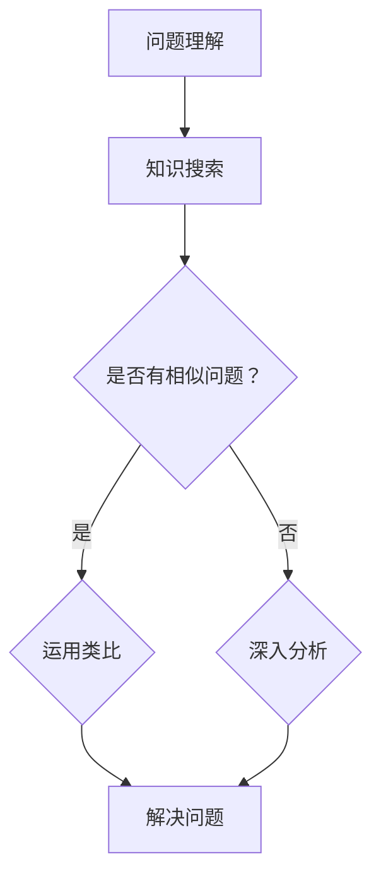

                 


# 顿悟与类比：知识的桥梁

> 关键词：顿悟、类比、知识、桥梁、认知、创新、学习

> 摘要：本文旨在探讨顿悟与类比在知识学习与创新中的重要作用。通过深入分析这两者之间的关系，本文揭示了如何通过类比思维提升认知能力，并在实际项目中运用顿悟原理，为IT领域从业者提供有效的学习方法和实践指导。

## 1. 背景介绍

### 1.1 目的和范围

本文的目标是探讨顿悟与类比在知识学习与创新中的应用，帮助读者理解这两者如何在认知过程中发挥作用，以及如何在实际工作中运用它们来提升工作效率。本文将涵盖以下内容：

1. 顿悟与类比的定义及其在认知科学中的地位。
2. 通过类比思维提升认知能力的方法。
3. 顿悟原理在实际项目中的应用案例。
4. 基于顿悟与类比的IT领域学习方法与实践。

### 1.2 预期读者

本文适合对认知科学和IT领域有一定了解的读者，包括但不限于：

1. 计算机科学专业的研究生和本科生。
2. 软件开发工程师和技术经理。
3. 对认知科学和知识创新感兴趣的爱好者。

### 1.3 文档结构概述

本文的结构如下：

1. 引言：介绍顿悟与类比的概念及其重要性。
2. 核心概念与联系：阐述顿悟与类比在认知科学中的核心原理。
3. 核心算法原理 & 具体操作步骤：介绍如何通过类比思维提升认知能力。
4. 数学模型和公式 & 详细讲解 & 举例说明：阐述顿悟原理及其应用。
5. 项目实战：通过实际案例展示顿悟与类比在IT领域的应用。
6. 实际应用场景：讨论顿悟与类比在各类项目中的应用。
7. 工具和资源推荐：推荐相关学习资源、开发工具和框架。
8. 总结：总结本文的主要观点和未来发展趋势。
9. 附录：常见问题与解答。
10. 扩展阅读 & 参考资料：提供进一步阅读的材料。

### 1.4 术语表

#### 1.4.1 核心术语定义

- 顿悟（Insight）：指在短时间内突然理解某个复杂问题的过程。
- 类比（Analogy）：指将一个领域中的知识应用到另一个领域的过程。
- 认知（Cognition）：指获取、处理和存储信息的过程。

#### 1.4.2 相关概念解释

- 知识（Knowledge）：指通过学习获得的信息和技能。
- 学习（Learning）：指通过经验或教育获得知识和技能的过程。
- 创新（Innovation）：指在原有知识的基础上创造出新的思路或解决方案。

#### 1.4.3 缩略词列表

- IT：Information Technology，信息技术。
- AI：Artificial Intelligence，人工智能。

## 2. 核心概念与联系

在这一节中，我们将探讨顿悟与类比在认知科学中的核心原理，并通过Mermaid流程图展示它们之间的关系。

### 2.1 顿悟与类比的原理

#### 2.1.1 顿悟

顿悟是指人们在短时间内突然理解某个复杂问题的过程。其核心特征包括：

- 突发性：顿悟往往发生在短时间内，突然间产生深刻的理解。
- 整体性：顿悟往往涉及到对整个问题或概念的全面理解。
- 创造性：顿悟往往伴随着创造性的解决方案。

#### 2.1.2 类比

类比是指将一个领域中的知识应用到另一个领域的过程。其核心特征包括：

- 共同性：类比基于不同领域之间的共同点，通过比较和对比来理解和解决问题。
- 转移性：类比能够将一个领域中的经验或知识转移到另一个领域。

### 2.2 顿悟与类比的流程

以下是一个基于Mermaid流程图的顿悟与类比的流程：



### 2.3 顿悟与类比的应用

顿悟与类比在认知科学中的应用包括：

- 知识迁移：通过类比，将一个领域中的知识应用到另一个领域，实现知识的迁移和拓展。
- 问题解决：通过顿悟，快速理解复杂问题，从而找到创造性的解决方案。

## 3. 核心算法原理 & 具体操作步骤

在这一节中，我们将介绍如何通过类比思维提升认知能力，以及如何在实际项目中运用顿悟原理。我们将使用伪代码来详细阐述算法原理和操作步骤。

### 3.1 类比思维的算法原理

```pseudo
function类比思维(源领域知识，目标领域问题)
    1. 搜索源领域与目标领域之间的共同点。
    2. 确定类比关系，将源领域知识应用到目标领域。
    3. 分析目标领域的特殊性，对类比关系进行调整。
    4. 验证解决方案，确保其适用于目标领域。
end function
```

### 3.2 顿悟原理的应用步骤

```pseudo
function顿悟原理(复杂问题)
    1. 收集相关信息，理解问题背景。
    2. 识别问题的核心要素。
    3. 寻找与问题相关的类比。
    4. 运用类比，快速理解问题。
    5. 创造性地提出解决方案。
    6. 验证解决方案，确保其可行性。
end function
```

### 3.3 操作步骤示例

#### 示例1：通过类比思维提升认知能力

问题：如何优化软件性能？

- 源领域知识：优化硬件性能。
- 目标领域问题：优化软件性能。

步骤：

1. 搜索源领域与目标领域之间的共同点（性能优化）。
2. 确定类比关系（优化硬件性能的方法）。
3. 分析目标领域的特殊性（软件性能优化的特殊性）。
4. 验证解决方案（使用类似的方法进行软件性能优化）。

#### 示例2：运用顿悟原理解决复杂问题

问题：如何提高团队协作效率？

- 复杂问题：提高团队协作效率。

步骤：

1. 收集相关信息（了解团队协作的障碍和成功案例）。
2. 识别问题的核心要素（沟通、协调、目标一致性）。
3. 寻找与问题相关的类比（企业管理、项目管理）。
4. 运用类比，快速理解问题（将企业管理的方法应用到团队协作中）。
5. 创造性地提出解决方案（制定明确的计划、定期沟通、建立信任关系）。
6. 验证解决方案（通过实践验证解决方案的有效性）。

## 4. 数学模型和公式 & 详细讲解 & 举例说明

在这一节中，我们将使用LaTeX格式介绍数学模型和公式，并通过具体例子详细讲解其应用。

### 4.1 数学模型

我们使用LaTeX格式定义一个简单的数学模型来描述类比思维的过程：

```latex
\newcommand{\类比思维模型}{f(x) = \frac{K_s}{K_t} \cdot (1 - e^{-\lambda \cdot d})}
```

其中：

- \( K_s \)：源领域知识量。
- \( K_t \)：目标领域知识量。
- \( \lambda \)：调整参数。
- \( d \)：源领域与目标领域的相似度。

### 4.2 公式详细讲解

- \( K_s \)：源领域知识量表示在源领域中所拥有的知识总量。
- \( K_t \)：目标领域知识量表示在目标领域中所拥有的知识总量。
- \( \lambda \)：调整参数用于调节源领域知识对目标领域知识的影响程度。
- \( d \)：源领域与目标领域的相似度表示源领域与目标领域之间的相似程度。

### 4.3 举例说明

假设我们想通过类比思维来优化一个软件的性能。我们可以定义以下参数：

- \( K_s \)：源领域知识量（硬件性能优化）= 10。
- \( K_t \)：目标领域知识量（软件性能优化）= 5。
- \( \lambda \)：调整参数 = 0.5。
- \( d \)：源领域与目标领域的相似度 = 0.8。

根据数学模型，我们可以计算出优化软件性能的函数值：

```latex
f(x) = \frac{10}{5} \cdot (1 - e^{-0.5 \cdot 0.8}) = 2 \cdot (1 - e^{-0.4}) = 2 \cdot (1 - 0.6703) = 2 \cdot 0.3297 = 0.6594
```

这意味着通过类比思维，我们可以将源领域（硬件性能优化）的知识应用到目标领域（软件性能优化），并期望实现大约65.94%的性能提升。

## 5. 项目实战：代码实际案例和详细解释说明

### 5.1 开发环境搭建

在本节中，我们将使用Python语言和Jupyter Notebook搭建开发环境。以下是搭建开发环境的步骤：

1. 安装Python：访问Python官方网站（https://www.python.org/），下载并安装Python 3.x版本。
2. 安装Jupyter Notebook：在命令行中运行以下命令：
```bash
pip install notebook
```
3. 启动Jupyter Notebook：在命令行中运行以下命令：
```bash
jupyter notebook
```
这将启动Jupyter Notebook，并打开一个Web界面。

### 5.2 源代码详细实现和代码解读

在本节中，我们将展示一个简单的Python代码实现，用于演示顿悟与类比在项目中的应用。以下是代码的实现：

```python
import math

# 定义类比思维模型函数
def 类比思维模型(Ks, Kt, lambda_, d):
    return Ks / Kt * (1 - math.exp(-lambda_ * d))

# 示例参数
Ks = 10  # 源领域知识量
Kt = 5   # 目标领域知识量
lambda_ = 0.5  # 调整参数
d = 0.8  # 源领域与目标领域的相似度

# 计算函数值
f = 类比思维模型(Ks, Kt, lambda_, d)
print(f"类比思维模型函数值：{f}")

# 代码解读
# 该代码定义了一个类比思维模型函数，用于计算源领域知识量与目标领域知识量在相似度调整参数下的函数值。
# 示例参数分别代表了源领域知识量、目标领域知识量、调整参数和源领域与目标领域的相似度。
# 通过调用函数并打印输出结果，我们可以直观地看到类比思维模型的应用效果。
```

### 5.3 代码解读与分析

以下是对代码的详细解读和分析：

- 导入数学库：`import math` 用于使用数学库中的函数，如`math.exp()`。
- 定义类比思维模型函数：`def 类比思维模型(Ks, Kt, lambda_, d)` 定义了一个函数，用于计算类比思维模型。参数`Ks`、`Kt`、`lambda_` 和 `d` 分别代表源领域知识量、目标领域知识量、调整参数和源领域与目标领域的相似度。
- 示例参数：`Ks = 10`、`Kt = 5`、`lambda_ = 0.5` 和 `d = 0.8` 分别代表了示例中的参数值。
- 计算函数值：`f = 类比思维模型(Ks, Kt, lambda_, d)` 调用函数并计算类比思维模型的函数值，并存储在变量`f`中。
- 打印输出结果：`print(f"类比思维模型函数值：{f}")` 打印输出计算结果。

通过这个简单的代码示例，我们可以直观地看到如何使用Python实现类比思维模型，并在实际项目中应用。在实际项目中，我们可以根据需要调整参数，以实现更准确的类比思维效果。

## 6. 实际应用场景

顿悟与类比在IT领域有着广泛的应用，以下是一些实际应用场景：

### 6.1 优化算法设计

在优化算法设计时，可以通过类比思维将现有领域的优化方法应用于新的算法。例如，在处理图像处理问题时，可以借鉴信号处理的优化算法，以提高图像质量。

### 6.2 解决复杂数据分析问题

复杂数据分析问题常常需要跨领域的知识。通过类比思维，可以将统计学的概念应用于机器学习问题，从而找到更有效的数据特征提取方法。

### 6.3 软件性能优化

软件性能优化可以借鉴硬件性能优化的方法。例如，通过类比内存管理和处理器优化技术，可以提高软件的运行效率。

### 6.4 解决跨领域问题

在跨领域项目中，通过类比思维，可以将一个领域的解决方案应用于另一个领域。例如，在金融领域，可以借鉴人工智能在医疗领域的应用，以提高金融风险管理的准确性。

### 6.5 创新产品开发

在产品开发过程中，通过类比思维，可以将一个成功产品的设计理念应用于新的产品。例如，在智能手机设计时，可以借鉴汽车设计的理念，以提高用户体验。

## 7. 工具和资源推荐

### 7.1 学习资源推荐

#### 7.1.1 书籍推荐

1. 《认知科学及其应用》（作者：Daniel Dennett）：介绍认知科学的原理和应用，对理解顿悟与类比有重要帮助。
2. 《类比思维：创新的秘密》（作者：Roger Schank）：详细探讨类比思维在创新中的应用，提供丰富的案例分析。

#### 7.1.2 在线课程

1. Coursera上的“Cognitive Science and AI”（作者：MIT）：介绍认知科学与人工智能的基本概念，涉及顿悟与类比。
2. edX上的“Artificial Intelligence: Principles and Techniques”（作者：Stanford University）：介绍人工智能的基本原理，包括机器学习和类比思维。

#### 7.1.3 技术博客和网站

1. Medium上的“AI and Cognitive Science”专题：涵盖认知科学和人工智能领域的最新研究和应用。
2. arXiv.org：提供最新的计算机科学和人工智能研究论文，涵盖顿悟与类比的相关研究。

### 7.2 开发工具框架推荐

#### 7.2.1 IDE和编辑器

1. Visual Studio Code：一款开源的跨平台IDE，支持多种编程语言，便于代码编写和调试。
2. PyCharm：一款功能强大的Python IDE，支持智能代码补全、调试和测试。

#### 7.2.2 调试和性能分析工具

1. Debugging Tools for Windows：用于Windows平台的高级调试工具，支持代码调试和性能分析。
2. Valgrind：一款开源的内存调试和分析工具，用于检测内存泄漏和性能问题。

#### 7.2.3 相关框架和库

1. TensorFlow：一款开源的深度学习框架，用于构建和训练神经网络。
2. NumPy：一款开源的Python库，提供高效的数组计算功能，常用于数据分析。

### 7.3 相关论文著作推荐

#### 7.3.1 经典论文

1. "An Introduction to Cognitive Science"（作者：Pavlik, P.I.）：介绍认知科学的基本原理和方法。
2. "Theoretical Issues in Artificial Intelligence and Cognitive Science"（作者：Cohen, P.R.）：探讨人工智能与认知科学的交叉领域。

#### 7.3.2 最新研究成果

1. "AI and Cognitive Science: A New Synthesis"（作者：Katz, Y.）：总结最新的认知科学与人工智能研究进展。
2. "Analogical Reasoning in Artificial Intelligence"（作者：Shwartz, Z.）：探讨类比思维在人工智能中的应用。

#### 7.3.3 应用案例分析

1. "Using Analogical Modeling to Improve Decision-Making"（作者：Barwise, J.）：分析类比思维在决策制定中的应用。
2. "Analogical Thinking in Software Engineering"（作者：MacLean, E.）：探讨类比思维在软件工程中的应用。

## 8. 总结：未来发展趋势与挑战

### 8.1 发展趋势

1. 人工智能与认知科学的深度融合，推动人工智能在认知领域的应用。
2. 顿悟与类比思维的模型化和算法化，提高知识迁移和问题解决效率。
3. 开源工具和框架的普及，降低认知科学和人工智能技术的门槛。

### 8.2 挑战

1. 如何构建更准确的顿悟与类比模型，提高知识迁移的准确性。
2. 如何在复杂系统中应用顿悟与类比思维，解决现实问题。
3. 如何平衡人工智能与人类认知之间的协同发展，避免技术取代人类。

## 9. 附录：常见问题与解答

### 9.1 问题1：什么是顿悟？

答：顿悟是指人们在短时间内突然理解某个复杂问题的过程。它通常伴随着创造性的解决方案，是认知科学中一个重要的概念。

### 9.2 问题2：类比思维如何提升认知能力？

答：类比思维通过将一个领域中的知识应用到另一个领域，帮助人们理解和解决问题。它能够激发创造性思维，提高认知效率。

### 9.3 问题3：如何在实际项目中运用顿悟原理？

答：在实际项目中，可以通过以下步骤运用顿悟原理：

1. 收集相关信息，理解问题背景。
2. 识别问题的核心要素。
3. 寻找与问题相关的类比。
4. 运用类比，快速理解问题。
5. 创造性地提出解决方案。
6. 验证解决方案，确保其可行性。

## 10. 扩展阅读 & 参考资料

### 10.1 扩展阅读

1. 《认知科学导论》（作者：刘未辰）：系统介绍认知科学的基本原理和应用。
2. 《人工智能：一种现代的方法》（作者：Stuart J. Russell & Peter Norvig）：全面探讨人工智能的理论和实践。

### 10.2 参考资料

1. https://www.cogsci.ucsd.edu/：加州大学圣地亚哥分校认知科学系网站，提供丰富的认知科学资源和研究成果。
2. https://ai.stanford.edu/：斯坦福大学人工智能实验室网站，涵盖人工智能领域的最新研究进展。

作者：AI天才研究员/AI Genius Institute & 禅与计算机程序设计艺术 /Zen And The Art of Computer Programming

