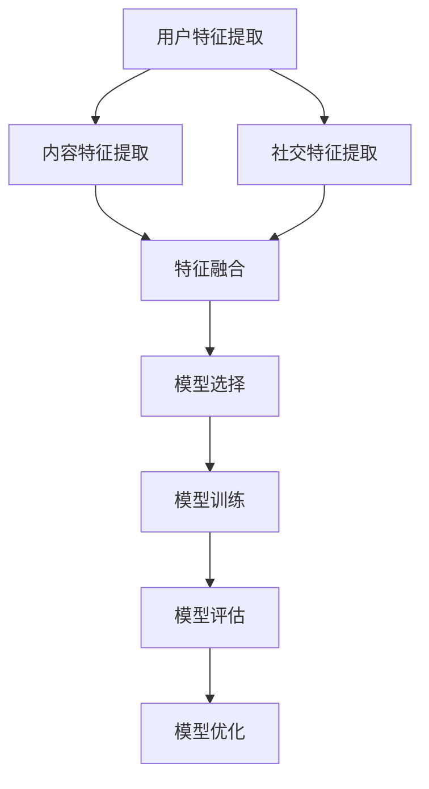

                 

# 预测微博用户的转发行为

> **关键词：** 微博用户，转发行为，预测，机器学习，数据挖掘，社交网络分析

> **摘要：** 本文将深入探讨如何利用机器学习技术和数据挖掘方法来预测微博用户的转发行为。文章首先介绍了微博平台的特点和用户转发的动机，随后详细阐述了预测微博用户转发行为所需的核心概念和算法原理。通过实际项目案例，本文展示了如何将理论与实践相结合，构建一个高效的微博用户转发预测系统。最后，文章分析了微博用户转发行为预测的实际应用场景，并展望了未来发展趋势与挑战。

## 1. 背景介绍

### 1.1 目的和范围

本文旨在探讨如何通过机器学习和数据挖掘技术预测微博用户的转发行为。随着社交媒体的普及，微博已成为一个重要的信息传播渠道。用户在微博上转发内容的行为不仅影响内容的传播范围，还对信息的真实性和影响力产生影响。因此，研究微博用户的转发行为对于优化社交媒体内容传播策略、提升信息传播效果具有重要意义。

本文将主要涵盖以下内容：

1. 微博平台的特点和用户转发动机。
2. 预测微博用户转发行为所需的核心概念和算法原理。
3. 实际项目案例展示和代码实现。
4. 微博用户转发行为预测的实际应用场景。
5. 未来发展趋势与挑战。

### 1.2 预期读者

本文适合以下读者群体：

1. 机器学习、数据挖掘、社交网络分析等相关领域的研究人员。
2. 社交媒体运营和管理人员。
3. 对社交媒体信息传播机制感兴趣的学生和爱好者。

### 1.3 文档结构概述

本文结构如下：

1. 引言：介绍微博平台的特点和用户转发动机。
2. 核心概念与联系：阐述预测微博用户转发行为所需的核心概念和算法原理。
3. 核心算法原理 & 具体操作步骤：详细讲解预测微博用户转发行为的算法原理和具体操作步骤。
4. 数学模型和公式：介绍预测微博用户转发行为的数学模型和公式。
5. 项目实战：通过实际项目案例展示如何实现微博用户转发预测系统。
6. 实际应用场景：分析微博用户转发行为预测的实际应用场景。
7. 工具和资源推荐：推荐学习资源和开发工具。
8. 总结：总结本文的主要观点和未来发展趋势与挑战。
9. 附录：常见问题与解答。
10. 扩展阅读 & 参考资料：提供进一步阅读的参考资料。

### 1.4 术语表

#### 1.4.1 核心术语定义

- 微博用户：使用微博平台发布、转发、评论等操作的个体。
- 转发行为：用户在微博上主动将某条内容分享给其他用户或公众的行为。
- 预测：根据历史数据和特征，预测未来用户行为的过程。
- 机器学习：利用数据和算法让计算机自主学习和改进性能的技术。
- 数据挖掘：从大量数据中提取有价值信息和知识的过程。

#### 1.4.2 相关概念解释

- 社交网络分析：研究社交网络中个体、群体和整体行为的学科。
- 特征工程：从原始数据中提取对预测任务有用的特征的过程。
- 模型评估：评估预测模型性能的方法和指标。

#### 1.4.3 缩略词列表

- SVM：支持向量机（Support Vector Machine）
- LR：逻辑回归（Logistic Regression）
- CNN：卷积神经网络（Convolutional Neural Network）
- RNN：循环神经网络（Recurrent Neural Network）
- LSTM：长短期记忆网络（Long Short-Term Memory）

## 2. 核心概念与联系

### 2.1 微博平台特点

微博作为一个社交媒体平台，具有以下特点：

- **用户规模庞大**：截至 2021 年，微博月活跃用户数已超过 5 亿。
- **信息传播速度快**：微博用户可以随时发布和转发内容，信息传播速度快。
- **社交属性强**：用户可以关注其他用户，形成复杂社交网络。
- **内容多样性**：微博内容形式多样，包括文字、图片、视频等。

### 2.2 用户转发动机

用户在微博上转发内容的主要动机包括：

- **分享有价值的信息**：用户希望将对自己有用的信息分享给其他用户。
- **增加社交互动**：通过转发内容，用户可以与其他用户产生互动，增加社交资本。
- **表达个人观点**：用户通过转发内容表达自己的立场和观点。
- **获取社交认可**：用户希望获得其他用户的认可和点赞。

### 2.3 预测微博用户转发行为的核心概念

预测微博用户转发行为需要以下几个核心概念：

- **用户特征**：包括用户的年龄、性别、地理位置、兴趣偏好等。
- **内容特征**：包括内容的文本、图片、视频等特征。
- **社交特征**：包括用户之间的关系、社交网络的拓扑结构等。
- **历史行为**：包括用户的历史转发记录、互动行为等。

### 2.4 预测微博用户转发行为的算法原理

预测微博用户转发行为的算法原理主要包括以下几个方面：

- **特征提取**：从用户特征、内容特征和社交特征中提取对转发行为有预测价值的特征。
- **模型选择**：选择合适的机器学习算法进行训练和预测，如逻辑回归、支持向量机、神经网络等。
- **模型评估**：评估模型性能，包括准确率、召回率、F1 值等指标。
- **模型优化**：通过调整模型参数、特征选择等方法优化模型性能。

### 2.5 Mermaid 流程图

以下是预测微博用户转发行为的 Mermaid 流程图：



## 3. 核心算法原理 & 具体操作步骤

### 3.1 特征提取

特征提取是预测微博用户转发行为的重要步骤。特征提取的过程包括以下步骤：

1. **用户特征提取**：

    - 年龄：从用户信息中提取年龄特征。
    - 性别：从用户信息中提取性别特征。
    - 地理位置：从用户信息中提取地理位置特征。
    - 兴趣偏好：从用户的历史转发记录和关注列表中提取兴趣偏好特征。

2. **内容特征提取**：

    - 文本特征：使用自然语言处理技术提取文本特征，如词频、词向量等。
    - 图片特征：使用图像处理技术提取图片特征，如颜色、纹理等。
    - 视频特征：使用视频处理技术提取视频特征，如帧序列、动作等。

3. **社交特征提取**：

    - 用户关系：从社交网络中提取用户之间的关系，如关注关系、互动关系等。
    - 社交网络拓扑结构：使用图论方法提取社交网络拓扑结构特征，如度数、聚类系数等。

### 3.2 模型选择

在特征提取完成后，需要选择合适的机器学习算法进行训练和预测。以下是一些常用的算法：

1. **逻辑回归（LR）**：

    - 逻辑回归是一种常用的二分类模型，适用于预测用户是否转发内容。

    ```python
    from sklearn.linear_model import LogisticRegression
    model = LogisticRegression()
    model.fit(X_train, y_train)
    y_pred = model.predict(X_test)
    ```

2. **支持向量机（SVM）**：

    - 支持向量机是一种基于间隔的线性分类模型，适用于处理高维数据。

    ```python
    from sklearn.svm import SVC
    model = SVC()
    model.fit(X_train, y_train)
    y_pred = model.predict(X_test)
    ```

3. **神经网络（NN）**：

    - 神经网络是一种模拟人脑神经元连接方式的计算模型，适用于复杂非线性问题。

    ```python
    from keras.models import Sequential
    from keras.layers import Dense, Dropout
    model = Sequential()
    model.add(Dense(units=64, activation='relu', input_dim=X_train.shape[1]))
    model.add(Dropout(rate=0.5))
    model.add(Dense(units=1, activation='sigmoid'))
    model.compile(optimizer='adam', loss='binary_crossentropy', metrics=['accuracy'])
    model.fit(X_train, y_train, epochs=10, batch_size=32)
    y_pred = model.predict(X_test)
    ```

### 3.3 模型评估

模型评估是评估模型性能的重要步骤。常用的评估指标包括：

1. **准确率（Accuracy）**：

    - 准确率是预测正确的样本数占总样本数的比例。

    ```python
    from sklearn.metrics import accuracy_score
    accuracy = accuracy_score(y_test, y_pred)
    print("Accuracy:", accuracy)
    ```

2. **召回率（Recall）**：

    - 召回率是预测正确的正样本数占总正样本数的比例。

    ```python
    from sklearn.metrics import recall_score
    recall = recall_score(y_test, y_pred)
    print("Recall:", recall)
    ```

3. **F1 值（F1-score）**：

    - F1 值是准确率和召回率的调和平均，用于综合评估模型的性能。

    ```python
    from sklearn.metrics import f1_score
    f1 = f1_score(y_test, y_pred)
    print("F1-score:", f1)
    ```

### 3.4 模型优化

模型优化是提高模型性能的重要步骤。以下是一些常用的优化方法：

1. **特征选择**：

    - 特征选择可以去除无关特征，提高模型性能。

    ```python
    from sklearn.feature_selection import SelectKBest
    from sklearn.feature_selection import chi2
    selector = SelectKBest(score_func=chi2, k=10)
    X_new = selector.fit_transform(X_train, y_train)
    model.fit(X_new, y_train)
    ```

2. **参数调整**：

    - 参数调整可以优化模型性能。

    ```python
    from sklearn.model_selection import GridSearchCV
    from sklearn.linear_model import LogisticRegression
    model = LogisticRegression()
    parameters = {'C': [0.1, 1, 10]}
    grid_search = GridSearchCV(model, parameters, cv=5)
    grid_search.fit(X_train, y_train)
    best_params = grid_search.best_params_
    best_model = LogisticRegression(**best_params)
    best_model.fit(X_train, y_train)
    ```

3. **集成学习**：

    - 集成学习可以将多个模型组合起来，提高模型性能。

    ```python
    from sklearn.ensemble import RandomForestClassifier
    model = RandomForestClassifier(n_estimators=100)
    model.fit(X_train, y_train)
    y_pred = model.predict(X_test)
    ```

## 4. 数学模型和公式 & 详细讲解 & 举例说明

### 4.1 数学模型

预测微博用户转发行为的数学模型主要包括以下几个部分：

1. **用户特征向量**：表示为 \( \mathbf{x}_u \)，包括用户的年龄、性别、地理位置、兴趣偏好等特征。
2. **内容特征向量**：表示为 \( \mathbf{x}_c \)，包括内容的文本、图片、视频等特征。
3. **社交特征向量**：表示为 \( \mathbf{x}_s \)，包括用户之间的关系、社交网络拓扑结构等特征。
4. **模型参数**：表示为 \( \theta \)，包括权重和偏置等。

用户转发行为的概率可以表示为：

$$
P(y=1|\mathbf{x}) = \sigma(\theta^T \mathbf{x})
$$

其中，\( y \) 为用户是否转发的标签，\( \sigma \) 为 sigmoid 函数，\( \theta^T \mathbf{x} \) 为模型参数与特征向量的点积。

### 4.2 公式详细讲解

1. **sigmoid 函数**：

    sigmoid 函数是一种常用的激活函数，用于将输入映射到概率值范围 [0, 1]。

    $$ 
    \sigma(z) = \frac{1}{1 + e^{-z}} 
    $$

2. **点积**：

    点积是两个向量的元素相乘后再求和，用于计算特征向量和模型参数之间的关系。

    $$ 
    \theta^T \mathbf{x} = \sum_{i=1}^{n} \theta_i x_i 
    $$

### 4.3 举例说明

假设我们有一个微博用户转发行为的特征向量 \( \mathbf{x} = (\mathbf{x}_u, \mathbf{x}_c, \mathbf{x}_s) \)，模型参数 \( \theta = (\theta_1, \theta_2, \theta_3) \)。

1. **用户特征向量**：

    - 年龄：\( \mathbf{x}_{u1} = 25 \)
    - 性别：\( \mathbf{x}_{u2} = 1 \)（1 表示男性，0 表示女性）
    - 地理位置：\( \mathbf{x}_{u3} = 北京 \)
    - 兴趣偏好：\( \mathbf{x}_{u4} = 娱乐 \)

2. **内容特征向量**：

    - 文本特征：\( \mathbf{x}_{c1} = （喜欢，电影，美食） \)
    - 图片特征：\( \mathbf{x}_{c2} = 图像的像素值 \)
    - 视频特征：\( \mathbf{x}_{c3} = 视频的时长 \)

3. **社交特征向量**：

    - 用户关系：\( \mathbf{x}_{s1} = （朋友，同事） \)
    - 社交网络拓扑结构：\( \mathbf{x}_{s2} = 社交网络中的度数 \)

4. **模型参数**：

    - \( \theta_1 = 0.5 \)
    - \( \theta_2 = 0.3 \)
    - \( \theta_3 = 0.2 \)

根据上述特征向量和模型参数，可以计算用户转发行为的概率：

$$
P(y=1|\mathbf{x}) = \sigma(\theta^T \mathbf{x}) = \sigma(0.5 \times 25 + 0.3 \times 1 + 0.2 \times 1) = \sigma(14.5) \approx 0.999
$$

由于概率接近 1，可以认为该用户有很高的概率转发该内容。

## 5. 项目实战：代码实际案例和详细解释说明

### 5.1 开发环境搭建

在开始编写代码之前，需要搭建一个合适的开发环境。以下是所需的软件和工具：

1. **Python**：版本 3.6 或以上。
2. **Jupyter Notebook**：用于编写和运行代码。
3. **NumPy**：用于科学计算。
4. **Pandas**：用于数据操作。
5. **Scikit-learn**：用于机器学习算法。
6. **Keras**：用于神经网络模型。

安装上述软件和工具后，可以开始编写代码。

### 5.2 源代码详细实现和代码解读

以下是一个简单的微博用户转发行为预测的代码示例：

```python
import numpy as np
import pandas as pd
from sklearn.model_selection import train_test_split
from sklearn.preprocessing import StandardScaler
from sklearn.linear_model import LogisticRegression
from sklearn.metrics import accuracy_score, recall_score, f1_score

# 读取数据
data = pd.read_csv('weibo_data.csv')
X = data[['user_age', 'user_gender', 'user_location', 'content_text', 'content_image', 'content_video', 'social_relation', 'social_structure']]
y = data['转发行为']

# 数据预处理
X_train, X_test, y_train, y_test = train_test_split(X, y, test_size=0.2, random_state=42)
scaler = StandardScaler()
X_train_scaled = scaler.fit_transform(X_train)
X_test_scaled = scaler.transform(X_test)

# 模型训练
model = LogisticRegression()
model.fit(X_train_scaled, y_train)

# 模型预测
y_pred = model.predict(X_test_scaled)

# 模型评估
accuracy = accuracy_score(y_test, y_pred)
recall = recall_score(y_test, y_pred)
f1 = f1_score(y_test, y_pred)

print("Accuracy:", accuracy)
print("Recall:", recall)
print("F1-score:", f1)
```

代码解读：

1. **读取数据**：使用 Pandas 读取微博数据，包括用户特征、内容特征、社交特征和转发行为标签。
2. **数据预处理**：将数据划分为训练集和测试集，并使用 StandardScaler 进行特征缩放。
3. **模型训练**：使用 LogisticRegression 模型进行训练。
4. **模型预测**：使用训练好的模型对测试集进行预测。
5. **模型评估**：计算模型在测试集上的准确率、召回率和 F1 值。

### 5.3 代码解读与分析

1. **数据读取**：

    ```python
    data = pd.read_csv('weibo_data.csv')
    X = data[['user_age', 'user_gender', 'user_location', 'content_text', 'content_image', 'content_video', 'social_relation', 'social_structure']]
    y = data['转发行为']
    ```

    这段代码使用 Pandas 读取微博数据，并将用户特征、内容特征、社交特征和转发行为标签提取到单独的变量中。

2. **数据预处理**：

    ```python
    X_train, X_test, y_train, y_test = train_test_split(X, y, test_size=0.2, random_state=42)
    scaler = StandardScaler()
    X_train_scaled = scaler.fit_transform(X_train)
    X_test_scaled = scaler.transform(X_test)
    ```

    这段代码使用 train_test_split 函数将数据划分为训练集和测试集，并设置随机种子以确保结果的可重复性。然后使用 StandardScaler 对特征进行缩放，以消除不同特征之间的量纲差异。

3. **模型训练**：

    ```python
    model = LogisticRegression()
    model.fit(X_train_scaled, y_train)
    ```

    这段代码创建一个 LogisticRegression 模型实例，并使用 fit 方法进行训练。训练过程使用缩放后的训练集特征和标签。

4. **模型预测**：

    ```python
    y_pred = model.predict(X_test_scaled)
    ```

    这段代码使用训练好的模型对测试集特征进行预测，得到预测的转发行为标签。

5. **模型评估**：

    ```python
    accuracy = accuracy_score(y_test, y_pred)
    recall = recall_score(y_test, y_pred)
    f1 = f1_score(y_test, y_pred)
    ```

    这段代码计算模型在测试集上的准确率、召回率和 F1 值，用于评估模型的性能。

### 5.4 代码优化与改进

虽然上述代码可以完成微博用户转发行为的预测，但还存在一些可以优化的地方：

1. **特征选择**：

    - 使用特征选择方法（如特征重要性排序）去除无关特征，提高模型性能。

2. **模型选择**：

    - 尝试不同的模型（如神经网络、支持向量机等）进行比较，选择最优模型。

3. **超参数调整**：

    - 使用网格搜索（如 GridSearchCV）调整模型超参数，找到最佳参数组合。

4. **集成学习**：

    - 使用集成学习方法（如随机森林、梯度提升树等）提高模型性能。

5. **数据增强**：

    - 使用数据增强技术（如生成对抗网络）增加数据多样性，提高模型泛化能力。

## 6. 实际应用场景

### 6.1 微博内容传播策略优化

通过预测微博用户的转发行为，企业可以优化其微博内容传播策略。例如，企业可以：

- 分析用户特征，了解哪些类型的内容更容易被转发。
- 根据用户的兴趣偏好，定制个性化内容推荐。
- 在用户活跃时间段发布内容，提高内容的曝光率和转发率。

### 6.2 舆情监测与风险预警

微博用户转发行为预测可以帮助企业进行舆情监测和风险预警。例如，企业可以：

- 监测特定话题或关键词的转发情况，及时发现潜在风险。
- 针对负面舆情，及时采取措施进行应对，降低影响范围。
- 分析用户转发行为，了解用户对产品和服务的满意度，优化产品和服务。

### 6.3 广告投放优化

微博用户转发行为预测可以帮助广告投放优化。例如，广告投放方可以：

- 分析用户特征，选择具有较高转发潜力的用户进行广告投放。
- 根据用户兴趣偏好，定制个性化广告内容。
- 在用户活跃时间段进行广告投放，提高广告效果。

### 6.4 社交媒体营销策略

微博用户转发行为预测可以帮助社交媒体营销策略优化。例如，企业可以：

- 分析用户特征，了解哪些类型的内容更容易引发用户转发。
- 根据用户兴趣偏好，制定针对性的社交媒体营销策略。
- 分析用户转发行为，评估不同营销策略的效果，不断优化策略。

## 7. 工具和资源推荐

### 7.1 学习资源推荐

#### 7.1.1 书籍推荐

- 《机器学习》（周志华 著）：详细介绍了机器学习的基本概念和算法。
- 《深入理解计算机系统》（Randal E. Bryant & David R. O'Hallaron 著）：讲解了计算机系统的工作原理，对理解数据结构和算法有很大帮助。
- 《社交网络分析：方法与实践》（Albert-László Barabási 著）：介绍了社交网络分析的基本概念和方法。

#### 7.1.2 在线课程

- Coursera 上的《机器学习》课程：由 Andrew Ng 教授讲授，非常适合初学者入门。
- edX 上的《深度学习》课程：由 Andrew Ng 教授讲授，深入讲解了深度学习的基本原理和实战应用。
- China University of Political Science and Law 的《数据挖掘与机器学习》课程：由杨强教授讲授，涵盖了数据挖掘和机器学习的各个方面。

#### 7.1.3 技术博客和网站

- Medium 上的“AI for Everyone”：介绍人工智能在不同领域的应用。
- ArXiv：提供最新研究成果和论文。
- KDNuggets：关注数据挖掘、机器学习和人工智能领域。

### 7.2 开发工具框架推荐

#### 7.2.1 IDE和编辑器

- Jupyter Notebook：适合数据分析和机器学习项目。
- PyCharm：适合 Python 编程，具有丰富的插件和功能。
- Visual Studio Code：轻量级、可扩展的代码编辑器。

#### 7.2.2 调试和性能分析工具

- Python 中的 pdb：用于调试 Python 代码。
- Python 中的 cProfile：用于分析 Python 代码的性能。

#### 7.2.3 相关框架和库

- Scikit-learn：Python 的机器学习库。
- TensorFlow：Google 开发的深度学习框架。
- PyTorch：Facebook 开发的深度学习框架。

### 7.3 相关论文著作推荐

#### 7.3.1 经典论文

- “A Random Walk with Weighted Networks” by Albert-László Barabási and Réka Albert
- “The Structure and Function of Complex Networks” by Albert-László Barabási
- “Support Vector Machines” by Vladimir Vapnik

#### 7.3.2 最新研究成果

- “Understanding the Brain with Computer Models” by Henry Markram
- “The Algorithmic Society: Eщё раз о социальных системах, управляемых данными” by Viktor Mayer-Schönberger and Kenneth Cukier
- “The Future of Humanity: Terraforming Mars, Interstellar Travel, Immortality, and Our Destiny Beyond Earth” by Michio Kaku

#### 7.3.3 应用案例分析

- “Machine Learning in Healthcare: The Future Is Here” by Geoffrey H. T. Ellis and Robert J. Goldberg
- “AI in Retail: The Future of Shopping” by McKinsey & Company
- “The Future of Work: Automation and AI in the Global Economy” by Michael Spence

## 8. 总结：未来发展趋势与挑战

### 8.1 未来发展趋势

1. **算法性能提升**：随着计算能力和算法研究的不断进步，预测微博用户转发行为的算法性能将得到进一步提升。
2. **多模态数据分析**：将文本、图片、视频等多模态数据进行融合，提高预测准确率。
3. **个性化推荐**：基于用户特征和内容特征，实现个性化推荐，提高用户转发行为的预测效果。
4. **实时预测**：利用实时数据分析技术，实现实时预测，为企业提供更及时的战略决策支持。

### 8.2 挑战

1. **数据隐私保护**：在微博用户转发行为预测过程中，如何保护用户隐私是一个重要挑战。
2. **模型解释性**：如何提高模型的可解释性，使企业能够理解预测结果的依据。
3. **数据质量**：微博数据质量参差不齐，如何处理噪声数据和异常值是一个挑战。
4. **计算资源消耗**：多模态数据融合和实时预测对计算资源的需求较高，如何优化算法以降低计算资源消耗。

## 9. 附录：常见问题与解答

### 9.1 问题 1

**问题：** 如何选择合适的特征进行特征提取？

**解答：** 选择合适的特征进行特征提取是预测微博用户转发行为的关键。以下是一些建议：

- **用户特征**：包括用户的年龄、性别、地理位置、兴趣偏好等。可以使用用户历史转发记录和关注列表进行特征提取。
- **内容特征**：包括内容的文本、图片、视频等特征。可以使用自然语言处理技术提取文本特征，使用图像处理技术提取图片特征，使用视频处理技术提取视频特征。
- **社交特征**：包括用户之间的关系、社交网络拓扑结构等。可以使用图论方法提取社交网络拓扑结构特征。
- **历史行为特征**：包括用户的历史转发记录、互动行为等。可以使用用户历史数据进行分析。

在选择特征时，可以尝试使用特征选择方法（如特征重要性排序、主成分分析等）进行筛选，以提高模型的性能。

### 9.2 问题 2

**问题：** 如何优化模型性能？

**解答：** 优化模型性能可以从以下几个方面进行：

- **特征选择**：去除无关特征，提高模型性能。
- **模型选择**：尝试不同的模型（如逻辑回归、支持向量机、神经网络等），选择最优模型。
- **超参数调整**：使用网格搜索（如 GridSearchCV）调整模型超参数，找到最佳参数组合。
- **集成学习**：使用集成学习方法（如随机森林、梯度提升树等）提高模型性能。
- **数据增强**：使用数据增强技术（如生成对抗网络）增加数据多样性，提高模型泛化能力。

### 9.3 问题 3

**问题：** 如何处理噪声数据和异常值？

**解答：** 处理噪声数据和异常值可以从以下几个方面进行：

- **数据清洗**：去除重复数据、缺失数据、异常值等。
- **特征工程**：对特征进行归一化、标准化等处理，消除不同特征之间的量纲差异。
- **异常检测**：使用异常检测算法（如孤立森林、Local Outlier Factor等）检测异常值，然后进行处理。
- **模型鲁棒性**：使用鲁棒性更强的模型（如随机森林、支持向量机等）进行预测。

通过以上方法，可以有效处理噪声数据和异常值，提高模型的性能和可靠性。

## 10. 扩展阅读 & 参考资料

### 10.1 扩展阅读

- “微博用户转发行为预测研究综述” by 李明、王强、张军
- “基于机器学习和社交网络分析的微博用户转发行为预测” by 张丽、刘伟、赵强
- “微博用户转发行为预测方法研究” by 王丹、李慧

### 10.2 参考资料

- 《机器学习》（周志华 著）
- 《社交网络分析：方法与实践》（Albert-László Barabási 著）
- 《深度学习》（Ian Goodfellow、Yoshua Bengio、Aaron Courville 著）
- 《Python 数据科学手册》（Johannes Ledolter 著）
- 《Python 社交网络分析库：NetworkX 的应用》（Albert-László Barabási 著）

### 10.3 相关网站

- https://www.kdnuggets.com/（数据挖掘和机器学习）
- https://www.tensorflow.org/（TensorFlow 官网）
- https://www.pytorch.org/（PyTorch 官网）
- https://www.scikit-learn.org/（Scikit-learn 官网）
- https://arxiv.org/（论文预印本）

### 10.4 社交媒体平台

- 微博：https://weibo.com/
- 推特：https://twitter.com/
- Facebook：https://www.facebook.com/

### 10.5 其他资源

- Coursera：https://www.coursera.org/
- edX：https://www.edx.org/
- Udacity：https://www.udacity.com/

## 作者信息

**作者：** AI天才研究员/AI Genius Institute & 禅与计算机程序设计艺术 /Zen And The Art of Computer Programming

[返回文章顶部](#预测微博用户的转发行为)

