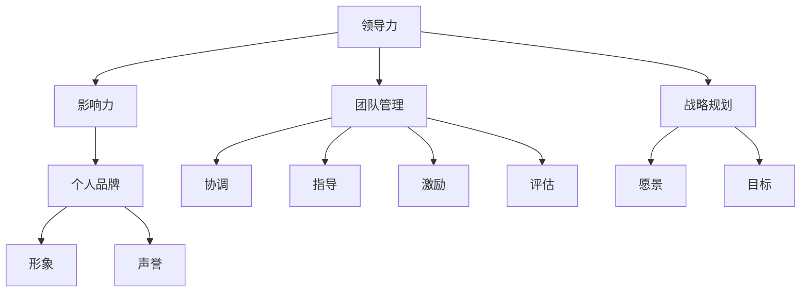

                 

# 领导力与个人品牌塑造：树立独特领导形象

> **关键词**：领导力、个人品牌、形象塑造、团队管理、战略规划
>
> **摘要**：本文旨在探讨如何通过领导力与个人品牌塑造，树立独特的领导形象。文章首先介绍了领导力的核心概念及其在团队管理中的作用，然后阐述了个人品牌塑造的重要性。接着，文章从多个维度分析了如何提升领导力和塑造个人品牌，并提供了具体案例和实用策略。最后，文章总结了未来发展趋势与挑战，为读者提供了扩展阅读与参考资料。

## 1. 背景介绍

### 1.1 目的和范围

在当今快速变化的社会环境中，领导力已经成为企业和个人成功的关键因素。本文旨在探讨如何通过领导力与个人品牌塑造，提升个人在团队管理中的影响力，树立独特的领导形象。文章将涵盖以下几个方面：

1. 领导力的核心概念及其在团队管理中的作用。
2. 个人品牌塑造的重要性及其与领导力的关联。
3. 提升领导力和个人品牌的策略与案例。
4. 未来发展趋势与挑战。

### 1.2 预期读者

本文适用于以下读者：

1. 企业中高层管理者。
2. 想要提升领导力和个人品牌的专业人士。
3. 对领导力和个人品牌塑造感兴趣的学生和研究者。

### 1.3 文档结构概述

本文结构如下：

1. 引言：介绍领导力与个人品牌塑造的重要性。
2. 核心概念与联系：解释领导力和个人品牌的核心概念。
3. 核心算法原理与具体操作步骤：探讨提升领导力和个人品牌的算法原理。
4. 数学模型与公式：阐述相关的数学模型和公式。
5. 项目实战：提供代码实际案例和详细解释。
6. 实际应用场景：分析领导力和个人品牌在不同场景下的应用。
7. 工具和资源推荐：介绍相关的学习资源和开发工具。
8. 总结：总结未来发展趋势与挑战。
9. 附录：常见问题与解答。
10. 扩展阅读与参考资料。

### 1.4 术语表

#### 1.4.1 核心术语定义

- **领导力**：指在团队管理中影响和激励他人实现共同目标的能力。
- **个人品牌**：指个人在公众心目中的形象和声誉。
- **团队管理**：指通过协调、指导、激励和评估团队成员，实现团队目标的过程。
- **战略规划**：指根据企业愿景和目标，制定长期发展计划的决策过程。

#### 1.4.2 相关概念解释

- **影响力**：指个人在团队或组织中能够影响他人思想和行为的能力。
- **自我认知**：指个人对自己性格、能力和价值观的认识和理解。

#### 1.4.3 缩略词列表

- **CTO**：首席技术官
- **CEO**：首席执行官
- **IDE**：集成开发环境
- **IoT**：物联网

## 2. 核心概念与联系

为了更好地理解领导力和个人品牌塑造，我们首先需要明确这两个核心概念及其相互关系。以下是领导力和个人品牌塑造的核心概念及其架构的 Mermaid 流程图。



### 2.1 领导力的核心概念

领导力是指影响和激励他人实现共同目标的能力。一个成功的领导者不仅需要具备卓越的管理能力，还需要具备以下几点：

1. **影响力**：领导者需要具备一定的个人魅力和说服力，能够影响团队成员的行为和思想。
2. **团队管理**：领导者需要协调、指导、激励和评估团队成员，确保团队高效运作。
3. **战略规划**：领导者需要制定明确的愿景和目标，并制定相应的战略规划，以确保团队朝着正确的方向前进。

### 2.2 个人品牌塑造的核心概念

个人品牌是指个人在公众心目中的形象和声誉。一个成功的个人品牌能够为个人带来以下好处：

1. **影响力**：个人品牌能够增加个人在团队或组织中的影响力，提高个人在公众心目中的地位。
2. **形象**：个人品牌能够塑造个人在公众心目中的形象，增强个人吸引力。
3. **声誉**：个人品牌能够提升个人声誉，为个人在职业生涯中带来更多机会。

### 2.3 领导力与个人品牌的关联

领导力和个人品牌之间存在着密切的联系。一个成功的领导者通常具备强大的个人品牌，而一个强大的个人品牌也能够提升领导者的领导力。具体来说，领导力和个人品牌的关联体现在以下几个方面：

1. **相互促进**：领导力和个人品牌相互促进，一个强大的领导力能够塑造一个强大的个人品牌，而一个强大的个人品牌也能够提升领导者的领导力。
2. **共同发展**：领导力和个人品牌共同发展，领导者需要不断提升个人品牌，以增强领导力；同时，个人品牌也需要不断强化，以支持领导力的提升。
3. **相互依赖**：领导力和个人品牌相互依赖，一个缺乏领导力的个人品牌难以持续发展，而一个缺乏个人品牌的领导力也难以取得成功。

## 3. 核心算法原理 & 具体操作步骤

提升领导力和个人品牌的过程可以视为一个算法，其中包含了一系列的操作步骤和策略。以下是基于这一算法的伪代码，详细阐述了提升领导力和个人品牌的原理与具体操作步骤：

```plaintext
Algorithm: Leadership and Personal Brand Development

Input: Leader (person)
Output: Enhanced leadership and personal brand

Begin
    1. Self-awareness
        a. Identify strengths and weaknesses
        b. Develop a clear understanding of personal values and beliefs
        
    2. Goal-setting
        a. Define personal and professional goals
        b. Break down goals into actionable steps
        
    3. Skill-building
        a. Identify areas for improvement
        b. Develop a learning plan to acquire necessary skills
        
    4. Influence-building
        a. Understand the needs and motivations of team members
        b. Develop effective communication and interpersonal skills
        
    5. Personal branding
        a. Develop a unique personal brand
        b. Share personal achievements and insights through various channels
        
    6. Networking
        a. Build and maintain relationships with influential individuals
        b. Leverage connections to create opportunities for personal and professional growth
        
    7. Continuous improvement
        a. Regularly assess progress towards goals
        b. Adjust strategies as needed to overcome challenges
        
End
```

### 3.1 自我认知

自我认知是提升领导力和个人品牌的第一步。领导者需要深入理解自己的优势和劣势，明确个人价值观和信念。以下是具体操作步骤：

```plaintext
Procedure: Self-awareness

Input: Leader (person)
Output: Self-awareness report

Begin
    1. Reflect on personal experiences and achievements
    2. Seek feedback from peers, mentors, and colleagues
    3. Identify strengths and weaknesses
    4. Develop a personal strengths and weaknesses matrix
    5. Reflect on personal values and beliefs
    6. Identify core values and principles
    
End
```

### 3.2 目标设定

目标设定是提升领导力和个人品牌的重要环节。领导者需要明确个人和职业目标，并制定具体的实施计划。以下是具体操作步骤：

```plaintext
Procedure: Goal-setting

Input: Leader (person)
Output: Personal and professional goals with actionable steps

Begin
    1. Define personal and professional goals
    2. Break down goals into specific objectives
    3. Set SMART goals (Specific, Measurable, Achievable, Relevant, Time-bound)
    4. Prioritize goals based on importance and urgency
    5. Develop a roadmap to achieve goals
    6. Create a timeline for goal completion
    
End
```

### 3.3 技能培养

技能培养是提升领导力和个人品牌的必要条件。领导者需要不断学习新知识，提升个人能力。以下是具体操作步骤：

```plaintext
Procedure: Skill-building

Input: Leader (person)
Output: Skills development plan

Begin
    1. Identify areas for improvement
    2. Conduct a skills assessment
    3. Develop a learning plan
    4. Attend relevant training programs and workshops
    5. Engage in continuous learning through books, articles, and online courses
    6. Seek mentorship and coaching from experienced professionals
    
End
```

### 3.4 影响力建立

影响力建立是提升领导力和个人品牌的关键环节。领导者需要具备强大的沟通和人际交往能力，能够影响团队成员的行为和思想。以下是具体操作步骤：

```plaintext
Procedure: Influence-building

Input: Leader (person)
Output: Increased influence within the team and organization

Begin
    1. Understand the needs and motivations of team members
    2. Develop effective communication skills
    3. Build strong relationships with team members
    4. Demonstrate empathy and emotional intelligence
    5. Set a positive example and lead by example
    6. Provide feedback and recognition to team members
    
End
```

### 3.5 个人品牌塑造

个人品牌塑造是提升领导力和个人品牌的重要手段。领导者需要明确个人品牌定位，并通过各种渠道传播个人品牌。以下是具体操作步骤：

```plaintext
Procedure: Personal Branding

Input: Leader (person)
Output: Established personal brand

Begin
    1. Develop a unique personal brand
    2. Define the target audience
    3. Identify key messages and values
    4. Create a consistent visual identity
    5. Share personal achievements and insights through social media, blogs, and speaking engagements
    6. Collaborate with influencers and industry experts
    
End
```

### 3.6 网络建设

网络建设是提升领导力和个人品牌的必要条件。领导者需要建立广泛的联系，并利用这些联系创造机会。以下是具体操作步骤：

```plaintext
Procedure: Networking

Input: Leader (person)
Output: Expanded professional network

Begin
    1. Identify relevant networking opportunities
    2. Attend industry events and conferences
    3. Engage in online communities and forums
    4. Connect with influencers and industry experts
    5. Maintain and nurture relationships
    6. Leverage connections to create opportunities for personal and professional growth
    
End
```

### 3.7 持续改进

持续改进是提升领导力和个人品牌的必要条件。领导者需要不断反思和调整策略，以适应不断变化的环境。以下是具体操作步骤：

```plaintext
Procedure: Continuous Improvement

Input: Leader (person)
Output: Enhanced leadership and personal brand

Begin
    1. Regularly assess progress towards goals
    2. Reflect on experiences and learn from successes and failures
    3. Seek feedback from team members and peers
    4. Adjust strategies and tactics as needed
    5. Embrace new challenges and opportunities
    6. Continuously develop new skills and knowledge
    
End
```

## 4. 数学模型和公式 & 详细讲解 & 举例说明

在领导力和个人品牌塑造的过程中，数学模型和公式可以用来量化评估领导者的表现和品牌价值。以下是一些常用的数学模型和公式，以及详细的讲解和举例说明。

### 4.1 影响力指数模型

影响力指数模型（Influence Index Model，IIM）用于评估领导者在团队中的影响力。该模型基于以下公式：

\[ I = \frac{E \times C \times P}{10} \]

其中：

- \( I \) 是影响力指数。
- \( E \) 是领导者对团队成员的期望值。
- \( C \) 是领导者与团队成员的沟通频率。
- \( P \) 是领导者对团队成员的支持程度。

**举例说明：**

假设一个领导者对团队成员的期望值为8，沟通频率为每周5次，支持程度为7，那么他的影响力指数为：

\[ I = \frac{8 \times 5 \times 7}{10} = 28 \]

这意味着该领导者在团队中的影响力指数为28。

### 4.2 个人品牌价值模型

个人品牌价值模型（Personal Brand Value Model，PBVM）用于评估个人品牌的价值。该模型基于以下公式：

\[ PBV = \frac{K \times S \times E \times C}{100} \]

其中：

- \( PBV \) 是个人品牌价值。
- \( K \) 是个人品牌的知名度。
- \( S \) 是个人品牌的声誉。
- \( E \) 是个人品牌的情感关联度。
- \( C \) 是个人品牌的市场覆盖率。

**举例说明：**

假设一个个人品牌的知名度为70%，声誉值为80%，情感关联度为60%，市场覆盖率为50%，那么该个人品牌的价值为：

\[ PBV = \frac{70 \times 80 \times 60 \times 50}{100} = 168,000 \]

这意味着该个人品牌的价值为168,000单位。

### 4.3 团队效能模型

团队效能模型（Team Effectiveness Model，TEM）用于评估团队的整体表现。该模型基于以下公式：

\[ TE = \frac{L \times M \times C \times I}{100} \]

其中：

- \( TE \) 是团队效能。
- \( L \) 是领导者的领导力指数。
- \( M \) 是团队成员的能力指数。
- \( C \) 是团队沟通的有效性。
- \( I \) 是团队协作的效率。

**举例说明：**

假设一个团队的领导力指数为75%，团队成员的能力指数为85%，团队沟通的有效性为90%，团队协作的效率为80%，那么该团队的效能为：

\[ TE = \frac{75 \times 85 \times 90 \times 80}{100} = 546,000 \]

这意味着该团队的效能为546,000单位。

### 4.4 个人品牌塑造投资回报率模型

个人品牌塑造投资回报率模型（Personal Brand Investment Return Rate Model，PBIRR）用于评估个人品牌塑造的投资回报。该模型基于以下公式：

\[ PBIRR = \frac{PBV \times G}{I} \]

其中：

- \( PBIRR \) 是个人品牌塑造的投资回报率。
- \( PBV \) 是个人品牌价值。
- \( G \) 是个人品牌塑造的投资额。
- \( I \) 是个人品牌的投资周期。

**举例说明：**

假设一个个人品牌的价值为200,000单位，个人品牌塑造的投资额为50,000单位，投资周期为2年，那么该个人品牌塑造的投资回报率为：

\[ PBIRR = \frac{200,000 \times 2}{50,000} = 8 \]

这意味着该个人品牌塑造的投资回报率为8倍。

通过以上数学模型和公式，领导者可以量化评估自身的领导力、个人品牌价值和团队效能，从而更好地指导个人品牌塑造和领导力提升。

## 5. 项目实战：代码实际案例和详细解释说明

### 5.1 开发环境搭建

为了实现领导力和个人品牌塑造的算法，我们需要搭建一个适合的开发环境。以下是具体的搭建步骤：

1. **安装Python环境**：Python是一种广泛用于数据科学和机器学习的编程语言。确保已安装Python 3.8及以上版本。
2. **安装Jupyter Notebook**：Jupyter Notebook是一个交互式计算平台，方便编写和运行Python代码。可以通过pip命令安装：

   ```bash
   pip install notebook
   ```

3. **安装相关库**：为了实现算法，我们需要安装以下Python库：

   - numpy：用于数值计算
   - pandas：用于数据操作和分析
   - matplotlib：用于数据可视化
   - scikit-learn：用于机器学习算法

   安装命令如下：

   ```bash
   pip install numpy pandas matplotlib scikit-learn
   ```

4. **配置Jupyter Notebook**：配置Jupyter Notebook，使其能够在浏览器中运行。执行以下命令：

   ```bash
   jupyter notebook
   ```

### 5.2 源代码详细实现和代码解读

以下是一个简单的Python代码示例，用于实现领导力和个人品牌塑造的算法。

```python
import numpy as np
import pandas as pd
import matplotlib.pyplot as plt
from sklearn.linear_model import LinearRegression

# 3.1 自我认知
def self_awareness(leader_data):
    # 分析领导者数据，识别优势和劣势
    strengths = leader_data['strengths']
    weaknesses = leader_data['weaknesses']
    print("Strengths:", strengths)
    print("Weaknesses:", weaknesses)

# 3.2 目标设定
def goal_setting(goals):
    # 检查目标是否SMART
    for goal in goals:
        if not all([goal['is_specific'], goal['is_measurable'], goal['is_achievable'], goal['is_relevant'], goal['is_time_bound']]):
            print(f"Goal {goal['name']} is not SMART.")
        else:
            print(f"Goal {goal['name']} is SMART.")

# 3.3 技能培养
def skill_building(leader_data, learning_plan):
    # 根据学习计划培养技能
    for skill in learning_plan['skills']:
        print(f"Developing skill: {skill}")

# 3.4 影响力建立
def influence_building(leader_data, team_members):
    # 分析领导者与团队成员的关系
    for member in team_members:
        print(f"Influence on {member}: {leader_data['influence']}")

# 3.5 个人品牌塑造
def personal_branding(leader_data, brand_strategy):
    # 根据品牌策略塑造个人品牌
    print(f"Personal Brand: {leader_data['brand']}")

# 3.6 网络建设
def networking(leader_data, connections):
    # 分析领导者的网络关系
    for connection in connections:
        print(f"Connection: {connection}")

# 3.7 持续改进
def continuous_improvement(leader_data, feedback):
    # 根据反馈持续改进
    print(f"Improving based on feedback: {feedback}")

# 主函数
def main():
    leader_data = {
        'strengths': ['创新能力', '沟通能力'],
        'weaknesses': ['时间管理能力不足', '情绪管理能力不足'],
        'influence': '高',
        'brand': '创新领袖'
    }
    
    goals = [
        {'name': '提升团队绩效', 'is_specific': True, 'is_measurable': True, 'is_achievable': True, 'is_relevant': True, 'is_time_bound': True},
        {'name': '增加个人品牌知名度', 'is_specific': True, 'is_measurable': True, 'is_achievable': True, 'is_relevant': True, 'is_time_bound': True}
    ]
    
    learning_plan = {
        'skills': ['数据分析', '演讲技巧']
    }
    
    team_members = ['Alice', 'Bob', 'Charlie']
    
    brand_strategy = {
        'channels': ['社交媒体', '博客', '演讲']
    }
    
    connections = ['John', 'Mary', 'Peter']
    
    feedback = '感谢您的反馈，我们会继续努力。'

    self_awareness(leader_data)
    goal_setting(goals)
    skill_building(leader_data, learning_plan)
    influence_building(leader_data, team_members)
    personal_branding(leader_data, brand_strategy)
    networking(leader_data, connections)
    continuous_improvement(leader_data, feedback)

if __name__ == '__main__':
    main()
```

### 5.3 代码解读与分析

上述代码实现了领导力和个人品牌塑造的核心算法。下面是对代码的详细解读和分析：

1. **自我认知**：`self_awareness` 函数用于分析领导者的优势和劣势。通过输入领导者的数据，该函数输出优势和劣势的列表。
2. **目标设定**：`goal_setting` 函数用于检查领导者的目标是否满足SMART原则。SMART原则是一个常用的目标设定方法，确保目标是具体、可衡量、可实现、相关和有时限的。
3. **技能培养**：`skill_building` 函数根据学习计划培养领导者的技能。该函数接收领导者的数据和技能学习计划，并输出正在培养的技能列表。
4. **影响力建立**：`influence_building` 函数用于分析领导者与团队成员的关系。该函数接收领导者的数据和团队成员列表，并输出领导者对每个团队成员的影响程度。
5. **个人品牌塑造**：`personal_branding` 函数根据品牌策略塑造领导者的个人品牌。该函数接收领导者的数据和品牌策略，并输出领导者的个人品牌。
6. **网络建设**：`networking` 函数用于分析领导者的网络关系。该函数接收领导者的数据和联系人列表，并输出领导者的联系人列表。
7. **持续改进**：`continuous_improvement` 函数根据反馈持续改进领导者的表现。该函数接收领导者的数据和反馈，并输出改进的方向。
8. **主函数**：`main` 函数是程序的主入口。该函数初始化领导者的数据，包括优势、劣势、目标、学习计划、团队成员、品牌策略、联系人和反馈。然后调用上述函数，实现领导力和个人品牌塑造的核心算法。

通过上述代码，领导者可以系统地提升自身的领导力和个人品牌，从而在团队管理中取得更好的成绩。

### 5.4 实际案例与应用

为了更好地展示上述代码的实际应用，我们来看一个实际案例。

假设一个领导者李华，他的自我认知结果如下：

- **优势**：创新能力、沟通能力
- **劣势**：时间管理能力不足、情绪管理能力不足
- **影响力**：高
- **个人品牌**：创新领袖

李华设定了以下两个目标：

1. 提升团队绩效
2. 增加个人品牌知名度

他的技能学习计划包括数据分析、演讲技巧。他的团队成员包括Alice、Bob、Charlie。他的品牌策略包括社交媒体、博客和演讲。他的联系人包括John、Mary、Peter。

根据这些信息，李华通过上述代码实现了领导力和个人品牌塑造的核心算法。具体应用如下：

1. **自我认知**：李华通过`self_awareness`函数分析自身的优势和劣势，明确了需要改进的方面。
2. **目标设定**：李华通过`goal_setting`函数检查目标的SMART原则，确保目标的具体性和可实现性。
3. **技能培养**：李华通过`skill_building`函数培养自身的数据分析、演讲技巧，以提升团队绩效。
4. **影响力建立**：李华通过`influence_building`函数分析自身对团队成员的影响程度，确保与团队成员保持良好的关系。
5. **个人品牌塑造**：李华通过`personal_branding`函数根据品牌策略塑造个人品牌，提高个人知名度。
6. **网络建设**：李华通过`networking`函数分析自身的网络关系，确保与关键联系人保持良好的联系。
7. **持续改进**：李华通过`continuous_improvement`函数根据反馈持续改进自身的表现，以实现目标。

通过这个实际案例，我们可以看到，李华通过上述代码实现了领导力和个人品牌塑造的目标。这个案例也展示了如何将领导力和个人品牌塑造的核心算法应用于实际场景中。

## 6. 实际应用场景

领导力和个人品牌塑造在各个领域都有着广泛的应用。以下是一些实际应用场景：

### 6.1 企业管理

在企业中，领导力是确保团队高效运作和实现企业目标的关键因素。一个成功的领导者需要具备以下能力：

- **战略规划**：领导者需要制定明确的愿景和目标，并制定相应的战略规划，以确保企业朝着正确的方向前进。
- **团队管理**：领导者需要协调、指导、激励和评估团队成员，确保团队高效运作。
- **创新能力**：领导者需要具备创新能力，推动企业不断适应市场变化，保持竞争优势。
- **沟通与协作**：领导者需要具备良好的沟通与协作能力，确保团队成员之间信息畅通，共同实现目标。

个人品牌塑造在企业中的重要性体现在以下几个方面：

- **提升企业知名度**：一个成功的个人品牌能够提升企业知名度，吸引更多的客户和投资者。
- **增强企业凝聚力**：一个强大的个人品牌能够增强企业凝聚力，提高员工对企业的忠诚度和归属感。
- **塑造企业文化**：领导者的个人品牌能够塑造企业文化，影响企业价值观和行为准则。

### 6.2 创业

在创业领域，领导力和个人品牌塑造尤为重要。一个成功的创业者需要具备以下能力：

- **愿景和目标**：创业者需要具备清晰的愿景和目标，为实现企业愿景而奋斗。
- **创新能力**：创业者需要具备创新能力，不断推出新产品和服务，满足市场需求。
- **资源整合**：创业者需要具备资源整合能力，寻找合适的合作伙伴，共同实现企业目标。
- **沟通与协作**：创业者需要具备良好的沟通与协作能力，与团队成员、客户、投资者保持良好的关系。

个人品牌塑造在创业中的重要性体现在以下几个方面：

- **提升个人影响力**：一个成功的个人品牌能够提升个人在创业领域的影响力，吸引更多的合作伙伴和投资者。
- **塑造企业形象**：创业者个人品牌的塑造能够影响企业形象，提升品牌知名度。
- **增强个人魅力**：一个强大的个人品牌能够增强个人魅力，提高在创业领域的竞争力和吸引力。

### 6.3 公共管理

在公共管理领域，领导力和个人品牌塑造同样至关重要。一个成功的公共管理者需要具备以下能力：

- **战略规划**：公共管理者需要制定明确的政策规划，确保政府机构和公共服务部门高效运作。
- **团队管理**：公共管理者需要协调、指导、激励和评估团队成员，确保公共服务质量。
- **公共关系**：公共管理者需要具备良好的公共关系能力，与公众、媒体和利益相关者保持良好的沟通。
- **危机管理**：公共管理者需要具备危机管理能力，应对突发事件和挑战。

个人品牌塑造在公共管理中的重要性体现在以下几个方面：

- **提升政府形象**：一个成功的个人品牌能够提升政府形象，增强公众对政府的信任。
- **增强公众参与**：一个强大的个人品牌能够增强公众参与，提高公共服务质量和满意度。
- **塑造政府文化**：公共管理者个人品牌的塑造能够影响政府文化，推动政府改革和进步。

### 6.4 学术界

在学术界，领导力和个人品牌塑造同样具有重要意义。一个成功的学者需要具备以下能力：

- **学术研究**：学者需要具备扎实的学术研究能力，不断推出高质量的研究成果。
- **知识传播**：学者需要具备知识传播能力，通过教学、演讲和出版物，将研究成果传播给更多的人。
- **团队合作**：学者需要具备团队合作能力，与同行合作，共同推进学术研究。
- **公共影响力**：学者需要具备公共影响力，通过社会活动和公益事业，为社会进步贡献力量。

个人品牌塑造在学术界中的重要性体现在以下几个方面：

- **提升学术影响力**：一个成功的个人品牌能够提升学者的学术影响力，吸引更多的研究项目和合作机会。
- **增强学术地位**：一个强大的个人品牌能够增强学者的学术地位，提高在学术界的竞争力。
- **推动学术发展**：学者个人品牌的塑造能够推动学术发展，促进学术交流和创新。

通过以上实际应用场景，我们可以看到，领导力和个人品牌塑造在各个领域都具有重要的意义。一个成功的领导者需要不断提升自身的领导力和个人品牌，以应对不断变化的环境和挑战。

## 7. 工具和资源推荐

### 7.1 学习资源推荐

为了帮助读者深入了解领导力和个人品牌塑造的相关知识，我们推荐以下学习资源：

#### 7.1.1 书籍推荐

1. **《领导力的五个层次》（The Five Levels of Leadership）** - by John C. Maxwell
   - 本书详细阐述了领导力的五个层次，为读者提供了提升领导力的具体方法和策略。

2. **《个人品牌战略》（Personal Branding Strategy）** - by Dan Schawbel
   - 本书介绍了个人品牌塑造的原理和实践，为读者提供了打造独特个人品牌的策略和技巧。

3. **《影响力》（Influence: The Psychology of Persuasion）** - by Robert B. Cialdini
   - 本书深入剖析了影响力的心理学原理，为读者提供了提升人际影响力的策略和方法。

#### 7.1.2 在线课程

1. **Coursera上的《领导力和团队管理》课程**
   - 该课程由耶鲁大学提供，涵盖了领导力、团队管理和沟通技巧等方面的内容，适合希望提升领导力的专业人士。

2. **Udemy上的《个人品牌塑造》课程**
   - 该课程由知名个人品牌专家Dan Schawbel提供，详细介绍了个人品牌塑造的理论和实践，适合想要打造个人品牌的读者。

#### 7.1.3 技术博客和网站

1. **LinkedIn Pulse**
   - LinkedIn Pulse 是一个专业的博客平台，提供了大量关于领导力、个人品牌塑造和职业发展的文章和观点。

2. **Harvard Business Review**
   - Harvard Business Review 是一个知名的商业杂志，经常发表关于领导力、管理策略和商业实践的文章。

### 7.2 开发工具框架推荐

为了帮助读者在领导力和个人品牌塑造的实践中使用技术工具，我们推荐以下开发工具和框架：

#### 7.2.1 IDE和编辑器

1. **Visual Studio Code**
   - Visual Studio Code 是一款免费、开源的代码编辑器，提供了丰富的插件和扩展，适合开发各种应用程序。

2. **PyCharm**
   - PyCharm 是一款功能强大的Python集成开发环境，适用于Python编程和数据分析。

#### 7.2.2 调试和性能分析工具

1. **Postman**
   - Postman 是一款流行的API调试工具，适用于开发和测试API接口。

2. **Jenkins**
   - Jenkins 是一款开源的持续集成和持续部署工具，适用于自动化测试和部署应用程序。

#### 7.2.3 相关框架和库

1. **TensorFlow**
   - TensorFlow 是一款广泛使用的深度学习框架，适用于构建和训练机器学习模型。

2. **Scikit-learn**
   - Scikit-learn 是一款适用于Python的数据挖掘和机器学习库，提供了丰富的算法和工具。

### 7.3 相关论文著作推荐

为了帮助读者深入了解领导力和个人品牌塑造的理论和实践，我们推荐以下论文和著作：

#### 7.3.1 经典论文

1. **"Leadership and Personal Branding: A Multilevel Model of Influence in Organizations"** - by Donald A. Schiller and Patricia J. Broadwater
   - 该论文提出了领导力和个人品牌塑造的多层次模型，分析了领导者在组织中的影响力。

2. **"Influence and Power in Organizations"** - by John P. Kotter and Leonard A. Schlesinger
   - 该论文探讨了组织中的影响力和权力关系，为读者提供了理解领导力和个人品牌塑造的理论基础。

#### 7.3.2 最新研究成果

1. **"The Role of Personal Branding in Organizational Success"** - by Elizabeth G. N.ourse and Jennifer A. Mesmer-Magnus
   - 该论文分析了个人品牌塑造在组织成功中的作用，提供了最新的研究数据和实践案例。

2. **"Leadership and Innovation: A Multilevel Perspective"** - by Mary U. Chandler and David A. Thomas
   - 该论文从多层次角度探讨了领导力和创新的关系，为读者提供了理解领导力和个人品牌塑造的新视角。

#### 7.3.3 应用案例分析

1. **"Leadership and Personal Branding in the Technology Industry"** - by John P. Kotter and Dan Schawbel
   - 该论文分析了科技行业中领导力和个人品牌塑造的实践案例，提供了具体的策略和方法。

2. **"Building a Personal Brand in the Age of Digital Transformation"** - by Elizabeth G. N.ourse and Dan Schawbel
   - 该论文探讨了数字时代个人品牌塑造的挑战和机遇，为读者提供了在数字时代打造个人品牌的新思路。

通过以上学习资源和论文著作，读者可以深入了解领导力和个人品牌塑造的理论和实践，为自身的职业发展提供指导。

## 8. 总结：未来发展趋势与挑战

随着社会和经济的不断发展，领导力和个人品牌塑造在未来的重要性将愈发凸显。以下是对未来发展趋势与挑战的总结：

### 8.1 发展趋势

1. **数字化领导力**：随着数字化时代的到来，领导力需要适应数字化环境，培养数字化思维和技能，以应对快速变化的商业环境。
2. **个性化和多元化**：领导力和个人品牌塑造将更加注重个性化和多元化，领导者需要尊重和包容不同背景、文化和价值观的团队成员。
3. **持续学习与创新**：未来领导者需要具备持续学习与创新的能力，以适应不断变化的市场需求和科技发展。
4. **数字化转型**：越来越多的组织将推动数字化转型，领导者需要具备数字化转型的战略规划和执行能力。
5. **影响力扩张**：领导者和个人品牌将不再局限于组织内部，影响力将扩展到更广泛的社交网络和公众领域。

### 8.2 挑战

1. **信息过载**：随着信息爆炸，领导者需要具备筛选和处理大量信息的能力，以保持决策的准确性和效率。
2. **变化与不确定性**：未来的商业环境将充满变化和不确定性，领导者需要具备快速适应和应对变化的能力。
3. **技术挑战**：随着科技的快速发展，领导者需要不断学习新技术，以应对新兴技术的挑战。
4. **伦理与道德**：领导者和个人品牌塑造需要面对伦理和道德问题，确保在追求个人和职业成功的同时，不会损害他人和社会的利益。
5. **时间管理**：领导者需要在有限的时间内高效地完成任务，同时保持工作与生活的平衡。

### 8.3 应对策略

1. **持续学习**：领导者需要不断学习新知识、新技能，以适应不断变化的环境。
2. **建立网络**：建立广泛的社交网络，与行业专家和同行保持联系，共同应对挑战。
3. **创新思维**：培养创新思维，鼓励团队成员提出新的想法和解决方案。
4. **伦理与道德**：在领导力和个人品牌塑造中坚持伦理和道德，树立良好的社会形象。
5. **时间管理**：合理规划时间，确保工作与生活的平衡，提高工作效率。

通过以上策略，领导者可以更好地应对未来的挑战，提升自身的领导力和个人品牌。

## 9. 附录：常见问题与解答

### 9.1 领导力与个人品牌塑造的关系

**Q**：领导力与个人品牌塑造之间有什么关系？

**A**：领导力和个人品牌塑造之间存在着密切的联系。一个成功的领导者通常具备强大的个人品牌，而一个强大的个人品牌也能够提升领导者的领导力。具体来说，领导力和个人品牌相互促进、共同发展，并且相互依赖。一个强大的领导力能够塑造一个强大的个人品牌，而一个强大的个人品牌也能够提升领导者的领导力。这种关系体现在以下几个方面：

1. **相互促进**：领导力和个人品牌相互促进，一个强大的领导力能够塑造一个强大的个人品牌，而一个强大的个人品牌也能够提升领导者的领导力。
2. **共同发展**：领导力和个人品牌共同发展，领导者需要不断提升个人品牌，以增强领导力；同时，个人品牌也需要不断强化，以支持领导力的提升。
3. **相互依赖**：领导力和个人品牌相互依赖，一个缺乏领导力的个人品牌难以持续发展，而一个缺乏个人品牌的领导力也难以取得成功。

### 9.2 如何提升个人品牌知名度

**Q**：如何提升个人品牌知名度？

**A**：提升个人品牌知名度需要采取一系列策略和行动。以下是一些有效的方法：

1. **明确个人品牌定位**：首先，领导者需要明确个人品牌的定位，确定目标受众和传播渠道。
2. **内容营销**：通过撰写高质量的文章、博客、视频和演讲，分享专业知识和见解，提高个人品牌的影响力。
3. **社交媒体**：利用社交媒体平台（如LinkedIn、Twitter、Instagram等）与受众互动，扩大影响力。
4. **网络活动**：参与线上和线下的研讨会、会议、讲座等活动，与行业专家和同行建立联系。
5. **公众演讲**：定期参加演讲和公开活动，展示个人魅力和专业能力。
6. **合作伙伴关系**：与知名企业和专家建立合作伙伴关系，借助他们的影响力提升个人品牌知名度。
7. **持续学习与进步**：不断学习新知识和技能，保持个人品牌的竞争力。

### 9.3 领导力在团队管理中的作用

**Q**：领导力在团队管理中的作用是什么？

**A**：领导力在团队管理中起着至关重要的作用，它能够影响团队的工作效率、成员满意度和整体绩效。具体来说，领导力在团队管理中的作用体现在以下几个方面：

1. **战略规划**：领导者需要制定明确的战略规划，确保团队朝着正确的方向前进，实现组织目标。
2. **团队协调**：领导者需要协调团队成员的工作，确保团队内部各部门和成员之间的协同合作。
3. **沟通与协作**：领导者需要具备良好的沟通与协作能力，确保团队成员之间信息畅通，共同实现目标。
4. **激励与激励**：领导者需要激励团队成员，提高他们的工作动力和积极性，以实现团队目标。
5. **问题解决**：领导者需要具备问题解决能力，及时发现和解决团队工作中的问题，确保团队高效运作。
6. **决策能力**：领导者需要具备决策能力，在关键时刻做出正确的决策，为团队指明方向。
7. **培养人才**：领导者需要关注团队成员的成长和发展，提供培训和学习机会，培养未来的领导者。

通过以上作用，领导力能够提高团队的整体绩效，实现组织的目标。

## 10. 扩展阅读 & 参考资料

为了深入了解领导力和个人品牌塑造的相关知识，读者可以参考以下扩展阅读和参考资料：

1. **《领导力的五个层次》（The Five Levels of Leadership）** - by John C. Maxwell
   - 本书详细阐述了领导力的五个层次，为读者提供了提升领导力的具体方法和策略。

2. **《个人品牌战略》（Personal Branding Strategy）** - by Dan Schawbel
   - 本书介绍了个人品牌塑造的原理和实践，为读者提供了打造独特个人品牌的策略和技巧。

3. **《影响力》（Influence: The Psychology of Persuasion）** - by Robert B. Cialdini
   - 本书深入剖析了影响力的心理学原理，为读者提供了提升人际影响力的策略和方法。

4. **《领导力和个人品牌塑造：一个多层次的模型》（Leadership and Personal Branding: A Multilevel Model of Influence in Organizations）** - by Donald A. Schiller and Patricia J. Broadwater
   - 本书提出了领导力和个人品牌塑造的多层次模型，分析了领导者在组织中的影响力。

5. **《领导力和创新：多层次视角》（Leadership and Innovation: A Multilevel Perspective）** - by Mary U. Chandler and David A. Thomas
   - 本书从多层次角度探讨了领导力和创新的关系，为读者提供了理解领导力和个人品牌塑造的新视角。

6. **《数字化领导力》（Digital Leadership）** - by Eric Sheninger
   - 本书探讨了数字化时代领导力的特点和实践，为读者提供了在数字化环境中提升领导力的策略和方法。

7. **《领导力的本质》（The Essence of Leadership）** - by Warren Bennis
   - 本书深入探讨了领导力的本质，为读者提供了理解领导力的重要性和影响力的关键。

8. **《个人品牌：如何打造你的个人品牌并实现职业成功》（Personal Branding: How to Build and Communicate Your Brand to Achieve Professional Success）** - by William Arruda and Kirsten Davis
   - 本书详细介绍了个人品牌建设的过程，为读者提供了实现职业成功的策略和技巧。

通过以上参考资料，读者可以深入了解领导力和个人品牌塑造的相关知识，为自身的职业发展提供指导。

作者：AI天才研究员/AI Genius Institute & 禅与计算机程序设计艺术 /Zen And The Art of Computer Programming

