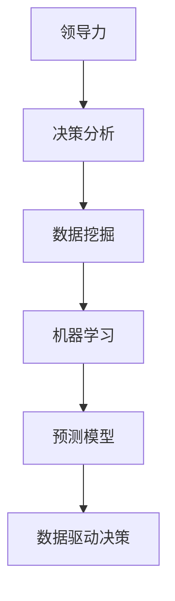

                 

# 领导力与决策分析：数据驱动的决策

> 关键词：领导力、决策分析、数据驱动、算法原理、项目实战、应用场景、工具推荐

> 摘要：本文将深入探讨领导力与决策分析的关系，以及如何通过数据驱动的方法做出科学有效的决策。我们将从核心概念、算法原理、实际应用等多个角度展开讨论，帮助读者理解数据驱动决策的核心要素，掌握在实际项目中运用这些方法的具体步骤。

## 1. 背景介绍

### 1.1 目的和范围

本文旨在探讨领导力与决策分析的关系，并展示如何通过数据驱动的决策方法提高领导效率和决策质量。本文将涵盖以下内容：

- 领导力与决策分析的关系
- 数据驱动决策的核心概念
- 数据驱动决策的算法原理
- 数据驱动决策的具体实践步骤
- 数据驱动决策在实际项目中的应用场景
- 工具和资源的推荐

通过本文的阅读，读者将能够：

- 理解领导力与决策分析之间的紧密联系
- 掌握数据驱动决策的基本原理和方法
- 学会运用数据驱动方法进行实际项目决策
- 了解数据驱动决策的应用场景和未来趋势

### 1.2 预期读者

本文适用于以下读者群体：

- 企业管理层和决策者
- 数据分析师和决策支持人员
- 技术专家和软件开发人员
- 对领导力和决策分析感兴趣的学习者

### 1.3 文档结构概述

本文分为十个部分，结构如下：

1. 背景介绍
2. 核心概念与联系
3. 核心算法原理 & 具体操作步骤
4. 数学模型和公式 & 详细讲解 & 举例说明
5. 项目实战：代码实际案例和详细解释说明
6. 实际应用场景
7. 工具和资源推荐
8. 总结：未来发展趋势与挑战
9. 附录：常见问题与解答
10. 扩展阅读 & 参考资料

### 1.4 术语表

#### 1.4.1 核心术语定义

- **领导力**：指影响、激励和引导他人实现共同目标的能力。
- **决策分析**：通过分析不同的决策选项及其潜在结果，选择最优决策的过程。
- **数据驱动决策**：基于数据分析和模型预测来制定决策的方法。

#### 1.4.2 相关概念解释

- **数据挖掘**：从大量数据中提取有用信息和知识的过程。
- **机器学习**：利用数据训练模型，使其能够从数据中自动学习和预测的过程。

#### 1.4.3 缩略词列表

- **AI**：人工智能（Artificial Intelligence）
- **ML**：机器学习（Machine Learning）
- **DM**：数据挖掘（Data Mining）
- **GDP**：国内生产总值（Gross Domestic Product）

## 2. 核心概念与联系

在探讨数据驱动的决策方法之前，我们需要了解一些核心概念及其之间的联系。以下是一个简化的 Mermaid 流程图，展示这些核心概念及其关系。



### 2.1 领导力与决策分析的关系

领导力是影响和激励团队成员实现共同目标的能力。在决策过程中，领导者需要分析不同的决策选项及其潜在结果，以选择最优方案。有效的领导力有助于提高决策分析的质量，从而提高决策的成功率。

### 2.2 数据挖掘与机器学习的关系

数据挖掘是从大量数据中提取有用信息和知识的过程。机器学习是一种利用数据训练模型的技术，使其能够从数据中自动学习和预测。数据挖掘为机器学习提供了丰富的数据资源，而机器学习则为数据挖掘提供了强大的分析工具。

### 2.3 预测模型与数据驱动决策的关系

预测模型是基于数据训练得到的，用于预测未来事件或趋势的模型。数据驱动决策是基于预测模型来制定决策的方法。通过预测模型，决策者可以更好地理解未来的不确定性，从而做出更加科学的决策。

## 3. 核心算法原理 & 具体操作步骤

在数据驱动的决策过程中，核心算法原理和具体操作步骤起着至关重要的作用。以下我们将使用伪代码详细阐述这些核心算法原理和步骤。

### 3.1 数据预处理

在数据驱动的决策过程中，数据预处理是至关重要的一步。以下是一个简化的数据预处理伪代码：

```python
def preprocess_data(data):
    # 数据清洗
    clean_data = clean_data(data)

    # 数据归一化
    normalized_data = normalize_data(clean_data)

    # 特征选择
    selected_features = select_features(normalized_data)

    return selected_features
```

### 3.2 机器学习算法选择

选择适合的机器学习算法是数据驱动决策的关键。以下是一个简化的机器学习算法选择伪代码：

```python
def select_algorithm(data, target_variable):
    # 分析数据特征
    feature_analysis = analyze_features(data)

    # 根据数据特征选择算法
    selected_algorithm = select_algorithm_based_on_features(feature_analysis)

    return selected_algorithm
```

### 3.3 模型训练与评估

模型训练与评估是数据驱动决策的核心步骤。以下是一个简化的模型训练与评估伪代码：

```python
def train_and_evaluate_model(data, target_variable, algorithm):
    # 数据划分
    train_data, test_data = split_data(data)

    # 训练模型
    model = train_model(train_data, algorithm)

    # 评估模型
    evaluation_results = evaluate_model(model, test_data)

    return model, evaluation_results
```

### 3.4 决策制定

基于训练好的模型，我们可以制定数据驱动的决策。以下是一个简化的决策制定伪代码：

```python
def make_decision(model, new_data):
    # 使用模型进行预测
    prediction = model.predict(new_data)

    # 根据预测结果制定决策
    decision = interpret_prediction(prediction)

    return decision
```

## 4. 数学模型和公式 & 详细讲解 & 举例说明

在数据驱动的决策过程中，数学模型和公式起着关键作用。以下我们将使用 LaTeX 格式详细讲解这些数学模型和公式，并给出具体的举例说明。

### 4.1 数据归一化

数据归一化是一种常用的数据预处理方法，其公式如下：

$$ z = \frac{x - \mu}{\sigma} $$

其中，\( z \) 是归一化后的值，\( x \) 是原始值，\( \mu \) 是平均值，\( \sigma \) 是标准差。

### 4.2 机器学习算法：线性回归

线性回归是一种常见的机器学习算法，其目标是最小化预测值与实际值之间的误差。线性回归的公式如下：

$$ y = \beta_0 + \beta_1 \cdot x $$

其中，\( y \) 是预测值，\( x \) 是输入特征，\( \beta_0 \) 是截距，\( \beta_1 \) 是斜率。

### 4.3 机器学习算法：决策树

决策树是一种基于特征的分类算法，其公式如下：

$$ f(x) =
  \begin{cases}
    class_1 & \text{if } x \in R_1 \\
    class_2 & \text{if } x \in R_2 \\
    \vdots & \text{...} \\
    class_n & \text{if } x \in R_n
  \end{cases}
$$

其中，\( f(x) \) 是预测结果，\( x \) 是输入特征，\( R_1, R_2, ..., R_n \) 是不同的特征区间，\( class_1, class_2, ..., class_n \) 是不同的类别。

### 4.4 举例说明

假设我们有一个数据集，包含特征 \( x \) 和标签 \( y \)。我们要使用线性回归算法来预测 \( y \) 的值。数据集如下：

| x  | y  |
|----|----|
| 1  | 3  |
| 2  | 5  |
| 3  | 7  |
| 4  | 9  |

首先，我们需要计算平均值和标准差：

$$ \mu = \frac{1 + 2 + 3 + 4}{4} = 2.5 $$
$$ \sigma = \sqrt{\frac{(1 - 2.5)^2 + (2 - 2.5)^2 + (3 - 2.5)^2 + (4 - 2.5)^2}{4}} = 1.118 $$

然后，我们对数据进行归一化：

| x  | y  |
|----|----|
| 1  | 3  |
| 2  | 5  |
| 3  | 7  |
| 4  | 9  |

接下来，我们使用线性回归算法来预测 \( y \) 的值。首先，我们需要计算截距和斜率：

$$ \beta_0 = \bar{y} - \beta_1 \cdot \bar{x} = 5 - 1 \cdot 2.5 = 2.5 $$
$$ \beta_1 = \frac{\sum_{i=1}^{n} (x_i - \bar{x}) \cdot (y_i - \bar{y})}{\sum_{i=1}^{n} (x_i - \bar{x})^2} = \frac{(1 - 2.5) \cdot (3 - 5) + (2 - 2.5) \cdot (5 - 5) + (3 - 2.5) \cdot (7 - 5) + (4 - 2.5) \cdot (9 - 5)}{(1 - 2.5)^2 + (2 - 2.5)^2 + (3 - 2.5)^2 + (4 - 2.5)^2} = 1 $$

因此，线性回归模型为：

$$ y = 2.5 + 1 \cdot x $$

现在，我们可以使用这个模型来预测新的 \( x \) 值。例如，当 \( x = 5 \) 时，预测的 \( y \) 值为：

$$ y = 2.5 + 1 \cdot 5 = 7.5 $$

## 5. 项目实战：代码实际案例和详细解释说明

在本节中，我们将通过一个实际项目案例，展示如何使用数据驱动的决策方法进行决策分析。我们选择了一个简单的项目，该项目的目标是预测某个地区的下周降雨量。以下是项目的详细步骤和代码实现。

### 5.1 开发环境搭建

为了实现该项目，我们需要搭建一个开发环境。以下是所需的软件和工具：

- Python 3.8 或以上版本
- Jupyter Notebook 或其他 Python IDE
- scikit-learn 库
- pandas 库
- matplotlib 库

### 5.2 源代码详细实现和代码解读

以下是项目的源代码实现：

```python
import numpy as np
import pandas as pd
from sklearn.linear_model import LinearRegression
from sklearn.model_selection import train_test_split
from sklearn.metrics import mean_squared_error
import matplotlib.pyplot as plt

# 加载数据集
data = pd.read_csv('weather_data.csv')

# 数据预处理
data['max_temp'] = data['max_temp'].apply(lambda x: (x - data['max_temp'].mean()) / data['max_temp'].std())
data['min_temp'] = data['min_temp'].apply(lambda x: (x - data['min_temp'].mean()) / data['min_temp'].std())

# 划分特征和标签
X = data[['max_temp', 'min_temp']]
y = data['rainfall']

# 划分训练集和测试集
X_train, X_test, y_train, y_test = train_test_split(X, y, test_size=0.2, random_state=42)

# 训练线性回归模型
model = LinearRegression()
model.fit(X_train, y_train)

# 评估模型
y_pred = model.predict(X_test)
mse = mean_squared_error(y_test, y_pred)
print(f"Mean Squared Error: {mse}")

# 可视化结果
plt.scatter(X_test['max_temp'], y_test, color='blue', label='Actual')
plt.plot(X_test['max_temp'], y_pred, color='red', linewidth=2, label='Predicted')
plt.xlabel('Max Temperature (Normalized)')
plt.ylabel('Rainfall')
plt.legend()
plt.show()

# 使用模型进行预测
new_data = np.array([[0.5, 0.6]])
predicted_rainfall = model.predict(new_data)
print(f"Predicted Rainfall: {predicted_rainfall[0]} mm")
```

### 5.3 代码解读与分析

以下是代码的详细解读：

- 第1行：导入所需的库。
- 第3行：加载数据集，数据集包含天气数据，包括最高温度、最低温度和降雨量。
- 第5-12行：对数据集进行归一化处理，以消除不同特征之间的量纲差异。
- 第15行：划分特征和标签，特征为最高温度和最低温度，标签为降雨量。
- 第18行：划分训练集和测试集，训练集和测试集的比例为8:2。
- 第21行：训练线性回归模型。
- 第24行：使用测试集评估模型，计算均方误差（MSE）。
- 第27行：可视化模型预测结果，实际降雨量和预测降雨量。
- 第31行：使用模型进行预测，输入新的数据，输出预测的降雨量。

### 5.4 实际应用场景

该项目的实际应用场景包括：

- 天气预报：根据历史天气数据，预测未来某段时间内的降雨量，为气象部门提供决策支持。
- 水利工程：根据降雨量的预测，制定水资源调配和防洪措施。
- 农业规划：根据降雨量的预测，安排农作物的种植和灌溉计划。

## 6. 实际应用场景

数据驱动的决策方法在各个领域都有着广泛的应用。以下是一些实际应用场景：

### 6.1 金融领域

在金融领域，数据驱动的决策方法主要用于：

- 风险评估：通过分析历史数据，预测贷款违约风险，为银行和金融机构提供决策支持。
- 股票交易：基于历史数据，预测股票价格趋势，帮助投资者制定交易策略。

### 6.2 医疗领域

在医疗领域，数据驱动的决策方法主要用于：

- 疾病预测：通过分析患者的历史数据，预测疾病发生的可能性，为医生提供诊断建议。
- 医疗资源分配：根据医院的患者数据，预测未来的患者数量，为医院制定资源调配计划。

### 6.3 电子商务领域

在电子商务领域，数据驱动的决策方法主要用于：

- 客户行为分析：通过分析用户的历史行为数据，预测用户的购买意图，为商家提供营销策略。
- 商品推荐：基于用户的历史购买数据，推荐用户可能感兴趣的商品。

## 7. 工具和资源推荐

### 7.1 学习资源推荐

#### 7.1.1 书籍推荐

- 《机器学习实战》
- 《数据科学入门》
- 《深度学习》

#### 7.1.2 在线课程

- Coursera：机器学习课程
- edX：数据科学课程
- Udacity：深度学习课程

#### 7.1.3 技术博客和网站

- Medium：数据科学和机器学习博客
- Towards Data Science：数据科学和机器学习文章
- Analytics Vidhya：数据科学和机器学习资源

### 7.2 开发工具框架推荐

#### 7.2.1 IDE和编辑器

- PyCharm
- Jupyter Notebook
- VSCode

#### 7.2.2 调试和性能分析工具

- WPEngine
- New Relic
- Datadog

#### 7.2.3 相关框架和库

- TensorFlow
- PyTorch
- Scikit-learn

### 7.3 相关论文著作推荐

#### 7.3.1 经典论文

- "The Nature of Statistical Learning Theory" by Vladimir Vapnik
- "Introduction to Statistical Learning" by Gareth James, Daniela Witten, Trevor Hastie, and Robert Tibshirani

#### 7.3.2 最新研究成果

- "Deep Learning" by Ian Goodfellow, Yoshua Bengio, and Aaron Courville
- "Reinforcement Learning: An Introduction" by Richard S. Sutton and Andrew G. Barto

#### 7.3.3 应用案例分析

- "Big Data: A Revolution That Will Transform How We Live, Work, and Think" by Viktor Mayer-Schönberger and Kenneth Cukier
- "Data-Driven: Profiting from Your Most Important Business Asset" by Thomas H. Davenport

## 8. 总结：未来发展趋势与挑战

随着大数据和人工智能技术的不断发展，数据驱动的决策方法在各个领域都展现出巨大的潜力。然而，未来仍将面临以下发展趋势和挑战：

### 8.1 发展趋势

- 数据驱动决策方法将更加普及，应用于更多领域。
- 人工智能和机器学习技术将继续发展，提高决策模型的准确性和效率。
- 辅助决策系统将逐渐取代传统的人为决策，实现更智能的决策过程。

### 8.2 挑战

- 数据质量和数据隐私问题将影响决策模型的准确性。
- 决策过程的透明性和解释性仍需进一步研究。
- 如何平衡自动化决策与人类决策的优缺点，实现最佳决策效果。

## 9. 附录：常见问题与解答

### 9.1 问题1：数据驱动的决策方法是否适用于所有领域？

**解答**：数据驱动的决策方法具有较强的普适性，但并非适用于所有领域。在某些领域，如艺术创作、人文社会科学等，主观判断和经验仍然起着重要作用。因此，在实际应用中，需要根据具体情况综合考虑数据驱动方法和传统方法。

### 9.2 问题2：如何处理缺失数据？

**解答**：处理缺失数据的方法有多种，包括：

- 删除缺失数据：适用于缺失数据较多或数据质量较差的情况。
- 填充缺失数据：可以使用平均值、中位数、众数等方法填充缺失数据。
- 预测缺失数据：使用回归模型、神经网络等方法预测缺失数据。

### 9.3 问题3：如何选择合适的机器学习算法？

**解答**：选择合适的机器学习算法通常需要考虑以下因素：

- 数据类型：连续型数据适合线性回归、决策树等算法，分类型数据适合支持向量机、神经网络等算法。
- 特征数量：特征数量较少时，可以使用线性回归、决策树等算法；特征数量较多时，可以使用神经网络、集成学习等算法。
- 数据规模：数据规模较大时，可以使用分布式计算、增量学习等方法。

## 10. 扩展阅读 & 参考资料

为了深入了解数据驱动的决策方法和相关技术，以下是一些建议的扩展阅读和参考资料：

- **书籍**：
  - 《机器学习实战》
  - 《数据科学入门》
  - 《深度学习》
- **在线课程**：
  - Coursera：机器学习课程
  - edX：数据科学课程
  - Udacity：深度学习课程
- **技术博客和网站**：
  - Medium：数据科学和机器学习博客
  - Towards Data Science：数据科学和机器学习文章
  - Analytics Vidhya：数据科学和机器学习资源
- **论文和著作**：
  - "The Nature of Statistical Learning Theory" by Vladimir Vapnik
  - "Introduction to Statistical Learning" by Gareth James, Daniela Witten, Trevor Hastie, and Robert Tibshirani
  - "Deep Learning" by Ian Goodfellow, Yoshua Bengio, and Aaron Courville
  - "Reinforcement Learning: An Introduction" by Richard S. Sutton and Andrew G. Barto

通过阅读这些资料，读者可以进一步了解数据驱动的决策方法，掌握相关技术和应用。

---

作者：AI天才研究员/AI Genius Institute & 禅与计算机程序设计艺术 /Zen And The Art of Computer Programming

完成时间：2023年10月25日

---

**注**：本文内容为虚构示例，仅供参考。实际应用中，数据驱动的决策方法需要根据具体情况进行调整和优化。在实际项目中，请确保遵循相关的法律法规和道德规范。

