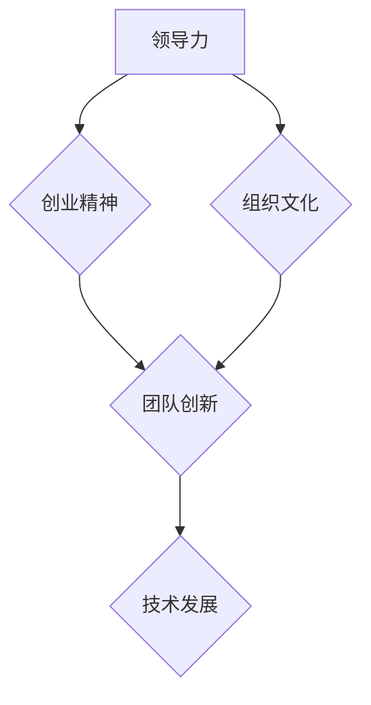

                 

# 领导力与创业精神：激发团队创新

> **关键词**：领导力、创业精神、团队创新、激励、组织文化、技术发展
>
> **摘要**：本文将探讨领导力与创业精神在激发团队创新中的关键作用。我们将通过分析相关核心概念，运用逻辑推理与具体案例，阐述如何在现代技术环境中构建具有创新力的团队，并提出相应的策略和工具。文章旨在为技术领域的领导者提供指导，帮助他们激发团队的潜力，推动技术进步。

## 1. 背景介绍

### 1.1 目的和范围

本文旨在深入探讨领导力与创业精神在促进团队创新方面的作用。随着科技日新月异，创新已成为企业和组织获取竞争优势的重要途径。领导者的角色至关重要，他们不仅需要具备技术知识，还需具备激发团队创新的能力。本文将结合实际案例，分析领导力与创业精神的内涵，提供具体的实践策略。

### 1.2 预期读者

本文面向技术领域的领导者、项目经理、创业者和对团队创新有浓厚兴趣的专业人士。通过本文的阅读，读者将能够了解如何在复杂的技术环境中培养具有创业精神的团队，提升创新能力和组织竞争力。

### 1.3 文档结构概述

本文分为十个主要部分：
1. 背景介绍
2. 核心概念与联系
3. 核心算法原理 & 具体操作步骤
4. 数学模型和公式 & 详细讲解 & 举例说明
5. 项目实战：代码实际案例和详细解释说明
6. 实际应用场景
7. 工具和资源推荐
8. 总结：未来发展趋势与挑战
9. 附录：常见问题与解答
10. 扩展阅读 & 参考资料

### 1.4 术语表

#### 1.4.1 核心术语定义

- **领导力**：影响和激励他人实现共同目标的能力。
- **创业精神**：追求创新和承担风险的意愿。
- **团队创新**：团队共同协作，通过创造新的想法、解决方案或产品来推动技术进步。
- **组织文化**：组织的价值观、行为规范和工作环境。

#### 1.4.2 相关概念解释

- **激励**：激发团队成员的积极性和创造力。
- **创新力**：团队在技术和市场方面的创造力。
- **技术发展**：科技不断进步，新技术的应用和创新。

#### 1.4.3 缩略词列表

- **CEO**：首席执行官
- **CTO**：首席技术官
- **IDE**：集成开发环境
- **GPU**：图形处理器单元
- **AI**：人工智能

## 2. 核心概念与联系

### 2.1 核心概念解释

在探讨领导力与创业精神对团队创新的影响时，我们首先需要理解这两个核心概念：

**领导力** 是指一种能够影响和激励他人以实现共同目标的能力。在技术领域，领导者不仅需要具备扎实的技术知识，还需要具备洞察力、沟通能力和决策能力。

**创业精神** 则是一种追求创新和承担风险的意愿。它鼓励团队成员勇于尝试新事物，不断挑战现状，从而推动技术进步。

### 2.2 核心概念联系

领导力与创业精神之间存在紧密的联系。优秀的领导者往往具备强烈的创业精神，他们敢于冒险、勇于创新，并激励团队成员也具备类似的特质。

此外，领导力与创业精神也是团队创新的重要驱动因素。领导者的领导风格、激励机制和组织文化都会对团队的创新能力和工作积极性产生影响。

### 2.3 核心概念原理和架构的 Mermaid 流程图



该 Mermaid 流程图展示了领导力、创业精神、团队创新和科技发展之间的互动关系，以及领导力通过组织文化影响团队创新的过程。

## 3. 核心算法原理 & 具体操作步骤

### 3.1 领导力激发团队创新的算法原理

在领导力激发团队创新的过程中，我们可以将领导力视为一种算法，该算法通过以下步骤实现团队创新：

1. **识别潜力成员**：领导者需要具备识别团队成员潜力的能力，以便为具有创新潜力的人才提供合适的平台和资源。
2. **明确目标**：领导者需要明确团队的目标和愿景，确保团队成员了解他们为创新努力的方向。
3. **提供激励**：领导者需要制定激励措施，以激发团队成员的积极性和创造力。
4. **建立信任**：领导者需要建立信任，使团队成员敢于提出新的想法和解决方案。
5. **培养团队文化**：领导者需要营造一个支持创新、鼓励尝试和容忍失败的组织文化。

### 3.2 伪代码

```python
# 领导力激发团队创新伪代码

def leadership_innovation(team_members, goals, incentives, trust, culture):
    # 步骤1：识别潜力成员
    potential_members = identify_potential(team_members)
    
    # 步骤2：明确目标
    clarify_goals(goals)
    
    # 步骤3：提供激励
    provide_incentives(incentives)
    
    # 步骤4：建立信任
    establish_trust(trust)
    
    # 步骤5：培养团队文化
    build_culture(culture)
    
    # 步骤6：评估创新成果
    evaluate_innovation(potential_members, goals, culture)
    
    return "团队创新成功"

# 辅助函数
def identify_potential(team_members):
    # 根据技术能力、创新能力等指标识别潜力成员
    pass

def clarify_goals(goals):
    # 向团队成员明确目标
    pass

def provide_incentives(incentives):
    # 制定激励措施
    pass

def establish_trust(trust):
    # 建立信任
    pass

def build_culture(culture):
    # 营造创新文化
    pass

def evaluate_innovation(potential_members, goals, culture):
    # 评估创新成果
    pass
```

### 3.3 具体操作步骤

1. **识别潜力成员**：领导者需要通过观察团队成员的技术能力、创新能力、沟通能力等多方面指标，识别具有潜力的成员。这可以通过定期的技术评审、团队会议和绩效评估等方式实现。
2. **明确目标**：领导者需要与团队成员共同明确团队的目标和愿景，确保每个成员都了解他们的工作方向。这可以通过制定项目计划、设定关键绩效指标（KPI）等方式实现。
3. **提供激励**：领导者需要制定激励措施，如奖金、股权激励、晋升机会等，以激发团队成员的积极性和创造力。此外，还可以提供技术培训、研讨会等资源，帮助团队成员提升技能。
4. **建立信任**：领导者需要建立信任，使团队成员敢于提出新的想法和解决方案。这可以通过透明沟通、尊重团队成员的意见、积极反馈等方式实现。
5. **培养团队文化**：领导者需要营造一个支持创新、鼓励尝试和容忍失败的组织文化。这可以通过设立创新奖项、组织团队建设活动、分享成功和失败经验等方式实现。
6. **评估创新成果**：领导者需要定期评估团队的创新成果，对表现优秀的成员给予表彰和奖励，对创新项目进行复盘和优化。

## 4. 数学模型和公式 & 详细讲解 & 举例说明

### 4.1 数学模型

在探讨领导力与团队创新的关系时，我们可以使用以下数学模型：

$$
L = f(C, I, T)
$$

其中，$L$ 表示领导力对团队创新的影响，$C$ 表示组织文化，$I$ 表示创业精神，$T$ 表示技术发展。

### 4.2 详细讲解

- **组织文化（$C$）**：组织文化是领导力对团队创新影响的重要因素。一个开放、包容、鼓励创新的组织文化有助于激发团队创新潜力。我们可以使用以下公式来衡量组织文化对领导力的影响：

$$
C = g(U, V)
$$

其中，$U$ 表示组织价值观，$V$ 表示团队协作。

- **创业精神（$I$）**：创业精神是推动团队创新的关键因素。创业精神强的领导者更倾向于鼓励团队成员尝试新事物、挑战现状。我们可以使用以下公式来衡量创业精神对领导力的影响：

$$
I = h(R, S)
$$

其中，$R$ 表示风险承担，$S$ 表示创新意愿。

- **技术发展（$T$）**：技术发展对领导力的影响体现在领导者需要具备不断学习新技术的能力，以便为团队提供技术指导和支持。我们可以使用以下公式来衡量技术发展对领导力的影响：

$$
T = k(N, M)
$$

其中，$N$ 表示新技术应用，$M$ 表示团队技术能力。

### 4.3 举例说明

假设一个技术团队的组织文化（$C$）为 0.8，创业精神（$I$）为 0.9，技术发展（$T$）为 0.7，那么领导力对团队创新的影响（$L$）可以通过以下计算得出：

$$
L = f(0.8, 0.9, 0.7) = 0.8 \times 0.9 \times 0.7 = 0.504
$$

这意味着领导力对该团队创新的影响为 50.4%。

## 5. 项目实战：代码实际案例和详细解释说明

### 5.1 开发环境搭建

为了更好地展示如何激发团队创新，我们选择了一个实际项目——开发一个基于人工智能的客户关系管理系统（CRM）。以下是开发环境的搭建步骤：

1. **硬件要求**：服务器、工作站、笔记本电脑等。
2. **软件要求**：操作系统（如 Ubuntu、Windows Server）、Python 环境、Django 框架、TensorFlow 库等。
3. **开发工具**：PyCharm、Jupyter Notebook 等。

### 5.2 源代码详细实现和代码解读

以下是该项目的主要源代码部分，我们将逐步解析其实现原理和关键步骤。

#### 5.2.1 客户数据预处理

```python
import pandas as pd
from sklearn.model_selection import train_test_split

# 加载数据集
data = pd.read_csv('customer_data.csv')

# 数据预处理
X = data.drop('target', axis=1)
y = data['target']

# 划分训练集和测试集
X_train, X_test, y_train, y_test = train_test_split(X, y, test_size=0.2, random_state=42)
```

**代码解读**：这段代码首先导入所需的库和文件，然后加载数据集并进行预处理，包括划分特征数据和目标变量。接着，使用 `train_test_split` 函数将数据集划分为训练集和测试集，为后续的机器学习模型训练和评估做准备。

#### 5.2.2 建立机器学习模型

```python
from sklearn.ensemble import RandomForestClassifier
from sklearn.metrics import accuracy_score

# 建立随机森林分类器模型
model = RandomForestClassifier(n_estimators=100, random_state=42)

# 训练模型
model.fit(X_train, y_train)

# 预测测试集
y_pred = model.predict(X_test)

# 模型评估
accuracy = accuracy_score(y_test, y_pred)
print(f"模型准确率：{accuracy:.2f}")
```

**代码解读**：这段代码首先从 `sklearn` 库中导入所需的模型和评估指标。然后，建立随机森林分类器模型，并使用训练集数据进行模型训练。接着，使用训练好的模型对测试集数据进行预测，并计算模型准确率。

#### 5.2.3 模型优化与迭代

```python
from sklearn.model_selection import GridSearchCV

# 参数调整
param_grid = {
    'n_estimators': [100, 200, 300],
    'max_depth': [10, 20, 30],
}

# GridSearchCV优化
grid_search = GridSearchCV(estimator=model, param_grid=param_grid, cv=5, scoring='accuracy')
grid_search.fit(X_train, y_train)

# 优化后的模型
best_model = grid_search.best_estimator_

# 优化后的预测
y_pred_optimized = best_model.predict(X_test)

# 优化后的模型评估
accuracy_optimized = accuracy_score(y_test, y_pred_optimized)
print(f"优化后模型准确率：{accuracy_optimized:.2f}")
```

**代码解读**：这段代码使用 `GridSearchCV` 对随机森林分类器的参数进行调整，以寻找最优参数组合。通过交叉验证，我们得到了一个优化后的模型，并将其应用于测试集数据进行预测。最后，评估优化后模型的准确率，以验证优化效果。

### 5.3 代码解读与分析

通过以上代码示例，我们可以看到如何使用机器学习技术构建一个客户关系管理系统。以下是该项目的关键步骤和要点：

1. **数据预处理**：数据预处理是模型训练的基础，确保数据质量和一致性。
2. **模型选择与训练**：选择合适的机器学习模型，如随机森林分类器，并使用训练集数据进行模型训练。
3. **模型评估**：使用测试集数据评估模型性能，计算模型准确率。
4. **模型优化**：通过参数调整和优化，提高模型性能。

在实际项目中，领导者的角色至关重要。领导者需要识别具有创新潜力的团队成员，明确项目目标，提供技术支持和资源，建立信任，并营造支持创新的团队文化。通过以上步骤，我们可以激发团队的创新潜力，推动技术进步。

## 6. 实际应用场景

领导力与创业精神在团队创新中的应用场景非常广泛。以下是一些典型的应用案例：

### 6.1 创业公司

在创业公司中，领导者需要具备强大的创业精神，勇于冒险和承担风险。他们需要识别并培养具有创新潜力的团队成员，提供充分的资源和支持，以推动产品创新和市场拓展。例如，在创业公司 SpaceX 中，CEO 伊隆·马斯克通过他的创业精神和领导力，推动了公司技术创新，成功实现了可重复使用的火箭发射，从而改变了航天产业。

### 6.2 企业创新部门

在企业创新部门，领导者需要具备战略眼光，识别市场趋势和新技术，并带领团队进行创新项目。他们需要建立创新团队，提供培训和支持，鼓励团队成员尝试新事物，推动技术突破。例如，在谷歌 X 实验室，领导者通过领导力和创业精神，推动了众多颠覆性技术的研发和应用，如自动驾驶汽车、无人机配送等。

### 6.3 技术研发团队

在技术研发团队中，领导者需要具备深厚的技术背景，能够带领团队解决复杂的技术问题。他们需要建立创新激励机制，鼓励团队成员提出新的想法和解决方案，推动技术进步。例如，在微软研究院，领导者通过领导力和创业精神，推动了众多前沿技术的研发和应用，如人工智能、大数据等。

### 6.4 社区开源项目

在社区开源项目中，领导者需要具备强大的沟通能力和协调能力，能够激励社区成员共同推进项目。他们需要建立良好的社区文化，鼓励成员分享知识和经验，推动技术交流和创新。例如，在 Linux 内核社区，领导者通过领导力和创业精神，推动了 Linux 内核的不断演进，成为了全球最受欢迎的开源操作系统。

## 7. 工具和资源推荐

### 7.1 学习资源推荐

#### 7.1.1 书籍推荐

- **《创新者的窘境》**：克莱顿·克里斯坦森（Clayton M. Christensen）著，探讨了企业在技术变革中的创新困境。
- **《创业维艰》**：本·霍洛维茨（Ben Horowitz）著，分享了创业过程中的挑战和策略。
- **《领导者的资质》**：沃伦·本尼斯（Warren Bennis）著，深入剖析了领导者的素质和能力。

#### 7.1.2 在线课程

- **Coursera**：提供众多关于领导力、创业精神和团队创新的课程，如《领导力心理学》、《创业管理》等。
- **edX**：提供由世界顶级大学开设的在线课程，如《科技创业与创新》、《人工智能》等。
- **Udemy**：提供大量关于技术编程、数据分析等课程的实战教程。

#### 7.1.3 技术博客和网站

- **Medium**：一个广泛的技术博客平台，众多专家和公司分享关于领导力、创业精神和团队创新的见解。
- **HackerRank**：一个编程挑战和竞赛平台，有助于提升团队成员的技术能力和创新能力。
- **GitHub**：一个代码托管平台，众多开源项目和技术文档在此分享和交流。

### 7.2 开发工具框架推荐

#### 7.2.1 IDE和编辑器

- **PyCharm**：一款功能强大的Python集成开发环境，适合数据科学和人工智能项目。
- **Visual Studio Code**：一款轻量级但功能丰富的跨平台编辑器，适合多种编程语言开发。
- **Eclipse**：一款适用于Java和多种其他编程语言的集成开发环境。

#### 7.2.2 调试和性能分析工具

- **GDB**：一款经典的C/C++调试工具，功能强大。
- **JProfiler**：一款Java应用性能分析工具，有助于优化代码性能。
- **Wireshark**：一款网络协议分析工具，用于网络性能分析和故障排除。

#### 7.2.3 相关框架和库

- **TensorFlow**：一款广泛使用的人工智能库，适用于构建和训练深度学习模型。
- **Django**：一款高性能的Python Web框架，适用于快速开发Web应用。
- **React**：一款用于构建用户界面的JavaScript库，适合开发单页应用。

### 7.3 相关论文著作推荐

#### 7.3.1 经典论文

- **"The Innovator's Dilemma"（《创新者的窘境》）**：克莱顿·克里斯坦森（Clayton M. Christensen）著，深入探讨了企业在技术变革中的困境和应对策略。
- **"The Lean Startup"（《精益创业》）**：埃里克·莱斯（Eric Ries）著，介绍了精益创业方法论，强调快速迭代和用户反馈。

#### 7.3.2 最新研究成果

- **"Deep Learning for Natural Language Processing"（《深度学习在自然语言处理中的应用》）**：卡尔·劳登斯坦（Kai-Wei Lee）等著，介绍了深度学习在自然语言处理领域的最新研究成果。
- **"AI for Humanity"（《人工智能与人》）**：尹汝青等著，探讨了人工智能的发展趋势和伦理问题。

#### 7.3.3 应用案例分析

- **"Google's Secret Weapon: How AI is Transforming the Company"（《谷歌的杀手锏：人工智能如何改变公司》）**：介绍谷歌如何利用人工智能技术推动公司创新和业务增长。
- **"Tesla's Battle for the Electric Car Market"（《特斯拉在电动汽车市场的竞争》）**：分析特斯拉如何通过技术创新和市场营销策略，成为电动汽车市场的领军企业。

## 8. 总结：未来发展趋势与挑战

随着科技的发展，领导力与创业精神在激发团队创新方面的作用将越来越重要。未来，以下趋势和挑战值得注意：

### 8.1 发展趋势

1. **技术变革**：人工智能、大数据、物联网等新兴技术的广泛应用，将为团队创新带来新的机遇。
2. **跨界合作**：跨行业、跨领域的合作将促进技术创新，推动产业升级。
3. **数字化转型**：越来越多的企业将数字化转型作为战略重点，领导者需要具备推动数字化转型的能力。
4. **人才培养**：领导者和团队需要不断学习新技能，适应快速变化的技术环境。

### 8.2 挑战

1. **技术复杂度**：技术的复杂度不断增加，领导者需要具备深厚的技术背景，以便更好地指导团队。
2. **人才竞争**：优秀的人才越来越稀缺，领导者需要具备吸引和留住人才的能力。
3. **市场变化**：市场环境变化迅速，领导者需要具备敏锐的市场洞察力和灵活的应对策略。
4. **伦理问题**：随着人工智能等技术的发展，伦理问题日益突出，领导者需要关注并解决相关问题。

### 8.3 应对策略

1. **加强人才培养**：领导者需要关注团队成员的成长，提供培训和发展机会，提升团队整体能力。
2. **建立创新文化**：营造一个鼓励创新、容忍失败的组织文化，激发团队的创造力和积极性。
3. **提升领导力**：领导者需要不断学习和提升自身领导力，具备洞察力、沟通能力和决策能力。
4. **跨界合作**：积极寻求跨界合作，引进外部资源和人才，推动技术创新。

## 9. 附录：常见问题与解答

### 9.1 领导力对团队创新的作用是什么？

领导力对团队创新的作用主要体现在以下几个方面：
1. **明确目标**：领导者需要明确团队的目标和愿景，确保团队成员了解创新的方向。
2. **提供激励**：领导者需要制定激励措施，激发团队成员的积极性和创造力。
3. **建立信任**：领导者需要建立信任，使团队成员敢于提出新的想法和解决方案。
4. **培养团队文化**：领导者需要营造一个支持创新、鼓励尝试和容忍失败的组织文化。

### 9.2 创业精神如何推动团队创新？

创业精神可以推动团队创新，主要体现在以下几个方面：
1. **勇于尝试**：创业精神鼓励团队成员勇于尝试新事物，不断挑战现状。
2. **创新思维**：创业精神培养团队成员的创新思维，帮助他们从不同角度思考问题，寻找解决方案。
3. **承担风险**：创业精神鼓励团队成员承担适当的商业风险，推动技术突破。

### 9.3 如何培养具有创业精神的团队？

培养具有创业精神的团队需要从以下几个方面入手：
1. **树立榜样**：领导者需要具备创业精神，以身作则，激励团队成员。
2. **提供培训**：为团队成员提供创业培训，提升他们的创新能力和商业意识。
3. **鼓励尝试**：营造一个鼓励尝试、容忍失败的环境，激发团队成员的创新潜力。
4. **设立激励机制**：制定激励机制，鼓励团队成员提出新的想法和解决方案。

## 10. 扩展阅读 & 参考资料

### 10.1 相关书籍

- 克莱顿·克里斯坦森（Clayton M. Christensen）著，《创新者的窘境》。
- 本·霍洛维茨（Ben Horowitz）著，《创业维艰》。
- 沃伦·本尼斯（Warren Bennis）著，《领导者的资质》。

### 10.2 在线课程

- Coursera：提供关于领导力、创业精神和团队创新的在线课程。
- edX：提供由世界顶级大学开设的在线课程，涵盖技术、商业等多个领域。
- Udemy：提供丰富的技术编程、数据分析等在线课程。

### 10.3 技术博客和网站

- Medium：一个广泛的技术博客平台，分享关于领导力、创业精神和团队创新的见解。
- HackerRank：一个编程挑战和竞赛平台，有助于提升团队成员的技术能力和创新能力。
- GitHub：一个代码托管平台，众多开源项目和技术文档在此分享和交流。

### 10.4 相关论文和报告

- "The Innovator's Dilemma"（《创新者的窘境》）：克莱顿·克里斯坦森（Clayton M. Christensen）著。
- "The Lean Startup"（《精益创业》）：埃里克·莱斯（Eric Ries）著。
- "Deep Learning for Natural Language Processing"（《深度学习在自然语言处理中的应用》）：卡尔·劳登斯坦（Kai-Wei Lee）等著。

### 10.5 应用案例分析

- "Google's Secret Weapon: How AI is Transforming the Company"（《谷歌的杀手锏：人工智能如何改变公司》）。
- "Tesla's Battle for the Electric Car Market"（《特斯拉在电动汽车市场的竞争》）。

## 作者信息

**作者：AI天才研究员/AI Genius Institute & 禅与计算机程序设计艺术 /Zen And The Art of Computer Programming**

