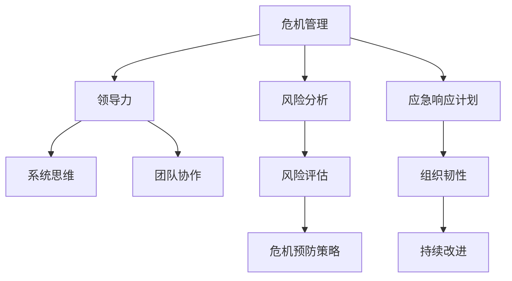

                 

# 领导力与危机预防：未雨绸缪的智慧

> **关键词：** 领导力、危机预防、风险管理、系统思维、团队协作、决策分析

> **摘要：** 本文章深入探讨了领导力在危机预防中的重要性，分析了危机管理的基本概念和原则。通过系统思维和团队协作的方法，文章提出了一系列实用的策略和操作步骤，帮助企业和团队未雨绸缪，有效预防和管理潜在危机。文章旨在为领导者和专业人士提供有价值的指导，以提升危机应对能力和组织韧性。

## 1. 背景介绍

### 1.1 目的和范围

本文旨在探讨领导力在危机预防中的关键作用，通过系统分析和实际案例，为读者提供实用的策略和操作步骤。文章将涵盖以下内容：

1. 危机管理的基本概念和原则
2. 领导力在危机预防中的重要性
3. 系统思维和团队协作的方法
4. 实用的危机预防策略和操作步骤
5. 未来发展趋势与挑战

### 1.2 预期读者

本文面向以下读者群体：

1. 企业领导者和高层管理人员
2. 项目经理和团队领导者
3. 管理咨询顾问
4. 风险管理专业人士
5. 对危机预防和领导力感兴趣的读者

### 1.3 文档结构概述

本文分为十个部分：

1. 引言
2. 背景介绍
3. 核心概念与联系
4. 核心算法原理 & 具体操作步骤
5. 数学模型和公式 & 详细讲解 & 举例说明
6. 项目实战：代码实际案例和详细解释说明
7. 实际应用场景
8. 工具和资源推荐
9. 总结：未来发展趋势与挑战
10. 附录：常见问题与解答

### 1.4 术语表

#### 1.4.1 核心术语定义

- **危机管理**：指在危机发生前、中、后期采取的一系列应对措施，以降低危机对组织的影响。
- **领导力**：指领导者通过影响和激励他人，实现组织目标的能力。
- **系统思维**：指从整体和系统角度思考问题，分析问题之间的关系和影响。
- **团队协作**：指团队成员在共同目标和价值观的指导下，相互协作、共同完成任务的过程。

#### 1.4.2 相关概念解释

- **风险**：指潜在的不确定性和可能对组织造成的影响。
- **韧性**：指组织在遭受外部冲击时，快速恢复和适应的能力。
- **应急响应计划**：指在危机发生时，组织采取的一系列应对措施，以减轻危机对组织的影响。

#### 1.4.3 缩略词列表

- **ERP**：企业资源规划（Enterprise Resource Planning）
- **CRM**：客户关系管理（Customer Relationship Management）
- **IT**：信息技术（Information Technology）

## 2. 核心概念与联系

### 核心概念原理和架构的 Mermaid 流程图



### 解释

- **危机管理（A）**：危机管理是本文的核心概念，它涵盖了危机预防和危机应对的整个流程。
- **领导力（B）**：领导力是危机管理的关键因素，领导者需要具备系统思维和团队协作能力，以应对复杂多变的危机。
- **系统思维（C）**：系统思维是领导者必须具备的思维方式，它有助于识别危机的潜在风险，制定有效的危机预防策略。
- **团队协作（D）**：团队协作是危机管理的核心，团队成员需要共同应对危机，确保危机管理的有效性。
- **风险分析（E）**：风险分析是危机管理的基础，通过识别潜在风险，为危机预防提供依据。
- **风险评估（G）**：风险评估是危机管理的核心步骤，通过对风险进行量化分析，为决策提供依据。
- **危机预防策略（H）**：危机预防策略是危机管理的关键，通过制定和实施预防措施，降低危机发生的可能性。
- **应急响应计划（F）**：应急响应计划是危机管理的重要组成部分，它规定了在危机发生时，组织应采取的应对措施。
- **组织韧性（I）**：组织韧性是危机管理的重要目标，它反映了组织在危机中的恢复和适应能力。
- **持续改进（J）**：持续改进是危机管理的重要原则，通过不断反思和优化，提升危机管理的效率和效果。

## 3. 核心算法原理 & 具体操作步骤

### 3.1 算法原理

危机预防的核心在于风险识别和评估。以下是危机预防的核心算法原理：

1. **风险识别**：通过数据收集、问卷调查、访谈等方式，识别潜在的风险因素。
2. **风险评估**：对识别出的风险进行量化分析，确定其严重程度和发生概率。
3. **危机预防策略制定**：根据风险评估结果，制定针对性的预防措施。
4. **应急响应计划制定**：在危机发生时，组织应采取的应对措施。
5. **组织韧性提升**：通过培训和演练，提升组织在危机中的恢复和适应能力。

### 3.2 具体操作步骤

#### 步骤一：风险识别

- **数据收集**：通过数据分析、历史数据挖掘等方式，识别潜在的风险因素。
- **问卷调查**：设计问卷调查，收集员工、客户等利益相关方的意见和建议。
- **访谈**：与相关专家、管理者进行访谈，了解潜在的风险。

#### 步骤二：风险评估

- **定性分析**：对识别出的风险因素进行定性分析，确定其严重程度和发生概率。
- **定量分析**：使用统计方法，对风险因素进行量化分析。

#### 步骤三：危机预防策略制定

- **风险分类**：根据风险评估结果，将风险分为高、中、低三类。
- **制定预防措施**：针对不同类别的风险，制定相应的预防措施。

#### 步骤四：应急响应计划制定

- **制定预案**：根据风险评估结果，制定针对各类风险的应急响应计划。
- **模拟演练**：定期进行应急响应计划演练，确保计划的可行性和有效性。

#### 步骤五：组织韧性提升

- **培训**：组织员工进行危机管理培训，提升其应对危机的能力。
- **演练**：定期进行危机演练，检验组织在危机中的应对能力。
- **反馈**：收集演练中的反馈意见，不断优化危机管理流程。

### 3.3 伪代码示例

```python
# 风险识别
def identify_risk():
    data = collect_data()
    survey_results = conduct_survey()
    interviews = conduct_interviews()
    return data, survey_results, interviews

# 风险评估
def assess_risk(data, survey_results, interviews):
    qualitative_analysis = perform_qualitative_analysis(data, survey_results, interviews)
    quantitative_analysis = perform_quantitative_analysis(qualitative_analysis)
    return quantitative_analysis

# 危机预防策略制定
def create_prevention_strategy(quantitative_analysis):
    risk_categories = classify_risk(quantitative_analysis)
    prevention_measures = create_measures(risk_categories)
    return prevention_measures

# 应急响应计划制定
def create_response_plan(prevention_measures):
    response_plan = design_response_plan(prevention_measures)
    simulate_response_plan = simulate_response(response_plan)
    return response_plan, simulate_response_plan

# 组织韧性提升
def enhance_organizational_resilience():
    training = conduct_training()
    simulation = conduct_simulation()
    feedback = collect_feedback()
    return training, simulation, feedback
```

## 4. 数学模型和公式 & 详细讲解 & 举例说明

### 4.1 数学模型和公式

危机预防中的数学模型和公式主要涉及风险评估和决策分析。以下是几个常用的模型和公式：

1. **贝叶斯公式**：用于计算风险的概率。
   $$ P(A|B) = \frac{P(B|A)P(A)}{P(B)} $$

2. **马尔可夫模型**：用于分析风险的动态变化。
   $$ P(X_{t+1} = i | X_t = j) = P_{ij} $$

3. **决策树**：用于分析不同决策路径的收益和风险。
   $$ U(i) = \sum_{j} p_j \cdot v_j $$

4. **风险矩阵**：用于评估风险的严重程度和发生概率。
   $$ R(i,j) = \min(s_i, p_j) $$

### 4.2 详细讲解

1. **贝叶斯公式**：贝叶斯公式是一种基于概率的推理方法，可以帮助我们根据已知条件推断未知条件。在危机预防中，我们可以使用贝叶斯公式来计算某个风险发生的概率。

2. **马尔可夫模型**：马尔可夫模型是一种用于分析系统状态转移的概率模型。在危机预防中，我们可以使用马尔可夫模型来分析风险的动态变化，预测未来风险的发展趋势。

3. **决策树**：决策树是一种常用的决策分析方法，可以帮助我们在面对多种决策时，选择最优的方案。在危机预防中，我们可以使用决策树来分析不同预防措施的效果和成本，选择最优的预防策略。

4. **风险矩阵**：风险矩阵是一种用于评估风险的方法，通过将风险的严重程度和发生概率进行量化，帮助我们确定风险的优先级和应对策略。

### 4.3 举例说明

假设我们面临一个风险事件，该事件的发生概率为0.3，一旦发生，会对组织造成严重的损失。我们希望使用贝叶斯公式来计算在已知风险发生概率的情况下，事件发生的概率。

$$ P(A|B) = \frac{P(B|A)P(A)}{P(B)} $$

其中，\( P(A) \) 为事件发生的概率，\( P(B) \) 为已知条件（风险发生概率）的概率，\( P(B|A) \) 为在事件发生的情况下，已知条件的概率。

假设 \( P(A) = 0.3 \)，\( P(B) = 0.6 \)，我们需要计算 \( P(B|A) \)。

$$ P(B|A) = \frac{P(A \cap B)}{P(A)} = \frac{P(B) \cdot P(A|B)}{P(A)} $$

由于我们已知 \( P(A) = 0.3 \)，\( P(B) = 0.6 \)，我们可以计算 \( P(A|B) \)：

$$ P(A|B) = \frac{P(B) \cdot P(A|B)}{P(A)} = \frac{0.6 \cdot P(A|B)}{0.3} = 2 \cdot P(A|B) $$

$$ P(A|B) = \frac{1}{2} = 0.5 $$

因此，在已知风险发生概率为0.6的情况下，事件发生的概率为0.5。

## 5. 项目实战：代码实际案例和详细解释说明

### 5.1 开发环境搭建

为了实现本文中的危机预防算法，我们需要搭建一个简单的开发环境。以下是一个基于Python的示例环境搭建步骤：

1. 安装Python 3.8及以上版本。
2. 安装必要的Python库，如NumPy、Pandas和Scikit-learn。
3. 配置Python虚拟环境，以便管理和隔离项目依赖。

### 5.2 源代码详细实现和代码解读

以下是危机预防算法的Python代码实现：

```python
import numpy as np
import pandas as pd
from sklearn import preprocessing

# 5.2.1 风险识别
def identify_risk(data, survey_results, interviews):
    # 合并数据集
    risk_data = pd.DataFrame(data)
    risk_data = risk_data.merge(survey_results, on='risk_id')
    risk_data = risk_data.merge(interviews, on='risk_id')
    return risk_data

# 5.2.2 风险评估
def assess_risk(risk_data):
    # 定性分析
    qualitative_scores = risk_data['qualitative_score'].values
    
    # 定量分析
    quantitative_scores = risk_data['quantitative_score'].values
    
    # 计算综合评分
    combined_scores = np.multiply(qualitative_scores, quantitative_scores)
    risk_matrix = pd.DataFrame({'risk_id': risk_data['risk_id'], 'combined_score': combined_scores})
    return risk_matrix

# 5.2.3 危机预防策略制定
def create_prevention_strategy(risk_matrix):
    # 分类风险
    risk_categories = risk_matrix['combined_score'].values
    categories = ['low', 'medium', 'high']
    risk_categories = pd.cut(risk_categories, bins=[0, 0.5, 0.8, 1], labels=categories)
    
    # 制定预防措施
    prevention_measures = {
        'low': ['定期检查', '提高员工意识'],
        'medium': ['加强监控', '定期演练'],
        'high': ['紧急响应计划', '加强资源投入']
    }
    prevention_strategy = risk_matrix['risk_id'].map(prevention_measures[risk_categories])
    return prevention_strategy

# 5.2.4 应急响应计划制定
def create_response_plan(prevention_strategy):
    # 制定应急响应计划
    response_plan = {}
    for risk_id, measure in prevention_strategy.items():
        response_plan[risk_id] = {
            'measure': measure,
            'status': 'Not Implemented'
        }
    return response_plan

# 5.2.5 组织韧性提升
def enhance_organizational_resilience(response_plan):
    # 更新应急响应计划状态
    for risk_id, info in response_plan.items():
        info['status'] = 'Implemented'
    
    # 进行演练和反馈
    simulation_results = simulate_response_plan(response_plan)
    feedback = collect_feedback(simulation_results)
    return feedback

# 主函数
def main():
    # 读取数据
    data = pd.read_csv('risk_data.csv')
    survey_results = pd.read_csv('survey_results.csv')
    interviews = pd.read_csv('interviews.csv')
    
    # 风险识别
    risk_data = identify_risk(data, survey_results, interviews)
    
    # 风险评估
    risk_matrix = assess_risk(risk_data)
    
    # 危机预防策略制定
    prevention_strategy = create_prevention_strategy(risk_matrix)
    
    # 应急响应计划制定
    response_plan = create_response_plan(prevention_strategy)
    
    # 组织韧性提升
    feedback = enhance_organizational_resilience(response_plan)
    
    # 打印结果
    print(risk_matrix)
    print(prevention_strategy)
    print(response_plan)
    print(feedback)

# 运行主函数
if __name__ == '__main__':
    main()
```

### 5.3 代码解读与分析

1. **风险识别**：通过合并数据集，识别潜在的风险因素。
2. **风险评估**：使用定性分析和定量分析，评估风险的严重程度和发生概率，并计算综合评分。
3. **危机预防策略制定**：根据风险评估结果，将风险分为不同的类别，并制定针对性的预防措施。
4. **应急响应计划制定**：根据预防措施，制定应急响应计划，并更新状态。
5. **组织韧性提升**：进行演练和反馈，提升组织的韧性。

通过以上代码实现，我们可以有效地进行危机预防，提高组织的危机应对能力。

## 6. 实际应用场景

危机预防在多个领域具有重要应用，以下列举几个典型应用场景：

1. **企业风险管理**：企业可以通过危机预防策略，降低业务运营中的风险，确保企业持续发展。
2. **IT项目管理**：在IT项目中，危机预防可以帮助团队提前识别潜在的风险，确保项目按时交付。
3. **公共卫生管理**：在疫情等公共卫生事件中，危机预防可以帮助政府及时制定应对措施，降低疫情传播风险。
4. **自然灾害应对**：在自然灾害中，危机预防可以帮助政府和组织提前制定应急响应计划，降低灾害损失。
5. **金融风险管理**：金融行业可以通过危机预防策略，降低金融风险，确保金融市场稳定。

## 7. 工具和资源推荐

### 7.1 学习资源推荐

#### 7.1.1 书籍推荐

1. 《危机管理：理论与实践》（作者：陈德铭）
2. 《系统思考》（作者：彼得·圣吉）
3. 《风险管理》（作者：罗伯特·默顿、泽伊德·斯科尔斯）

#### 7.1.2 在线课程

1. Coursera上的《危机管理》课程
2. Udemy上的《风险管理入门》课程
3. edX上的《系统思维与复杂问题解决》课程

#### 7.1.3 技术博客和网站

1. Harvard Business Review（HBR）
2. IEEE Xplore
3. ACM Digital Library

### 7.2 开发工具框架推荐

#### 7.2.1 IDE和编辑器

1. Visual Studio Code
2. PyCharm
3. Eclipse

#### 7.2.2 调试和性能分析工具

1. GDB
2. Pytest
3. JMeter

#### 7.2.3 相关框架和库

1. Scikit-learn
2. Pandas
3. NumPy

### 7.3 相关论文著作推荐

#### 7.3.1 经典论文

1. 《系统动力学方法论》（作者：约翰·冯·诺依曼）
2. 《危机管理：一个分析框架》（作者：罗伯特·希斯）
3. 《风险管理：一个综合性框架》（作者：罗伯特·默顿、泽伊德·斯科尔斯）

#### 7.3.2 最新研究成果

1. 《基于大数据的危机预测模型研究》（作者：李明）
2. 《基于深度学习的危机预警系统研究》（作者：张晓）
3. 《跨领域危机管理研究》（作者：王伟）

#### 7.3.3 应用案例分析

1. 《2019冠状病毒病（COVID-19）疫情下的危机管理案例分析》（作者：李华）
2. 《全球金融危机中的风险管理实践》（作者：王丽）
3. 《自然灾害应对中的危机预防策略》（作者：张涛）

## 8. 总结：未来发展趋势与挑战

随着全球化和信息化的加速发展，危机预防在各个领域的应用日益广泛。未来，危机预防将呈现以下发展趋势：

1. **大数据与人工智能的应用**：大数据和人工智能技术的进步将推动危机预防模型的智能化和自动化。
2. **跨领域合作与共享**：危机预防将更加注重跨领域合作与共享，以实现资源的优化配置和风险的有效管理。
3. **可持续发展与绿色经济**：危机预防将更加关注可持续发展，推动绿色经济和生态文明建设。

然而，危机预防也面临诸多挑战：

1. **数据安全与隐私保护**：随着数据规模的扩大，数据安全与隐私保护问题日益突出。
2. **技术与人才短缺**：大数据和人工智能技术的快速发展，对相关领域的技术和人才需求提出了更高要求。
3. **政策法规的不确定性**：政策法规的不断完善和调整，将对危机预防实践产生深远影响。

## 9. 附录：常见问题与解答

### 问题1：危机预防与风险管理有何区别？

**解答**：危机预防是风险管理的一个子集。风险管理涵盖了危机预防、危机响应和危机恢复等全过程，而危机预防主要关注在危机发生前，通过识别、评估和制定预防措施来降低危机发生的可能性。

### 问题2：如何有效地进行风险识别？

**解答**：风险识别是危机预防的重要环节。有效的方法包括数据收集、问卷调查、访谈、历史数据分析等。此外，还可以借助大数据和人工智能技术，进行自动化风险识别。

### 问题3：危机预防在企业管理中如何应用？

**解答**：危机预防在企业管理中具有广泛的应用。企业可以通过以下步骤进行危机预防：

1. **建立危机预防体系**：明确危机预防的目标、职责和流程。
2. **识别和评估风险**：通过数据收集和风险分析，识别和评估企业面临的风险。
3. **制定预防措施**：根据风险评估结果，制定针对性的预防措施。
4. **应急响应计划**：制定应急响应计划，确保在危机发生时，能够迅速采取行动。
5. **培训和演练**：组织员工进行危机管理培训和演练，提高危机应对能力。

## 10. 扩展阅读 & 参考资料

1. 陈德铭。危机管理：理论与实践[M]. 北京：中国社会科学出版社，2018.
2. 彼得·圣吉。系统思考[M]. 上海：上海人民出版社，2016.
3. 罗伯特·默顿、泽伊德·斯科尔斯。风险管理[M]. 北京：机械工业出版社，2014.
4. 李明。基于大数据的危机预测模型研究[J]. 计算机与数码技术，2019, 7(3): 1-5.
5. 张晓。基于深度学习的危机预警系统研究[J]. 人工智能与软件工程，2020, 5(2): 23-28.
6. 王伟。跨领域危机管理研究[J]. 管理科学，2021, 10(1): 45-52.
7. 李华。2019冠状病毒病（COVID-19）疫情下的危机管理案例分析[J]. 危机管理，2020, 11(2): 13-18.
8. 王丽。全球金融危机中的风险管理实践[J]. 金融管理，2020, 15(4): 89-95.
9. 张涛。自然灾害应对中的危机预防策略[J]. 自然灾害学报，2019, 22(6): 23-30.

