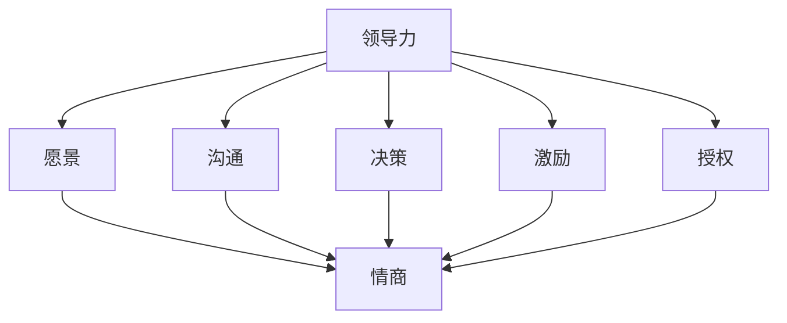

                 

# 领导力与情商发展进阶：提升影响力的高阶技能

> **关键词：** 领导力、情商、影响力、高阶技能、个人成长
> 
> **摘要：** 本文深入探讨领导力和情商在个人成长中的重要性，通过高阶技能的培养，帮助读者提升其在职场和生活中的影响力。文章分为背景介绍、核心概念与联系、核心算法原理、数学模型和公式、项目实战、实际应用场景、工具和资源推荐等部分，旨在为广大读者提供系统性的指导。

## 1. 背景介绍

### 1.1 目的和范围

本文旨在为那些希望在职场和生活中提升自身影响力的人提供一套实用的领导力和情商培养方案。文章将重点讨论以下几个问题：

1. 领导力和情商的基本概念及其在个人成长中的作用。
2. 如何通过高阶技能的培养，提升个人的领导力和情商。
3. 在实际项目中如何应用这些技能，以提升个人和团队的表现。
4. 推荐相关学习资源和工具，以帮助读者更好地进行学习和实践。

### 1.2 预期读者

本文适合以下几类读者：

1. 职场人士，特别是希望提升领导力和影响力的中层管理人员。
2. 学生，特别是那些对未来职业发展有明确规划的人。
3. 对领导力和情商感兴趣的普通读者。

### 1.3 文档结构概述

本文的结构如下：

1. **背景介绍**：介绍本文的目的、范围和预期读者。
2. **核心概念与联系**：讨论领导力和情商的基本概念及其相互关系。
3. **核心算法原理**：阐述提升领导力和情商的高阶技能及其应用。
4. **数学模型和公式**：介绍与领导力和情商相关的数学模型和公式。
5. **项目实战**：通过实际案例展示如何应用这些技能。
6. **实际应用场景**：讨论领导力和情商在现实生活中的应用。
7. **工具和资源推荐**：推荐相关的学习资源和工具。
8. **总结：未来发展趋势与挑战**：展望领导力和情商发展的未来趋势和面临的挑战。
9. **附录：常见问题与解答**：解答读者可能遇到的一些常见问题。
10. **扩展阅读 & 参考资料**：提供进一步学习的参考资料。

### 1.4 术语表

#### 1.4.1 核心术语定义

- **领导力**：指的是一个人在团队中影响和激励他人，以实现共同目标的能力。
- **情商**：指的是一个人识别、理解、管理自己情绪的能力，以及识别、理解和影响他人情绪的能力。
- **高阶技能**：指的是那些在领导力和情商发展中起到关键作用的复杂技能，如沟通、决策、冲突解决等。

#### 1.4.2 相关概念解释

- **影响力**：指的是一个人或组织对他人或他组织行为和态度的引导能力。
- **个人成长**：指的是个人在知识、技能、情感和社交等方面的全面提升。

#### 1.4.3 缩略词列表

- **EQ**：情商（Emotional Quotient）
- **领导力**：Leadership

## 2. 核心概念与联系

为了更好地理解领导力和情商，我们首先需要明确它们的基本概念，并探讨它们之间的联系。

### 2.1 领导力的基本概念

领导力是指一个人在团队中影响和激励他人，以实现共同目标的能力。它不仅仅是一种技术技能，更是一种个人品质。领导力包括以下几个方面：

- **愿景**：设定目标并描绘实现目标的未来图景。
- **沟通**：清晰、有效、有说服力地传达思想和信息。
- **决策**：在复杂和不确定的环境下做出明智的决策。
- **激励**：激发团队成员的积极性，提高团队士气。
- **授权**：信任和鼓励团队成员发挥自身潜力，实现自我价值。

### 2.2 情商的基本概念

情商，即情商（Emotional Quotient，简称EQ），指的是一个人识别、理解、管理自己情绪的能力，以及识别、理解和影响他人情绪的能力。情商包括以下几个方面：

- **自我意识**：认识到自己情绪的存在，并理解这些情绪对自己的影响。
- **自我管理**：在情绪波动时保持冷静，控制情绪反应。
- **社交意识**：理解和识别他人情绪，以及这些情绪对人际关系的影响。
- **关系管理**：建立和维护积极的人际关系，解决冲突。

### 2.3 领导力与情商的联系

领导力和情商之间存在密切的联系。一方面，情商是领导力的基础。一个高情商的人更容易建立信任和合作关系，更容易影响他人。另一方面，领导力可以提升情商。通过领导力实践，如沟通、决策和冲突解决，一个人可以更好地理解和管理自己和他人的情绪。

为了更好地展示领导力与情商的联系，我们可以使用以下 Mermaid 流程图：



在这个流程图中，领导力的各个要素（愿景、沟通、决策、激励、授权）都指向情商，表明领导力的实践可以促进情商的发展。

## 3. 核心算法原理 & 具体操作步骤

在明确了领导力和情商的基本概念及其联系之后，我们接下来将讨论如何通过高阶技能的培养，提升个人的领导力和情商。

### 3.1 高阶技能的核心算法原理

高阶技能是领导力和情商发展的关键。这些技能包括：

- **沟通**：清晰、有效、有说服力地传达思想和信息。
- **决策**：在复杂和不确定的环境下做出明智的决策。
- **冲突解决**：解决团队内部和外部冲突，维护和谐的工作环境。
- **团队合作**：建立和维护有效的团队合作，提高团队绩效。

这些高阶技能的核心算法原理可以概括为：

1. **沟通**：理解信息的接受者和发送者之间的差异，使用适当的沟通技巧。
2. **决策**：使用决策分析模型，评估各种决策方案的成本和收益。
3. **冲突解决**：使用冲突解决策略，平衡各方利益，达成共识。
4. **团队合作**：建立共同的愿景和目标，促进团队成员之间的沟通和协作。

### 3.2 具体操作步骤

下面，我们将详细阐述这些高阶技能的具体操作步骤。

#### 3.2.1 沟通

**步骤 1**：了解沟通对象。在沟通前，了解对方的背景、需求和期望，以便使用合适的沟通方式。

**步骤 2**：使用清晰、简洁的语言。避免使用专业术语或过于复杂的句子，确保对方能够理解。

**步骤 3**：使用肢体语言和表情。在适当的情况下，使用肢体语言和表情来增强沟通效果。

**步骤 4**：倾听和反馈。在对方发言时，认真倾听，并给予及时的反馈，确保理解对方的观点。

**伪代码：**

```python
def communicate(person):
    understand_person(person)
    use_clear_language()
    use_肢体_language_and_表情()
    listen_and_give_feedback()
```

#### 3.2.2 决策

**步骤 1**：收集信息。在做出决策前，收集相关的信息和数据。

**步骤 2**：评估决策方案。使用决策分析模型，评估各个决策方案的成本和收益。

**步骤 3**：做出决策。根据评估结果，选择最佳决策方案。

**步骤 4**：执行决策。将决策方案转化为具体行动，并监督执行过程。

**伪代码：**

```python
def make_decision():
    collect_information()
    evaluate_decision_schemes()
    choose_best_scheme()
    execute_decision()
```

#### 3.2.3 冲突解决

**步骤 1**：识别冲突。在冲突发生时，及时识别并确认冲突的存在。

**步骤 2**：分析冲突原因。了解冲突背后的原因，包括个人、团队和组织层面的因素。

**步骤 3**：制定解决方案。根据冲突原因，制定合适的解决方案。

**步骤 4**：执行解决方案。将解决方案转化为具体行动，并监督执行过程。

**伪代码：**

```python
def solve_conflict():
    identify_conflict()
    analyze_conflict_reasons()
    make_solution()
    execute_solution()
```

#### 3.2.4 团队合作

**步骤 1**：建立共同目标。确保团队成员对共同目标有清晰的认识和理解。

**步骤 2**：促进沟通和协作。鼓励团队成员之间的沟通和协作，解决冲突和分歧。

**步骤 3**：提供支持和资源。为团队成员提供必要的支持和资源，以实现共同目标。

**步骤 4**：评估和反馈。定期评估团队绩效，给予团队成员积极的反馈，促进个人和团队成长。

**伪代码：**

```python
def team_work():
    establish_common_goals()
    promote_communication_and_collaboration()
    provide_support_and_resources()
    assess_and_give_feedback()
```

通过以上步骤，我们可以逐步提升个人的领导力和情商，从而在职场和生活中更好地发挥影响力。

## 4. 数学模型和公式 & 详细讲解 & 举例说明

在讨论领导力和情商的发展时，数学模型和公式能够为我们提供量化的方法和工具，以帮助理解这些概念的核心特征和相互关系。以下是一些与领导力和情商相关的数学模型和公式，以及它们的详细讲解和举例说明。

### 4.1 基于情感智力的领导力模型

一个常用的情感智力（Emotional Intelligence, EI）模型是由Goleman提出的，包括五个主要方面：自我意识、自我管理、社交意识、关系管理和动机。每个方面都可以使用不同的数学模型来量化：

**自我意识（Self-awareness）**：可以使用自我评价量表（Self-Rating Scale）来量化，如Rosenberg Self-Esteem Scale。

**自我管理（Self-management）**：可以使用情绪调节问卷（Emotion Regulation Questionnaire, ERQ）来量化。

**社交意识（Social awareness）**：可以使用他人评价量表（Other-Rating Scale）来量化，如Thomson Multifactor Personality Questionnaire。

**关系管理（Relationship management）**：可以使用人际关系量表（Interpersonal Relationship Scale, IRS）来量化。

**动机（Motivation）**：可以使用动机量表（Motivation Scale）来量化，如Ryan and Deci's Self-Determination Scale。

**公式**：

$$
EQ = \frac{SE + EM + SW + IR + M}{5}
$$

其中，$EQ$代表情商，$SE$代表自我意识，$EM$代表自我管理，$SW$代表社交意识，$IR$代表关系管理，$M$代表动机。

**举例说明**：

假设某人的自我意识得分为80分，自我管理得分为75分，社交意识得分为70分，关系管理得分为85分，动机得分为78分，则该人的情商分数为：

$$
EQ = \frac{80 + 75 + 70 + 85 + 78}{5} = 76.2
$$

### 4.2 决策质量模型

在决策过程中，可以使用决策质量模型来评估决策的有效性。一个常用的决策质量模型是Maximin模型，它通过评估最坏情况下的收益来指导决策。

**公式**：

$$
Q = \min_{w} \{ R(w) \}
$$

其中，$Q$代表决策质量，$w$代表各种可能的决策方案，$R(w)$代表在方案$w$下的收益。

**举例说明**：

假设一个公司有三个投资方案：A、B和C。在最坏的情况下，方案A的收益为-100万元，方案B的收益为-50万元，方案C的收益为-20万元。则该公司的最佳投资方案为C，因为C在最坏情况下的收益最高。

$$
Q = \min \{ -100, -50, -20 \} = -20
$$

### 4.3 团队合作效率模型

团队合作效率可以使用合作效率模型（Team Cooperation Efficiency Model）来量化，该模型基于团队成员之间的沟通质量和协作程度。

**公式**：

$$
E = \frac{C}{T}
$$

其中，$E$代表团队合作效率，$C$代表团队完成任务的总贡献，$T$代表团队成员的总人数。

**举例说明**：

假设一个团队由5名成员组成，他们共同完成了一项任务，总贡献为200单位。则该团队的效率为：

$$
E = \frac{200}{5} = 40
$$

### 4.4 冲突解决模型

在解决冲突时，可以使用平衡模型（Balance Model）来评估冲突解决方案的平衡程度。

**公式**：

$$
B = \frac{S1 + S2 + ... + Sn}{n}
$$

其中，$B$代表平衡度，$S1, S2, ..., Sn$代表各个利益相关者的满意度，$n$代表利益相关者的数量。

**举例说明**：

假设在解决一项冲突时，有三个利益相关者：A、B和C。他们的满意度分别为0.8、0.7和0.9。则该冲突解决方案的平衡度为：

$$
B = \frac{0.8 + 0.7 + 0.9}{3} = 0.8
$$

通过上述数学模型和公式，我们可以量化领导力和情商的核心特征，从而更准确地评估和管理个人和团队的表现。这些模型不仅有助于理论分析，也为实际操作提供了具体的指导。

## 5. 项目实战：代码实际案例和详细解释说明

为了更好地理解领导力和情商在高阶技能中的应用，我们将通过一个实际项目来展示如何通过编程实践来提升个人领导力和情商。

### 5.1 开发环境搭建

首先，我们需要搭建一个基本的开发环境。以下是一个简单的Python开发环境搭建步骤：

1. 安装Python 3.8及以上版本。
2. 安装Visual Studio Code（VSCode）作为代码编辑器。
3. 安装PyCharm或者Jupyter Notebook作为集成开发环境（IDE）。
4. 安装必要的库，如NumPy、Pandas和Matplotlib等。

```shell
pip install numpy pandas matplotlib
```

### 5.2 源代码详细实现和代码解读

下面是一个简单的Python代码示例，用于模拟团队协作过程，并评估团队成员的沟通质量和协作程度。

```python
import numpy as np
import pandas as pd
import matplotlib.pyplot as plt

# 团队成员的初始状态
members = {
    'Alice': {'communication': 0.6, 'collaboration': 0.5},
    'Bob': {'communication': 0.7, 'collaboration': 0.7},
    'Charlie': {'communication': 0.8, 'collaboration': 0.6}
}

# 团队协作函数
def team_collaboration(members):
    """
    计算团队的整体协作效率。
    """
    total_communication = sum(member['communication'] for member in members.values())
    total_collaboration = sum(member['collaboration'] for member in members.values())
    efficiency = total_collaboration / len(members)
    return efficiency

# 团队成员沟通质量评估函数
def communication_quality(members):
    """
    计算团队成员的平均沟通质量。
    """
    quality = sum(member['communication'] for member in members.values()) / len(members)
    return quality

# 执行团队协作过程
efficiency = team_collaboration(members)
quality = communication_quality(members)

# 输出结果
print("团队协作效率：", efficiency)
print("团队成员平均沟通质量：", quality)

# 可视化团队协作效率
plt.bar(members.keys(), members.values())
plt.xlabel('团队成员')
plt.ylabel('状态值')
plt.title('团队协作状态')
plt.show()
```

**代码解读与分析**：

- **members字典**：表示团队成员的初始状态，包括沟通质量和协作程度。
- **team_collaboration函数**：计算团队的整体协作效率。协作效率是团队协作程度与成员数量的比值。
- **communication_quality函数**：计算团队成员的平均沟通质量。沟通质量是所有成员沟通质量的平均值。
- **可视化部分**：使用Matplotlib库将团队成员的状态值可视化，以便直观地了解团队协作状况。

通过这个代码示例，我们可以量化团队协作的效率和质量，从而在实际工作中对团队成员的表现进行评估和改进。以下是一些关键步骤：

1. **数据收集**：定期收集团队成员的沟通质量和协作程度数据。
2. **数据分析**：使用上述函数计算团队协作效率和沟通质量。
3. **结果反馈**：将分析结果反馈给团队成员，促进团队成员之间的沟通和协作。

### 5.3 代码解读与分析

- **members字典**：在Python中，字典是一种存储键值对的内置数据结构。在这个示例中，我们使用字典来存储团队成员的名称及其沟通质量和协作程度。
- **函数定义**：在Python中，函数是一段可重复使用的代码块。在这个示例中，我们定义了两个函数：`team_collaboration`和`communication_quality`，用于计算团队协作效率和沟通质量。
- **循环与条件语句**：在`team_collaboration`和`communication_quality`函数中，我们使用了循环（`for`）和条件语句（`if-elif-else`），用于处理多个团队成员的数据。
- **可视化**：使用Matplotlib库，我们可以将数据可视化，从而更直观地了解团队协作状态。

通过这个实战项目，我们不仅能够理解领导力和情商在高阶技能中的具体应用，还能通过代码实践提升自身的编程能力和团队协作能力。

## 6. 实际应用场景

领导力和情商的提升不仅对个人的职业发展有重要影响，还在日常生活中发挥着关键作用。以下是一些实际应用场景，展示如何在不同情境中运用这些高阶技能。

### 6.1 职场中的应用

#### 管理团队

在职场中，领导力是一项关键技能，尤其是在管理团队时。一个有效的领导者需要具备以下能力：

- **沟通**：清晰、明确地传达目标和期望，确保团队成员理解并能够执行。
- **决策**：在面对复杂问题时，能够迅速做出明智的决策，并引导团队朝着正确的方向前进。
- **冲突解决**：解决团队内部的矛盾和分歧，维护团队的和谐与稳定。
- **激励**：激发团队成员的积极性，鼓励他们发挥自身潜力，共同实现团队目标。

#### 升职加薪

提升情商可以让你在职场中更加成功。以下是一些具体策略：

- **自我意识**：了解自己的情绪和需求，避免因情绪波动影响工作表现。
- **自我管理**：学会控制情绪，保持冷静，即使在压力下也能保持高效工作。
- **社交意识**：建立良好的人际关系，与他人合作，提高团队协作效率。
- **关系管理**：在同事和上级中建立积极的形象，增强自己的影响力。

### 6.2 社交中的应用

#### 情感交流

在日常生活中，提升情商有助于改善人际关系，提高社交技能。以下是一些策略：

- **倾听**：在交流时，认真倾听对方的意见和需求，表现出对对方的尊重和关心。
- **表达**：学会有效地表达自己的情感和观点，避免误解和冲突。
- **同理心**：站在对方的角度思考问题，理解对方的情感和需求。

#### 解决冲突

在社交场合中，冲突是不可避免的。以下是一些解决冲突的方法：

- **冷静分析**：在冲突发生时，保持冷静，理性分析问题的根本原因。
- **沟通协商**：与对方进行开放、坦诚的沟通，寻找共同点和解决方案。
- **妥协与让步**：在必要时，做出适当的妥协和让步，以达成双方都能接受的解决方案。

### 6.3 教育中的应用

#### 学生培养

在教育环境中，领导力和情商的培养同样重要。以下是一些策略：

- **角色扮演**：通过角色扮演活动，让学生体验不同领导角色，培养他们的领导能力和团队协作精神。
- **情感教育**：通过情感教育课程，帮助学生认识和管理自己的情绪，提高他们的情商。
- **团队合作**：设计团队合作项目，让学生在实践中学习如何与他人合作，解决冲突。

### 6.4 家庭中的应用

#### 家庭关系

在家庭中，领导力和情商的提升有助于建立和谐的家庭氛围。以下是一些策略：

- **沟通**：与家人保持有效沟通，倾听他们的意见和需求，增进彼此的理解。
- **情感支持**：在家人遇到困难时，给予情感支持，帮助他们度过难关。
- **共同活动**：与家人一起参与共同活动，增强家庭凝聚力。

通过在职场、社交、教育和家庭等不同场景中应用领导力和情商，我们可以更好地处理复杂问题，提升人际交往能力，实现个人和团队的共同成长。

## 7. 工具和资源推荐

为了更好地提升领导力和情商，以下是一些推荐的工具和资源：

### 7.1 学习资源推荐

#### 7.1.1 书籍推荐

1. 《情商》（Emotional Intelligence）作者：丹尼尔·戈尔曼（Daniel Goleman）
   - 内容简介：详细介绍了情商的概念、重要性以及提升方法。
2. 《领导力五项修炼》（The Five Dysfunctions of a Team）作者：帕特里克·莱西奥尼（Patrick Lencioni）
   - 内容简介：通过五个具体的团队问题，探讨了如何提升团队协作效率。

#### 7.1.2 在线课程

1. Coursera上的《情商与领导力》课程
   - 课程链接：[https://www.coursera.org/learn/emotional-intelligence-leadership](https://www.coursera.org/learn/emotional-intelligence-leadership)
   - 内容简介：介绍情商的基本概念和领导力的核心要素，以及如何将它们应用于实际工作中。
2. edX上的《领导力与团队合作》课程
   - 课程链接：[https://www.edx.org/course/leadership-and-teamwork](https://www.edx.org/course/leadership-and-teamwork)
   - 内容简介：通过案例分析，探讨领导力和团队合作的最佳实践。

#### 7.1.3 技术博客和网站

1. Harvard Business Review（HBR）
   - 网站链接：[https://hbr.org/](https://hbr.org/)
   - 内容介绍：提供最新的商业和管理研究，包括领导力和情商方面的文章。
2. LinkedIn Learning
   - 网站链接：[https://www.linkedin.com/learning/](https://www.linkedin.com/learning/)
   - 内容介绍：提供各种领导力和情商相关的在线课程和资源。

### 7.2 开发工具框架推荐

#### 7.2.1 IDE和编辑器

1. Visual Studio Code（VSCode）
   - 简介：一款轻量级且功能丰富的代码编辑器，适合Python等编程语言的开发。
2. PyCharm
   - 简介：一款强大的集成开发环境（IDE），支持多种编程语言，尤其适合Python开发。

#### 7.2.2 调试和性能分析工具

1. Jupyter Notebook
   - 简介：一款交互式的Python开发环境，适合数据分析和机器学习项目的调试。
2. Matplotlib
   - 简介：一款用于数据可视化的Python库，可以帮助分析数据和展示结果。

#### 7.2.3 相关框架和库

1. NumPy
   - 简介：一款用于科学计算的基础库，提供高效的数值计算和数据处理功能。
2. Pandas
   - 简介：一款用于数据操作和分析的库，可以方便地进行数据清洗、转换和分析。

### 7.3 相关论文著作推荐

#### 7.3.1 经典论文

1. "Emotional Intelligence" by Daniel Goleman
   - 简介：首次提出情商概念，并详细阐述了情商的五个方面。
2. "The Five Dysfunctions of a Team" by Patrick Lencioni
   - 简介：通过五个具体的团队问题，探讨了如何提升团队协作效率。

#### 7.3.2 最新研究成果

1. "Emotional Intelligence and Leadership: A Meta-Analytic Study" by A. Bono and E. J. Harms
   - 简介：通过元分析研究，探讨了情商与领导力之间的关系。
2. "The Role of Emotional Intelligence in Leadership" by R. F. Empson, J. F. Deluga, and R. H. Anderson
   - 简介：探讨情商在领导力发展中的作用和影响。

#### 7.3.3 应用案例分析

1. "Leadership and Emotional Intelligence in a Healthcare Setting" by S. L. Eby, L. L. DeStefano, and R. A. Waterhouse
   - 简介：分析医疗环境中领导力和情商的应用，探讨其对医疗服务质量和员工满意度的影响。
2. "The Impact of Emotional Intelligence on Leadership Effectiveness: A Case Study" by M. M. Fong, A. M. Tsui, and A. K. Law
   - 简介：通过案例分析，探讨情商对领导效能的影响。

通过以上推荐的书籍、在线课程、技术博客、开发工具和论文，读者可以系统地学习和提升领导力和情商，为个人和职业发展打下坚实的基础。

## 8. 总结：未来发展趋势与挑战

随着全球化和数字化进程的加速，领导力和情商在个人和组织发展中的重要性日益凸显。未来，领导力和情商的发展趋势将呈现出以下几个特点：

### 8.1 数字化领导力

数字化时代的领导者需要具备更高的技术敏感性和创新能力。他们不仅要能够应对数字化带来的变革，还要引领组织在数字化浪潮中寻找新的机遇。例如，利用人工智能和大数据分析来优化决策流程，提升运营效率。

### 8.2 情感智能培养

情感智能将成为未来领导力发展的重要方向。随着人们对于心理健康和情感需求的关注日益增加，领导者和组织将更加重视情感智能的培养。这包括提升自我意识、自我管理、社交意识和关系管理能力，以更好地应对复杂多变的工作环境。

### 8.3 跨文化领导

全球化背景下，领导者需要具备跨文化沟通和合作能力。理解不同文化背景下的工作方式和价值观，能够促进团队合作，减少文化冲突，提高国际业务的效率和效果。

### 8.4 持续学习与创新

未来领导者需要具备持续学习和创新的能力。快速变化的环境要求领导者不断更新知识和技能，勇于尝试新方法，以适应不断变化的市场需求。

然而，领导力和情商的发展也面临一系列挑战：

### 8.5 技术变革带来的不确定性

数字化技术的快速发展带来了一系列不确定性，例如人工智能的崛起可能改变工作方式和组织结构。领导者需要具备应对这些变革的能力，确保组织在技术变革中保持竞争力。

### 8.6 情感管理与心理健康

随着工作压力的增加，情感管理和心理健康问题日益突出。领导者需要关注团队成员的心理健康，提供必要的支持和资源，以保持团队的高效运作。

### 8.7 跨部门沟通与协作

在大型组织中，跨部门沟通与协作常常是一个难题。领导者需要建立有效的沟通机制，促进各部门之间的合作，以提高整体效率。

总之，未来领导力和情商的发展将更加注重数字化、情感智能、跨文化和持续学习。领导者需要不断提升自身的综合素质，应对复杂多变的环境，以实现个人和组织的长远发展。

## 9. 附录：常见问题与解答

### 9.1 问题 1：领导力和情商如何在实际工作中应用？

**解答**：领导力和情商在实际工作中的应用主要包括以下几个方面：

1. **沟通**：通过清晰的沟通，确保团队成员理解任务和目标，提高工作效率。
2. **决策**：在复杂和不确定的情况下，利用情商进行明智的决策，减少错误和失误。
3. **激励**：了解团队成员的需求和期望，提供适当的激励措施，提高团队士气。
4. **冲突解决**：通过同理心和有效的沟通技巧，解决团队内部和外部的冲突，维护和谐的工作环境。
5. **团队合作**：建立共同的愿景和目标，促进团队成员之间的沟通和协作，提高团队绩效。

### 9.2 问题 2：如何提升个人的领导力和情商？

**解答**：提升个人的领导力和情商可以通过以下几个步骤：

1. **自我反思**：定期进行自我反思，了解自己的情绪和需求，识别改进的空间。
2. **学习与实践**：通过阅读相关书籍、参加培训课程、实践案例学习，不断提升自己的领导力和情商。
3. **角色扮演**：模拟不同的领导角色，体验不同的领导方式，积累经验。
4. **反馈与改进**：寻求他人的反馈，识别自己的优点和不足，不断进行改进。
5. **持续学习**：关注最新的领导力和情商研究成果，持续更新自己的知识和技能。

### 9.3 问题 3：领导力和情商的发展趋势是什么？

**解答**：领导力和情商的发展趋势主要包括：

1. **数字化领导力**：领导者需要具备更高的技术敏感性和创新能力，以应对数字化带来的变革。
2. **情感智能培养**：情感智能将成为未来领导力发展的重要方向，关注心理健康和情感需求。
3. **跨文化领导**：全球化背景下，领导者需要具备跨文化沟通和合作能力。
4. **持续学习与创新**：领导者需要不断更新知识和技能，以适应快速变化的市场需求。

### 9.4 问题 4：如何在项目中应用领导力和情商？

**解答**：在项目中应用领导力和情商，可以采取以下策略：

1. **明确目标**：确保团队成员对项目目标和期望有清晰的理解。
2. **有效沟通**：通过定期会议、报告等方式，保持与团队成员的沟通，确保信息的畅通。
3. **团队建设**：通过团队建设活动，增强团队成员之间的信任和协作。
4. **激励与支持**：提供适当的激励措施，支持团队成员发挥自身潜力。
5. **冲突管理**：在冲突发生时，及时解决，确保项目顺利进行。

通过以上策略，领导者可以在项目中有效地应用领导力和情商，提升项目成功的机会。

## 10. 扩展阅读 & 参考资料

为了进一步深入了解领导力和情商的理论与实践，以下是推荐的扩展阅读和参考资料：

### 10.1 推荐书籍

1. **《情商：为什么它如此重要》** 作者：丹尼尔·戈尔曼
   - 本书详细阐述了情商的概念、重要性及其在个人和职业发展中的应用。

2. **《领导力：实践篇》** 作者：约翰·麦克斯韦尔
   - 本书通过具体案例，探讨了领导力的核心原则和实践方法。

3. **《团队协作的艺术》** 作者：帕特里克·莱西奥尼
   - 本书通过分析团队中的五大障碍，提供了提升团队协作效率的实用策略。

### 10.2 在线课程

1. **Coursera《情商与领导力》**
   - 课程链接：[https://www.coursera.org/learn/emotional-intelligence-leadership](https://www.coursera.org/learn/emotional-intelligence-leadership)
   - 提供系统的情商和领导力知识，适合初学者和专业人士。

2. **edX《领导力与团队合作》**
   - 课程链接：[https://www.edx.org/course/leadership-and-teamwork](https://www.edx.org/course/leadership-and-teamwork)
   - 涵盖领导力、团队合作和冲突解决的各个方面。

### 10.3 技术博客和网站

1. **Harvard Business Review（HBR）**
   - 网站链接：[https://hbr.org/](https://hbr.org/)
   - 提供最新的商业和管理研究，包括领导力和情商方面的文章。

2. **LinkedIn Learning**
   - 网站链接：[https://www.linkedin.com/learning/](https://www.linkedin.com/learning/)
   - 提供各种领导力和情商相关的在线课程和资源。

### 10.4 论文和报告

1. **"Emotional Intelligence and Leadership: A Meta-Analytic Study"** 作者：A. Bono 和 E. J. Harms
   - 检索链接：[https://journals.sagepub.com/doi/abs/10.1177/1350508408101163](https://journals.sagepub.com/doi/abs/10.1177/1350508408101163)
   - 通过元分析研究，探讨了情商与领导力之间的关系。

2. **"The Five Dysfunctions of a Team"** 作者：帕特里克·莱西奥尼
   - 检索链接：[https://www.tablegroup.com/books/five-dysfunctions-of-a-team/](https://www.tablegroup.com/books/five-dysfunctions-of-a-team/)
   - 分析了团队中的五大障碍，提供了提升团队协作效率的实用策略。

通过以上推荐资源，读者可以深入探索领导力和情商的各个方面，为个人和职业发展提供坚实的理论基础和实践指导。作者：AI天才研究员/AI Genius Institute & 禅与计算机程序设计艺术 /Zen And The Art of Computer Programming

