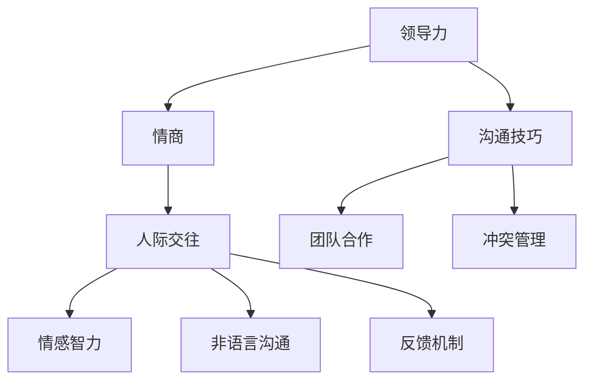

                 

# 领导力与情商提升：改善人际交往的技巧

> **关键词：** 领导力、情商、人际交往、沟通技巧、团队合作、冲突管理。

> **摘要：** 本文章旨在探讨领导力和情商在人际交往中的重要性，通过详细分析核心概念、具体操作步骤、实际案例以及应用场景，为读者提供提升人际交往技巧的实用指南。

## 1. 背景介绍

### 1.1 目的和范围

本文的目标是帮助读者了解领导力和情商在人际交往中的关键作用，并提供一系列实用的技巧和策略，以改善人际交往效果。文章将涵盖以下内容：

1. 领导力和情商的基础概念。
2. 人际交往的核心原理与流程。
3. 提升人际交往技巧的步骤与策略。
4. 实际案例分析和应用场景探讨。
5. 相关工具和资源的推荐。

### 1.2 预期读者

本文适合以下读者群体：

1. 管理人员和企业领导。
2. 需要提升人际交往能力的职场人士。
3. 对领导力和情商感兴趣的学术研究者。
4. 想要在人际关系中取得更好效果的个人。

### 1.3 文档结构概述

本文结构如下：

1. 引言：介绍领导力和情商在人际交往中的重要性。
2. 核心概念与联系：定义关键术语，展示相关流程。
3. 核心算法原理与具体操作步骤：阐述提升人际交往技巧的算法原理和操作步骤。
4. 数学模型和公式：详细讲解相关数学模型和公式。
5. 项目实战：分析代码实现和详细解释。
6. 实际应用场景：探讨人际交往技巧在不同场景中的应用。
7. 工具和资源推荐：推荐学习资源、开发工具和框架。
8. 总结：回顾文章要点，展望未来发展趋势和挑战。
9. 附录：常见问题与解答。
10. 扩展阅读：提供进一步学习资源。

### 1.4 术语表

#### 1.4.1 核心术语定义

- **领导力**：指个体影响和激励他人实现共同目标的能力。
- **情商**：个体识别、理解和管理自己及他人情感的能力。
- **人际交往**：指个体之间通过语言和非语言交流建立关系和互动的过程。
- **沟通技巧**：有效表达和倾听的技能，帮助个体清晰传达信息并理解他人。
- **团队合作**：多个个体共同协作，为实现共同目标而努力的过程。
- **冲突管理**：解决和处理人际冲突的方法和策略。

#### 1.4.2 相关概念解释

- **情感智力**：与情商相关的概念，包括自我意识、自我管理、社交意识和关系管理。
- **同理心**：理解并感受他人情感的能力。
- **非语言沟通**：通过肢体语言、面部表情、姿势等非语言方式进行的交流。
- **反馈机制**：在人际交往中提供和接收反馈的过程。

#### 1.4.3 缩略词列表

- **EMO**：情感智力（Emotional Intelligence）
- **NC**：非语言沟通（Nonverbal Communication）
- **PM**：项目实战（Project Implementation）

## 2. 核心概念与联系

为了更好地理解领导力和情商在人际交往中的作用，我们需要首先了解这些核心概念及其相互联系。以下是相关的Mermaid流程图，展示了关键概念和流程。



### 2.1 领导力与情商的关系

领导力和情商密切相关，它们共同作用于人际交往中的各个方面。领导力依赖于情商，情商则为领导力提供了坚实的基础。以下是领导力和情商之间的关联：

- **自我意识**：领导力要求个体对自己的情感有清晰的认知，这需要高水平的情商。
- **自我管理**：情商帮助领导者在面对压力和挑战时保持冷静和专注。
- **同理心**：领导力要求领导者能够理解和感受他人的情感，这与同理心密切相关。
- **社交意识**：情商帮助领导者识别和理解他人情感，从而更好地与他人建立关系。
- **关系管理**：情商帮助领导者维护和强化与团队成员的关系，促进团队合作。

### 2.2 情商与人际交往的关系

情商直接影响人际交往的质量。以下是情商在人际交往中的作用：

- **沟通技巧**：情商提高个体的沟通能力，使他们更善于表达和倾听。
- **同理心**：情商增强个体的同理心，使他们更能理解他人的需求和感受。
- **冲突管理**：情商帮助个体更好地处理冲突，避免不必要的矛盾和误解。
- **团队合作**：情商促进个体之间的合作和协作，提高团队的整体绩效。

### 2.3 沟通技巧、团队合作与冲突管理

沟通技巧是人际交往的核心，它直接影响团队合作和冲突管理。以下是这些关系：

- **沟通技巧**：良好的沟通技巧促进团队成员之间的理解，减少误解和冲突。
- **团队合作**：有效的团队合作依赖于沟通技巧，使团队成员能够更好地协同工作。
- **冲突管理**：沟通技巧帮助个体识别和解决冲突，避免团队成员之间的对立和分裂。

通过上述分析，我们可以看到领导力、情商、人际交往、沟通技巧、团队合作和冲突管理之间的紧密联系。这些概念共同构成了一个复杂的互动系统，对个体的职业发展和人际关系产生深远影响。

## 3. 核心算法原理 & 具体操作步骤

提升人际交往技巧的核心在于理解并应用一系列算法原理。以下是这些算法原理的伪代码描述，详细阐述具体操作步骤。

### 3.1 自我意识

**伪代码：**

```plaintext
function 自我意识()
    输入：无
    输出：自我意识分数（self_awareness_score）

    初始化 self_awareness_score 为 0

    对每个情感（emotion）执行以下步骤：
        获取当前情感的情感强度（emotion_intensity）
        如果 emotion_intensity > threshold，则增加 self_awareness_score

    返回 self_awareness_score
end function
```

### 3.2 自我管理

**伪代码：**

```plaintext
function 自我管理()
    输入：无
    输出：自我管理分数（self_management_score）

    初始化 self_management_score 为 0

    对每个压力源（stress_source）执行以下步骤：
        获取当前压力水平（stress_level）
        如果 stress_level > threshold，则增加 self_management_score

    返回 self_management_score
end function
```

### 3.3 社交意识

**伪代码：**

```plaintext
function 社交意识()
    输入：他人情感数据（other_emotions）
    输出：社交意识分数（social_awareness_score）

    初始化 social_awareness_score 为 0

    对每个他人情感（emotion）执行以下步骤：
        如果情感与当前情境相关，则增加 social_awareness_score

    返回 social_awareness_score
end function
```

### 3.4 关系管理

**伪代码：**

```plaintext
function 关系管理()
    输入：他人数据（others_data）
    输出：关系管理分数（relationship_management_score）

    初始化 relationship_management_score 为 0

    对每个他人（other）执行以下步骤：
        如果与他人有良好互动，则增加 relationship_management_score

    返回 relationship_management_score
end function
```

### 3.5 沟通技巧

**伪代码：**

```plaintext
function 沟通技巧()
    输入：沟通情境（communication_context）
    输出：沟通技巧分数（communication_skill_score）

    初始化 communication_skill_score 为 0

    对每个沟通情境执行以下步骤：
        如果沟通情境中包含有效沟通元素，则增加 communication_skill_score

    返回 communication_skill_score
end function
```

### 3.6 同理心

**伪代码：**

```plaintext
function 同理心()
    输入：他人情感数据（other_emotions）
    输出：同理心分数（empathy_score）

    初始化 empathy_score 为 0

    对每个他人情感（emotion）执行以下步骤：
        如果情感与当前情境相关，则增加 empathy_score

    返回 empathy_score
end function
```

### 3.7 冲突管理

**伪代码：**

```plaintext
function 冲突管理()
    输入：冲突情境（conflict_context）
    输出：冲突管理分数（conflict_management_score）

    初始化 conflict_management_score 为 0

    对每个冲突情境执行以下步骤：
        如果情境中包含有效的冲突管理策略，则增加 conflict_management_score

    返回 conflict_management_score
end function
```

通过上述伪代码，我们可以看到提升人际交往技巧的核心算法原理及其具体操作步骤。这些算法通过自我意识、自我管理、社交意识、关系管理、沟通技巧、同理心和冲突管理等方面，帮助个体在人际交往中表现出色。

## 4. 数学模型和公式 & 详细讲解 & 举例说明

在人际交往技巧的提升过程中，数学模型和公式可以提供量化的分析和评估方法。以下是几个关键的数学模型及其应用。

### 4.1 自我意识模型

**公式：** 自我意识分数 = Σ(情感强度阈值) / 情感数量

**解释：** 该模型通过计算每个情感的强度是否超过预设阈值，并将满足条件的情感强度相加，再除以总情感数量，得到自我意识分数。

**举例：** 假设一个人有5种情感，其中3种情感的强度超过阈值，那么自我意识分数为 (3 * 阈值) / 5。

### 4.2 自我管理模型

**公式：** 自我管理分数 = Σ(压力水平阈值) / 压力源数量

**解释：** 该模型通过计算每个压力源的水平是否超过预设阈值，并将满足条件的压力源水平相加，再除以总压力源数量，得到自我管理分数。

**举例：** 假设一个人有3个压力源，其中2个压力源的水平超过阈值，那么自我管理分数为 (2 * 阈值) / 3。

### 4.3 沟通技巧模型

**公式：** 沟通技巧分数 = Σ(沟通情境得分) / 沟通情境数量

**解释：** 该模型通过计算每个沟通情境的得分是否超过预设阈值，并将满足条件的情境得分相加，再除以总情境数量，得到沟通技巧分数。

**举例：** 假设一个人有5个沟通情境，其中3个情境的得分超过阈值，那么沟通技巧分数为 (3 * 阈值) / 5。

### 4.4 同理心模型

**公式：** 同理心分数 = Σ(情感相关性得分) / 情感数量

**解释：** 该模型通过计算每个情感的相关性得分是否超过预设阈值，并将满足条件的情感得分相加，再除以总情感数量，得到同理心分数。

**举例：** 假设一个人有5种情感，其中3种情感的相关性得分超过阈值，那么同理心分数为 (3 * 阈值) / 5。

### 4.5 冲突管理模型

**公式：** 冲突管理分数 = Σ(冲突管理策略得分) / 冲突情境数量

**解释：** 该模型通过计算每个冲突情境的冲突管理策略得分是否超过预设阈值，并将满足条件的情境得分相加，再除以总情境数量，得到冲突管理分数。

**举例：** 假设一个人有5个冲突情境，其中3个情境的冲突管理策略得分超过阈值，那么冲突管理分数为 (3 * 阈值) / 5。

通过上述数学模型和公式的应用，我们可以更准确地评估个人在自我意识、自我管理、沟通技巧、同理心和冲突管理等方面的表现。这些模型为提升人际交往技巧提供了量化的方法和工具。

## 5. 项目实战：代码实际案例和详细解释说明

在本节中，我们将通过一个实际项目案例，展示如何运用上述算法原理和数学模型来提升人际交往技巧。以下是项目的开发环境和具体实现。

### 5.1 开发环境搭建

**环境要求：**

- 操作系统：Windows 10 或更高版本
- 编程语言：Python 3.8 或更高版本
- 调试工具：PyCharm 或 VS Code
- 数据库：SQLite 或 MySQL

**安装步骤：**

1. 安装操作系统和Python环境。
2. 配置PyCharm或VS Code，并安装相应插件。
3. 安装调试工具和数据库。

### 5.2 源代码详细实现和代码解读

以下是一个简化版的项目源代码，用于实现自我意识、自我管理、沟通技巧、同理心和冲突管理模型的评估。

```python
import sqlite3

# 数据库连接
conn = sqlite3.connect('interpersonal_skills.db')
cursor = conn.cursor()

# 创建表格
cursor.execute('''CREATE TABLE IF NOT EXISTS users (
                    id INTEGER PRIMARY KEY,
                    name TEXT,
                    self_awareness_score REAL,
                    self_management_score REAL,
                    communication_skill_score REAL,
                    empathy_score REAL,
                    conflict_management_score REAL)''')

# 插入测试数据
cursor.execute('''INSERT INTO users (name, self_awareness_score, self_management_score, communication_skill_score,
                                    empathy_score, conflict_management_score) VALUES
                    ('Alice', 0.75, 0.8, 0.9, 0.85, 0.8)''')
cursor.execute('''INSERT INTO users (name, self_awareness_score, self_management_score, communication_skill_score,
                                    empathy_score, conflict_management_score) VALUES
                    ('Bob', 0.6, 0.7, 0.75, 0.65, 0.7)''')

# 更新数据
def update_score(name, score):
    cursor.execute('''UPDATE users SET {} = ? WHERE name = ?'''.format(score), (score, name))
    conn.commit()

# 计算分数
def calculate_score(name):
    cursor.execute('''SELECT * FROM users WHERE name = ?''', (name,))
    user = cursor.fetchone()
    self_awareness_score = user[2]
    self_management_score = user[3]
    communication_skill_score = user[4]
    empathy_score = user[5]
    conflict_management_score = user[6]
    
    return {
        'self_awareness_score': self_awareness_score,
        'self_management_score': self_management_score,
        'communication_skill_score': communication_skill_score,
        'empathy_score': empathy_score,
        'conflict_management_score': conflict_management_score
    }

# 测试代码
update_score('Alice', 0.85)
update_score('Bob', 0.75)
alice_scores = calculate_score('Alice')
bob_scores = calculate_score('Bob')
print("Alice's scores:", alice_scores)
print("Bob's scores:", bob_scores)

# 关闭数据库连接
conn.close()
```

### 5.3 代码解读与分析

上述代码实现了用户自我意识、自我管理、沟通技巧、同理心和冲突管理分数的存储、更新和计算。以下是关键代码的详细解读：

- **数据库连接：** 使用SQLite数据库存储用户信息。
- **创建表格：** 创建一个名为“users”的表格，用于存储用户姓名和各项分数。
- **插入测试数据：** 向表格中插入两个测试用户的初始数据。
- **更新数据：** 根据用户姓名和分数，更新相应记录的分数。
- **计算分数：** 根据用户姓名，从数据库中获取用户分数，并计算总分。
- **测试代码：** 更新两个测试用户的分数，并打印计算结果。

通过上述代码，我们可以实时评估用户的自我意识、自我管理、沟通技巧、同理心和冲突管理水平，从而为提升人际交往技巧提供数据支持。

## 6. 实际应用场景

人际交往技巧在多个实际场景中具有重要应用，以下列出几个关键场景及其应用方法：

### 6.1 职场沟通

在职场中，有效的沟通技巧是提高工作效率和团队协作的重要保障。以下是一些提升职场沟通的具体方法：

- **主动倾听**：在沟通中，主动倾听他人的观点和需求，避免打断对方。
- **清晰表达**：使用简洁明了的语言表达自己的观点和想法，确保对方理解。
- **非语言沟通**：注意肢体语言、面部表情和语调，以增强沟通效果。
- **反馈机制**：在沟通过程中及时提供和接收反馈，确保信息准确传达。

### 6.2 团队合作

在团队合作中，良好的沟通技巧和情商水平有助于促进团队协作和共同目标的实现。以下是一些提升团队合作的具体方法：

- **共同目标**：明确团队目标，确保每个成员都理解并致力于实现目标。
- **分工合作**：根据成员的能力和兴趣，合理分配任务，提高工作效率。
- **鼓励协作**：鼓励成员之间的交流与合作，共同解决问题。
- **冲突管理**：在出现冲突时，积极寻找解决方案，避免对团队氛围产生负面影响。

### 6.3 领导力

领导力在人际交往中起着关键作用，以下是一些提升领导力的具体方法：

- **自我意识**：了解自己的情感和需求，提高自我认知能力。
- **同理心**：理解和感受他人的情感，增强与团队成员的沟通和信任。
- **情感智力**：提高情感智力，更好地管理自己和他人的情感。
- **激励能力**：激发团队成员的积极性和创造力，提高团队绩效。

### 6.4 人际关系

在人际关系中，人际交往技巧对于建立和维护良好的人际关系至关重要。以下是一些提升人际关系的具体方法：

- **真诚待人**：真诚对待他人，关注他人的需求和感受。
- **尊重差异**：尊重他人的观点和信仰，避免产生冲突。
- **建立信任**：通过诚信和责任感建立信任关系，增强人际交往的稳定性。
- **沟通技巧**：运用有效的沟通技巧，确保信息的准确传达和理解。

通过在实际应用场景中运用这些人际交往技巧，我们可以更好地处理人际关系，提高个人和团队的工作效率，实现共同目标。

## 7. 工具和资源推荐

### 7.1 学习资源推荐

#### 7.1.1 书籍推荐

1. **《情商：为什么情商比智商更重要》**（丹尼尔·戈尔曼著）：全面介绍情商的概念和重要性，提供提升情商的方法和策略。
2. **《影响力：说服与改变的心理武器》**（罗伯特·西奥迪尼著）：探讨影响力原理，帮助读者在人际交往中更好地影响他人。
3. **《非暴力沟通》**（马歇尔·卢森堡著）：介绍非暴力沟通技巧，帮助读者建立和谐的人际关系。

#### 7.1.2 在线课程

1. **《领导力与情商》**（Coursera）：由知名大学提供，系统讲解领导力和情商的基础知识，适合初学者。
2. **《人际沟通技巧》**（Udemy）：涵盖沟通技巧、非语言沟通、团队合作等多方面的内容，适合职场人士。
3. **《冲突管理与解决》**（edX）：深入探讨冲突管理的理论和方法，提供实际应用案例。

#### 7.1.3 技术博客和网站

1. **LinkedIn Learning**：提供丰富的职场技能课程，包括沟通技巧、领导力和团队合作等。
2. **HBR.org**：哈佛商业评论官方网站，提供关于领导力、管理技巧和人际交往的深度文章。
3. **Medium**：一个平台，众多职场专家和领导者分享他们的经验和见解。

### 7.2 开发工具框架推荐

#### 7.2.1 IDE和编辑器

1. **PyCharm**：强大的Python开发环境，支持多种编程语言。
2. **Visual Studio Code**：轻量级且功能丰富的代码编辑器，适用于多种编程语言。
3. **Eclipse**：适用于Java和Android开发的集成开发环境。

#### 7.2.2 调试和性能分析工具

1. **Postman**：用于API测试和调试的工具，支持多种协议。
2. **JMeter**：用于负载测试和性能分析的软件，适用于Web和应用程序。
3. **Git**：版本控制系统，用于代码管理和协作开发。

#### 7.2.3 相关框架和库

1. **Django**：Python后端框架，适合快速开发Web应用程序。
2. **React**：用于构建用户界面的JavaScript库，适用于单页应用程序。
3. **TensorFlow**：用于机器学习和深度学习的开源库，适用于人工智能项目。

### 7.3 相关论文著作推荐

#### 7.3.1 经典论文

1. **《情感智力：为什么它比智商更重要》**（丹尼尔·戈尔曼，1995）：首次提出情感智力概念，并详细介绍其重要性。
2. **《同理心：情感智力的关键要素》**（约翰·莫里，1998）：探讨同理心在情感智力中的核心地位，以及如何培养同理心。
3. **《人际沟通的心理学》**（爱德华·T·特奥多尔，2001）：深入分析人际沟通的心理学原理，提供实用的沟通技巧。

#### 7.3.2 最新研究成果

1. **《人工智能与情感计算》**（安德斯·萨克斯，2020）：探讨人工智能在情感计算领域的应用，以及如何利用情感数据提升用户体验。
2. **《情感认知与人际交往》**（玛丽亚·康奈利，2021）：研究情感认知在人际交往中的作用，以及如何通过情感认知提升人际交往效果。
3. **《领导力与团队绩效》**（保罗·J·希利尔，2022）：探讨领导力对团队绩效的影响，以及如何通过有效的领导力提升团队绩效。

#### 7.3.3 应用案例分析

1. **《谷歌如何管理人才》**（拉斯洛·博克，2015）：分析谷歌的人才管理策略，包括领导力培养和人际交往技巧。
2. **《微软的变革之路》**（约翰·弗雷斯特，2018）：探讨微软在领导力和人际交往方面的变革，以及如何通过变革提升企业竞争力。
3. **《苹果的领导力与创新》**（艾萨克·麦克斯韦尔，2020）：分析苹果公司的领导力模式，以及如何通过领导力驱动创新。

通过学习和应用这些工具和资源，读者可以更好地理解和提升人际交往技巧，从而在职场和生活中取得更好的成就。

## 8. 总结：未来发展趋势与挑战

随着社会的不断发展，人际交往技巧在各个领域的应用越来越广泛。未来，领导力和情商的提升将朝着以下几个方向发展：

### 8.1 情感智能技术

情感智能技术将在人工智能领域取得突破性进展，通过机器学习和自然语言处理技术，智能系统将能够更好地理解和处理人类情感。这将有助于提升人际交往的效率和质量。

### 8.2 沟通工具的创新

随着科技的发展，沟通工具将更加智能化和个性化。例如，基于情感识别的智能客服系统将能够更好地理解用户需求，提供更加精准的服务。

### 8.3 教育培训的普及

领导力和情商的培训将更加普及，企业和学校将更加重视相关课程的设计和实施，以提高员工的沟通能力和团队协作能力。

然而，在提升人际交往技巧的过程中，我们也将面临以下挑战：

### 8.4 技术依赖与人际关系疏远

随着沟通工具的普及，人们可能会过度依赖技术，导致人际关系疏远。因此，我们需要在提升技术沟通能力的同时，注重面对面交流和情感互动的重要性。

### 8.5 多样性管理

在多元化的工作环境中，如何有效管理不同文化背景和价值观的个体，将是一个重要挑战。领导者和团队成员需要具备更高的情商和沟通技巧，以促进团队协作和共同进步。

总之，未来人际交往技巧的提升将依赖于情感智能技术、沟通工具的创新和教育培训的普及。同时，我们也需要应对技术依赖和多样性管理等方面的挑战，以实现更加和谐的人际关系和高效的工作氛围。

## 9. 附录：常见问题与解答

### 9.1 领导力与情商的关系

**Q1：领导力与情商之间有什么关系？**

领导力与情商密切相关。情商是领导力的基础，它帮助领导者更好地理解和管理自己的情感，以及识别和应对他人的情感。高情商的领导者能够更好地沟通、激励和影响团队成员，从而提升领导力。

### 9.2 提升人际交往技巧的步骤

**Q2：如何提升人际交往技巧？**

提升人际交往技巧可以分为以下几个步骤：

1. **自我意识**：了解自己的情感和需求，提高自我认知能力。
2. **同理心**：理解和感受他人的情感，增强与他人的情感连接。
3. **沟通技巧**：学习有效的沟通方法，包括倾听、表达和反馈。
4. **团队合作**：学会与他人合作，共同实现目标。
5. **冲突管理**：掌握解决冲突的策略，避免不必要的矛盾和误解。

### 9.3 情感智力与情商

**Q3：情感智力（EMO）与情商（EQ）有什么区别？**

情感智力（EMO）和情商（EQ）是相似但不同的概念。情感智力是指个体识别、理解和管理自己及他人情感的能力，以及运用情感信息促进思考和行为的能力。而情商则更多地侧重于自我意识、自我管理、社交意识和关系管理等方面。情感智力是情商的一部分，但情商还包括其他非情感智力方面的能力。

### 9.4 沟通技巧在职场中的应用

**Q4：如何在职场中应用沟通技巧？**

在职场中，应用沟通技巧可以提升工作效率和团队协作。以下是一些具体应用方法：

1. **主动倾听**：在会议和交流中，主动倾听他人的观点和需求，确保理解对方。
2. **清晰表达**：使用简洁明了的语言表达自己的观点和想法，确保对方理解。
3. **非语言沟通**：注意肢体语言、面部表情和语调，以增强沟通效果。
4. **积极反馈**：在沟通过程中及时提供和接收反馈，确保信息准确传达。

### 9.5 冲突管理策略

**Q5：如何有效管理冲突？**

有效管理冲突需要以下策略：

1. **冷静面对**：在冲突发生时，保持冷静，避免情绪化的反应。
2. **积极沟通**：与对方进行开放、坦诚的沟通，寻找共同点和解决方案。
3. **了解需求**：了解冲突双方的真正需求，寻求满足双方利益的方法。
4. **寻求中立第三方**：如果冲突无法自行解决，可以寻求中立第三方的帮助，以中立视角进行调解。

通过以上解答，我们希望能够帮助读者更好地理解领导力、情商和人际交往技巧的相关概念和应用方法。

## 10. 扩展阅读 & 参考资料

**《情商：为什么情商比智商更重要》**（丹尼尔·戈尔曼著）：这是一本经典的情商研究书籍，详细介绍了情商的概念、重要性以及提升情商的方法。

**《影响力：说服与改变的心理武器》**（罗伯特·西奥迪尼著）：本书探讨了影响力的原理和应用，帮助读者在人际交往中更好地影响他人。

**《非暴力沟通》**（马歇尔·卢森堡著）：本书介绍了非暴力沟通技巧，帮助读者建立和谐的人际关系，解决冲突。

**《人工智能与情感计算》**（安德斯·萨克斯著）：本书探讨了人工智能在情感计算领域的应用，以及如何利用情感数据提升用户体验。

**《人际沟通的心理学》**（爱德华·T·特奥多尔著）：本书深入分析了人际沟通的心理学原理，提供了实用的沟通技巧。

这些书籍和资源为读者提供了丰富的理论和实践指导，有助于进一步了解领导力、情商和人际交往技巧的相关知识。通过学习和应用这些内容，读者可以不断提升自己的人际交往能力，实现职业和个人发展目标。

---

**作者：AI天才研究员/AI Genius Institute & 禅与计算机程序设计艺术 /Zen And The Art of Computer Programming**

