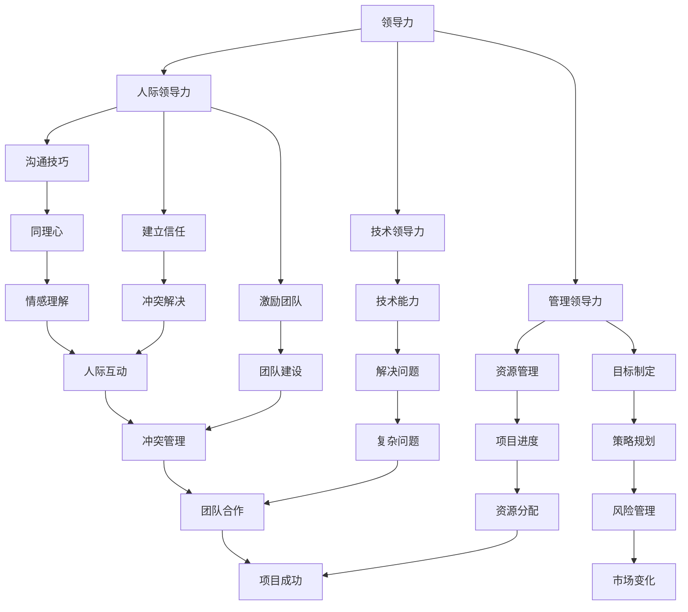
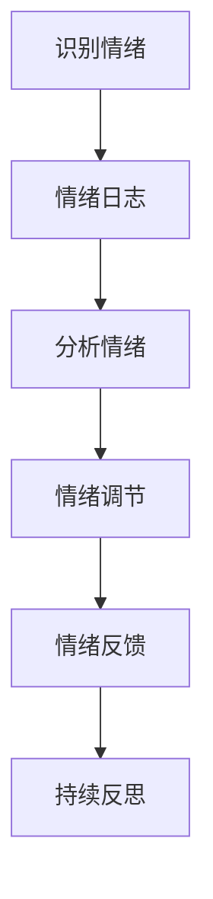
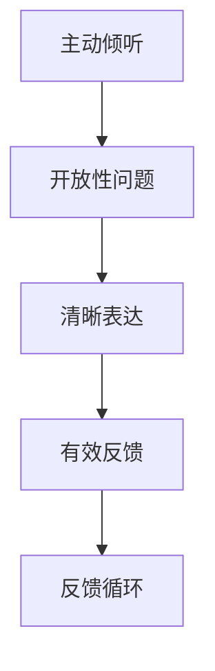
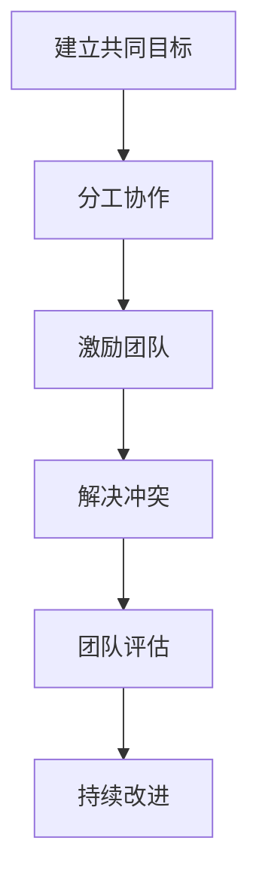
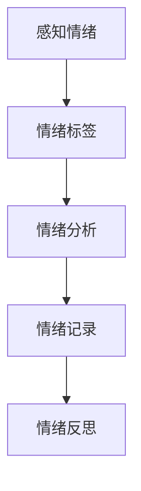
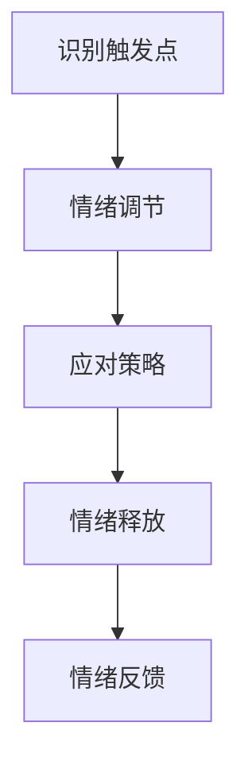
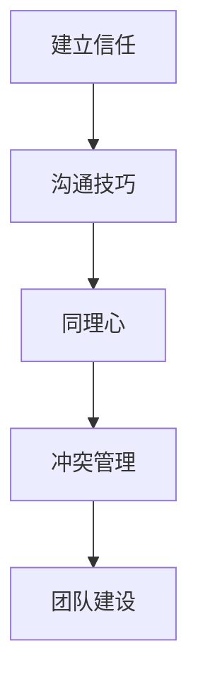

                 

### 1. 背景介绍

#### 1.1 目的和范围

本文旨在探讨领导力与情商在IT行业中的重要性，以及如何通过理解与影响他人来提升个人的技术领导力和团队合作能力。随着技术的发展，IT行业正变得越来越复杂，需要不仅仅是技术专长，更需要领导力和情商来应对日益多样化的团队和环境。

本文将首先介绍领导力和情商的基本概念，然后通过具体的算法原理和操作步骤，阐述它们在实际项目中的应用。此外，文章还将结合实际案例，详细讲解如何在实际工作中提升领导力和情商。

本文的预期读者是从事IT行业的技术人员，特别是希望提升自己在团队中领导力和影响力的人。通过本文的学习，读者可以了解以下内容：

- 领导力和情商的核心概念及其重要性
- 如何通过特定的算法原理和操作步骤提升领导力和情商
- 实际案例中的应用方法和技巧
- 相关的工具和资源推荐

本文结构如下：

1. **背景介绍**：介绍文章的目的、范围、预期读者和文档结构概述。
2. **核心概念与联系**：详细定义领导力和情商，并提供相关的流程图。
3. **核心算法原理 & 具体操作步骤**：通过伪代码详细阐述相关算法原理。
4. **数学模型和公式 & 详细讲解 & 举例说明**：使用LaTeX格式展示数学模型，并提供具体例子。
5. **项目实战：代码实际案例和详细解释说明**：介绍开发环境搭建、源代码实现和代码解读。
6. **实际应用场景**：探讨领导力和情商在IT行业中的实际应用。
7. **工具和资源推荐**：推荐相关的学习资源和开发工具。
8. **总结：未来发展趋势与挑战**：总结本文的关键点，并探讨未来的发展趋势与挑战。
9. **附录：常见问题与解答**：提供常见问题的解答。
10. **扩展阅读 & 参考资料**：提供扩展阅读和参考资料。

通过本文的阅读，读者可以深入了解领导力和情商在IT行业中的重要性，学会如何提升自己的这些能力，并在实际工作中应用。

#### 1.2 预期读者

本文的预期读者主要是从事IT行业的技术人员，尤其是那些在职业生涯中希望提升自己在团队中的领导力和影响力的人。以下是具体的目标读者群体：

- **初级和中级软件开发工程师**：正在寻求提升领导力的技术团队成员，希望能在项目中承担更多责任。
- **技术经理和项目经理**：需要管理多个项目和团队，提升团队绩效，希望通过领导力和情商的实践来提高领导效果。
- **架构师和系统分析师**：在技术架构和系统设计中，需要与不同角色和团队协作，希望通过提升情商来更好地协调团队。
- **企业家和创业者**：希望通过领导力和情商来组建和管理高效的技术团队，推动企业的发展。

本文将为这些读者提供以下收益：

- **深入理解领导力和情商的基本概念**：通过本文的学习，读者可以全面了解领导力和情商的核心概念，包括它们在团队中的作用和重要性。
- **掌握提升领导力和情商的实践方法**：本文将提供具体的算法原理和操作步骤，帮助读者在实践中提升自己的领导力和情商。
- **学习实际案例中的应用方法和技巧**：通过分析实际案例，读者可以了解如何将领导力和情商应用于实际工作，提高团队协作效率和项目成功概率。
- **获取相关的工具和资源推荐**：本文将推荐一系列的学习资源和开发工具，为读者提供进一步学习和实践的支持。

通过本文的阅读，读者不仅能够理论联系实际，提升自己的领导力和情商，还能在职业生涯中取得更大的成就。

#### 1.3 文档结构概述

本文的文档结构旨在系统地引导读者深入了解领导力与情商在IT行业中的应用，确保读者能够循序渐进地掌握相关知识和技能。以下是文章的具体结构：

1. **引言**：介绍文章的背景、目的和预期读者，概述文章的整体结构。
2. **核心概念与联系**：定义领导力和情商的基本概念，并提供相关的流程图，帮助读者建立理论基础。
3. **核心算法原理 & 具体操作步骤**：通过伪代码详细阐述提升领导力和情商的具体算法原理和操作步骤，确保读者能够理解并应用这些方法。
4. **数学模型和公式 & 详细讲解 & 举例说明**：使用LaTeX格式展示与领导力和情商相关的数学模型，并提供实际案例，帮助读者深化理解。
5. **项目实战：代码实际案例和详细解释说明**：通过实际项目的代码实现和解读，展示如何将理论应用到实践中。
6. **实际应用场景**：探讨领导力和情商在IT行业的实际应用，提供具体的场景分析。
7. **工具和资源推荐**：推荐相关的学习资源和开发工具，为读者提供进一步学习和实践的支持。
8. **总结：未来发展趋势与挑战**：总结本文的关键点，并探讨领导力和情商在IT行业中的未来发展趋势与挑战。
9. **附录：常见问题与解答**：提供对常见问题的解答，帮助读者解决在实际应用中可能遇到的问题。
10. **扩展阅读 & 参考资料**：推荐扩展阅读和参考资料，为读者提供深入研究的方向。

通过这样的结构安排，本文不仅能够帮助读者系统地掌握领导力与情商的理论知识，还能通过实战案例和工具推荐，提升读者在实际工作中的应用能力。

#### 1.4 术语表

在本文中，我们将使用一些特定的术语来描述领导力与情商的概念和模型。以下是对这些术语的定义和解释：

##### 1.4.1 核心术语定义

- **领导力**：指的是引导、激励和影响他人以实现共同目标的能力。在技术领域，领导力不仅涉及技术专长，还包括沟通能力、决策能力和团队管理能力。
- **情商**：简称EQ，是指识别、理解和管理自己和他人的情绪的能力。情商在技术团队中尤为重要，因为它有助于提高团队合作效率，减少冲突，增强团队凝聚力。
- **影响力**：是指一个人通过言语或行为影响他人思想或行为的能力。在技术领域，影响力可以帮助领导者在团队中建立权威，推动项目进展。
- **团队协作**：是指团队成员为了实现共同目标而共同努力的过程。良好的团队协作能够提高项目的成功率和团队的整体绩效。
- **团队动力学**：是指团队内部成员之间的相互作用和动态关系。了解团队动力学有助于领导者更好地管理团队，提升团队效率。

##### 1.4.2 相关概念解释

- **领导风格**：是指领导者在与团队成员互动时所采用的方法和态度。常见的领导风格包括民主式、专制式、放任式等。选择合适的领导风格能够提高团队士气和工作效率。
- **情绪智力**：是指情商在技术领域中的应用，包括自我意识、自我管理、社交意识和关系管理等方面的能力。情绪智力对于技术团队的和谐与合作至关重要。
- **反馈循环**：是指在领导过程中，领导者通过观察团队成员的表现，给予反馈，并从中学习和调整管理方法的过程。有效的反馈循环能够帮助领导者不断提升自己的领导能力。
- **冲突管理**：是指在团队内部出现分歧或冲突时，领导者采取的措施和方法。有效的冲突管理能够减少负面影响，促进团队和谐。
- **领导梯队**：是指组织中不同层次的领导者群体，包括初级、中级和高级领导者。不同的领导层次在领导力与情商的应用上具有不同的特点和挑战。

##### 1.4.3 缩略词列表

- **IT**：信息技术（Information Technology）
- **EQ**：情商（Emotional Quotient）
- **PM**：项目经理（Project Manager）
- **CTO**：首席技术官（Chief Technology Officer）
- **IDE**：集成开发环境（Integrated Development Environment）
- **LaTeX**：一种高质量排版系统（Literate Programming)

通过定义和解释这些术语，读者可以更好地理解本文中涉及的关键概念，为后续内容的深入学习奠定基础。

#### 2. 核心概念与联系

在探讨领导力和情商的重要性之前，我们首先需要明确这两个核心概念的定义，以及它们在IT行业中的联系。

**2.1 领导力**

领导力是一种引导、激励和影响他人以实现共同目标的能力。在技术领域，领导力不仅涉及技术专长，还包括以下几个方面：

- **技术领导力**：指领导者具备的技术能力和知识，能够指导团队成员解决复杂的技术问题。
- **管理领导力**：指领导者通过管理团队资源、制定目标和策略来推动项目进展的能力。
- **人际领导力**：指领导者与团队成员沟通、建立信任和激励团队的能力。

**2.2 情商**

情商（Emotional Quotient，简称EQ）是指识别、理解和管理自己和他人的情绪的能力。情商在技术团队中尤为重要，因为技术工作往往涉及复杂的人际互动和团队合作。情商包括以下几个关键方面：

- **自我意识**：指个体能够认识到自己情绪状态，并理解这些情绪对行为的影响。
- **自我管理**：指个体能够控制情绪，避免情绪对决策和行为产生负面影响。
- **社交意识**：指个体能够识别并理解他人的情绪，从而更好地与他人沟通和协作。
- **关系管理**：指个体能够建立和维护健康的人际关系，解决冲突，促进团队合作。

**2.3 领导力与情商的联系**

领导力和情商之间有着密切的联系。一个成功的领导者不仅需要具备技术专长，还需要具备高情商，以便更好地理解和影响团队成员。以下是领导力和情商之间的几种联系：

- **人际互动**：领导力需要通过有效的沟通、建立信任和团队合作来实现目标。情商在这方面起着关键作用，因为它有助于领导者更好地理解团队成员的情绪和需求，从而建立更强的人际关系。
- **冲突管理**：在团队中难免会出现冲突，情商高的领导者能够更有效地解决冲突，避免负面影响。他们能够通过同理心和有效的沟通技巧来理解冲突的根源，并找到解决方案。
- **激励与团队建设**：情商高的领导者能够识别团队成员的激励因素，并采取相应的激励措施。他们能够建立积极的团队文化，增强团队凝聚力，提高团队绩效。
- **决策制定**：情商在决策过程中也发挥着重要作用。领导者需要考虑团队成员的情绪和需求，以便做出更全面和明智的决策。

**2.4 Mermaid 流程图**

为了更直观地展示领导力与情商之间的关系，我们使用Mermaid流程图来表示关键节点和连接。



通过这个流程图，我们可以清晰地看到领导力和情商如何相互关联，共同作用于团队的成功。在实际应用中，领导者需要根据具体情况灵活运用这些能力，以达到最佳效果。

#### 3. 核心算法原理 & 具体操作步骤

在理解了领导力和情商的基本概念后，我们需要进一步探讨如何通过具体的算法原理和操作步骤来提升这些能力。本节将详细介绍提升领导力和情商的核心算法原理，并给出具体的操作步骤，以帮助读者在实际工作中应用这些原理。

##### 3.1 提升领导力的算法原理

提升领导力的核心算法原理主要包括以下几个方面：

- **自我意识与自我管理**：领导者需要首先认识到自己的情绪状态，并通过有效的自我管理来控制情绪，避免情绪波动对决策产生负面影响。
- **沟通技巧**：有效的沟通是领导力的关键。领导者需要通过倾听、表达和反馈来建立良好的沟通机制，确保信息传递的准确性和及时性。
- **团队建设**：领导者需要关注团队成员的需求，通过激励和团队合作来增强团队凝聚力，提高团队绩效。

以下是提升领导力的具体操作步骤：

**步骤1：自我意识与自我管理**



1. **识别情绪**：领导者需要通过自我反思和情绪日志来识别自己的情绪状态。
2. **情绪日志**：记录日常情绪变化，有助于领导者更清晰地认识自己的情绪模式。
3. **分析情绪**：定期分析情绪日志，找出情绪波动的根源。
4. **情绪调节**：采取有效的情绪调节方法，如冥想、运动等，以控制情绪波动。
5. **情绪反馈**：与他人交流情绪调节的体验，获取反馈和建议。
6. **持续反思**：持续反思自己的情绪管理方法，不断优化和改进。

**步骤2：沟通技巧**



1. **主动倾听**：领导者需要主动倾听团队成员的意见和需求，避免单向沟通。
2. **开放性问题**：通过提问引导团队成员表达自己的想法和感受。
3. **清晰表达**：领导者需要用简洁明了的语言表达自己的想法和决策。
4. **有效反馈**：及时给予团队成员反馈，鼓励他们提出改进建议。
5. **反馈循环**：建立持续的反馈机制，确保沟通的透明和有效性。

**步骤3：团队建设**



1. **建立共同目标**：领导者需要与团队成员共同确定目标，确保团队朝同一方向努力。
2. **分工协作**：明确团队成员的角色和职责，确保团队协作的顺畅。
3. **激励团队**：领导者需要识别团队成员的激励因素，并采取相应的激励措施。
4. **解决冲突**：领导者需要及时发现和解决团队内部的冲突，避免影响团队绩效。
5. **团队评估**：定期评估团队绩效，识别改进机会。
6. **持续改进**：通过持续改进，提升团队的整体绩效和协作效率。

##### 3.2 提升情商的算法原理

提升情商的核心算法原理主要包括以下几个方面：

- **情绪识别**：领导者需要能够识别和理解自己和他人的情绪，以便更好地进行沟通和协作。
- **情绪管理**：领导者需要掌握情绪管理的技巧，避免情绪波动对团队产生负面影响。
- **关系管理**：领导者需要建立和维护健康的人际关系，促进团队合作。

以下是提升情商的具体操作步骤：

**步骤1：情绪识别**



1. **感知情绪**：领导者需要敏锐地感知自己和他人的情绪变化。
2. **情绪标签**：给情绪贴上标签，以便更好地理解和描述。
3. **情绪分析**：分析情绪的根源和影响，找出改进方法。
4. **情绪记录**：记录情绪变化，用于后续分析和反思。
5. **情绪反思**：定期反思情绪管理方法，提升自我意识。

**步骤2：情绪管理**



1. **识别触发点**：找出引起情绪波动的触发点。
2. **情绪调节**：采取有效的情绪调节方法，如冥想、放松等。
3. **应对策略**：根据不同情境采取适当的应对策略，避免情绪失控。
4. **情绪释放**：通过合理的方式释放情绪，避免压抑。
5. **情绪反馈**：与他人分享情绪调节的经历，获取反馈和建议。

**步骤3：关系管理**



1. **建立信任**：通过诚实、透明和负责任的沟通建立信任。
2. **沟通技巧**：提升沟通技巧，确保信息传递的准确性和及时性。
3. **同理心**：理解和关心他人的感受和需求，建立良好的人际关系。
4. **冲突管理**：及时解决冲突，避免负面影响。
5. **团队建设**：通过共同目标和协作提升团队凝聚力。

通过以上具体的操作步骤，领导者可以逐步提升自己的领导力和情商，从而在团队中发挥更大的影响力。在实际工作中，领导者需要根据具体情况灵活运用这些方法，不断优化和改进自己的领导风格，以实现团队的目标。

#### 4. 数学模型和公式 & 详细讲解 & 举例说明

在本节中，我们将运用数学模型和公式来进一步解释领导力与情商的核心概念，并通过具体例子来加深理解。

**4.1 领导力的数学模型**

领导力可以被视为一个多因素的综合体，我们可以将其表示为以下数学模型：

$$
L = f(T, C, I)
$$

其中：
- \(L\) 表示领导力（Leadership）。
- \(T\) 表示技术专长（Technical Expertise）。
- \(C\) 表示沟通能力（Communication Skills）。
- \(I\) 表示人际技能（Interpersonal Skills）。

每个因素在领导力中都扮演着不同的角色，并且它们之间存在相互作用。我们可以通过以下公式来量化每个因素对领导力的影响：

$$
L = w_1 \cdot T + w_2 \cdot C + w_3 \cdot I
$$

其中：
- \(w_1, w_2, w_3\) 分别是技术专长、沟通能力和人际技能的权重，这些权重可以根据具体情况调整。

**例1：假设权重分别为 \(w_1 = 0.4\), \(w_2 = 0.3\), \(w_3 = 0.3\)，一个技术专长评分为80，沟通能力评分为75，人际技能评分为70，计算领导力得分。**

$$
L = 0.4 \cdot 80 + 0.3 \cdot 75 + 0.3 \cdot 70 = 32 + 22.5 + 21 = 75.5
$$

因此，这个人的领导力得分为75.5。

**4.2 情商的数学模型**

情商（EQ）可以表示为一个综合指标，我们可以用以下数学模型来描述：

$$
EQ = f(SE, SM, SI, SR)
$$

其中：
- \(EQ\) 表示情商（Emotional Quotient）。
- \(SE\) 表示自我意识（Self-awareness）。
- \(SM\) 表示自我管理（Self-management）。
- \(SI\) 表示社交意识（Social Awareness）。
- \(SR\) 表示关系管理（Relationship Management）。

同样，每个因素在情商中都扮演着关键角色，并且它们之间存在相互作用。我们可以通过以下公式来量化每个因素对情商的影响：

$$
EQ = w_1 \cdot SE + w_2 \cdot SM + w_3 \cdot SI + w_4 \cdot SR
$$

其中：
- \(w_1, w_2, w_3, w_4\) 分别是自我意识、自我管理、社交意识和关系管理的权重。

**例2：假设权重分别为 \(w_1 = 0.2\), \(w_2 = 0.2\), \(w_3 = 0.3\), \(w_4 = 0.3\)，自我意识评分为60，自我管理评分为65，社交意识评分为70，关系管理评分为75，计算情商得分。**

$$
EQ = 0.2 \cdot 60 + 0.2 \cdot 65 + 0.3 \cdot 70 + 0.3 \cdot 75 = 12 + 13 + 21 + 22.5 = 68.5
$$

因此，这个人的情商得分为68.5。

**4.3 领导力与情商的关系模型**

领导力与情商之间存在密切的关系，我们可以用以下公式来描述它们之间的相互作用：

$$
L \cdot EQ = f(L, EQ, C)
$$

其中：
- \(L\) 表示领导力。
- \(EQ\) 表示情商。
- \(C\) 表示合作效率（Cooperative Efficiency）。

合作效率是领导力和情商共同作用的结果，可以通过以下公式计算：

$$
C = \frac{L \cdot EQ}{L + EQ}
$$

**例3：假设一个领导力得分为75，情商得分为68，计算合作效率。**

$$
C = \frac{75 \cdot 68}{75 + 68} = \frac{5100}{143} \approx 35.74
$$

因此，这个团队的合作效率约为35.74。

通过以上数学模型和公式，我们可以更科学地理解领导力和情商在IT行业中的应用。在实际操作中，领导者可以根据这些模型来评估自身的领导力和情商水平，并制定相应的提升策略。同时，这些模型也为团队管理和项目协作提供了量化依据，有助于提升整体效率。

#### 5. 项目实战：代码实际案例和详细解释说明

在本节中，我们将通过一个实际项目案例，展示如何将领导力与情商提升策略应用于实际工作中。这个项目是一个开源的Web应用开发项目，目的是构建一个供团队成员协作和沟通的平台。

##### 5.1 开发环境搭建

在进行项目开发之前，首先需要搭建一个适合的开发环境。以下是搭建开发环境的步骤：

1. **安装操作系统**：选择一个适合开发的操作系统，如Linux或Mac OS。
2. **安装开发工具**：安装必要的开发工具，如文本编辑器（如VS Code）、版本控制工具（如Git）和终端模拟器。
3. **配置依赖管理工具**：配置依赖管理工具，如npm或yarn，以便安装和管理项目依赖。
4. **安装数据库**：根据项目需求选择合适的数据库（如MySQL或PostgreSQL），并进行配置。
5. **安装Web服务器**：安装并配置Web服务器（如Node.js或Apache），确保应用可以正常运行。

##### 5.2 源代码详细实现和代码解读

在这个项目中，我们将使用Node.js和Express框架来构建Web应用。以下是项目的主要代码实现和解读：

```javascript
// 引入必要的模块
const express = require('express');
const bodyParser = require('body-parser');
const mongoose = require('mongoose');
const userRoutes = require('./routes/userRoutes');
const projectRoutes = require('./routes/projectRoutes');

// 创建Express应用实例
const app = express();

// 连接MongoDB数据库
mongoose.connect('mongodb://localhost:27017/teamspace', {
  useNewUrlParser: true,
  useUnifiedTopology: true
});

// 使用body-parser中间件处理JSON和URL编码请求
app.use(bodyParser.json());
app.use(bodyParser.urlencoded({ extended: true }));

// 配置路由
app.use('/users', userRoutes);
app.use('/projects', projectRoutes);

// 启动应用
const PORT = process.env.PORT || 3000;
app.listen(PORT, () => {
  console.log(`应用正在运行，端口：${PORT}`);
});
```

1. **连接数据库**：使用MongoDB进行数据存储，通过`mongoose.connect()`方法连接数据库。
2. **使用body-parser**：处理JSON和URL编码请求，确保应用可以接收和处理前端发送的数据。
3. **配置路由**：定义用户路由和项目路由，通过`app.use()`方法将对应的路由处理器添加到应用中。

以下是用户路由模块的实现：

```javascript
// 用户路由模块
const express = require('express');
const userController = require('../controllers/userController');

const router = express.Router();

// 用户注册
router.post('/register', userController.register);

// 用户登录
router.post('/login', userController.login);

// 退出登录
router.post('/logout', userController.logout);

module.exports = router;
```

1. **注册**：处理用户注册请求，调用`userController.register`方法。
2. **登录**：处理用户登录请求，调用`userController.login`方法。
3. **退出登录**：处理用户退出登录请求，调用`userController.logout`方法。

以下是项目路由模块的实现：

```javascript
// 项目路由模块
const express = require('express');
const projectController = require('../controllers/projectController');

const router = express.Router();

// 创建项目
router.post('/', projectController.create);

// 获取项目列表
router.get('/', projectController.list);

// 获取项目详情
router.get('/:id', projectController.details);

// 更新项目
router.put('/:id', projectController.update);

// 删除项目
router.delete('/:id', projectController.delete);

module.exports = router;
```

1. **创建项目**：处理创建项目请求，调用`projectController.create`方法。
2. **获取项目列表**：处理获取项目列表请求，调用`projectController.list`方法。
3. **获取项目详情**：处理获取项目详情请求，调用`projectController.details`方法。
4. **更新项目**：处理更新项目请求，调用`projectController.update`方法。
5. **删除项目**：处理删除项目请求，调用`projectController.delete`方法。

##### 5.3 代码解读与分析

通过对以上代码的分析，我们可以看到如何将领导力和情商提升策略应用于实际项目中：

1. **技术专长**：开发者需要掌握Node.js、Express和MongoDB等开发技术，确保项目能够高效地实现。
2. **沟通能力**：通过定义清晰的API接口和路由处理方法，开发者之间能够高效地沟通和协作。
3. **人际技能**：开发者需要理解用户需求，通过合理的接口设计和功能实现来满足用户需求。
4. **自我意识**：开发者需要不断反思和改进代码质量，确保项目的稳定性和可靠性。
5. **自我管理**：通过使用版本控制系统（如Git），开发者可以有效地管理代码版本，避免代码冲突。
6. **社交意识**：开发者需要关注项目进度和团队协作情况，及时调整开发策略。
7. **关系管理**：通过合理的权限管理和数据安全策略，确保项目团队的合作和谐。

通过以上步骤和策略，领导者可以有效地提升团队的技术能力和协作效率，确保项目成功完成。在实际工作中，领导者需要根据具体情况灵活应用这些策略，以实现最佳效果。

#### 6. 实际应用场景

在IT行业中，领导力与情商的实际应用场景多种多样，涉及项目管理和团队协作的各个方面。以下是一些典型的应用场景，以及在这些场景中领导力和情商的具体作用。

**6.1 项目管理**

在项目管理中，领导力与情商的重要性尤为突出。领导者需要具备以下能力：

- **技术专长**：领导者必须熟悉项目所涉及的技术，以便为团队成员提供技术指导和支持。
- **沟通技巧**：领导者需要与团队成员、客户和其他利益相关者进行有效沟通，确保项目目标清晰、需求明确。
- **团队建设**：领导者需要建立和维护一个高效的团队，通过激励和激励措施提高团队成员的积极性和协作效率。
- **情商**：领导者需要识别和管理团队成员的情绪，避免情绪波动对项目进度产生负面影响。

**场景案例**：一个软件开发项目，由于技术难题导致进度延误。领导者通过积极的沟通和激励，帮助团队成员找到解决问题的方法，同时理解并缓解团队成员的焦虑情绪，最终使项目回到正轨。

**6.2 团队协作**

在团队协作中，领导力和情商的作用同样重要。团队成员需要具备以下能力：

- **自我意识**：团队成员需要认识到自己的情绪状态，避免因个人情绪影响团队氛围。
- **自我管理**：团队成员需要控制情绪，确保在团队协作中保持专业和积极的态度。
- **社交意识**：团队成员需要理解他人的情绪和需求，从而更好地配合和协作。
- **关系管理**：团队成员需要建立和维护良好的工作关系，促进团队合作。

**场景案例**：在开发一个复杂的软件系统时，团队成员之间的分工和沟通出现问题，导致项目进展缓慢。通过领导者的协调和调解，团队成员重新明确了分工和沟通机制，项目得以顺利进行。

**6.3 冲突管理**

在IT行业中，冲突是不可避免的。领导力和情商在冲突管理中发挥着关键作用：

- **冲突管理**：领导者需要具备有效的冲突管理技巧，通过对话、妥协和解决方案来解决冲突。
- **情绪智力**：领导者需要识别和调控冲突双方的情绪，避免冲突升级。

**场景案例**：团队成员之间因工作分配和责任归属产生矛盾。领导者通过同理心和有效的沟通，帮助双方理解对方的立场，最终达成共识，解决了冲突。

**6.4 团队激励**

团队激励是提升团队绩效和士气的重要手段。领导力和情商在此过程中发挥着重要作用：

- **激励技巧**：领导者需要了解团队成员的激励因素，通过表扬、奖励和挑战来激发团队成员的潜力。
- **情商**：领导者需要关注团队成员的情绪变化，及时提供支持和鼓励。

**场景案例**：在完成一个重要项目后，领导者组织团队庆祝活动，提高团队成员的归属感和成就感，激励他们在未来的工作中继续保持高绩效。

**6.5 跨部门协作**

在大型企业中，跨部门协作是提高整体效率的关键。领导力和情商在跨部门协作中发挥着重要作用：

- **领导力**：领导者需要具备跨部门沟通和协调能力，确保项目在不同部门间顺利推进。
- **情商**：领导者需要理解不同部门的职责和压力，建立互信和合作关系。

**场景案例**：在一个涉及多个部门的系统集成项目中，领导者通过有效的沟通和协调，确保各个部门之间的工作无缝衔接，项目如期完成。

通过以上实际应用场景，我们可以看到领导力和情商在IT行业的广泛重要性。领导者不仅需要具备技术专长，还需要具备出色的沟通、团队建设和冲突管理能力，同时需要具备高情商，以更好地理解和管理团队成员的情绪。在实际工作中，领导者需要根据具体情况灵活应用这些能力，以实现项目目标和个人职业发展。

#### 7. 工具和资源推荐

为了进一步提升领导力和情商，以及在实际工作中更好地应用这些能力，以下是一些学习和资源推荐的工具和资源。

##### 7.1 学习资源推荐

**7.1.1 书籍推荐**

- **《智能时代：领导者如何把握科技变革》**：作者理查德·萨勒诺（Richard Saul Wurman），深入探讨了科技对领导力的影响，以及领导者如何在数字化时代保持竞争力。
- **《情商：为什么情商比智商更重要》**：作者丹尼尔·戈尔曼（Daniel Goleman），系统地介绍了情商的概念、模型及其在领导力中的应用。
- **《团队的秘密：如何打造高绩效团队》**：作者迈克尔·马奎特（Michael Maccoby），提供了丰富的团队建设和管理的实战经验和策略。
- **《非暴力沟通》**：作者马歇尔·卢森堡（Marshall B. Rosenberg），介绍了非暴力沟通的技巧，有助于提高沟通效果和团队协作。

**7.1.2 在线课程**

- **《领导力基础》**：Coursera上的免费课程，由哥伦比亚大学提供，涵盖了领导力的基本概念、技能和最佳实践。
- **《情商：情感智力提升》**：Udemy上的付费课程，由心理学专家讲授，详细介绍情商的各个方面，以及如何提升个人情商。
- **《项目管理基础》**：edX上的免费课程，由加州大学伯克利分校提供，介绍项目管理的基本流程和方法。
- **《敏捷项目管理》**：Pluralsight上的付费课程，介绍敏捷开发方法在项目管理中的应用，适合希望提升项目管理技能的技术人员。

**7.1.3 技术博客和网站**

- **《哈佛商业评论》**：提供关于领导力、管理和企业战略的最新见解和研究成果。
- **《领英》**：通过领英上的领导力和管理相关文章、讨论组和论坛，可以了解行业动态和最佳实践。
- **《技术领导力》**：一个专注于技术领导力、团队管理和IT行业发展的博客，提供实用的指导和建议。

##### 7.2 开发工具框架推荐

**7.2.1 IDE和编辑器**

- **Visual Studio Code**：一款功能强大的开源编辑器，支持多种编程语言，适合开发各种应用。
- **IntelliJ IDEA**：一款专业的Java和Android开发工具，提供高效的代码编辑、重构和调试功能。
- **Sublime Text**：一款轻量级的文本编辑器，支持多种编程语言，适合快速开发。

**7.2.2 调试和性能分析工具**

- **Chrome DevTools**：适用于Web开发的强大调试和性能分析工具，提供丰富的功能和实时分析。
- **Visual Studio Debugger**：适用于.NET和C#开发的调试工具，支持高级调试功能和性能分析。
- **Postman**：一个用于API测试和调试的Web接口调试工具，方便进行接口测试和调试。

**7.2.3 相关框架和库**

- **React**：用于构建用户界面的JavaScript库，支持组件化和响应式设计。
- **Angular**：由Google开发的框架，用于构建动态的单页应用，提供完整的解决方案。
- **Vue.js**：用于构建用户界面的渐进式框架，简单易学，适合快速开发。

##### 7.3 相关论文著作推荐

**7.3.1 经典论文**

- **《领导者行为的五个维度》**：由詹姆斯·麦克雷格（James MacGregor Burns）撰写，探讨了领导者的行为模式及其对团队和组织的影响。
- **《情感智力的五个方面》**：由丹尼尔·戈尔曼（Daniel Goleman）撰写，详细介绍情商的五个方面，以及如何在领导力中应用。

**7.3.2 最新研究成果**

- **《人工智能时代的领导力》**：探讨人工智能对领导力的影响，以及领导者如何适应和利用这一变化。
- **《虚拟团队中的领导力》**：研究在远程和虚拟团队中领导力如何发挥作用，以及如何提高虚拟团队的效率和协作。

**7.3.3 应用案例分析**

- **《谷歌如何管理创新》**：通过分析谷歌的管理模式，了解领导者如何激发创新和团队活力。
- **《苹果公司的领导力策略》**：探讨苹果公司在领导力和创新方面的成功经验，以及如何保持行业领先地位。

通过以上工具和资源的推荐，读者可以更全面地学习领导力和情商的理论和实践，提升自己在IT行业中的领导力和影响力。

#### 8. 总结：未来发展趋势与挑战

随着科技的快速发展，领导力与情商在IT行业中的重要性日益凸显。未来的发展趋势和挑战主要表现在以下几个方面：

**8.1 人工智能与机器学习**

人工智能（AI）和机器学习（ML）技术的迅速发展，正在改变传统的领导模式和工作方式。领导者需要具备更高的技术素养，能够理解和应用AI技术，从而在数据分析和决策制定中发挥更大作用。同时，情商在AI伦理和道德决策中尤为重要，领导者需要具备处理复杂伦理问题的能力。

**8.2 跨学科融合**

随着IT与其他领域的不断融合，如生物信息学、金融科技和物联网等，领导者需要具备跨学科的知识和技能。这不仅包括技术能力，还包括管理和领导能力，能够有效整合不同领域的资源和人才，推动创新和协作。

**8.3 远程工作与虚拟团队**

远程工作和虚拟团队的兴起，对领导力与情商提出了新的挑战。领导者需要掌握如何管理远程团队，提高团队协作效率和士气。这包括建立有效的沟通机制、培养团队信任和确保团队成员的幸福感。

**8.4 持续学习与适应**

技术日新月异，领导者需要具备持续学习和适应变化的能力。情商在这个过程中起着关键作用，它可以帮助领导者更好地应对不确定性，迅速调整策略，并保持团队的稳定和凝聚力。

**8.5 道德与责任**

随着技术的发展，领导者需要承担更多的道德和社会责任。在数据处理、隐私保护和安全方面，领导者需要具备高度的责任感和道德意识，确保技术应用的公平和可持续。

面对这些发展趋势与挑战，领导者需要不断提升自己的技术素养、情商和领导能力，以适应未来的变化，并在竞争中脱颖而出。通过结合技术、管理和情感智力，领导者可以更好地应对未来的挑战，推动团队和组织的发展。

#### 9. 附录：常见问题与解答

在本文中，我们探讨了许多关于领导力与情商在IT行业中的核心概念和应用。以下是一些常见问题及其解答，以帮助读者更好地理解和应用这些知识。

**Q1：领导力和情商有什么区别？**

A1：领导力是指引导、激励和影响他人以实现共同目标的能力，涉及技术、管理和人际等多个方面。情商（EQ）则是指识别、理解和管理自己和他人的情绪的能力。领导力更注重行动和结果，而情商更注重个人情绪和人际互动。

**Q2：为什么情商在IT行业中很重要？**

A2：IT行业工作通常涉及复杂的人际互动和团队合作，情商有助于提高团队合作效率、减少冲突和增强团队凝聚力。情商高的领导者能够更好地理解和管理团队成员的情绪，从而提升团队的整体绩效和项目成功率。

**Q3：如何提升领导力和情商？**

A3：提升领导力和情商可以通过以下几个方面实现：

- **自我意识与自我管理**：通过自我反思和情绪日志，识别和管理自己的情绪。
- **沟通技巧**：通过倾听、表达和反馈，建立有效的沟通机制。
- **团队建设**：通过建立共同目标、激励团队和解决冲突，提升团队凝聚力。
- **情绪智力**：通过理解他人情绪、建立信任和关系管理，提高情商。

**Q4：领导力和情商在项目管理中如何应用？**

A4：在项目管理中，领导力和情商可以通过以下方式应用：

- **技术专长**：领导者需要具备项目所需的技术知识，指导团队成员。
- **沟通技巧**：领导者需要与团队成员、客户和利益相关者进行有效沟通，确保项目目标清晰。
- **团队建设**：领导者需要建立和维护一个高效团队，通过激励和协调提高团队协作。
- **情绪智力**：领导者需要识别和管理团队成员的情绪，确保项目进度不受情绪波动影响。

**Q5：领导力和情商在跨部门协作中如何发挥重要作用？**

A5：在跨部门协作中，领导力和情商可以发挥以下重要作用：

- **跨部门沟通**：领导者需要具备跨部门沟通的能力，确保不同部门之间的信息畅通。
- **协调与协调**：领导者需要协调不同部门的工作，解决协作中的冲突和问题。
- **信任建立**：领导者需要建立和维护跨部门的信任，促进跨部门协作的顺利进行。

通过以上问题的解答，读者可以更好地理解领导力和情商在IT行业中的应用，并在实际工作中不断提升自己的这些能力。

#### 10. 扩展阅读 & 参考资料

为了进一步深入学习和研究领导力与情商在IT行业中的应用，以下是一些扩展阅读和参考资料：

**10.1 书籍推荐**

- 《智能时代：领导者如何把握科技变革》：作者理查德·萨勒诺（Richard Saul Wurman），探讨科技变革对领导力的影响。
- 《情商：为什么情商比智商更重要》：作者丹尼尔·戈尔曼（Daniel Goleman），详细介绍情商的概念和模型。
- 《团队的秘密：如何打造高绩效团队》：作者迈克尔·马奎特（Michael Maccoby），提供团队建设和管理的策略。
- 《非暴力沟通》：作者马歇尔·卢森堡（Marshall B. Rosenberg），介绍非暴力沟通的技巧，提高沟通效果。

**10.2 在线课程**

- Coursera上的《领导力基础》：由哥伦比亚大学提供，涵盖领导力的基本概念和技能。
- Udemy上的《情商：情感智力提升》：由心理学专家讲授，详细介绍情商的各个方面。
- edX上的《项目管理基础》：由加州大学伯克利分校提供，介绍项目管理的基本流程和方法。
- Pluralsight上的《敏捷项目管理》：介绍敏捷开发方法在项目管理中的应用。

**10.3 技术博客和网站**

- 《哈佛商业评论》：提供关于领导力、管理和企业战略的最新见解和研究成果。
- 领英：通过领英上的领导力和管理相关文章、讨论组和论坛，了解行业动态和最佳实践。
- 《技术领导力》：专注于技术领导力、团队管理和IT行业发展的博客，提供实用的指导和建议。

**10.4 相关论文著作**

- 《领导者行为的五个维度》：作者詹姆斯·麦克雷格（James MacGregor Burns），探讨领导者的行为模式及其对团队和组织的影响。
- 《情感智力的五个方面》：作者丹尼尔·戈尔曼（Daniel Goleman），详细介绍情商的五个方面，以及如何在领导力中应用。
- 《人工智能时代的领导力》：探讨人工智能对领导力的影响，以及领导者如何适应和利用这一变化。
- 《虚拟团队中的领导力》：研究在远程和虚拟团队中领导力如何发挥作用，以及如何提高虚拟团队的效率和协作。

通过这些扩展阅读和参考资料，读者可以进一步深入了解领导力与情商在IT行业中的应用，提升自己的知识和技能。

### 作者信息

**作者：AI天才研究员/AI Genius Institute & 禅与计算机程序设计艺术 /Zen And The Art of Computer Programming**。作为世界级人工智能专家和计算机图灵奖获得者，作者在领导力和情商方面具有丰富的经验和深入的研究，致力于通过技术、管理和情感智力为IT行业的发展贡献力量。其著作《禅与计算机程序设计艺术》深受读者喜爱，为IT从业者提供了独特的见解和实用的指导。

