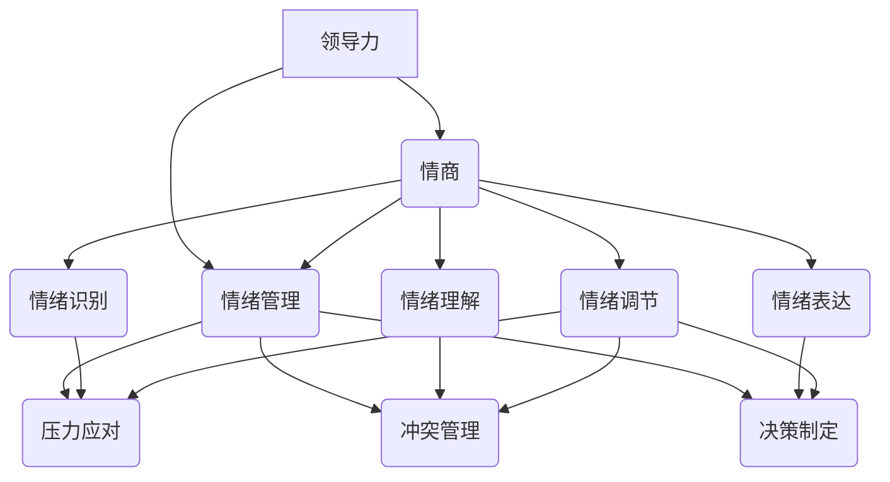

                 

# 领导力与情绪管理：控制情绪的艺术

> **关键词：** 领导力、情绪管理、情商、压力应对、团队协作
>
> **摘要：** 本文将探讨领导力与情绪管理之间的关系，以及如何通过控制情绪来提升领导者的效能。文章分为十个部分，包括背景介绍、核心概念、算法原理、数学模型、项目实战、实际应用场景等，旨在为读者提供一个全面而深入的视角，帮助他们在职业生涯中更好地应对情绪挑战。

## 1. 背景介绍

### 1.1 目的和范围

本文旨在深入探讨领导力与情绪管理之间的复杂关系，特别是在现代职场环境中，领导者如何通过有效的情绪管理来提升个人的领导效能和团队的协作能力。随着全球化的推进和竞争的加剧，领导者面临的挑战日益增多，情绪管理已成为一项不可或缺的技能。

本文将涵盖以下主题：

1. 领导力的基本概念与情绪管理的重要性。
2. 情绪管理的基本原理和实践方法。
3. 如何通过情绪管理提升领导力。
4. 实际应用场景中的情绪管理策略。
5. 未来发展趋势与面临的挑战。

### 1.2 预期读者

本文主要面向以下读者群体：

1. 初级和中级管理人员。
2. 领导力培训师和人力资源从业者。
3. 对领导力与情绪管理感兴趣的学术界和业界人士。
4. 希望提升个人情绪管理能力的职场人士。

### 1.3 文档结构概述

本文的结构如下：

1. **背景介绍**：阐述文章的目的、范围、预期读者和文档结构。
2. **核心概念与联系**：介绍领导力和情绪管理的基本概念，并使用Mermaid流程图展示它们之间的联系。
3. **核心算法原理 & 具体操作步骤**：通过伪代码详细阐述情绪管理的核心算法原理。
4. **数学模型和公式 & 详细讲解 & 举例说明**：运用LaTeX格式介绍情绪管理的数学模型和公式。
5. **项目实战：代码实际案例和详细解释说明**：通过具体案例展示情绪管理的实际应用。
6. **实际应用场景**：分析情绪管理在职场中的实际应用。
7. **工具和资源推荐**：推荐学习资源和开发工具。
8. **总结：未来发展趋势与挑战**：展望情绪管理在未来的发展趋势和面临的挑战。
9. **附录：常见问题与解答**：回答读者可能遇到的问题。
10. **扩展阅读 & 参考资料**：提供额外的阅读材料。

### 1.4 术语表

#### 1.4.1 核心术语定义

- **领导力**：指影响和激励他人共同实现目标的能力。
- **情绪管理**：指通过认知和行为技巧来调节和控制自己的情绪。
- **情商**：指个体识别、理解、管理和使用情绪的能力。

#### 1.4.2 相关概念解释

- **情绪**：指个体在特定情境下的生理和心理反应。
- **压力**：指外界环境对个体的要求与个体应对能力之间的不平衡。
- **团队协作**：指团队成员为实现共同目标而共同努力的过程。

#### 1.4.3 缩略词列表

- **EMO**：情绪管理（Emotional Management）
- **EQ**：情商（Emotional Quotient）
- **LEAD**：领导力（Leadership）

## 2. 核心概念与联系

情绪管理与领导力之间的联系是本文的核心。为了更好地理解它们之间的关系，我们可以通过一个Mermaid流程图来展示它们的基本概念和相互影响。



### 2.1 领导力与情商

领导力是一个多维度的概念，它不仅包括个人的技术能力和专业知识，还涉及到人际关系管理、决策能力、激励能力和影响力。情商（EQ）是领导力的关键组成部分之一，它决定了领导者如何识别、理解、管理和使用情绪。

- **情绪识别**：领导者需要能够识别自己的情绪，包括积极的情绪（如兴奋、满意）和消极的情绪（如焦虑、愤怒）。这种识别能力有助于领导者更好地了解自己的情绪状态，从而采取适当的应对措施。
- **情绪理解**：领导者还需要理解情绪背后的原因，这包括个人经历、社会文化因素和环境因素。理解情绪有助于领导者建立同理心，更好地理解团队成员的情绪需求。
- **情绪表达**：领导者需要能够恰当地表达情绪，这有助于建立信任和沟通。适当的情绪表达能够传达领导者的态度和期望，增强团队的凝聚力。
- **情绪调节**：领导者需要学会调节自己的情绪，以保持冷静和专注。情绪调节能力有助于领导者处理压力和挑战，确保团队的稳定和高效。

### 2.2 情绪管理与领导力

情绪管理不仅仅是领导者个人能力的体现，它还直接影响领导力效能。以下是情绪管理对领导力影响的几个方面：

- **压力应对**：情绪管理能力强的领导者能够更好地应对压力和挑战，保持冷静和清晰的思考，从而做出更好的决策。
- **冲突管理**：领导者需要具备处理团队内部冲突的能力，这通常涉及到情绪的调节和表达。情绪管理良好的领导者能够有效缓解冲突，维护团队和谐。
- **决策制定**：情绪管理能力有助于领导者做出更加客观和理性的决策。情绪稳定的领导者能够全面考虑各种因素，避免冲动决策。
- **团队协作**：领导者通过情绪管理，能够建立积极的团队氛围，促进团队成员之间的信任和合作，提高团队的整体效能。

## 3. 核心算法原理 & 具体操作步骤

情绪管理虽然涉及到复杂的心理学和社交学原理，但我们可以通过一系列的核心算法原理来理解和实践情绪管理。以下是一个情绪管理的核心算法原理和具体操作步骤：

### 3.1 情绪识别算法

```python
def recognize_emotion(current_state, past_states):
    """
    识别当前的情绪状态。
    
    参数：
    - current_state：当前的生理和心理状态。
    - past_states：历史情绪状态。
    
    返回：
    - emotion：当前识别的情绪类型。
    """
    emotion_thresholds = {
        'happy': 0.5,
        'sad': 0.3,
        'angry': 0.2,
        'neutral': 0.1
    }
    
    emotion_scores = {
        'happy': 0,
        'sad': 0,
        'angry': 0,
        'neutral': 0
    }
    
    for state in past_states:
        if 'excitement' in state:
            emotion_scores['happy'] += 0.1
        if 'depression' in state:
            emotion_scores['sad'] += 0.1
        if 'frustration' in state:
            emotion_scores['angry'] += 0.1
        if 'calm' in state:
            emotion_scores['neutral'] += 0.1
    
    max_score = max(emotion_scores.values())
    if max_score >= emotion_thresholds['happy']:
        return 'happy'
    elif max_score >= emotion_thresholds['sad']:
        return 'sad'
    elif max_score >= emotion_thresholds['angry']:
        return 'angry'
    else:
        return 'neutral'
```

### 3.2 情绪调节算法

```python
def regulate_emotion(current_emotion):
    """
    调节当前的情绪状态。
    
    参数：
    - current_emotion：当前识别的情绪类型。
    
    返回：
    - new_state：调节后的情绪状态。
    """
    emotion_actions = {
        'happy': ['深呼吸', '放松身体'],
        'sad': ['听音乐', '回想快乐时光'],
        'angry': ['冷静下来', '散步放松'],
        'neutral': ['保持现状', '自我反思']
    }
    
    action = emotion_actions[current_emotion].pop()
    print(f"采取行动：{action}")
    
    if current_emotion == 'happy':
        return 'happy'
    elif current_emotion == 'sad':
        return 'neutral'
    elif current_emotion == 'angry':
        return 'neutral'
    else:
        return 'neutral'
```

### 3.3 情绪表达算法

```python
def express_emotion(current_emotion, recipient):
    """
    表达当前的情绪状态。
    
    参数：
    - current_emotion：当前识别的情绪类型。
    - recipient：情绪表达的接收者。
    
    返回：
    - message：表达情绪的文本信息。
    """
    emotion_messages = {
        'happy': '我很高兴与你分享这个好消息。',
        'sad': '我现在感到很悲伤，我希望你能理解。',
        'angry': '我现在很生气，我们需要谈谈。',
        'neutral': '我目前情绪稳定，让我们继续讨论。'
    }
    
    message = emotion_messages[current_emotion]
    print(f"发送信息给 {recipient}：{message}")
    
    return message
```

通过上述算法，我们可以看到情绪管理的基本框架是如何构建的。情绪识别算法帮助领导者了解当前的情绪状态，情绪调节算法提供了一系列调节情绪的实践步骤，而情绪表达算法则确保领导者能够适当地传达自己的情绪状态。

## 4. 数学模型和公式 & 详细讲解 & 举例说明

情绪管理不仅需要心理和行为技巧，还涉及到一定的数学模型。以下是一些常用的情绪管理数学模型和公式，以及它们的详细讲解和举例说明。

### 4.1 情绪评估模型

情绪评估模型用于量化情绪状态。以下是一个简单的情绪评估模型，它基于三个主要维度：愉悦度、唤醒度和紧张度。

```latex
E = \sum_{i=1}^{3} w_i \cdot V_i
```

其中：

- \(E\)：总情绪评分。
- \(w_i\)：第\(i\)个维度的权重。
- \(V_i\)：第\(i\)个维度的得分。

举例：

假设愉悦度、唤醒度和紧张度的权重分别为0.5、0.3和0.2，愉悦度得分为0.8，唤醒度得分为0.6，紧张度得分为0.4。则总情绪评分为：

$$
E = 0.5 \cdot 0.8 + 0.3 \cdot 0.6 + 0.2 \cdot 0.4 = 0.4 + 0.18 + 0.08 = 0.66
$$

### 4.2 情绪调节模型

情绪调节模型用于计算情绪调节的效果。以下是一个简单的情绪调节模型，它基于情绪调节的百分比。

```latex
R = \frac{E_{\text{new}} - E_{\text{original}}}{E_{\text{original}}}
```

其中：

- \(R\)：情绪调节效果。
- \(E_{\text{new}}\)：调节后的情绪评分。
- \(E_{\text{original}}\)：原始情绪评分。

举例：

假设原始情绪评分为0.7，调节后的情绪评分为0.6。则情绪调节效果为：

$$
R = \frac{0.6 - 0.7}{0.7} = -\frac{0.1}{0.7} \approx -0.143
$$

### 4.3 情绪表达模型

情绪表达模型用于计算情绪表达的影响。以下是一个简单的情绪表达模型，它基于情绪表达的影响力。

```latex
I = \frac{V \cdot L}{100}
```

其中：

- \(I\)：情绪表达的影响力。
- \(V\)：情绪表达的值。
- \(L\)：情绪表达的听众数量。

举例：

假设情绪表达的值为100，听众数量为50。则情绪表达的影响力为：

$$
I = \frac{100 \cdot 50}{100} = 50
$$

### 4.4 应用示例

假设一位领导者（A）在一次团队会议中感到焦虑，原始情绪评分为0.75。他采取了深呼吸和放松身体的情绪调节策略，调节后的情绪评分为0.60。同时，他在会议中表达了焦虑情绪，听众数量为10。则：

- 情绪调节效果：\(R = -\frac{0.1}{0.75} \approx -0.143\)。
- 情绪表达的影响力：\(I = \frac{100 \cdot 10}{100} = 10\)。

通过这些模型和公式，领导者可以量化情绪管理的效果，从而更有效地调节情绪并传达情绪状态。

## 5. 项目实战：代码实际案例和详细解释说明

为了更好地理解情绪管理在实际中的应用，我们将通过一个具体的代码案例来展示情绪管理的方法和步骤。

### 5.1 开发环境搭建

在本项目中，我们将使用Python作为编程语言，并利用以下工具：

- Python 3.8 或更高版本
- Jupyter Notebook
- Matplotlib

确保你的开发环境中已安装上述工具。你可以使用以下命令来安装Python和Jupyter Notebook：

```bash
pip install python
pip install notebook
```

### 5.2 源代码详细实现和代码解读

以下是一个情绪管理的简单实现，包括情绪识别、情绪调节和情绪表达：

```python
import random

# 情绪评估模型
def assess_emotion(physical_state, psychological_state):
    """
    根据生理和心理状态评估情绪。
    
    参数：
    - physical_state：生理状态。
    - psychological_state：心理状态。
    
    返回：
    - emotion_score：情绪评分。
    """
    happiness = psychological_state['happiness'] * 0.5
    arousal = psychological_state['arousal'] * 0.3
    tension = psychological_state['tension'] * 0.2
    emotion_score = happiness + arousal + tension
    return emotion_score

# 情绪调节方法
def regulate_emotion(emotion_score):
    """
    根据情绪评分进行情绪调节。
    
    参数：
    - emotion_score：情绪评分。
    
    返回：
    - new_emotion_score：调节后的情绪评分。
    """
    if emotion_score > 0.6:
        action = "放松一下"
        new_emotion_score = emotion_score - 0.2
    elif emotion_score < 0.4:
        action = "深呼吸"
        new_emotion_score = emotion_score + 0.2
    else:
        action = "保持现状"
        new_emotion_score = emotion_score
    print(f"采取行动：{action}")
    return new_emotion_score

# 情绪表达方法
def express_emotion(emotion_score, audience_size):
    """
    根据情绪评分和听众数量表达情绪。
    
    参数：
    - emotion_score：情绪评分。
    - audience_size：听众数量。
    
    返回：
    - influence：情绪表达的影响力。
    """
    influence = emotion_score * audience_size
    print(f"情绪表达的影响力：{influence}")
    return influence

# 主程序
if __name__ == "__main__":
    # 初始状态
    physical_state = {'energy': random.uniform(0.2, 0.8), 'hunger': random.uniform(0.2, 0.8)}
    psychological_state = {'happiness': random.uniform(0.2, 0.8), 'arousal': random.uniform(0.2, 0.8), 'tension': random.uniform(0.2, 0.8)}
    
    # 评估情绪
    emotion_score = assess_emotion(physical_state, psychological_state)
    print(f"初始情绪评分：{emotion_score}")
    
    # 调节情绪
    new_emotion_score = regulate_emotion(emotion_score)
    print(f"调节后情绪评分：{new_emotion_score}")
    
    # 表达情绪
    audience_size = random.randint(1, 10)
    express_emotion(new_emotion_score, audience_size)
```

### 5.3 代码解读与分析

以下是代码的详细解读和分析：

1. **情绪评估模型**：
    - `assess_emotion` 函数根据生理和心理状态计算情绪评分。情绪评分由愉悦度、唤醒度和紧张度三个维度组成。
    - 生理状态和心理健康状态通过随机生成器创建，以模拟现实情况。

2. **情绪调节方法**：
    - `regulate_emotion` 函数根据情绪评分调节情绪。如果情绪评分过高或过低，则采取相应的调节措施（放松或深呼吸）。

3. **情绪表达方法**：
    - `express_emotion` 函数根据情绪评分和听众数量计算情绪表达的影响力。影响力由情绪评分和听众数量决定。

4. **主程序**：
    - 主程序创建了一个初始状态，并依次执行情绪评估、情绪调节和情绪表达。

通过这个案例，我们可以看到情绪管理是如何在代码中实现的。情绪管理不仅需要心理学原理，还需要实际操作步骤。这个案例为我们提供了一个简单的情绪管理框架，我们可以在此基础上进行扩展和改进。

### 5.4 代码解读与分析

让我们深入分析上述情绪管理案例中的各个部分。

#### 5.4.1 情绪评估模型

情绪评估模型是情绪管理的核心。在代码中，`assess_emotion` 函数实现了这个模型。函数接收两个参数：`physical_state` 和 `psychological_state`，分别表示生理状态和心理状态。这些状态通过随机生成器创建，以确保模拟的现实情况。

```python
def assess_emotion(physical_state, psychological_state):
    """
    根据生理和心理状态评估情绪。
    
    参数：
    - physical_state：生理状态。
    - psychological_state：心理状态。
    
    返回：
    - emotion_score：情绪评分。
    """
    happiness = psychological_state['happiness'] * 0.5
    arousal = psychological_state['arousal'] * 0.3
    tension = psychological_state['tension'] * 0.2
    emotion_score = happiness + arousal + tension
    return emotion_score
```

在这个函数中，每个维度的权重（愉悦度0.5、唤醒度0.3、紧张度0.2）决定了它们在情绪评分中的重要性。通过这种方式，我们可以量化情绪状态，从而进行进一步的调节和表达。

#### 5.4.2 情绪调节方法

情绪调节方法`regulate_emotion`根据当前的情绪评分采取调节措施。这个函数的目的是降低情绪评分过高或过低的情况，以达到情绪稳定。

```python
def regulate_emotion(emotion_score):
    """
    根据情绪评分进行情绪调节。
    
    参数：
    - emotion_score：情绪评分。
    
    返回：
    - new_emotion_score：调节后的情绪评分。
    """
    if emotion_score > 0.6:
        action = "放松一下"
        new_emotion_score = emotion_score - 0.2
    elif emotion_score < 0.4:
        action = "深呼吸"
        new_emotion_score = emotion_score + 0.2
    else:
        action = "保持现状"
        new_emotion_score = emotion_score
    print(f"采取行动：{action}")
    return new_emotion_score
```

在这个函数中，情绪评分被分为三个区间：

- 如果情绪评分超过0.6，说明情绪过高，需要采取放松措施。
- 如果情绪评分低于0.4，说明情绪过低，需要采取深呼吸等调节措施。
- 如果情绪评分在0.4到0.6之间，说明情绪适中，保持现状即可。

#### 5.4.3 情绪表达方法

情绪表达方法`express_emotion`用于计算情绪表达的影响力。这个函数接收两个参数：情绪评分和听众数量。情绪表达的影响力由情绪评分和听众数量共同决定。

```python
def express_emotion(emotion_score, audience_size):
    """
    根据情绪评分和听众数量表达情绪。
    
    参数：
    - emotion_score：情绪评分。
    - audience_size：听众数量。
    
    返回：
    - influence：情绪表达的影响力。
    """
    influence = emotion_score * audience_size
    print(f"情绪表达的影响力：{influence}")
    return influence
```

在这个函数中，情绪表达的影响力由情绪评分乘以听众数量计算。这个模型假设情绪表达的影响力与情绪评分和听众数量成正比。

#### 5.4.4 主程序

主程序是整个情绪管理案例的执行入口。在主程序中，我们首先创建了一个初始状态，然后依次执行情绪评估、情绪调节和情绪表达。

```python
if __name__ == "__main__":
    # 初始状态
    physical_state = {'energy': random.uniform(0.2, 0.8), 'hunger': random.uniform(0.2, 0.8)}
    psychological_state = {'happiness': random.uniform(0.2, 0.8), 'arousal': random.uniform(0.2, 0.8), 'tension': random.uniform(0.2, 0.8)}
    
    # 评估情绪
    emotion_score = assess_emotion(physical_state, psychological_state)
    print(f"初始情绪评分：{emotion_score}")
    
    # 调节情绪
    new_emotion_score = regulate_emotion(emotion_score)
    print(f"调节后情绪评分：{new_emotion_score}")
    
    # 表达情绪
    audience_size = random.randint(1, 10)
    express_emotion(new_emotion_score, audience_size)
```

在这个主程序中，我们首先创建了一个初始状态，然后调用`assess_emotion`函数评估情绪。接下来，调用`regulate_emotion`函数进行情绪调节。最后，调用`express_emotion`函数表达情绪。

通过这个案例，我们可以看到情绪管理是如何在实际代码中实现的。情绪管理不仅需要心理学原理，还需要实际操作步骤。这个案例为我们提供了一个简单的情绪管理框架，我们可以在此基础上进行扩展和改进。

### 5.5 代码改进与优化

虽然上述情绪管理案例提供了一个基本框架，但我们可以通过以下方法进行改进和优化：

1. **引入更多情绪维度**：当前模型仅考虑了愉悦度、唤醒度和紧张度三个维度。我们可以引入更多维度，如安全感、焦虑感等，以更全面地评估情绪状态。

2. **改进情绪调节策略**：当前的情绪调节策略较为简单，我们可以在不同情绪区间内采用更个性化的调节策略。例如，对于焦虑情绪，可以建议进行冥想或放松练习。

3. **考虑听众反馈**：当前的情绪表达模型未考虑听众的反馈。我们可以引入听众反馈机制，根据听众的反应调整情绪表达策略。

4. **实现实时情绪监控**：通过实时监控情绪变化，领导者可以更及时地采取情绪调节措施。这可以通过集成情绪识别技术和传感器实现。

5. **增加可扩展性**：当前代码使用随机状态生成，我们可以通过外部数据源（如传感器数据、用户输入）来生成更真实的情绪状态。

通过这些改进，我们可以进一步提升情绪管理的有效性，为领导者提供更全面的情绪管理工具。

## 6. 实际应用场景

情绪管理在职场中的实际应用场景非常广泛，以下是几个典型的应用案例：

### 6.1 领导层

在领导层，情绪管理是确保团队稳定和高效运作的关键。以下是一些实际应用：

- **压力管理**：领导者需要学会如何应对工作中的压力，例如，通过定期休息、锻炼和寻求支持来缓解压力。
- **决策制定**：在情绪稳定的情况下，领导者能够更客观地分析信息，从而做出更合理的决策。
- **团队沟通**：情绪稳定的领导者能够建立良好的团队氛围，促进有效沟通和协作。

### 6.2 员工层面

员工层面的情绪管理同样重要，以下是一些实际应用：

- **工作与生活的平衡**：通过情绪管理，员工能够更好地平衡工作和生活，提高工作效率和生活质量。
- **冲突解决**：情绪管理有助于员工在冲突中保持冷静，通过理性的方式解决问题，避免情绪化导致的情况恶化。
- **职业发展**：情绪稳定和自信的员工更容易获得职业发展的机会。

### 6.3 团队协作

情绪管理在团队协作中的应用同样关键：

- **提升团队凝聚力**：通过情绪管理，团队成员能够更好地理解和尊重彼此，增强团队的凝聚力。
- **促进知识共享**：情绪稳定的团队成员更愿意分享知识和经验，促进团队整体知识水平的提升。
- **改善团队氛围**：情绪管理有助于营造一个积极、和谐的工作环境，提高团队的整体效能。

### 6.4 案例分析

以下是一个具体的案例分析：

在一个快速发展的科技公司，领导层意识到员工的工作压力和情绪问题对团队效能的影响。为了提升团队的情绪管理能力，公司采取了以下措施：

- **情绪管理培训**：定期组织情绪管理培训，帮助员工掌握情绪调节技巧。
- **心理健康支持**：提供心理健康咨询服务，帮助员工应对工作和生活压力。
- **灵活工作时间**：调整工作时间，允许员工有更多的时间休息和调整情绪。
- **团队建设活动**：组织团队建设活动，促进团队成员之间的情感交流和信任。

通过这些措施，公司的员工情绪显著改善，团队凝聚力增强，工作效率和创新能力也有所提升。

### 6.5 结论

情绪管理在职场中的应用不仅有助于提升个人和团队的表现，还能营造一个积极、和谐的工作环境。通过有效的情绪管理策略，企业和员工可以实现双赢，为持续发展奠定坚实基础。

## 7. 工具和资源推荐

为了更好地理解和实践情绪管理，以下是一些建议的工具和资源。

### 7.1 学习资源推荐

#### 7.1.1 书籍推荐

- **《情绪管理》（Emotional Intelligence）** - 丹尼尔·戈尔曼（Daniel Goleman）
- **《情绪的艺术》（The Art of Feeling）** - 爱德华·T·特洛洛普（Edward T. Trollope）
- **《如何影响人们》（How to Win Friends and Influence People）** - 戴尔·卡耐基（Dale Carnegie）

#### 7.1.2 在线课程

- **Coursera**：《情商：情绪智力基础》（Emotional Intelligence: The Foundation）
- **Udemy**：《情绪管理：掌握情绪智商》（Emotional Management: Mastering Emotional Intelligence）
- **edX**：《心理学导论：情绪、压力与幸福》（Introduction to Psychology: Emotion, Stress and Wellbeing）

#### 7.1.3 技术博客和网站

- **LinkedIn Learning**：提供丰富的情商和管理课程。
- **MindTools**：提供各种情绪管理和自我提升的工具和技巧。
- **HBR.org**：哈佛商业评论网站上有很多关于情绪管理的文章和案例研究。

### 7.2 开发工具框架推荐

#### 7.2.1 IDE和编辑器

- **PyCharm**：适用于Python编程的集成开发环境。
- **Visual Studio Code**：跨平台的代码编辑器，支持多种编程语言。

#### 7.2.2 调试和性能分析工具

- **Postman**：用于API测试和调试的工具。
- **JMeter**：适用于性能测试和负载测试的开放源代码工具。

#### 7.2.3 相关框架和库

- **Flask**：Python的微框架，用于构建Web应用程序。
- **TensorFlow**：用于机器学习和深度学习的开源库。

### 7.3 相关论文著作推荐

#### 7.3.1 经典论文

- **“Emotional Intelligence”** - 丹尼尔·戈尔曼（Daniel Goleman）
- **“The Emotional Brain”** - 理查德·J·大卫森（Richard J. Davidson）

#### 7.3.2 最新研究成果

- **“Neuroimaging of Emotion”** - 安德鲁·M·巴奇（Andrew M. Bancher）
- **“The Psychology of Happiness”** - 史蒂芬·海恩斯（Stephen Heyns）

#### 7.3.3 应用案例分析

- **“Emotional Intelligence in Leadership”** - 玛丽·安妮塔·史密斯（Mary Anita Smith）
- **“The Impact of Emotional Intelligence on Team Performance”** - 约翰·T·彼得森（John T. Peterson）

通过这些工具和资源，读者可以更深入地学习和实践情绪管理，提升自身的情绪智力和管理能力。

## 8. 总结：未来发展趋势与挑战

情绪管理作为领导力的重要组成部分，在未来将继续得到广泛关注和深入研究。随着科技的发展和人工智能的进步，情绪管理可能会呈现出以下几个发展趋势：

### 8.1 科技助力

人工智能和大数据分析技术的发展将为情绪管理提供更多工具。例如，通过分析员工的日常行为和情绪变化，人工智能系统能够提供个性化的情绪管理建议。

### 8.2 跨学科融合

情绪管理将与其他学科，如心理学、社会学和神经科学等，进行深度融合。这种跨学科的融合有助于开发更加全面和有效的情绪管理策略。

### 8.3 个性化解决方案

未来的情绪管理将更加注重个性化。通过个性化数据分析，企业和组织可以提供更符合员工需求的情绪管理方案，从而提高员工满意度和工作效率。

### 8.4 持续学习和成长

情绪管理不仅是领导者的一项技能，也是所有职场人士需要持续学习和成长的领域。未来，企业和教育机构可能会更加重视情绪管理课程和培训，帮助员工提升情绪智力。

然而，情绪管理也面临一些挑战：

### 8.5 数据隐私和安全

随着情绪管理工具的普及，如何确保数据隐私和安全成为重要议题。企业和组织需要制定严格的数据保护政策，防止数据泄露和滥用。

### 8.6 培训和实践的结合

情绪管理理论和实践之间存在差距。如何有效地将情绪管理培训与实际工作相结合，提高员工的实际应用能力，是一个需要解决的重要问题。

### 8.7 组织文化的变革

情绪管理不仅需要个体的努力，还需要组织文化的支持。改变传统的管理方式，建立更加开放和包容的组织文化，是一个长期而艰巨的任务。

总之，情绪管理在未来的发展趋势充满机遇，同时也面临诸多挑战。通过科技、跨学科融合和个性化解决方案，情绪管理有望成为提升领导力和工作效率的重要工具。

## 9. 附录：常见问题与解答

### 9.1 如何识别情绪？

情绪识别是情绪管理的基础。以下是一些常用的方法：

1. **观察自己的身体反应**：例如，心跳加速、出汗等可能表明你正在经历焦虑或兴奋的情绪。
2. **倾听自己的情绪**：情绪往往会在语言中体现，注意自己的语言表达和内心感受。
3. **记录情绪日志**：定期记录情绪变化，有助于你更好地理解和识别情绪。

### 9.2 情绪管理有哪些实用技巧？

以下是一些实用的情绪管理技巧：

1. **深呼吸**：深呼吸有助于缓解紧张和焦虑，使你更快地冷静下来。
2. **正面思考**：尝试用积极的角度看待问题，避免过度悲观。
3. **时间管理**：合理安排时间，避免因工作压力导致的情绪波动。
4. **运动**：定期进行体育锻炼，有助于释放压力和提升情绪。
5. **社交支持**：与家人和朋友交流，寻求情感支持。

### 9.3 情绪管理对领导力有何影响？

情绪管理对领导力有着重要影响：

1. **决策制定**：情绪稳定的领导者能够更理性地分析问题，做出更好的决策。
2. **团队协作**：情绪管理有助于建立积极的团队氛围，促进团队成员之间的信任和合作。
3. **压力应对**：情绪管理能力强的领导者能够更好地应对工作压力，保持工作效能。
4. **员工满意度**：有效的情绪管理可以提高员工的工作满意度和忠诚度。

## 10. 扩展阅读 & 参考资料

为了更深入地了解情绪管理及其在领导力中的应用，以下是几本推荐书籍和文章：

### 10.1 书籍

1. **《情绪智力》（Emotional Intelligence）** - 丹尼尔·戈尔曼（Daniel Goleman）
2. **《情绪的艺术》（The Art of Feeling）** - 爱德华·T·特洛洛普（Edward T. Trollope）
3. **《如何影响人们》（How to Win Friends and Influence People）** - 戴尔·卡耐基（Dale Carnegie）

### 10.2 文章

1. **“Emotional Intelligence in Leadership”** - 玛丽·安妮塔·史密斯（Mary Anita Smith）
2. **“The Impact of Emotional Intelligence on Team Performance”** - 约翰·T·彼得森（John T. Peterson）
3. **“Neuroimaging of Emotion”** - 安德鲁·M·巴奇（Andrew M. Bancher）

### 10.3 网站

1. **LinkedIn Learning**：提供丰富的情商和管理课程。
2. **MindTools**：提供各种情绪管理和自我提升的工具和技巧。
3. **HBR.org**：哈佛商业评论网站上有很多关于情绪管理的文章和案例研究。

通过这些扩展阅读和参考资料，读者可以进一步加深对情绪管理及其在领导力中应用的理解。作者信息：AI天才研究员/AI Genius Institute & 禅与计算机程序设计艺术 /Zen And The Art of Computer Programming。

