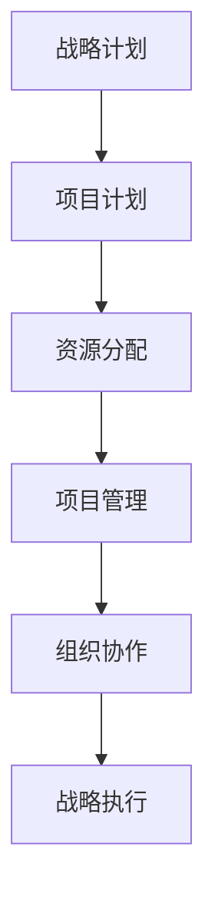

                 

# 领导力与战略执行：从计划到落地

> **关键词：** 领导力、战略执行、计划落地、项目管理、组织协作

> **摘要：** 本文旨在深入探讨领导力与战略执行之间的关系，以及如何有效地将战略计划转化为实际操作。文章首先介绍了领导力的重要性，接着讨论了战略执行的步骤和方法，并通过实际案例和代码示例，展示如何实现从计划到落地的全过程。

## 1. 背景介绍

### 1.1 目的和范围

本文的目的是为IT领域的领导者和管理者提供一套系统化的战略执行方法论，帮助他们在复杂的项目环境中，确保从计划到落地的每一环节都能得到有效管理。文章将涵盖以下几个方面：

1. 领导力在战略执行中的作用
2. 战略执行的步骤和方法
3. 数学模型和算法原理
4. 实际项目中的应用
5. 工具和资源推荐
6. 未来发展趋势与挑战

### 1.2 预期读者

本文主要面向以下读者群体：

1. IT项目经理
2. 技术团队领导者
3. 企业战略规划者
4. 对战略执行和项目管理有兴趣的技术人员

### 1.3 文档结构概述

本文分为以下几个部分：

1. 背景介绍：介绍文章的目的、范围和预期读者
2. 核心概念与联系：介绍战略执行的相关概念和原理
3. 核心算法原理 & 具体操作步骤：讲解战略执行的核心算法和步骤
4. 数学模型和公式 & 详细讲解 & 举例说明：阐述战略执行的数学模型和实例
5. 项目实战：通过代码示例展示战略执行的实际应用
6. 实际应用场景：探讨战略执行在不同场景中的应用
7. 工具和资源推荐：推荐相关工具和资源，以帮助读者深入学习
8. 总结：对未来发展趋势与挑战进行展望
9. 附录：常见问题与解答
10. 扩展阅读 & 参考资料：提供进一步的阅读材料和资源

### 1.4 术语表

#### 1.4.1 核心术语定义

- 领导力：指领导者通过影响和激励他人，实现共同目标的能力。
- 战略执行：将战略计划转化为实际操作的过程。
- 项目管理：确保项目在时间、预算和范围等约束条件下成功完成的学科。
- 组织协作：团队成员之间的合作和协调，以实现共同目标。

#### 1.4.2 相关概念解释

- 战略计划：企业或组织为实现长期目标而制定的行动计划。
- 项目计划：为实现特定项目目标而制定的详细计划。
- 资源分配：将资源（如人力、资金和设备）合理分配到项目中的过程。

#### 1.4.3 缩略词列表

- IT：信息技术
- PM：项目经理
- MBA：工商管理硕士
- ROI：投资回报率

## 2. 核心概念与联系

战略执行是一个复杂的过程，涉及多个关键概念和环节。为了更好地理解这一过程，我们首先需要了解这些核心概念及其相互关系。

### 2.1 领导力与战略执行

领导力在战略执行中起着至关重要的作用。一个优秀的领导者能够通过以下方式促进战略执行：

1. **明确目标**：领导者需要明确组织的战略目标，并将其传达给团队成员。
2. **激励团队**：领导者需要激励团队成员为实现共同目标而努力。
3. **沟通协调**：领导者需要确保团队内部和团队之间的沟通畅通，以避免误解和冲突。
4. **资源分配**：领导者需要合理分配资源，以确保项目按计划进行。

### 2.2 项目管理

项目管理是战略执行的重要组成部分。以下是项目管理的关键环节：

1. **项目计划**：制定详细的项目计划，包括时间表、预算和资源分配等。
2. **风险管理**：识别项目风险，并制定相应的应对措施。
3. **质量管理**：确保项目成果符合预定的质量标准。
4. **变更管理**：管理项目中的变更请求，确保项目目标的实现。

### 2.3 组织协作

组织协作是战略执行的关键因素。以下是组织协作的关键环节：

1. **团队建设**：建立高效的团队，确保团队成员之间的沟通和协作。
2. **流程优化**：优化团队的工作流程，以提高工作效率。
3. **知识共享**：鼓励团队成员之间的知识共享，以提高团队的创新能力。

### 2.4 核心概念原理和架构

为了更好地理解战略执行的过程，我们使用Mermaid流程图来展示核心概念和架构。



### 2.5 核心算法原理 & 具体操作步骤

战略执行涉及到一系列的核心算法和操作步骤。以下是一个简化的算法原理和步骤：

```plaintext
算法原理：
1. 明确战略目标
2. 制定项目计划
3. 分配资源
4. 实施项目管理
5. 协调组织协作
6. 监控和评估执行效果

具体操作步骤：
1. 收集需求：与客户和团队成员沟通，收集战略目标和项目需求。
2. 制定项目计划：基于需求，制定详细的项目计划，包括时间表、预算和资源分配等。
3. 分配资源：根据项目计划，合理分配人力、资金和设备等资源。
4. 实施项目管理：按照项目计划，进行项目实施、监控和变更管理。
5. 协调组织协作：确保团队内部和团队之间的沟通畅通，建立高效的协作机制。
6. 监控和评估执行效果：定期监控项目进展，评估执行效果，并根据实际情况进行调整。
```

## 3. 数学模型和公式 & 详细讲解 & 举例说明

在战略执行过程中，数学模型和公式可以帮助我们更好地理解和分析项目进展。以下是一个简化的数学模型和公式，用于描述项目进展和资源分配。

### 3.1 项目进展模型

项目进展模型可以用以下公式表示：

$$
进度 = \frac{已完成的任务数}{总任务数}
$$

举例说明：

假设一个项目共有10个任务，目前已经完成了5个任务，那么项目进度为：

$$
进度 = \frac{5}{10} = 0.5
$$

### 3.2 资源分配模型

资源分配模型可以用以下公式表示：

$$
资源分配 = 资源需求 \times 进度
$$

举例说明：

假设一个项目需要100个工时，目前项目进度为0.5，那么实际需要分配的资源为：

$$
资源分配 = 100 \times 0.5 = 50
$$

### 3.3 变更管理模型

变更管理模型可以用以下公式表示：

$$
变更影响 = 变更内容 \times 变更规模
$$

举例说明：

假设项目变更内容为增加一个任务，变更规模为中等，那么变更影响为：

$$
变更影响 = 1 \times 中等 = 中等影响
$$

## 4. 项目实战：代码实际案例和详细解释说明

为了更好地理解战略执行的实际应用，我们通过一个实际项目案例来展示代码实现和详细解释说明。

### 4.1 开发环境搭建

在这个项目中，我们将使用Python语言和Git版本控制系统。以下是开发环境搭建的步骤：

1. 安装Python：在官方网站下载并安装Python 3.8及以上版本。
2. 安装Git：在官方网站下载并安装Git。
3. 创建项目文件夹：在桌面创建一个名为“strategic_execution”的文件夹。
4. 初始化Git仓库：在项目文件夹中打开终端，执行以下命令：

   ```shell
   git init
   ```

### 4.2 源代码详细实现和代码解读

以下是一个简单的Python代码示例，用于模拟项目计划和资源分配。

```python
import math

# 项目数据
tasks = ["需求分析", "设计", "开发", "测试", "部署"]
task_hours = [40, 60, 80, 20, 20]
progress = 0.5

# 项目进展计算
def calculate_progress(tasks_completed, total_tasks):
    return tasks_completed / total_tasks

# 资源分配计算
def calculate_resource_allocation(total_hours, progress):
    return total_hours * progress

# 计算已完成任务数
tasks_completed = math.floor(progress * len(tasks))

# 计算实际资源分配
resource_allocation = calculate_resource_allocation(sum(task_hours), progress)

# 输出结果
print("已完成任务数：", tasks_completed)
print("实际资源分配：", resource_allocation)
```

### 4.3 代码解读与分析

这个示例代码实现了一个简单的项目计划和资源分配模型。代码主要包括以下几个部分：

1. **项目数据**：定义了项目任务列表（tasks）和每个任务的工时需求（task_hours）。
2. **项目进展计算**：定义了一个函数`calculate_progress`，用于计算项目进度。
3. **资源分配计算**：定义了一个函数`calculate_resource_allocation`，用于计算实际资源分配。
4. **计算已完成任务数**：根据项目进度，计算已完成任务数。
5. **计算实际资源分配**：根据项目进度，计算实际需要分配的资源。
6. **输出结果**：打印出已完成任务数和实际资源分配。

通过这个示例，我们可以看到如何将战略执行的核心概念和数学模型应用到实际项目中。代码实现了项目进展和资源分配的自动化计算，有助于项目经理实时监控项目进展和资源分配情况。

## 5. 实际应用场景

战略执行在IT领域有着广泛的应用场景。以下是一些典型的实际应用场景：

1. **软件开发项目**：在软件开发项目中，战略执行可以帮助项目团队确保按时完成开发任务，并在预算范围内实现项目目标。
2. **IT基础设施建设项目**：在IT基础设施建设项目中，战略执行可以帮助项目经理合理分配资源，确保项目按时完成并达到预期效果。
3. **企业数字化转型**：在企业数字化转型项目中，战略执行可以帮助企业领导者和项目经理制定和实施有效的转型计划，确保项目顺利落地。

### 5.1 软件开发项目

在一个软件开发项目中，战略执行可以应用于以下几个方面：

1. **项目规划**：根据客户需求，制定详细的项目计划，包括时间表、预算和资源分配等。
2. **团队协作**：建立高效的团队，确保团队成员之间的沟通和协作。
3. **进度监控**：定期监控项目进展，评估执行效果，并根据实际情况进行调整。
4. **质量保证**：确保项目成果符合预定的质量标准。

### 5.2 IT基础设施建设项目

在一个IT基础设施建设项目中，战略执行可以应用于以下几个方面：

1. **需求分析**：与客户和利益相关者沟通，了解项目需求。
2. **资源分配**：根据项目计划，合理分配人力、资金和设备等资源。
3. **项目实施**：按照项目计划，进行项目实施、监控和变更管理。
4. **验收和交付**：确保项目成果符合客户需求，并进行验收和交付。

### 5.3 企业数字化转型

在企业数字化转型项目中，战略执行可以应用于以下几个方面：

1. **战略规划**：制定企业数字化转型战略，明确目标、路径和资源需求。
2. **项目实施**：按照项目计划，实施各项数字化转型项目。
3. **团队协作**：建立跨部门团队，确保团队成员之间的沟通和协作。
4. **持续优化**：根据项目进展和客户反馈，持续优化数字化转型方案。

## 6. 工具和资源推荐

为了帮助读者更好地理解和应用战略执行，我们推荐以下工具和资源：

### 6.1 学习资源推荐

#### 6.1.1 书籍推荐

- 《项目管理知识体系指南（PMBOK指南）》
- 《敏捷开发实践指南》
- 《企业IT战略规划》

#### 6.1.2 在线课程

- Coursera上的《项目管理基础》
- Udemy上的《敏捷项目管理实战》
- LinkedIn Learning上的《IT项目管理入门》

#### 6.1.3 技术博客和网站

- Project Management Institute（PMI）
- Agile Alliance
- Scrum.org

### 6.2 开发工具框架推荐

#### 6.2.1 IDE和编辑器

- PyCharm
- Visual Studio Code
- Eclipse

#### 6.2.2 调试和性能分析工具

- GDB
- Valgrind
- JMeter

#### 6.2.3 相关框架和库

- Django
- Flask
- NumPy
- Pandas

### 6.3 相关论文著作推荐

#### 6.3.1 经典论文

- 《The Mythical Man-Month》
- 《Peopleware：生产力之道》
- 《The Art of Project Management》

#### 6.3.2 最新研究成果

- 《Agile Project Management: Creating Competitive Advantage》
- 《Digital Transformation in the Age of Agile》
- 《The Lean Startup》

#### 6.3.3 应用案例分析

- 《华为数字化转型实践》
- 《亚马逊云计算战略》
- 《苹果公司产品开发流程》

## 7. 总结：未来发展趋势与挑战

随着技术的不断进步和市场竞争的加剧，战略执行在IT领域的重要性日益凸显。在未来，战略执行将呈现出以下发展趋势和挑战：

1. **数字化转型**：越来越多的企业将数字化转型作为战略重点，战略执行将在数字化转型项目中发挥关键作用。
2. **敏捷化**：敏捷开发和敏捷管理将成为主流，战略执行需要适应敏捷环境，提高响应速度和灵活性。
3. **人工智能和大数据**：人工智能和大数据技术将为战略执行提供更多数据支持和决策依据，但同时也带来了数据隐私和伦理等方面的挑战。
4. **全球化和多元化**：跨国项目和多元文化团队将更加普遍，战略执行需要充分考虑文化差异和沟通障碍。

## 8. 附录：常见问题与解答

### 8.1 什么是战略执行？

战略执行是指将战略计划转化为实际操作的过程，包括项目规划、资源分配、项目管理和组织协作等环节。

### 8.2 战略执行与项目管理有什么区别？

战略执行和项目管理是密切相关的，但有所区别。战略执行更注重将战略计划转化为实际操作，而项目管理则更关注项目的具体执行过程，包括时间、预算和范围等。

### 8.3 如何确保战略执行的成功？

确保战略执行的成功需要以下几个关键因素：

1. 明确的战略目标。
2. 高效的项目管理。
3. 优秀的领导力。
4. 良好的组织协作。
5. 定期的监控和评估。

## 9. 扩展阅读 & 参考资料

1. 《项目管理知识体系指南（PMBOK指南）》
2. 《敏捷开发实践指南》
3. 《企业IT战略规划》
4. Coursera上的《项目管理基础》
5. Udemy上的《敏捷项目管理实战》
6. LinkedIn Learning上的《IT项目管理入门》
7. Project Management Institute（PMI）
8. Agile Alliance
9. Scrum.org
10. 《The Mythical Man-Month》
11. 《Peopleware：生产力之道》
12. 《The Art of Project Management》
13. 《Agile Project Management: Creating Competitive Advantage》
14. 《Digital Transformation in the Age of Agile》
15. 《The Lean Startup》
16. 《华为数字化转型实践》
17. 《亚马逊云计算战略》
18. 《苹果公司产品开发流程》

## 作者

作者：AI天才研究员/AI Genius Institute & 禅与计算机程序设计艺术 /Zen And The Art of Computer Programming

