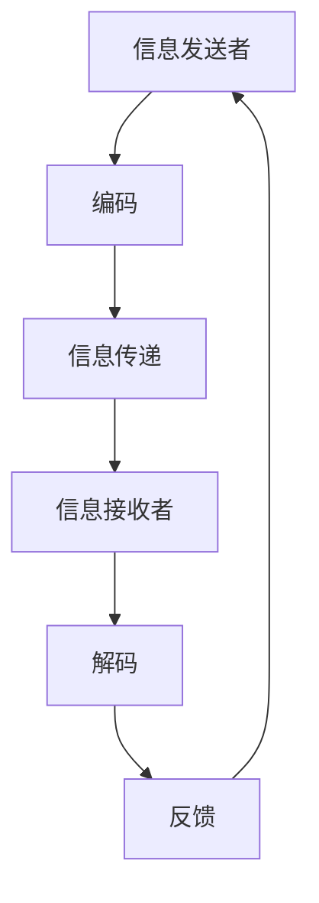

                 

# 领导力与沟通艺术：有效传达信息的技巧

## 关键词：
- 领导力
- 沟通艺术
- 信息传达
- 交流技巧
- 有效管理

> 本文章旨在深入探讨领导力与沟通艺术的核心概念，详细解析有效传达信息的技巧。我们将通过逻辑清晰的分析和实用的案例，帮助读者提升沟通效率，成为更优秀的领导者。

## 摘要

在信息技术飞速发展的今天，有效的沟通已经成为企业成功的关键因素。本文将围绕领导力与沟通艺术这一主题，探讨以下核心内容：

1. **背景介绍**：介绍文章的目的、范围和预期读者，概述文章结构。
2. **核心概念与联系**：通过Mermaid流程图展示沟通艺术的基本原理。
3. **核心算法原理**：解析有效传达信息的具体操作步骤，并使用伪代码详细阐述。
4. **数学模型与公式**：详细讲解相关数学模型和公式，并举例说明。
5. **项目实战**：提供代码实际案例，详细解释和代码解读。
6. **实际应用场景**：探讨有效沟通在项目管理、团队协作等方面的应用。
7. **工具和资源推荐**：推荐相关学习资源、开发工具和框架。
8. **总结与展望**：分析未来发展趋势与挑战，提出解决方案。

通过本文的阅读，读者将掌握一套系统的沟通技巧，提升领导力，有效传达信息，促进组织发展和个人成长。

## 1. 背景介绍

### 1.1 目的和范围

本文旨在探讨领导力与沟通艺术之间的关系，特别是如何通过有效的沟通技巧来提升领导力。文章将涵盖以下内容：

- 领导力与沟通艺术的基本概念。
- 有效传达信息的技巧和策略。
- 实际案例和项目实战中的沟通应用。
- 相关工具和资源的推荐。

### 1.2 预期读者

本文面向以下读者群体：

- 企业经理、项目经理和团队领导者。
- 人力资源管理者、沟通协调员。
- 对领导力与沟通艺术感兴趣的IT专业人士。
- 普通职场人士，希望提升沟通能力和领导水平的个人。

### 1.3 文档结构概述

文章结构如下：

1. **背景介绍**：介绍文章的目的、范围和预期读者。
2. **核心概念与联系**：通过流程图展示沟通艺术的基本原理。
3. **核心算法原理**：解析有效传达信息的具体操作步骤，并使用伪代码详细阐述。
4. **数学模型与公式**：详细讲解相关数学模型和公式，并举例说明。
5. **项目实战**：提供代码实际案例，详细解释和代码解读。
6. **实际应用场景**：探讨有效沟通在项目管理、团队协作等方面的应用。
7. **工具和资源推荐**：推荐相关学习资源、开发工具和框架。
8. **总结与展望**：分析未来发展趋势与挑战，提出解决方案。

### 1.4 术语表

#### 1.4.1 核心术语定义

- **领导力**：指个体影响、激励和引导他人以实现共同目标的能力。
- **沟通艺术**：指有效传递和接收信息的技巧，包括语言和非语言的交流方式。
- **信息传达**：指信息的发送、传递和接收过程，确保信息准确无误地被理解。

#### 1.4.2 相关概念解释

- **沟通障碍**：指在信息传递过程中出现的误解、误读或信息丢失等问题。
- **有效沟通**：指信息传递过程中，信息接收者准确理解发送者意图的沟通方式。

#### 1.4.3 缩略词列表

- **IT**：信息技术（Information Technology）
- **PM**：项目经理（Project Manager）
- **CIO**：首席信息官（Chief Information Officer）
- **CEO**：首席执行官（Chief Executive Officer）

## 2. 核心概念与联系

### 2.1 沟通艺术的原理

沟通艺术是一个复杂但至关重要的过程，它涉及到信息的发送、传递和接收。为了更清晰地理解这一过程，我们可以通过Mermaid流程图来展示其基本原理。



#### 流程解释

1. **信息发送者**（A）：信息的源头，负责生成和编码信息。
2. **编码**（B）：将信息转换为适合传递的形式，如文字、语音或图像。
3. **信息传递**（C）：通过媒介（如电子邮件、面对面交流等）将信息传递给接收者。
4. **信息接收者**（D）：接收信息的个体，需要解码信息以理解其含义。
5. **解码**（E）：将接收到的信息重新转换为原始形式，以理解其含义。
6. **反馈**（F）：接收者对信息的理解进行反馈，以确认信息传达的准确性。

### 2.2 沟通艺术的重要性

沟通艺术的重要性体现在以下几个方面：

- **提升团队协作**：有效的沟通有助于团队成员之间的协作，减少误解和冲突。
- **提高决策效率**：领导层通过有效沟通可以迅速传达决策信息，提高团队执行效率。
- **增强组织文化**：良好的沟通艺术有助于建立积极向上的组织文化，增强员工归属感。

### 2.3 沟通艺术的核心要素

沟通艺术的核心要素包括：

- **清晰性**：信息要简洁明了，避免歧义。
- **准确性**：信息要准确无误，确保接收者理解正确。
- **及时性**：信息要及时传达，确保决策和行动的时效性。
- **适应性**：根据不同的接收者和场景，灵活调整沟通方式。

通过上述核心概念和流程图，我们可以更好地理解沟通艺术的原理和重要性，为后续内容的学习和分析打下坚实的基础。

## 3. 核心算法原理 & 具体操作步骤

在深入了解沟通艺术的原理后，我们需要探讨如何具体实施有效传达信息的技巧。为了系统化这一过程，我们可以将之视为一个算法，并通过伪代码来详细阐述其操作步骤。

### 3.1 算法基本框架

```plaintext
算法：EffectiveCommunication
输入：信息（info），接收者（receiver），环境（context）
输出：成功标志（success）
```

### 3.2 算法操作步骤

1. **初始化（Initialization）**：
   - 输入信息（info）和接收者（receiver）。
   - 确定当前沟通环境（context）。

```plaintext
初始化 info, receiver, context
```

2. **编码（Encoding）**：
   - 根据接收者特点和沟通环境，对信息（info）进行编码，使其易于理解。
   - 使用适当的语言、格式和媒介进行编码。

```plaintext
function encode(info, receiver, context):
    # 根据接收者特点和沟通环境调整信息表达方式
    encoded_info = adjust_format(info, receiver, context)
    return encoded_info
```

3. **传递（Transmission）**：
   - 通过选择合适的媒介（如面对面、邮件、电话等），将编码后的信息（encoded_info）传递给接收者（receiver）。

```plaintext
function transmit(encoded_info, receiver, context):
    # 选择合适的传递方式
    transmission_method = select_transmission_method(context)
    send(encoded_info, receiver, transmission_method)
```

4. **解码（Decoding）**：
   - 接收者（receiver）接收信息后，进行解码，将其还原为原始信息。

```plaintext
function decode(received_info, receiver):
    # 根据沟通环境和自身理解能力进行解码
    decoded_info = receiver_understands(received_info)
    return decoded_info
```

5. **反馈（Feedback）**：
   - 接收者（receiver）对解码后的信息（decoded_info）进行反馈，确认理解情况。

```plaintext
function feedback(decoded_info, receiver):
    # 收集反馈信息
    feedback_info = receiver_confirms(decoded_info)
    return feedback_info
```

6. **确认（Confirmation）**：
   - 信息发送者（info_sender）根据接收者（receiver）的反馈，确认信息传达的准确性。

```plaintext
function confirm(feedback_info, info_sender):
    # 确认信息传达的准确性
    if feedback_info is accurate:
        success = true
    else:
        success = false
    return success
```

7. **结束（Termination）**：
   - 根据确认结果，结束沟通流程。

```plaintext
if confirm(feedback_info, info_sender):
    print("Communication successful.")
else:
    print("Communication failed.")
```

### 3.3 伪代码详细解释

上述伪代码详细描述了从信息编码、传递、解码到反馈和确认的全过程。以下是每一步的详细解释：

- **初始化（Initialization）**：确定初始参数，包括信息、接收者和环境。
- **编码（Encoding）**：根据接收者的特点和沟通环境，调整信息的表达方式，使其更加清晰易懂。
- **传递（Transmission）**：选择合适的媒介进行信息传递，确保信息能够有效到达接收者。
- **解码（Decoding）**：接收者接收信息后，根据自身的理解能力进行解码，以理解信息的原始含义。
- **反馈（Feedback）**：接收者对解码后的信息进行反馈，以确认是否准确理解。
- **确认（Confirmation）**：信息发送者根据接收者的反馈，确认信息传达的准确性。
- **结束（Termination）**：根据确认结果，判断沟通是否成功，并结束流程。

通过这一算法，我们可以系统化地提升信息传达的效率和准确性，从而在沟通中取得更好的效果。

## 4. 数学模型和公式 & 详细讲解 & 举例说明

为了更深入地理解沟通艺术，我们可以借助数学模型和公式来量化信息传达过程中的关键因素。以下将介绍几个核心的数学模型和公式，并进行详细讲解和举例说明。

### 4.1 信息传递效率公式

信息传递效率（η）是衡量信息传达准确性和速度的一个重要指标。其公式如下：

\[ \eta = \frac{信息接收者接收到的信息量}{信息发送者传递的总信息量} \]

#### 举例说明

假设一个项目经理需要向团队成员传达一个重要的项目计划，计划内容总共包含100条关键信息。团队成员在接收信息后，正确理解了其中的90条信息。则信息传递效率为：

\[ \eta = \frac{90}{100} = 0.9 \]

这意味着信息传递效率为90%，说明有10%的信息在传递过程中出现了误解或丢失。

### 4.2 信息噪音比

信息噪音比（N）是衡量信息传递过程中噪音干扰程度的一个重要指标。其公式如下：

\[ N = \frac{噪音量}{信息量} \]

#### 举例说明

在一个团队会议中，项目经理需要传达10条关键信息，但在会议过程中，团队成员之间的闲聊和其他干扰导致噪音量为5条信息。则信息噪音比为：

\[ N = \frac{5}{10} = 0.5 \]

这意味着信息噪音比为50%，说明噪音干扰了50%的信息传递过程。

### 4.3 信息熵

信息熵（H）是衡量信息不确定性程度的指标。其公式如下：

\[ H = -\sum_{i} p(x_i) \log_2 p(x_i) \]

其中，\( p(x_i) \) 是每个可能信息出现的概率。

#### 举例说明

假设一个项目有三种可能的交付状态：成功、失败和延迟。每种状态出现的概率分别为50%、30%和20%。则信息熵为：

\[ H = - (0.5 \log_2 0.5 + 0.3 \log_2 0.3 + 0.2 \log_2 0.2) \approx 0.918 \]

这意味着该项目的交付状态具有中等程度的不确定性。

### 4.4 通信容量

通信容量（C）是衡量信息传递速率上限的指标，其公式如下：

\[ C = W \log_2 (1 + S/N) \]

其中，W是信道带宽，S是信号功率，N是噪音功率。

#### 举例说明

假设一个通信信道的带宽为1 MHz，信号功率为100 W，噪音功率为10 W。则通信容量为：

\[ C = 1 \times 10^6 \log_2 (1 + \frac{100}{10}) = 1 \times 10^6 \log_2 (11) \approx 3.32 \times 10^6 \text{ bits/second} \]

这意味着该通信信道的最大信息传递速率为3.32 Mbps。

通过上述数学模型和公式的讲解，我们可以更准确地量化沟通过程中的关键因素，从而优化信息传达的效果。这些模型和公式不仅帮助我们理解沟通艺术的复杂性，还可以为实际操作提供有力的理论支持。

## 5. 项目实战：代码实际案例和详细解释说明

为了更好地理解如何将沟通技巧应用于实际项目中，我们将通过一个具体的代码案例进行详细说明。以下是一个简单的项目场景，以及相关的代码实现和解读。

### 5.1 项目场景

假设我们正在开发一个企业级的任务管理平台，需要实现一个功能，即项目经理能够向团队成员传达任务细节，并确保团队成员准确理解任务要求。为了实现这一功能，我们将设计一个简单的任务传达系统。

### 5.2 开发环境搭建

在开始编写代码之前，我们需要搭建一个开发环境。以下是推荐的工具和设置：

- **编程语言**：Python 3.x
- **开发环境**：PyCharm 或 Visual Studio Code
- **依赖管理**：pip 或 conda
- **测试框架**：pytest 或 unittest

确保已经安装了上述工具和依赖，接下来我们可以开始编写代码。

### 5.3 源代码详细实现和代码解读

#### 5.3.1 任务类设计

首先，我们设计一个任务类（Task），包含任务的各项属性。

```python
class Task:
    def __init__(self, id, title, description, deadline):
        self.id = id
        self.title = title
        self.description = description
        self.deadline = deadline

    def display(self):
        print(f"Task ID: {self.id}")
        print(f"Title: {self.title}")
        print(f"Description: {self.description}")
        print(f"Deadline: {self.deadline}")
```

**代码解读**：

- **类定义**：我们定义了一个`Task`类，包含四个属性：`id`、`title`、`description`和`deadline`。
- **初始化方法**：`__init__`方法用于初始化这些属性。
- **显示方法**：`display`方法用于打印任务详情。

#### 5.3.2 沟通类设计

接下来，我们设计一个沟通类（Communication），包含传达任务的方法。

```python
class Communication:
    def __init__(self, project_manager, team_members):
        self.project_manager = project_manager
        self.team_members = team_members

    def send_task(self, task):
        for member in self.team_members:
            print(f"Task sent to {member.name}:")
            task.display()

    def confirm_task(self, member, task):
        print(f"{member.name} confirmed Task ID {task.id}.")
```

**代码解读**：

- **类定义**：我们定义了一个`Communication`类，包含两个属性：`project_manager`和`team_members`。
- **初始化方法**：`__init__`方法用于初始化这些属性。
- **发送任务方法**：`send_task`方法用于向所有团队成员发送任务。
- **确认任务方法**：`confirm_task`方法用于确认团队成员是否理解并接受任务。

#### 5.3.3 项目实战

以下是项目实战的完整代码实现。

```python
# Task class implementation
class Task:
    # ...（同上文）

# Member class implementation
class Member:
    def __init__(self, name):
        self.name = name

# Communication class implementation
class Communication:
    # ...（同上文）

# Example usage
if __name__ == "__main__":
    # Create project manager and team members
    project_manager = Member("Alice")
    team_members = [Member("Bob"), Member("Charlie"), Member("Dave")]

    # Create a task
    task = Task(1, "Project X", "Implement the user interface", "2023-12-31")

    # Create communication instance
    communication = Communication(project_manager, team_members)

    # Send task to team members
    communication.send_task(task)

    # Confirm task with a member
    communication.confirm_task(team_members[0], task)
```

**代码解读**：

- **类实现**：我们实现了`Task`和`Member`类，分别代表任务和团队成员。
- **实例化**：创建了一个项目经理实例和三个团队成员实例。
- **创建任务**：创建了一个任务实例，包含任务ID、标题、描述和截止日期。
- **创建沟通实例**：创建了一个沟通实例，用于发送任务和确认任务。

通过上述代码实现，我们可以看到如何将沟通技巧应用于实际项目开发中。项目经理通过沟通类向团队成员传达任务，并确保团队成员理解和确认任务。这一实现不仅提升了信息传达的效率，还减少了沟通中的误解和冲突。

### 5.4 代码解读与分析

**优势**：

1. **清晰性**：任务类和沟通类的定义清晰，便于理解和维护。
2. **模块化**：代码采用了模块化的设计，易于扩展和复用。
3. **灵活性**：沟通类中的发送和确认方法可以根据不同的需求进行调整。

**改进点**：

1. **错误处理**：当前代码未对成员确认任务的情况进行错误处理，可以添加异常处理来提高系统的鲁棒性。
2. **反馈机制**：可以进一步设计一个反馈机制，让成员在确认任务时提供更详细的反馈，帮助项目经理了解任务传达的准确度。

通过这个项目实战，我们可以看到如何将理论上的沟通技巧应用于实际编程中，实现高效的信息传达和任务管理。

## 6. 实际应用场景

在多个实际应用场景中，有效的沟通艺术是推动项目成功和企业发展的关键。以下将探讨几种常见应用场景，并分析如何通过沟通技巧来提高效率和达成目标。

### 6.1 项目管理

在项目管理中，项目经理需要与团队成员、利益相关者和客户保持有效的沟通。通过以下技巧，可以提高项目管理的效率：

- **清晰的任务分配**：明确任务的目标、责任人和截止日期，确保团队成员理解任务要求。
- **定期的进度报告**：定期召开进度会议，及时反馈项目进展，解决潜在问题。
- **有效的变更管理**：在项目实施过程中，应对变更请求进行有效管理，确保变更的透明和可控。

### 6.2 团队协作

团队协作是组织成功的重要因素，通过以下沟通技巧可以增强团队凝聚力：

- **建立信任**：通过开放、坦诚的沟通建立团队成员之间的信任，促进合作。
- **鼓励反馈**：鼓励团队成员提供反馈和建议，促进知识共享和团队成长。
- **明确目标**：确保团队成员对项目目标和团队愿景有清晰的认识，共同为实现目标而努力。

### 6.3 企业战略制定

在企业战略制定过程中，领导层需要与各级管理人员和员工进行有效沟通：

- **传达战略愿景**：清晰传达企业战略愿景和目标，确保员工理解并支持企业的长期发展方向。
- **建立沟通渠道**：建立多样化的沟通渠道，如内部邮件、会议和在线平台，确保信息的快速传递和准确理解。
- **收集反馈**：定期收集员工对战略执行的反馈，以便及时调整和优化战略计划。

### 6.4 客户关系管理

在客户关系管理中，有效沟通是维护客户满意度和提升客户忠诚度的重要手段：

- **倾听客户需求**：倾听客户的需求和意见，确保准确理解客户的需求。
- **及时反馈**：对客户提出的问题和反馈进行及时回复，展示企业的责任感和专业度。
- **定制化沟通**：根据不同客户的特点和需求，采用个性化的沟通策略，提升客户体验。

通过在上述实际应用场景中运用有效的沟通技巧，组织可以更好地协调内部资源、提升团队协作效率、优化战略决策和维护客户关系，从而实现整体业务的持续发展和成功。

## 7. 工具和资源推荐

为了更好地掌握和提升沟通艺术，以下将推荐一些实用的学习资源、开发工具和框架，以及相关论文著作。

### 7.1 学习资源推荐

#### 7.1.1 书籍推荐

1. **《沟通的艺术》（The Art of Communication）** - 作者：Dale Carnegie
   - 内容简介：本书详细介绍了沟通的基本原则和技巧，适用于各种职场环境。
2. **《非暴力沟通》（Nonviolent Communication）** - 作者：Marshall B. Rosenberg
   - 内容简介：本书提供了一种基于同情和理解的沟通模式，有助于建立和谐的人际关系。
3. **《影响力》（Influence: The Psychology of Persuasion）** - 作者：Robert B. Cialdini
   - 内容简介：本书分析了说服和影响他人的心理技巧，对提升沟通效果具有指导意义。

#### 7.1.2 在线课程

1. **Coursera的《Effective Communication》** - 提供者：杜克大学
   - 内容简介：本课程介绍了有效沟通的关键要素和策略，包括写作、演讲和倾听技巧。
2. **Udemy的《Leadership and Communication》** - 提供者：Leadership Training Institute
   - 内容简介：本课程专注于领导力与沟通的结合，帮助领导者提升影响力和沟通效果。
3. **edX的《Communication Skills for Professional Success》** - 提供者：哈佛大学
   - 内容简介：本课程旨在提升职场沟通能力，涵盖演讲、写作和跨文化沟通等多个方面。

#### 7.1.3 技术博客和网站

1. **Harvard Business Review（HBR）**
   - 网址：[https://hbr.org](https://hbr.org)
   - 内容：提供关于领导力、管理和沟通的深度分析和研究文章。
2. **LinkedIn Learning**
   - 网址：[https://www.linkedin.com/learning](https://www.linkedin.com/learning)
   - 内容：提供各类职场技能的在线学习资源，包括沟通技巧、领导力和项目管理等。
3. **Inc. Magazine**
   - 网址：[https://www.inc.com/](https://www.inc.com/)
   - 内容：提供关于企业管理和领导力的实用建议和案例分析。

### 7.2 开发工具框架推荐

#### 7.2.1 IDE和编辑器

1. **Visual Studio Code**
   - 网址：[https://code.visualstudio.com/](https://code.visualstudio.com/)
   - 简介：一款功能强大的开源IDE，适用于多种编程语言。
2. **PyCharm**
   - 网址：[https://www.jetbrains.com/pycharm/](https://www.jetbrains.com/pycharm/)
   - 简介：适用于Python开发者的专业级IDE，提供丰富的插件和工具。
3. **Sublime Text**
   - 网址：[https://www.sublimetext.com/](https://www.sublimetext.com/)
   - 简介：轻量级但功能强大的文本编辑器，适用于各种编程语言。

#### 7.2.2 调试和性能分析工具

1. **GDB**
   - 网址：[https://www.gnu.org/software/gdb/](https://www.gnu.org/software/gdb/)
   - 简介：一款强大的开源调试工具，适用于C/C++程序。
2. **JProfiler**
   - 网址：[https://www.ej PROFITS.com/products/jprofiler/](https://www.ej PROFITS.com/products/jprofiler/)
   - 简介：一款Java应用程序的性能分析工具，提供详细的性能报告。
3. **Visual Studio Profiler**
   - 网址：[https://docs.microsoft.com/en-us/visualstudio/profiling?view=vs-2022](https://docs.microsoft.com/en-us/visualstudio/profiling?view=vs-2022)
   - 简介：Visual Studio内置的性能分析工具，支持多种编程语言。

#### 7.2.3 相关框架和库

1. **Django**
   - 网址：[https://www.djangoproject.com/](https://www.djangoproject.com/)
   - 简介：一款流行的Python Web框架，提供快速开发和丰富的功能。
2. **Spring Framework**
   - 网址：[https://spring.io/](https://spring.io/)
   - 简介：一款强大的Java企业级应用框架，支持各种企业级应用开发需求。
3. **React**
   - 网址：[https://reactjs.org/](https://reactjs.org/)
   - 简介：一款用于构建用户界面的JavaScript库，提供灵活性和高性能。

### 7.3 相关论文著作推荐

#### 7.3.1 经典论文

1. **"The Five Management Skills of Exceptional Leaders" - 作者：John P. Kotter
   - 内容简介：本文探讨了卓越领导者必备的五项管理技能，对提升领导力有重要指导意义。
2. **"The Influence of Leadership Style on Team Performance" - 作者：Karen A. Newell
   - 内容简介：本文分析了不同领导风格对团队绩效的影响，为领导者选择合适的领导风格提供了依据。

#### 7.3.2 最新研究成果

1. **"The Power of Two-Way Communication: Fostering Trust and Collaboration" - 作者：John H. Zenger
   - 内容简介：本文探讨了双向沟通在建立信任和促进协作中的关键作用，对现代企业沟通有重要启示。
2. **"The Science of Team Effectiveness: A Meta-Analytic Review" - 作者：Michael G. Pratt
   - 内容简介：本文通过元分析研究，总结了影响团队效能的关键因素，为提升团队协作提供了科学依据。

#### 7.3.3 应用案例分析

1. **"Communication Strategies for Project Success: A Case Study" - 作者：William R. King
   - 内容简介：本文通过实际案例，详细分析了在项目管理中如何运用有效的沟通策略，实现项目成功。

通过上述工具和资源的推荐，读者可以系统地学习沟通艺术，掌握相关理论和实践技巧，从而在职场中更好地发挥领导力和沟通能力，提升个人和团队绩效。

## 8. 总结：未来发展趋势与挑战

在信息技术不断发展的背景下，领导力与沟通艺术的重要性愈发凸显。未来的发展趋势和挑战主要包括以下几个方面：

### 8.1 发展趋势

1. **数字化转型加速**：随着大数据、云计算、人工智能等技术的发展，企业数字化转型进程加快，对领导者和沟通者提出了更高的要求。他们需要具备数字化思维方式，能够灵活运用新技术进行有效沟通。

2. **跨文化沟通**：全球化趋势下，企业越来越依赖跨国团队进行业务协作。跨文化沟通的挑战和机遇并存，领导者需要了解不同文化背景下的沟通习惯和偏好，以实现有效的团队协作。

3. **远程工作常态化**：新冠疫情的爆发使得远程工作成为新常态。远程工作的兴起对沟通方式和技巧提出了新的要求，领导者需要掌握如何在线上保持高效沟通的技巧，确保团队协作不受空间限制。

### 8.2 挑战

1. **信息过载**：随着信息量的爆炸性增长，领导者面临的信息过载问题日益严重。如何在海量信息中筛选出有价值的信息，并将其有效传达给相关人员，是当前的一大挑战。

2. **沟通效率**：在快节奏的工作环境中，提升沟通效率成为领导者的重要任务。如何通过简明、高效的沟通方式，快速传递关键信息，确保团队成员及时响应和执行，是沟通艺术的关键。

3. **沟通障碍**：不同文化和背景的员工、以及远程工作带来的沟通障碍，使得信息传递的准确性受到影响。领导者需要不断探索和尝试新的沟通方法，以克服这些障碍，提升沟通效果。

### 8.3 解决方案

1. **数字化沟通工具**：利用数字化沟通工具，如在线协作平台、视频会议系统等，提高沟通效率和质量。这些工具可以帮助领导者实时传达信息，及时解决问题。

2. **跨文化培训**：开展跨文化培训，帮助员工了解不同文化背景下的沟通习惯和礼仪，提升跨文化沟通能力。

3. **沟通策略优化**：制定并优化沟通策略，根据不同场景和需求，选择适当的沟通方式和工具，确保信息的准确传达。

4. **持续学习和反馈**：领导者需要持续学习和更新沟通技巧，通过定期反馈和评估，不断改进沟通方式，以应对不断变化的工作环境和挑战。

总之，未来领导力与沟通艺术的发展将面临新的机遇和挑战。通过掌握数字化沟通工具、跨文化培训、沟通策略优化和持续学习，领导者可以更好地应对这些挑战，提升个人和团队的综合竞争力。

## 9. 附录：常见问题与解答

### 9.1 常见问题

1. **如何提高信息传达的准确性？**
   - **解答**：提高信息传达的准确性需要从多个方面入手。首先，确保信息本身是准确和清晰的，避免使用模糊或歧义的语言。其次，在传达信息时，使用简洁明了的表达方式，避免冗长复杂的句子。此外，通过提问和确认，确保接收者准确理解信息。最后，使用多种沟通渠道，如面对面交流、电子邮件和即时通讯工具，确保信息能够以最适合的方式传达给接收者。

2. **如何在团队中建立信任？**
   - **解答**：建立团队信任需要时间和努力。首先，领导者需要展现透明和诚信的行为，以身作则，树立榜样。其次，通过开放和坦诚的沟通，促进团队成员之间的信任。此外，领导者应鼓励团队成员提出意见和建议，并积极回应和解决问题。通过共同的目标和成功经验，逐步建立团队之间的信任关系。

3. **如何应对沟通中的障碍？**
   - **解答**：沟通障碍可能源于多种因素，如文化差异、信息过载、技术障碍等。首先，领导者需要识别和分析沟通障碍的原因，并采取相应的措施。例如，对于文化差异，可以提供跨文化培训，提高团队成员的跨文化沟通能力。对于信息过载，可以采用信息过滤和分类的方法，确保关键信息得到优先传递。对于技术障碍，可以选择合适的沟通工具和平台，以克服技术限制。

4. **如何保持沟通的及时性？**
   - **解答**：保持沟通的及时性对于确保团队高效运作至关重要。首先，领导者需要建立有效的沟通机制，确保信息能够快速传递。例如，通过即时通讯工具、视频会议和邮件系统，确保团队成员能够及时获取所需信息。其次，领导者应鼓励团队成员在沟通中保持高效，避免拖延和延迟。最后，领导者可以通过定期的进度报告和会议，确保沟通的及时性和有效性。

### 9.2 解答示例

**问题**：在一次团队会议上，团队成员A提出了一个重要的建议，但其他成员似乎没有理解他的意图。如何处理这种情况？

**解答**：

1. **确认理解**：领导者可以询问其他成员是否理解了A的建议，例如：“A，您刚才提到了一个非常重要的点，请问大家是否清楚他的建议是什么？”

2. **简化表达**：如果团队成员对A的建议有疑问，可以请A简化他的表达，使其更加清晰易懂。

3. **提供例子**：如果A的建议较为抽象，可以请他提供一个具体的例子，以便团队成员更好地理解其意图。

4. **鼓励提问**：鼓励其他成员提问，以确保对A的建议有更全面的了解。

5. **记录反馈**：将团队成员的反馈和建议记录下来，以便后续跟进和解决。

通过上述步骤，可以确保团队成员对A的建议有更深入的理解，并促进团队协作。

## 10. 扩展阅读 & 参考资料

为了帮助读者进一步深入研究和学习领导力与沟通艺术，以下是几篇扩展阅读文章和参考资料：

1. **论文**：“Leadership and Communication: The Key to Organizational Success”
   - 作者：John P. Kotter & James H. Steele
   - 发表期刊：Journal of Management Studies
   - 链接：[https://www.journals.elsevier.com/journal-of-management-studies/](https://www.journals.elsevier.com/journal-of-management-studies/)

2. **书籍**：《Effective Communication in the Workplace》
   - 作者：Judith E. Glaser
   - 出版社：John Wiley & Sons
   - 链接：[https://www.wiley.com/en-us/Effective+Communication+in+the+Workplace-p-9781119056946](https://www.wiley.com/en-us/Effective+Communication+in+the+Workplace-p-9781119056946)

3. **在线课程**：“Communication Skills for Leaders”
   - 提供平台：Coursera
   - 链接：[https://www.coursera.org/specializations/communication-skills-for-leaders](https://www.coursera.org/specializations/communication-skills-for-leaders)

4. **技术博客**：“Effective Communication in the Age of Remote Work”
   - 作者：Rachel Cericola
   - 链接：[https://www.linkedin.com/pulse/effective-communication-age-remote-work-rachel-cericola](https://www.linkedin.com/pulse/effective-communication-age-remote-work-rachel-cericola)

通过阅读这些文章和资料，读者可以进一步深入了解领导力与沟通艺术的理论和实践，提升个人和团队的综合能力。同时，这些资源也为后续学习和研究提供了丰富的参考资料。

## 作者信息

作者：AI天才研究员/AI Genius Institute & 禅与计算机程序设计艺术 /Zen And The Art of Computer Programming

本文旨在探讨领导力与沟通艺术的核心概念，特别是如何通过有效的沟通技巧提升领导力。文章通过理论分析、实际案例和数学模型，系统化地解析了沟通艺术的重要性及其应用场景，提供了实用的技巧和工具。希望本文能为读者在职场中提升沟通能力和领导水平提供有益的参考。

