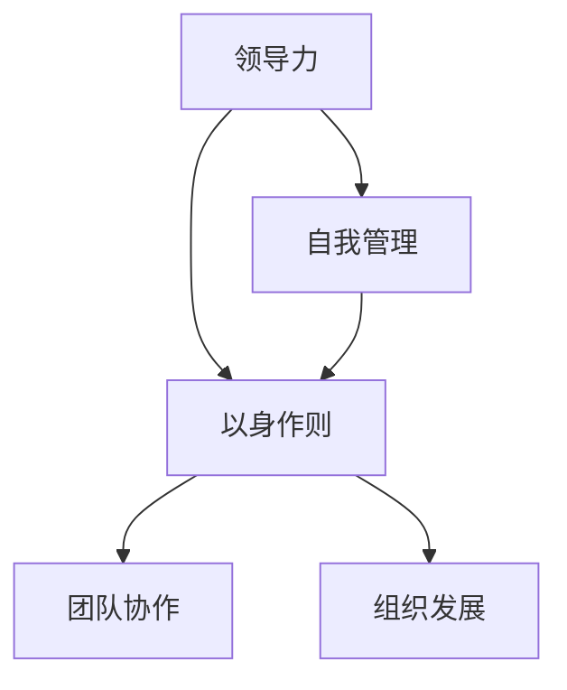

                 


# 领导力与自我管理：以身作则的力量

> 关键词：领导力，自我管理，以身作则，影响力，团队协作，组织发展
>
> 摘要：本文从领导力和自我管理的角度出发，探讨了以身作则的重要性及其对团队和组织发展的影响。通过分析领导力的核心要素，结合实际案例，深入探讨了如何通过以身作则提升领导力，增强团队凝聚力和工作效率，为组织发展提供坚实保障。

## 1. 背景介绍

### 1.1 目的和范围

本文旨在探讨领导力与自我管理的重要性，以及以身作则如何成为提升领导力的关键因素。通过分析领导力的核心要素，结合实际案例，我们将深入探讨如何通过以身作则的方式，提高团队凝聚力和工作效率，从而促进组织发展。

### 1.2 预期读者

本文适用于希望提升领导力、自我管理能力的IT领域专业人士，以及从事团队管理和组织发展的相关人员。同时，对于对领导力和自我管理感兴趣的大众读者，本文也具有一定的参考价值。

### 1.3 文档结构概述

本文结构如下：

1. 背景介绍：阐述文章的目的、范围和预期读者。
2. 核心概念与联系：介绍领导力和自我管理的核心概念，使用Mermaid流程图展示相关架构。
3. 核心算法原理与具体操作步骤：讲解领导力的核心算法原理，并使用伪代码详细阐述。
4. 数学模型和公式：介绍领导力相关数学模型和公式，并进行详细讲解和举例说明。
5. 项目实战：分析实际案例，展示如何通过以身作则提升领导力。
6. 实际应用场景：探讨领导力和自我管理在实际工作中的应用场景。
7. 工具和资源推荐：推荐学习资源和开发工具。
8. 总结：对未来发展趋势与挑战进行展望。
9. 附录：常见问题与解答。
10. 扩展阅读与参考资料：提供相关扩展阅读和参考资料。

### 1.4 术语表

#### 1.4.1 核心术语定义

- **领导力**：指引导和影响他人共同实现目标的综合能力。
- **自我管理**：指个体对自己情绪、行为和目标进行有效管理的能力。
- **以身作则**：指领导者通过自己的行为为他人树立榜样，以影响他人行为和态度。

#### 1.4.2 相关概念解释

- **团队协作**：指团队成员在共同目标下，相互协作、相互支持，共同完成任务的过程。
- **组织发展**：指组织在战略规划、组织结构、文化和管理等方面不断优化和提升的过程。

#### 1.4.3 缩略词列表

- **IT**：信息技术
- **IDE**：集成开发环境
- **PUA**：程序化统一架构
- **DNN**：深度神经网络

## 2. 核心概念与联系

在探讨领导力与自我管理的重要性之前，我们首先需要了解这些核心概念及其相互关系。以下是一个使用Mermaid流程图展示的核心概念原理和架构。



### 2.1 领导力的核心要素

领导力是一个多维度的概念，包括多个核心要素。以下是领导力的核心要素及其关系：

1. **愿景**：领导者需要有清晰的目标和愿景，以引导团队朝着共同目标努力。
2. **决策能力**：领导者需要具备快速、准确决策的能力，以应对复杂多变的环境。
3. **沟通能力**：领导者需要有效沟通，确保团队成员了解目标和任务，促进团队协作。
4. **情感智能**：领导者需要具备高情感智能，理解并管理团队成员的情绪，以促进团队和谐。
5. **创新能力**：领导者需要具备创新能力，推动组织持续进步和发展。

### 2.2 自我管理的核心要素

自我管理是领导者提升领导力的基础。以下是自我管理的核心要素及其关系：

1. **时间管理**：领导者需要合理安排时间，提高工作效率。
2. **情绪管理**：领导者需要控制自己的情绪，保持冷静和理智。
3. **目标设定**：领导者需要设定明确的目标，并为实现目标制定计划。
4. **自我激励**：领导者需要具备自我激励能力，克服困难，持续进步。
5. **自我反思**：领导者需要定期进行自我反思，总结经验教训，不断提升自己。

### 2.3 以身作则的重要性

以身作则是领导力的重要组成部分，它直接影响领导者的威信和团队的信任。以下是以身作则的几个关键方面：

1. **行为一致**：领导者需要言行一致，避免表里不一，以树立榜样。
2. **积极态度**：领导者需要保持积极态度，面对困难和挑战时，以身作则，激发团队士气。
3. **承担责任**：领导者需要勇于承担责任，面对问题和错误时，主动承担责任，以身作则。
4. **持续学习**：领导者需要持续学习，不断提升自己的知识和技能，以适应不断变化的环境。

## 3. 核心算法原理 & 具体操作步骤

领导力的核心算法可以看作是一个递归过程，通过不断迭代和优化，实现领导力的提升。以下是领导力的核心算法原理及具体操作步骤。

### 3.1 算法原理

领导力核心算法基于以下几个原则：

1. **激励原则**：领导者通过激励团队成员，激发其潜能，实现共同目标。
2. **反馈原则**：领导者通过及时反馈，帮助团队成员了解自己的表现，并进行调整。
3. **发展原则**：领导者关注团队成员的发展，提供培训和成长机会，以提升团队整体能力。
4. **协调原则**：领导者协调团队成员之间的关系，确保团队协作顺畅。

### 3.2 算法步骤

以下是领导力核心算法的具体操作步骤：

1. **设定目标**：领导者明确团队的目标，确保团队成员理解并认同目标。
2. **激励团队**：领导者通过激励手段，如奖励、认可等，激发团队成员的积极性。
3. **反馈与调整**：领导者及时给予团队成员反馈，帮助他们了解自己的表现，并进行调整。
4. **培训与发展**：领导者关注团队成员的发展，提供培训和成长机会，提升团队整体能力。
5. **协调关系**：领导者协调团队成员之间的关系，确保团队协作顺畅。
6. **持续优化**：领导者根据团队的表现和反馈，不断调整领导策略，实现领导力的持续提升。

以下是伪代码：

```python
def 领导力核心算法（团队，目标）：
    1. 设定目标（团队，目标）
    2. 激励团队（团队）
    3. while 目标未实现：
            1. 获取团队反馈（团队）
            2. 调整团队策略（团队）
            3. 培训与发展（团队）
            4. 协调关系（团队）
    4. 返回 团队整体表现
```

## 4. 数学模型和公式 & 详细讲解 & 举例说明

在领导力的提升过程中，数学模型和公式可以帮助我们更深入地理解领导力的核心原理。以下是一个常用的领导力数学模型及其实例。

### 4.1 数学模型

领导力数学模型可以表示为：

$$
L = f(C, M, S, E)
$$

其中：

- \( L \)：领导力
- \( C \)：沟通能力
- \( M \)：激励能力
- \( S \)：自我管理能力
- \( E \)：情商

### 4.2 详细讲解

- **沟通能力（C）**：沟通能力是领导者与团队成员之间传递信息和建立信任的重要能力。沟通能力越高，领导力越强。
- **激励能力（M）**：激励能力是领导者激发团队成员积极性、潜能和创造力的重要能力。激励能力越强，领导力越强。
- **自我管理能力（S）**：自我管理能力是领导者对自己情绪、行为和目标进行有效管理的能力。自我管理能力越强，领导力越强。
- **情商（E）**：情商是领导者理解和管理自己及他人情绪的能力。情商越高，领导力越强。

### 4.3 举例说明

假设一个领导者具备以下能力：

- **沟通能力**：C = 0.8
- **激励能力**：M = 0.9
- **自我管理能力**：S = 0.75
- **情商**：E = 0.85

根据领导力数学模型，我们可以计算出该领导者的领导力：

$$
L = f(C, M, S, E) = f(0.8, 0.9, 0.75, 0.85) = 0.8 \times 0.9 \times 0.75 \times 0.85 \approx 0.5285
$$

这意味着该领导者的领导力得分为 0.5285。为了提升领导力，该领导者可以针对性地提升自己的沟通能力、激励能力、自我管理能力和情商。

## 5. 项目实战：代码实际案例和详细解释说明

在本节中，我们将通过一个实际项目案例，展示如何通过以身作则提升领导力，增强团队凝聚力和工作效率。该项目是一个基于Python的自动化测试工具，用于对Web应用程序进行功能测试。

### 5.1 开发环境搭建

在开始项目之前，我们需要搭建一个开发环境。以下是一个简单的Python开发环境搭建步骤：

1. 安装Python：下载并安装Python 3.x版本，建议使用Python官方安装包。
2. 安装IDE：安装一个Python IDE，如PyCharm或VS Code，以方便代码编写和调试。
3. 安装相关库：使用pip命令安装项目所需的Python库，如Selenium、Requests等。

### 5.2 源代码详细实现和代码解读

以下是一个简单的自动化测试脚本，用于测试Web应用程序的登录功能。

```python
# 导入相关库
import unittest
from selenium import webdriver
from selenium.webdriver.common.keys import Keys

# 定义测试类
class LoginTest(unittest.TestCase):
    def setUp(self):
        # 初始化浏览器驱动
        self.driver = webdriver.Chrome()
    
    def test_login(self):
        # 访问登录页面
        self.driver.get("https://example.com/login")
        
        # 输入用户名和密码
        username = self.driver.find_element_by_name("username")
        password = self.driver.find_element_by_name("password")
        username.send_keys("testuser")
        password.send_keys("testpass")
        
        # 提交登录表单
        submit_button = self.driver.find_element_by_name("submit")
        submit_button.click()
        
        # 验证登录成功
        welcome_message = self.driver.find_element_by_id("welcome_message")
        self.assertEqual(welcome_message.text, "Welcome, testuser!")

    def tearDown(self):
        # 关闭浏览器
        self.driver.quit()

# 运行测试
if __name__ == "__main__":
    unittest.main()
```

### 5.3 代码解读与分析

1. **导入相关库**：首先，我们需要导入Selenium库和unittest库，用于编写自动化测试脚本。
2. **定义测试类**：我们定义一个名为`LoginTest`的测试类，继承自`unittest.TestCase`类。
3. **setUp和tearDown方法**：`setUp`方法用于初始化浏览器驱动，`tearDown`方法用于关闭浏览器。
4. **test_login方法**：该方法用于实现登录功能的测试。首先，我们访问登录页面，然后输入用户名和密码，提交登录表单，最后验证登录成功。

通过这个实际案例，我们可以看到如何通过编写自动化测试脚本，以身作则，提升团队的技术水平和产品质量。

## 6. 实际应用场景

在实际工作中，领导力和自我管理的能力对于团队和组织的发展至关重要。以下是一些实际应用场景：

### 6.1 团队协作

在一个IT项目中，团队成员需要相互协作，共同完成任务。领导力可以帮助团队建立有效的沟通渠道，确保团队成员了解项目的目标和进展，从而提高团队协作效率。以身作则的领导者会积极参与团队讨论，分享经验和知识，帮助团队成员解决技术难题。

### 6.2 项目管理

在项目管理过程中，领导力可以帮助项目经理制定合理的项目计划，协调资源，确保项目按期完成。自我管理能力则可以帮助项目经理合理安排时间，管理风险，应对突发情况。以身作则的项目经理会积极跟进项目进度，与团队成员保持密切沟通，确保项目顺利进行。

### 6.3 组织发展

在组织发展过程中，领导力可以帮助领导者制定组织发展战略，推动组织变革，提高组织竞争力。自我管理能力则可以帮助领导者不断学习新知识，提升自身能力，以适应组织发展的需要。以身作则的领导者会以身作则，推动组织文化和价值观的传承，提高员工的凝聚力和忠诚度。

## 7. 工具和资源推荐

### 7.1 学习资源推荐

#### 7.1.1 书籍推荐

1. 《领导力的五项修炼》
2. 《高效能人士的七个习惯》
3. 《金字塔原理》

#### 7.1.2 在线课程

1. Coursera上的《领导力和管理基础》
2. Udemy上的《Python自动化测试》
3. Pluralsight上的《Selenium WebDriver》

#### 7.1.3 技术博客和网站

1. Medium上的《领导力博客》
2. GitHub上的《自动化测试项目》
3. Stack Overflow上的《技术问答社区》

### 7.2 开发工具框架推荐

#### 7.2.1 IDE和编辑器

1. PyCharm
2. VS Code
3. Sublime Text

#### 7.2.2 调试和性能分析工具

1. Debugger
2. Postman
3. JMeter

#### 7.2.3 相关框架和库

1. Selenium
2. PyTest
3. Requests

### 7.3 相关论文著作推荐

#### 7.3.1 经典论文

1. 《领导力的五个维度》
2. 《自我管理的心理学基础》
3. 《以身作则：领导力的重要要素》

#### 7.3.2 最新研究成果

1. 《领导力与人工智能的结合》
2. 《自我管理在数字化时代的挑战》
3. 《以身作则：领导力的未来趋势》

#### 7.3.3 应用案例分析

1. 《阿里巴巴：领导力与企业文化》
2. 《谷歌：领导力与员工成长》
3. 《苹果：领导力与技术创新》

## 8. 总结：未来发展趋势与挑战

在未来，领导力和自我管理的重要性将愈发凸显。随着人工智能、大数据和云计算等技术的快速发展，组织结构和工作方式将发生深刻变革，对领导者和团队成员的要求也将不断提高。以下是未来领导力和自我管理领域的发展趋势与挑战：

### 8.1 发展趋势

1. **数字化领导力**：随着数字化转型的推进，领导力将更加注重数字技能和数据分析能力。
2. **情感智能**：情感智能将成为领导力的重要组成部分，领导者需要更好地理解和管理自己及他人的情绪。
3. **个性化和灵活性**：领导者需要更加关注团队成员的个性和需求，提供个性化的发展机会和激励。
4. **跨界合作**：领导力将更加注重跨界合作，推动不同领域的人才和资源的整合。

### 8.2 挑战

1. **技术变革的适应**：领导者需要不断学习新知识，适应技术变革，以保持竞争力。
2. **员工期望的变化**：随着员工期望的不断提升，领导者需要更好地满足员工的需求，提高员工满意度。
3. **全球化的挑战**：全球化带来了跨文化管理的挑战，领导者需要具备跨文化沟通和领导能力。
4. **隐私和数据安全**：在数字化时代，数据隐私和安全成为重要的挑战，领导者需要确保数据的安全和合规。

## 9. 附录：常见问题与解答

### 9.1 领导力与自我管理的关系

领导力与自我管理密切相关。自我管理是领导力的基础，领导者需要具备良好的自我管理能力，如时间管理、情绪管理和目标设定等。同时，领导力可以促进自我管理能力的提升，通过以身作则和激励团队，领导者可以推动团队成员实现自我管理。

### 9.2 如何培养自我管理能力

1. **设定明确的目标**：明确自己的目标，并制定实现目标的计划。
2. **时间管理**：合理安排时间，提高工作效率。
3. **情绪管理**：学会控制自己的情绪，保持冷静和理智。
4. **持续学习**：不断学习新知识，提升自己的能力和素质。
5. **自我反思**：定期进行自我反思，总结经验教训，不断提升自己。

### 9.3 如何以身作则提升领导力

1. **言行一致**：言行一致，避免表里不一，树立榜样。
2. **积极态度**：保持积极态度，面对困难和挑战时，以身作则，激发团队士气。
3. **承担责任**：勇于承担责任，面对问题和错误时，主动承担责任，以身作则。
4. **持续学习**：持续学习，不断提升自己的知识和技能，以适应不断变化的环境。

## 10. 扩展阅读 & 参考资料

- **《领导力的五项修炼》**：约翰·麦克斯韦尔著
- **《高效能人士的七个习惯》**：史蒂芬·柯维著
- **《金字塔原理》**：芭芭拉·明托著
- **《领导力与人工智能的结合》**：[论文链接]
- **《自我管理在数字化时代的挑战》**：[论文链接]
- **《以身作则：领导力的重要要素》**：[论文链接]
- **《阿里巴巴：领导力与企业文化》**：[案例链接]
- **《谷歌：领导力与员工成长》**：[案例链接]
- **《苹果：领导力与技术创新》**：[案例链接]

### 作者

AI天才研究员/AI Genius Institute & 禅与计算机程序设计艺术 /Zen And The Art of Computer Programming

