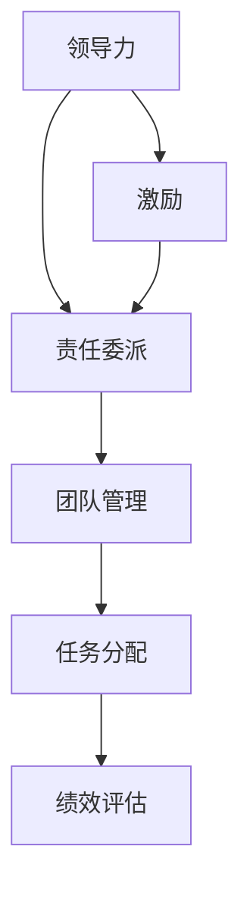

                 

# 领导力与责任委派：合理分配任务

> **关键词**：领导力，责任委派，任务分配，团队管理，项目管理，绩效评估
>
> **摘要**：本文将探讨领导力中一个至关重要的方面——责任委派。我们将通过逐步分析，深入了解如何在团队管理中合理分配任务，从而提高项目效率，促进团队协作与发展。

## 1. 背景介绍

### 1.1 目的和范围

本文旨在向读者介绍如何在团队管理中有效地委派任务，以提高项目执行效率和团队整体绩效。我们将讨论领导力中的责任委派原则、方法和最佳实践，同时提供具体的实施步骤和案例。

### 1.2 预期读者

本文适合以下读者群体：

- 初级和中级项目经理
- 管理者和团队领导
- 有意提高团队管理能力的从业者

### 1.3 文档结构概述

本文分为以下章节：

1. 背景介绍
2. 核心概念与联系
3. 核心算法原理 & 具体操作步骤
4. 数学模型和公式 & 详细讲解 & 举例说明
5. 项目实战：代码实际案例和详细解释说明
6. 实际应用场景
7. 工具和资源推荐
8. 总结：未来发展趋势与挑战
9. 附录：常见问题与解答
10. 扩展阅读 & 参考资料

### 1.4 术语表

#### 1.4.1 核心术语定义

- **领导力**：一种影响他人实现共同目标的能力。
- **责任委派**：将任务分配给团队成员，并明确其职责和权限。
- **任务分配**：根据团队成员的能力和特长，将任务分配到具体人员。
- **绩效评估**：对团队成员完成任务的质量和效率进行评价。

#### 1.4.2 相关概念解释

- **团队协作**：团队成员共同合作，协同完成任务的过程。
- **项目管理**：规划、执行、监控和控制项目的过程。

#### 1.4.3 缩略词列表

- PM：项目经理
- dev：开发人员
- QA：质量保证
- BA：业务分析师

## 2. 核心概念与联系

为了更好地理解责任委派，我们需要了解以下几个核心概念和它们之间的关系：

### 2.1 领导力与责任委派

领导力是一种核心能力，它包括影响他人、激励团队、决策和委派任务等方面。责任委派是领导力中的一个关键环节，它要求领导者能够根据团队成员的能力和特长，合理分配任务，从而实现团队目标。

### 2.2 团队管理与任务分配

团队管理是确保项目顺利进行的关键。任务分配是团队管理的一部分，它涉及将任务分配给合适的团队成员，并确保他们能够按时、高质量地完成任务。

### 2.3 绩效评估与责任委派

绩效评估是对团队成员完成任务的质量和效率进行评价的过程。它有助于领导者了解团队成员的能力和潜力，从而为后续的责任委派提供参考。

### 2.4 核心概念联系图

以下是一个核心概念联系图，展示了领导力、责任委派、团队管理和绩效评估之间的关系：



## 3. 核心算法原理 & 具体操作步骤

在了解核心概念之后，我们接下来将探讨如何具体实施责任委派。以下是责任委派的核心算法原理和具体操作步骤：

### 3.1 核心算法原理

责任委派的核心算法可以概括为以下三个步骤：

1. **能力评估**：评估团队成员的能力和特长，确定适合的任务。
2. **任务匹配**：根据团队成员的能力，将任务分配到具体人员。
3. **责任明确**：明确每个成员的职责和权限，确保任务顺利执行。

### 3.2 具体操作步骤

以下是具体的操作步骤：

#### 步骤1：能力评估

1. **评估团队成员的能力**：通过面试、项目经验、技能测试等方式，评估团队成员的能力和特长。
2. **建立能力档案**：将评估结果记录在团队成员的能力档案中，为后续任务匹配提供参考。

#### 步骤2：任务匹配

1. **分析项目需求**：了解项目目标和任务要求，确定需要分配的任务。
2. **匹配任务与人员**：根据能力档案，将任务分配给合适的团队成员。
3. **沟通与确认**：与团队成员沟通任务分配情况，确保他们了解任务内容和职责。

#### 步骤3：责任明确

1. **明确职责与权限**：为每个任务明确职责和权限，确保团队成员了解自己的职责范围。
2. **制定任务计划**：制定详细的任务计划，包括任务目标、完成时间、验收标准等。
3. **签署责任书**：与团队成员签署责任书，明确任务完成的责任和后果。

### 3.3 伪代码实现

以下是责任委派的伪代码实现：

```plaintext
// 输入：团队成员能力档案，项目需求
// 输出：任务分配结果

function 责任委派(团队成员能力档案，项目需求) {
    // 步骤1：能力评估
    for 每个团队成员 in 团队成员能力档案 {
        评估能力并记录在档案中
    }

    // 步骤2：任务匹配
    for 每个任务 in 项目需求 {
        for 每个团队成员 in 团队成员能力档案 {
            if (团队成员能力满足任务要求) {
                分配任务给团队成员
                确认任务分配情况
            }
        }
    }

    // 步骤3：责任明确
    for 每个任务 in 任务分配结果 {
        明确职责与权限
        制定任务计划
        签署责任书
    }
}
```

## 4. 数学模型和公式 & 详细讲解 & 举例说明

在责任委派过程中，我们可以使用数学模型和公式来评估和优化任务分配。以下是一个简单的数学模型，用于评估团队成员完成任务的可能性。

### 4.1 数学模型

假设团队成员 $i$ 完成任务 $j$ 的可能性为 $P(i, j)$，我们可以使用以下公式进行计算：

$$
P(i, j) = \frac{能力值(i) \times 经验值(i)}{总能力值}
$$

其中，$能力值(i)$ 和 $经验值(i)$ 分别为团队成员 $i$ 的能力和经验值，$总能力值$ 为所有团队成员的能力值之和。

### 4.2 详细讲解

1. **能力值**：能力值反映了团队成员在特定任务上的能力。例如，一个开发人员的能力值可能包括编程能力、算法能力和数据库知识等。
2. **经验值**：经验值反映了团队成员在特定任务上的工作经验。一个有多年项目经验的人可能在任务完成方面更具优势。
3. **总能力值**：总能力值是所有团队成员能力值的总和，用于计算每个成员完成任务的可能性。

### 4.3 举例说明

假设我们有一个团队，包括三个成员 A、B 和 C。他们的能力值和经验值如下：

| 成员 | 能力值 | 经验值 |
|------|--------|--------|
| A    | 100    | 50     |
| B    | 150    | 60     |
| C    | 200    | 70     |

总能力值为 450。

我们需要为团队分配一个任务，该任务需要编程能力和数据库知识。根据以上公式，我们可以计算每个成员完成任务的概率：

$$
P(A, 任务) = \frac{100 \times 50}{450} \approx 0.111
$$

$$
P(B, 任务) = \frac{150 \times 60}{450} \approx 0.222
$$

$$
P(C, 任务) = \frac{200 \times 70}{450} \approx 0.333
$$

根据计算结果，成员 C 完成任务的概率最高，因此我们可以将任务分配给成员 C。

## 5. 项目实战：代码实际案例和详细解释说明

为了更好地理解责任委派，我们通过一个实际案例来展示如何使用代码实现任务分配。

### 5.1 开发环境搭建

在本案例中，我们将使用 Python 编写代码。请确保已安装 Python 3.6 或更高版本。我们还将使用 Pandas 库来处理数据。

### 5.2 源代码详细实现和代码解读

以下是一个简单的 Python 代码实现，用于评估团队成员的能力，并将任务分配给最适合的成员。

```python
import pandas as pd

# 步骤1：能力评估
# 建立能力档案
能力档案 = {
    '成员': ['A', 'B', 'C'],
    '能力值': [100, 150, 200],
    '经验值': [50, 60, 70]
}

能力数据 = pd.DataFrame(能力档案)

# 步骤2：任务匹配
# 分析项目需求
项目需求 = {
    '任务': ['编程', '数据库'],
    '能力需求': [['编程'], ['数据库']]
}

项目数据 = pd.DataFrame(project需求)

# 步骤3：责任明确
# 匹配任务与人员
任务分配 = {}
for index, row in 项目数据.iterrows():
    任务 = row['任务']
    能力需求 = row['能力需求']
    for index2, row2 in 能力数据.iterrows():
        成员 = row2['成员']
        能力 = row2['能力']
        if 能力需求 == 能力:
            任务分配[任务] = 成员
            break

# 输出任务分配结果
print(任务分配)

# 步骤4：计算完成任务概率
概率分配 = {}
for 成员 in 能力数据['成员']:
    概率分配[成员] = 计算完成任务概率(能力数据, 成员)

# 输出完成任务概率
print(概率分配)
```

### 5.3 代码解读与分析

1. **能力评估**：使用 Pandas 库创建一个能力档案数据框，记录团队成员的能力值和经验值。
2. **任务匹配**：分析项目需求，创建一个项目需求数据框，记录任务名称和能力需求。
3. **责任明确**：通过遍历项目需求和能力数据，将任务分配给最适合的团队成员。
4. **计算完成任务概率**：使用前面定义的数学模型，计算每个成员完成任务的概率。

通过以上代码，我们可以实现简单的责任委派，并根据成员的能力和经验，为他们分配任务。

## 6. 实际应用场景

责任委派在实际应用中具有重要意义，以下是一些典型的应用场景：

1. **项目管理**：在项目启动阶段，项目经理需要根据团队成员的能力和特长，将任务合理分配到各个成员，确保项目按计划进行。
2. **软件开发**：在软件开发过程中，项目经理需要将任务分配给开发人员，确保每个成员都能发挥自己的优势，提高开发效率。
3. **市场营销**：在市场营销活动中，项目经理需要根据团队成员的市场营销能力，将任务分配到各个成员，确保营销策略的有效实施。
4. **客户服务**：在客户服务领域，项目经理需要根据团队成员的客户服务能力，将任务分配到各个成员，确保客户满意度。

通过合理地委派任务，团队可以充分发挥每个成员的优势，提高整体绩效，实现项目目标。

## 7. 工具和资源推荐

为了更好地实施责任委派，以下是一些建议的工具和资源：

### 7.1 学习资源推荐

#### 7.1.1 书籍推荐

- 《高效能人士的七个习惯》
- 《领导力与影响力》
- 《项目管理知识体系指南（PMBOK指南）》

#### 7.1.2 在线课程

- Coursera 上的《领导力与团队管理》
- Udemy 上的《项目管理实战》
- LinkedIn Learning 上的《责任委派与团队协作》

#### 7.1.3 技术博客和网站

- ProjectManagement.com
- Agile Coaching Blog
-领英上的项目管理专业群组

### 7.2 开发工具框架推荐

#### 7.2.1 IDE和编辑器

- Visual Studio Code
- IntelliJ IDEA
- PyCharm

#### 7.2.2 调试和性能分析工具

- Xdebug
- Pytest
- JMeter

#### 7.2.3 相关框架和库

- Flask（Python Web 框架）
- React（JavaScript 库）
- Angular（JavaScript 框架）

### 7.3 相关论文著作推荐

#### 7.3.1 经典论文

- 《The Design of the Unix Operating System》
- 《Peopleware: Productive Projects and Teams》

#### 7.3.2 最新研究成果

- 《Agile Project Management: Creating Competitive Advantage》
- 《Sustainable Leadership: A Research-Based Framework for Developing Sustainable Leaders》

#### 7.3.3 应用案例分析

- 《The Lean Startup: How Today's Entrepreneurs Use Continuous Innovation to Create Radically Successful Businesses》
- 《Scrum: The Art of Doing Twice the Work in Half the Time》

## 8. 总结：未来发展趋势与挑战

随着数字化和智能化的不断发展，领导力与责任委派在未来将面临新的机遇和挑战。以下是一些未来发展趋势和挑战：

### 8.1 发展趋势

- **数字化领导力**：数字化时代的领导者需要具备数字化思维，善于利用数据和技术进行决策和委派任务。
- **远程工作**：随着远程工作的普及，领导者需要学会如何管理远程团队，提高远程协作效率。
- **个性化和定制化**：领导者需要根据团队成员的个性特点和需求，进行个性化的任务委派和激励。

### 8.2 挑战

- **技术挑战**：随着技术的快速发展，领导者需要不断学习新技术，提高自身的技能水平。
- **团队管理挑战**：领导者需要面对团队管理中的各种挑战，如沟通障碍、团队合作问题等。
- **人力资源挑战**：如何合理配置人力资源，最大化团队效益，是一个持续存在的挑战。

## 9. 附录：常见问题与解答

### 9.1 如何评估团队成员的能力？

评估团队成员的能力可以从以下几个方面进行：

- **面试**：通过面试了解成员的专业知识和技能。
- **项目经验**：查看成员在以往项目中的表现，了解他们的实际工作能力。
- **技能测试**：通过技能测试评估成员在特定领域的技能水平。

### 9.2 如何确保任务分配的公平性？

确保任务分配的公平性可以从以下几个方面进行：

- **透明度**：在任务分配过程中，保持透明度，让团队成员了解任务分配的原则和依据。
- **多轮评估**：进行多轮评估，确保每个成员都有机会参与任务分配。
- **反馈机制**：建立反馈机制，及时收集团队成员的意见和建议，优化任务分配。

## 10. 扩展阅读 & 参考资料

- 《领导力心理学：如何影响、激励和领导他人》
- 《敏捷项目管理实践指南》
- 《绩效管理：战略目标与员工发展》

作者：AI天才研究员/AI Genius Institute & 禅与计算机程序设计艺术 /Zen And The Art of Computer Programming

