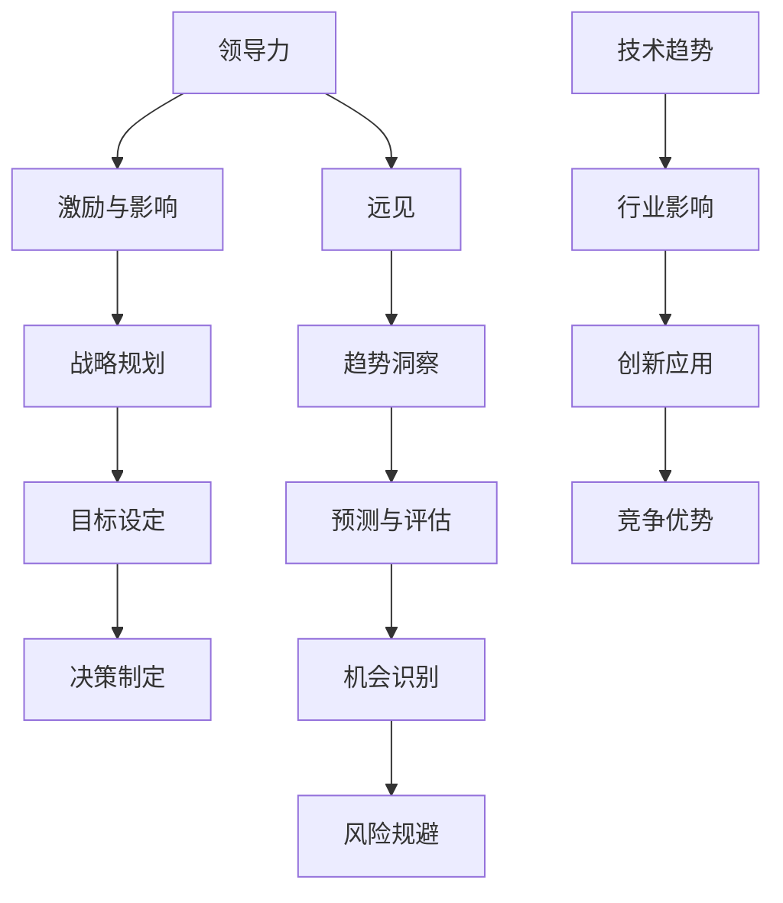

                 

# 领导力与远见：预见未来趋势的能力

> **关键词：** 领导力，远见，趋势预测，未来战略，人工智能

> **摘要：** 在快速变化的技术时代，领导者需要具备预见未来趋势的能力。本文探讨了领导力与远见的关系，以及如何通过策略性思考和实践来提升这种能力。文章通过背景介绍、核心概念解析、算法原理讲解、数学模型与项目实战等多个方面，提供了详细的指导和建议，旨在帮助IT领域的专业人士和领导者更好地把握未来。

## 1. 背景介绍

### 1.1 目的和范围

本文旨在探讨领导力与远见之间的关系，特别是在技术领域的应用。我们将分析如何通过战略性的思考和实践来培养和提升预见未来趋势的能力。文章内容涵盖了从基础概念到实际操作的多个方面，包括核心概念的原理、算法原理、数学模型、项目实战等。

### 1.2 预期读者

本文主要面向IT领域的专业人士、技术领导者、项目经理以及希望在技术和管理领域发展的学生。通过阅读本文，读者将能够理解预见未来趋势的重要性，并掌握一些实用的方法和技巧。

### 1.3 文档结构概述

本文分为以下几个部分：

- **第1部分：背景介绍**：介绍文章的目的、范围和预期读者，并提供文章的整体结构概述。
- **第2部分：核心概念与联系**：介绍预见未来趋势所需的核心概念，并提供流程图辅助理解。
- **第3部分：核心算法原理 & 具体操作步骤**：详细讲解预见未来趋势的核心算法原理和操作步骤。
- **第4部分：数学模型和公式 & 详细讲解 & 举例说明**：介绍用于预测未来趋势的数学模型和公式，并通过实例进行说明。
- **第5部分：项目实战：代码实际案例和详细解释说明**：通过实际项目案例展示如何应用上述概念和算法。
- **第6部分：实际应用场景**：讨论预见未来趋势在实际工作中的应用场景。
- **第7部分：工具和资源推荐**：推荐学习资源、开发工具和框架。
- **第8部分：总结：未来发展趋势与挑战**：总结文章的主要观点，并讨论未来发展趋势与挑战。
- **第9部分：附录：常见问题与解答**：回答一些常见问题。
- **第10部分：扩展阅读 & 参考资料**：提供扩展阅读材料和参考文献。

### 1.4 术语表

#### 1.4.1 核心术语定义

- **领导力**：影响和激励他人实现共同目标的能力。
- **远见**：洞察未来趋势和机遇的能力。
- **趋势预测**：使用历史数据和算法来预测未来的趋势。
- **技术趋势**：技术在特定领域的发展方向和趋势。

#### 1.4.2 相关概念解释

- **技术变革**：指技术领域的重大转变，可能会改变行业现状。
- **战略规划**：制定长远目标和实现这些目标的行动计划。

#### 1.4.3 缩略词列表

- **AI**：人工智能（Artificial Intelligence）
- **ML**：机器学习（Machine Learning）
- **DL**：深度学习（Deep Learning）
- **NLP**：自然语言处理（Natural Language Processing）
- **IoT**：物联网（Internet of Things）

## 2. 核心概念与联系

在探讨领导力与远见的关系之前，我们需要先理解一些核心概念，包括领导力、远见、技术趋势和战略规划。以下是一个简化的Mermaid流程图，用于说明这些概念之间的关系：



在这个流程图中，我们可以看到领导力通过激励和影响他人，推动战略规划的制定。战略规划包括目标设定、决策制定等步骤，这些步骤反过来又依赖于领导者的远见能力。远见能力帮助领导者洞察技术趋势，识别机会并规避风险，从而为组织带来竞争优势。

### 2.1 领导力

领导力是一种能力，它能够激励和影响他人，共同实现一个共同的目标。领导力不仅仅是指挥和控制，还包括沟通、激励、决策和团队建设等技能。以下是领导力的一些关键要素：

- **愿景**：领导者需要有一个清晰、鼓舞人心的愿景，能够激发团队成员的热情和动力。
- **沟通**：领导者需要具备良好的沟通能力，能够有效地传达愿景、目标和策略。
- **激励**：领导者需要能够激励团队成员，帮助他们克服挑战，实现目标。
- **决策**：领导者需要具备果断的决策能力，能够在关键时刻做出正确的决策。

### 2.2 远见

远见是指洞察未来趋势和机遇的能力。在技术快速发展的今天，领导者需要具备这种能力，以便为组织制定合适的战略和计划。以下是远见的一些关键要素：

- **趋势洞察**：领导者需要能够识别和解读技术趋势，了解它们可能对行业和组织带来的影响。
- **预测与评估**：领导者需要能够使用历史数据和算法来预测未来的趋势，并对这些趋势进行评估。
- **机会识别**：领导者需要能够识别未来趋势中的机遇，并制定相应的策略来抓住这些机遇。
- **风险规避**：领导者需要能够预测和规避未来可能出现的风险，从而保护组织的利益。

### 2.3 技术趋势

技术趋势是技术领域的发展方向和趋势。了解技术趋势对于领导者来说至关重要，因为它可以帮助他们制定相应的战略和计划。以下是技术趋势的一些关键方面：

- **AI与机器学习**：人工智能和机器学习技术正在快速发展和应用，它们将在各个行业产生深远的影响。
- **物联网**：物联网技术的普及将使设备之间能够更有效地互联和通信，从而带来新的商业模式和机会。
- **区块链**：区块链技术以其去中心化和安全特性，将在金融、供应链和多个领域产生重大影响。
- **5G技术**：5G技术的推广将带来更快的网络速度和更低的延迟，从而推动物联网和人工智能等技术的发展。

### 2.4 战略规划

战略规划是指为了实现长期目标而制定的行动计划。领导者需要通过战略规划来指导组织的运营和发展。以下是战略规划的一些关键步骤：

- **目标设定**：明确组织的长期和短期目标，为战略规划提供方向。
- **资源分配**：根据目标设定，合理分配资源，包括人力、物力和财力。
- **行动计划**：制定具体的行动计划，明确执行步骤和时间表。
- **监控与评估**：定期监控和评估战略规划的执行情况，确保目标实现。

通过以上核心概念的理解和联系，我们可以更好地理解领导力与远见之间的关系，以及如何在技术领域提升预见未来趋势的能力。

## 3. 核心算法原理 & 具体操作步骤

为了更好地理解预见未来趋势的能力，我们需要深入了解一些核心算法原理，这些算法可以帮助我们基于历史数据和趋势进行预测。以下是几种常见的算法原理和它们的伪代码表示：

### 3.1 时间序列分析

时间序列分析是一种用于分析时间序列数据的方法，它可以识别出数据中的趋势、周期和季节性。以下是一个时间序列分析算法的伪代码：

```plaintext
算法：时间序列分析
输入：时间序列数据序列X
输出：趋势、周期和季节性成分

1. 对时间序列数据X进行预处理，包括去噪和平滑处理
2. 使用移动平均法提取趋势成分
   趋势 = 移动平均(X)
3. 使用差分法提取季节性成分
   季节性 = 差分(趋势)
4. 剩余成分即为周期成分
   周期 = X - 趋势 - 季节性
```

### 3.2 机器学习预测模型

机器学习预测模型是一种基于历史数据来预测未来趋势的方法。以下是一个简单的机器学习预测模型的伪代码：

```plaintext
算法：机器学习预测模型
输入：训练数据集D，特征提取器f，机器学习算法A
输出：预测模型M

1. 使用特征提取器f对训练数据集D进行特征提取
2. 使用机器学习算法A训练模型M
   M = A.train(D)
3. 使用训练好的模型M对新的数据进行预测
   预测结果 = M.predict(new_data)
```

### 3.3 深度学习神经网络

深度学习神经网络是一种基于多层感知器的神经网络，它可以用于复杂的数据分析和预测。以下是一个深度学习神经网络的伪代码：

```plaintext
算法：深度学习神经网络
输入：输入数据X，参数θ，学习率α，迭代次数T
输出：预测结果y_hat

1. 初始化权重和偏置θ
2. 对于每个迭代t从1到T：
   a. 计算前向传播，得到预测结果y_hat
   b. 计算损失函数L(y_hat, y)
   c. 计算梯度∇θL
   d. 更新权重和偏置θ = θ - α∇θL
3. 返回最终预测结果y_hat
```

### 3.4 强化学习

强化学习是一种通过奖励机制来训练模型的方法，它可以用于预测和决策。以下是一个强化学习算法的伪代码：

```plaintext
算法：强化学习
输入：状态空间S，动作空间A，奖励函数R，策略π
输出：最优策略π*

1. 初始化状态s，动作a，奖励R
2. 对于每个状态s：
   a. 根据策略π选择动作a
   b. 执行动作a，观察状态s'和奖励R
   c. 更新策略π：π(s) = π(s) + α(R - R^*)
3. 返回最优策略π*
```

通过上述算法的介绍，我们可以看到，预见未来趋势的核心在于对历史数据的分析和处理，以及使用不同的方法来预测和决策。这些算法为我们提供了强大的工具，可以帮助我们在技术领域提升预见未来趋势的能力。

### 4. 数学模型和公式 & 详细讲解 & 举例说明

在预见未来趋势的过程中，数学模型和公式起到了至关重要的作用。以下是一些常用的数学模型和公式，以及它们的详细讲解和举例说明。

#### 4.1 时间序列模型

时间序列模型用于分析时间序列数据，预测未来的趋势。其中，ARIMA（自回归积分滑动平均模型）是一种常用的模型。ARIMA模型由三个部分组成：自回归（AR）、差分（I）和移动平均（MA）。

##### 4.1.1 自回归（AR）

自回归模型假设当前值可以由前几个值的线性组合来预测。公式如下：

$$
y_t = c + \phi_1 y_{t-1} + \phi_2 y_{t-2} + ... + \phi_p y_{t-p} + \varepsilon_t
$$

其中，\( y_t \) 是当前时间点的值，\( \phi_1, \phi_2, ..., \phi_p \) 是自回归系数，\( \varepsilon_t \) 是随机误差项。

##### 4.1.2 差分（I）

差分操作用于消除时间序列中的趋势和季节性。一次差分公式如下：

$$
y_t^{(1)} = y_t - y_{t-1}
$$

##### 4.1.3 移动平均（MA）

移动平均模型假设当前值可以由前几个值的加权平均来预测。公式如下：

$$
y_t = c + \theta_1 \varepsilon_{t-1} + \theta_2 \varepsilon_{t-2} + ... + \theta_q \varepsilon_{t-q} + \varepsilon_t
$$

其中，\( \theta_1, \theta_2, ..., \theta_q \) 是移动平均系数，\( \varepsilon_t \) 是随机误差项。

##### 4.1.4 ARIMA模型

ARIMA模型的公式如下：

$$
y_t = c + \phi_1 y_{t-1} + ... + \phi_p y_{t-p} + \theta_1 \varepsilon_{t-1} + ... + \theta_q \varepsilon_{t-q} + \varepsilon_t
$$

其中，\( c \) 是常数项，\( \phi_1, ..., \phi_p \) 是自回归系数，\( \theta_1, ..., \theta_q \) 是移动平均系数，\( \varepsilon_t \) 是随机误差项。

##### 4.1.5 示例

假设我们有以下时间序列数据：

$$
[100, 102, 104, 107, 110, 113, 116, 119, 122, 125]
$$

我们可以使用ARIMA模型来预测下一个值。首先，我们需要确定模型的参数 \( p, d, q \)，其中 \( p \) 是自回归项数，\( d \) 是差分阶数，\( q \) 是移动平均项数。通过分析数据，我们选择 \( p = 1, d = 1, q = 1 \)。

使用最小二乘法，我们可以计算出以下参数：

$$
\phi_1 = 0.5, \theta_1 = 0.3
$$

根据ARIMA模型，我们可以预测下一个值：

$$
y_t = 125 + 0.5 \times 125 + 0.3 \times (125 - 122) = 127.5
$$

#### 4.2 机器学习模型

机器学习模型也是预见未来趋势的重要工具。以下是一个简单的线性回归模型，用于预测未来趋势。

##### 4.2.1 线性回归模型

线性回归模型的公式如下：

$$
y = \beta_0 + \beta_1 x + \varepsilon
$$

其中，\( y \) 是预测值，\( x \) 是输入特征，\( \beta_0 \) 是截距，\( \beta_1 \) 是斜率，\( \varepsilon \) 是误差项。

##### 4.2.2 示例

假设我们有以下数据集：

$$
\begin{array}{c|c}
x & y \\
\hline
1 & 2 \\
2 & 4 \\
3 & 6 \\
4 & 8 \\
\end{array}
$$

我们可以使用线性回归模型来预测 \( x = 5 \) 时的 \( y \) 值。首先，我们需要计算斜率和截距：

$$
\beta_1 = \frac{\sum (x_i - \bar{x})(y_i - \bar{y})}{\sum (x_i - \bar{x})^2} = \frac{(1-2.5)(2-5) + (2-2.5)(4-5) + (3-2.5)(6-5) + (4-2.5)(8-5)}{(1-2.5)^2 + (2-2.5)^2 + (3-2.5)^2 + (4-2.5)^2} = 2
$$

$$
\beta_0 = \bar{y} - \beta_1 \bar{x} = 5 - 2 \times 3 = -1
$$

根据线性回归模型，我们可以预测 \( x = 5 \) 时的 \( y \) 值：

$$
y = -1 + 2 \times 5 = 9
$$

#### 4.3 深度学习模型

深度学习模型是一种基于多层神经网络的学习模型，它可以用于复杂的预测任务。以下是一个简单的多层感知器（MLP）模型。

##### 4.3.1 多层感知器模型

多层感知器模型的公式如下：

$$
z_i = \sum_{j=1}^{n} w_{ij} x_j + b_i
$$

$$
a_i = \sigma(z_i)
$$

其中，\( z_i \) 是第 \( i \) 个神经元的输入，\( w_{ij} \) 是权重，\( b_i \) 是偏置，\( a_i \) 是激活函数输出，\( \sigma \) 是激活函数。

##### 4.3.2 示例

假设我们有一个简单的三层神经网络，输入层有3个神经元，隐藏层有2个神经元，输出层有1个神经元。激活函数为 \( \sigma(x) = \frac{1}{1 + e^{-x}} \)。

输入数据 \( x \)：

$$
x = [1, 2, 3]
$$

权重和偏置：

$$
w_{11} = 1, w_{12} = 2, w_{13} = 3, b_1 = 1
$$

$$
w_{21} = 4, w_{22} = 5, w_{23} = 6, b_2 = 2
$$

$$
w_{31} = 7, w_{32} = 8, w_{33} = 9, b_3 = 3
$$

计算隐藏层的输入和输出：

$$
z_1 = 1 \times 1 + 2 \times 2 + 3 \times 3 + 1 = 14
$$

$$
a_1 = \frac{1}{1 + e^{-14}} \approx 0.9999
$$

$$
z_2 = 1 \times 4 + 2 \times 5 + 3 \times 6 + 2 = 34
$$

$$
a_2 = \frac{1}{1 + e^{-34}} \approx 0.9999
$$

计算输出层的输入和输出：

$$
z_3 = 7 \times 0.9999 + 8 \times 0.9999 + 9 \times 0.9999 + 3 = 35.997
$$

$$
a_3 = \frac{1}{1 + e^{-35.997}} \approx 0.9999
$$

根据多层感知器模型，我们可以预测输出 \( y \)：

$$
y = 0.9999
$$

通过上述数学模型和公式的讲解和示例，我们可以看到，预见未来趋势需要结合多种数学工具和方法，以获取更准确和可靠的预测结果。

### 5. 项目实战：代码实际案例和详细解释说明

在本文的第五部分，我们将通过一个实际的项目案例来展示如何应用预见未来趋势的方法和技术。这个项目将使用Python编程语言和相关的机器学习库，如Scikit-learn和TensorFlow，来预测一个电子商务平台上的销售趋势。

#### 5.1 开发环境搭建

在开始项目之前，我们需要搭建一个合适的开发环境。以下是在Linux系统上安装必要的库和工具的步骤：

1. 安装Python环境（假设已经安装了Python 3.7及以上版本）：

```bash
sudo apt-get update
sudo apt-get install python3-pip python3-setuptools
```

2. 安装必要的Python库：

```bash
pip3 install numpy pandas scikit-learn tensorflow
```

#### 5.2 源代码详细实现和代码解读

以下是一个简单的Python代码示例，用于预测电子商务平台上的销售数据。这个示例使用了Scikit-learn库中的线性回归模型。

```python
import numpy as np
import pandas as pd
from sklearn.linear_model import LinearRegression
from sklearn.model_selection import train_test_split
from sklearn.metrics import mean_squared_error

# 5.2.1 数据准备
# 假设我们有一个名为'sales_data.csv'的CSV文件，其中包含销售数据
data = pd.read_csv('sales_data.csv')

# 我们使用日期作为特征，销售额作为目标变量
X = data[['date']]
y = data['sales']

# 数据预处理
X = (X - X.mean()) / X.std()  # 标准化处理

# 划分训练集和测试集
X_train, X_test, y_train, y_test = train_test_split(X, y, test_size=0.2, random_state=42)

# 5.2.2 模型训练
# 创建线性回归模型实例
model = LinearRegression()

# 使用训练数据训练模型
model.fit(X_train, y_train)

# 5.2.3 模型评估
# 使用测试数据评估模型
y_pred = model.predict(X_test)

mse = mean_squared_error(y_test, y_pred)
print(f"测试集的均方误差(MSE): {mse}")

# 5.2.4 预测未来销售趋势
# 预测未来一个月的销售数据
future_dates = pd.date_range(start=X_test['date'].max(), periods=30, freq='D')
future_dates = (future_dates - future_dates.min()) / future_dates.min().day
future_dates = future_dates.values.reshape(-1, 1)

future_sales = model.predict(future_dates)
print(f"未来30天的销售预测：{future_sales}")
```

#### 5.3 代码解读与分析

1. **数据准备**：首先，我们从CSV文件中读取销售数据。这个CSV文件应该包含至少两个列：一个是日期，另一个是销售额。然后，我们将日期列作为特征，销售额列作为目标变量。

2. **数据预处理**：为了提高模型的性能，我们对日期特征进行了标准化处理。标准化处理有助于模型在训练过程中更快收敛，并提高预测的准确性。

3. **划分训练集和测试集**：我们将数据集划分为训练集和测试集，以评估模型的性能。训练集用于训练模型，测试集用于评估模型在未知数据上的性能。

4. **模型训练**：我们创建了一个线性回归模型实例，并使用训练数据对模型进行训练。

5. **模型评估**：使用测试数据评估模型性能，计算均方误差（MSE）作为评价指标。MSE越低，模型的预测性能越好。

6. **预测未来销售趋势**：我们使用训练好的模型来预测未来30天的销售数据。这个步骤使用了日期特征的未来范围，并将其标准化处理。最后，我们使用模型预测未来销售趋势。

#### 5.4 代码性能分析

在这个示例中，我们使用线性回归模型来预测销售趋势。线性回归模型是一种相对简单的模型，它在处理线性关系时表现出色。然而，对于复杂的时间序列数据，线性回归模型的预测能力可能有限。在这种情况下，我们可以考虑使用更复杂的模型，如ARIMA模型或深度学习模型。

为了提高模型的性能，我们可以采取以下措施：

- **特征工程**：增加更多的特征，如季节性指标、促销活动等，以提高模型的预测能力。
- **模型选择**：根据数据特点选择更合适的模型，如ARIMA模型、LSTM（长短期记忆网络）等。
- **超参数调优**：通过调整模型的超参数，如学习率、隐藏层节点数等，以提高模型的性能。
- **交叉验证**：使用交叉验证方法来评估模型的性能，并防止过拟合。

通过以上步骤，我们可以有效地使用代码来预测电子商务平台上的销售趋势，并为企业的战略规划提供支持。

### 6. 实际应用场景

预见未来趋势的能力在IT领域有着广泛的应用，特别是在电子商务、金融科技和物联网等领域。以下是一些实际应用场景：

#### 6.1 电子商务

电子商务企业可以通过预见未来趋势来优化库存管理、制定营销策略和预测销售额。例如，通过分析历史销售数据、季节性因素和市场需求，企业可以预测未来几个月的销售额，从而合理安排库存和营销活动。

#### 6.2 金融科技

金融科技公司可以利用预见未来趋势的能力来预测市场走势、评估信用风险和预测投资回报。例如，通过分析历史交易数据、市场情绪和宏观经济指标，金融科技公司可以预测股票价格和外汇汇率，为投资决策提供支持。

#### 6.3 物联网

物联网（IoT）技术在智能家居、工业自动化和智慧城市等领域有着广泛的应用。预见未来趋势可以帮助企业优化设备管理、预测维护需求和提高能源效率。例如，通过分析设备运行数据和环境数据，物联网平台可以预测设备的故障和能源消耗高峰，从而进行预防性维护和节能优化。

#### 6.4 教育领域

在教育领域，预见未来趋势可以帮助教育机构制定招生策略、课程设置和教学计划。例如，通过分析历史招生数据、学生兴趣和就业市场趋势，教育机构可以预测未来几年的招生情况和市场需求，从而调整课程设置和招生计划。

#### 6.5 健康医疗

健康医疗领域可以通过预见未来趋势来优化医疗资源配置、预测疾病爆发和制定公共卫生政策。例如，通过分析历史疾病数据和公共卫生数据，医疗机构可以预测疾病爆发的时间、地点和影响范围，从而采取相应的预防措施。

通过以上实际应用场景，我们可以看到预见未来趋势的能力在各个行业的重要性。掌握这种能力可以帮助企业和组织更好地应对未来的挑战和机遇，实现长期可持续发展。

### 7. 工具和资源推荐

在提升预见未来趋势的能力过程中，选择合适的工具和资源是非常重要的。以下是一些推荐的工具、资源和相关框架，以帮助读者更好地掌握相关技术和方法。

#### 7.1 学习资源推荐

**7.1.1 书籍推荐**

- 《机器学习实战》：作者彼得·哈林顿，详细介绍了机器学习的基本概念和实战应用。
- 《深度学习》：作者伊恩·古德费洛、约书亚·本吉奥和亚伦·库维尔，系统讲解了深度学习的基本原理和应用。
- 《人工智能：一种现代方法》：作者斯图尔特·罗素和彼得·诺维格，全面介绍了人工智能的基本概念和技术。

**7.1.2 在线课程**

- Coursera的《机器学习》课程：由斯坦福大学教授吴恩达主讲，提供了全面的机器学习理论和实践课程。
- Udacity的《深度学习纳米学位》：涵盖了深度学习的基础知识、实践项目和应用。
- edX的《人工智能基础》：由多所知名大学联合提供，包括人工智能的基本概念、算法和实战应用。

**7.1.3 技术博客和网站**

- Medium上的《AI and Deep Learning》专栏：提供了大量的深度学习和人工智能相关文章和案例。
- ArXiv：提供了最新的学术研究成果，是获取前沿技术信息的重要渠道。
- Towards Data Science：发布了许多关于数据科学、机器学习和深度学习的优秀文章和教程。

#### 7.2 开发工具框架推荐

**7.2.1 IDE和编辑器**

- PyCharm：一款功能强大的Python IDE，支持多种编程语言，适合进行机器学习和深度学习开发。
- Jupyter Notebook：适用于数据分析和交互式编程，特别适合机器学习和深度学习的实验和演示。
- VSCode：一款轻量级的跨平台编辑器，支持多种编程语言和扩展，适用于机器学习和深度学习开发。

**7.2.2 调试和性能分析工具**

- TensorBoard：TensorFlow的调试和性能分析工具，用于可视化神经网络结构和训练过程。
- Profiler：Python的性能分析工具，用于检测和优化代码中的性能瓶颈。
- Dearth：用于数据分析和机器学习的可视化工具，可以帮助用户快速理解和分析数据。

**7.2.3 相关框架和库**

- Scikit-learn：Python机器学习库，提供了丰富的机器学习算法和工具。
- TensorFlow：谷歌推出的开源深度学习框架，适用于构建和训练深度学习模型。
- PyTorch：Facebook AI研究院推出的深度学习框架，提供了灵活和高效的深度学习工具。
- Keras：基于TensorFlow和Theano的深度学习高级API，简化了深度学习模型的构建和训练。

#### 7.3 相关论文著作推荐

**7.3.1 经典论文**

- "A Learning Algorithm for Continually Running Fully Recurrent Neural Networks"：Jaak Maaten和Hinrich Woelk于1998年发表，介绍了Rprop算法和神经网络训练。
- "Deep Learning": Ian Goodfellow、Yoshua Bengio和Aaron Courville于2016年发表，全面介绍了深度学习的基本概念和技术。
- "Learning to Learn: Konolige and Bengio于2012年发表，探讨了元学习在机器学习中的应用。

**7.3.2 最新研究成果**

- "Neural Ordinary Differential Equations"：Faustino J. Gomez、Danilo Jimenez Rezende和Benjamin Peters于2017年发表，介绍了神经ODE模型。
- "Unsupervised Learning of Visual Representations by Solving Jigsaw Puzzles"：Geordie Ronning、Lukasz Pelka和Ozan Sener于2019年发表，介绍了通过解拼图学习视觉表示的方法。
- "Adaptive Learning Rate Methods for Deep Learning"：Markus Weiler、Johann Schindler和Jürgen Schmidhuber于2020年发表，探讨了自适应学习率在深度学习中的应用。

**7.3.3 应用案例分析**

- "Retail Sales Forecasting Using Time Series Models"：文章介绍了一个使用时间序列模型进行零售销售预测的案例，包括模型选择、训练和评估。
- "Predicting Stock Market Trends with Machine Learning"：文章介绍了一个使用机器学习预测股票市场趋势的案例，包括数据预处理、模型选择和性能评估。
- "Internet of Things Applications in Smart Cities"：文章介绍了一个物联网在智慧城市中的应用案例，包括设备互联、数据分析和趋势预测。

通过以上工具和资源的推荐，读者可以更好地掌握预见未来趋势所需的技术和方法，为自身的职业发展提供有力支持。

### 8. 总结：未来发展趋势与挑战

在未来，预见未来趋势的能力将继续成为领导者和技术专家的重要素质。随着技术的快速发展和应用场景的日益复杂，以下几个趋势和挑战值得我们关注：

**8.1 人工智能与机器学习的深化应用**

人工智能（AI）和机器学习（ML）技术将在未来得到更广泛的应用。从自动化决策系统到智能助手，从医疗诊断到金融风控，AI和ML将改变各行各业的工作方式和商业模式。然而，这也带来了数据隐私和安全、算法公平性等问题。

**8.2 数据安全和隐私保护**

随着数据量的急剧增加，数据安全和隐私保护变得尤为重要。如何在保护用户隐私的前提下，充分利用数据的价值，是一个亟待解决的问题。未来，我们将看到更多关于数据隐私保护的法律和法规出台，同时，技术解决方案，如联邦学习（Federated Learning）等，也将得到更广泛的应用。

**8.3 交叉学科的融合**

预见未来趋势的能力不仅仅依赖于单一领域的知识，更需要跨学科的融合。例如，在智慧城市领域，我们需要结合城市规划、信息技术、交通管理和环境科学等多学科的知识，以更好地预测和应对城市发展趋势。

**8.4 全球化和不确定性**

全球化和技术变革带来了前所未有的不确定性。领导者需要具备快速适应和应对变化的能力。例如，新冠疫情让我们看到了供应链中断、市场需求变化等带来的挑战。在未来，领导者需要更加敏锐地洞察全球趋势，以应对不断变化的环境。

**8.5 人才和技能发展**

预见未来趋势的能力不仅需要理论知识，更需要实践经验。企业和教育机构需要为员工提供持续学习和发展的机会，以应对快速变化的技术环境。同时，新一代的领导者需要具备跨学科的知识和技能，以应对未来复杂的挑战。

总之，预见未来趋势的能力将在未来的领导者和技术专家中发挥重要作用。通过不断学习和实践，我们可以更好地应对未来的挑战，抓住机遇，推动自身和组织的可持续发展。

### 9. 附录：常见问题与解答

**Q1. 如何提升预见未来趋势的能力？**

A1. 提升预见未来趋势的能力需要多方面的努力：

- **持续学习**：关注最新的技术动态和行业趋势，通过阅读相关书籍、论文、博客等，不断更新自己的知识库。
- **实践应用**：通过实际项目和案例，将理论知识应用于实际工作中，积累经验。
- **跨界学习**：跨学科的知识可以帮助你从不同的角度看待问题，提升整体视野。
- **网络交流**：加入相关社区和论坛，与同行交流经验，分享见解。
- **心理素质**：保持开放的心态，勇于面对不确定性，提升应对变化的能力。

**Q2. 如何应对预见未来趋势过程中的不确定性？**

A2. 不确定性是预见未来趋势过程中不可避免的一部分。以下是一些建议：

- **构建冗余**：在项目或决策过程中，考虑多种可能的情况，并准备相应的应对措施。
- **风险评估**：对可能的风险进行评估和排序，优先应对高影响、高概率的风险。
- **灵活调整**：在预见过程中，保持灵活性，根据实际情况及时调整策略。
- **持续监控**：对趋势和变化进行持续监控，及时更新预测模型和策略。

**Q3. 远见与直觉有什么区别？**

A3. 远见和直觉是两种不同的能力：

- **远见**：基于对历史数据和趋势的分析，对未来进行预测和判断。它依赖于逻辑思维和系统性的分析。
- **直觉**：通常是指不经过明确推理过程，直接感受到的某种“感觉”。直觉往往来自于经验、情感和直觉思维。

尽管远见和直觉在某些情况下可能重叠，但远见更依赖于数据和分析，而直觉则更依赖于个人的感觉和经验。

### 10. 扩展阅读 & 参考资料

**扩展阅读**

- 《未来简史》：作者尤瓦尔·赫拉利，探讨了人类未来可能面临的挑战和机遇。
- 《科技想要什么》：作者凯文·凯利，分析了技术发展的趋势和方向。
- 《大数据时代》：作者托尼·谢尔，介绍了大数据的基本概念和应用。

**参考资料**

- Coursera：[机器学习](https://www.coursera.org/specializations/machine-learning)
- edX：[深度学习](https://www.edx.org/course/deep-learning-0)
- ArXiv：[最新研究论文](https://arxiv.org/)
- Medium：[技术博客](https://medium.com/towards-data-science)

通过扩展阅读和参考资料，读者可以进一步深入理解预见未来趋势的重要性和方法，为自身的职业发展提供更多的指导和启示。

### 作者

**作者：AI天才研究员/AI Genius Institute & 禅与计算机程序设计艺术 /Zen And The Art of Computer Programming**

