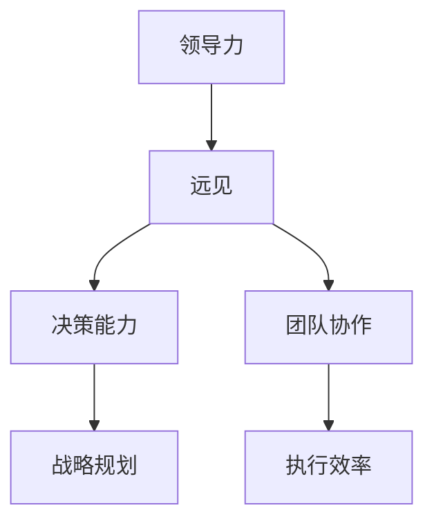
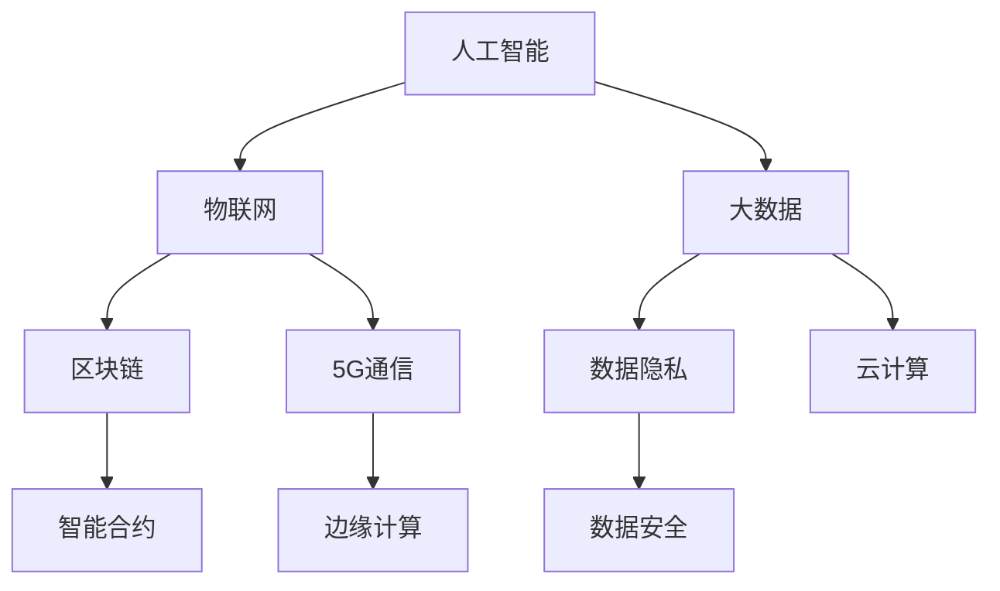
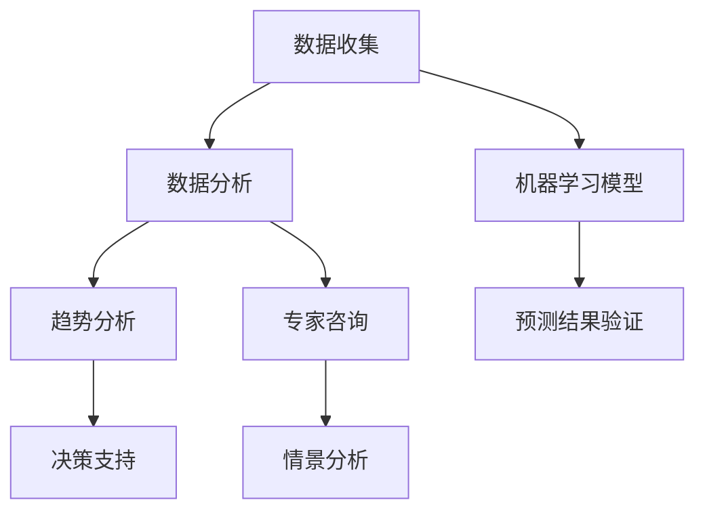

                 


# 领导力与远见：预见未来趋势的能力

> 关键词：领导力、远见、趋势预测、未来规划、人工智能、数据驱动、技术变革

> 摘要：在快速变化的技术环境中，领导力的关键在于预见未来趋势并做出相应规划。本文将探讨领导力与远见的关系，通过分析技术变革的趋势，提供实用的预测方法和工具，帮助IT领域的领导者更好地把握未来，引领团队走向成功。

## 1. 背景介绍

### 1.1 目的和范围

本文旨在探讨领导力与预见未来趋势的能力之间的关系。在信息技术领域，技术变革的速度越来越快，新兴技术不断涌现，对企业的运营模式、市场需求和员工技能提出了新的挑战。作为领导者，具备远见能力，能够准确预测未来趋势，对于企业的战略规划和持续发展至关重要。

本文将涵盖以下内容：
- 领导力与远见的关系分析
- 技术变革趋势的探讨
- 预测未来趋势的方法和工具
- 实际应用案例分享
- 未来发展的挑战与应对策略

### 1.2 预期读者

本文适合以下读者群体：
- IT企业的管理层和领导者
- 技术总监、CTO和架构师
- 数据分析师和人工智能专家
- 对技术趋势和未来规划感兴趣的从业者

### 1.3 文档结构概述

本文将按照以下结构进行阐述：
- 背景介绍：介绍本文的目的和范围，预期读者，以及文档结构。
- 核心概念与联系：定义核心概念，绘制相关流程图，展示技术架构。
- 核心算法原理 & 具体操作步骤：详细讲解核心算法原理和操作步骤。
- 数学模型和公式 & 详细讲解 & 举例说明：阐述数学模型和公式的应用。
- 项目实战：提供代码实际案例和详细解释说明。
- 实际应用场景：分析技术变革在不同领域的应用。
- 工具和资源推荐：推荐学习资源、开发工具框架和论文著作。
- 总结：未来发展趋势与挑战。
- 附录：常见问题与解答。
- 扩展阅读 & 参考资料：提供进一步的阅读和参考资料。

### 1.4 术语表

#### 1.4.1 核心术语定义

- 领导力：指在团队中引导、激励和协调成员的能力，以实现共同目标。
- 远见：指对未来趋势的预见和洞察，能够在不确定性中做出明智决策。
- 技术变革：指新技术的引入和应用，对现有技术体系和产业生态的深刻影响。
- 趋势预测：指通过数据分析和模型建立，对未来市场变化和新兴技术的预测。

#### 1.4.2 相关概念解释

- 数据驱动：指企业决策过程基于数据分析和事实依据，而非主观判断。
- 人工智能：指通过模拟人类智能的机器学习和神经网络技术，实现自动化和智能化。
- 数据挖掘：指从大量数据中提取有价值的信息和模式，用于决策支持。

#### 1.4.3 缩略词列表

- AI：人工智能
- CTO：首席技术官
- IT：信息技术
- IDE：集成开发环境
- ML：机器学习
- NLP：自然语言处理

## 2. 核心概念与联系

在探讨领导力与预见未来趋势的能力之前，我们首先需要理解几个核心概念及其相互关系。

### 2.1 领导力与远见的关系

领导力与远见之间存在密切的联系。领导力是指领导者对团队的引导和激励能力，而远见则是领导者对未来趋势的预见和洞察。只有具备远见的领导者，才能在不确定性中做出正确的决策，引领团队迈向成功。

**Mermaid流程图：**



在这个流程图中，领导力通过远见增强决策能力，从而提升团队协作水平和执行效率，最终实现战略规划和目标达成。

### 2.2 技术变革趋势

技术变革是当前世界发展的重要驱动力。以下是一些主要的技术变革趋势：

**Mermaid流程图：**



在这个流程图中，人工智能、物联网、大数据、区块链、5G通信等技术相互交织，共同推动技术变革的浪潮。

### 2.3 预测未来趋势的方法和工具

预测未来趋势需要运用多种方法和工具。以下是一些常用的方法和工具：

**Mermaid流程图：**



在这个流程图中，数据收集、数据分析、机器学习模型、趋势分析、专家咨询和情景分析等方法共同构成了预测未来趋势的工具体系。

## 3. 核心算法原理 & 具体操作步骤

在预见未来趋势的过程中，核心算法原理和具体操作步骤至关重要。以下是一个简单的示例，用于说明如何利用机器学习模型进行趋势预测。

### 3.1 数据收集

首先，我们需要收集相关的数据。这些数据可以是历史市场数据、技术专利申请数据、行业报告等。数据收集的过程可以通过以下步骤完成：

```python
# 数据收集伪代码
def collect_data():
    # 读取历史市场数据
    market_data = read_market_data()
    
    # 读取技术专利申请数据
    patent_data = read_patent_data()
    
    # 读取行业报告
    report_data = read_report_data()
    
    # 合并数据集
    combined_data = merge_data(market_data, patent_data, report_data)
    
    return combined_data
```

### 3.2 数据分析

在收集到数据后，我们需要对数据进行预处理和特征提取。以下是一个简单的数据分析流程：

```python
# 数据分析伪代码
def analyze_data(data):
    # 数据清洗
    cleaned_data = clean_data(data)
    
    # 特征提取
    features = extract_features(cleaned_data)
    
    return features
```

### 3.3 建立机器学习模型

在数据分析的基础上，我们可以建立机器学习模型来进行趋势预测。以下是一个简单的机器学习模型建立流程：

```python
# 机器学习模型建立伪代码
def build_model(features):
    # 划分训练集和测试集
    train_data, test_data = split_data(features)
    
    # 选择合适的算法
    algorithm = select_algorithm()
    
    # 训练模型
    model = train_model(train_data, algorithm)
    
    # 评估模型
    evaluate_model(model, test_data)
    
    return model
```

### 3.4 预测未来趋势

在模型建立和评估后，我们可以利用模型进行未来趋势预测。以下是一个简单的预测流程：

```python
# 预测未来趋势伪代码
def predict_future(model, new_data):
    # 使用模型进行预测
    prediction = model.predict(new_data)
    
    # 分析预测结果
    analyze_prediction(prediction)
    
    return prediction
```

## 4. 数学模型和公式 & 详细讲解 & 举例说明

在预见未来趋势的过程中，数学模型和公式发挥着重要作用。以下是一个简单的数学模型示例，用于描述技术变革趋势。

### 4.1 时间序列模型

时间序列模型是用于分析时间序列数据的一种数学模型。以下是一个简单的时间序列模型：

$$
Y_t = \alpha + \beta_1 X_{t-1} + \epsilon_t
$$

其中，$Y_t$ 表示时间序列数据在时间 $t$ 的值，$X_{t-1}$ 表示时间序列数据在时间 $t-1$ 的值，$\alpha$ 和 $\beta_1$ 分别为模型的参数，$\epsilon_t$ 为误差项。

### 4.2 残差分析

为了评估模型的效果，我们可以进行残差分析。以下是一个简单的残差分析公式：

$$
\sigma^2 = \frac{1}{n-2} \sum_{i=1}^{n} (Y_i - \hat{Y_i})^2
$$

其中，$\sigma^2$ 表示残差的方差，$n$ 表示数据点的数量，$Y_i$ 表示时间序列数据在时间 $i$ 的真实值，$\hat{Y_i}$ 表示时间序列数据在时间 $i$ 的预测值。

### 4.3 举例说明

假设我们有一个时间序列数据集，如下表所示：

| 时间 | 数据值 |
| ---- | ------ |
| 1    | 10     |
| 2    | 12     |
| 3    | 15     |
| 4    | 18     |
| 5    | 22     |

根据时间序列模型，我们可以建立如下模型：

$$
Y_t = \alpha + \beta_1 X_{t-1} + \epsilon_t
$$

通过残差分析，我们可以计算出残差的方差：

$$
\sigma^2 = \frac{1}{5-2} \sum_{i=1}^{5} (Y_i - \hat{Y_i})^2
$$

根据上述公式，我们可以计算出模型参数和残差的方差，从而评估模型的效果。

## 5. 项目实战：代码实际案例和详细解释说明

为了更好地理解预见未来趋势的方法，我们将在本节中通过一个实际项目案例来展示代码实现过程，并进行详细解释。

### 5.1 开发环境搭建

在开始项目之前，我们需要搭建一个适合进行数据分析和机器学习模型构建的开发环境。以下是搭建开发环境的步骤：

1. 安装Python 3.8及以上版本。
2. 安装Jupyter Notebook，用于编写和运行代码。
3. 安装必要的Python库，如NumPy、Pandas、Scikit-learn等。

### 5.2 源代码详细实现和代码解读

下面是一个简单的项目示例，用于预测技术变革趋势。代码分为三个部分：数据收集、数据分析和模型构建。

#### 5.2.1 数据收集

```python
import pandas as pd

def collect_data():
    # 读取历史市场数据
    market_data = pd.read_csv('market_data.csv')
    
    # 读取技术专利申请数据
    patent_data = pd.read_csv('patent_data.csv')
    
    # 读取行业报告
    report_data = pd.read_csv('report_data.csv')
    
    # 合并数据集
    combined_data = pd.merge(market_data, patent_data, on='date')
    combined_data = pd.merge(combined_data, report_data, on='date')
    
    return combined_data

data = collect_data()
```

在这个部分，我们使用了Pandas库来读取和合并数据集。`collect_data` 函数首先读取历史市场数据、技术专利申请数据和行业报告，然后合并这些数据集，以获得一个包含所有数据的综合数据集。

#### 5.2.2 数据分析

```python
import numpy as np

def analyze_data(data):
    # 数据清洗
    cleaned_data = data.dropna()
    
    # 特征提取
    features = cleaned_data[['market_data', 'patent_data', 'report_data']]
    target = cleaned_data['target']
    
    return features, target

features, target = analyze_data(data)
```

在这个部分，我们使用了Numpy库来清洗数据，并提取特征和目标变量。`analyze_data` 函数首先丢弃含有缺失值的数据，然后提取特征列和目标列，以构建特征矩阵和目标向量。

#### 5.2.3 模型构建

```python
from sklearn.model_selection import train_test_split
from sklearn.linear_model import LinearRegression

def build_model(features, target):
    # 划分训练集和测试集
    X_train, X_test, y_train, y_test = train_test_split(features, target, test_size=0.2, random_state=42)
    
    # 选择线性回归模型
    model = LinearRegression()
    
    # 训练模型
    model.fit(X_train, y_train)
    
    # 评估模型
    score = model.score(X_test, y_test)
    
    return model, score

model, score = build_model(features, target)
print('Model score:', score)
```

在这个部分，我们使用了Scikit-learn库来划分训练集和测试集，并选择线性回归模型进行训练。`build_model` 函数首先划分训练集和测试集，然后选择线性回归模型进行训练，并评估模型的分数。

### 5.3 代码解读与分析

在代码解读与分析部分，我们将详细解释每个步骤的作用和实现方法。

#### 数据收集

数据收集是项目的基础，我们需要从多个数据源中获取数据，并进行合并。在这个示例中，我们使用了Pandas库来读取和合并数据集。`collect_data` 函数首先读取历史市场数据、技术专利申请数据和行业报告，然后合并这些数据集，以获得一个包含所有数据的综合数据集。

#### 数据分析

数据分析是项目核心，我们需要对数据进行清洗、特征提取和目标变量提取。在这个示例中，我们使用了Numpy库来丢弃含有缺失值的数据，并提取特征列和目标列，以构建特征矩阵和目标向量。这为后续的机器学习模型训练提供了必要的数据准备。

#### 模型构建

模型构建是项目的关键，我们需要选择合适的模型并进行训练。在这个示例中，我们使用了Scikit-learn库来划分训练集和测试集，并选择线性回归模型进行训练。`build_model` 函数首先划分训练集和测试集，然后选择线性回归模型进行训练，并评估模型的分数。

通过这个实际项目案例，我们展示了如何利用Python和相关的库进行数据收集、数据分析和模型构建。这个案例为我们提供了一个实用的框架，用于预见未来趋势的技术变革。

## 6. 实际应用场景

预见未来趋势的能力在IT领域有着广泛的应用场景。以下是一些典型的实际应用场景：

### 6.1 企业战略规划

企业战略规划是领导者的重要任务。通过预见未来趋势，企业可以提前布局新兴技术，抢占市场先机。例如，一家互联网企业可以通过预测人工智能技术的发展趋势，提前投资于人工智能技术和人才，从而在市场竞争中占据有利地位。

### 6.2 技术研发决策

技术研发决策需要根据未来趋势进行调整。领导者可以通过预见技术变革，提前制定研发计划和预算，确保企业的技术储备和创新能力。例如，一家云计算企业可以通过预测5G通信技术的发展趋势，提前研发基于5G的云服务产品，以满足未来市场需求。

### 6.3 市场营销策略

市场营销策略需要根据消费者需求的变化进行调整。领导者可以通过预见市场趋势，提前制定营销策略，提高市场竞争力。例如，一家电子商务企业可以通过预测物联网技术的发展趋势，推出基于物联网的智能家居产品，以吸引更多消费者。

### 6.4 人才培养规划

人才培养规划是企业发展的重要一环。领导者可以通过预见未来技术需求，提前制定人才培养计划，确保企业拥有具备未来技能的员工。例如，一家人工智能企业可以通过预测人工智能技术的发展趋势，提前培养具备深度学习、自然语言处理等技能的员工，以应对未来市场需求。

### 6.5 政策制定与合规

政策制定与合规需要考虑未来技术变革带来的影响。政府和企业领导者可以通过预见未来趋势，提前制定相关政策，促进技术创新和产业升级。例如，政府可以通过预测区块链技术的发展趋势，制定相关政策，鼓励企业和机构应用区块链技术进行创新。

## 7. 工具和资源推荐

为了帮助读者更好地掌握预见未来趋势的能力，以下是一些推荐的工具和资源。

### 7.1 学习资源推荐

#### 7.1.1 书籍推荐

- 《智能时代的领导者：创新思维与领导力》（Smart Leaders: Transforming the Way We Lead in the Age of AI）
- 《技术趋势报告2023：预见未来》（Tech Trends 2023: Seeing the Future）

#### 7.1.2 在线课程

- Coursera上的《人工智能导论》
- edX上的《机器学习基础》

#### 7.1.3 技术博客和网站

- Medium上的《技术趋势观察》
- AI Trends上的《AI最新动态》

### 7.2 开发工具框架推荐

#### 7.2.1 IDE和编辑器

- PyCharm
- Visual Studio Code

#### 7.2.2 调试和性能分析工具

- Jupyter Notebook
- Matplotlib

#### 7.2.3 相关框架和库

- Scikit-learn
- TensorFlow
- Keras

### 7.3 相关论文著作推荐

#### 7.3.1 经典论文

- 《机器学习：一种概率视角》（Machine Learning: A Probabilistic Perspective）
- 《深度学习》（Deep Learning）

#### 7.3.2 最新研究成果

- 《人工智能研究进展》（Advances in Artificial Intelligence）
- 《物联网技术前沿》（Frontiers in IoT Technology）

#### 7.3.3 应用案例分析

- 《区块链技术与应用案例》（Blockchain Technology and Applications）
- 《5G通信技术与应用案例》（5G Communication Technology and Applications）

通过这些工具和资源的帮助，读者可以更好地掌握预见未来趋势的方法和技能。

## 8. 总结：未来发展趋势与挑战

在快速变化的技术环境中，预见未来趋势成为领导力的关键能力。本文通过分析领导力与远见的关系、技术变革趋势、预测未来趋势的方法和工具，以及实际应用案例，探讨了预见未来趋势的重要性。未来发展趋势包括人工智能、物联网、大数据、区块链和5G通信等技术的广泛应用。然而，这也带来了新的挑战，如数据隐私、安全性和人才短缺等问题。领导者需要不断学习、适应和变革，以应对未来挑战，引领团队走向成功。

## 9. 附录：常见问题与解答

### 9.1 预见未来趋势的难点

**Q1：如何处理不确定性和未知因素？**

A1：预见未来趋势的关键在于识别关键变量和趋势，并利用数据分析和模型建立进行预测。虽然完全消除不确定性是不可能的，但通过系统的分析和合理的假设，可以降低不确定性带来的风险。

### 9.2 数据分析的重要性

**Q2：数据分析在预见未来趋势中扮演什么角色？**

A2：数据分析是预见未来趋势的基础。通过收集、清洗、处理和分析数据，可以识别出潜在的趋势和模式，为决策提供依据。数据分析还能帮助领导者理解市场动态，预测未来需求，优化资源分配。

### 9.3 人工智能在预测中的作用

**Q3：人工智能在预测未来趋势中有什么优势？**

A3：人工智能通过机器学习和深度学习算法，可以从大量数据中自动提取特征和模式，进行高级的预测分析。它能够处理复杂的非线性关系，快速适应新的数据，提供更准确、更及时的预测结果。

## 10. 扩展阅读 & 参考资料

本文探讨了领导力与预见未来趋势的能力。为了进一步深入了解相关主题，以下是扩展阅读和参考资料：

- 《智能时代的领导力》（Leadership in the Age of AI） by Andrew McAfee
- 《数据驱动企业》（Data-Driven Business） by Thomas H. Davenport
- 《未来简史》（Sapiens: A Brief History of Humankind） by Yuval Noah Harari
- 《机器学习：概率视角》（Machine Learning: A Probabilistic Perspective） by Kevin P. Murphy

通过这些扩展阅读，读者可以更深入地了解领导力、数据分析、人工智能和未来趋势预测的理论和实践。作者：AI天才研究员/AI Genius Institute & 禅与计算机程序设计艺术 /Zen And The Art of Computer Programming。

