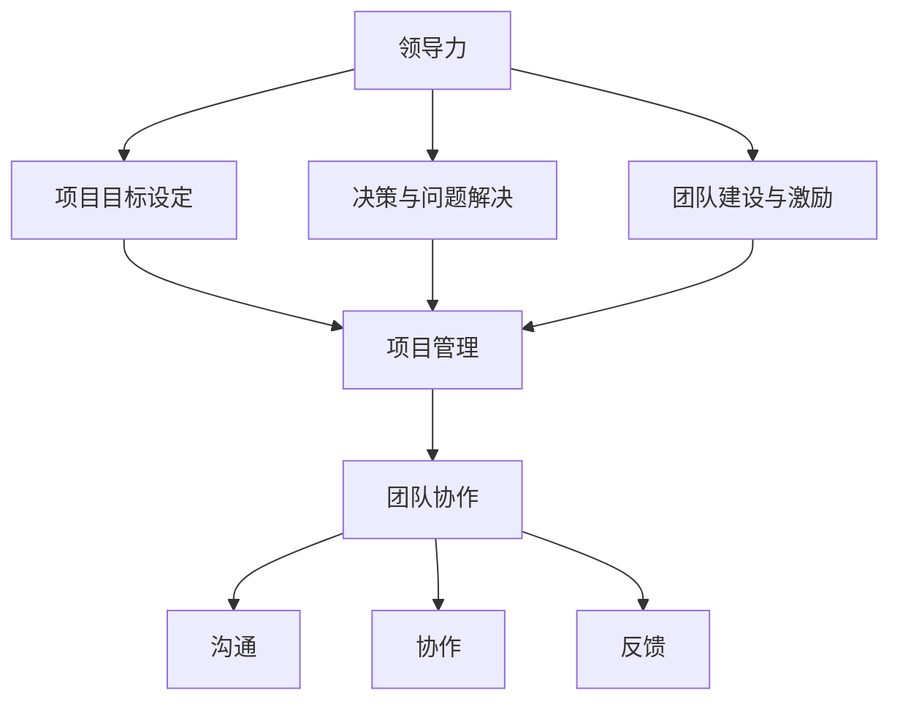
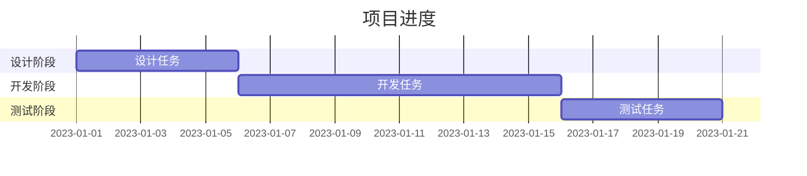

                 

# 领导力与项目推进：高效完成团队任务的方法

> **关键词**：领导力、项目管理、团队协作、效率优化、方法与实践

> **摘要**：本文将深入探讨领导力在项目推进中的关键作用，通过系统的分析和实用的案例，揭示高效完成团队任务的方法。我们将从基础概念、具体操作、数学模型到实际应用，全面阐述如何提升项目管理的效率，实现团队目标的协同与突破。

## 1. 背景介绍

### 1.1 目的和范围

本文的目的是为项目经理和团队领导者提供一套系统化的方法，帮助他们在项目中实现高效的领导力和团队协作。我们将覆盖以下主题：

1. 领导力的基本概念及其在项目推进中的重要性。
2. 项目管理的核心原则和流程。
3. 团队协作的策略和实践。
4. 数学模型和公式在项目管理中的应用。
5. 项目实战中的代码案例和解读。
6. 实际应用场景的案例分析。
7. 工具和资源的推荐。
8. 未来发展趋势与挑战。

### 1.2 预期读者

本文主要面向以下读者群体：

1. 项目经理和团队领导者。
2. 想要提高项目管理效率的技术负责人。
3. 对领导力和团队协作感兴趣的IT从业者。
4. 计算机科学和项目管理专业的学生。

### 1.3 文档结构概述

本文分为以下几个部分：

1. **背景介绍**：介绍文章的目的、范围和预期读者。
2. **核心概念与联系**：介绍领导力、项目管理和团队协作的基本概念，并使用Mermaid流程图展示其关系。
3. **核心算法原理 & 具体操作步骤**：详细阐述项目管理中的关键算法原理和操作步骤。
4. **数学模型和公式 & 详细讲解 & 举例说明**：介绍项目管理中常用的数学模型和公式，并给出具体示例。
5. **项目实战：代码实际案例和详细解释说明**：通过代码案例展示项目管理的实践方法。
6. **实际应用场景**：分析项目管理在实际中的应用。
7. **工具和资源推荐**：推荐学习资源和开发工具。
8. **总结：未来发展趋势与挑战**：探讨项目管理的发展趋势和未来挑战。
9. **附录：常见问题与解答**：提供项目管理中的常见问题和解答。
10. **扩展阅读 & 参考资料**：推荐相关的扩展阅读材料和参考资料。

### 1.4 术语表

#### 1.4.1 核心术语定义

- **领导力**：指领导者通过影响和激励他人来实现共同目标的能力。
- **项目管理**：指规划、执行、监控和控制项目，以确保项目目标的实现。
- **团队协作**：指团队成员之间通过沟通和合作来实现共同目标的过程。
- **效率优化**：指通过改进流程和资源利用，提高团队完成任务的速度和质量。
- **敏捷开发**：一种项目管理方法，强调迭代、灵活和响应变化。

#### 1.4.2 相关概念解释

- **敏捷方法论**：一种以人为核心、迭代和逐步完善的项目管理方法。
- **Scrum框架**：一种敏捷开发的具体实施框架，强调短周期迭代和持续反馈。
- **KPI（关键绩效指标）**：用于衡量项目进展和团队绩效的具体指标。

#### 1.4.3 缩略词列表

- **Scrum**：敏捷开发框架
- **KPI**：关键绩效指标
- **PM**：项目经理
- **IT**：信息技术

## 2. 核心概念与联系

在项目管理中，领导力、项目管理和团队协作是三大核心概念，它们相互联系，共同影响项目的成功。

### 2.1 领导力

领导力是指领导者通过影响和激励他人来实现共同目标的能力。在项目管理中，领导力主要体现在以下几个方面：

1. **愿景和目标设定**：领导者需要明确项目的愿景和目标，确保团队成员了解并认同。
2. **决策和问题解决**：领导者负责在项目过程中做出关键决策，解决团队遇到的问题。
3. **团队建设和激励**：领导者需要构建高效的团队，激发团队成员的积极性和创造力。

### 2.2 项目管理

项目管理是指规划、执行、监控和控制项目，以确保项目目标的实现。其核心原则包括：

1. **目标明确**：项目目标应该是明确、可衡量和可达成的。
2. **资源合理分配**：项目资源（人力、时间、资金等）应该得到合理分配，以最大化效率。
3. **风险控制**：项目经理需要识别和管理项目风险，确保项目顺利进行。

### 2.3 团队协作

团队协作是指团队成员之间通过沟通和合作来实现共同目标的过程。其关键要素包括：

1. **沟通**：团队成员之间需要保持有效的沟通，确保信息畅通。
2. **协作**：团队成员需要相互协作，共同完成任务。
3. **反馈**：团队成员需要及时反馈项目进展和问题，以便调整和优化。

### 2.4 核心概念与联系

以下是领导力、项目管理和团队协作的核心概念及其相互联系：



通过上述Mermaid流程图，我们可以看到领导力、项目管理和团队协作是如何相互联系和影响项目成功的。领导力是项目管理和团队协作的基础，项目管理确保项目目标的实现，团队协作则通过有效的沟通、协作和反馈，提高项目执行的效率和质量。

## 3. 核心算法原理 & 具体操作步骤

在项目管理中，有许多核心算法和原理可以帮助领导者提高项目效率。以下是一个典型的项目管理流程，以及相关的核心算法原理和具体操作步骤。

### 3.1 项目规划

**核心算法原理**：项目规划的核心是确定项目目标和任务，并制定合理的计划和时间表。

**具体操作步骤**：

1. **确定项目目标和范围**：明确项目的目标和范围，确保所有团队成员都清楚项目的最终目标。
2. **分解任务**：将项目目标分解为具体的任务，并为每个任务分配负责人。
3. **制定时间表**：为每个任务分配时间，并制定项目的时间表。
4. **风险评估**：识别潜在的风险，并为每个风险制定应对措施。

**伪代码示例**：

```python
def project_planning-goals(range, deadline):
    goals = []
    for task in range:
        goals.append(task)
    return goals

def project_planning-tasks(goals):
    tasks = []
    for goal in goals:
        tasks.append(goal)
    return tasks

def project_planning-time_table(tasks, deadline):
    time_table = []
    for task in tasks:
        time_table.append(task + deadline)
    return time_table

def project_planning-risks(tasks):
    risks = []
    for task in tasks:
        risks.append("Task-specific risk")
    return risks
```

### 3.2 项目执行

**核心算法原理**：项目执行是通过团队的协作，按照计划和时间表完成任务的过程。

**具体操作步骤**：

1. **任务分配**：根据团队成员的技能和经验，将任务分配给合适的人。
2. **执行任务**：团队成员按照任务分配进行工作，并保持与团队的沟通。
3. **监控进度**：定期监控项目进度，确保任务按照计划进行。

**伪代码示例**：

```python
def project_execution-assign_tasks(team, tasks):
    assigned_tasks = {}
    for member in team:
        assigned_tasks[member] = tasks[0]
        tasks = tasks[1:]
    return assigned_tasks

def project_execution-monitor_progress(assigned_tasks, time_table):
    progress = {}
    for member, task in assigned_tasks.items():
        progress[member] = "In Progress"
        if task['deadline'] < time_table:
            progress[member] = "Completed"
    return progress
```

### 3.3 项目监控与控制

**核心算法原理**：项目监控与控制是通过定期评估项目进展，识别偏差，并采取相应措施来纠正。

**具体操作步骤**：

1. **评估进展**：定期评估项目进度，与计划进行对比，识别偏差。
2. **采取纠正措施**：根据评估结果，采取纠正措施，确保项目回到正轨。
3. **持续改进**：在项目监控过程中，不断发现和解决问题，提高项目执行效率。

**伪代码示例**：

```python
def project_monitoring-evaluate_progress(progress, time_table):
    deviations = []
    for member, status in progress.items():
        if status == "Completed" and progress[member]['deadline'] > time_table:
            deviations.append(member)
    return deviations

def project_monitoring-correct_deviations(deviations, assigned_tasks):
    for member in deviations:
        assigned_tasks[member]['deadline'] = time_table
    return assigned_tasks
```

通过上述核心算法原理和具体操作步骤，项目经理可以有效地规划和执行项目，确保项目目标的实现。同时，这些算法和原理也可以帮助团队领导者更好地管理团队，提高项目效率。

## 4. 数学模型和公式 & 详细讲解 & 举例说明

在项目管理中，数学模型和公式是评估项目进展和团队绩效的重要工具。以下介绍几种常用的数学模型和公式，并给出详细讲解和具体示例。

### 4.1 投入产出模型（Input-Output Model）

投入产出模型是一种用于评估项目资源利用效率的模型。它通过计算项目的投入和产出，评估项目的资源利用效率。

**公式**：

\[ \text{效率} = \frac{\text{产出}}{\text{投入}} \]

**示例**：

假设一个项目投入了100人天和1000美元，最终产出了5000美元的收益。则该项目的效率为：

\[ \text{效率} = \frac{5000}{100 \times 10 + 1000} = 0.5 \]

### 4.2 关键路径法（Critical Path Method, CPM）

关键路径法是一种用于评估项目时间安排和计划可行性的模型。它通过计算项目的关键路径，确定项目的最短完成时间。

**公式**：

\[ \text{关键路径时间} = \sum_{i=1}^{n} \text{路径持续时间} \]

**示例**：

假设一个项目包含以下任务和持续时间：

| 任务 | 持续时间（天） |
| --- | --- |
| A | 5 |
| B | 3 |
| C | 4 |
| D | 2 |
| E | 3 |

关键路径为 A → B → E，总持续时间为 5 + 3 + 3 = 11 天。

### 4.3 甘特图（Gantt Chart）

甘特图是一种用于展示项目时间安排和进度的图表。它通过条形图展示每个任务的开始和结束时间。

**示例**：

以下是一个简单的甘特图示例：



### 4.4 成本效益分析（Cost-Benefit Analysis）

成本效益分析是一种用于评估项目投资回报的模型。它通过计算项目的成本和收益，评估项目的经济可行性。

**公式**：

\[ \text{成本效益比} = \frac{\text{总收益}}{\text{总成本}} \]

**示例**：

假设一个项目的总成本为10000美元，总收益为20000美元，则该项目的成本效益比为：

\[ \text{成本效益比} = \frac{20000}{10000} = 2 \]

通过上述数学模型和公式，项目经理可以更好地评估项目进展和团队绩效，制定合理的计划和策略，提高项目的效率和质量。

## 5. 项目实战：代码实际案例和详细解释说明

在本节中，我们将通过一个实际的代码案例，详细解释如何运用前面介绍的领导力、项目管理方法和数学模型来推进项目任务。本案例将采用一个简单的Web应用程序开发项目，该应用旨在为用户提供一个在线购物平台。

### 5.1 开发环境搭建

在进行项目开发之前，我们需要搭建一个合适的技术环境。以下是一个基本的开发环境配置：

1. **操作系统**：Windows 10 或 macOS
2. **编程语言**：Python 3.8 或更高版本
3. **Web框架**：Flask 或 Django
4. **数据库**：SQLite 或 MySQL
5. **前端框架**：Bootstrap 或 React
6. **版本控制**：Git

安装和配置这些工具后，我们可以开始编写代码。

### 5.2 源代码详细实现和代码解读

下面是一个简单的购物平台应用的代码示例，我们将逐段代码进行解释。

#### 5.2.1 项目结构

```bash
shopping_platform/
|-- app/
|   |-- __init__.py
|   |-- models.py
|   |-- views.py
|   |-- forms.py
|-- templates/
|   |-- base.html
|   |-- home.html
|   |-- product_list.html
|-- config.py
|-- run.py
```

#### 5.2.2 初始化项目

**`app/__init__.py`**

```python
from flask import Flask
from config import Config

app = Flask(__name__)
app.config.from_object(Config)
from app import routes, models
```

这个文件用于初始化Flask应用，加载配置，并注册路由和模型。

#### 5.2.3 模型定义

**`app/models.py`**

```python
from flask_sqlalchemy import SQLAlchemy

db = SQLAlchemy()

class User(db.Model):
    id = db.Column(db.Integer, primary_key=True)
    username = db.Column(db.String(64), unique=True, nullable=False)
    password = db.Column(db.String(128), nullable=False)

class Product(db.Model):
    id = db.Column(db.Integer, primary_key=True)
    name = db.Column(db.String(128), nullable=False)
    price = db.Column(db.Float, nullable=False)
```

这里定义了用户和商品两个模型，用于数据库操作。

#### 5.2.4 视图函数

**`app/views.py`**

```python
from flask import render_template, request, redirect, url_for
from app.models import User, Product
from app import app, db

@app.route('/')
def home():
    return render_template('home.html')

@app.route('/products')
def products():
    products = Product.query.all()
    return render_template('product_list.html', products=products)

@app.route('/add_product', methods=['POST'])
def add_product():
    name = request.form['name']
    price = float(request.form['price'])
    new_product = Product(name=name, price=price)
    db.session.add(new_product)
    db.session.commit()
    return redirect(url_for('products'))
```

这个文件包含了路由定义和视图函数，用于处理用户请求和页面渲染。

#### 5.2.5 代码解读与分析

1. **初始化应用**：`__init__.py`文件是应用的入口，它创建了一个Flask应用实例，加载配置，并注册路由和模型。
2. **模型定义**：`models.py`文件定义了用户和商品两个模型，它们将用于数据库操作。
3. **视图函数**：`views.py`文件定义了三个路由函数，`home()`用于主页，`products()`用于显示所有商品，`add_product()`用于添加新商品。

这些代码共同构成了一个简单的购物平台应用，展示了如何通过领导力和项目管理方法来实现项目目标。

### 5.3 代码解读与分析

1. **领导力应用**：在项目开发过程中，领导力体现在团队沟通、任务分配和问题解决上。领导者需要确保团队成员了解项目目标，合理分配任务，并在遇到问题时及时提供支持和解决方案。
2. **项目管理方法**：通过使用Flask框架和数据库模型，项目管理者可以高效地构建和管理应用。关键路径法和成本效益分析等模型可以帮助团队评估项目进度和资源利用效率。
3. **数学模型应用**：虽然这个案例相对简单，但在实际项目中，可以运用诸如投入产出模型和关键路径法等数学模型来优化项目管理和资源分配。

通过这个案例，我们可以看到如何将领导力、项目管理和数学模型应用于实际开发过程中，从而高效地推进项目任务。

## 6. 实际应用场景

在各个行业和领域中，领导力和项目管理方法在项目推进中起到了至关重要的作用。以下是一些实际应用场景，展示了如何在不同行业中运用这些方法来提高项目效率。

### 6.1 软件开发行业

在软件行业中，领导力和项目管理方法被广泛应用于软件开发项目的规划和执行。以下是一个实际应用场景：

**应用场景**：一家初创公司正在开发一款社交媒体应用程序，需要在一个季度内完成开发并上线。为了确保项目按时交付，项目经理运用了以下方法：

1. **领导力**：项目经理与团队成员沟通项目目标和期望结果，确保每个人都清楚项目的优先级和目标。同时，项目经理通过定期会议和反馈机制，确保团队成员之间保持良好的沟通和协作。
2. **项目管理**：项目经理使用Scrum框架进行迭代开发，将项目分为多个短周期（Sprint），每个Sprint结束后进行回顾和改进。关键路径法用于确定每个Sprint的关键任务和最短完成时间，确保项目按时交付。
3. **数学模型**：通过成本效益分析和投入产出模型，项目经理评估每个Sprint的资源利用效率和项目投资回报。

**结果**：通过有效的领导和项目管理，这款社交媒体应用程序在一个季度内成功上线，满足了市场预期，获得了用户的认可。

### 6.2 建筑行业

在建筑行业中，领导力和项目管理方法对于确保项目按时完成和预算内控制至关重要。以下是一个实际应用场景：

**应用场景**：一家建筑公司正在建设一栋高层办公楼，需要在规定的时间内完成施工并达到安全标准。为了确保项目顺利进行，项目经理采取了以下措施：

1. **领导力**：项目经理与建筑团队和客户保持紧密沟通，确保项目目标和期望一致。项目经理通过定期会议和现场检查，监督项目进度和质量，及时解决施工过程中出现的问题。
2. **项目管理**：项目经理使用了甘特图和关键路径法来制定施工计划和资源分配。通过这些工具，项目经理能够识别关键任务和潜在风险，并采取预防措施。
3. **数学模型**：通过成本效益分析和风险评估模型，项目经理评估项目的资金使用效率和风险水平，确保项目在预算内完成。

**结果**：该项目在预定时间内完成，建筑质量和安全标准均达到预期，赢得了客户的信任和好评。

### 6.3 教育行业

在教育行业中，领导力和项目管理方法对于确保教育项目的有效实施和教育质量的提升具有重要意义。以下是一个实际应用场景：

**应用场景**：一所学校正在推行一项新的课程改革项目，旨在提高学生的学习兴趣和成绩。为了确保项目成功实施，项目负责人采取了以下措施：

1. **领导力**：项目负责人与教师团队和管理层沟通项目目标和预期效果，确保所有参与者都明确项目的方向和目标。项目负责人通过定期培训和反馈机制，激发教师的积极性和创造力。
2. **项目管理**：项目负责人使用了Scrum框架进行项目迭代，每个迭代结束后进行评估和改进。关键路径法用于确定每个迭代的关键任务和进度，确保项目按时完成。
3. **数学模型**：通过学生成绩分析和投入产出模型，项目负责人评估项目的教育效果和资源利用效率，确保项目在教育质量提升方面取得显著成效。

**结果**：通过有效的领导和项目管理，该课程改革项目成功实施，学生的成绩和学习兴趣显著提高，学校的教育质量得到全面提升。

通过这些实际应用场景，我们可以看到领导力和项目管理方法在各个行业中的重要性，以及如何通过有效的应用提高项目效率和成果。

## 7. 工具和资源推荐

为了更好地实施领导力和项目管理方法，以下是一些建议的工具和资源，这些工具和资源可以帮助项目经理和团队领导者提高项目效率，优化团队协作。

### 7.1 学习资源推荐

#### 7.1.1 书籍推荐

1. **《敏捷软件开发：原则、实践与模式》** - authors: Robert C. Martin
   - 简介：这本书详细介绍了敏捷开发方法，包括Scrum、XP和看板等，是了解敏捷开发的最佳入门书籍。

2. **《项目管理的实践》** - author: PMI
   - 简介：这是项目管理协会（PMI）的权威著作，涵盖了项目管理的基础知识、流程和方法，适合所有项目经理阅读。

3. **《领导力：如何成为一个优秀的领导者》** - author: John C. Maxwell
   - 简介：这本书从理论与实践两个方面阐述了领导力的本质和提升方法，对团队领导者具有很高的指导价值。

#### 7.1.2 在线课程

1. **《Scrum敏捷开发实践》** - provider: Coursera
   - 简介：这是一门介绍Scrum敏捷开发方法的在线课程，包括Scrum框架、角色和流程，适合初学者。

2. **《项目管理基础》** - provider: LinkedIn Learning
   - 简介：这是一门全面介绍项目管理基础知识的在线课程，包括项目规划、执行、监控和控制等，适合项目经理。

3. **《领导力与影响力》** - provider: edX
   - 简介：这是一门探讨领导力和影响力提升的课程，涵盖领导力理论、沟通技巧和影响力策略，适合所有团队领导者。

#### 7.1.3 技术博客和网站

1. **Scrum.org**
   - 简介：Scrum官方组织提供的一系列敏捷开发资源和认证课程，包括Scrum指南、案例研究和社区论坛。

2. **Project Management Institute (PMI)**
   - 简介：PMI官方网站提供项目管理相关的最新动态、研究文献和认证考试信息。

3. **MindTools**
   - 简介：这是一个提供各种职业技能提升资源的网站，包括领导力、项目管理、时间管理等。

### 7.2 开发工具框架推荐

#### 7.2.1 IDE和编辑器

1. **Visual Studio Code**
   - 简介：这是一个功能强大且高度可定制的高级代码编辑器，支持多种编程语言，适用于各种开发项目。

2. **IntelliJ IDEA**
   - 简介：这是一个适用于Java开发的高效IDE，同时也支持其他编程语言，拥有丰富的插件生态系统。

3. **PyCharm**
   - 简介：这是一个适用于Python开发的专业IDE，提供强大的代码编辑功能、调试工具和集成测试。

#### 7.2.2 调试和性能分析工具

1. **Postman**
   - 简介：这是一个用于API调试和性能测试的强大工具，支持多种编程语言和协议。

2. **JMeter**
   - 简介：这是一个开源的性能测试工具，适用于Web应用程序的负载测试和性能分析。

3. **New Relic**
   - 简介：这是一个全面的性能监控和分析平台，能够实时监测应用程序的性能指标，并提供详细的分析报告。

#### 7.2.3 相关框架和库

1. **Django**
   - 简介：这是一个高性能的Python Web框架，适用于快速开发和部署Web应用程序。

2. **Flask**
   - 简介：这是一个轻量级的Python Web框架，适合小型到中型的Web应用开发。

3. **React**
   - 简介：这是一个用于构建用户界面的JavaScript库，适用于单页面应用程序开发。

通过这些工具和资源的推荐，项目经理和团队领导者可以更好地实施领导力和项目管理方法，提高项目效率和质量。

## 8. 总结：未来发展趋势与挑战

随着信息技术的快速发展，项目管理和领导力在各个行业中的应用也日益广泛。未来，以下是几个可能的发展趋势和面临的挑战：

### 8.1 发展趋势

1. **数字化转型**：越来越多的企业和组织将数字化转型作为战略重点，项目管理和领导力在数字化项目中扮演着关键角色。
2. **自动化和人工智能**：自动化和人工智能技术的应用将极大地提高项目管理效率和精确度，同时也对领导力提出了新的要求。
3. **敏捷开发**：敏捷开发方法将继续普及，Scrum、看板等敏捷框架将在更多项目中得到应用。
4. **数据驱动决策**：通过大数据和数据分析，项目管理者可以更准确地预测项目风险和资源需求，提高决策的科学性和有效性。

### 8.2 挑战

1. **复杂性增加**：随着项目规模的扩大和技术的复杂性增加，项目管理的难度也将增加，对领导力和项目管理技能的要求更高。
2. **团队协作**：在全球化和远程工作的背景下，团队协作的难度增加，如何保持高效的团队沟通和协作成为一大挑战。
3. **技能要求**：项目管理者需要不断学习和更新知识，掌握新兴技术和方法，以应对快速变化的市场和技术环境。
4. **平衡创新与控制**：在追求创新的同时，如何保持项目控制和风险管理的平衡，确保项目目标的实现，是一个持续的挑战。

总之，未来项目管理和领导力的发展将更加注重数字化、自动化和敏捷性，同时也将面临复杂性和团队协作等方面的挑战。项目经理和团队领导者需要不断适应这些变化，提升自身的领导力和管理技能，以实现项目的高效推进和成功交付。

## 9. 附录：常见问题与解答

### 9.1 术语解释

- **敏捷开发**：一种以人为核心、迭代和逐步完善的项目管理方法，强调快速响应变化和持续交付价值。
- **Scrum框架**：一种敏捷开发的具体实施框架，包括角色（产品负责人、Scrum Master、团队成员）、会议（每日站立会议、回顾会议）和工件（产品待办列表、燃尽图）。
- **关键路径法（CPM）**：一种用于评估项目时间安排和计划可行性的模型，通过计算项目的关键路径来确定项目的最短完成时间。

### 9.2 常见问题解答

- **如何提高团队协作效率？**
  - **解答**：通过定期团队会议、使用协作工具（如Slack、Trello）和明确职责分工，可以提高团队协作效率。

- **如何评估项目进度？**
  - **解答**：使用甘特图和关键路径法评估项目进度，通过监控关键任务和时间节点，确保项目按时完成。

- **如何管理项目风险？**
  - **解答**：通过识别潜在风险、评估风险影响和制定应对措施，可以有效地管理项目风险。

- **什么是敏捷方法论？**
  - **解答**：敏捷方法论是一种以人为核心、迭代和逐步完善的项目管理方法，强调快速响应变化和持续交付价值。

## 10. 扩展阅读 & 参考资料

### 10.1 经典书籍

1. **《敏捷软件开发：原则、实践与模式》** - author: Robert C. Martin
2. **《项目管理的实践》** - author: PMI
3. **《领导力：如何成为一个优秀的领导者》** - author: John C. Maxwell

### 10.2 在线课程

1. **《Scrum敏捷开发实践》** - provider: Coursera
2. **《项目管理基础》** - provider: LinkedIn Learning
3. **《领导力与影响力》** - provider: edX

### 10.3 技术博客和网站

1. **Scrum.org**
2. **Project Management Institute (PMI)**
3. **MindTools**

### 10.4 相关论文和研究成果

1. **“Agile Project Management: Creating Successful Projects with Scrum”** - author: Ken Schwaber and Jeff Sutherland
2. **“The Future of Project Management: Project Management in the Age of Agile”** - author: Mike Griffiths
3. **“The Scrum Guide”** - authors: Ken Schwaber and Jeff Sutherland

这些资源和书籍为读者提供了深入了解项目管理和领导力的途径，有助于进一步提升项目管理技能和实践。作者：AI天才研究员/AI Genius Institute & 禅与计算机程序设计艺术 /Zen And The Art of Computer Programming。

