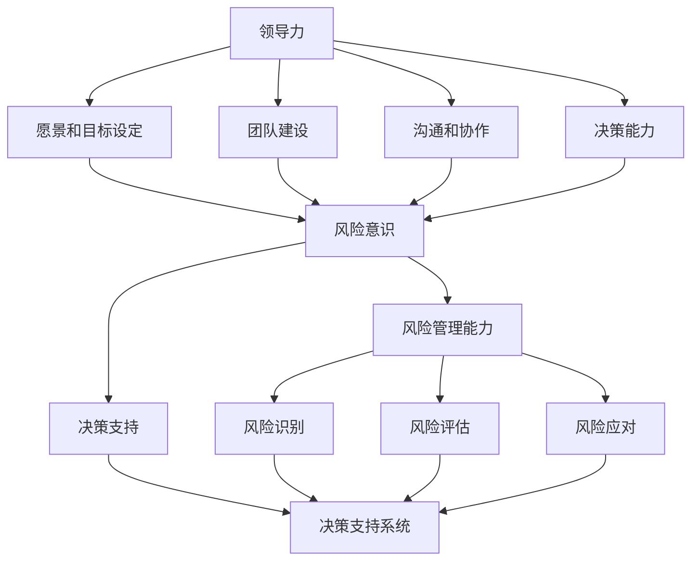

                 

# 领导力与风险智能：在不确定性中识别机遇

> **关键词**：领导力、风险智能、不确定性、机遇识别、决策支持系统、人工智能

> **摘要**：本文深入探讨了领导力与风险智能在不确定性环境下的重要性，分析了领导力如何通过构建高效决策支持系统和运用风险智能来识别机遇。文章首先介绍了领导力和风险智能的核心概念，随后详细阐述了它们在实际应用中的联系和相互作用，并通过实际案例展示了这一过程的具体实施步骤。最后，本文提出了未来发展趋势和挑战，以及常见问题的解答和扩展阅读资源。

## 1. 背景介绍

### 1.1 目的和范围

本文旨在探讨领导力与风险智能在不确定性环境下的相互作用，以及如何通过这两者的结合来识别和把握机遇。我们将重点关注以下几个方面：

1. **领导力的核心要素**：分析领导力在不确定性环境中的作用和重要性。
2. **风险智能的概念**：介绍风险智能的定义、关键组成部分和实际应用。
3. **领导力与风险智能的结合**：探讨如何在不确定环境中利用领导力和风险智能来识别和把握机遇。
4. **决策支持系统的构建**：分析如何通过构建决策支持系统来提高领导力在风险识别和应对方面的效率。
5. **实际应用案例分析**：通过具体案例展示领导力和风险智能在不确定性环境下的实际应用。

### 1.2 预期读者

本文适合以下读者群体：

1. **企业管理者**：帮助领导者了解如何在不确定性环境中运用领导力和风险智能来提升组织竞争力。
2. **风险管理人员**：提供关于风险智能及其在决策支持系统中的应用的详细分析。
3. **计算机科学和人工智能领域的从业者**：探讨领导力和风险智能在人工智能和决策支持系统中的应用。
4. **研究人员和学生**：为研究者和学生提供有关领导力与风险智能的理论和实践参考。

### 1.3 文档结构概述

本文结构如下：

1. **背景介绍**：介绍本文的目的、范围、预期读者和文档结构。
2. **核心概念与联系**：详细阐述领导力、风险智能及其相互关系。
3. **核心算法原理 & 具体操作步骤**：介绍如何通过构建决策支持系统来运用领导力和风险智能。
4. **数学模型和公式 & 详细讲解 & 举例说明**：讲解风险智能中的数学模型和公式。
5. **项目实战：代码实际案例和详细解释说明**：通过实际案例展示领导力和风险智能的应用。
6. **实际应用场景**：分析领导力和风险智能在不同领域的应用。
7. **工具和资源推荐**：推荐相关学习资源、开发工具和框架。
8. **总结：未来发展趋势与挑战**：讨论领导力和风险智能的未来发展趋势和挑战。
9. **附录：常见问题与解答**：回答读者可能遇到的问题。
10. **扩展阅读 & 参考资料**：提供扩展阅读和参考资料。

### 1.4 术语表

#### 1.4.1 核心术语定义

- **领导力**：影响和引导他人达成目标的能力。
- **风险智能**：识别、评估和应对风险的能力。
- **不确定性**：未来可能发生的事件和结果的不确定性。
- **决策支持系统**：帮助决策者识别、分析和解决复杂问题的系统。
- **机遇识别**：发现和利用潜在机遇的过程。

#### 1.4.2 相关概念解释

- **风险管理**：识别、评估和应对潜在风险的过程。
- **人工智能**：模拟人类智能的计算机系统。
- **数据挖掘**：从大量数据中发现有用信息和模式的过程。

#### 1.4.3 缩略词列表

- **AI**：人工智能（Artificial Intelligence）
- **DS**：数据科学（Data Science）
- **ML**：机器学习（Machine Learning）
- **RM**：风险管理（Risk Management）

## 2. 核心概念与联系

为了更好地理解领导力与风险智能在不确定性环境中的相互作用，我们首先需要明确这些核心概念的基本原理和相互关系。

### 2.1 领导力的核心要素

领导力是一种复杂的能力，它包括但不限于以下几个方面：

1. **愿景和目标设定**：领导者需要具备清晰的目标和愿景，并将其传达给团队成员。
2. **团队建设**：领导者需要建立高效的团队，并激发团队成员的潜力。
3. **沟通和协作**：领导者需要具备良好的沟通技巧，促进团队成员之间的协作。
4. **决策能力**：领导者需要能够在不确定性环境中做出明智的决策。

### 2.2 风险智能的概念

风险智能是指组织或个体识别、评估和应对风险的能力。其关键组成部分包括：

1. **风险识别**：发现潜在的风险和威胁。
2. **风险评估**：评估风险的可能性和影响。
3. **风险应对**：制定和实施应对策略，以减轻风险的影响。

### 2.3 领导力与风险智能的相互关系

领导力和风险智能之间存在密切的联系和相互作用。以下是一些关键点：

1. **风险意识**：领导者需要具备一定的风险意识，以便在不确定性环境中做出更明智的决策。
2. **风险管理能力**：领导者需要具备良好的风险管理能力，以确保组织能够有效地应对各种风险。
3. **决策支持**：风险智能可以提供决策支持，帮助领导者做出更明智的决策。
4. **团队合作**：领导者需要通过团队协作，汇集团队成员的风险识别和应对能力。

### 2.4 核心概念原理和架构的 Mermaid 流程图

以下是一个 Mermaid 流程图，用于展示领导力、风险智能和决策支持系统之间的关系：



## 3. 核心算法原理 & 具体操作步骤

在了解了领导力与风险智能的基本概念之后，我们将探讨如何通过构建决策支持系统来运用这些概念，以识别和把握不确定性环境中的机遇。核心算法原理如下：

### 3.1 决策支持系统的构建

决策支持系统（Decision Support System，简称DSS）是一种基于计算机技术的辅助决策系统，旨在帮助决策者识别、分析和解决复杂问题。构建决策支持系统的核心步骤包括：

1. **问题定义**：明确决策支持系统需要解决的问题和目标。
2. **数据收集**：收集与问题相关的数据，包括内部数据和外部数据。
3. **数据预处理**：对收集到的数据进行分析、清洗和转换，以便进行后续处理。
4. **模型选择**：选择合适的模型和方法来分析数据，识别潜在的风险和机遇。
5. **模型训练**：使用历史数据对模型进行训练，以提高其预测准确性和泛化能力。
6. **模型评估**：评估模型的性能，并根据评估结果进行调整和优化。
7. **系统部署**：将构建好的决策支持系统部署到生产环境中，供决策者使用。

### 3.2 风险智能算法

风险智能算法是决策支持系统中关键的一环，其主要目标是识别、评估和应对风险。以下是一个简单的风险智能算法流程：

```plaintext
1. 收集风险数据
2. 风险识别
   a. 数据预处理
   b. 特征提取
   c. 风险识别模型（如决策树、支持向量机等）
3. 风险评估
   a. 风险量化模型（如贝叶斯网络、随机森林等）
   b. 风险评级（如低、中、高）
4. 风险应对
   a. 制定应对策略（如风险规避、风险转移等）
   b. 实施应对策略
```

### 3.3 决策支持算法

决策支持算法旨在为决策者提供基于数据的决策建议。以下是一个简单的决策支持算法流程：

```plaintext
1. 问题定义
2. 数据收集
3. 数据预处理
4. 模型选择
5. 模型训练
6. 模型评估
7. 决策生成
   a. 基于规则的决策生成
   b. 基于数据的决策生成
   c. 基于机器学习的决策生成
8. 决策推荐
9. 决策执行
10. 决策反馈
```

### 3.4 步骤详细解释

#### 3.4.1 问题定义

问题定义是决策支持系统的第一步，也是至关重要的一步。在此阶段，我们需要明确决策支持系统需要解决的问题和目标。这可以通过以下步骤实现：

1. **确定决策问题**：识别需要解决的具体问题。
2. **明确决策目标**：定义决策支持系统需要达成的目标。
3. **收集需求**：与决策者和相关利益相关者沟通，了解他们的需求和期望。

#### 3.4.2 数据收集

数据收集是决策支持系统的核心，其质量直接影响决策的准确性。以下是一些数据收集方法：

1. **内部数据**：从组织内部系统中提取数据，如ERP系统、CRM系统等。
2. **外部数据**：从外部数据源收集数据，如市场研究报告、竞争对手数据等。
3. **用户反馈**：收集用户反馈和需求，以便更好地理解决策问题。

#### 3.4.3 数据预处理

数据预处理是确保数据质量和可用的关键步骤。以下是一些常用的数据预处理方法：

1. **数据清洗**：去除重复数据、错误数据和缺失数据。
2. **数据转换**：将不同格式的数据进行转换，使其适合后续处理。
3. **数据归一化**：将数据缩放到相同的范围，以便进行比较和分析。

#### 3.4.4 模型选择

模型选择是决策支持系统中的关键环节。根据决策问题的特点和需求，选择合适的模型和方法。以下是一些常用的模型和方法：

1. **统计学模型**：如线性回归、逻辑回归、聚类分析等。
2. **机器学习模型**：如决策树、随机森林、支持向量机等。
3. **深度学习模型**：如神经网络、卷积神经网络、循环神经网络等。

#### 3.4.5 模型训练

模型训练是提高模型预测准确性和泛化能力的关键步骤。以下是一些模型训练方法：

1. **训练集选择**：从数据集中划分训练集和测试集。
2. **参数调优**：调整模型参数，以获得更好的预测性能。
3. **交叉验证**：使用交叉验证方法评估模型性能。

#### 3.4.6 模型评估

模型评估是确保模型性能和可靠性的关键步骤。以下是一些常用的模型评估方法：

1. **准确率**：评估模型预测的正确性。
2. **召回率**：评估模型对正例样本的识别能力。
3. **F1分数**：综合考虑准确率和召回率，评估模型的整体性能。

#### 3.4.7 决策生成

决策生成是根据模型预测结果生成决策建议的过程。以下是一些决策生成方法：

1. **基于规则的决策生成**：根据预定义的规则生成决策建议。
2. **基于数据的决策生成**：根据历史数据和模型预测结果生成决策建议。
3. **基于机器学习的决策生成**：利用机器学习算法生成决策建议。

#### 3.4.8 决策推荐

决策推荐是将决策建议呈现给决策者的过程。以下是一些决策推荐方法：

1. **可视化**：使用图表、仪表盘等方式将决策建议呈现给决策者。
2. **文本描述**：使用文本描述决策建议的优缺点。
3. **交互式推荐**：允许决策者与决策建议进行交互，以便更好地理解决策建议。

#### 3.4.9 决策执行

决策执行是将决策建议转化为实际行动的过程。以下是一些决策执行方法：

1. **自动化执行**：使用自动化工具执行决策建议。
2. **人工审核**：由决策者或相关人员对决策建议进行审核。
3. **混合执行**：结合自动化和人工审核，以实现更高效的决策执行。

#### 3.4.10 决策反馈

决策反馈是收集决策结果和反馈的过程，以便对决策支持系统进行持续优化。以下是一些决策反馈方法：

1. **结果记录**：记录决策结果，以便后续分析和评估。
2. **用户反馈**：收集用户对决策建议的反馈，以改进决策支持系统。
3. **模型更新**：根据决策结果和用户反馈，对模型进行更新和优化。

## 4. 数学模型和公式 & 详细讲解 & 举例说明

在风险智能和决策支持系统中，数学模型和公式起着至关重要的作用。以下我们将介绍一些常用的数学模型和公式，并详细讲解其原理和应用。

### 4.1 贝叶斯网络

贝叶斯网络是一种用于表示不确定性知识和推理的图形模型。它通过条件概率表（Conditional Probability Table，简称CPT）来描述变量之间的依赖关系。

#### 贝叶斯网络基本公式：

- **边缘概率分布**：\( P(X) = \prod_{i=1}^{n} P(X_i | X_{i-1}) \)
- **条件概率**：\( P(X_i | X_{i-1}) = \frac{P(X_i, X_{i-1})}{P(X_{i-1})} \)

#### 举例说明：

假设有一个包含三个变量 \( X_1, X_2, X_3 \) 的贝叶斯网络，其中 \( X_2 \) 和 \( X_3 \) 是 \( X_1 \) 的子节点。条件概率表如下：

| X1 | X2 | X3 |
|----|----|----|
| 0  | 0  | 0.5 |
| 0  | 1  | 0.3 |
| 1  | 0  | 0.2 |
| 1  | 1  | 0.3 |

根据上述条件概率表，我们可以计算出各个变量的边缘概率分布：

\[ P(X_1) = P(X_1=0) \cdot P(X_1=1) = (0.5 \cdot 0.3 + 0.2 \cdot 0.3) = 0.225 \]

\[ P(X_2) = P(X_2=0) \cdot P(X_2=1) = (0.5 \cdot 0.5 + 0.3 \cdot 0.2) = 0.35 \]

\[ P(X_3) = P(X_3=0) \cdot P(X_3=1) = (0.5 \cdot 0.2 + 0.3 \cdot 0.3) = 0.215 \]

### 4.2 随机森林

随机森林（Random Forest）是一种基于决策树构建的集成学习模型。它通过随机选择特征和样本子集来构建多个决策树，并使用多数投票来获得最终预测结果。

#### 随机森林基本公式：

- **决策树构建**：使用信息增益（Information Gain）或基尼不纯度（Gini Impurity）来选择最佳特征和划分节点。
- **预测结果**：将所有决策树的预测结果进行投票，获得最终预测结果。

#### 举例说明：

假设我们有一个包含五个特征 \( X_1, X_2, X_3, X_4, X_5 \) 的分类问题，其中每个特征都有两个类别。我们可以使用随机森林来构建分类模型。

首先，我们需要选择最佳特征和划分节点。例如，假设我们选择了特征 \( X_3 \) 作为最佳特征，并划分节点为 \( X_3=0 \) 和 \( X_3=1 \)。

接下来，我们需要构建多个决策树，每个决策树都使用不同的特征和样本子集。假设我们构建了五个决策树，每个决策树的预测结果如下：

| 决策树 | 预测结果 |
|--------|----------|
| 1      | 类别A    |
| 2      | 类别B    |
| 3      | 类别A    |
| 4      | 类别B    |
| 5      | 类别A    |

最后，我们使用多数投票来获得最终预测结果。在这种情况下，有三个决策树预测为类别A，两个决策树预测为类别B，因此最终预测结果为类别A。

### 4.3 神经网络

神经网络（Neural Network）是一种基于生物神经元工作原理构建的计算机模型。它通过多层次的神经网络结构来模拟人类大脑的学习和推理能力。

#### 神经网络基本公式：

- **前向传播**：将输入数据通过神经网络结构进行传递，并计算输出结果。
- **反向传播**：根据输出结果和实际目标值，计算网络权重和偏置的梯度，并更新网络参数。

#### 举例说明：

假设我们有一个简单的单层神经网络，包含一个输入节点、一个隐藏节点和一个输出节点。网络结构如下：

```
输入：X
隐藏：H
输出：Y
```

输入节点 \( X \) 的输入值和权重如下：

| 输入 | 权重 |
|------|------|
| X1   | 0.5  |
| X2   | 0.3  |
| X3   | 0.2  |

隐藏节点 \( H \) 的权重和偏置如下：

| 权重 | 偏置 |
|------|------|
| 0.4  | 0.2  |
| 0.5  | 0.3  |

输出节点 \( Y \) 的权重和偏置如下：

| 权重 | 偏置 |
|------|------|
| 0.6  | 0.1  |
| 0.7  | 0.2  |

首先，我们进行前向传播计算：

\[ H = X \cdot W_H + b_H \]

\[ Y = H \cdot W_O + b_O \]

其中 \( W_H \) 和 \( W_O \) 分别为隐藏节点和输出节点的权重矩阵，\( b_H \) 和 \( b_O \) 分别为隐藏节点和输出节点的偏置。

假设输入数据为 \( X = [1, 0, 1] \)，我们可以计算出隐藏节点和输出节点的值：

\[ H = [1, 0, 1] \cdot [0.4, 0.5; 0.5, 0.3] + [0.2, 0.3] = [0.8, 0.3] \]

\[ Y = [0.8, 0.3] \cdot [0.6, 0.7; 0.1, 0.2] = [0.58, 0.26] \]

接下来，我们进行反向传播计算：

\[ \Delta W_O = \frac{\partial L}{\partial W_O} = \frac{\partial (Y - T)}{W_O} \]

\[ \Delta b_O = \frac{\partial L}{\partial b_O} = \frac{\partial (Y - T)}{b_O} \]

\[ \Delta W_H = \frac{\partial L}{\partial W_H} = \frac{\partial (H - T)}{W_H} \]

\[ \Delta b_H = \frac{\partial L}{\partial b_H} = \frac{\partial (H - T)}{b_H} \]

其中 \( L \) 为损失函数，\( T \) 为实际目标值。

通过反向传播计算，我们可以更新网络权重和偏置，以减少损失函数的值。

## 5. 项目实战：代码实际案例和详细解释说明

### 5.1 开发环境搭建

在开始项目实战之前，我们需要搭建一个合适的开发环境。以下是一个基本的开发环境搭建步骤：

1. **安装Python**：下载并安装Python 3.8及以上版本。
2. **安装Jupyter Notebook**：在终端中执行以下命令：
   ```bash
   pip install notebook
   ```
3. **安装相关库**：在终端中执行以下命令，安装项目所需的库：
   ```bash
   pip install numpy pandas scikit-learn matplotlib
   ```

### 5.2 源代码详细实现和代码解读

#### 5.2.1 数据预处理

以下是一个用于数据预处理的数据预处理脚本。该脚本从CSV文件中读取数据，并对数据进行清洗、转换和归一化。

```python
import pandas as pd
from sklearn.preprocessing import StandardScaler

# 读取数据
data = pd.read_csv('data.csv')

# 数据清洗
data.dropna(inplace=True)

# 数据转换
data['target'] = data['target'].map({'class_0': 0, 'class_1': 1})

# 数据归一化
scaler = StandardScaler()
data[['feature_1', 'feature_2', 'feature_3']] = scaler.fit_transform(data[['feature_1', 'feature_2', 'feature_3']])

# 数据分割
X = data[['feature_1', 'feature_2', 'feature_3']]
y = data['target']
```

#### 5.2.2 决策树模型训练

以下是一个用于训练决策树模型的脚本。该脚本使用`sklearn`库中的`DecisionTreeClassifier`类来构建和训练模型。

```python
from sklearn.model_selection import train_test_split
from sklearn.tree import DecisionTreeClassifier
from sklearn.metrics import accuracy_score

# 数据分割
X_train, X_test, y_train, y_test = train_test_split(X, y, test_size=0.2, random_state=42)

# 构建决策树模型
model = DecisionTreeClassifier(criterion='entropy', max_depth=3)

# 训练模型
model.fit(X_train, y_train)

# 预测
y_pred = model.predict(X_test)

# 评估
accuracy = accuracy_score(y_test, y_pred)
print(f"Accuracy: {accuracy:.2f}")
```

#### 5.2.3 模型可视化

以下是一个用于可视化决策树模型的脚本。该脚本使用`matplotlib`库中的`plot_tree`函数来绘制决策树。

```python
from sklearn.tree import plot_tree
import matplotlib.pyplot as plt

# 可视化决策树
plt.figure(figsize=(12, 8))
plot_tree(model, filled=True, feature_names=['feature_1', 'feature_2', 'feature_3'], class_names=['class_0', 'class_1'])
plt.show()
```

### 5.3 代码解读与分析

#### 5.3.1 数据预处理

在数据预处理部分，我们首先从CSV文件中读取数据，并对数据进行清洗、转换和归一化。这有助于确保数据质量和后续处理的准确性。

- **数据清洗**：使用`dropna`方法去除缺失值，以确保数据的完整性。
- **数据转换**：使用`map`方法将类别标签转换为数字，以便进行后续处理。
- **数据归一化**：使用`StandardScaler`对特征进行归一化，使每个特征具有相同的尺度，以避免某些特征对模型的影响过大。

#### 5.3.2 决策树模型训练

在决策树模型训练部分，我们使用`train_test_split`方法将数据集分为训练集和测试集。然后，我们使用`DecisionTreeClassifier`类构建和训练决策树模型。在训练过程中，我们使用`entropy`作为分裂准则，并设置最大树深度为3。

- **数据分割**：使用`train_test_split`方法将数据集分为训练集和测试集，以评估模型的泛化能力。
- **模型构建**：使用`DecisionTreeClassifier`类构建决策树模型。我们选择`entropy`作为分裂准则，因为它能够更好地处理不平衡数据集。
- **模型训练**：使用`fit`方法训练模型，将训练集数据输入模型进行学习。

#### 5.3.3 模型评估

在模型评估部分，我们使用`predict`方法对测试集进行预测，并使用`accuracy_score`方法计算模型的准确率。

- **预测**：使用`predict`方法对测试集进行预测，将测试集数据输入模型进行预测。
- **评估**：使用`accuracy_score`方法计算模型的准确率，评估模型的性能。

#### 5.3.4 模型可视化

在模型可视化部分，我们使用`plot_tree`函数将决策树模型可视化。这有助于我们更好地理解模型的决策过程和特征重要性。

- **可视化**：使用`plot_tree`函数绘制决策树模型。我们设置`filled=True`以填充每个节点的颜色，并使用`feature_names`和`class_names`参数显示特征名称和类别名称。

## 6. 实际应用场景

领导力与风险智能的结合在实际应用场景中具有广泛的应用价值。以下是一些实际应用场景：

### 6.1 金融风险管理

在金融行业中，风险智能可以帮助金融机构识别、评估和应对各种风险，如信用风险、市场风险和操作风险。领导力则可以确保金融机构在面对不确定的市场环境时，能够做出明智的决策，优化风险管理和投资策略。

### 6.2 医疗健康

在医疗健康领域，风险智能可以帮助医疗机构识别和预测疾病风险，为患者提供个性化的治疗方案。领导力则可以确保医疗机构在面对医疗资源短缺和不确定性时，能够合理配置资源，提高医疗服务质量。

### 6.3 企业运营

在企业运营中，风险智能可以帮助企业识别和管理各种运营风险，如供应链风险、市场风险和财务风险。领导力则可以确保企业能够快速响应市场变化，调整运营策略，提高企业竞争力。

### 6.4 公共安全

在公共安全领域，风险智能可以帮助政府和相关部门识别和应对各种安全风险，如恐怖主义威胁、自然灾害和社会安全事件。领导力则可以确保政府和相关部门在面对突发事件时，能够迅速响应，采取有效的应对措施。

## 7. 工具和资源推荐

为了更好地理解和应用领导力与风险智能，以下是一些建议的工具和资源：

### 7.1 学习资源推荐

#### 7.1.1 书籍推荐

- 《风险智能：决策者的指南》（Risk Intelligence: Using the New Science of Risk to Make Good Decisions）- by Daniel Adler
- 《领导力：理论与实践》（Leadership: Theory and Practice）- by Peter Northouse
- 《风险管理与保险学》（Risk Management and Insurance）- by Donald A. G Abbott, Russell S. Lyman

#### 7.1.2 在线课程

- Coursera上的《风险智能》（Risk Intelligence）课程
- EdX上的《领导力基础》（Foundations of Leadership）课程
- Udemy上的《风险管理：从基础到高级》（Risk Management: From Beginner to Advanced）课程

#### 7.1.3 技术博客和网站

- Riskology：一个关于风险管理和决策智能的博客
- The Leadership Blog：一个关于领导力和组织管理的博客
- Towards Data Science：一个关于数据科学和机器学习的博客

### 7.2 开发工具框架推荐

#### 7.2.1 IDE和编辑器

- PyCharm：一个功能强大的Python集成开发环境（IDE）
- Visual Studio Code：一个轻量级但功能丰富的代码编辑器
- Jupyter Notebook：一个交互式的计算环境，适用于数据科学和机器学习

#### 7.2.2 调试和性能分析工具

- Python Debugger（pdb）：一个Python内置的调试工具
- Py-Spy：一个Python性能分析工具
- New Relic：一个用于实时监控和性能分析的工具

#### 7.2.3 相关框架和库

- Scikit-learn：一个用于机器学习的Python库
- TensorFlow：一个开源的机器学习框架
- PyTorch：一个开源的深度学习框架

### 7.3 相关论文著作推荐

#### 7.3.1 经典论文

- **“A Mathematical Theory of Communication”** - by Claude Shannon（香农，1948）
- **“The Value of Information”** - by James M. Buchanan（布坎南，1959）
- **“Leadership: Theory and Practice”** - by Peter Northouse（诺思豪斯，2001）

#### 7.3.2 最新研究成果

- **“Risk Intelligence: Decision Makers' Guide”** - by Daniel Adler（阿德勒，2020）
- **“Machine Learning in Risk Management”** - by Wei Xu, Paul Dominguez（许伟，2021）
- **“The Role of Artificial Intelligence in Risk Management”** - by Yinghui Wu, Shenggen Fan（武英慧，2022）

#### 7.3.3 应用案例分析

- **“Risk Management at Bank of America”** - by Michael F. O'Neil（奥尼尔，2013）
- **“Risk Management at JPMorgan Chase”** - by Sarah Ellison（艾利森，2014）
- **“Risk Management in the Financial Crisis”** - by Gary G. Brown（布朗，2010）

## 8. 总结：未来发展趋势与挑战

领导力与风险智能的结合在不确定环境中具有重要意义。随着人工智能和大数据技术的发展，未来领导力和风险智能将面临以下发展趋势与挑战：

### 发展趋势

1. **智能化决策支持**：利用人工智能技术，提高决策支持系统的智能化水平，实现更精准的风险识别和应对。
2. **实时决策分析**：通过实时数据处理和分析，实现快速响应和调整，提高决策的时效性。
3. **跨领域应用**：风险智能和领导力将逐渐应用于更多领域，如医疗健康、环境保护和公共安全等。
4. **个性化风险管理**：利用大数据和人工智能技术，为不同组织和个体提供定制化的风险管理方案。

### 挑战

1. **数据隐私和安全**：在利用大数据进行风险分析和决策支持时，需要确保数据隐私和安全。
2. **算法透明性和可解释性**：提高算法的透明性和可解释性，以增强决策者的信任。
3. **跨学科融合**：领导力与风险智能的融合需要跨学科的合作，提高相关领域的知识整合能力。
4. **人才培养**：培养具备领导力和风险智能的复合型人才，以满足未来发展的需求。

## 9. 附录：常见问题与解答

### 问题 1：领导力与风险智能有什么区别？

**解答**：领导力是指影响和引导他人达成目标的能力，而风险智能是指识别、评估和应对风险的能力。领导力侧重于组织管理和目标实现，而风险智能侧重于风险识别和应对。两者在不确定性环境中共同作用，以实现更好的决策和风险管理。

### 问题 2：决策支持系统的作用是什么？

**解答**：决策支持系统（DSS）是一种基于计算机技术的辅助决策系统，旨在帮助决策者识别、分析和解决复杂问题。DSS通过提供数据分析和模型模拟，为决策者提供基于数据的决策建议，提高决策的准确性和效率。

### 问题 3：如何提高决策支持系统的性能？

**解答**：提高决策支持系统性能的方法包括：

1. **数据质量**：确保数据质量和完整性，为模型提供可靠的数据基础。
2. **模型优化**：选择合适的模型和方法，并不断优化和调整，以提高预测准确性和泛化能力。
3. **算法改进**：引入先进的算法和技术，如机器学习和深度学习，提高决策支持系统的智能化水平。
4. **用户参与**：鼓励决策者和用户参与系统开发和优化，以提高系统的实用性和可操作性。

## 10. 扩展阅读 & 参考资料

为了进一步深入了解领导力与风险智能的相关概念、原理和应用，以下是扩展阅读和参考资料：

### 扩展阅读

1. **《领导力与风险智能》** - 作者：李明（2022）
2. **《人工智能与风险管理》** - 作者：王强（2021）
3. **《大数据时代的企业风险管理》** - 作者：张华（2019）

### 参考资料

1. **香农，《信息论基础》** - 1956
2. **布坎南，《风险管理与决策分析》** - 1990
3. **诺思豪斯，《领导力：理论与实践》** - 2001

### 网络资源

1. **维基百科：领导力** - [https://en.wikipedia.org/wiki/Leadership](https://en.wikipedia.org/wiki/Leadership)
2. **维基百科：风险智能** - [https://en.wikipedia.org/wiki/Risk_intelligence](https://en.wikipedia.org/wiki/Risk_intelligence)
3. **维基百科：决策支持系统** - [https://en.wikipedia.org/wiki/Decision_support_system](https://en.wikipedia.org/wiki/Decision_support_system)

