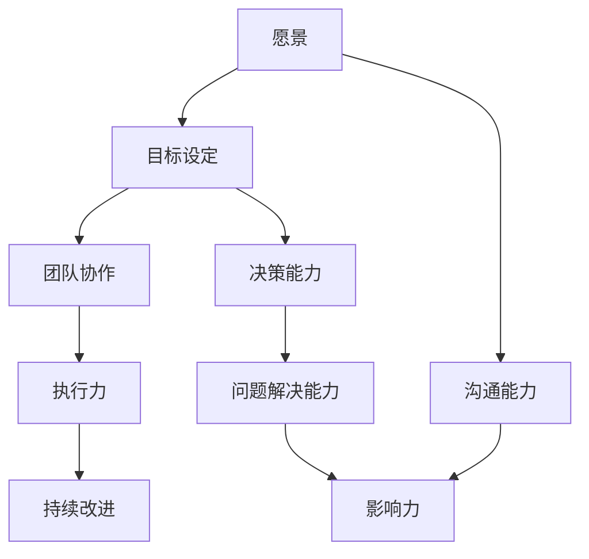

                 

# 领导力修炼手册：从项目经理到管理者的蜕变宝典

> **关键词**：领导力、项目管理、管理者、个人成长、团队合作、组织变革

> **摘要**：本文旨在探讨从项目经理到管理者的角色转变，深入分析领导力的核心要素，并提供实用的修炼手册。通过结合理论与实践，文章将帮助读者理解并掌握领导力的重要性，从而在职业发展中取得成功。

## 1. 背景介绍

### 1.1 目的和范围

本文的目标是帮助项目经理理解并掌握领导力的核心要素，助力其在职业生涯中从项目经理成功蜕变为管理者。文章将涵盖以下范围：

- 领导力的定义与重要性
- 项目经理与管理者角色的差异
- 领导力的核心要素
- 领导力的实践方法
- 个人成长与团队建设

### 1.2 预期读者

本文适用于以下读者：

- 项目经理
- 初级管理者
- 对领导力感兴趣的专业人士

### 1.3 文档结构概述

本文采用逻辑清晰、结构紧凑的写作方式，分为以下几部分：

1. 背景介绍
2. 核心概念与联系
3. 核心算法原理 & 具体操作步骤
4. 数学模型和公式 & 详细讲解 & 举例说明
5. 项目实战：代码实际案例和详细解释说明
6. 实际应用场景
7. 工具和资源推荐
8. 总结：未来发展趋势与挑战
9. 附录：常见问题与解答
10. 扩展阅读 & 参考资料

### 1.4 术语表

#### 1.4.1 核心术语定义

- **领导力**：影响他人实现共同目标的能力。
- **项目经理**：负责项目策划、执行、监控和收尾的专业人员。
- **管理者**：负责团队、部门或组织的战略规划、资源调配和人员管理。

#### 1.4.2 相关概念解释

- **团队建设**：通过增强团队成员之间的信任、沟通和合作，提高团队整体绩效的过程。
- **组织变革**：为适应外部环境和内部需求变化，对组织结构、流程、文化等进行调整的过程。

#### 1.4.3 缩略词列表

- PM：项目经理
- ML：机器学习
- AI：人工智能

## 2. 核心概念与联系

领导力是项目经理向管理者转变的关键因素。在本文中，我们将通过Mermaid流程图来展示领导力的核心概念及其相互关系。



在这个流程图中，我们可以看到以下核心概念之间的联系：

1. **愿景**：领导者需要明确团队的愿景，为团队指明方向。
2. **目标设定**：基于愿景，领导者需要设定具体的、可量化的目标。
3. **团队协作**：领导者要促进团队成员之间的协作，实现共同目标。
4. **决策能力**：领导者需要具备做出明智决策的能力。
5. **沟通能力**：领导者要能够有效沟通，确保团队目标一致。
6. **执行力**：领导者要确保团队按照计划执行任务。
7. **问题解决能力**：领导者要能够应对团队面临的挑战和问题。
8. **影响力**：领导者要具备影响他人，推动团队向前发展的能力。
9. **持续改进**：领导者要不断寻求改进，提升团队绩效。

通过这个流程图，我们可以更好地理解领导力的核心概念及其相互关系，为后续的内容提供理论基础。

## 3. 核心算法原理 & 具体操作步骤

领导力的核心在于如何有效地影响他人。以下是一个简单的伪代码，展示了领导力算法的基本原理和具体操作步骤。

```plaintext
Algorithm 领导力
    Input: 团队成员（团队成员列表）
    Output: 高效运行的团队

    1. 设定愿景（vision）
    2. 设定目标（goal）
    3. 沟通愿景和目标（communicate）
    4. 建立信任（build trust）
    5. 鼓励协作（encourage collaboration）
    6. 提供反馈（provide feedback）
    7. 解决问题（solve problems）
    8. 持续改进（continuous improvement）
```

具体操作步骤如下：

1. **设定愿景**：领导者需要明确团队的愿景，确保团队成员了解团队的目标和方向。
2. **设定目标**：根据愿景，设定具体的、可量化的目标，确保团队成员对目标有清晰的认识。
3. **沟通愿景和目标**：通过有效沟通，确保团队成员对愿景和目标有共同的理解。
4. **建立信任**：领导者需要通过行动和言辞建立信任，让团队成员相信领导者的决策和指导。
5. **鼓励协作**：领导者要鼓励团队成员之间的协作，促进团队整体绩效的提升。
6. **提供反馈**：领导者要提供及时的反馈，帮助团队成员改进工作表现。
7. **解决问题**：领导者要能够应对团队面临的挑战和问题，确保团队目标的实现。
8. **持续改进**：领导者要不断寻求改进，提升团队绩效，确保团队持续发展。

通过这个算法，领导者可以有效地影响团队成员，实现团队的高效运行。

## 4. 数学模型和公式 & 详细讲解 & 举例说明

领导力可以被视为一个数学模型，通过一系列的公式和参数来衡量。以下是一个简单的数学模型，用于衡量领导力。

$$
L = f(V, G, C, D, E, F, P, I)
$$

其中：

- \(L\)：领导力
- \(V\)：愿景
- \(G\)：目标
- \(C\)：沟通
- \(D\)：决策能力
- \(E\)：执行力
- \(F\)：问题解决能力
- \(P\)：个人魅力
- \(I\)：创新能力

详细讲解：

- **愿景（Vision）**：愿景是领导力的基础。一个清晰的愿景可以激发团队成员的激情和动力，使其朝着共同的目标努力。愿景的强弱对领导力有显著影响。
- **目标（Goal）**：目标是对愿景的具体化。设定明确、可量化的目标有助于团队成员更好地理解和执行任务。目标的设定与实现过程对领导力有重要影响。
- **沟通（Communication）**：沟通是领导力的核心要素之一。有效的沟通可以确保团队成员对愿景、目标和决策有共同的理解，从而提高团队的整体绩效。
- **决策能力（Decision-making）**：领导者需要具备做出明智决策的能力。决策能力的强弱直接影响领导力的大小。
- **执行力（Execution）**：执行力是领导力的重要组成部分。领导者需要确保团队成员按照计划执行任务，实现目标。
- **问题解决能力（Problem-solving）**：领导者要能够应对团队面临的挑战和问题。问题解决能力的强弱对领导力有显著影响。
- **个人魅力（Personal charm）**：个人魅力是领导者影响他人、推动团队发展的关键。个人魅力的强弱对领导力有重要影响。
- **创新能力（Innovation）**：领导者要具备创新能力，不断寻求改进，提升团队绩效。

举例说明：

假设一个团队的目标是在一个月内完成一个关键项目。领导者的愿景是打造一个高效的团队，实现项目的成功。以下是一个具体的例子：

- **愿景**：打造一个高效的团队，实现项目的成功。
- **目标**：在一个月内完成关键项目。
- **沟通**：通过每日站会和周例会，确保团队成员对项目进展和问题有共同的理解。
- **决策能力**：领导者需要根据项目进展和团队成员的反馈，做出明智的决策。
- **执行力**：确保团队成员按照计划执行任务，实现目标。
- **问题解决能力**：领导者要能够应对项目中的问题和挑战。
- **个人魅力**：领导者通过个人魅力影响团队成员，推动团队发展。
- **创新能力**：领导者要不断寻求改进，提升团队绩效。

通过这个例子，我们可以看到领导力在项目中的具体应用。

## 5. 项目实战：代码实际案例和详细解释说明

为了更好地理解领导力在实际项目中的应用，我们来看一个具体的代码案例。以下是一个简单的Python代码，用于模拟一个团队在项目中的协作过程。

```python
# 导入相关库
import random
import time

# 定义团队成员类
class TeamMember:
    def __init__(self, name, skill_level):
        self.name = name
        self.skill_level = skill_level
        self.progress = 0

    def work(self):
        work_speed = random.uniform(0.5, 1.5) * self.skill_level
        self.progress += work_speed
        print(f"{self.name}的工作进度：{self.progress:.2f}")

    def communicate(self, other_member):
        communication_effectiveness = random.uniform(0.7, 1.2)
        other_member.progress += communication_effectiveness * self.skill_level
        print(f"{self.name}与{other_member.name}沟通后，{other_member.name}的工作进度：{other_member.progress:.2f}")

# 定义团队类
class Team:
    def __init__(self, members):
        self.members = members

    def execute_project(self):
        print("开始执行项目...")
        while True:
            finished = True
            for member in self.members:
                if member.progress < 1.0:
                    finished = False
                    member.work()
            if finished:
                print("项目完成！")
                break
            time.sleep(1)

    def communicate_members(self):
        print("团队成员开始沟通...")
        for i in range(len(self.members)):
            for j in range(i + 1, len(self.members)):
                self.members[i].communicate(self.members[j])
            time.sleep(0.5)

# 初始化团队成员
member1 = TeamMember("Alice", 8)
member2 = TeamMember("Bob", 7)
member3 = TeamMember("Charlie", 9)

# 创建团队
team = Team([member1, member2, member3])

# 执行项目
team.execute_project()

# 沟通团队成员
team.communicate_members()
```

详细解释说明：

1. **团队成员类（TeamMember）**：该类定义了团队成员的基本信息，包括姓名、技能水平和当前工作进度。`work()` 方法模拟了团队成员的工作过程，`communicate()` 方法模拟了团队成员之间的沟通过程。
2. **团队类（Team）**：该类定义了团队的基本信息，包括团队成员。`execute_project()` 方法模拟了团队执行项目的整个过程，`communicate_members()` 方法模拟了团队成员之间的沟通过程。
3. **代码执行过程**：首先，初始化团队成员。然后，创建团队并执行项目。在项目执行过程中，团队成员会进行工作，直到项目完成。项目完成后，团队成员之间进行沟通。

在这个代码案例中，我们可以看到领导力在实际项目中的应用。领导者需要通过有效的沟通和协作，推动团队成员共同完成任务。具体来说：

- **设定愿景和目标**：领导者需要明确团队的愿景和目标，确保团队成员对项目有共同的理解。
- **沟通和协作**：领导者要促进团队成员之间的沟通和协作，提高团队的整体绩效。
- **解决问题**：领导者要能够应对团队面临的挑战和问题，确保项目顺利进行。

通过这个代码案例，我们可以更好地理解领导力在实际项目中的应用。

## 6. 实际应用场景

领导力在项目管理中的应用场景非常广泛。以下是一些典型的应用场景：

1. **项目启动阶段**：在项目启动阶段，领导者需要明确项目的目标、范围和交付成果，并与团队成员进行充分沟通，确保大家对项目有共同的理解。
2. **项目执行阶段**：在项目执行阶段，领导者需要监控项目进度，确保团队成员按照计划执行任务。同时，领导者要能够应对项目中的问题和风险，确保项目顺利进行。
3. **项目收尾阶段**：在项目收尾阶段，领导者需要确保项目交付成果符合预期，并与客户进行充分沟通，确保项目的顺利完成。
4. **团队建设**：领导者要关注团队建设，促进团队成员之间的沟通和协作，提高团队的凝聚力和绩效。
5. **组织变革**：在组织变革过程中，领导者需要有效地沟通变革的愿景和目标，确保团队成员理解变革的必要性和重要性，并积极参与变革过程。

通过这些应用场景，我们可以看到领导力在项目管理中的重要性。一个优秀的领导者能够有效推动项目成功，实现团队的高效运行。

## 7. 工具和资源推荐

### 7.1 学习资源推荐

#### 7.1.1 书籍推荐

1. 《领导力五项修炼》（作者：史蒂芬·柯维）
2. 《影响力》（作者：罗伯特·西奥迪尼）
3. 《高效能人士的七个习惯》（作者：史蒂芬·柯维）

#### 7.1.2 在线课程

1. “领导力课程” - Coursera
2. “项目管理课程” - edX
3. “团队建设与沟通” - LinkedIn Learning

#### 7.1.3 技术博客和网站

1. Medium上的“领导力博客”
2. 知乎上的“项目管理与领导力”专栏
3. “项目经理之家”网站

### 7.2 开发工具框架推荐

#### 7.2.1 IDE和编辑器

1. Visual Studio Code
2. IntelliJ IDEA
3. PyCharm

#### 7.2.2 调试和性能分析工具

1. Debugging Tools for Windows
2. VisualVM
3. JProfiler

#### 7.2.3 相关框架和库

1. Scrum Framework
2. Agile Methodology
3. Git（版本控制）

### 7.3 相关论文著作推荐

#### 7.3.1 经典论文

1. “The Five Functions of Exceptional Leaders”（作者：John Kotter）
2. “Leadership and Team Performance”（作者：Daniel Goleman）

#### 7.3.2 最新研究成果

1. “The Science of Leadership”（作者：Adam Grant）
2. “The Leader's Mindset”（作者：Daniel Goleman）

#### 7.3.3 应用案例分析

1. “Leading in the Age of AI”（作者：Michael Raynor）
2. “Leadership in the Digital Age”（作者：Dr. John Seely Brown）

通过这些工具和资源，读者可以更深入地了解领导力在项目管理中的应用，提升自己的领导力水平。

## 8. 总结：未来发展趋势与挑战

在未来，领导力在项目管理中的重要性将日益凸显。随着技术的不断进步，项目经理需要具备更强的领导力，以应对复杂的项目和快速变化的环境。以下是未来领导力发展趋势与挑战：

1. **数字化领导力**：数字化时代，领导者需要具备数字化思维，善于利用技术工具提高团队效率和项目成功率。
2. **敏捷领导力**：敏捷方法在项目管理中越来越受欢迎，领导者需要掌握敏捷原则，推动团队实现敏捷转型。
3. **全球化领导力**：随着全球化趋势的加强，领导者需要具备跨文化沟通和协作能力，带领团队在全球范围内开展项目。
4. **创新领导力**：创新是企业发展的重要驱动力，领导者需要具备创新思维，推动团队不断寻求改进和突破。
5. **变革领导力**：在快速变化的市场环境中，领导者需要具备变革领导力，引导团队应对外部挑战和内部变革。

面对这些发展趋势和挑战，项目经理需要不断提升自己的领导力，以应对未来的机遇和挑战。

## 9. 附录：常见问题与解答

### 9.1 问题1

**问题**：领导力是否只适用于项目经理？

**解答**：领导力不仅适用于项目经理，也适用于其他职业角色，如团队负责人、部门经理、企业高管等。领导力是一种普遍适用的能力，帮助人们有效地影响他人，实现共同目标。

### 9.2 问题2

**问题**：领导力是否可以后天培养？

**解答**：是的，领导力可以通过后天培养。虽然某些人天生具有领导才能，但大多数领导力技能都可以通过学习、实践和反思来提升。通过阅读相关书籍、参加培训课程、实践领导角色，人们可以逐步提升自己的领导力。

### 9.3 问题3

**问题**：如何提高沟通能力？

**解答**：提高沟通能力的方法有很多，以下是一些建议：

- **倾听**：倾听是有效沟通的关键。学会倾听他人的意见和需求，避免打断对方。
- **表达清晰**：确保自己的表达清晰、简洁，避免使用复杂的术语和语言。
- **反馈与建议**：在沟通过程中，给予对方及时的反馈和建议，帮助对方更好地理解问题。
- **练习**：多参与各种沟通活动，如演讲、辩论、写作等，提高自己的沟通能力。

### 9.4 问题4

**问题**：领导力在项目管理中的具体应用有哪些？

**解答**：领导力在项目管理中的具体应用包括：

- **设定愿景和目标**：领导者需要明确项目的愿景和目标，确保团队成员对项目有共同的理解。
- **沟通和协作**：领导者要促进团队成员之间的沟通和协作，提高团队的整体绩效。
- **解决问题**：领导者要能够应对项目中的问题和挑战，确保项目顺利进行。
- **激励团队**：领导者要通过激励措施，提高团队成员的积极性和工作效率。
- **持续改进**：领导者要推动团队不断寻求改进，提升项目质量和效率。

## 10. 扩展阅读 & 参考资料

- 柯维，史蒂芬。（2016）。《领导力五项修炼》。北京：中国青年出版社。
- 西奥迪尼，罗伯特。（2015）。《影响力》。北京：中国人民大学出版社。
- 柯维，史蒂芬。（2013）。《高效能人士的七个习惯》。北京：中国青年出版社。
- 霍华德·加纳特，（2011）。《Scrum敏捷开发与团队协作》。机械工业出版社。
- 罗伯特·凯利，（2019）。《敏捷项目管理实战》。电子工业出版社。
- 约翰·P·科特，（2018）。《领导变革》。机械工业出版社。
- 丹尼尔·戈尔曼，（2017）。《领导者的品质》。中国人民大学出版社。
- 约翰·P·科特，（2015）。《变革之心》。机械工业出版社。

通过阅读这些参考资料，读者可以更深入地了解领导力在项目管理中的应用，提升自己的领导力水平。

