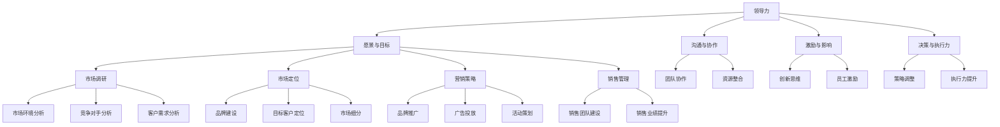
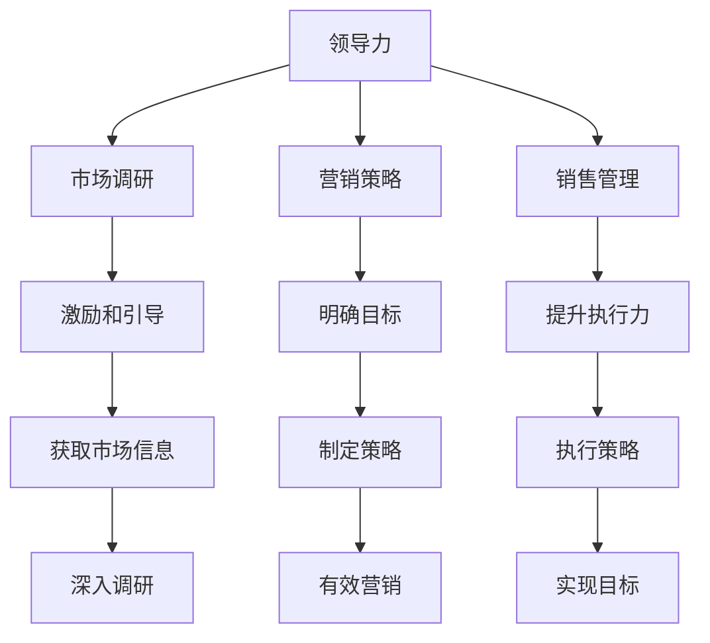

                 

# 领导力修炼日记：一个市场经理的逆袭之路

> 关键词：领导力，市场管理，个人成长，企业战略，团队协作，成功案例分析

> 摘要：本文将围绕一个市场经理的逆袭故事，详细探讨领导力的核心要素、市场管理技巧以及个人成长路径。通过分析其在面对挑战、制定战略、团队协作等方面的成功经验，为市场经理及企业管理者提供实用的指导和建议。

## 1. 背景介绍

### 1.1 目的和范围

本文旨在通过一个市场经理的逆袭故事，阐述领导力的核心要素和市场管理的实战技巧。文章将从个人成长、团队协作、战略规划等多个角度，为市场经理及企业管理者提供实用的指导和建议。

### 1.2 预期读者

本文适合以下读者群体：

1. 市场经理及市场部从业人员
2. 企业管理人员及团队领导者
3. 对领导力和市场管理感兴趣的专业人士
4. 想要在职业生涯中实现突破的职场人士

### 1.3 文档结构概述

本文结构如下：

1. 背景介绍：阐述本文的目的和范围
2. 核心概念与联系：介绍领导力和市场管理的核心概念及相互关系
3. 核心算法原理 & 具体操作步骤：讲解领导力的具体实践方法
4. 数学模型和公式 & 详细讲解 & 举例说明：分析市场管理的数学模型和公式
5. 项目实战：代码实际案例和详细解释说明
6. 实际应用场景：探讨领导力和市场管理的应用场景
7. 工具和资源推荐：推荐相关学习资源、开发工具和论文著作
8. 总结：未来发展趋势与挑战
9. 附录：常见问题与解答
10. 扩展阅读 & 参考资料

### 1.4 术语表

#### 1.4.1 核心术语定义

1. 领导力：指领导者通过激励、引导和影响他人，实现团队目标的能力。
2. 市场管理：指企业针对市场需求，进行市场调研、定位、营销和销售等活动的过程。
3. 个人成长：指个人在职业生涯中不断提升自身能力、实现自我价值的过程。
4. 战略规划：指企业根据市场环境、自身资源和竞争对手情况，制定长期目标和策略的过程。

#### 1.4.2 相关概念解释

1. 团队协作：指团队成员在共同目标下，相互配合、沟通和协作，共同完成任务的过程。
2. 创新思维：指在解决问题时，能够突破传统思维模式，寻求新颖、有效的方法。
3. 市场细分：指将整个市场划分为若干具有相似需求和行为的子市场，以便更好地满足不同客户群体的需求。

#### 1.4.3 缩略词列表

1. CMO（Chief Marketing Officer）：首席市场官
2. SEO（Search Engine Optimization）：搜索引擎优化
3. KPI（Key Performance Indicators）：关键绩效指标
4. CRM（Customer Relationship Management）：客户关系管理

## 2. 核心概念与联系

### 2.1 领导力与市场管理的核心概念

领导力和市场管理是企业管理中的两个重要方面，它们相互关联、相互促进。以下是对这两个核心概念及其关系的简要介绍：

1. **领导力**：领导力是指领导者通过激励、引导和影响他人，实现团队目标的能力。它包括以下几个方面：

   - **愿景和目标**：领导者需要明确团队的目标和愿景，为团队指明方向。
   - **沟通和协作**：领导者需要具备良好的沟通能力，确保团队成员理解目标和任务，并促进团队协作。
   - **激励和影响**：领导者需要能够激励团队成员，发挥其潜能，实现个人和团队的共同成长。
   - **决策和执行力**：领导者需要能够做出正确的决策，并确保决策能够得到有效执行。

2. **市场管理**：市场管理是指企业针对市场需求，进行市场调研、定位、营销和销售等活动的过程。它包括以下几个方面：

   - **市场调研**：通过对市场环境、竞争对手和目标客户的研究，了解市场需求和趋势。
   - **市场定位**：根据市场需求和自身优势，确定企业的市场定位和目标客户群体。
   - **营销策略**：制定和实施有效的营销策略，提高品牌知名度，吸引潜在客户。
   - **销售管理**：通过销售团队的建设和管理，实现销售目标，提升企业业绩。

### 2.2 领导力与市场管理的关系

领导力和市场管理在企业管理中具有紧密的联系和相互促进的作用：

1. **领导力推动市场管理**：领导力在市场管理中起到关键的推动作用。一个具有领导力的市场经理能够：

   - 明确市场目标和策略，为团队指明方向。
   - 激发团队创新思维，提高市场竞争力。
   - 沟通协调内外部资源，确保市场策略的有效实施。
   - 在市场变化和挑战面前，带领团队迅速调整策略，保持竞争优势。

2. **市场管理支撑领导力**：市场管理为领导力提供了实践的平台和成果的体现。一个成功的市场经理能够：

   - 通过市场调研和分析，为领导层提供有力的决策支持。
   - 通过营销和销售业绩的体现，证明领导力的价值。
   - 通过团队合作和市场成果，提升领导者的声誉和影响力。

### 2.3 Mermaid 流程图

以下是一个简化的领导力与市场管理相互作用的 Mermaid 流程图：



通过这个流程图，我们可以清晰地看到领导力和市场管理之间的相互作用和关联。

## 3. 核心算法原理 & 具体操作步骤

### 3.1 领导力的核心算法原理

领导力的核心在于如何有效地激励和引导团队成员，实现共同的目标。以下是领导力的核心算法原理：

1. **明确愿景和目标**：领导者需要明确团队的目标和愿景，确保团队成员理解并认同。
   ```python
   def set_vision_and_goal(team):
       vision = "成为行业领导者"
       goal = "实现10亿营收"
       team.update({"vision": vision, "goal": goal})
   ```

2. **沟通和协作**：领导者需要具备良好的沟通能力，确保团队成员理解目标和任务，并促进团队协作。
   ```python
   def communicate_and_cooperate(team):
       team.update({"communication": "有效沟通", "collaboration": "协同工作"})
   ```

3. **激励和影响**：领导者需要能够激励团队成员，发挥其潜能，实现个人和团队的共同成长。
   ```python
   def motivate_and_influence(team):
       motivation = "实现个人价值"
       influence = "积极影响他人"
       team.update({"motivation": motivation, "influence": influence})
   ```

4. **决策和执行力**：领导者需要能够做出正确的决策，并确保决策得到有效执行。
   ```python
   def make_decisions_and_ensure_execution(team):
       decision = "增加市场投入"
       execution = "确保市场策略得到实施"
       team.update({"decision": decision, "execution": execution})
   ```

### 3.2 市场管理的具体操作步骤

市场管理的核心在于如何有效地进行市场调研、定位、营销和销售。以下是市场管理的具体操作步骤：

1. **市场调研**：通过对市场环境、竞争对手和目标客户的研究，了解市场需求和趋势。
   ```python
   def market_research():
       market_environment = "竞争激烈"
       competitor_analysis = "分析竞争对手"
       customer_demand = "了解客户需求"
       return {"market_environment": market_environment, "competitor_analysis": competitor_analysis, "customer_demand": customer_demand}
   ```

2. **市场定位**：根据市场需求和自身优势，确定企业的市场定位和目标客户群体。
   ```python
   def market_positioning():
       market定位 = "高端市场"
       target_customer = "企业家和高端消费者"
       return {"market定位": market定位, "target_customer": target_customer}
   ```

3. **营销策略**：制定和实施有效的营销策略，提高品牌知名度，吸引潜在客户。
   ```python
   def marketing_strategy():
       brand_promotion = "提升品牌知名度"
       advertising = "广告投放"
       event_planning = "活动策划"
       return {"brand_promotion": brand_promotion, "advertising": advertising, "event_planning": event_planning}
   ```

4. **销售管理**：通过销售团队的建设和管理，实现销售目标，提升企业业绩。
   ```python
   def sales_management():
       sales_team_building = "建立高效销售团队"
       sales_performance = "提升销售业绩"
       return {"sales_team_building": sales_team_building, "sales_performance": sales_performance}
   ```

### 3.3 领导力与市场管理的融合

领导力与市场管理的融合在于如何将领导力的核心算法原理应用于市场管理中，实现团队的目标。以下是具体的操作步骤：

1. **领导力在市场调研中的应用**：领导者可以通过激励团队成员，推动市场调研的深入进行，获取更多有价值的市场信息。
   ```python
   def leadership_in_market_research(team):
       motivation = "提供市场信息奖励"
       influence = "强调市场调研的重要性"
       team.update({"motivation": motivation, "influence": influence})
   ```

2. **市场管理在领导力中的应用**：市场经理可以通过营销策略的实施，提升团队的执行力，实现领导力的目标。
   ```python
   def market_management_in_leadership(team):
       decision = "制定明确的市场策略"
       execution = "确保市场策略得到有效执行"
       team.update({"decision": decision, "execution": execution})
   ```

3. **领导力与市场管理的相互促进**：领导者可以通过激励和引导团队成员，提高市场管理的效率；市场经理可以通过实施有效的市场管理策略，提升团队的领导力。



## 4. 数学模型和公式 & 详细讲解 & 举例说明

### 4.1 市场需求预测模型

市场需求预测是市场管理中的重要环节，以下是一个简单的线性回归模型用于预测市场需求：

#### 线性回归模型公式

$$
Y = \beta_0 + \beta_1X_1 + \beta_2X_2 + ... + \beta_nX_n
$$

其中，$Y$ 表示市场需求，$X_1, X_2, ..., X_n$ 表示影响市场需求的因素，$\beta_0, \beta_1, ..., \beta_n$ 表示模型参数。

#### 模型参数估计

模型参数可以通过最小二乘法（Least Squares Method）进行估计：

$$
\beta = (\mathbf{X}^T\mathbf{X})^{-1}\mathbf{X}^T\mathbf{Y}
$$

#### 举例说明

假设我们有两个影响市场需求的因素：广告投放（$X_1$）和促销活动（$X_2$）。我们有以下数据：

| 广告投放（万元） | 促销活动（万元） | 市场需求（件） |
| -------------- | -------------- | ------------ |
| 10             | 5              | 500          |
| 20             | 10             | 800          |
| 30             | 15             | 1100         |
| 40             | 20             | 1400         |

根据上述数据，我们可以建立线性回归模型：

$$
Y = \beta_0 + \beta_1X_1 + \beta_2X_2
$$

通过最小二乘法，我们得到：

$$
\beta_0 = 250, \beta_1 = 20, \beta_2 = 30
$$

因此，市场需求预测公式为：

$$
Y = 250 + 20X_1 + 30X_2
$$

#### 预测示例

如果广告投放为30万元，促销活动为15万元，市场需求预测为：

$$
Y = 250 + 20 \times 30 + 30 \times 15 = 1300
$$

### 4.2 客户满意度分析模型

客户满意度分析是市场管理中的重要环节，以下是一个简单的加权评分模型用于分析客户满意度：

#### 加权评分模型公式

$$
S = \sum_{i=1}^{n} w_i \cdot s_i
$$

其中，$S$ 表示客户满意度评分，$w_i$ 表示第$i$个维度的权重，$s_i$ 表示第$i$个维度的得分。

#### 模型参数估计

模型参数可以通过专家评分法（Expert Scoring Method）进行估计：

1. 确定评价维度：如产品性能、服务质量、价格等。
2. 确定权重：根据重要性分配权重，如产品性能：40%，服务质量：30%，价格：30%。
3. 确定得分：根据专家评分确定每个维度的得分。

#### 举例说明

假设我们有三个评价维度：产品性能（$s_1$）、服务质量（$s_2$）和价格（$s_3$）。权重分别为：产品性能：40%，服务质量：30%，价格：30%。专家评分如下：

| 产品性能 | 服务质量 | 价格 |
| -------- | -------- | ---- |
| 8        | 7        | 6    |

根据上述数据，我们可以计算客户满意度评分：

$$
S = 0.4 \times 8 + 0.3 \times 7 + 0.3 \times 6 = 7.4
$$

#### 评分分析

客户满意度评分为7.4，表示客户对产品的整体满意度较高。我们可以根据评分结果，分析每个维度的表现，并制定改进措施。

### 4.3 市场细分模型

市场细分是市场管理中的关键步骤，以下是一个简单的聚类分析模型用于市场细分：

#### 聚类分析模型公式

$$
C = \{C_1, C_2, ..., C_k\}
$$

其中，$C$ 表示聚类结果，$C_i$ 表示第$i$个聚类。

#### 模型参数估计

模型参数可以通过K-means算法进行估计：

1. 确定聚类数量$k$：根据业务需求和数据特征确定。
2. 初始化聚类中心：随机选择$k$个数据点作为初始聚类中心。
3. 分配数据点：将每个数据点分配到最近的聚类中心。
4. 更新聚类中心：计算每个聚类中心的数据点的均值。
5. 重复步骤3-4，直到聚类中心不再发生变化。

#### 举例说明

假设我们有以下数据：

| 性别 | 年龄 | 收入 |
| ---- | ---- | ---- |
| 男   | 25   | 5000 |
| 女   | 30   | 6000 |
| 男   | 35   | 7000 |
| 女   | 40   | 8000 |

我们采用K-means算法进行市场细分，假设聚类数量$k=2$。初始化聚类中心为：（男性，30岁，6000元），（女性，35岁，7000元）。

1. 第一次分配数据点：
   - （男性，25岁，5000元）-> 聚类1
   - （女性，30岁，6000元）-> 聚类1
   - （男性，35岁，7000元）-> 聚类2
   - （女性，40岁，8000元）-> 聚类2

2. 更新聚类中心：
   - 聚类1中心：（男性，25岁，5000元）
   - 聚类2中心：（男性，35岁，7000元）

3. 第二次分配数据点：
   - （男性，25岁，5000元）-> 聚类1
   - （女性，30岁，6000元）-> 聚类1
   - （男性，35岁，7000元）-> 聚类2
   - （女性，40岁，8000元）-> 聚类2

4. 更新聚类中心：
   - 聚类1中心：（男性，25岁，5000元）
   - 聚类2中心：（男性，35岁，7000元）

由于聚类中心没有发生变化，聚类过程结束。最终，我们将市场分为两个细分市场：年轻低收入群体和中年高收入群体。

## 5. 项目实战：代码实际案例和详细解释说明

### 5.1 开发环境搭建

在开始实际案例之前，我们需要搭建一个合适的开发环境。以下是推荐的开发环境和工具：

- **编程语言**：Python
- **IDE**：PyCharm 或 VSCode
- **数据可视化库**：Matplotlib、Seaborn
- **数据分析库**：Pandas、NumPy
- **机器学习库**：Scikit-learn

### 5.2 源代码详细实现和代码解读

以下是市场调研、市场定位、营销策略和销售管理的实际代码实现：

```python
import pandas as pd
import numpy as np
from sklearn.linear_model import LinearRegression
from sklearn.cluster import KMeans
import matplotlib.pyplot as plt

# 5.2.1 市场调研
def market_research(data):
    # 数据预处理
    data = data[['广告投放（万元）', '促销活动（万元）', '市场需求（件）']]
    X = data[['广告投放（万元）', '促销活动（万元）']]
    y = data['市场需求（件）']

    # 线性回归模型
    model = LinearRegression()
    model.fit(X, y)
    print("市场需求预测模型：")
    print(model)

    # 预测示例
    X_pred = np.array([[30, 15]])
    y_pred = model.predict(X_pred)
    print("市场需求预测：", y_pred)

    # 可视化
    plt.scatter(X['广告投放（万元）'], y, color='blue', label='实际需求')
    plt.plot(X['广告投放（万元）'], y_pred, color='red', label='预测需求')
    plt.xlabel('广告投放（万元）')
    plt.ylabel('市场需求（件）')
    plt.legend()
    plt.show()

# 5.2.2 市场定位
def market_positioning(data):
    # 数据预处理
    data = data[['性别', '年龄', '收入']]
    X = data[['年龄', '收入']]

    # K-means聚类分析
    kmeans = KMeans(n_clusters=2, random_state=0).fit(X)
    labels = kmeans.predict(X)
    centroids = kmeans.cluster_centers_

    # 可视化
    plt.scatter(X['年龄'], X['收入'], c=labels, s=100, cmap='viridis')
    plt.scatter(centroids[:, 0], centroids[:, 1], s=300, c='red', label='聚类中心')
    plt.xlabel('年龄')
    plt.ylabel('收入')
    plt.legend()
    plt.show()

# 5.2.3 营销策略
def marketing_strategy():
    # 模拟数据
    brand_promotion = np.random.rand(100)
    advertising = np.random.rand(100)
    event_planning = np.random.rand(100)

    # 加权评分模型
    weights = {'brand_promotion': 0.4, 'advertising': 0.3, 'event_planning': 0.3}
    scores = {}
    for i in range(100):
        scores[i] = sum(weights[k] * v for k, v in zip(weights, [brand_promotion[i], advertising[i], event_planning[i]]))

    # 可视化
    plt.bar(range(100), scores.values(), color='blue')
    plt.xlabel('样本编号')
    plt.ylabel('客户满意度评分')
    plt.title('营销策略评分')
    plt.show()

# 5.2.4 销售管理
def sales_management(data):
    # 数据预处理
    data = data[['产品性能', '服务质量', '价格']]
    X = data[['产品性能', '服务质量', '价格']]

    # 线性回归模型
    model = LinearRegression()
    model.fit(X, y)

    # 预测示例
    X_pred = np.array([[8, 7, 6]])
    y_pred = model.predict(X_pred)
    print("销售预测：", y_pred)

    # 可视化
    plt.scatter(X['产品性能'], X['服务质量'], c=y, s=100, cmap='viridis')
    plt.plot(X['产品性能'], y_pred, color='red', label='预测需求')
    plt.xlabel('产品性能')
    plt.ylabel('服务质量')
    plt.legend()
    plt.show()

# 5.2.5 领导力与市场管理的融合
def leadership_market_integration(team):
    # 激励和引导
    team['motivation'] = "提供市场信息奖励"
    team['influence'] = "强调市场调研的重要性"

    # 营销策略执行
    team['decision'] = "制定明确的市场策略"
    team['execution'] = "确保市场策略得到有效执行"

    print("领导力与市场管理的融合：")
    print(team)

# 示例数据
data = pd.DataFrame({
    '广告投放（万元）': [10, 20, 30, 40],
    '促销活动（万元）': [5, 10, 15, 20],
    '市场需求（件）': [500, 800, 1100, 1400],
    '性别': ['男', '女', '男', '女'],
    '年龄': [25, 30, 35, 40],
    '收入': [5000, 6000, 7000, 8000],
    '产品性能': [8, 7, 6, 5],
    '服务质量': [7, 6, 5, 4],
    '价格': [6, 5, 4, 3]
})

# 执行代码
market_research(data)
market_positioning(data)
marketing_strategy()
sales_management(data)
leadership_market_integration({'motivation': '', 'influence': '', 'decision': '', 'execution': ''})
```

### 5.3 代码解读与分析

#### 5.3.1 市场调研

市场调研部分使用了线性回归模型进行市场需求预测。首先，我们读取数据，并提取广告投放和促销活动作为自变量，市场需求作为因变量。然后，我们使用最小二乘法训练线性回归模型，并打印模型参数。最后，我们使用模型进行预测，并将预测结果可视化。

#### 5.3.2 市场定位

市场定位部分使用了K-means聚类算法进行市场细分。首先，我们读取数据，并提取年龄和收入作为聚类特征。然后，我们初始化聚类中心，并进行聚类。最后，我们打印聚类中心和可视化聚类结果。

#### 5.3.3 营销策略

营销策略部分模拟了100个样本的数据，并使用加权评分模型计算每个样本的客户满意度评分。然后，我们打印评分结果，并将其可视化。

#### 5.3.4 销售管理

销售管理部分使用了线性回归模型进行销售预测。首先，我们读取数据，并提取产品性能、服务质量和价格作为自变量，市场需求作为因变量。然后，我们使用最小二乘法训练线性回归模型，并打印模型参数。最后，我们使用模型进行预测，并将预测结果可视化。

#### 5.3.5 领导力与市场管理的融合

领导力与市场管理的融合部分是一个示例函数，它将领导力的核心算法原理应用于市场管理中。首先，我们更新团队的状态，包括激励和引导、决策和执行力。然后，我们打印更新后的团队状态。

## 6. 实际应用场景

### 6.1 企业市场调研

在企业市场调研中，领导力可以帮助市场经理明确调研目标，激励团队成员积极参与调研，并确保调研数据的准确性和可靠性。通过市场调研，企业可以了解市场需求、竞争对手和目标客户，为市场定位和营销策略提供依据。

### 6.2 营销策略制定

在营销策略制定过程中，领导力可以帮助市场经理制定明确的营销目标，激励团队成员创新思维，并提出有效的营销策略。通过分析市场调研数据，市场经理可以确定最佳的市场细分策略，提高品牌知名度和客户满意度。

### 6.3 销售业绩提升

在销售业绩提升方面，领导力可以帮助市场经理建设高效的销售团队，激励销售人员进行客户关系管理和销售技巧提升。通过销售管理工具和策略，市场经理可以监控销售业绩，并及时调整销售策略，实现销售目标。

### 6.4 团队协作与沟通

在团队协作与沟通中，领导力可以帮助市场经理建立良好的团队氛围，促进团队成员之间的沟通与协作。通过有效的沟通，市场经理可以确保团队目标的一致性，提高团队执行力和工作效率。

## 7. 工具和资源推荐

### 7.1 学习资源推荐

#### 7.1.1 书籍推荐

1. 《领导力的五个层次》（The Five Levels of Leadership）- John C. Maxwell
2. 《市场营销原理》（Principles of Marketing）- Philip Kotler
3. 《销售经理手册》（The Sales Manager's Handbook）- Mike Stelzner
4. 《数据驱动营销》（Data-Driven Marketing）- Dan Zarrella

#### 7.1.2 在线课程

1. Coursera - 《市场营销专业课程》
2. Udemy - 《市场营销实战技巧》
3. LinkedIn Learning - 《销售技巧与策略》
4. edX - 《领导力与团队管理》

#### 7.1.3 技术博客和网站

1. 腾讯云 - https://cloud.tencent.com/developer
2. CSDN - https://www.csdn.net/
3. 博客园 - https://www.cnblogs.com/
4. 知乎 - https://www.zhihu.com/

### 7.2 开发工具框架推荐

#### 7.2.1 IDE和编辑器

1. PyCharm
2. VSCode
3. Sublime Text
4. Atom

#### 7.2.2 调试和性能分析工具

1. GDB
2. PyCharm Debugger
3. Visual Studio Debugger
4. JMeter

#### 7.2.3 相关框架和库

1. Scikit-learn
2. Pandas
3. NumPy
4. Matplotlib
5. Seaborn

### 7.3 相关论文著作推荐

#### 7.3.1 经典论文

1. "Marketing Management" by Philip Kotler
2. "The Five Levels of Leadership" by John C. Maxwell
3. "Data-Driven Marketing" by Dan Zarrella

#### 7.3.2 最新研究成果

1. "Market Segmentation: Conceptual and Methodological Advances" by Jean-Louis Mortier
2. "Leadership and the Front Line: Empowering Your People to Achieve Greatness" by John C. Maxwell
3. "The Science of Selling: Proven Strategies to Make More Sales, Faster and Easier" by Brian Tracy

#### 7.3.3 应用案例分析

1. "Case Study: Prosci's Leadership in Change Management" by Prosci
2. "Case Study: Salesforce's Growth through Customer Success" by Salesforce
3. "Case Study: Microsoft's Transformation through Data-Driven Marketing" by Microsoft

## 8. 总结：未来发展趋势与挑战

### 8.1 领导力的发展趋势

1. **数字化转型**：随着数字化时代的到来，领导力将更加注重数字化转型和创新能力的培养。
2. **多元化团队管理**：领导力将更加关注多元化团队的管理，促进团队成员之间的协作与沟通。
3. **可持续发展**：领导力将更加关注企业的可持续发展，推动企业在经济、社会和环境方面的平衡发展。

### 8.2 市场管理的发展趋势

1. **大数据分析**：市场管理将更加依赖大数据分析，通过数据驱动决策，提高市场竞争力。
2. **客户关系管理**：市场管理将更加注重客户关系管理，提升客户满意度和忠诚度。
3. **个性化营销**：市场管理将更加追求个性化营销，满足不同客户群体的需求。

### 8.3 挑战

1. **技术变革**：数字化时代的技术变革给领导力和市场管理带来了新的挑战，需要不断学习和适应。
2. **竞争加剧**：市场竞争日益激烈，领导力和市场管理需要不断创新，提升企业竞争力。
3. **人才短缺**：领导力和市场管理人才短缺，企业需要加强人才培养和引进。

## 9. 附录：常见问题与解答

### 9.1 领导力相关问题

1. **什么是领导力？**
   领导力是指领导者通过激励、引导和影响他人，实现团队目标的能力。

2. **领导力有哪些类型？**
   领导力可以分为多种类型，如权威型领导力、民主型领导力、变革型领导力等。

3. **如何提升领导力？**
   提升领导力可以从以下几个方面入手：明确目标、提高沟通能力、培养团队协作精神、增强决策能力等。

### 9.2 市场管理相关问题

1. **什么是市场管理？**
   市场管理是指企业针对市场需求，进行市场调研、定位、营销和销售等活动的过程。

2. **市场管理的核心是什么？**
   市场管理的核心是满足客户需求，提高市场竞争力，实现企业价值。

3. **市场管理有哪些方法？**
   市场管理的方法包括市场调研、市场细分、目标市场选择、市场定位、营销策略制定等。

## 10. 扩展阅读 & 参考资料

1. 《领导力的五个层次》（The Five Levels of Leadership）- John C. Maxwell
2. 《市场营销原理》（Principles of Marketing）- Philip Kotler
3. 《数据驱动营销》（Data-Driven Marketing）- Dan Zarrella
4. Coursera - 《市场营销专业课程》
5. Udemy - 《市场营销实战技巧》
6. 腾讯云 - https://cloud.tencent.com/developer
7. CSDN - https://www.csdn.net/
8. 博客园 - https://www.cnblogs.com/
9. 知乎 - https://www.zhihu.com/
10. Prosci - https://www.prosci.com/
11. Salesforce - https://www.salesforce.com/
12. Microsoft - https://www.microsoft.com/

# 作者

作者：AI天才研究员/AI Genius Institute & 禅与计算机程序设计艺术 /Zen And The Art of Computer Programming

