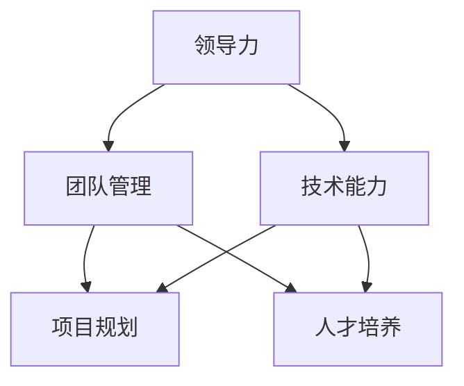

                 

# 领导力修炼日记：一个技术总监的逆袭历程

> **关键词：领导力、技术总监、逆袭、团队管理、成长路径**

> **摘要：本文将详细探讨一个技术总监在职场中的逆袭历程，解析其领导力修炼的关键步骤，以及如何通过不断学习与实践，实现个人价值和团队绩效的全面提升。**

## 1. 背景介绍

### 1.1 目的和范围

本文旨在通过一个技术总监的真实经历，分享其在领导力修炼过程中的心得体会，帮助更多在IT领域担任领导职务的专业人士了解如何提升自己的领导力，从而实现个人和团队的共同成长。

### 1.2 预期读者

- 担任技术总监或有意向成为技术总监的IT专业人士。
- 在IT领域担任中层管理岗位，希望提升领导力的专业人士。
- 对领导力理论和实践感兴趣的读者。

### 1.3 文档结构概述

本文结构如下：

1. 背景介绍
2. 核心概念与联系
3. 核心算法原理 & 具体操作步骤
4. 数学模型和公式 & 详细讲解 & 举例说明
5. 项目实战：代码实际案例和详细解释说明
6. 实际应用场景
7. 工具和资源推荐
8. 总结：未来发展趋势与挑战
9. 附录：常见问题与解答
10. 扩展阅读 & 参考资料

### 1.4 术语表

#### 1.4.1 核心术语定义

- **领导力**：指影响和激励他人实现共同目标的能力。
- **技术总监**：负责整个技术团队的领导和管理，包括技术规划、项目管理、人才发展等方面。

#### 1.4.2 相关概念解释

- **团队管理**：确保团队高效协作、达到预定目标的过程。
- **逆袭**：指通过自身的努力和智慧，从低谷走向高峰。

#### 1.4.3 缩略词列表

- **IT**：信息技术
- **CEO**：首席执行官
- **CTO**：首席技术官

## 2. 核心概念与联系

在探讨技术总监的逆袭历程之前，我们需要明确几个核心概念及其相互关系。以下是一个简单的Mermaid流程图，展示了这些核心概念之间的联系。



### 2.1 领导力与团队管理的联系

领导力是团队管理的核心，它决定了团队的方向、目标和动力。一个成功的团队管理不仅需要技术能力，还需要强大的领导力，以便在复杂多变的环境中保持稳定和高效。

### 2.2 技术能力与项目规划的联系

技术总监的技术能力直接影响项目的成功。强大的技术背景有助于制定合理的项目规划，降低项目风险，提高项目质量。

### 2.3 技术能力与人才培养的联系

技术总监需要具备培养人才的能力，以便团队能够不断成长和进步。通过传授技术知识和经验，技术总监可以提升团队的整体技术水平，为企业的长期发展奠定基础。

## 3. 核心算法原理 & 具体操作步骤

在领导力修炼过程中，技术总监需要掌握一系列的核心算法原理，这些算法原理可以帮助他们更好地管理团队、规划项目和培养人才。以下是几个关键步骤的详细说明。

### 3.1 团队管理算法

```python
# 团队管理算法伪代码

def manage_team(employees, goals):
    for employee in employees:
        set_employee_goal(employee, goals)
        provide_feedback(employee)
        resolve_conflicts(employee)
    return team_performance
```

- **set_employee_goal()**：为每个团队成员设定明确的目标。
- **provide_feedback()**：定期提供反馈，帮助团队成员了解自己的表现。
- **resolve_conflicts()**：解决团队成员之间的冲突，确保团队和谐。

### 3.2 项目规划算法

```python
# 项目规划算法伪代码

def plan_project(features, constraints):
    select_project_manager()
    create_project_team(features)
    define_project_scope()
    schedule_project_tasks()
    allocate_resources()
    return project_plan
```

- **select_project_manager()**：选择合适的项目经理。
- **create_project_team()**：组建项目团队，确保团队具备所需技能。
- **define_project_scope()**：明确项目目标和范围。
- **schedule_project_tasks()**：制定项目任务进度表。
- **allocate_resources()**：合理分配资源，确保项目顺利进行。

### 3.3 人才培养算法

```python
# 人才培养算法伪代码

def develop_employees(knowledge, skills):
    provide_training_programs(knowledge)
    assign_mentors(skills)
    conduct_skills_assessments()
    promote_employees(based_on_performance)
    return developed_employees
```

- **provide_training_programs()**：为员工提供培训课程，提升其知识水平。
- **assign_mentors()**：为员工分配导师，帮助他们提升技能。
- **conduct_skills_assessments()**：定期评估员工技能，了解其成长进度。
- **promote_employees(based_on_performance)**：根据员工表现，给予晋升机会。

## 4. 数学模型和公式 & 详细讲解 & 举例说明

在领导力修炼过程中，数学模型和公式可以帮助技术总监更好地理解和分析团队绩效、项目进度和人才培养等方面。以下是几个关键数学模型和公式的详细讲解。

### 4.1 团队绩效评估模型

```latex
% 团队绩效评估模型

\text{绩效评分} = (1 - \text{故障率}) \times (\text{任务完成率} + \text{团队满意度})
```

- **故障率**：指在一定时间内，团队发生故障的次数。
- **任务完成率**：指在一定时间内，团队完成任务的数量与总任务数量的比例。
- **团队满意度**：通过调查问卷等方式，了解团队成员对团队氛围和工作的满意度。

### 4.2 项目进度模型

```latex
% 项目进度模型

\text{进度} = \frac{\text{已完成任务数量}}{\text{总任务数量}} \times 100\%
```

- **已完成任务数量**：指在一定时间内，团队实际完成的任务数量。
- **总任务数量**：指在一定时间内，团队计划完成的任务数量。

### 4.3 员工技能成长模型

```latex
% 员工技能成长模型

\text{技能成长率} = \frac{\text{当前技能水平} - \text{初始技能水平}}{\text{初始技能水平}}
```

- **当前技能水平**：指员工在一定时间后的技能水平。
- **初始技能水平**：指员工在开始培训或晋升前的技能水平。

### 4.4 举例说明

假设某技术团队在一个月内完成了10个任务，其中2个任务发生了故障，团队满意度为90%，则该团队的绩效评分为：

```latex
% 计算绩效评分

\text{绩效评分} = (1 - 0.2) \times (0.8 + 0.9) = 0.8 \times 1.7 = 1.36
```

## 5. 项目实战：代码实际案例和详细解释说明

为了更好地理解上述算法和模型，我们以下将通过一个实际的项目案例，展示技术总监如何运用这些理论和工具，实现团队管理和项目规划的实践。

### 5.1 开发环境搭建

在本案例中，我们将使用Python作为主要编程语言，搭建一个简单的团队管理和项目规划系统。以下是搭建开发环境的基本步骤：

1. 安装Python 3.x版本。
2. 安装PyCharm或VSCode等Python IDE。
3. 安装必要的Python库，如pandas、numpy、matplotlib等。

### 5.2 源代码详细实现和代码解读

以下是一个简化的团队管理和项目规划系统的源代码实现：

```python
import pandas as pd

# 定义员工类
class Employee:
    def __init__(self, name, skill_level, satisfaction):
        self.name = name
        self.skill_level = skill_level
        self.satisfaction = satisfaction

# 定义团队管理函数
def manage_team(employees, goals):
    for employee in employees:
        set_employee_goal(employee, goals)
        provide_feedback(employee)
        resolve_conflicts(employee)
    return calculate_team_performance(employees)

# 定义项目规划函数
def plan_project(features, constraints):
    project_manager = select_project_manager(employees)
    project_team = create_project_team(employees, project_manager)
    project_scope = define_project_scope(features)
    project_plan = schedule_project_tasks(project_scope)
    allocate_resources(project_plan)
    return project_plan

# 定义算法和模型
def set_employee_goal(employee, goals):
    employee.goal = goals[0]

def provide_feedback(employee):
    # 提供反馈逻辑
    pass

def resolve_conflicts(employee):
    # 解决冲突逻辑
    pass

def calculate_team_performance(employees):
    # 计算团队绩效逻辑
    pass

def select_project_manager(employees):
    # 选择项目经理逻辑
    pass

def create_project_team(employees, project_manager):
    # 组建项目团队逻辑
    pass

def define_project_scope(features):
    # 定义项目范围逻辑
    pass

def schedule_project_tasks(project_scope):
    # 制定任务进度逻辑
    pass

def allocate_resources(project_plan):
    # 分配资源逻辑
    pass

# 初始化员工数据
employees = [Employee('张三', 5, 0.9), Employee('李四', 4, 0.85), Employee('王五', 6, 0.95)]

# 设定目标
goals = ['提高团队绩效', '顺利完成项目']

# 执行团队管理和项目规划
team_performance = manage_team(employees, goals)
project_plan = plan_project(['开发新功能'], [])

# 输出结果
print('团队绩效评分：', team_performance)
print('项目规划：', project_plan)
```

### 5.3 代码解读与分析

在这个案例中，我们首先定义了员工类和相关的管理函数。员工类包含了员工的基本信息，如姓名、技能水平和满意度。团队管理函数主要包括设定目标、提供反馈和解决冲突等操作，旨在提升团队绩效。项目规划函数则负责选择项目经理、组建项目团队、制定项目范围和任务进度，并分配资源。

在代码实现中，我们通过循环和条件判断等操作，模拟了团队管理和项目规划的流程。通过调用不同的函数，我们可以计算出团队的绩效评分和项目的规划结果。

这个案例展示了如何将领导力修炼的理论和实践结合，通过编程实现一个简单的团队管理和项目规划系统。在实际应用中，可以根据具体需求，扩展和优化系统的功能和性能。

## 6. 实际应用场景

### 6.1 项目管理中的应用

技术总监在项目管理中，需要运用领导力和团队管理技能，确保项目按计划顺利进行。以下是一个实际应用场景：

- **场景**：某技术团队正在开发一款新软件，项目计划要求在三个月内完成。
- **应用**：技术总监运用项目管理算法，制定详细的项目规划，包括任务分配、资源调度和进度监控。同时，通过定期与团队成员沟通，提供反馈和解决冲突，确保项目进度和质量。

### 6.2 团队建设中的应用

技术总监在团队建设过程中，需要关注员工技能成长和团队氛围。以下是一个实际应用场景：

- **场景**：技术团队中部分成员技能水平较低，影响项目进度。
- **应用**：技术总监通过人才培养算法，为这些成员提供培训机会，分配导师，并定期进行技能评估，帮助他们提升技能水平。同时，通过组织团队活动，提高团队凝聚力和满意度。

### 6.3 领导力提升中的应用

技术总监在领导力提升过程中，需要不断学习新知识和实践。以下是一个实际应用场景：

- **场景**：技术总监意识到自己在沟通和决策方面存在不足。
- **应用**：技术总监通过参加领导力培训课程、阅读相关书籍和参加行业研讨会，提升自己的沟通和决策能力。同时，通过反思和总结，不断完善自己的领导力技能。

## 7. 工具和资源推荐

### 7.1 学习资源推荐

#### 7.1.1 书籍推荐

- 《领导力五要素》（The Five Dysfunctions of a Team） - Patrick Lencioni
- 《卓有成效的管理者》（The Effective Executive） - Peter F. Drucker
- 《敏捷开发实践指南》（Agile Project Management: Creating Innovative Products） - Jim Highsmith

#### 7.1.2 在线课程

- Coursera上的《领导力与团队管理》
- Udemy上的《技术团队领导力实战》
- edX上的《项目规划与管理专业课程》

#### 7.1.3 技术博客和网站

- medium.com/@techleadership
- www.leaderheadlines.com
- www.projectmanagement.com

### 7.2 开发工具框架推荐

#### 7.2.1 IDE和编辑器

- PyCharm
- Visual Studio Code
- IntelliJ IDEA

#### 7.2.2 调试和性能分析工具

- GDB
- JMeter
- New Relic

#### 7.2.3 相关框架和库

- Flask
- Django
- Spring Boot

### 7.3 相关论文著作推荐

#### 7.3.1 经典论文

- 《领导力：一种心理学视角》（Leadership: Theory and Practice） - Richard L. Daft
- 《团队协作：心理学视角》（Teamwork: Psychological and Organizational Perspectives） - Karlene H. Roberts

#### 7.3.2 最新研究成果

- 《敏捷领导力：推动企业持续创新》（Agile Leadership: Transforming People and Organizations） - Lyssa Adkins
- 《数字化领导力：打造未来竞争力》（Digital Leadership: Changing Paradigms for Changing Times） - Eric Ries

#### 7.3.3 应用案例分析

- 《谷歌如何管理创新》（How Google Works） - Eric Schmidt and Jonathan Rosenberg
- 《亚马逊是如何做到的》（The Everything Store: Jeff Bezos and the Age of Amazon） - Brad Stone

## 8. 总结：未来发展趋势与挑战

随着技术的不断进步和市场竞争的加剧，技术总监的领导力修炼将面临更多挑战和机遇。未来，以下几个趋势将对技术总监的领导力发展产生重要影响：

1. **数字化转型**：技术总监需要具备强大的数字化转型能力，推动企业业务创新和模式变革。
2. **人工智能应用**：人工智能的快速发展将对技术总监的团队管理和项目规划带来新的挑战和机遇。
3. **全球化管理**：技术总监需要具备跨文化交流和全球协作能力，应对国际化业务需求。
4. **持续学习**：技术总监需要持续学习和更新知识，以适应快速变化的科技环境和市场需求。

## 9. 附录：常见问题与解答

### 9.1 如何提升领导力？

- **持续学习**：参加领导力培训课程，阅读相关书籍，提升理论知识。
- **实践锻炼**：通过实际项目管理和团队建设，积累实战经验。
- **反思总结**：定期反思自己的领导行为，总结经验教训，持续改进。

### 9.2 技术总监需要掌握哪些技能？

- **技术能力**：精通所在领域的技术，具备解决复杂问题的能力。
- **项目管理**：掌握项目管理方法和工具，确保项目顺利进行。
- **团队管理**：具备团队管理技能，能够激发团队成员的潜力。
- **沟通协调**：擅长沟通和协调，确保团队高效协作。

### 9.3 如何进行有效的团队管理？

- **明确目标**：为团队设定清晰的目标，确保团队成员了解自己的职责和使命。
- **激励团队**：通过奖励和晋升等手段，激励团队成员发挥潜力。
- **培养人才**：关注员工成长，提供培训和发展机会，提升团队整体实力。
- **建立信任**：建立良好的团队氛围，增强团队成员之间的信任和协作。

## 10. 扩展阅读 & 参考资料

- [Lencioni, P. (2002). The Five Dysfunctions of a Team: A Leadership Fable. Jossey-Bass.]
- [Drucker, P. F. (1999). The Effective Executive: The Definitive Guide to Getting the Right Things Done. HarperBusiness.]
- [Highsmith, J. (2009). Agile Project Management: Creating Innovative Products. Addison-Wesley.]
- [Adkins, L. (2014). Agile Leadership: Scaling Your Vision for Innovation, Engagement, and Results. Addison-Wesley.]
- [Ries, E. (2011). The Lean Startup: How Today's Entrepreneurs Use Continuous Innovation to Create Radically Successful Businesses. Crown Business.]

### 作者信息

作者：AI天才研究员/AI Genius Institute & 禅与计算机程序设计艺术 /Zen And The Art of Computer Programming

