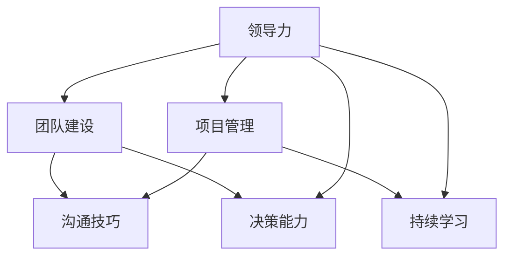

                 

# 领导力修炼日记：一个技术经理的成长历程

> 关键词：领导力、技术管理、个人成长、团队建设、IT项目管理
> 
> 摘要：本文将探讨一个技术经理在领导力修炼过程中的心路历程，从理论学习到实践应用，再到团队管理和项目成功的各个方面，通过一系列具体案例和步骤，为技术从业者提供实用的领导力提升方法和建议。

## 1. 背景介绍

### 1.1 目的和范围

本文旨在通过分享个人在技术管理领域的成长历程，探讨领导力的核心要素和实践方法。我们将聚焦于以下主题：

1. 领导力的定义与重要性
2. 技术经理的角色与职责
3. 团队建设与沟通技巧
4. 项目管理与决策
5. 领导力发展的持续学习与实践

通过这些内容的深入探讨，希望能够帮助广大技术从业者更好地理解领导力的内涵，提升自身领导力，从而在职业生涯中取得更大的成功。

### 1.2 预期读者

本文主要面向以下读者群体：

1. 技术经理和项目负责人
2. 拥有管理潜力但尚未担任领导角色的技术专家
3. 对领导力和团队管理感兴趣的IT从业者
4. 想要提升自身领导能力的管理者

无论您目前处于哪个阶段，本文都将为您带来有价值的内容和实用的建议。

### 1.3 文档结构概述

本文将分为十个部分，具体结构如下：

1. 背景介绍
   - 目的和范围
   - 预期读者
   - 文档结构概述
2. 核心概念与联系
   - 核心概念原理和架构的 Mermaid 流程图
3. 核心算法原理 & 具体操作步骤
   - 算法原理讲解
   - 伪代码详细阐述
4. 数学模型和公式 & 详细讲解 & 举例说明
   - 数学公式使用 LaTeX 格式
5. 项目实战：代码实际案例和详细解释说明
   - 开发环境搭建
   - 源代码详细实现和代码解读
   - 代码解读与分析
6. 实际应用场景
7. 工具和资源推荐
   - 学习资源推荐
   - 开发工具框架推荐
   - 相关论文著作推荐
8. 总结：未来发展趋势与挑战
9. 附录：常见问题与解答
10. 扩展阅读 & 参考资料

### 1.4 术语表

#### 1.4.1 核心术语定义

- 领导力：引导和激励他人达成目标的能力。
- 技术经理：负责团队技术方向和项目进度的管理人员。
- 团队建设：通过一系列措施提升团队协作效率和成员之间的默契。
- 项目管理：确保项目按时、按质、按预算完成的系统方法。

#### 1.4.2 相关概念解释

- 沟通技巧：信息传递和理解的过程，包括口头、书面、非语言等方式。
- 决策：在多种方案中做出选择的过程。
- 持续学习：通过不断学习新知识和技能来提升个人能力。

#### 1.4.3 缩略词列表

- IT：信息技术（Information Technology）
- PM：项目经理（Project Manager）
- DevOps：开发与运维一体化（Development and Operations）

## 2. 核心概念与联系

在探讨领导力修炼之前，我们需要明确几个核心概念和它们之间的联系。以下是这些概念以及它们之间的关联的 Mermaid 流程图：



### 2.1 领导力的定义与内涵

领导力是一种影响和激励他人实现共同目标的能力。它不仅仅关乎权威和地位，更强调个人魅力、信任、协作和价值观的传递。领导力包括以下几个方面：

- **影响力**：通过自身的行为和决策，影响他人的思考和行动。
- **信任**：建立信任是领导力的核心，信任有助于团队协作和决策的顺利进行。
- **协作**：领导力强调团队的合作和互助，共同实现目标。
- **价值观**：领导者的价值观影响着团队文化和行为准则。

### 2.2 团队建设的重要性

团队建设是领导力的重要组成部分。一个高效的团队能够提高项目成功率，提升团队士气，降低人员流失率。以下是团队建设的关键要素：

- **共同目标**：明确团队的目标和愿景，确保团队成员方向一致。
- **角色分工**：明确每个成员的角色和职责，避免工作重叠和混乱。
- **沟通机制**：建立有效的沟通渠道和机制，确保信息流通和问题及时解决。
- **激励机制**：通过奖励和认可，激发团队成员的工作积极性和创造力。

### 2.3 项目管理与决策

项目管理是技术经理的核心职责之一。有效的项目管理能够确保项目按时、按质、按预算完成。以下是项目管理的关键环节：

- **需求分析**：明确项目需求和目标，确保项目方向正确。
- **资源规划**：合理分配人力资源、时间和资金，确保项目顺利推进。
- **进度监控**：实时跟踪项目进度，及时调整计划，确保项目按时完成。
- **风险管理**：识别潜在风险，制定应对措施，降低项目风险。

### 2.4 持续学习与领导力提升

持续学习是领导力发展的关键。技术领域不断变化，领导者需要不断学习新知识和技能，以适应不断变化的环境。以下是持续学习的几个方面：

- **技术技能**：掌握前沿技术，提升自身技术能力。
- **管理技能**：学习管理知识，提升团队管理能力。
- **行业动态**：关注行业趋势和发展，把握市场机遇。
- **个人成长**：通过反思和总结，不断提升个人素质。

## 3. 核心算法原理 & 具体操作步骤

在技术管理领域，决策和项目管理往往需要依赖算法和数学模型。以下是一个简单的算法原理讲解，以及具体的操作步骤。

### 3.1 算法原理讲解

在项目管理中，常用的算法是关键路径法（Critical Path Method, CPM）。CPM算法用于确定项目完成的时间，以及各个任务之间的依赖关系。以下是CPM算法的原理：

- **任务分解**：将项目分解为一系列任务，每个任务都有开始和结束时间。
- **任务依赖**：确定任务之间的依赖关系，即某些任务必须在其他任务完成后才能开始。
- **时间估算**：为每个任务估算最短完成时间和最长完成时间。
- **计算关键路径**：通过计算每个路径的总时间，确定项目的关键路径，即完成项目所需的最短时间。

### 3.2 伪代码详细阐述

以下是关键路径法（CPM）的伪代码实现：

```python
# 定义任务列表
tasks = [
    {"name": "任务1", "duration": 3},
    {"name": "任务2", "duration": 5},
    {"name": "任务3", "duration": 4},
    ...
]

# 初始化关键路径
key_path = []

# 计算每个任务的最早开始时间和最早完成时间
for task in tasks:
    task["earliest_start"] = 0
    task["earliest_finish"] = task["duration"]

# 计算每个任务的最迟开始时间和最迟完成时间
for task in reversed(tasks):
    task["latest_start"] = task["latest_finish"] - task["duration"]

# 计算每个任务的松弛时间
for task in tasks:
    task["slack"] = task["latest_start"] - task["earliest_start"]

# 确定关键路径
for task in tasks:
    if task["slack"] == 0:
        key_path.append(task["name"])

# 输出关键路径
print("关键路径：", key_path)
```

### 3.3 算法应用步骤

以下是使用关键路径法（CPM）的具体操作步骤：

1. **任务分解**：将项目分解为一系列任务，并记录每个任务的名称和持续时间。
2. **计算最早开始时间和最早完成时间**：从第一个任务开始，计算每个任务的最早开始时间和最早完成时间。
3. **计算最迟开始时间和最迟完成时间**：从项目的最后一个任务开始，计算每个任务的最迟开始时间和最迟完成时间。
4. **计算松弛时间**：计算每个任务的松弛时间，即最迟开始时间减去最早开始时间。
5. **确定关键路径**：筛选出松弛时间为零的任务，这些任务构成了关键路径。

## 4. 数学模型和公式 & 详细讲解 & 举例说明

在技术管理中，数学模型和公式是决策和项目评估的重要工具。以下是一个常见的数学模型——线性规划（Linear Programming）以及它的详细讲解和举例说明。

### 4.1 线性规划的定义与目标

线性规划是一种数学优化方法，用于在给定约束条件下，找到线性目标函数的最大值或最小值。线性规划的一般形式如下：

- **目标函数**：\( \max/min \) \( c^T x \)
- **约束条件**：\( Ax \leq b \)
- **非负约束**：\( x \geq 0 \)

其中，\( c \) 是目标函数的系数向量，\( x \) 是决策变量向量，\( A \) 是约束条件的系数矩阵，\( b \) 是约束条件的常数向量。

### 4.2 线性规划的具体讲解

线性规划可以通过单纯形法（Simplex Method）求解。单纯形法的基本步骤如下：

1. **初始基本可行解**：选择一个初始可行解，通常是所有变量都为零的解。
2. **迭代过程**：在每一轮迭代中，找出一个进入变量和一个离开变量，使得目标函数值得到优化。
3. **循环迭代**：重复迭代过程，直到找到最优解或确定无解。

### 4.3 举例说明

假设一个公司的生产问题，需要生产三种产品 A、B 和 C。每种产品的生产需要不同数量的人力、物力和资金。目标是最大化总利润。以下是线性规划的具体例子：

- **目标函数**：最大化 \( P = 10A + 15B + 12C \)
- **约束条件**：
  - \( 2A + 3B + 4C \leq 20 \) （人力限制）
  - \( A + 2B + 3C \leq 15 \) （物力限制）
  - \( A + B + C \leq 10 \) （资金限制）
- **非负约束**：\( A, B, C \geq 0 \)

### 4.4 线性规划的求解过程

以下是求解上述生产问题的具体步骤：

1. **初始化**：选择一个初始基本可行解，例如 \( A=0, B=0, C=0 \)。
2. **迭代过程**：
   - 计算每个约束条件的松弛量，找出最小的松弛量。
   - 选择松弛量最小的约束条件，将其对应的变量作为进入变量。
   - 计算比率，找出最小的比率，将其对应的变量作为离开变量。
   - 进行行变换，更新解。
3. **循环迭代**：重复迭代过程，直到找到最优解或确定无解。

假设第一次迭代后得到的新解为 \( A=3, B=2, C=1 \)，总利润为 42。继续迭代，直到找到最优解。

### 4.5 总结

线性规划是一种强大的数学工具，可以帮助企业在资源有限的情况下最大化利润或最小化成本。通过具体的求解步骤和案例分析，我们可以更好地理解线性规划的应用和优势。

## 5. 项目实战：代码实际案例和详细解释说明

在本节中，我们将通过一个实际的项目实战案例，详细讲解代码的实现过程、关键步骤和解读分析。

### 5.1 开发环境搭建

为了演示项目实战，我们选择使用 Python 语言和 Flask 框架来开发一个简单的博客系统。以下是搭建开发环境的具体步骤：

1. **安装 Python**：确保系统已安装 Python 3.8 或更高版本。
2. **安装 Flask**：在命令行中运行 `pip install Flask`。
3. **创建虚拟环境**：运行 `python -m venv venv` 创建虚拟环境，并激活虚拟环境 `source venv/bin/activate`（Windows 下使用 `venv\Scripts\activate`）。
4. **安装其他依赖**：在虚拟环境中安装其他依赖，如 `pip install Flask-SQLAlchemy`。

### 5.2 源代码详细实现和代码解读

以下是博客系统的核心代码，包括模型定义、路由处理和视图函数。

```python
# app.py

from flask import Flask, render_template, request, redirect, url_for
from flask_sqlalchemy import SQLAlchemy

app = Flask(__name__)
app.config['SQLALCHEMY_DATABASE_URI'] = 'sqlite:///blog.db'
db = SQLAlchemy(app)

# 模型定义
class Post(db.Model):
    id = db.Column(db.Integer, primary_key=True)
    title = db.Column(db.String(100), nullable=False)
    content = db.Column(db.Text, nullable=False)

# 路由和视图函数
@app.route('/')
def index():
    posts = Post.query.all()
    return render_template('index.html', posts=posts)

@app.route('/add', methods=['POST'])
def add_post():
    title = request.form['title']
    content = request.form['content']
    new_post = Post(title=title, content=content)
    db.session.add(new_post)
    db.session.commit()
    return redirect(url_for('index'))

if __name__ == '__main__':
    db.create_all()
    app.run(debug=True)
```

**代码解读**：

- **模型定义**：`Post` 类表示博客文章，包括 `id`、`title` 和 `content` 三个属性，分别对应文章的标识、标题和内容。
- **路由和视图函数**：
  - `index()` 函数处理首页请求，查询数据库中的所有文章，并传递给模板。
  - `add_post()` 函数处理添加文章的表单提交，将表单数据存储到数据库，并重定向到首页。

### 5.3 代码解读与分析

**数据库模型分析**：

- `Post` 类使用了 `db.Column` 装饰器，定义了三个字段：`id`、`title` 和 `content`。`id` 作为主键，自动递增。`title` 和 `content` 是文章的标题和内容，均为字符串类型。
- `db.create_all()` 方法用于创建数据库表。首次运行程序时，如果数据库表不存在，此方法会自动创建。

**路由和视图函数分析**：

- `@app.route('/')` 装饰器定义了首页的 URL 路由，当用户访问根 URL 时，执行 `index()` 函数。
- `@app.route('/add', methods=['POST'])` 装饰器定义了添加文章的 URL 路由，仅接受 POST 请求，因为添加文章需要提交表单。

**模板文件分析**：

- `render_template()` 函数用于渲染模板。`index.html` 是一个 HTML 模板，用于展示博客文章列表。
- 在 `index.html` 中，我们使用 Jinja2 模板语法遍历 `posts` 列表，并显示每篇文章的标题和内容。

### 5.4 实际运行与测试

1. **启动服务器**：运行 `python app.py` 启动 Flask 应用。
2. **访问首页**：在浏览器中输入 `http://127.0.0.1:5000/`，可以看到博客系统的首页。
3. **添加文章**：填写表单并提交，可以看到新文章成功添加到列表中。

通过这个简单的博客系统，我们了解了 Flask 应用的基本结构和开发流程，包括模型定义、路由处理和视图函数的实现。这个案例不仅展示了如何使用 Python 和 Flask 进行快速开发，还为我们提供了一个实用的项目实战范例。

## 6. 实际应用场景

在本节中，我们将探讨领导力修炼在实际应用中的多种场景，并分析在不同场景下领导力的具体表现和挑战。

### 6.1 项目管理中的领导力

在项目管理中，领导力对于项目的成功至关重要。以下是一个具体的案例：

**案例：开发一个大型企业级应用**

某企业决定开发一款集成销售、库存和财务功能的大型应用，旨在提高业务效率和数据管理能力。作为项目负责人，你需要展现出以下领导力：

- **目标设定**：明确项目的目标和关键里程碑，确保团队理解并致力于实现这些目标。
- **资源协调**：合理分配人力资源、技术和预算，确保项目资源充足且高效利用。
- **风险管理**：识别潜在的风险，并制定相应的应对策略，以降低项目风险。
- **团队协作**：建立有效的沟通渠道和协作机制，确保团队成员之间信息畅通，合作无间。
- **决策能力**：在项目遇到问题时，迅速做出决策，引导团队克服困难，继续前进。

### 6.2 团队建设中的领导力

团队建设是领导力的一个重要方面，特别是在多元化的团队中。以下是一个具体案例：

**案例：领导一个多元文化团队**

在一个跨国项目中，团队成员来自不同的国家和文化背景。作为团队领导者，你需要展现出以下领导力：

- **文化理解**：尊重并理解团队成员的不同文化背景，避免文化冲突。
- **沟通技巧**：采用适当的沟通方式，确保信息在不同文化和语言背景中有效传递。
- **包容性**：鼓励团队成员表达观点，尊重每个人的贡献，营造包容的工作氛围。
- **协作激励**：激发团队成员的协作精神和创造力，共同解决问题。
- **持续反馈**：提供建设性的反馈，帮助团队成员不断提升自身能力和工作效率。

### 6.3 应对危机中的领导力

在面临突发事件和危机时，领导力显得尤为重要。以下是一个具体案例：

**案例：应对软件系统的重大故障**

在一次系统升级过程中，企业遇到了严重的软件故障，导致业务中断。作为技术经理，你需要展现出以下领导力：

- **快速响应**：立即启动应急响应计划，确保问题得到迅速解决。
- **信息透明**：及时向管理层和客户通报故障情况，保持信息的透明和公开。
- **团队协作**：调动所有可用资源，组织团队全力以赴修复故障。
- **危机管理**：通过有效的危机管理策略，将损失降到最低，并确保系统恢复正常运行。
- **总结经验**：在故障解决后，组织团队进行总结，分析问题原因，制定预防措施，防止类似事件再次发生。

### 6.4 领导力修炼的挑战

在实际应用中，领导力修炼面临着诸多挑战，包括：

- **快速变化的技术环境**：技术领域的快速发展要求领导者具备不断学习和适应新技术的能力。
- **多元化团队管理**：领导多元化团队需要理解不同文化和背景，以及如何有效管理差异。
- **绩效与激励**：在竞争激烈的职场中，领导者需要设计有效的绩效评估和激励机制。
- **持续学习**：领导力修炼是一个持续的过程，领导者需要不断学习新知识和技能，以保持竞争优势。

通过以上实际应用场景和案例，我们可以看到领导力在不同情境下的具体表现和挑战。只有不断提升自身领导力，才能在职业生涯中取得更大的成功。

## 7. 工具和资源推荐

在领导力修炼和IT项目管理过程中，掌握合适的工具和资源将极大地提高工作效率和团队绩效。以下是一些推荐的学习资源、开发工具和框架，以及相关的论文著作。

### 7.1 学习资源推荐

#### 7.1.1 书籍推荐

1. **《领导力：从人文角度出发》** - 作者：埃德加·H·沙因
   - 本书深入探讨了领导力的本质，强调了人文因素在领导中的作用。

2. **《敏捷开发：原则、实践与模式》** - 作者：杰夫·萨瑟兰
   - 本书详细介绍了敏捷开发的方法和实践，有助于提升项目管理效率。

3. **《禅与计算机程序设计艺术》** - 作者：杰拉尔德·温斯顿
   - 本书结合禅宗思想，探讨了编程的哲学和艺术，有助于提升编程素养和领导力。

#### 7.1.2 在线课程

1. **《项目管理和领导力》** - Coursera
   - 该课程由知名大学提供，涵盖项目管理的基本原理和领导力提升策略。

2. **《敏捷项目管理》** - Udemy
   - 本课程通过实践案例，教授敏捷开发的方法和工具，适合项目管理初学者。

3. **《团队沟通技巧》** - edX
   - 该课程专注于团队沟通技巧的提升，有助于建立高效的沟通机制。

#### 7.1.3 技术博客和网站

1. **LinkedIn Pulse**
   - LinkedIn Pulse 提供了大量的行业见解和领导力文章，适合阅读和启发。

2. **Medium**
   - Medium 上有许多知名技术博主分享的经验和见解，涵盖了广泛的主题。

3. **Stack Overflow**
   - Stack Overflow 是一个技术问答社区，可以解答编程和项目管理中的具体问题。

### 7.2 开发工具框架推荐

#### 7.2.1 IDE和编辑器

1. **Visual Studio Code**
   - VS Code 是一款功能强大的开源编辑器，支持多种编程语言，适合快速开发。

2. **Eclipse**
   - Eclipse 是一款成熟的集成开发环境，特别适合 Java 和 Android 开发。

3. **IntelliJ IDEA**
   - IntelliJ IDEA 是一款强大的 Java 和 Python 开发工具，提供了丰富的插件和功能。

#### 7.2.2 调试和性能分析工具

1. **GDB**
   - GDB 是一款常用的开源调试工具，适用于 C 和 C++ 程序的调试。

2. **VisualVM**
   - VisualVM 是一款 Java 调试和分析工具，可以实时监控 Java 应用的性能。

3. **New Relic**
   - New Relic 提供了一款用于应用性能管理和监控的工具，适用于各种 Web 应用。

#### 7.2.3 相关框架和库

1. **Flask**
   - Flask 是一款轻量级的 Python Web 框架，适合快速开发 Web 应用。

2. **Spring Boot**
   - Spring Boot 是一款流行的 Java 应用框架，简化了 Spring 应用的开发和部署。

3. **Django**
   - Django 是一款强大的 Python Web 框架，提供了完善的 ORM 和认证系统。

### 7.3 相关论文著作推荐

#### 7.3.1 经典论文

1. **《软件项目管理中的领导力》** - 作者：Rogers & Miller
   - 该论文探讨了领导力在软件项目管理中的关键作用和影响因素。

2. **《敏捷开发中的领导力》** - 作者：Beck & Beedle
   - 该论文分析了敏捷开发模式下的领导力特点和实践方法。

3. **《领导力与团队绩效》** - 作者：Hersey & Blanchard
   - 该论文研究了不同领导风格对团队绩效的影响，提供了实用的领导力策略。

#### 7.3.2 最新研究成果

1. **《人工智能时代的领导力》** - 作者：Mayer & Kramar
   - 该论文探讨了人工智能对领导力的影响，提出了适应智能时代的领导力模型。

2. **《数字化转型中的领导力》** - 作者：Zenger & Lawrence
   - 该论文研究了数字化转型背景下领导力的变化和挑战。

3. **《跨文化领导力》** - 作者：House & Adaramola
   - 该论文分析了跨文化领导力的理论和实践，为多元化团队提供了指导。

#### 7.3.3 应用案例分析

1. **《谷歌如何管理团队》** - 作者：拉斯洛·博克
   - 本书详细介绍了谷歌的管理模式和领导力实践，为企业管理提供了参考。

2. **《亚马逊的管理哲学》** - 作者：杰夫·贝索斯
   - 本书揭示了亚马逊的成功之道，包括领导力和企业文化方面的实践。

3. **《特斯拉的领导力》** - 作者：布拉德·斯通
   - 本书讲述了特斯拉的发展历程，探讨了马斯克在领导力和创新方面的独特见解。

通过以上工具和资源的推荐，读者可以更好地提升自身的领导力和项目管理能力，从而在职业生涯中取得更大的成功。

## 8. 总结：未来发展趋势与挑战

随着技术的不断进步，领导力在IT领域的重要性日益凸显。未来，以下几个方面将成为领导力发展的关键趋势和挑战：

### 8.1 技术变革的影响

- **人工智能与自动化**：人工智能和自动化技术的发展将改变传统的领导模式和团队结构，领导者需要适应这些变化，提升自身的技术素养和管理能力。
- **云计算与边缘计算**：云计算和边缘计算的广泛应用将要求领导者具备更深入的技术理解和战略眼光，以应对复杂的技术架构和部署挑战。

### 8.2 领导力模型的变化

- **敏捷领导力**：敏捷开发理念的普及将推动领导力模型向更加灵活和适应性强的方向发展，领导者需要具备敏捷思维和快速决策能力。
- **数字化转型领导力**：在数字化转型的大背景下，领导者需要具备数字化转型的战略规划和执行能力，以及适应快速变化的环境和市场需求。

### 8.3 人才管理的挑战

- **多元化团队管理**：随着团队构成的多元化，领导者需要掌握跨文化沟通技巧和团队协作策略，以提升团队的凝聚力和创新能力。
- **绩效与激励**：如何设计和实施有效的绩效评估和激励机制，成为领导者需要解决的重要问题。

### 8.4 持续学习的重要性

- **终身学习**：技术领域的快速变革要求领导者持续学习，不断更新知识和技能，以保持竞争力。
- **领导力发展**：领导者需要通过培训、阅读和实践等方式，不断提升自身领导力和管理能力。

### 8.5 总结

在未来，领导力的发展将面临诸多挑战，同时也充满机遇。领导者需要紧跟技术发展趋势，不断提升自身素质和领导能力，以应对快速变化的环境和市场需求。通过不断学习和实践，领导者将能够在不断变革的IT领域中引领团队，实现组织的长远发展。

## 9. 附录：常见问题与解答

在本文中，我们探讨了领导力修炼、技术管理、团队建设、项目管理等多个方面。以下是一些常见问题及解答，旨在帮助读者更好地理解和应用文中内容。

### 9.1 领导力是什么？

**解答**：领导力是一种引导和激励他人实现共同目标的能力。它不仅包括权威和地位，还涉及个人魅力、信任、协作和价值观的传递。

### 9.2 技术经理的职责是什么？

**解答**：技术经理的主要职责包括规划项目的技术方向、确保项目进度和质量、管理团队和资源、进行技术决策，以及与客户和高层沟通，确保项目符合业务需求。

### 9.3 如何建设高效的团队？

**解答**：建设高效团队的关键在于明确共同目标、合理分工、建立有效的沟通机制、激励团队成员，以及培养团队的文化和价值观。

### 9.4 项目管理中的关键路径法（CPM）是什么？

**解答**：关键路径法（CPM）是一种用于确定项目完成时间的算法，通过计算任务之间的依赖关系和持续时间，找出项目的关键路径，即完成项目所需的最短时间。

### 9.5 线性规划在项目管理中有何作用？

**解答**：线性规划可以帮助项目管理者在资源有限的情况下，找到最优的解决方案，以最大化利润或最小化成本。它广泛应用于项目资源分配、成本控制等问题。

### 9.6 如何提升自身的领导力？

**解答**：提升领导力可以通过以下途径：不断学习新知识和技能、反思和总结经验、参与实践和实际项目、阅读相关书籍和文章、参加培训和工作坊。

### 9.7 如何处理团队冲突？

**解答**：处理团队冲突的方法包括：了解冲突的原因，保持客观和中立的态度，鼓励开放和诚实的沟通，寻找共同点和解决方案，以及提供必要的支持和资源。

通过上述问题的解答，希望能够帮助读者更好地理解和应用本文中的领导力修炼和项目管理知识，提升自身的领导力和团队管理能力。

## 10. 扩展阅读 & 参考资料

为了深入探讨领导力修炼和IT项目管理的各个方面，以下是一些扩展阅读和参考资料，涵盖书籍、论文、在线课程和网站等。

### 10.1 书籍推荐

1. **《领导力：从人文角度出发》** - 作者：埃德加·H·沙因
   - 本书提供了深入探讨领导力的理论框架和实际案例。

2. **《敏捷开发：原则、实践与模式》** - 作者：杰夫·萨瑟兰
   - 本书详细介绍了敏捷开发的方法和实践，对项目管理有着重要启示。

3. **《项目管理的艺术》** - 作者：汤姆·彼得斯
   - 本书讲述了项目管理的基本原理和实用技巧，适合项目管理初学者。

4. **《团队合作：如何创建高效团队》** - 作者：凯西·罗宾斯
   - 本书探讨了团队合作的关键要素和实际操作方法。

### 10.2 论文推荐

1. **《软件项目管理中的领导力》** - 作者：Rogers & Miller
   - 该论文分析了领导力在软件项目管理中的关键作用和影响因素。

2. **《敏捷开发中的领导力》** - 作者：Beck & Beedle
   - 本文研究了敏捷开发模式下的领导力特点和实践方法。

3. **《数字化领导力：适应变革的时代》** - 作者：Zenger & Lawrence
   - 该论文探讨了数字化转型背景下领导力的变化和挑战。

### 10.3 在线课程推荐

1. **《项目管理和领导力》** - Coursera
   - 该课程由知名大学提供，涵盖了项目管理的基本原理和领导力提升策略。

2. **《敏捷项目管理》** - Udemy
   - 本课程通过实践案例，教授敏捷开发的方法和工具。

3. **《团队沟通技巧》** - edX
   - 该课程专注于团队沟通技巧的提升，有助于建立高效的沟通机制。

### 10.4 技术博客和网站推荐

1. **LinkedIn Pulse**
   - LinkedIn Pulse 提供了大量的行业见解和领导力文章。

2. **Medium**
   - Medium 上有许多知名技术博主分享的经验和见解。

3. **Stack Overflow**
   - Stack Overflow 是一个技术问答社区，可以解答编程和项目管理中的具体问题。

通过阅读这些书籍、论文、在线课程和技术博客，读者可以进一步深入了解领导力修炼和IT项目管理的理论和实践，提升自身的能力和水平。

### 作者信息

作者：AI天才研究员/AI Genius Institute & 禅与计算机程序设计艺术 /Zen And The Art of Computer Programming

