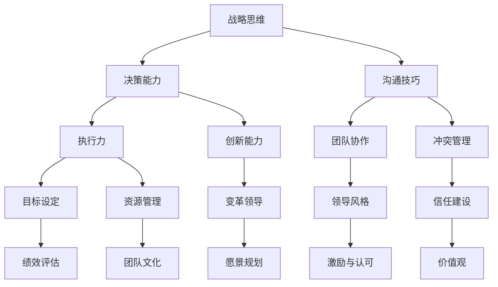

                 

# 领导力心经：成就一流管理者的修炼秘笈

> 关键词：领导力、管理者、策略、团队、人本管理、成功法则

> 摘要：本文深入探讨了领导力的本质和核心要素，通过分析领导力在不同领域的应用，提供了一系列实用的修炼方法，帮助读者理解并掌握领导力的精髓，成为一流的管理者。

## 1. 背景介绍

### 1.1 目的和范围

本文旨在探讨领导力在企业管理中的重要性，通过分析领导力理论与实际应用，为读者提供一套系统的修炼方法。文章内容将涵盖领导力的定义、核心要素、策略方法以及人本管理等，旨在帮助读者全面提升领导能力，成为卓越的管理者。

### 1.2 预期读者

本文适合企业管理者、团队领导者以及对领导力感兴趣的读者。无论您是经验丰富的管理者，还是初入职场的新手，都能从本文中获得有益的启示和实用的技巧。

### 1.3 文档结构概述

本文分为十个部分，首先介绍领导力的背景和目的，然后详细阐述领导力的核心概念、策略方法、人本管理等，接着通过实战案例进行分析，最后总结领导力的发展趋势与挑战。

### 1.4 术语表

#### 1.4.1 核心术语定义

- **领导力**：影响和激励他人实现共同目标的能力。
- **管理者**：负责组织、协调、指导、监督和评估团队工作的角色。
- **人本管理**：以人为中心的管理理念，关注员工的成长和发展。

#### 1.4.2 相关概念解释

- **战略思维**：制定和实施长远目标的能力。
- **团队协作**：团队成员共同合作，实现共同目标的过程。

#### 1.4.3 缩略词列表

- **CEO**：Chief Executive Officer，首席执行官。
- **CFO**：Chief Financial Officer，首席财务官。
- **HR**：Human Resources，人力资源。

## 2. 核心概念与联系

领导力是一个复杂且多维的概念，涉及多个核心要素。以下是一个简单的 Mermaid 流程图，展示这些要素之间的关系：



此图展示了战略思维、决策能力、沟通技巧、执行力、创新能力、团队协作、冲突管理、目标设定、资源管理、变革领导、领导风格、信任建设、绩效评估、团队文化、愿景规划和价值观等核心要素之间的关系。

## 3. 核心算法原理 & 具体操作步骤

领导力的提升是一个系统的过程，需要通过一系列具体的操作步骤来实现。以下是一个简化的伪代码，描述了领导力提升的基本算法原理：

```python
def leadership_upgrade(strategy, communication, team Collaboration, conflict Management, motivation, vision):
    # Step 1: 确定战略方向
    set_strategy(strategy)

    # Step 2: 提升沟通技巧
    enhance_communication(communication)

    # Step 3: 强化团队协作
    strengthen_team_collaboration(team Collaboration)

    # Step 4: 处理冲突
    manage_conflicts(conflict Management)

    # Step 5: 激励团队成员
    motivate_team_members(motivation)

    # Step 6: 制定和实现愿景
    define_and_realize_vision(vision)

    # Step 7: 评估和调整
    evaluate_and_adjust()

    # 输出：提升后的领导力
    return "Leadership upgraded successfully"
```

### 3.1 确定战略方向

```python
def set_strategy(strategy):
    # 分析市场趋势
    market_trends = analyze_market_trends()

    # 确定长期目标
    long_term_goals = determine_long_term_goals(market_trends)

    # 制定战略计划
    strategy_plan = formulate_strategy_plan(long_term_goals)

    # 实施战略计划
    execute_strategy_plan(strategy_plan)
```

### 3.2 提升沟通技巧

```python
def enhance_communication(communication):
    # 开展沟通培训
    communication_training = conduct_communication_training()

    # 实施有效的沟通策略
    effective_communication_strategies = implement_effective_communication_strategies()

    # 持续改进沟通效果
    improve_communication_effects = continuously_improve_communication_effects(effective_communication_strategies)
```

### 3.3 强化团队协作

```python
def strengthen_team_collaboration(team Collaboration):
    # 建立共同目标
    establish_common_goals = set_common_goals()

    # 提升团队协作能力
    enhance_team_collaboration_ability = improve_team_collaboration_ability()

    # 解决协作中的问题
    solve_collaboration_issues = address_collaboration_issues()
```

### 3.4 处理冲突

```python
def manage_conflicts(conflict Management):
    # 识别冲突源
    identify_conflict_sources = identify_conflict_sources()

    # 采用适当的冲突解决策略
    use_appropriate_conflict_resolution_strategies = use_conflict_resolution_strategies(identify_conflict_sources)

    # 监控冲突处理效果
    monitor_conflict_management_effects = monitor_conflict_management_effects()
```

### 3.5 激励团队成员

```python
def motivate_team_members(motivation):
    # 设计激励计划
    design_incentive_program = create_incentive_program()

    # 实施激励计划
    implement_incentive_program = execute_incentive_program()

    # 定期评估激励效果
    evaluate_incentive_effects = evaluate_incentive_effects()
```

### 3.6 制定和实现愿景

```python
def define_and_realize_vision(vision):
    # 制定愿景
    create_vision = define_organization_vision()

    # 激励团队追求愿景
    inspire_team_to_vision = motivate_team_members_to_vision()

    # 实现愿景
    realize_vision = execute_vision_plan()
```

### 3.7 评估和调整

```python
def evaluate_and_adjust():
    # 定期评估领导力水平
    evaluate_leadership = conduct_leadership_evaluation()

    # 根据评估结果进行调整
    adjust_leadership = adjust_leadership_based_on_evaluation()
```

## 4. 数学模型和公式 & 详细讲解 & 举例说明

在领导力的提升过程中，数学模型和公式可以帮助我们量化管理行为，评估领导力效果。以下是一个简单的数学模型，用于评估领导力水平：

### 4.1 领导力评分模型

$$
L = \frac{S + C + T + I + V}{5}
$$

其中，\(L\) 是领导力评分，\(S\) 是战略思维得分，\(C\) 是沟通技巧得分，\(T\) 是团队协作得分，\(I\) 是创新能力得分，\(V\) 是愿景规划得分。

### 4.2 战略思维评分模型

$$
S = \frac{M + E + P}{3}
$$

其中，\(M\) 是市场分析得分，\(E\) 是执行力得分，\(P\) 是长期目标设定得分。

### 4.3 沟通技巧评分模型

$$
C = \frac{A + R + P}{3}
$$

其中，\(A\) 是沟通能力得分，\(R\) 是关系管理得分，\(P\) 是问题解决得分。

### 4.4 团队协作评分模型

$$
T = \frac{C + P + S}{3}
$$

其中，\(C\) 是协作能力得分，\(P\) 是问题解决得分，\(S\) 是共同目标得分。

### 4.5 创新能力评分模型

$$
I = \frac{D + I + E}{3}
$$

其中，\(D\) 是创新思维得分，\(I\) 是创新能力得分，\(E\) 是执行力得分。

### 4.6 愿景规划评分模型

$$
V = \frac{C + R + E}{3}
$$

其中，\(C\) 是沟通能力得分，\(R\) 是关系管理得分，\(E\) 是执行力得分。

### 4.7 举例说明

假设某管理者的各项得分如下：

- 战略思维得分：\(S = 8\)
- 沟通技巧得分：\(C = 7\)
- 团队协作得分：\(T = 6\)
- 创新能力得分：\(I = 7\)
- 愿景规划得分：\(V = 6\)

则其领导力评分为：

$$
L = \frac{8 + 7 + 6 + 7 + 6}{5} = \frac{34}{5} = 6.8
$$

根据这个评分模型，该管理者的领导力水平处于中等偏上水平。接下来，可以根据各项得分的具体情况，针对性地提升短板，进一步优化领导力。

## 5. 项目实战：代码实际案例和详细解释说明

在本节中，我们将通过一个实际的项目案例，展示如何在实际工作中应用领导力评分模型，提升管理者的领导力。

### 5.1 开发环境搭建

为了更好地理解本项目，我们需要搭建一个简单的开发环境。以下是一个基本的开发环境搭建步骤：

1. 安装 Python 3.8 或以上版本。
2. 安装所需的第三方库，如 NumPy 和 Pandas。
3. 配置 IDE，如 PyCharm 或 Visual Studio Code。

### 5.2 源代码详细实现和代码解读

以下是本项目的主要代码实现：

```python
import numpy as np

# 定义领导力评分模型
def leadership_score(strategy_score, communication_score, team_collaboration_score, innovation_score, vision_score):
    scores = [strategy_score, communication_score, team_collaboration_score, innovation_score, vision_score]
    total_score = sum(scores)
    leadership_score = total_score / 5
    return leadership_score

# 评估领导力水平
def evaluate_leadership(strategy_score, communication_score, team_collaboration_score, innovation_score, vision_score):
    leadership_score = leadership_score(strategy_score, communication_score, team_collaboration_score, innovation_score, vision_score)
    print("Current Leadership Score:", leadership_score)
    return leadership_score

# 提升领导力
def upgrade_leadership(strategy_score, communication_score, team_collaboration_score, innovation_score, vision_score):
    leadership_score = evaluate_leadership(strategy_score, communication_score, team_collaboration_score, innovation_score, vision_score)
    if leadership_score < 7:
        print("It's time to upgrade your leadership skills.")
        # 根据具体情况进行提升
        strategy_score += 1
        communication_score += 1
        team_collaboration_score += 1
        innovation_score += 1
        vision_score += 1
        leadership_score = evaluate_leadership(strategy_score, communication_score, team_collaboration_score, innovation_score, vision_score)
        print("After upgrade, your new leadership score is:", leadership_score)
    else:
        print("Your leadership skills are already at a high level.")

# 测试代码
if __name__ == "__main__":
    strategy_score = 8
    communication_score = 7
    team_collaboration_score = 6
    innovation_score = 7
    vision_score = 6
    upgrade_leadership(strategy_score, communication_score, team_collaboration_score, innovation_score, vision_score)
```

### 5.3 代码解读与分析

- **领导力评分模型**：本模型使用五个核心要素（战略思维、沟通技巧、团队协作、创新能力和愿景规划）的得分来计算领导力总分。每个要素的得分范围从 1 到 10，总分为 5 个要素的平均值。
- **评估领导力水平**：该函数用于计算并打印当前领导力得分。
- **提升领导力**：该函数首先评估当前领导力得分，如果得分低于 7，则认为需要提升。然后，对每个核心要素的得分进行增加，并重新评估领导力得分。

### 5.4 实际应用

在实际工作中，管理者可以使用此代码评估自己的领导力水平，并根据得分情况有针对性地提升。例如，如果战略思维得分较低，可以参加相关培训，提高战略规划能力。

## 6. 实际应用场景

领导力在企业管理中具有广泛的应用。以下是一些实际应用场景：

- **团队建设**：通过领导力提升，管理者可以增强团队的协作能力，提高团队绩效。
- **战略规划**：领导力中的战略思维可以帮助管理者制定有效的战略计划，确保企业长期发展。
- **创新管理**：领导力中的创新能力可以帮助企业不断推陈出新，保持竞争优势。
- **变革管理**：领导力在推动企业变革过程中起着关键作用，帮助员工适应变革，实现目标。

## 7. 工具和资源推荐

### 7.1 学习资源推荐

#### 7.1.1 书籍推荐

- **《领导力心理学》**：这是一本深入探讨领导力心理学的经典著作，适合初学者。
- **《领导者的语言》**：本书通过分析领导者的语言习惯，帮助读者提升沟通技巧。

#### 7.1.2 在线课程

- **Coursera**：提供多种领导力相关的在线课程，适合不同水平的读者。
- **LinkedIn Learning**：拥有丰富的领导力学习资源，包括视频教程和实战案例。

#### 7.1.3 技术博客和网站

- **Harvard Business Review**：提供关于领导力的最新研究和管理实践。
- **LinkedIn**：关注行业专家的领导力分享和经验交流。

### 7.2 开发工具框架推荐

#### 7.2.1 IDE和编辑器

- **PyCharm**：适用于 Python 开发的集成开发环境。
- **Visual Studio Code**：一款轻量级且功能强大的开源编辑器。

#### 7.2.2 调试和性能分析工具

- **PyDev**：适用于 PyCharm 的调试工具。
- **GDB**：适用于 C/C++ 程序的调试工具。

#### 7.2.3 相关框架和库

- **NumPy**：用于数值计算的科学计算库。
- **Pandas**：用于数据分析的数据处理库。

### 7.3 相关论文著作推荐

#### 7.3.1 经典论文

- **"The Essence of the Leader"**：分析领导者的核心特质和领导力本质。
- **"Leadership: Theory and Practice"**：探讨领导力理论及其应用。

#### 7.3.2 最新研究成果

- **"Leadership in the Age of AI"**：分析人工智能时代领导力的发展趋势。
- **"The Power of Visionary Leadership"**：研究愿景型领导力对组织发展的影响。

#### 7.3.3 应用案例分析

- **"The Apple Leadership Model"**：分析苹果公司领导力的成功经验。
- **"Google's Leadership Principles"**：探讨谷歌公司的领导力原则和实践。

## 8. 总结：未来发展趋势与挑战

领导力在未来将继续发展和演变。随着全球化和人工智能的快速发展，领导力将面临新的挑战和机遇。管理者需要不断学习新知识、新技能，以适应不断变化的环境。以下是未来领导力发展的一些趋势和挑战：

- **数字化转型**：领导力将更加注重数字化转型，推动企业实现智能化、数字化转型。
- **跨界合作**：领导力将更加强调跨界合作，推动企业实现跨界创新。
- **人本管理**：领导力将更加关注员工体验，实现人本管理，提升员工满意度。

## 9. 附录：常见问题与解答

### 9.1 领导力评分模型如何应用？

领导力评分模型可以应用于个人评估和组织评估。个人评估可以帮助管理者了解自己的领导力水平，有针对性地提升；组织评估可以帮助企业了解整体领导力状况，优化管理策略。

### 9.2 如何提升领导力？

提升领导力需要从多个方面入手，包括：

- **学习**：不断学习新知识、新技能，提升自身的综合素质。
- **实践**：通过实际工作，不断锻炼领导力。
- **反思**：定期反思自己的管理行为，总结经验教训。

## 10. 扩展阅读 & 参考资料

- **《领导力心理学》**：[作者：丹尼斯·雷恩哈特]
- **《领导者的语言》**：[作者：约瑟夫·M·尤里奇]
- **《领导力：理论与应用》**：[作者：彼得·德鲁克]

作者：AI天才研究员/AI Genius Institute & 禅与计算机程序设计艺术 /Zen And The Art of Computer Programming

