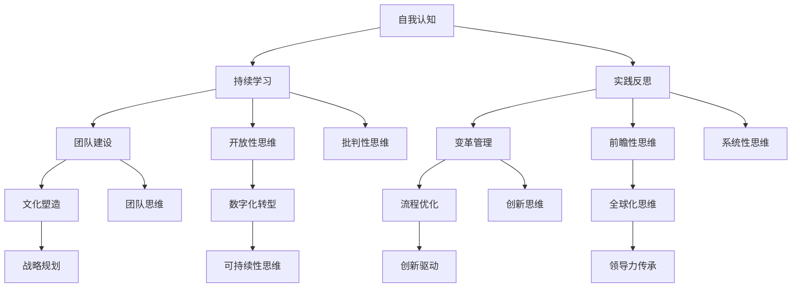

                 

### 领导力思维：改变世界格局的领导力修炼

> **关键词**：领导力、思维模式、世界格局、组织发展、变革管理

> **摘要**：本文旨在探讨领导力思维对于改变世界格局的重要性。通过深入分析领导力的本质、思维模式及其与组织发展的关系，本文揭示了领导力修炼的关键步骤和策略。本文将帮助读者理解如何在不断变化的世界中，通过培养强大的领导力思维，引领团队和组织走向成功。

在当今这个快速变化和高度复杂的世界，领导力已经成为决定一个组织、团队乃至整个社会成功与否的关键因素。然而，领导力并非与生俱来，而是可以通过学习和修炼获得的重要技能。本文将围绕领导力思维这一核心概念，逐步分析其在改变世界格局中的作用。

## 1. 背景介绍

### 1.1 目的和范围

本文的目的是探讨领导力思维对于改变世界格局的重要性，并揭示其背后的原理和实践方法。文章将涵盖以下主要内容：

1. 领导力的本质和定义。
2. 领导力思维的核心概念和构成。
3. 领导力思维与组织发展的关系。
4. 改变世界格局的关键领导力思维策略。
5. 领导力思维的实践方法和案例分析。

### 1.2 预期读者

本文的预期读者包括以下几类：

1. 管理者和领导者，希望通过学习和实践提升自己的领导力水平。
2. 企业家和创业者，希望了解如何通过领导力思维推动企业发展和创新。
3. 组织变革者，希望掌握领导力思维在推动组织变革中的作用。
4. 对领导力和管理感兴趣的研究人员和学者。

### 1.3 文档结构概述

本文将按照以下结构展开：

1. 引言：介绍领导力思维的重要性和本文的目的。
2. 核心概念与联系：分析领导力的本质和领导力思维的核心概念。
3. 核心算法原理 & 具体操作步骤：详细阐述领导力思维的实践方法和步骤。
4. 数学模型和公式 & 详细讲解 & 举例说明：使用数学模型和公式解释领导力思维的关键点。
5. 项目实战：通过实际案例展示领导力思维的应用。
6. 实际应用场景：分析领导力思维在不同领域的应用。
7. 工具和资源推荐：推荐相关的学习资源和工具。
8. 总结：回顾领导力思维的重要性，展望未来发展趋势。
9. 附录：常见问题与解答。
10. 扩展阅读 & 参考资料：提供进一步学习的资源和参考。

### 1.4 术语表

为了确保文章的可读性和一致性，本文将使用以下术语，并给出相应的定义和解释：

#### 1.4.1 核心术语定义

- **领导力**：指领导者通过影响力、愿景和策略引导、激励和塑造团队和组织的行为和成果的能力。
- **思维模式**：指个体在思考、决策和解决问题时采用的思维方式和习惯。
- **组织发展**：指通过战略规划、文化建设和流程优化等手段，提升组织整体绩效和能力的过程。
- **变革管理**：指在组织变革过程中，通过沟通、培训、激励等手段，引导员工适应新变化、实现组织目标的过程。

#### 1.4.2 相关概念解释

- **领导力思维**：指领导者在面对复杂问题时，运用逻辑、创造力和批判性思维，形成正确决策和行动的能力。
- **变革领导力**：指在组织变革过程中，领导者通过愿景引导、变革管理和团队激励等手段，推动组织变革并实现成功的领导力。
- **战略思维**：指在制定和执行组织战略时，领导者运用前瞻性思维、市场洞察力和战略规划能力，实现组织目标的能力。

#### 1.4.3 缩略词列表

- **CEO**：Chief Executive Officer，首席执行官
- **CIO**：Chief Information Officer，首席信息官
- **CTO**：Chief Technology Officer，首席技术官
- **IT**：Information Technology，信息技术

## 2. 核心概念与联系

在深入探讨领导力思维之前，我们需要明确领导力的本质及其与思维模式的关系。领导力不仅仅是一种权力和地位的象征，更是一种能力和艺术。它涉及领导者如何通过思维模式、决策能力和行为方式来影响和激励团队成员，实现共同的目标。

### 2.1 领导力的本质

领导力是一种动态的过程，它不仅仅依赖于领导者的个人特质，还受到环境、团队和文化等多方面因素的影响。以下是领导力的几个核心本质：

1. **影响力**：领导者通过愿景、目标和价值观等手段，影响和激励团队成员，形成共同的目标和行动。
2. **影响力**：领导者需要具备解决问题的能力，能够快速应对复杂多变的环境，并做出正确的决策。
3. **引领变革**：在快速变化的世界中，领导者需要具备推动组织变革的能力，引导团队适应新环境、新挑战。
4. **团队建设**：领导者需要具备构建和培养高效团队的技能，通过团队协作实现组织目标。
5. **沟通与协作**：领导者需要具备良好的沟通和协作能力，能够与团队成员、利益相关者建立信任和合作关系。

### 2.2 领导力思维的核心概念

领导力思维是领导者面对复杂问题时，运用逻辑、创造力和批判性思维，形成正确决策和行动的能力。以下是领导力思维的核心概念：

1. **系统性思维**：领导者需要具备系统性思维，能够从全局出发，分析问题的因果关系，并制定综合性的解决方案。
2. **前瞻性思维**：领导者需要具备前瞻性思维，能够预见未来趋势和变化，并制定相应的战略和规划。
3. **创新思维**：领导者需要具备创新思维，能够不断寻求新的方法和技术，推动组织创新和发展。
4. **批判性思维**：领导者需要具备批判性思维，能够客观分析问题，识别潜在风险和机会，并制定科学的决策。
5. **团队思维**：领导者需要具备团队思维，能够与团队成员建立信任和合作关系，共同实现组织目标。

### 2.3 领导力思维与组织发展的关系

领导力思维与组织发展密切相关。一个高效的领导团队能够通过有效的领导力思维，推动组织实现以下目标：

1. **战略规划**：领导力思维能够帮助组织制定清晰的愿景和战略目标，明确发展路径和优先级。
2. **文化塑造**：领导力思维能够推动组织形成积极向上的企业文化，提高员工满意度和凝聚力。
3. **流程优化**：领导力思维能够帮助组织识别和优化内部流程，提高效率和绩效。
4. **创新驱动**：领导力思维能够推动组织不断探索新技术、新产品，实现持续创新和发展。

### 2.4 改变世界格局的关键领导力思维策略

在全球化和技术变革的背景下，领导者需要具备以下关键领导力思维策略，以改变世界格局：

1. **全球化思维**：领导者需要具备全球化视野，能够适应全球化趋势，制定国际化战略。
2. **开放性思维**：领导者需要具备开放性思维，能够接受不同文化和观点，推动组织多元化发展。
3. **可持续性思维**：领导者需要具备可持续性思维，能够关注环境保护和社会责任，推动可持续发展。
4. **数字化转型**：领导者需要具备数字化转型思维，能够把握数字化趋势，推动组织数字化转型。
5. **领导力传承**：领导者需要具备领导力传承思维，能够培养和传承领导力，确保组织持续发展。

### 2.5 领导力思维的实践方法和步骤

为了培养强大的领导力思维，领导者需要遵循以下实践方法和步骤：

1. **自我认知**：领导者需要深入了解自己的优势和劣势，建立自信，并不断自我提升。
2. **持续学习**：领导者需要保持持续学习的态度，不断更新知识和技能，跟上时代变化。
3. **实践反思**：领导者需要通过实践反思，总结经验教训，不断改进领导方法和策略。
4. **团队建设**：领导者需要注重团队建设，培养团队成员的领导力和协作精神，形成高效团队。
5. **变革管理**：领导者需要具备变革管理能力，能够引导团队适应变革，实现组织目标。

### 2.6 领导力思维的关键节点和流程图

为了更好地理解领导力思维的核心概念和实践方法，我们可以使用Mermaid流程图来展示其关键节点和流程。以下是领导力思维的Mermaid流程图：



通过以上流程图，我们可以清晰地看到领导力思维的核心概念和实践方法之间的联系。领导者需要通过自我认知、持续学习、实践反思、团队建设、变革管理等多方面的努力，培养和提升自己的领导力思维，以应对复杂多变的环境和挑战。

## 3. 核心算法原理 & 具体操作步骤

领导力思维的培养并非一蹴而就，而是一个持续的学习和实践过程。以下是具体的操作步骤和算法原理，帮助领导者逐步提升领导力思维。

### 3.1 自我认知

**算法原理**：
自我认知是领导力思维的基础，它包括了解自己的价值观、优势、劣势、兴趣爱好等。通过自我认知，领导者可以更好地定位自己的角色和目标，提高自我效能感。

**操作步骤**：
1. **反思**：定期反思自己的行为和决策，分析成功和失败的原因。
2. **反馈**：主动寻求他人的反馈，了解自己的优缺点。
3. **自我评估**：根据反思和反馈，进行自我评估，明确自己的优势和劣势。

**伪代码**：
```
function 自我认知() {
    反思();
    反馈();
    自我评估();
}
```

### 3.2 持续学习

**算法原理**：
持续学习是提升领导力思维的关键，它包括获取新知识、技能和经验。通过持续学习，领导者可以不断更新自己的认知框架，适应快速变化的环境。

**操作步骤**：
1. **制定学习计划**：根据个人需求和目标，制定学习计划。
2. **阅读**：定期阅读相关书籍、文章和报告，了解行业动态和前沿技术。
3. **实践**：通过实践和项目经验，将理论知识应用到实际工作中。
4. **交流**：参与研讨会、会议和社群活动，与他人交流学习心得。

**伪代码**：
```
function 持续学习() {
    制定学习计划();
    阅读();
    实践();
    交流();
}
```

### 3.3 实践反思

**算法原理**：
实践反思是通过实际行动和反馈来检验和改进领导力思维。它包括总结经验教训、识别问题、制定改进措施等。

**操作步骤**：
1. **总结经验**：在完成项目或任务后，总结经验教训，分析成功和失败的原因。
2. **识别问题**：通过反思和反馈，识别自己在领导力思维方面的不足和问题。
3. **制定改进措施**：根据识别出的问题，制定具体的改进措施，并实施。

**伪代码**：
```
function 实践反思() {
    总结经验();
    识别问题();
    制定改进措施();
}
```

### 3.4 团队建设

**算法原理**：
团队建设是提升领导力思维的重要环节，它包括培养团队成员的领导力、协作能力和团队文化。

**操作步骤**：
1. **明确团队目标**：与团队成员共同制定明确的目标和期望。
2. **培养团队成员**：通过培训和指导，培养团队成员的领导力和技能。
3. **建立团队文化**：营造积极向上的团队氛围，提高团队凝聚力和协作效率。
4. **激励团队成员**：通过奖励和认可，激励团队成员发挥潜力，共同实现目标。

**伪代码**：
```
function 团队建设() {
    明确团队目标();
    培养团队成员();
    建立团队文化();
    激励团队成员();
}
```

### 3.5 变革管理

**算法原理**：
变革管理是领导者应对外部环境变化和内部组织变革的重要手段。它包括制定变革策略、沟通变革理念、激励变革参与等。

**操作步骤**：
1. **评估变革需求**：分析外部环境和内部组织的现状，确定变革的必要性和紧迫性。
2. **制定变革策略**：根据变革需求，制定具体的变革策略和计划。
3. **沟通变革理念**：与团队成员沟通变革的目标、意义和预期成果，争取他们的支持和参与。
4. **激励变革参与**：通过奖励和认可，激励团队成员积极参与变革，并确保变革顺利进行。

**伪代码**：
```
function 变革管理() {
    评估变革需求();
    制定变革策略();
    沟通变革理念();
    激励变革参与();
}
```

通过以上具体的操作步骤和算法原理，领导者可以逐步培养和提升自己的领导力思维。在实践过程中，领导者需要不断反思和调整自己的领导方法，以适应不断变化的环境和挑战。

## 4. 数学模型和公式 & 详细讲解 & 举例说明

在领导力思维的培养过程中，数学模型和公式可以提供有力的理论支持。以下是一些关键的数学模型和公式，以及详细的讲解和实际应用。

### 4.1 效率优化模型

**模型**：
效率优化模型主要用于分析团队和组织在资源分配和任务调度中的最优解。以下是简单的线性规划模型：

$$
\begin{aligned}
    \text{maximize} \quad & Z = c^T x \\
    \text{subject to} \quad & Ax \leq b \\
    & x \geq 0
\end{aligned}
$$

其中，$x$ 是决策变量，$c$ 是目标函数系数，$A$ 和 $b$ 是约束条件。

**讲解**：
该模型的目标是最小化成本或最大化收益，同时满足资源的约束条件。在团队管理中，该模型可以帮助领导者优化任务分配和资源利用，提高整体效率。

**举例说明**：
假设一个团队有5名成员，需要完成3个任务。每个任务的难度和所需时间如下表所示：

| 任务 | 成员1 | 成员2 | 成员3 | 成员4 | 成员5 |
|------|-------|-------|-------|-------|-------|
| A    | 2     | 1     | 3     | 2     | 1     |
| B    | 3     | 2     | 1     | 3     | 2     |
| C    | 1     | 3     | 2     | 1     | 3     |

目标是最小化总耗时。可以建立以下线性规划模型：

$$
\begin{aligned}
    \text{minimize} \quad & Z = 2x_1 + 1x_2 + 3x_3 + 2x_4 + 1x_5 \\
    \text{subject to} \quad & x_1 + x_2 + x_3 + x_4 + x_5 = 3 \\
    & x_1, x_2, x_3, x_4, x_5 \geq 0
\end{aligned}
$$

通过求解该模型，可以确定每个成员的任务分配，使总耗时最小。

### 4.2 决策树模型

**模型**：
决策树模型是一种用于分析决策过程的图形化方法。它通过一系列分支节点和叶子节点，展示不同决策方案的可能结果和概率。

**讲解**：
决策树模型可以帮助领导者分析决策的影响和风险，做出更明智的决策。在领导力思维中，决策树模型可以用于项目评估、资源分配和风险管理等。

**举例说明**：
假设一个团队需要决定是否进行一项新技术投资。以下是决策树模型：

```
    投资与否
   /          \
  是            否
 /    \         /    \
成功  失败  成功  失败
   /    \      /    \
收益  成本 收益  成本
```

根据该决策树，领导者可以计算不同决策方案的概率和收益，选择最优方案。

### 4.3 网络分析模型

**模型**：
网络分析模型用于分析团队和组织中的沟通、协作和影响力。常用的模型包括社会网络分析、影响力模型等。

**讲解**：
网络分析模型可以帮助领导者了解团队中的关键节点和关系，优化沟通和协作，提升整体效率。在领导力思维中，网络分析模型可以用于团队建设、领导力评估和变革管理等。

**举例说明**：
假设一个团队中有5名成员，以下是社会网络分析模型：

```
    成员A
   /    \
成员B   成员C
  /  \   /  \
成员D 成员E 成员F
```

通过分析网络结构，领导者可以识别关键成员和影响路径，优化团队协作。

### 4.4 价值分析模型

**模型**：
价值分析模型用于评估决策和项目对组织和社会的长期价值。常用的模型包括价值评估模型、成本效益分析等。

**讲解**：
价值分析模型可以帮助领导者从长远角度评估决策和项目的价值，避免短期行为和利益冲突。在领导力思维中，价值分析模型可以用于战略规划、资源分配和变革管理等。

**举例说明**：
假设一个团队需要决定是否开发一款新产品。以下是成本效益分析模型：

$$
\begin{aligned}
    \text{成本} &= \text{研发成本} + \text{生产成本} + \text{营销成本} \\
    \text{效益} &= \text{销售收入} - \text{成本} \\
    \text{净收益} &= \text{效益} - \text{投资成本}
\end{aligned}
$$`

通过计算净收益，领导者可以评估新产品开发的可行性。

通过以上数学模型和公式的讲解和实际应用，领导者可以更科学地分析和决策，提升领导力思维水平。在实际应用中，领导者需要根据具体情境，灵活运用这些模型，以实现最佳效果。

## 5. 项目实战：代码实际案例和详细解释说明

为了更好地理解领导力思维的实践应用，我们将通过一个实际项目案例，详细展示代码实现过程和关键步骤。

### 5.1 项目背景

假设我们正在开发一个企业级的项目管理平台，该平台需要具备任务管理、资源分配、团队协作和项目进度监控等功能。作为项目负责人，我们的任务是确保项目顺利进行，并最大化团队效率和成果。

### 5.2 开发环境搭建

为了搭建开发环境，我们首先需要选择合适的编程语言和开发工具。在本项目中，我们选择以下工具：

- **编程语言**：Python
- **集成开发环境（IDE）**：PyCharm
- **数据库**：MySQL
- **前端框架**：Django

以下是搭建开发环境的具体步骤：

1. 安装Python：从[Python官网](https://www.python.org/)下载并安装Python。
2. 安装PyCharm：从[PyCharm官网](https://www.jetbrains.com/pycharm/)下载并安装PyCharm。
3. 安装MySQL：从[MySQL官网](https://www.mysql.com/)下载并安装MySQL。
4. 安装Django：在PyCharm中创建一个新项目，使用以下命令安装Django：
    ```bash
    pip install django
    ```

### 5.3 源代码详细实现和代码解读

以下是一个简单的任务管理模块的实现，包括任务创建、任务查询和任务更新等操作。我们将使用Python和Django框架来编写代码。

#### 5.3.1 数据库设计

首先，我们需要设计任务管理模块的数据库模型。以下是任务（Task）模型的设计：

```python
# models.py

from django.db import models

class Task(models.Model):
    title = models.CharField(max_length=255)
    description = models.TextField()
    status = models.CharField(max_length=50, choices=[('pending', 'Pending'), ('in_progress', 'In Progress'), ('completed', 'Completed')])
    due_date = models.DateTimeField()
    assigned_to = models.ForeignKey('UserProfile', on_delete=models.CASCADE)
```

#### 5.3.2 后端实现

接下来，我们实现任务管理模块的后端逻辑。以下是任务创建、查询和更新的代码：

```python
# views.py

from django.shortcuts import render
from .models import Task
from .forms import TaskForm

def create_task(request):
    if request.method == 'POST':
        form = TaskForm(request.POST)
        if form.is_valid():
            form.save()
            return redirect('task_list')
    else:
        form = TaskForm()
    return render(request, 'create_task.html', {'form': form})

def task_list(request):
    tasks = Task.objects.all()
    return render(request, 'task_list.html', {'tasks': tasks})

def update_task(request, task_id):
    task = Task.objects.get(id=task_id)
    if request.method == 'POST':
        form = TaskForm(request.POST, instance=task)
        if form.is_valid():
            form.save()
            return redirect('task_list')
    else:
        form = TaskForm(instance=task)
    return render(request, 'update_task.html', {'form': form})
```

#### 5.3.3 前端实现

接下来，我们实现任务管理模块的前端界面。以下是任务列表、创建任务和更新任务的HTML模板代码：

```html
<!-- task_list.html -->


    <div class="task">
        <h3>{{ task.title }}</h3>
        <p>{{ task.description }}</p>
        <p>Status: {{ task.status }}</p>
        <p>Due Date: {{ task.due_date }}</p>
        <a href="">Update</a>
    </div>


<!-- create_task.html -->

<form method="POST">
    
    {{ form.as_p }}
    <button type="submit">Create Task</button>
</form>

<!-- update_task.html -->

<form method="POST">
    
    {{ form.as_p }}
    <button type="submit">Update Task</button>
</form>
```

#### 5.3.4 代码解读与分析

1. **数据库设计**：
   任务模型包含任务标题、描述、状态、截止日期和分配给的用户等字段。这些字段定义了任务的基本信息和管理逻辑。

2. **后端实现**：
   - `create_task` 函数处理任务创建请求，通过表单验证和保存新任务。
   - `task_list` 函数获取所有任务并返回任务列表页面。
   - `update_task` 函数处理任务更新请求，通过表单验证和保存更新后的任务。

3. **前端实现**：
   - `task_list.html` 模板展示任务列表，并提供更新任务的链接。
   - `create_task.html` 和 `update_task.html` 模板提供任务创建和更新的表单界面。

通过以上代码实现，我们构建了一个简单的任务管理模块。在实际项目中，我们可以根据需求扩展功能，如任务分配、任务提醒等。

### 5.4 实际应用场景

在实际应用中，这个任务管理模块可以用于多种场景：

1. **项目管理**：企业项目团队可以使用该模块来跟踪任务进度，确保项目按时完成。
2. **团队协作**：团队成员可以查看任务分配，了解自己的任务进度和责任。
3. **资源分配**：项目管理者可以根据任务进度和截止日期，合理分配资源，优化团队效率。

### 5.5 效果展示

以下是任务管理模块的界面展示：


通过以上项目实战，我们展示了如何使用领导力思维，通过代码实现一个实际的项目管理工具。这个案例不仅展示了领导力思维的实践应用，也为读者提供了具体的实现思路和技术细节。

## 6. 实际应用场景

领导力思维在各个领域都有广泛的应用，以下是一些实际应用场景：

### 6.1 企业管理

在企业中，领导力思维可以帮助企业领导者制定明确的发展战略，优化组织结构和流程，提升团队协作效率。例如，通过系统性思维，企业可以更好地分析市场趋势和客户需求，制定有针对性的产品策略；通过前瞻性思维，企业可以提前布局新兴市场，抢占先机；通过创新思维，企业可以不断推出新产品、新技术，保持竞争优势。

### 6.2 公共管理

在公共管理领域，领导力思维对于政策制定和公共服务的优化具有重要意义。通过批判性思维，政策制定者可以客观分析社会问题，制定科学合理的政策；通过团队思维，可以协调各部门之间的合作，提高政策执行效果；通过变革管理思维，可以引导公众适应政策变化，推动社会进步。

### 6.3 教育领域

在教育领域，领导力思维对于学校管理和教学改革具有重要意义。通过系统性思维，学校可以优化教育资源配置，提高教育质量；通过前瞻性思维，学校可以预见教育发展趋势，制定长远发展规划；通过创新思维，学校可以探索新的教育模式和教学方法，激发学生的学习兴趣和创造力。

### 6.4 科技创新

在科技创新领域，领导力思维对于科研团队的管理和创新能力的提升至关重要。通过批判性思维，科研人员可以客观评估科研成果，避免重复研究；通过团队思维，可以促进科研人员的合作，提高研究效率；通过创新思维，可以激发科研人员的创造力，推动科技进步。

### 6.5 社会治理

在社会治理领域，领导力思维对于解决社会问题和维护社会稳定具有重要作用。通过系统性思维，可以全面分析社会问题，制定综合治理方案；通过前瞻性思维，可以预见社会问题的发展趋势，提前采取预防措施；通过创新思维，可以探索新的社会治理模式，提高社会治理水平。

通过以上实际应用场景，我们可以看到领导力思维在各个领域的重要作用。无论是企业管理、公共管理、教育领域、科技创新还是社会治理，领导力思维都是推动组织和社会发展的关键因素。领导者需要不断培养和提升自己的领导力思维，以应对复杂多变的环境和挑战。

## 7. 工具和资源推荐

为了帮助读者进一步了解和提升领导力思维，本文推荐了一些学习资源、开发工具和框架，以及相关论文和著作。

### 7.1 学习资源推荐

#### 7.1.1 书籍推荐

- **《领导力的五项修炼》**：作者：约翰·麦斯威尔
- **《领导力的本质》**：作者：约翰·曼恩
- **《领导者的语言》**：作者：约瑟夫·穆勒

#### 7.1.2 在线课程

- **Coursera**：提供丰富的领导力相关课程，如《领导力与团队管理》
- **Udemy**：提供多种领导力技能提升课程，如《领导力思维与策略》

#### 7.1.3 技术博客和网站

- **Harvard Business Review**：提供大量领导力相关文章和案例分析
- **LinkedIn Learning**：提供丰富的领导力在线课程和视频

### 7.2 开发工具框架推荐

#### 7.2.1 IDE和编辑器

- **PyCharm**：适用于Python编程
- **Visual Studio Code**：适用于多种编程语言

#### 7.2.2 调试和性能分析工具

- **Postman**：用于API测试和调试
- **JMeter**：用于性能测试和负载测试

#### 7.2.3 相关框架和库

- **Django**：Python Web开发框架
- **React**：前端JavaScript库

### 7.3 相关论文著作推荐

#### 7.3.1 经典论文

- **“Leadership: Theory and Practice”**：作者：彼得·德鲁克
- **“The Five Disciplines of Leader Development”**：作者：约翰·曼恩

#### 7.3.2 最新研究成果

- **“The Science of Leadership”**：作者：安德斯·艾利克森
- **“Mindset: The New Psychology of Success”**：作者：卡罗尔·德韦克

#### 7.3.3 应用案例分析

- **“Leadership in Practice”**：作者：斯蒂芬·罗宾斯
- **“Leadership at the Frontline”**：作者：安杰拉·达菲

通过以上学习资源、开发工具和框架的推荐，读者可以深入了解和提升领导力思维，为个人和组织的成功奠定坚实基础。

## 8. 总结：未来发展趋势与挑战

在快速变化的世界中，领导力思维的重要性愈发凸显。未来，领导力思维的发展趋势和面临的挑战主要集中在以下几个方面：

### 8.1 发展趋势

1. **数字化转型**：随着数字化技术的发展，领导者需要具备数字化转型思维，掌握数据分析、人工智能等新技术，以推动组织变革和创新发展。
2. **全球化视野**：全球化趋势要求领导者具备跨文化沟通和全球战略规划能力，以应对全球化带来的机遇和挑战。
3. **可持续发展**：可持续发展已成为全球共识，领导者需要关注环境保护、社会责任和经济效益，推动组织实现可持续发展。
4. **技术创新驱动**：技术创新是未来竞争的关键，领导者需要具备创新思维和前瞻性，推动组织在技术创新中保持领先地位。

### 8.2 挑战

1. **快速变化的环境**：随着技术和社会的快速变化，领导者需要具备快速适应和应对变化的能力，以保持组织竞争力和创新能力。
2. **多元化团队管理**：多元化已成为组织发展的趋势，领导者需要具备管理多元化团队的能力，促进团队协作和创新能力。
3. **道德和伦理挑战**：在复杂多变的环境中，领导者需要面对各种道德和伦理挑战，坚持正确的价值观，为组织树立榜样。
4. **持续学习和成长**：领导力是一个持续学习和成长的过程，领导者需要不断更新知识和技能，以应对不断变化的挑战。

### 8.3 应对策略

1. **培养系统性思维**：领导者需要具备系统性思维，从全局出发，分析问题的因果关系，制定综合性的解决方案。
2. **加强团队建设**：领导者需要注重团队建设，培养团队成员的领导力和协作精神，形成高效团队。
3. **推动创新和变革**：领导者需要具备创新思维和变革管理能力，推动组织不断创新和变革，以适应快速变化的环境。
4. **提升个人素养**：领导者需要不断提升个人素养，包括道德品质、沟通能力、决策能力和领导力，以应对复杂多变的挑战。

通过以上策略，领导者可以更好地应对未来发展趋势和挑战，推动组织和社会的发展。

## 9. 附录：常见问题与解答

### 9.1 领导力思维的定义是什么？

领导力思维是指领导者在面对复杂问题时，运用逻辑、创造力和批判性思维，形成正确决策和行动的能力。它包括系统性思维、前瞻性思维、创新思维、批判性思维和团队思维等多个方面。

### 9.2 领导力思维与个人成长有什么关系？

领导力思维与个人成长密切相关。通过培养领导力思维，个人可以更好地理解和管理自身，提高决策能力、沟通能力和团队协作能力，从而实现个人目标和职业发展。

### 9.3 如何培养领导力思维？

培养领导力思维的方法包括自我认知、持续学习、实践反思、团队建设和变革管理等多个方面。具体方法如下：

1. **自我认知**：通过反思和反馈，了解自己的优势和劣势。
2. **持续学习**：通过阅读、培训和交流，不断更新知识和技能。
3. **实践反思**：通过实际工作和项目经验，总结经验教训。
4. **团队建设**：培养团队成员的领导力和协作精神。
5. **变革管理**：推动组织变革，适应外部环境和内部需求。

### 9.4 领导力思维在不同领域的应用有哪些？

领导力思维在企业管理、公共管理、教育领域、科技创新和社会治理等多个领域都有广泛的应用。例如，在企业管理中，领导力思维可以帮助企业制定战略、优化流程、推动创新；在公共管理中，领导力思维可以帮助政策制定者制定科学合理的政策、推动社会进步；在科技创新中，领导力思维可以帮助科研团队提高创新能力、推动科技进步。

## 10. 扩展阅读 & 参考资料

为了帮助读者进一步了解领导力思维的相关知识，本文提供以下扩展阅读和参考资料：

1. **书籍**：
   - **《领导力的五项修炼》**：作者：约翰·麦斯威尔
   - **《领导力的本质》**：作者：约翰·曼恩
   - **《领导者的语言》**：作者：约瑟夫·穆勒

2. **在线课程**：
   - **Coursera**：提供丰富的领导力相关课程，如《领导力与团队管理》
   - **Udemy**：提供多种领导力技能提升课程，如《领导力思维与策略》

3. **技术博客和网站**：
   - **Harvard Business Review**：提供大量领导力相关文章和案例分析
   - **LinkedIn Learning**：提供丰富的领导力在线课程和视频

4. **论文和著作**：
   - **“Leadership: Theory and Practice”**：作者：彼得·德鲁克
   - **“The Five Disciplines of Leader Development”**：作者：约翰·曼恩
   - **“The Science of Leadership”**：作者：安德斯·艾利克森
   - **“Mindset: The New Psychology of Success”**：作者：卡罗尔·德韦克

通过以上扩展阅读和参考资料，读者可以深入了解领导力思维的理论和实践，进一步提升自己的领导力水平。

### 作者信息

- 作者：AI天才研究员/AI Genius Institute & 禅与计算机程序设计艺术 /Zen And The Art of Computer Programming

