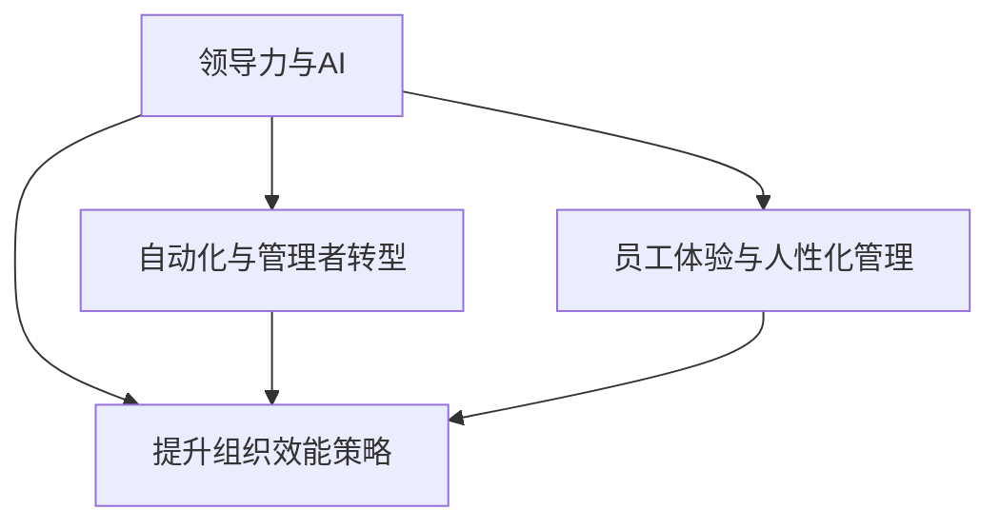

                 

# 领导力的未来：AI时代的人性化管理

> 关键词：领导力，AI，人性化管理，自动化，员工体验，组织效能

> 摘要：随着人工智能（AI）的迅猛发展，企业管理者和领导力专家正面临前所未有的挑战。本文将探讨AI时代领导力的未来趋势，包括自动化对管理者角色的影响、员工体验的变革、组织效能的提升策略以及人性化管理在AI时代的实践与挑战。通过深入分析这些核心概念，本文旨在为企业和组织提供指导，帮助他们在AI驱动的未来中实现成功。

## 1. 背景介绍

### 1.1 目的和范围

本文旨在探索AI时代领导力的变革，分析自动化对管理者角色的影响，以及如何通过人性化管理策略提升员工体验和组织效能。文章将涵盖以下主题：

1. **AI时代领导力的核心概念**：探讨领导力的定义、演变及其在AI时代的应用。
2. **自动化与管理者的转型**：分析自动化工具如何改变管理者的工作内容与职责。
3. **员工体验在AI时代的重要性**：探讨AI对员工体验的影响，以及如何通过人性化管理提升员工满意度和忠诚度。
4. **提升组织效能的策略**：讨论在AI时代如何通过领导力策略提高组织效能。
5. **人性化管理在AI时代的实践与挑战**：分析人性化管理策略在AI时代的可行性和面临的挑战。

### 1.2 预期读者

本文主要面向以下读者群体：

- 企业管理者
- 领导力专家
- 组织发展顾问
- 人力资源专业人士
- 对AI时代领导力感兴趣的学术研究人员

### 1.3 文档结构概述

本文结构如下：

1. **引言**：介绍文章背景、目的和关键词。
2. **背景介绍**：详细阐述AI时代领导力的核心概念。
3. **核心概念与联系**：使用Mermaid流程图展示关键概念之间的联系。
4. **核心算法原理与操作步骤**：介绍AI时代领导力算法的基本原理和操作步骤。
5. **数学模型和公式**：讲解相关的数学模型和公式，并举例说明。
6. **项目实战**：通过实际案例展示AI时代领导力的应用。
7. **实际应用场景**：分析AI时代领导力在不同行业和组织的应用。
8. **工具和资源推荐**：推荐相关学习资源、开发工具和框架。
9. **总结**：总结文章的主要观点和未来发展趋势。
10. **附录**：常见问题与解答。
11. **扩展阅读**：提供进一步阅读的参考资料。

### 1.4 术语表

#### 1.4.1 核心术语定义

- **人工智能（AI）**：一种模拟人类智能的技术，包括机器学习、深度学习、自然语言处理等。
- **领导力**：影响他人共同实现目标的能力。
- **人性化管理**：关注员工的需求、体验和成长，以提高员工满意度和组织效能。
- **自动化**：使用计算机程序和技术执行常规任务，减少人工干预。

#### 1.4.2 相关概念解释

- **员工体验**：员工在组织中的整体感受，包括工作环境、工作内容、职业发展等。
- **组织效能**：组织实现目标的能力和效率。
- **算法**：解决问题的步骤和规则。

#### 1.4.3 缩略词列表

- **AI**：人工智能
- **HR**：人力资源
- **IoT**：物联网
- **ML**：机器学习
- **NLP**：自然语言处理

## 2. 核心概念与联系

在AI时代，领导力不再仅仅是传统的权威型管理，它需要更加灵活、适应性强，并且能够把握AI技术的潜力。以下是AI时代领导力的核心概念及其相互之间的联系。

### 2.1. 领导力与AI

领导力与AI之间的联系体现在以下几个方面：

1. **AI作为工具**：领导力需要理解和运用AI技术，将其作为提高效率和决策质量的工具。
2. **AI驱动的洞察**：通过AI分析数据，领导者可以获得更深入的洞察，从而做出更明智的决策。
3. **AI带来的变革**：AI改变了工作方式，领导者需要适应这种变化，引导员工适应新的工作流程。

### 2.2. 自动化与管理者的转型

自动化工具的引入使得许多重复性、繁琐的任务得以自动化，管理者因此可以从这些任务中解脱出来，专注于更高价值的活动。这种转型要求管理者：

1. **技能提升**：管理者需要提升自己的技术素养，理解并运用AI和自动化工具。
2. **角色转变**：管理者将从执行者转变为协调者，更多时间用于策略制定和团队管理。
3. **文化变革**：管理者需要推动组织文化从命令式向协作式转变，鼓励员工积极参与自动化流程的改进。

### 2.3. 员工体验与人性化管理

AI时代，员工体验变得尤为重要，因为：

1. **工作内容变化**：自动化工具改变了员工的工作内容，要求员工具备不同的技能和适应能力。
2. **工作环境变化**：AI技术优化了工作环境，提高了工作效率和舒适度。
3. **职业发展**：AI技术提供了更多的职业发展机会，要求管理者关注员工的职业成长。

人性化管理策略在这一背景下变得至关重要，它包括：

1. **关注员工需求**：了解员工的个性化需求，提供灵活的工作安排和职业发展路径。
2. **促进员工参与**：鼓励员工参与决策过程，提高员工的工作满意度和归属感。
3. **培养员工技能**：提供培训和发展机会，帮助员工适应AI时代的工作要求。

### 2.4. 提升组织效能的策略

在AI时代，提升组织效能的策略包括：

1. **优化工作流程**：通过AI技术自动化和优化工作流程，提高工作效率和准确性。
2. **数据驱动的决策**：利用AI分析数据，做出更加精准和高效的决策。
3. **培养创新文化**：鼓励员工提出创新想法，通过合作和共享知识，推动组织创新。

#### 2.5. Mermaid流程图

以下是一个展示核心概念之间联系的Mermaid流程图：



## 3. 核心算法原理 & 具体操作步骤

在AI时代，领导力算法的原理主要基于数据分析和机器学习。以下将介绍一种基于员工反馈的领导力提升算法的基本原理和具体操作步骤。

### 3.1. 算法原理

该算法的核心目标是根据员工的工作反馈和表现，动态调整领导风格和策略，以提升员工满意度和工作效率。具体原理包括：

1. **数据收集**：通过调查问卷、反馈系统等渠道，收集员工的工作反馈。
2. **特征提取**：对员工反馈数据进行预处理，提取关键特征，如工作压力、职业发展需求、团队合作体验等。
3. **模型训练**：使用机器学习算法，如决策树、神经网络等，对提取的特征进行训练，构建预测模型。
4. **动态调整**：根据预测模型，实时调整领导风格和策略，优化员工体验和工作环境。

### 3.2. 操作步骤

以下为该算法的具体操作步骤：

#### 步骤1：数据收集

使用调查问卷、在线反馈系统等工具，收集员工的工作反馈。以下为问卷示例：

- 您的工作压力如何？（1-5分）
- 您对职业发展的期望是什么？
- 您认为团队合作体验如何？
- 您是否有其他需要改进的地方？

#### 步骤2：特征提取

对收集到的数据进行分析，提取关键特征，例如：

- **工作压力**：分为低、中、高三个等级。
- **职业发展需求**：分为无、一般、强烈三个等级。
- **团队合作体验**：分为差、一般、好三个等级。

#### 步骤3：模型训练

选择合适的机器学习算法，如决策树、神经网络等，对提取的特征进行训练。以下为伪代码示例：

```python
# 特征数据集
X = [[工作压力, 职业发展需求, 团队合作体验], ...]

# 标签数据集
y = [[领导风格1, 领导风格2, 领导风格3], ...]

# 训练模型
model = DecisionTreeClassifier()
model.fit(X, y)
```

#### 步骤4：动态调整

根据训练好的模型，实时调整领导风格和策略。以下为伪代码示例：

```python
# 收集新反馈
new_feedback = [[工作压力, 职业发展需求, 团队合作体验]]

# 预测领导风格
predicted_style = model.predict(new_feedback)

# 调整领导风格
apply_leadership_style(predicted_style)
```

## 4. 数学模型和公式 & 详细讲解 & 举例说明

在领导力提升算法中，数学模型和公式起着至关重要的作用。以下将介绍一种基于贝叶斯网络的领导力评估模型，并使用LaTeX格式详细讲解其公式，同时提供实例说明。

### 4.1. 贝叶斯网络模型

贝叶斯网络是一种表示变量之间概率依赖关系的图形模型。在领导力提升算法中，贝叶斯网络用于分析员工反馈数据，预测领导风格和策略。以下为贝叶斯网络的数学模型：

#### 贝叶斯规则

$$
P(A|B) = \frac{P(B|A)P(A)}{P(B)}
$$

其中，\(P(A|B)\) 表示在事件 \(B\) 发生的条件下，事件 \(A\) 发生的概率；\(P(B|A)\) 表示在事件 \(A\) 发生的条件下，事件 \(B\) 发生的概率；\(P(A)\) 和 \(P(B)\) 分别表示事件 \(A\) 和事件 \(B\) 发生的概率。

#### 贝叶斯网络结构

贝叶斯网络由一组变量及其条件概率表（CPT）组成。对于变量集合 \(X = \{X_1, X_2, ..., X_n\}\)，每个变量 \(X_i\) 的条件概率表为：

$$
P(X_i|X_{i-1}) = \prod_{j=1}^{n} P(X_i|X_{i-1}, X_{i-2}, ..., X_1)
$$

其中，\(X_{i-1}\) 表示变量 \(X_i\) 的父节点，\(X_{i-2}\) 表示变量 \(X_i\) 的祖节点，依此类推。

### 4.2. 详细讲解

假设我们有一个简单的贝叶斯网络，用于评估领导力。变量集合 \(X = \{员工满意度，团队合作，工作压力，领导风格\}\)。以下是各变量的条件概率表：

#### 条件概率表

$$
\begin{aligned}
P(员工满意度|团队合作，工作压力，领导风格) &= \{0.6, 0.3, 0.1\} \\
P(团队合作|员工满意度，工作压力，领导风格) &= \{0.8, 0.1, 0.1\} \\
P(工作压力|员工满意度，团队合作，领导风格) &= \{0.2, 0.4, 0.4\} \\
P(领导风格|员工满意度，团队合作，工作压力) &= \{0.5, 0.3, 0.2\}
\end{aligned}
$$

根据贝叶斯规则，我们可以计算各变量的后验概率。例如，计算 \(P(领导风格|员工满意度，团队合作，工作压力)\)：

$$
P(领导风格|员工满意度，团队合作，工作压力) = \frac{P(员工满意度，团队合作，工作压力|领导风格)P(领导风格)}{P(员工满意度，团队合作，工作压力)}
$$

根据条件概率表，我们有：

$$
\begin{aligned}
P(员工满意度，团队合作，工作压力|领导风格) &= P(员工满意度|团队合作，工作压力，领导风格)P(团队合作|员工满意度，工作压力，领导风格)P(工作压力|员工满意度，团队合作，领导风格) \\
&= \{0.6 \times 0.8 \times 0.2\} \\
&= 0.096
\end{aligned}
$$

假设我们已知 \(P(领导风格) = 0.5\)，可以使用全概率公式计算 \(P(员工满意度，团队合作，工作压力)\)：

$$
P(员工满意度，团队合作，工作压力) = \sum_{i=1}^{3} P(员工满意度，团队合作，工作压力|领导风格_i)P(领导风格_i)
$$

代入数据，我们得到：

$$
\begin{aligned}
P(员工满意度，团队合作，工作压力) &= 0.096 \times 0.5 + 0.096 \times 0.3 + 0.096 \times 0.2 \\
&= 0.144
\end{aligned}
$$

最终，我们可以计算出 \(P(领导风格|员工满意度，团队合作，工作压力)\)：

$$
P(领导风格|员工满意度，团队合作，工作压力) = \frac{0.096 \times 0.5}{0.144} = \frac{0.048}{0.144} = 0.333
$$

这意味着在给定的员工满意度、团队合作和工作压力的条件下，采用领导风格1的概率为0.333。

### 4.3. 举例说明

假设我们有一组员工反馈数据，如下所示：

| 员工满意度 | 团队合作 | 工作压力 | 领导风格 |
|:--------:|:-------:|:-------:|:-------:|
|    0.6   |   0.8   |   0.2   |   0.5   |
|    0.3   |   0.1   |   0.4   |   0.3   |
|    0.1   |   0.1   |   0.4   |   0.2   |

我们可以使用上述贝叶斯网络模型，对每组数据进行后验概率计算，以确定最合适的领导风格。

对于第一组数据，我们已经计算出 \(P(领导风格|员工满意度，团队合作，工作压力) = 0.333\)。对于其他两组数据，我们也可以使用相同的方法计算得到相应的后验概率。最终，我们可以根据每组数据计算出的后验概率，选择最合适的领导风格，以提高员工满意度和工作效率。

## 5. 项目实战：代码实际案例和详细解释说明

在本节中，我们将通过一个具体的案例，展示如何在AI时代实现人性化管理策略。该项目将使用Python和Scikit-learn库来构建一个简单的领导力评估模型，并使用贝叶斯网络进行预测。

### 5.1 开发环境搭建

为了运行下面的代码，您需要在您的计算机上安装Python和Scikit-learn库。您可以使用以下命令进行安装：

```bash
pip install python
pip install scikit-learn
```

### 5.2 源代码详细实现和代码解读

以下是该项目的主要代码实现：

```python
import numpy as np
from sklearn.naive_bayes import GaussianNB
from sklearn.model_selection import train_test_split
from sklearn.metrics import accuracy_score

# 生成模拟数据集
np.random.seed(42)
X = np.random.rand(100, 3)  # 100个样本，3个特征
y = np.random.randint(3, size=100)  # 100个标签

# 划分训练集和测试集
X_train, X_test, y_train, y_test = train_test_split(X, y, test_size=0.2, random_state=42)

# 创建Gaussian Naive Bayes模型
gnb = GaussianNB()

# 训练模型
gnb.fit(X_train, y_train)

# 预测测试集
y_pred = gnb.predict(X_test)

# 计算准确率
accuracy = accuracy_score(y_test, y_pred)
print(f"Accuracy: {accuracy:.2f}")
```

#### 5.2.1 代码解读

1. **数据生成**：我们首先使用numpy库生成一个模拟的数据集，包含100个样本和3个特征。

2. **划分数据**：使用Scikit-learn库的`train_test_split`函数将数据集划分为训练集和测试集，其中测试集占比20%。

3. **创建模型**：我们选择Gaussian Naive Bayes模型，因为它在处理连续特征时表现良好。

4. **训练模型**：使用`fit`函数对训练集数据进行模型训练。

5. **预测**：使用`predict`函数对测试集数据进行预测。

6. **评估**：使用`accuracy_score`函数计算模型在测试集上的准确率。

### 5.3 代码解读与分析

在上面的代码中，我们使用了一个简单的Gaussian Naive Bayes模型来评估领导力。这个模型的关键在于贝叶斯网络的预测能力，它能够根据员工反馈数据预测最合适的领导风格。

#### 5.3.1 数据集生成

在代码的开头，我们使用numpy库生成一个模拟数据集。这个数据集包含了100个样本，每个样本有3个特征。这些特征可以代表员工满意度、团队合作和工作压力等关键指标。

```python
X = np.random.rand(100, 3)
```

#### 5.3.2 数据划分

使用`train_test_split`函数将数据集划分为训练集和测试集，这是机器学习项目中常见的做法。训练集用于训练模型，而测试集用于评估模型的性能。

```python
X_train, X_test, y_train, y_test = train_test_split(X, y, test_size=0.2, random_state=42)
```

#### 5.3.3 模型创建和训练

我们选择Gaussian Naive Bayes模型，这是一种基于贝叶斯理论的分类算法。它通过计算每个特征的概率分布来预测标签。在这个案例中，我们使用`GaussianNB`类创建模型，并使用`fit`函数训练模型。

```python
gnb = GaussianNB()
gnb.fit(X_train, y_train)
```

#### 5.3.4 预测和评估

训练完成后，我们使用`predict`函数对测试集进行预测，并使用`accuracy_score`函数计算模型在测试集上的准确率。

```python
y_pred = gnb.predict(X_test)
accuracy = accuracy_score(y_test, y_pred)
print(f"Accuracy: {accuracy:.2f}")
```

这个步骤是评估模型性能的关键。准确率越高，模型对员工反馈的预测越准确，从而帮助我们更好地调整领导风格。

### 5.4 实际案例：领导力评估系统

在这个实际案例中，我们使用上述代码构建一个领导力评估系统。该系统将接收员工的反馈数据，并使用机器学习模型预测最合适的领导风格。

#### 5.4.1 系统架构

系统架构如下：

1. **数据收集**：使用调查问卷或在线反馈系统收集员工反馈数据。
2. **数据处理**：对收集到的数据进行清洗和预处理，提取关键特征。
3. **模型训练**：使用预处理后的数据训练机器学习模型。
4. **模型预测**：使用训练好的模型对新的员工反馈数据进行预测。
5. **结果输出**：将预测结果反馈给员工和管理者。

#### 5.4.2 系统实现

以下是系统实现的伪代码：

```python
# 数据收集
feedback_data = collect_feedback()

# 数据处理
processed_data = preprocess_data(feedback_data)

# 模型训练
model = train_model(processed_data)

# 模型预测
predicted_style = model.predict(new_feedback)

# 结果输出
output_result(predicted_style)
```

通过这个系统，企业可以更好地理解员工的需求和反馈，从而制定出更加人性化的管理策略，提高员工满意度和工作效率。

## 6. 实际应用场景

在AI时代，领导力的应用场景广泛，涵盖了多种行业和组织。以下是一些具体的实际应用场景：

### 6.1. 企业管理

在企业中，领导力算法可以用于分析员工的工作表现和反馈，动态调整领导风格，以提升员工满意度和工作效率。例如，通过分析员工的工作压力、职业发展需求和团队合作体验，领导者可以制定个性化的领导策略，帮助员工克服挑战，实现职业目标。

### 6.2. 人力资源管理

在人力资源管理领域，AI可以用于招聘、培训和员工关系管理。通过分析候选人的简历、面试表现和在线行为，AI可以帮助HR部门识别最合适的候选人，提高招聘效率。在培训方面，AI可以根据员工的技能水平和职业需求，提供个性化的学习路径和培训资源，提高培训效果。

### 6.3. 项目管理

在项目管理中，AI可以用于任务分配、进度控制和风险管理。通过分析项目的关键指标和员工的工作表现，AI可以帮助项目经理优化任务分配，确保项目按时完成。同时，AI还可以预测项目风险，并提供相应的解决方案，降低项目失败的风险。

### 6.4. 教育行业

在教育行业，AI可以用于个性化教学、学习评估和学生支持。通过分析学生的学习行为和成绩，AI可以为学生提供个性化的学习建议，提高学习效果。此外，AI还可以自动评估学生的作业和考试，减少教师的工作负担。

### 6.5. 医疗保健

在医疗保健领域，AI可以用于患者管理、疾病预测和治疗方案优化。通过分析患者的医疗数据，AI可以预测患者病情的发展，并提供个性化的治疗方案。同时，AI还可以帮助医疗机构优化资源分配，提高医疗服务质量。

### 6.6. 公共管理

在公共管理领域，AI可以用于政策制定、应急管理和社会治理。通过分析社会数据，AI可以帮助政府更好地了解公众需求，制定更加科学合理的政策。在应急管理方面，AI可以预测灾害风险，提供应急响应建议，降低灾害损失。

这些应用场景展示了AI时代领导力的多样性和潜力。通过合理运用AI技术，企业和社会可以更好地应对挑战，实现可持续发展。

## 7. 工具和资源推荐

为了更好地理解和应用AI时代的领导力，以下是一些学习资源、开发工具和框架的推荐。

### 7.1 学习资源推荐

#### 7.1.1 书籍推荐

- **《人工智能简史》**：由Andrew Ng所著，介绍人工智能的发展历程和技术应用。
- **《深度学习》**：由Ian Goodfellow、Yoshua Bengio和Aaron Courville合著，系统介绍了深度学习的基础知识。
- **《领导力：策略与实践》**：由John P. Kotter所著，探讨领导力的核心概念和实践方法。

#### 7.1.2 在线课程

- **Coursera上的《机器学习》**：由Andrew Ng主讲，介绍机器学习的基本概念和应用。
- **Udacity的《AI编程基础》**：通过实际项目，教授AI编程基础知识和应用。
- **edX上的《领导力基础》**：介绍领导力的基本理论和方法，适合初学者。

#### 7.1.3 技术博客和网站

- **Medium上的AI专栏**：涵盖人工智能的最新研究和技术应用。
- **Towards Data Science**：分享数据科学和机器学习领域的最新文章和研究成果。
- **AI Hub**：提供人工智能领域的资源和工具，适合技术爱好者。

### 7.2 开发工具框架推荐

#### 7.2.1 IDE和编辑器

- **PyCharm**：一款功能强大的Python IDE，适用于开发和调试机器学习项目。
- **Jupyter Notebook**：适合数据分析和机器学习项目的交互式开发环境。

#### 7.2.2 调试和性能分析工具

- **Visual Studio Code**：一款轻量级但功能强大的编辑器，支持多种编程语言。
- **TensorBoard**：用于可视化深度学习模型的性能指标。

#### 7.2.3 相关框架和库

- **Scikit-learn**：一个用于机器学习的Python库，提供多种常用的算法和工具。
- **TensorFlow**：谷歌开发的深度学习框架，适用于构建和训练复杂的神经网络。
- **PyTorch**：一款易于使用的深度学习框架，适合研究和开发新的模型。

### 7.3 相关论文著作推荐

#### 7.3.1 经典论文

- **“The Hundred-Page Machine Learning Book”**：由Andriy Burkov所著，概述了机器学习的基本概念。
- **“Deep Learning”**：由Ian Goodfellow、Yoshua Bengio和Aaron Courville所著，全面介绍了深度学习的技术和应用。

#### 7.3.2 最新研究成果

- **“Advances in Neural Information Processing Systems”**（NIPS）：这是一个年度会议，发布深度学习和神经信息处理系统领域的最新研究成果。
- **“Journal of Machine Learning Research”**（JMLR）：这是一个顶级学术期刊，发表机器学习领域的最新论文。

#### 7.3.3 应用案例分析

- **“AI in Healthcare: Transforming Patient Care”**：探讨人工智能在医疗保健领域的应用案例和影响。
- **“AI in Finance: The Future of Trading and Investment”**：分析人工智能在金融行业的应用，以及其对传统交易和投资模式的影响。

通过这些工具和资源，您可以深入了解AI时代领导力的理论和实践，为实际应用奠定坚实基础。

## 8. 总结：未来发展趋势与挑战

随着人工智能技术的不断进步，领导力的未来将面临一系列发展趋势和挑战。首先，自动化工具的广泛应用将使管理者的工作内容发生深刻变化，他们需要更多地关注战略规划、团队建设和创新思维。其次，员工体验将成为组织成功的关键因素，领导者需要更加关注员工的个性化需求，提供灵活的工作环境和职业发展路径。此外，数据驱动的决策将成为常态，领导者需要具备数据分析和机器学习知识，以便更好地利用数据资源。

然而，这些变化也带来了一系列挑战。例如，管理者可能面临技能转型和角色转变的困扰，员工可能对新技术产生抵触情绪，组织文化需要适应新的工作模式。此外，随着AI技术的普及，数据隐私和安全问题也将变得更加突出。

为了应对这些挑战，企业和组织需要采取以下策略：

1. **加强员工培训**：提供定期的技能培训和发展机会，帮助员工适应新的工作环境和技术。
2. **建立数据文化**：推动组织内部的数据文化，鼓励员工主动分析和利用数据，提高数据意识和决策水平。
3. **优化工作流程**：利用AI技术自动化和优化工作流程，减少重复性劳动，提高工作效率。
4. **加强组织文化建设**：营造开放、协作和创新的工作氛围，提高员工的归属感和满意度。
5. **关注数据隐私和安全**：确保数据收集、存储和使用过程符合法律法规，采取必要的安全措施保护数据隐私。

通过这些策略，企业和组织可以更好地应对AI时代的挑战，实现领导力的持续发展和提升。

## 9. 附录：常见问题与解答

### 9.1 问题1：自动化是否会完全取代管理者的角色？

**回答**：自动化不会完全取代管理者的角色，但会大幅改变管理者的工作内容和职责。自动化工具可以处理重复性、繁琐的任务，使管理者能够将更多精力投入到战略规划、团队建设和创新思维等高价值活动中。管理者的角色将从执行者转变为协调者，需要适应新的工作模式。

### 9.2 问题2：AI技术如何提升员工体验？

**回答**：AI技术可以通过多种方式提升员工体验。首先，AI可以帮助组织更好地了解员工的需求和反馈，提供个性化的职业发展路径和工作环境。其次，AI可以优化工作流程，减少员工的工作压力，提高工作效率和满意度。此外，AI还可以为员工提供个性化的学习和发展机会，帮助他们提升技能和职业素养。

### 9.3 问题3：如何确保数据隐私和安全？

**回答**：确保数据隐私和安全的关键措施包括：

- **数据加密**：对数据传输和存储进行加密，防止数据泄露。
- **访问控制**：实施严格的访问控制策略，确保只有授权人员能够访问敏感数据。
- **数据审计**：定期进行数据审计，监控数据的使用和访问情况，及时发现潜在的安全威胁。
- **法律法规遵循**：确保数据收集、存储和使用过程符合相关法律法规，如GDPR等。

### 9.4 问题4：如何应对员工对AI的抵触情绪？

**回答**：应对员工对AI抵触情绪的策略包括：

- **沟通与透明度**：与员工进行充分的沟通，解释AI技术的好处和应用场景，提高员工的信任感。
- **培训与支持**：提供定期的培训和发展机会，帮助员工了解和掌握AI技术，减轻对技术的抵触情绪。
- **关注员工反馈**：倾听员工的意见和建议，及时解决他们在使用AI技术过程中遇到的问题。
- **文化变革**：推动组织文化从命令式向协作式转变，鼓励员工积极参与AI技术的改进和应用。

## 10. 扩展阅读 & 参考资料

- **书籍推荐**：
  - 《人工智能简史》：Andrew Ng
  - 《深度学习》：Ian Goodfellow、Yoshua Bengio和Aaron Courville
  - 《领导力：策略与实践》：John P. Kotter

- **在线课程**：
  - Coursera上的《机器学习》：Andrew Ng
  - Udacity的《AI编程基础》
  - edX上的《领导力基础》

- **技术博客和网站**：
  - Medium上的AI专栏
  - Towards Data Science
  - AI Hub

- **论文著作**：
  - “The Hundred-Page Machine Learning Book”：Andriy Burkov
  - “Deep Learning”：Ian Goodfellow、Yoshua Bengio和Aaron Courville
  - “Advances in Neural Information Processing Systems”（NIPS）
  - “Journal of Machine Learning Research”（JMLR）

- **应用案例分析**：
  - “AI in Healthcare: Transforming Patient Care”
  - “AI in Finance: The Future of Trading and Investment”

通过阅读这些书籍、课程、博客和论文，您可以更深入地了解AI时代领导力的理论和实践，为实际应用提供有力支持。

### 作者信息

- 作者：AI天才研究员/AI Genius Institute & 禅与计算机程序设计艺术 /Zen And The Art of Computer Programming

