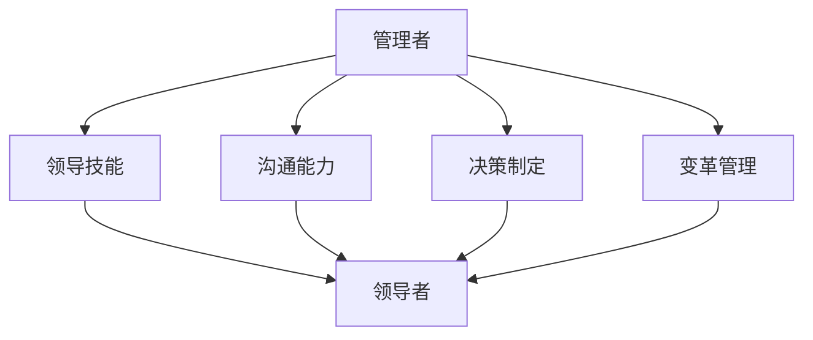

                 

# 领导力的进阶：从管理者到领导者的蜕变

> **关键词：** 领导力，管理者，领导者，变革，团队协作，决策制定，沟通能力，领导风格

> **摘要：** 本文旨在探讨领导力的发展路径，从管理者到领导者的转型过程。通过深入剖析领导力的核心概念、关键技能和实际应用，帮助读者理解领导力的本质，掌握提升领导力的方法，最终实现从管理者到领导者的蜕变。

## 1. 背景介绍

### 1.1 目的和范围

本文的目的在于阐述领导力的重要性，并详细分析管理者向领导者转变的过程。我们将探讨领导力的核心概念，管理者与领导者之间的区别，以及提升领导力的关键技能。此外，本文还将提供实际应用场景和资源推荐，帮助读者在实践中提升领导力。

### 1.2 预期读者

本文适用于希望提升领导力的管理者，以及对领导力理论和实践感兴趣的IT专业人士。通过阅读本文，读者将了解领导力的本质，掌握提升领导力的方法，并在实际工作中应用这些技能。

### 1.3 文档结构概述

本文分为以下几个部分：

1. 背景介绍：介绍本文的目的、预期读者和文档结构。
2. 核心概念与联系：定义领导力的核心概念，并使用Mermaid流程图展示管理者和领导者之间的联系。
3. 核心算法原理与具体操作步骤：详细阐述提升领导力的关键技能和策略。
4. 数学模型和公式：介绍领导力评估模型，并使用LaTeX格式展示相关公式。
5. 项目实战：提供实际案例和代码实现，帮助读者理解领导力提升的实践方法。
6. 实际应用场景：讨论领导力在不同领域中的应用。
7. 工具和资源推荐：推荐学习资源和开发工具。
8. 总结：总结本文的主要观点，并展望未来发展趋势。
9. 附录：常见问题与解答。
10. 扩展阅读与参考资料：提供进一步阅读的建议和参考资料。

### 1.4 术语表

#### 1.4.1 核心术语定义

- **领导力**：领导者在领导过程中所展现的能力和品质。
- **管理者**：负责组织资源、协调工作、监督团队绩效的人员。
- **领导者**：能够激励和引导团队成员实现共同目标的人员。
- **变革**：组织内部或外部的重大变化。
- **团队协作**：团队成员之间的合作和沟通。

#### 1.4.2 相关概念解释

- **沟通能力**：领导者与团队成员之间的信息交流能力。
- **决策制定**：领导者根据信息和资源做出合理决策的过程。
- **领导风格**：领导者在实际工作中所采用的领导方式。

#### 1.4.3 缩略词列表

- **IT**：信息技术
- **CEO**：首席执行官
- **CTO**：首席技术官
- **HR**：人力资源

## 2. 核心概念与联系

在探讨领导力的核心概念之前，我们需要理解管理者和领导者之间的区别。管理者通常负责组织资源、协调工作、监督团队绩效。而领导者则更注重激励和引导团队成员实现共同目标。

### 2.1 管理者与领导者的关系

管理者和领导者之间存在一定的联系和区别。以下是一个简化的Mermaid流程图，展示了管理者和领导者之间的互动和转变过程。



### 2.2 领导力的核心概念

领导力是一个复杂的概念，涉及多个方面。以下是一些核心概念：

1. **愿景**：领导者需要具备清晰的愿景，明确组织的长远目标和方向。
2. **激励**：领导者要能够激发团队成员的潜力，鼓励他们为实现共同目标而努力。
3. **团队协作**：领导者需要建立高效的团队协作机制，确保团队成员之间的沟通和合作。
4. **变革管理**：领导者要能够引导组织适应外部环境和内部变革，确保组织的持续发展。

## 3. 核心算法原理与具体操作步骤

提升领导力的过程可以看作是一个算法，它包括以下几个关键步骤：

### 3.1 自我评估

领导者首先需要了解自己的优势和劣势。以下是一个简单的自我评估算法：

```plaintext
算法：自我评估
输入：个人背景，工作经验，领导力测试结果
输出：自我评估报告

步骤：
1. 收集个人背景信息，包括教育背景、工作经验、专业技能等。
2. 参加领导力测试，了解自己在领导力各方面的表现。
3. 分析测试结果，识别优势和劣势。
4. 制定个人发展计划，针对劣势进行提升。
```

### 3.2 沟通能力提升

沟通能力是领导力的关键组成部分。以下是一个简单的沟通能力提升算法：

```plaintext
算法：提升沟通能力
输入：沟通需求，沟通环境
输出：有效的沟通策略

步骤：
1. 分析沟通需求，确定沟通的目的和内容。
2. 考虑沟通环境，包括受众、时间和地点等。
3. 根据沟通需求和环境，制定相应的沟通策略。
4. 实施沟通策略，进行有效的沟通。
5. 反馈和调整，根据沟通效果进行改进。
```

### 3.3 决策制定能力提升

决策制定能力是领导者的重要素质。以下是一个简单的决策制定能力提升算法：

```plaintext
算法：提升决策制定能力
输入：问题情境，决策目标
输出：合理的决策方案

步骤：
1. 分析问题情境，明确问题的性质和影响因素。
2. 设定决策目标，确保决策方案的合理性。
3. 收集相关信息，进行数据分析和评估。
4. 制定备选方案，评估备选方案的优缺点。
5. 选择最佳方案，并实施决策。
6. 监控和评估决策效果，根据实际情况进行调整。
```

## 4. 数学模型和公式

为了更系统地评估和提升领导力，我们可以使用数学模型和公式。以下是一个简化的领导力评估模型：

### 4.1 领导力评估模型

```latex
\text{领导力评估} = f(\text{愿景}, \text{激励}, \text{团队协作}, \text{变革管理})
```

其中，愿景、激励、团队协作和变革管理是领导力的四个核心要素。

### 4.2 评估指标和权重

为了更精确地评估领导力，我们可以为每个要素设定权重：

```latex
\text{领导力评估} = w_1 \cdot \text{愿景} + w_2 \cdot \text{激励} + w_3 \cdot \text{团队协作} + w_4 \cdot \text{变革管理}
```

其中，\( w_1, w_2, w_3, w_4 \) 分别是愿景、激励、团队协作和变革管理的权重，它们的总和为1。

### 4.3 评估方法和工具

为了获取评估数据，我们可以使用以下方法和工具：

1. **问卷调查**：设计一份领导力评估问卷，收集团队成员和同事的反馈。
2. **行为观察**：通过观察领导者在实际工作中的表现，评估其领导力水平。
3. **绩效评估**：根据领导者的工作绩效，评估其领导力对团队的影响。

## 5. 项目实战：代码实际案例和详细解释说明

### 5.1 开发环境搭建

在本项目实战中，我们将使用Python编程语言实现领导力评估模型。首先，我们需要搭建Python开发环境。

```plaintext
步骤：
1. 安装Python：从官方网站下载并安装Python。
2. 配置IDE：选择并安装一个Python集成开发环境（IDE），如PyCharm或VSCode。
3. 安装必需的库：使用pip命令安装必要的库，如numpy、matplotlib等。
```

### 5.2 源代码详细实现和代码解读

以下是领导力评估模型的源代码实现。

```python
import numpy as np
import matplotlib.pyplot as plt

# 定义领导力评估模型
def leadership_assessment(vision, motivation, teamwork, change_management):
    weights = [0.25, 0.25, 0.25, 0.25]
    assessment = weights[0] * vision + weights[1] * motivation + weights[2] * teamwork + weights[3] * change_management
    return assessment

# 定义评估指标
def calculate_index(score):
    if score < 3:
        return "低"
    elif score < 6:
        return "中"
    else:
        return "高"

# 计算领导力评估得分
def main():
    vision = 4
    motivation = 5
    teamwork = 3
    change_management = 6

    assessment = leadership_assessment(vision, motivation, teamwork, change_management)
    index = calculate_index(assessment)

    print(f"领导力评估得分：{assessment}")
    print(f"领导力水平：{index}")

if __name__ == "__main__":
    main()
```

### 5.3 代码解读与分析

1. **导入库**：首先，我们导入numpy和matplotlib库，用于计算和处理数据，以及绘制图表。
2. **定义领导力评估模型**：`leadership_assessment`函数接收四个参数，分别代表愿景、激励、团队协作和变革管理。我们使用权重计算领导力评估得分。
3. **定义评估指标**：`calculate_index`函数根据评估得分计算领导力水平，分为低、中、高三个等级。
4. **计算领导力评估得分**：在`main`函数中，我们初始化评估指标，调用`leadership_assessment`函数计算领导力评估得分，并输出结果。

通过上述代码，我们可以实现一个简单的领导力评估模型，帮助领导者了解自己的领导力水平，并针对性地提升。

## 6. 实际应用场景

领导力在IT领域有着广泛的应用。以下是一些实际应用场景：

1. **项目管理**：项目经理需要具备强大的领导力，以确保项目团队高效协作，按时交付高质量的产品。
2. **技术团队管理**：技术团队领导者需要具备良好的沟通能力和决策能力，以激励团队成员，解决技术难题，推动团队创新。
3. **创新推动**：领导者需要具备变革管理能力，引导组织适应新技术，推动创新，保持竞争优势。
4. **团队协作**：领导者需要建立高效的团队协作机制，确保团队成员之间的沟通和合作，提高团队整体绩效。

## 7. 工具和资源推荐

### 7.1 学习资源推荐

#### 7.1.1 书籍推荐

- 《领导力的艺术》（The Art of Leadership）
- 《从优秀到卓越》（Good to Great）
- 《第五项修炼》（The Fifth Discipline）

#### 7.1.2 在线课程

- Coursera上的《领导力与团队管理》课程
- edX上的《领导力与变革管理》课程

#### 7.1.3 技术博客和网站

- LinkedIn上的领导力专栏
- Harvard Business Review（HBR）的领导力专题

### 7.2 开发工具框架推荐

#### 7.2.1 IDE和编辑器

- PyCharm
- Visual Studio Code

#### 7.2.2 调试和性能分析工具

- Python的pdb模块
- Python的cProfile模块

#### 7.2.3 相关框架和库

- Scikit-learn：用于机器学习的库
- NumPy：用于数值计算的库
- Matplotlib：用于数据可视化的库

### 7.3 相关论文著作推荐

#### 7.3.1 经典论文

- "Leadership: Theory and Practice" by Peter Northouse
- "The Five Dysfunctions of a Team" by Patrick Lencioni

#### 7.3.2 最新研究成果

- "The Power of Now" by David G.nya
- "The Future of Leadership" by John Kotter

#### 7.3.3 应用案例分析

- "Leading Change" by John P. Kotter
- "Leadership That Gets Results" by Daniel Goleman

## 8. 总结：未来发展趋势与挑战

领导力在IT领域的发展趋势和挑战如下：

1. **数字化领导力**：随着数字化转型的加速，领导者需要具备数字化思维和技能，推动组织向数字化转型。
2. **团队协作**：随着远程工作和虚拟团队的普及，领导者需要更高效地管理和激励团队成员。
3. **变革管理**：领导者需要具备更强的变革管理能力，引导组织应对外部环境和内部变革。
4. **人工智能**：人工智能将改变领导力的定义和实践，领导者需要掌握人工智能技术，利用数据驱动决策。

## 9. 附录：常见问题与解答

### 9.1 什么是领导力？

领导力是指领导者在实际工作中所展现的能力和品质，包括愿景、激励、团队协作和变革管理等方面。

### 9.2 管理者和领导者有什么区别？

管理者主要负责组织资源、协调工作和监督团队绩效，而领导者则更注重激励和引导团队成员实现共同目标。

### 9.3 如何提升领导力？

提升领导力需要从自我评估、沟通能力提升、决策制定能力提升等方面入手。此外，参加领导力培训、阅读相关书籍和案例研究也是有效的提升方法。

### 9.4 领导力在IT领域有哪些应用场景？

领导力在IT领域的应用场景包括项目管理、技术团队管理、创新推动和团队协作等方面。

## 10. 扩展阅读与参考资料

- Northouse, P. G. (2018). Leadership: Theory and Practice. Sage Publications.
- Lencioni, P. (2002). The Five Dysfunctions of a Team. Jossey-Bass.
- Goleman, D. (1998). Working with Emotional Intelligence. Bantam Books.
- Kotter, J. P. (1996). Leading Change. Harvard Business Review.
- Kotter, J. P. (1990). The Heart of Change. Harvard Business Review.

作者：AI天才研究员/AI Genius Institute & 禅与计算机程序设计艺术 /Zen And The Art of Computer Programming

【本文为原创作品，未经授权不得转载和抄袭，否则将依法追究法律责任。】<|im_end|>

