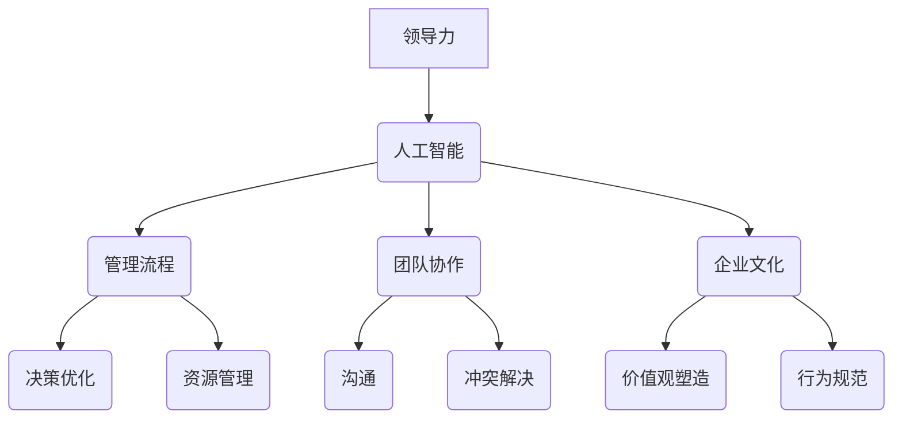

                 

# 领导力进化论：人工智能时代管理者的必修课

> 关键词：领导力、人工智能、管理、进化、策略、团队
> 
> 摘要：本文旨在探讨人工智能时代下，领导者如何通过理解与适应新兴技术，提升管理效能，打造卓越团队。文章将逐步分析领导力的核心要素，人工智能的演变及其对管理的影响，并最终提出一系列切实可行的策略与建议。

## 1. 背景介绍

### 1.1 目的和范围

在技术迅速发展的今天，人工智能已成为推动各行各业变革的重要力量。作为管理者，适应这种变化并利用人工智能提高团队效能是至关重要的。本文的目的在于：

- 探讨人工智能时代领导力的新特点与挑战。
- 分析人工智能对管理流程、团队协作和企业文化的深远影响。
- 提供实用的领导策略，帮助管理者在人工智能时代取得成功。

本文将涵盖以下主题：

1. 领导力的核心要素
2. 人工智能的演变与管理
3. 领导策略与实践
4. 未来展望

### 1.2 预期读者

本文面向的中高级管理者，特别是在人工智能领域工作的企业领导、项目经理和技术负责人。如果您希望了解如何在人工智能时代提升领导力，打造高效团队，那么这篇文章将为您提供宝贵的指导。

### 1.3 文档结构概述

本文分为八个部分：

1. **背景介绍**：阐述本文的目的、范围和结构。
2. **核心概念与联系**：介绍领导力与人工智能的基础概念及其关系。
3. **核心算法原理 & 具体操作步骤**：分析领导策略的算法原理。
4. **数学模型和公式 & 详细讲解 & 举例说明**：运用数学工具解释领导力模型。
5. **项目实战：代码实际案例和详细解释说明**：通过具体案例展示领导力策略的应用。
6. **实际应用场景**：探讨人工智能时代领导力的具体应用。
7. **工具和资源推荐**：推荐学习资源和开发工具。
8. **总结：未来发展趋势与挑战**：展望领导力的未来。

### 1.4 术语表

#### 1.4.1 核心术语定义

- **领导力**：指领导者通过影响和激励他人，实现共同目标的能力。
- **人工智能**：指由机器实现的智能行为，包括学习、推理、自我优化等。
- **管理**：指对组织资源进行计划、组织、领导和控制的过程。

#### 1.4.2 相关概念解释

- **团队协作**：指团队成员为了共同的目标而协同工作的过程。
- **企业文化**：指企业成员共同遵循的价值观和行为规范。

#### 1.4.3 缩略词列表

- **AI**：人工智能
- **ML**：机器学习
- **DL**：深度学习

## 2. 核心概念与联系

在人工智能时代，领导力与技术的结合成为管理的关键。以下是一个简化的Mermaid流程图，展示了领导力、人工智能和管理之间的核心概念和联系。

### 2.1 领导力的核心要素

领导力由多个要素构成，包括愿景、决策能力、沟通技巧、激励和影响能力等。在人工智能时代，这些要素需要适应技术的变革。

#### 愿景

领导者需要具备清晰的前瞻性，能够描绘出未来愿景，并激励团队成员为之奋斗。人工智能可以帮助领导者通过数据分析预测趋势，优化愿景设定。

#### 决策能力

领导者需要做出明智的决策。人工智能可以提供数据支持和模拟分析，帮助领导者评估不同决策的结果，从而做出更加科学的决策。

#### 沟通技巧

有效的沟通是领导力的核心。领导者需要能够清晰、准确地传达信息，并倾听团队成员的意见。人工智能工具如语音识别、自然语言处理可以帮助领导者提高沟通效率。

#### 激励和影响能力

领导者需要能够激励团队成员，并影响他们的行为。人工智能可以通过个性化推荐、行为分析等手段，帮助领导者更好地了解团队成员的需求，从而实施更有效的激励措施。

### 2.2 人工智能的演变与管理

人工智能的发展经历了多个阶段，从规则基

