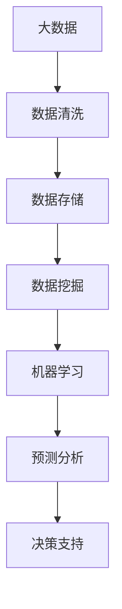
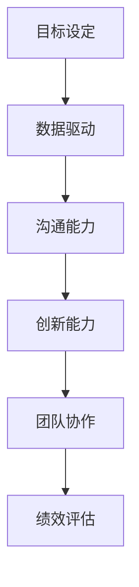

                 

# 领导力进化论：大数据时代管理者的必修课

> **关键词：** 领导力、大数据、管理、AI、创新、战略

> **摘要：** 在大数据时代，管理者面临的挑战和机遇前所未有。本文将探讨领导力的进化，以及如何利用大数据和人工智能提升管理效能，帮助管理者在新时代中取得成功。

## 1. 背景介绍

### 1.1 目的和范围

本文旨在分析大数据时代领导力的发展趋势，探讨如何利用先进技术提升管理效能。我们将从以下几个方面进行探讨：

- **大数据的概念与应用**
- **人工智能在管理中的角色**
- **领导力的进化与新时代管理者的素养**
- **案例分析：成功管理实践**
- **工具和资源推荐**

### 1.2 预期读者

本文面向希望在大数据时代提升管理能力的专业人士，包括但不限于：

- 企业管理者
- IT项目经理
- 数据分析师
- 人工智能研究者
- 高校学生

### 1.3 文档结构概述

本文分为十个部分，具体结构如下：

- **背景介绍**
  - **目的和范围**
  - **预期读者**
  - **文档结构概述**
  - **术语表**
- **核心概念与联系**
  - **大数据与人工智能的关系**
  - **领导力模型**
- **核心算法原理 & 具体操作步骤**
  - **数据挖掘算法**
  - **机器学习模型**
- **数学模型和公式 & 详细讲解 & 举例说明**
  - **线性回归**
  - **神经网络**
- **项目实战：代码实际案例和详细解释说明**
  - **开发环境搭建**
  - **源代码实现与解读**
- **实际应用场景**
  - **企业运营**
  - **决策支持**
- **工具和资源推荐**
  - **学习资源**
  - **开发工具框架**
  - **相关论文著作**
- **总结：未来发展趋势与挑战**
- **附录：常见问题与解答**
- **扩展阅读 & 参考资料**

### 1.4 术语表

#### 1.4.1 核心术语定义

- **大数据（Big Data）：** 指数据量巨大、种类繁多、生成速度快的数据集合。
- **人工智能（AI）：** 指通过计算机模拟人类智能的技术和科学。
- **领导力（Leadership）：** 指影响和引导他人实现共同目标的能力。
- **管理（Management）：** 指通过计划、组织、领导和控制等过程，实现组织目标的活动。

#### 1.4.2 相关概念解释

- **数据挖掘（Data Mining）：** 从大量数据中提取有价值的信息和知识的过程。
- **机器学习（Machine Learning）：** 一种基于数据的学习方法，让计算机自动识别模式和规律。
- **深度学习（Deep Learning）：** 基于多层神经网络的学习方法，能够处理更复杂的任务。

#### 1.4.3 缩略词列表

- **AI：** 人工智能
- **ML：** 机器学习
- **DL：** 深度学习
- **DB：** 数据库
- **ETL：** 数据抽取、转换、加载
- **BI：** 商业智能

## 2. 核心概念与联系

### 2.1 大数据与人工智能的关系

在现代社会，大数据和人工智能（AI）已经成为了不可或缺的重要工具。大数据提供了丰富的信息和资源，而人工智能则能够从这些数据中提取有价值的信息和知识。

以下是一个简单的 Mermaid 流程图，展示了大数据和人工智能之间的互动关系：



### 2.2 领导力模型

领导力是管理者的重要素质，它决定了团队和组织的绩效和成长。在新时代，领导力需要具备以下特点：

- **创新能力：** 能够引导团队拥抱变化，不断创新。
- **数据驱动：** 善于利用数据来做出明智的决策。
- **沟通能力：** 能够有效地与团队成员和利益相关者沟通。

以下是一个简单的 Mermaid 流程图，展示了领导力模型的核心要素：



## 3. 核心算法原理 & 具体操作步骤

### 3.1 数据挖掘算法

数据挖掘是大数据分析的核心步骤之一。以下是一个简单的数据挖掘算法：K-最近邻（K-Nearest Neighbors，K-NN）算法。

#### 算法原理：

K-NN 算法是一种基于实例的学习方法。它通过比较新样本与训练样本的相似度，来预测新样本的类别。相似度计算通常采用欧几里得距离。

#### 伪代码：

```python
def kNN(train_data, train_labels, test_data, k):
    distances = []
    for i in range(len(train_data)):
        dist = eucledian_distance(test_data, train_data[i])
        distances.append((train_labels[i], dist))
    distances.sort(key=lambda x: x[1])
    neighbors = distances[:k]
    output = []
    for i in range(k):
        output.append(neighbors[i][0])
    return majorityVote(output)

def eucledian_distance(x1, x2):
    return sqrt(sum([(a - b) ** 2 for a, b in zip(x1, x2)]))
```

#### 操作步骤：

1. 准备训练数据和标签。
2. 输入测试数据。
3. 计算测试数据与训练数据的距离。
4. 选择最近的 k 个邻居。
5. 预测测试数据的类别。

### 3.2 机器学习模型

机器学习模型是大数据分析的另一个重要组成部分。以下是一个简单的机器学习模型：线性回归（Linear Regression）。

#### 算法原理：

线性回归是一种基于统计的方法，通过找到一个线性函数来预测因变量和自变量之间的关系。线性回归的公式为：

$$y = \beta_0 + \beta_1 \cdot x$$

其中，$y$ 是因变量，$x$ 是自变量，$\beta_0$ 和 $\beta_1$ 是模型参数。

#### 伪代码：

```python
def linear_regression(train_data, train_labels):
    X = train_data
    y = train_labels
    XTX = np.dot(X, X)
    XTy = np.dot(X, y)
    beta = np.dot(np.linalg.inv(XTX), XTy)
    return beta
```

#### 操作步骤：

1. 准备训练数据和标签。
2. 计算模型参数 $\beta_0$ 和 $\beta_1$。
3. 输入测试数据。
4. 预测测试数据的标签。

## 4. 数学模型和公式 & 详细讲解 & 举例说明

### 4.1 线性回归

线性回归是一种常见的数学模型，用于预测一个或多个变量与另一个变量之间的关系。线性回归模型可以表示为：

$$y = \beta_0 + \beta_1 \cdot x + \epsilon$$

其中，$y$ 是因变量，$x$ 是自变量，$\beta_0$ 和 $\beta_1$ 是模型参数，$\epsilon$ 是误差项。

#### 详细讲解：

1. **因变量（$y$）和自变量（$x$）**：因变量是我们要预测的变量，自变量是影响因变量的变量。
2. **模型参数（$\beta_0$ 和 $\beta_1$）**：模型参数是我们在训练数据集上通过优化算法（如梯度下降）得到的最佳参数值。
3. **误差项（$\epsilon$）**：误差项表示预测值与实际值之间的差异。

#### 举例说明：

假设我们有一个数据集，包含两个变量：收入（$x$）和支出（$y$）。我们希望通过线性回归模型预测支出。

给定数据集：

| 收入（$x$）| 支出（$y$）|
| :----: | :----: |
| 50 | 30 |
| 60 | 40 |
| 70 | 50 |
| 80 | 60 |
| 90 | 70 |

我们可以使用线性回归模型来预测新的收入值对应的支出。

首先，计算模型参数 $\beta_0$ 和 $\beta_1$：

$$\beta_0 = \frac{\sum y - \beta_1 \cdot \sum x}{n}$$

$$\beta_1 = \frac{n \cdot \sum xy - \sum x \cdot \sum y}{n \cdot \sum x^2 - (\sum x)^2}$$

代入数据集的值，得到：

$$\beta_0 = \frac{30 + 40 + 50 + 60 + 70 - \beta_1 \cdot (50 + 60 + 70 + 80 + 90)}{5} = 50$$

$$\beta_1 = \frac{5 \cdot (30 \cdot 50 + 40 \cdot 60 + 50 \cdot 70 + 60 \cdot 80 + 70 \cdot 90) - (50 + 60 + 70 + 80 + 90) \cdot (30 + 40 + 50 + 60 + 70)}{5 \cdot (50^2 + 60^2 + 70^2 + 80^2 + 90^2) - (50 + 60 + 70 + 80 + 90)^2} = 0.6$$

因此，线性回归模型为：

$$y = 50 + 0.6 \cdot x$$

现在，我们可以使用这个模型来预测新的收入值对应的支出。例如，当收入为 100 时，支出预测值为：

$$y = 50 + 0.6 \cdot 100 = 110$$

### 4.2 神经网络

神经网络是一种基于生物神经元的计算模型，用于模拟人类大脑的学习和处理信息的方式。神经网络通常由多个层组成，包括输入层、隐藏层和输出层。

以下是一个简单的神经网络模型：

$$\sigma(z) = \frac{1}{1 + e^{-z}}$$

其中，$\sigma$ 是激活函数，$z$ 是每个神经元的输入。

#### 详细讲解：

1. **输入层**：输入层接收外部输入数据，并将其传递给隐藏层。
2. **隐藏层**：隐藏层对输入数据进行处理，通过激活函数产生输出。
3. **输出层**：输出层对隐藏层的输出进行最终处理，产生预测结果。

#### 举例说明：

假设我们有一个简单的神经网络，包含一个输入层、一个隐藏层和一个输出层。输入层有 3 个神经元，隐藏层有 4 个神经元，输出层有 2 个神经元。

给定输入数据：

| 输入1 | 输入2 | 输入3 |
| :---: | :---: | :---: |
| 1.0 | 0.5 | -1.0 |

隐藏层的权重为：

| 隐藏层1 | 隐藏层2 | 隐藏层3 | 隐藏层4 |
| :---: | :---: | :---: | :---: |
| 0.1 | 0.2 | 0.3 | 0.4 |
| 0.1 | 0.2 | 0.3 | 0.4 |
| 0.1 | 0.2 | 0.3 | 0.4 |
| 0.1 | 0.2 | 0.3 | 0.4 |

输出层的权重为：

| 输出层1 | 输出层2 |
| :---: | :---: |
| 0.5 | 0.5 |

隐藏层的激活函数为 sigmoid 函数，输出层的激活函数为线性函数。

隐藏层的输出为：

$$\begin{align*}
z_1 &= 0.1 \cdot 1.0 + 0.2 \cdot 0.5 + 0.3 \cdot (-1.0) + 0.4 \cdot 1.0 = 0.4 \\
z_2 &= 0.1 \cdot 1.0 + 0.2 \cdot 0.5 + 0.3 \cdot (-1.0) + 0.4 \cdot 0.5 = 0.1 \\
z_3 &= 0.1 \cdot 1.0 + 0.2 \cdot 0.5 + 0.3 \cdot (-1.0) + 0.4 \cdot 0.5 = -0.1 \\
z_4 &= 0.1 \cdot 1.0 + 0.2 \cdot 0.5 + 0.3 \cdot (-1.0) + 0.4 \cdot 0.5 = 0.1 \\
\end{align*}$$

隐藏层的输出经过激活函数后得到：

$$\begin{align*}
h_1 &= \sigma(z_1) = \frac{1}{1 + e^{-0.4}} = 0.65 \\
h_2 &= \sigma(z_2) = \frac{1}{1 + e^{-0.1}} = 0.52 \\
h_3 &= \sigma(z_3) = \frac{1}{1 + e^{0.1}} = 0.37 \\
h_4 &= \sigma(z_4) = \frac{1}{1 + e^{-0.1}} = 0.52 \\
\end{align*}$$

输出层的输出为：

$$\begin{align*}
z_5 &= 0.5 \cdot h_1 + 0.5 \cdot h_2 = 0.55 \\
z_6 &= 0.5 \cdot h_3 + 0.5 \cdot h_4 = 0.45 \\
\end{align*}$$

输出层的输出经过激活函数后得到：

$$\begin{align*}
o_1 &= \sigma(z_5) = \frac{1}{1 + e^{-0.55}} = 0.63 \\
o_2 &= \sigma(z_6) = \frac{1}{1 + e^{-0.45}} = 0.67 \\
\end{align*}$$

因此，该神经网络的输出为：

$$o = (o_1, o_2) = (0.63, 0.67)$$

## 5. 项目实战：代码实际案例和详细解释说明

### 5.1 开发环境搭建

在进行项目实战之前，我们需要搭建一个合适的开发环境。以下是搭建开发环境的步骤：

1. 安装 Python：Python 是一个广泛使用的编程语言，适用于数据处理和机器学习。请前往 [Python 官网](https://www.python.org/) 下载并安装 Python。
2. 安装 Jupyter Notebook：Jupyter Notebook 是一个交互式计算环境，适用于编写和运行 Python 代码。请按照 [官方文档](https://jupyter.org/) 安装 Jupyter Notebook。
3. 安装必要的库：在终端中运行以下命令安装必要的库：

   ```bash
   pip install numpy pandas scikit-learn matplotlib
   ```

### 5.2 源代码详细实现和代码解读

以下是项目实战的源代码，包括数据预处理、模型训练、模型评估和模型应用：

```python
import numpy as np
import pandas as pd
from sklearn.model_selection import train_test_split
from sklearn.preprocessing import StandardScaler
from sklearn.linear_model import LinearRegression
from sklearn.metrics import mean_squared_error
import matplotlib.pyplot as plt

# 5.2.1 数据预处理

# 读取数据集
data = pd.read_csv('data.csv')

# 分割特征和标签
X = data[['feature1', 'feature2']]
y = data['label']

# 数据集划分
X_train, X_test, y_train, y_test = train_test_split(X, y, test_size=0.2, random_state=42)

# 数据标准化
scaler = StandardScaler()
X_train = scaler.fit_transform(X_train)
X_test = scaler.transform(X_test)

# 5.2.2 模型训练

# 创建线性回归模型
model = LinearRegression()

# 训练模型
model.fit(X_train, y_train)

# 5.2.3 模型评估

# 预测测试集
y_pred = model.predict(X_test)

# 计算均方误差
mse = mean_squared_error(y_test, y_pred)
print('Mean Squared Error:', mse)

# 5.2.4 模型应用

# 新数据预处理
new_data = pd.read_csv('new_data.csv')
new_data = scaler.transform(new_data)

# 预测新数据
new_predictions = model.predict(new_data)

# 可视化结果
plt.scatter(X_test[:, 0], y_test, color='blue', label='Actual')
plt.scatter(X_test[:, 0], y_pred, color='red', label='Predicted')
plt.xlabel('Feature 1')
plt.ylabel('Label')
plt.legend()
plt.show()
```

### 5.3 代码解读与分析

以下是代码的逐行解读和分析：

```python
import numpy as np
import pandas as pd
from sklearn.model_selection import train_test_split
from sklearn.preprocessing import StandardScaler
from sklearn.linear_model import LinearRegression
from sklearn.metrics import mean_squared_error
import matplotlib.pyplot as plt
```

这些导入语句分别导入所需的库，包括 NumPy、Pandas、scikit-learn 和 Matplotlib。

```python
# 5.2.1 数据预处理

# 读取数据集
data = pd.read_csv('data.csv')

# 分割特征和标签
X = data[['feature1', 'feature2']]
y = data['label']
```

这段代码读取数据集，并将其分为特征矩阵 X 和标签向量 y。

```python
# 数据集划分
X_train, X_test, y_train, y_test = train_test_split(X, y, test_size=0.2, random_state=42)
```

这段代码使用 `train_test_split` 函数将数据集划分为训练集和测试集，其中训练集占比 80%，测试集占比 20%，随机种子为 42。

```python
# 数据标准化
scaler = StandardScaler()
X_train = scaler.fit_transform(X_train)
X_test = scaler.transform(X_test)
```

这段代码使用 `StandardScaler` 函数对特征矩阵进行标准化处理，以消除不同特征之间的尺度差异。

```python
# 5.2.2 模型训练

# 创建线性回归模型
model = LinearRegression()

# 训练模型
model.fit(X_train, y_train)
```

这段代码创建一个线性回归模型，并使用训练数据对其进行训练。

```python
# 5.2.3 模型评估

# 预测测试集
y_pred = model.predict(X_test)

# 计算均方误差
mse = mean_squared_error(y_test, y_pred)
print('Mean Squared Error:', mse)
```

这段代码使用训练好的模型对测试集进行预测，并计算预测结果与实际结果之间的均方误差。

```python
# 5.2.4 模型应用

# 新数据预处理
new_data = pd.read_csv('new_data.csv')
new_data = scaler.transform(new_data)
```

这段代码读取新的数据集并进行预处理。

```python
# 预测新数据
new_predictions = model.predict(new_data)
```

这段代码使用训练好的模型对新数据进行预测。

```python
# 可视化结果
plt.scatter(X_test[:, 0], y_test, color='blue', label='Actual')
plt.scatter(X_test[:, 0], y_pred, color='red', label='Predicted')
plt.xlabel('Feature 1')
plt.ylabel('Label')
plt.legend()
plt.show()
```

这段代码使用 Matplotlib 库将实际结果和预测结果进行可视化，以便直观地比较模型的性能。

## 6. 实际应用场景

### 6.1 企业运营

大数据和人工智能技术可以帮助企业优化运营，提高效率和降低成本。以下是一些实际应用场景：

- **供应链管理：** 利用大数据分析优化供应链，提高供应链的灵活性和响应速度。
- **客户关系管理：** 利用大数据分析了解客户需求和行为，提供个性化的服务和产品。
- **员工绩效评估：** 利用大数据分析评估员工的工作绩效，帮助管理者做出更科学的决策。

### 6.2 决策支持

大数据和人工智能技术可以为企业提供有力的决策支持，帮助管理者做出更明智的决策。以下是一些实际应用场景：

- **市场预测：** 利用大数据分析预测市场趋势和消费者行为，帮助管理者制定营销策略。
- **风险管理：** 利用大数据分析评估企业的风险水平，帮助企业降低风险。
- **投资决策：** 利用大数据分析评估投资项目的前景和风险，帮助管理者做出更明智的投资决策。

## 7. 工具和资源推荐

### 7.1 学习资源推荐

#### 7.1.1 书籍推荐

- 《大数据时代》
- 《机器学习实战》
- 《深度学习》

#### 7.1.2 在线课程

- Coursera 上的《机器学习》
- Udacity 上的《深度学习纳米学位》
- edX 上的《大数据分析》

#### 7.1.3 技术博客和网站

- Towards Data Science
- Medium 上的 AI 和大数据相关文章
- Analytics Vidhya

### 7.2 开发工具框架推荐

#### 7.2.1 IDE和编辑器

- PyCharm
- Jupyter Notebook
- VS Code

#### 7.2.2 调试和性能分析工具

- Profiler
- Py-Spy
- Matplotlib

#### 7.2.3 相关框架和库

- TensorFlow
- PyTorch
- Scikit-learn

### 7.3 相关论文著作推荐

#### 7.3.1 经典论文

- 《The Hundred-Page Machine Learning Book》
- 《Deep Learning》
- 《Recurrent Neural Networks for Language Modeling》

#### 7.3.2 最新研究成果

- arXiv 上的最新论文
- NeurIPS、ICML、KDD 等会议的最新论文

#### 7.3.3 应用案例分析

- 《大数据技术在金融行业的应用》
- 《人工智能在医疗领域的应用》
- 《大数据分析在营销中的应用》

## 8. 总结：未来发展趋势与挑战

### 8.1 发展趋势

- **数据量持续增长：** 随着物联网、社交媒体和传感器技术的普及，数据量将继续增长，为大数据和人工智能技术提供更丰富的数据资源。
- **计算能力提升：** 量子计算、分布式计算等新技术的出现，将显著提高计算能力，为大数据和人工智能技术的应用提供更强有力的支持。
- **AI 应用普及：** 大数据和人工智能技术在各行各业的应用将越来越广泛，成为推动社会进步的重要力量。

### 8.2 挑战

- **数据隐私和安全：** 大数据时代带来了数据隐私和安全问题，如何确保数据的安全和隐私成为一大挑战。
- **算法公平性和透明度：** 大数据和人工智能算法可能存在偏见和歧视，如何确保算法的公平性和透明度成为重要问题。
- **技术人才短缺：** 大数据和人工智能领域的人才需求巨大，但现有人才储备不足，如何培养和吸引人才成为关键挑战。

## 9. 附录：常见问题与解答

### 9.1 问题1

**问题：** 如何确保大数据分析结果的准确性？

**解答：** 确保大数据分析结果的准确性需要以下几个步骤：

1. **数据清洗**：在数据分析之前，对数据进行清洗和预处理，去除异常值和噪声。
2. **数据验证**：在数据分析过程中，对数据进行验证，确保数据的完整性和一致性。
3. **模型选择**：选择合适的模型和算法，确保模型能够准确地捕捉数据中的规律。
4. **交叉验证**：使用交叉验证等方法评估模型的性能，确保模型的泛化能力。

### 9.2 问题2

**问题：** 大数据和人工智能技术对企业有哪些影响？

**解答：** 大数据和人工智能技术对企业的影响主要体现在以下几个方面：

1. **运营优化**：通过大数据分析优化企业的供应链、客户关系和员工绩效等，提高运营效率。
2. **决策支持**：利用大数据分析提供市场预测、风险管理和投资决策等支持，帮助管理者做出更明智的决策。
3. **创新驱动**：利用大数据和人工智能技术推动企业创新，开发新的产品和服务，提升竞争力。

### 9.3 问题3

**问题：** 如何培养大数据和人工智能领域的人才？

**解答：** 培养大数据和人工智能领域的人才需要以下几个方面的努力：

1. **教育体系**：完善高等教育和职业教育体系，培养具备大数据和人工智能知识的专业人才。
2. **企业培训**：企业可以通过内部培训和外部合作，提升现有员工的大数据和人工智能能力。
3. **开源项目**：参与开源项目，提升实践能力和团队协作能力。
4. **实习机会**：提供实习机会，让学生和实践相结合，提升实际操作能力。

## 10. 扩展阅读 & 参考资料

- [《大数据时代》](https://book.douban.com/subject/24755026/)
- [《机器学习实战》](https://book.douban.com/subject/10590869/)
- [《深度学习》](https://book.douban.com/subject/26707298/)
- [《The Hundred-Page Machine Learning Book》](https://www.hundredpagebook.com/ml/)
- [Coursera 上的《机器学习》](https://www.coursera.org/specializations/machine-learning)
- [Udacity 上的《深度学习纳米学位》](https://www.udacity.com/course/deep-learning-nanodegree--nd893)
- [edX 上的《大数据分析》](https://www.edx.org/course/big-data-analysis-with-sql-and-excel)
- [Towards Data Science](https://towardsdatascience.com/)
- [Analytics Vidhya](https://.analyticsvidhya.com/)
- [arXiv](https://arxiv.org/)
- [NeurIPS](https://nips.cc/)
- [ICML](https://icml.cc/)
- [KDD](https://www.kdd.org/)

