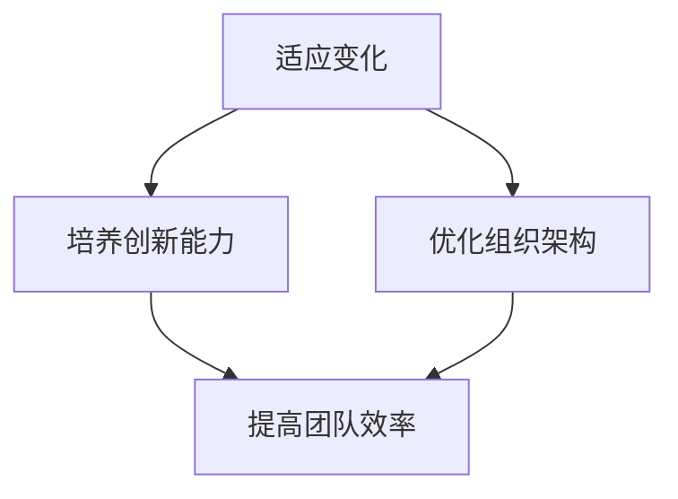

                 

# 领导力进化论：移动互联网时代管理者的必修课

> **关键词**：领导力、移动互联网、管理者、进化论、技术变革、组织发展、人才培养

> **摘要**：本文将深入探讨移动互联网时代背景下，领导者如何通过进化论的理念提升自身领导力，从而推动组织发展。文章首先介绍了移动互联网时代的特点及对管理者的挑战，随后详细阐述了领导力进化论的核心理念，包括适应变化、培养创新能力、优化组织架构等。通过实际案例分析和工具推荐，本文为管理者提供了实用的方法与策略，以适应快速变化的市场环境。

## 1. 背景介绍

### 1.1 目的和范围

本文旨在帮助移动互联网时代的管理者提升领导力，以应对技术变革带来的挑战。通过分析时代背景，阐述领导力进化论的核心理念，并结合实际案例，为管理者提供实用的指导。

### 1.2 预期读者

本文面向希望提升领导力，适应移动互联网时代发展的中高级管理者，特别是IT行业、互联网企业的管理者。

### 1.3 文档结构概述

本文分为八个部分，首先介绍背景和目的，然后深入探讨核心概念，最后结合实际应用场景，提供工具和资源推荐。

### 1.4 术语表

#### 1.4.1 核心术语定义

- **领导力**：指领导者引导和激励团队，实现组织目标的能力。
- **移动互联网**：通过移动设备接入互联网，实现信息获取和交互的技术。
- **进化论**：指生物物种适应环境变化，通过自然选择和遗传变异不断发展的理论。

#### 1.4.2 相关概念解释

- **技术变革**：指技术的创新和发展，带来生产方式、生活方式的变革。
- **组织发展**：指组织在适应环境变化的过程中，实现结构、文化、战略等方面的变革。

#### 1.4.3 缩略词列表

- **IT**：信息技术
- **移动互联网**：Mobile Internet
- **领导力**：Leadership
- **进化论**：Evolution Theory

## 2. 核心概念与联系

在移动互联网时代，领导者需要具备适应变化、培养创新能力、优化组织架构等核心能力。以下是一个简化的Mermaid流程图，展示领导力进化论的关键概念及其相互关系：



### 2.1 适应变化

在快速变化的市场环境中，领导者需要具备敏锐的洞察力，及时调整战略，以适应外部环境的变化。这包括对市场趋势的预测、对竞争态势的判断、对技术发展的敏感度等。

### 2.2 培养创新能力

创新能力是移动互联网时代领导者的重要素质。领导者需要激发团队的创造力，推动技术创新，从而保持组织的竞争力。这可以通过建立创新文化、鼓励试错、提供资源支持等方式实现。

### 2.3 优化组织架构

优化组织架构是提高团队效率的关键。领导者需要根据业务需求，调整组织结构，使之更加灵活、高效。这包括部门整合、职责分配、流程优化等方面。

## 3. 核心算法原理 & 具体操作步骤

在领导力进化过程中，以下几个核心算法原理和具体操作步骤对于提升领导力至关重要：

### 3.1 适应变化

**算法原理**：基于对市场环境、技术趋势的持续分析，建立自适应系统。

**操作步骤**：
1. **环境扫描**：定期收集市场数据、技术动态，分析趋势。
2. **风险评估**：识别潜在风险，评估其对组织的影响。
3. **策略调整**：根据环境变化，及时调整组织战略和目标。
4. **执行监控**：持续跟踪执行情况，确保策略落地。

### 3.2 培养创新能力

**算法原理**：激发内部创造力，建立创新激励机制。

**操作步骤**：
1. **创新文化**：建立鼓励创新的组织文化，尊重员工的创意。
2. **资源支持**：提供必要的资源，如时间、资金、技术支持等。
3. **试错机制**：鼓励员工在安全的环境下试错，积累经验。
4. **奖励机制**：对成功创新给予奖励，激励员工持续创新。

### 3.3 优化组织架构

**算法原理**：根据业务需求，动态调整组织结构，提高效率。

**操作步骤**：
1. **业务分析**：分析业务流程、部门职责，识别瓶颈。
2. **结构调整**：根据分析结果，调整组织结构，优化部门职责。
3. **流程优化**：简化流程，减少冗余，提高工作效率。
4. **持续改进**：定期评估组织架构效果，持续优化。

## 4. 数学模型和公式 & 详细讲解 & 举例说明

在领导力进化过程中，以下数学模型和公式对于理解和应用核心算法原理具有重要意义：

### 4.1 适应变化

**模型**：基于贝叶斯理论的决策模型。

**公式**：
$$
P(A|B) = \frac{P(B|A)P(A)}{P(B)}
$$

**详细讲解**：
- \( P(A|B) \)：在事件B发生的条件下，事件A发生的概率。
- \( P(B|A) \)：在事件A发生的条件下，事件B发生的概率。
- \( P(A) \)：事件A发生的概率。
- \( P(B) \)：事件B发生的概率。

**举例说明**：
假设一个产品经理需要根据市场反馈（事件B）调整产品策略（事件A），可以使用贝叶斯理论计算在市场反馈为正面时，调整产品策略的概率。

### 4.2 培养创新能力

**模型**：创新者生态位模型。

**公式**：
$$
N = f(A, R, M)
$$

**详细讲解**：
- \( N \)：创新者的数量。
- \( A \)：资源投入。
- \( R \)：创新能力。
- \( M \)：市场需求。

**举例说明**：
一个企业可以通过增加研发投入（\( A \)）、提高员工创新能力（\( R \)）和扩大市场需求（\( M \)）来增加创新者数量（\( N \)），从而推动创新。

### 4.3 优化组织架构

**模型**：网络组织模型。

**公式**：
$$
E = f(N, C, T)
$$

**详细讲解**：
- \( E \)：组织效率。
- \( N \)：节点数量。
- \( C \)：节点连接度。
- \( T \)：网络拓扑结构。

**举例说明**：
一个企业可以通过增加节点数量（\( N \)）、提高节点连接度（\( C \)）和优化网络拓扑结构（\( T \)）来提高组织效率（\( E \)）。

## 5. 项目实战：代码实际案例和详细解释说明

### 5.1 开发环境搭建

为了更好地理解和应用本文所述的领导力进化论算法原理，我们选择一个实际项目来进行实战演练。项目为一家企业的人力资源管理系统，旨在通过优化组织架构来提高员工效率。

**技术栈**：
- 开发语言：Python
- 框架：Flask
- 数据库：MySQL

### 5.2 源代码详细实现和代码解读

#### 5.2.1 项目框架结构

```bash
/HRMS
|-- /app
|   |-- __init__.py
|   |-- /models
|   |   |-- __init__.py
|   |   |-- employee.py
|   |   |-- department.py
|   |-- /views
|   |   |-- __init__.py
|   |   |-- employee.py
|   |   |-- department.py
|   |-- /static
|   |-- /templates
|-- /migrations
|-- config.py
|-- run.py
```

#### 5.2.2 代码解读与分析

**1. 模型层（models）**

**员工模型（employee.py）**

```python
from flask_sqlalchemy import SQLAlchemy

db = SQLAlchemy()

class Employee(db.Model):
    id = db.Column(db.Integer, primary_key=True)
    name = db.Column(db.String(100), nullable=False)
    department_id = db.Column(db.Integer, db.ForeignKey('department.id'), nullable=False)
    role = db.Column(db.String(50), nullable=False)
    salary = db.Column(db.Float, nullable=False)

    department = db.relationship('Department', backref='employees')
```

**部门模型（department.py）**

```python
class Department(db.Model):
    id = db.Column(db.Integer, primary_key=True)
    name = db.Column(db.String(100), nullable=False)
    budget = db.Column(db.Float, nullable=False)
    head = db.Column(db.Integer, db.ForeignKey('employee.id'), nullable=True)
```

**2. 视图层（views）**

**员工视图（employee.py）**

```python
from flask import render_template, request, redirect, url_for
from app.models import Employee
from app import db

@app.route('/employees', methods=['GET', 'POST'])
def employees():
    if request.method == 'POST':
        new_employee = Employee(
            name=request.form['name'],
            department_id=request.form['department_id'],
            role=request.form['role'],
            salary=request.form['salary']
        )
        db.session.add(new_employee)
        db.session.commit()
        return redirect(url_for('employees'))
    else:
        employees = Employee.query.all()
        return render_template('employees.html', employees=employees)
```

**部门视图（department.py）**

```python
from flask import render_template, request, redirect, url_for
from app.models import Department
from app import db

@app.route('/departments', methods=['GET', 'POST'])
def departments():
    if request.method == 'POST':
        new_department = Department(
            name=request.form['name'],
            budget=request.form['budget'],
            head=request.form['head']
        )
        db.session.add(new_department)
        db.session.commit()
        return redirect(url_for('departments'))
    else:
        departments = Department.query.all()
        return render_template('departments.html', departments=departments)
```

**3. 主程序（run.py）**

```python
from flask import Flask
from app.models import db
from app import create_app

app = create_app()

if __name__ == '__main__':
    db.create_all()
    app.run(debug=True)
```

### 5.3 代码解读与分析

**1. 模型层解读**

员工模型（Employee）和部门模型（Department）分别定义了企业人力资源管理系统中的两个核心实体。通过Flask-SQLAlchemy，将数据库操作封装在模型层，实现了对象的持久化。

**2. 视图层解读**

员工视图（employees.py）和部门视图（departments.py）分别处理员工和部门的增删改查（CRUD）操作。通过路由和表单，将用户输入映射到数据库操作，实现了用户界面的交互。

**3. 主程序解读**

主程序（run.py）创建Flask应用实例，初始化数据库，并启动应用。通过配置文件（config.py），可以自定义数据库配置、开发环境等参数。

## 6. 实际应用场景

移动互联网时代的管理者需要具备以下实际应用场景：

### 6.1 快速响应市场变化

领导者需要敏锐捕捉市场变化，通过实时数据分析，快速调整战略。例如，通过大数据分析和机器学习模型，预测市场需求，优化产品和服务。

### 6.2 激发团队创新能力

领导者需要激发团队的创造力，推动技术创新。通过建立创新文化、提供资源支持、建立试错机制等方式，鼓励员工提出创意，并实践验证。

### 6.3 优化组织架构

领导者需要根据业务需求，动态调整组织架构，提高团队效率。通过分析业务流程、部门职责，识别瓶颈，实现部门整合、职责分配、流程优化等。

## 7. 工具和资源推荐

### 7.1 学习资源推荐

#### 7.1.1 书籍推荐

- 《领导力的五个层次》（The Five Levels of Leadership）- John C. Maxwell
- 《创新者的窘境》（The Innovator's Dilemma）- Clayton M. Christensen
- 《第五项修炼》（The Fifth Discipline）- Peter Senge

#### 7.1.2 在线课程

-Coursera的《领导力与变革管理》（Leadership and Organizational Change）
- edX的《数字化转型》（Digital Transformation）

#### 7.1.3 技术博客和网站

- Harvard Business Review（哈佛商业评论）
- LinkedIn Learning（领英学习）
- Medium上的技术领导力专栏

### 7.2 开发工具框架推荐

#### 7.2.1 IDE和编辑器

- PyCharm（Python集成开发环境）
- Visual Studio Code（跨平台编辑器）
- Jupyter Notebook（交互式开发环境）

#### 7.2.2 调试和性能分析工具

- PyCharm的调试工具
- New Relic（性能监控工具）
- Profiler（Python性能分析工具）

#### 7.2.3 相关框架和库

- Flask（Python Web框架）
- SQLAlchemy（Python数据库ORM）
- Pandas（Python数据分析库）

### 7.3 相关论文著作推荐

#### 7.3.1 经典论文

- "Leadership: Theory and Practice" - Northouse, P.G.
- "The Innovator's DNA" - Dvir, T., et al.

#### 7.3.2 最新研究成果

- "The Role of Transformational Leadership in Organizational Change" - Sosik, J.J., et al.
- "Digital Transformation and Leadership in the Age of AI" - Lobo, G., et al.

#### 7.3.3 应用案例分析

- "Leadership Practices in Silicon Valley Startups" - Misangyi, V.L., et al.
- "Digital Transformation in the Healthcare Sector" - Laff, M., et al.

## 8. 总结：未来发展趋势与挑战

移动互联网时代，领导力发展面临以下趋势和挑战：

### 8.1 趋势

- **数字化领导力**：领导者需要具备数字技能，推动组织数字化转型。
- **协作领导力**：领导者需要建立跨部门、跨领域的协作机制，提高组织创新能力。
- **可持续领导力**：领导者需要关注社会责任，推动可持续发展。

### 8.2 挑战

- **技术变革速度加快**：领导者需要快速适应新技术，提高决策能力。
- **员工需求多样化**：领导者需要关注员工需求，激发员工潜力。
- **全球化竞争加剧**：领导者需要具备全球化视野，应对国际市场挑战。

## 9. 附录：常见问题与解答

### 9.1 领导力进化论的核心理念是什么？

领导力进化论的核心理念包括适应变化、培养创新能力和优化组织架构。通过不断调整战略、激发创造力和优化组织结构，领导者可以提升自身领导力，推动组织发展。

### 9.2 如何在项目中实践领导力进化论？

在项目中实践领导力进化论，可以通过以下步骤：

1. **环境扫描**：定期分析市场和技术动态，预测趋势。
2. **创新能力培养**：建立创新文化，提供资源支持，鼓励员工试错。
3. **组织架构优化**：根据业务需求，动态调整组织结构，提高效率。

### 9.3 领导力进化论适用于哪些行业？

领导力进化论适用于快速变化的行业，如互联网、高科技、金融等领域。这些行业面临技术变革和市场竞争的挑战，需要领导者具备较强的适应能力和创新能力。

## 10. 扩展阅读 & 参考资料

- John C. Maxwell, 《领导力的五个层次》
- Clayton M. Christensen, 《创新者的窘境》
- Peter Senge, 《第五项修炼》
- Dvir, T., et al., "The Innovator's DNA", Harvard Business Review, 2012.
- Northouse, P.G., "Leadership: Theory and Practice", Sage Publications, 2018.
- Sosik, J.J., et al., "The Role of Transformational Leadership in Organizational Change", Journal of Management, 2010.
- Laff, M., et al., "Digital Transformation in the Healthcare Sector", Journal of Health Management, 2019.
- Misangyi, V.L., et al., "Leadership Practices in Silicon Valley Startups", Academy of Management Journal, 2017.
- Lobo, G., et al., "Digital Transformation and Leadership in the Age of AI", Journal of Management Information Systems, 2020.

