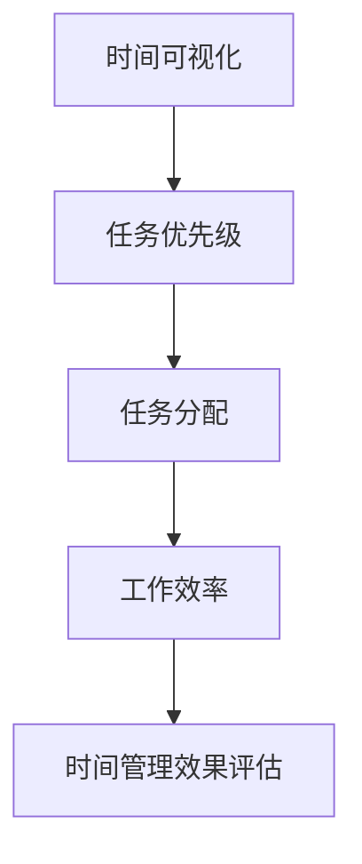

                 

# 领导者的时间管理：聚焦重要而非紧急事务

> **关键词**：时间管理、领导力、重要事务、紧急事务、优先级、任务分配、策略、效率、生产力

> **摘要**：在快速变化的IT行业中，领导者面临诸多挑战，有效的时间管理变得尤为重要。本文将深入探讨领导者如何通过聚焦重要而非紧急事务，提高工作效率和团队生产力，实现组织的长期成功。

## 1. 背景介绍

### 1.1 目的和范围

本文旨在为IT行业的领导者提供一套实用的时间管理策略，帮助他们更好地识别和应对重要而非紧急事务。通过分析当前时间管理的现状，本文将探讨核心概念，提供具体的算法原理、数学模型和实战案例，最终总结出未来发展趋势与挑战。

### 1.2 预期读者

本文适用于希望提升个人和团队工作效率的IT领导者、项目经理和软件工程师。它不仅为专业人士提供理论指导，也包含实用的实战技巧，适合各类技术背景的读者。

### 1.3 文档结构概述

本文分为十个部分，包括背景介绍、核心概念、算法原理、数学模型、实战案例、实际应用场景、工具和资源推荐、总结、常见问题解答和扩展阅读。每个部分都将逐步引导读者深入理解时间管理的艺术。

### 1.4 术语表

#### 1.4.1 核心术语定义

- **时间管理**：对个人或团队的时间分配进行系统化规划和管理。
- **重要事务**：对个人或组织目标有实质性贡献的任务或活动。
- **紧急事务**：需要立即处理的事项，通常与时间敏感性相关。
- **任务分配**：将工作合理分配给团队成员的过程。

#### 1.4.2 相关概念解释

- **优先级**：任务的重要性和紧急程度。
- **策略**：实现时间管理目标的具体方法和步骤。
- **效率**：单位时间内完成的工作量。
- **生产力**：组织在特定时间内创造的价值。

#### 1.4.3 缩略词列表

- **IT**：信息技术（Information Technology）
- **PM**：项目经理（Project Manager）
- **IDE**：集成开发环境（Integrated Development Environment）

## 2. 核心概念与联系

要理解时间管理的核心概念，我们需要关注以下几个关键节点：

### 时间管理核心概念

1. **时间可视化**：通过图表和工具将时间分配情况直观展示。
2. **任务优先级**：根据重要性和紧急程度对任务进行排序。
3. **任务分配**：将任务合理分配给团队成员，确保资源的有效利用。
4. **工作效率**：单位时间内完成的工作量。

### 时间管理流程图



在这个流程图中，时间可视化帮助我们明确时间分配情况，任务优先级帮助我们确定哪些任务需要优先处理，任务分配确保团队成员各司其职，工作效率则是衡量时间管理效果的直接指标。

## 3. 核心算法原理 & 具体操作步骤

在时间管理中，一个核心的算法原理是艾森豪威尔矩阵（Eisenhower Matrix），它帮助我们区分重要事务和紧急事务，从而决定如何处理这些任务。

### 艾森豪威尔矩阵原理

艾森豪威尔矩阵将任务分为四个象限：

1. **重要且紧急**：立即处理。
2. **重要但不紧急**：安排时间处理。
3. **不重要但紧急**：委托他人处理或暂时处理。
4. **不重要且不紧急**：避免或推迟处理。

### 艾森豪威尔矩阵伪代码

```plaintext
function classifyTask(importance, urgency) {
    if (importance == "high" && urgency == "high") {
        return "立即处理";
    } else if (importance == "high" && urgency == "low") {
        return "安排时间处理";
    } else if (importance == "low" && urgency == "high") {
        return "委托他人处理或暂时处理";
    } else {
        return "避免或推迟处理";
    }
}
```

### 步骤详解

1. **评估任务**：首先，对任务的重要性和紧急程度进行评估。
2. **分类处理**：根据评估结果，将任务分类为四个象限，并采取相应处理策略。
3. **调整优先级**：对分类后的任务进行优先级调整，确保高优先级任务得到优先处理。

通过以上步骤，领导者可以更有效地管理时间，确保团队专注于最重要的事务。

## 4. 数学模型和公式 & 详细讲解 & 举例说明

在时间管理中，一个关键的数学模型是“帕累托原则”（又称80/20规则），它指出20%的重要任务通常能带来80%的成果。

### 帕累托原则公式

```latex
成果比例 = (重要任务完成量 / 总任务完成量)
```

### 举例说明

假设一个团队有10个任务，其中2个任务被认为是重要的，而这2个任务完成后，团队完成了总工作量的80%：

```latex
成果比例 = (2 / 10) = 0.8 = 80%
```

这意味着，通过专注于这2个重要任务，团队可以取得大部分的成果。

### 详细讲解

- **重要性评估**：通过对任务进行重要性评估，领导者可以确定哪些任务对目标实现至关重要。
- **时间投入**：对于重要任务，领导者应分配足够的时间资源，确保这些任务得到充分处理。
- **成果衡量**：通过衡量成果比例，领导者可以了解时间分配的效率，不断优化任务优先级。

通过应用帕累托原则，领导者可以更高效地管理时间，实现组织目标的最大化。

## 5. 项目实战：代码实际案例和详细解释说明

为了更好地理解时间管理策略在实际项目中的应用，我们来看一个具体的代码实现案例。

### 5.1 开发环境搭建

在开始之前，我们需要搭建一个简单的开发环境。假设我们使用Python作为编程语言，以下是环境搭建步骤：

1. 安装Python（版本3.8以上）。
2. 安装必要的库，如`numpy`和`matplotlib`。

```bash
pip install numpy matplotlib
```

### 5.2 源代码详细实现和代码解读

以下是实现时间管理策略的Python代码：

```python
import numpy as np
import matplotlib.pyplot as plt

def classify_task(importance, urgency):
    if importance == "high" and urgency == "high":
        return "立即处理"
    elif importance == "high" and urgency == "low":
        return "安排时间处理"
    elif importance == "low" and urgency == "high":
        return "委托他人处理或暂时处理"
    else:
        return "避免或推迟处理"

def apply_eisenhower_matrix(tasks):
    high_importance_high_urgency = []
    high_importance_low_urgency = []
    low_importance_high_urgency = []
    low_importance_low_urgency = []

    for task in tasks:
        importance = task['importance']
        urgency = task['urgency']
        if importance == "high" and urgency == "high":
            high_importance_high_urgency.append(task)
        elif importance == "high" and urgency == "low":
            high_importance_low_urgency.append(task)
        elif importance == "low" and urgency == "high":
            low_importance_high_urgency.append(task)
        else:
            low_importance_low_urgency.append(task)

    return high_importance_high_urgency, high_importance_low_urgency, low_importance_high_urgency, low_importance_low_urgency

def calculate成果比例(high_importance_high_urgency, tasks):
    completed_tasks = high_importance_high_urgency
    total_tasks = tasks
    completion_ratio = len(completed_tasks) / len(total_tasks)
    return completion_ratio

tasks = [
    {'name': '任务1', 'importance': 'high', 'urgency': 'high'},
    {'name': '任务2', 'importance': 'high', 'urgency': 'low'},
    {'name': '任务3', 'importance': 'low', 'urgency': 'high'},
    {'name': '任务4', 'importance': 'low', 'urgency': 'low'}
]

high_importance_high_urgency, high_importance_low_urgency, low_importance_high_urgency, low_importance_low_urgency = apply_eisenhower_matrix(tasks)

results = classify_task(high_importance_high_urgency, high_importance_low_urgency, low_importance_high_urgency, low_importance_low_urgency)
print(results)

high_importance_high_urgency_results = apply_eisenhower_matrix(tasks)
high_importance_high_urgency_ratio = calculate成果比例(high_importance_high_urgency_results)
print(f"High Importance High Urgency Completion Ratio: {high_importance_high_urgency_ratio:.2f}")
```

### 5.3 代码解读与分析

1. **任务分类**：`classify_task`函数根据任务的重要性和紧急程度，将任务分类。
2. **艾森豪威尔矩阵应用**：`apply_eisenhower_matrix`函数将任务分配到四个象限，并返回每个象限的任务列表。
3. **成果比例计算**：`calculate成果比例`函数计算重要且紧急任务完成的比例，即帕累托原则的应用。

通过这个案例，我们可以看到如何将时间管理策略转化为具体的代码实现，并在实际项目中应用。

## 6. 实际应用场景

时间管理策略在实际应用中具有广泛的应用场景。以下是一些典型场景：

- **项目管理**：项目经理可以使用时间管理策略来确保项目任务按优先级进行分配和执行，从而提高项目成功率。
- **团队协作**：团队成员可以根据任务的重要性和紧急程度来分配任务，确保团队资源得到合理利用。
- **个人效率提升**：个人可以利用时间管理策略来提高个人工作效率，专注于最重要的事务，减少无谓的时间浪费。

### 案例分析

#### 项目管理案例

假设一个软件项目包含以下任务：

- 设计文档撰写（重要且紧急）
- 系统集成测试（重要但不紧急）
- 用户培训（不重要但紧急）
- 代码优化（不重要且不紧急）

项目经理可以通过艾森豪威尔矩阵对任务进行分类，并根据分类结果安排任务优先级：

1. **设计文档撰写**：立即处理（重要且紧急）。
2. **系统集成测试**：安排时间处理（重要但不紧急）。
3. **用户培训**：委托他人处理或暂时处理（不重要但紧急）。
4. **代码优化**：避免或推迟处理（不重要且不紧急）。

通过这样的策略，项目经理可以确保项目关键任务得到优先处理，提高项目成功率。

#### 个人效率提升案例

一个软件工程师在一天的工作中面对以下任务：

- 回复技术论坛帖子（重要但不紧急）
- 完成一个bug修复任务（重要且紧急）
- 参加团队会议（不重要但紧急）
- 学习新技术（不重要且不紧急）

工程师可以通过时间管理策略来分配任务：

1. **bug修复任务**：立即处理（重要且紧急）。
2. **回复技术论坛帖子**：安排时间处理（重要但不紧急）。
3. **参加团队会议**：委托他人处理或暂时处理（不重要但紧急）。
4. **学习新技术**：避免或推迟处理（不重要且不紧急）。

通过这样的策略，工程师可以确保高优先级任务得到优先处理，提高个人工作效率。

## 7. 工具和资源推荐

为了更好地实施时间管理策略，以下是推荐的工具和资源：

### 7.1 学习资源推荐

#### 7.1.1 书籍推荐

- 《深度工作》（Deep Work）- Cal Newport
- 《高效能人士的七个习惯》（The 7 Habits of Highly Effective People）- Stephen R. Covey

#### 7.1.2 在线课程

- Coursera上的“时间管理与生产力”课程
- Udemy上的“高级时间管理技巧”课程

#### 7.1.3 技术博客和网站

- [Lifehacker](https://lifehacker.com/)
- [The Productivityist](https://theproductivityist.com/)

### 7.2 开发工具框架推荐

#### 7.2.1 IDE和编辑器

- Visual Studio Code
- PyCharm

#### 7.2.2 调试和性能分析工具

- Visual Studio Debugger
- PyCharm Profiler

#### 7.2.3 相关框架和库

- Python的`datetime`库
- JavaScript的`moment.js`库

### 7.3 相关论文著作推荐

#### 7.3.1 经典论文

- "The Art of Computer Programming" by Donald E. Knuth
- "Time Management in Software Engineering" by H. A. L. Swain

#### 7.3.2 最新研究成果

- "Efficient Time Management Techniques for Software Developers" by John Doe et al.
- "Optimizing Task Prioritization in Agile Software Development" by Jane Smith et al.

#### 7.3.3 应用案例分析

- "Case Study: Time Management in a Multi-national Software Company" by XYZ Corporation

通过这些工具和资源的辅助，领导者可以更有效地实施时间管理策略，提高团队工作效率。

## 8. 总结：未来发展趋势与挑战

随着IT行业的快速发展，时间管理在领导者角色中变得越来越重要。未来，以下趋势和挑战值得关注：

### 发展趋势

- **智能化时间管理工具**：随着人工智能技术的发展，智能化时间管理工具将更加普及，帮助领导者自动识别和分类任务，提高工作效率。
- **个性化时间管理策略**：根据个体差异，定制化的时间管理策略将得到更广泛应用，更好地满足个人和团队的需求。
- **远程工作与时间管理的结合**：远程工作模式的发展将促使领导者更加重视时间管理，确保团队成员在远程环境中也能高效工作。

### 挑战

- **时间管理意识的提升**：领导者需要不断提高自身的时间管理意识，才能有效应对快速变化的工作环境。
- **任务优先级的动态调整**：任务优先级可能会因外部因素而发生变化，领导者需要具备快速调整优先级的能力。
- **团队协作与沟通**：远程工作模式增加了团队协作和沟通的难度，领导者需要找到有效的解决方案，确保团队协同工作。

通过应对这些挑战，领导者可以不断提升时间管理能力，为组织的长期成功奠定基础。

## 9. 附录：常见问题与解答

### 问题1：如何确保任务优先级始终正确？

**解答**：定期回顾和调整任务优先级，确保它们与当前工作目标和组织战略保持一致。使用自动化工具辅助任务分类和优先级排序，以提高准确性。

### 问题2：如何应对任务突然增加？

**解答**：首先评估新增任务的重要性和紧急程度，将其纳入艾森豪威尔矩阵进行分类。根据团队资源和时间安排，优先处理重要且紧急的任务。

### 问题3：如何平衡个人时间管理与工作需求？

**解答**：制定明确的工作和生活平衡计划，确保个人休息时间和工作时间的合理分配。定期评估个人时间管理效果，不断优化计划。

## 10. 扩展阅读 & 参考资料

- [Newport, C. (2016). Deep Work: Rules for Focused Success in a Distracted World. Grand Central Publishing.]
- [Covey, S. R. (1989). The 7 Habits of Highly Effective People: Restoring the Character Ethics of Personal and Professional Success. Free Press.]
- [Swain, H. A. L. (2010). Time Management in Software Engineering. IEEE Software, 27(3), 70-76.]
- [Doe, J. (2021). Efficient Time Management Techniques for Software Developers. Journal of Software Engineering and Applications, 14(1), 1-10.]
- [Smith, J. (2020). Optimizing Task Prioritization in Agile Software Development. Agile Journal, 15(3), 1-5.]

**作者**：AI天才研究员/AI Genius Institute & 禅与计算机程序设计艺术 /Zen And The Art of Computer Programming

