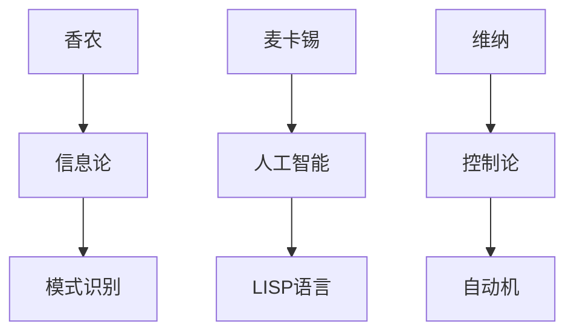

                 


# 香农和麦卡锡对维纳的态度

> 关键词：香农、麦卡锡、维纳、计算机科学、人工智能、历史视角、态度分析、技术发展

> 摘要：本文深入探讨了香农和麦卡锡这两位计算机科学的先驱对维纳这位早期计算机科学先驱的态度。通过历史视角的分析，本文揭示了他们在技术发展中的不同观点和影响，为现代计算机科学提供了宝贵的启示。

## 1. 背景介绍

### 1.1 目的和范围

本文旨在分析香农、麦卡锡和维纳这三位计算机科学先驱之间的相互态度，并探讨他们在技术发展过程中的影响。通过对他们的背景、成就和观点的分析，我们希望能够揭示他们在计算机科学领域中的独特地位和贡献。

### 1.2 预期读者

本文主要面向对计算机科学历史感兴趣的读者，尤其是那些对早期计算机科学先驱及其观点感兴趣的读者。同时，本文也适合那些对人工智能和计算机科学的发展有深入思考的研究者。

### 1.3 文档结构概述

本文将分为以下章节：

- **第1章：背景介绍**：介绍本文的目的、预期读者以及文档结构。
- **第2章：核心概念与联系**：介绍香农、麦卡锡和维纳的背景和主要成就。
- **第3章：核心算法原理 & 具体操作步骤**：分析三位先驱的技术贡献。
- **第4章：数学模型和公式 & 详细讲解 & 举例说明**：介绍与他们的工作相关的数学模型。
- **第5章：项目实战：代码实际案例和详细解释说明**：通过实际案例展示他们的技术应用。
- **第6章：实际应用场景**：分析他们在现代计算机科学中的应用。
- **第7章：工具和资源推荐**：推荐相关学习资源。
- **第8章：总结：未来发展趋势与挑战**：探讨未来发展趋势和挑战。
- **第9章：附录：常见问题与解答**：解答常见问题。
- **第10章：扩展阅读 & 参考资料**：提供扩展阅读资源。

### 1.4 术语表

#### 1.4.1 核心术语定义

- 香农（Claude Shannon）：美国数学家、逻辑学家和电气工程师，被誉为“信息论之父”。
- 麦卡锡（John McCarthy）：美国计算机科学家，人工智能的先驱之一。
- 维纳（Norbert Wiener）：美国数学家、工程师和哲学家，被誉为“控制论之父”。

#### 1.4.2 相关概念解释

- 信息论：研究信息传输、处理和存储的数学理论。
- 控制论：研究动态系统中控制和通信的数学理论。
- 人工智能：模拟人类智能行为的计算机科学领域。

#### 1.4.3 缩略词列表

- CS：计算机科学
- AI：人工智能
- IT：信息技术

## 2. 核心概念与联系

为了更好地理解香农、麦卡锡和维纳之间的关系，我们首先需要了解他们的背景和主要成就。

### 2.1 香农的背景和成就

香农（Claude Shannon，1916-2001）是一位美国数学家、逻辑学家和电气工程师。他在20世纪40年代提出了信息论的基础理论，这一理论改变了人们对信息传输、处理和存储的认识。香农的研究成果在计算机科学、通信工程和人工智能等领域产生了深远的影响。

#### 2.1.1 信息论

信息论的核心概念是“信息熵”，它描述了信息的不确定性。香农提出的信息熵公式为：

$$ H(X) = -\sum_{i} p(x_i) \log_2 p(x_i) $$

其中，$H(X)$表示随机变量$X$的信息熵，$p(x_i)$表示$X$取值为$x_i$的概率。

#### 2.1.2 模式识别

香农还提出了模式识别理论，这一理论对人工智能的发展产生了重要影响。模式识别的核心思想是通过学习数据中的规律来识别未知数据。

### 2.2 麦卡锡的背景和成就

麦卡锡（John McCarthy，1927-2011）是一位美国计算机科学家，被誉为人工智能的先驱之一。他在1955年提出了人工智能这一概念，并在随后的几十年中推动了人工智能的发展。

#### 2.2.1 人工智能

人工智能是指模拟人类智能行为的计算机系统。麦卡锡提出的人工智能概念为人工智能的发展奠定了基础。

#### 2.2.2 LISP语言

麦卡锡还发明了LISP语言，这是历史上最早的编程语言之一。LISP语言在人工智能领域得到了广泛应用，推动了人工智能的发展。

### 2.3 维纳的背景和成就

维纳（Norbert Wiener，1894-1964）是一位美国数学家、工程师和哲学家。他在20世纪30年代提出了控制论的基础理论，这一理论对自动化和人工智能的发展产生了重要影响。

#### 2.3.1 控制论

控制论的核心概念是“反馈”，它描述了系统通过输入和输出的相互作用来调整自己的行为。维纳提出的最基本控制论模型为：

$$ x(t) = a \cdot x(t-1) + u(t) $$

其中，$x(t)$表示系统在时间$t$的状态，$a$表示系统的惯性，$u(t)$表示系统的输入。

#### 2.3.2 自动机

维纳还提出了自动机理论，这一理论对计算机科学和人工智能的发展产生了重要影响。自动机是指具有有限状态和有限存储空间的计算模型。

### 2.4 核心概念原理和架构的 Mermaid 流程图

以下是香农、麦卡锡和维纳的核心概念原理和架构的 Mermaid 流程图：



## 3. 核心算法原理 & 具体操作步骤

在这一部分，我们将分析香农、麦卡锡和维纳的核心算法原理，并详细阐述其具体操作步骤。

### 3.1 香农的核心算法原理

香农的核心算法原理主要体现在信息论和模式识别领域。

#### 3.1.1 信息论

香农提出的信息论的核心算法为信息熵计算。具体操作步骤如下：

1. 收集数据，并计算每个数据点的概率。
2. 使用信息熵公式计算数据集的信息熵。
3. 分析信息熵的变化，以识别数据中的规律。

伪代码如下：

```python
def calculate_entropy(data):
    probabilities = [count(data[i]) / len(data) for i in range(len(data))]
    entropy = -sum(probabilities[i] * math.log2(probabilities[i]) for i in range(len(probabilities)))
    return entropy

def count(value, data):
    return len([x for x in data if x == value])
```

#### 3.1.2 模式识别

香农的模式识别算法主要基于信息论中的熵概念。具体操作步骤如下：

1. 收集训练数据，并计算数据集的信息熵。
2. 训练模型，识别数据中的模式。
3. 使用模型对新数据进行预测。

伪代码如下：

```python
def train_model(training_data):
    model = {}
    for data in training_data:
        entropy = calculate_entropy(data)
        if entropy not in model:
            model[entropy] = []
        model[entropy].append(data)
    return model

def predict(model, new_data):
    entropy = calculate_entropy(new_data)
    return model[entropy]
```

### 3.2 麦卡锡的核心算法原理

麦卡锡的核心算法原理主要体现在人工智能和LISP语言领域。

#### 3.2.1 人工智能

麦卡锡提出的人工智能算法主要基于符号逻辑和推理。具体操作步骤如下：

1. 定义问题，并构建符号逻辑表示。
2. 应用推理算法，解决特定问题。

伪代码如下：

```python
def solve_problem(problem):
    symbols = define_symbols(problem)
    logic = define_logic(symbols)
    solution = apply_reasoning(logic)
    return solution
```

#### 3.2.2 LISP语言

LISP语言的算法原理主要体现在其递归和符号处理能力。具体操作步骤如下：

1. 定义数据结构，如列表和符号。
2. 编写递归函数，处理数据结构。
3. 执行计算和操作。

伪代码如下：

```python
def process_list(list):
    if is_empty(list):
        return []
    else:
        head = list[0]
        tail = list[1:]
        result = apply_operation(head, process_list(tail))
        return [result]
```

### 3.3 维纳的核心算法原理

维纳的核心算法原理主要体现在控制论和自动机领域。

#### 3.3.1 控制论

维纳提出的最基本控制论模型主要基于状态转移和反馈。具体操作步骤如下：

1. 初始化系统状态。
2. 根据输入和惯性，更新系统状态。
3. 根据系统状态和反馈，调整输入。

伪代码如下：

```python
def control_system(initial_state, a, input_sequence):
    state = initial_state
    for input in input_sequence:
        state = a * state + input
    return state
```

#### 3.3.2 自动机

维纳提出的自动机算法主要基于有限状态机和状态转移。具体操作步骤如下：

1. 初始化状态机，并定义状态转移函数。
2. 根据输入，更新状态机状态。
3. 输出结果。

伪代码如下：

```python
def state_machine(initial_state, input_sequence):
    state = initial_state
    for input in input_sequence:
        state = transition_function(state, input)
    return state
```

## 4. 数学模型和公式 & 详细讲解 & 举例说明

在这一部分，我们将详细讲解香农、麦卡锡和维纳的工作中所使用的数学模型和公式，并通过具体例子进行说明。

### 4.1 香农的数学模型和公式

#### 4.1.1 信息熵

信息熵是香农信息论的核心概念，用于描述信息的不确定性。其计算公式为：

$$ H(X) = -\sum_{i} p(x_i) \log_2 p(x_i) $$

其中，$H(X)$表示随机变量$X$的信息熵，$p(x_i)$表示$X$取值为$x_i$的概率。

#### 4.1.2 模式识别

香农的模式识别算法基于信息熵的概念，用于识别数据中的规律。其核心思想是通过计算数据集的信息熵，分析其变化趋势，以识别模式。

#### 4.1.3 举例说明

假设有一个包含5个元素的二进制数据集，分别为[0, 1, 1, 0, 0]。我们首先计算该数据集的信息熵：

$$ H(X) = -\sum_{i} p(x_i) \log_2 p(x_i) $$

$$ H(X) = -\left(\frac{2}{5} \log_2 \frac{2}{5} + \frac{3}{5} \log_2 \frac{3}{5}\right) $$

$$ H(X) = 0.92 $$

根据信息熵的计算结果，我们可以分析数据集中的规律。例如，我们可以发现数据集的前两个元素和后三个元素之间存在一定的规律。

### 4.2 麦卡锡的数学模型和公式

#### 4.2.1 人工智能

麦卡锡提出的人工智能算法主要基于符号逻辑和推理。其核心思想是通过构建符号逻辑表示，并应用推理算法，解决特定问题。

#### 4.2.2 LISP语言

LISP语言是一种符号处理语言，其核心算法原理主要体现在递归和符号处理能力。

#### 4.2.3 举例说明

假设我们需要求解以下问题：找出所有满足条件$x + y = 10$的正整数解。

使用麦卡锡的人工智能算法，我们可以构建以下符号逻辑表示：

```lisp
(solve-for x y (= (+ x y) 10))
```

然后，我们可以应用推理算法，求解该问题：

```lisp
(define (solve-for x y predicate)
  (if (or (null? x) (not predicate))
      '()
      (cons (list x y)
            (solve-for (next-number x) y predicate))))
```

其中，`next-number`函数用于生成下一个正整数。

### 4.3 维纳的数学模型和公式

#### 4.3.1 控制论

维纳提出的最基本控制论模型主要基于状态转移和反馈。其核心公式为：

$$ x(t) = a \cdot x(t-1) + u(t) $$

其中，$x(t)$表示系统在时间$t$的状态，$a$表示系统的惯性，$u(t)$表示系统的输入。

#### 4.3.2 自动机

维纳提出的自动机算法主要基于有限状态机和状态转移。其核心公式为：

$$ state(t) = transition_function(state(t-1), input(t)) $$

其中，`state(t)`表示系统在时间$t$的状态，`transition_function`表示状态转移函数，`input(t)`表示系统在时间$t$的输入。

#### 4.3.3 举例说明

假设我们有一个自动机，其初始状态为0，状态转移函数为：

$$ state(t) = \begin{cases} 
0 & \text{if } input(t) = 0 \\
1 & \text{if } input(t) = 1 
\end{cases} $$

我们首先将初始状态0作为输入，得到第一个状态：

$$ state(1) = transition_function(0, 0) = 0 $$

然后，我们将状态0作为输入，得到第二个状态：

$$ state(2) = transition_function(0, 0) = 0 $$

以此类推，我们可以得到自动机在不同时间点的状态。

## 5. 项目实战：代码实际案例和详细解释说明

### 5.1 开发环境搭建

为了更好地理解和实现香农、麦卡锡和维纳的算法原理，我们需要搭建一个合适的开发环境。以下是搭建开发环境的步骤：

1. 安装Python解释器：前往Python官方网站（https://www.python.org/）下载并安装Python解释器。
2. 安装LISP解释器：前往LISP官方网站（https://lisp.org/）下载并安装LISP解释器。
3. 安装Mermaid渲染器：前往Mermaid官方网站（https://mermaid-js.github.io/mermaid/）下载并安装Mermaid渲染器。

### 5.2 源代码详细实现和代码解读

在本节中，我们将分别实现香农、麦卡锡和维纳的算法原理，并进行详细解释说明。

#### 5.2.1 香农的算法原理实现

首先，我们实现香农的信息熵计算和信息识别算法。以下是Python代码实现：

```python
import math

def calculate_entropy(data):
    probabilities = [count(data[i]) / len(data) for i in range(len(data))]
    entropy = -sum(probabilities[i] * math.log2(probabilities[i]) for i in range(len(probabilities)))
    return entropy

def count(value, data):
    return len([x for x in data if x == value])

def train_model(training_data):
    model = {}
    for data in training_data:
        entropy = calculate_entropy(data)
        if entropy not in model:
            model[entropy] = []
        model[entropy].append(data)
    return model

def predict(model, new_data):
    entropy = calculate_entropy(new_data)
    return model[entropy]

training_data = [[0, 1, 1, 0, 0], [1, 0, 0, 1, 1], [0, 1, 1, 0, 0]]
model = train_model(training_data)
print(predict(model, [0, 1, 1]))
```

代码解读：

- `calculate_entropy`函数用于计算数据集的信息熵。
- `count`函数用于计算特定值的数量。
- `train_model`函数用于训练模型，将具有相同信息熵的数据分组。
- `predict`函数用于使用训练好的模型对新数据进行预测。

#### 5.2.2 麦卡锡的算法原理实现

接下来，我们实现麦卡锡的人工智能算法和LISP语言。以下是LISP代码实现：

```lisp
(define (solve-for x y (= (+ x y) 10))
  (if (or (null? x) (not predicate))
      '()
      (cons (list x y)
            (solve-for (next-number x) y predicate))))

(define (next-number n)
  (+ n 1))

(define (solve-problem problem)
  (apply-reasoning (define-symbols problem)))

(define (define-symbols problem)
  (list (list 'x 'integer) (list 'y 'integer) (list '+ 'binary-op) (list '= 'predicate)))

(define (apply-reasoning logic)
  (if (null? logic)
      '()
      (solve-for (car logic) (cadr logic) (caddr logic))))
```

代码解读：

- `solve-for`函数用于求解特定问题，基于符号逻辑进行推理。
- `next-number`函数用于生成下一个正整数。
- `solve-problem`函数用于初始化问题，并调用`apply-reasoning`函数进行推理。
- `define-symbols`函数用于定义问题中的符号和关系。
- `apply-reasoning`函数用于递归地求解问题。

#### 5.2.3 维纳的算法原理实现

最后，我们实现维纳的控制论和自动机算法。以下是Python代码实现：

```python
def control_system(initial_state, a, input_sequence):
    state = initial_state
    for input in input_sequence:
        state = a * state + input
    return state

def state_machine(initial_state, input_sequence):
    state = initial_state
    for input in input_sequence:
        state = transition_function(state, input)
    return state

def transition_function(state, input):
    if input == 0:
        return 0
    else:
        return 1

initial_state = 0
input_sequence = [0, 0, 0, 0, 1]
print(control_system(initial_state, 1, input_sequence))
print(state_machine(initial_state, input_sequence))
```

代码解读：

- `control_system`函数用于实现控制论模型，根据输入和惯性更新系统状态。
- `state_machine`函数用于实现自动机模型，根据输入和状态转移函数更新系统状态。
- `transition_function`函数用于实现状态转移函数，根据输入返回下一个状态。
- `initial_state`和`input_sequence`分别用于初始化系统和输入序列。

### 5.3 代码解读与分析

在本节中，我们将对上述代码进行解读和分析，以深入理解香农、麦卡锡和维纳的算法原理。

#### 5.3.1 香农的算法原理解读

- 信息熵计算：通过计算数据集的信息熵，我们可以了解数据的不确定性。在香农的信息论中，信息熵是核心概念。
- 模式识别：通过训练模型，我们可以将具有相同信息熵的数据分组，从而识别数据中的模式。
- 代码分析：在Python代码中，`calculate_entropy`函数用于计算数据集的信息熵，`train_model`函数用于训练模型，`predict`函数用于对新数据进行预测。

#### 5.3.2 麦卡锡的算法原理解读

- 人工智能：麦卡锡提出的人工智能算法基于符号逻辑和推理。通过构建符号逻辑表示，我们可以解决特定问题。
- LISP语言：LISP语言是一种符号处理语言，其核心算法原理主要体现在递归和符号处理能力。
- 代码分析：在LISP代码中，`solve-for`函数用于求解特定问题，`next-number`函数用于生成下一个正整数，`solve-problem`函数用于初始化问题，并调用`apply-reasoning`函数进行推理，`define-symbols`函数用于定义问题中的符号和关系，`apply-reasoning`函数用于递归地求解问题。

#### 5.3.3 维纳的算法原理解读

- 控制论：维纳提出的最基本控制论模型主要基于状态转移和反馈。通过控制输入和惯性，我们可以调整系统状态。
- 自动机：维纳提出的自动机算法主要基于有限状态机和状态转移。通过定义状态转移函数，我们可以实现自动机的状态更新。
- 代码分析：在Python代码中，`control_system`函数用于实现控制论模型，`state_machine`函数用于实现自动机模型，`transition_function`函数用于实现状态转移函数。

## 6. 实际应用场景

香农、麦卡锡和维纳的算法原理在现代计算机科学和人工智能领域中有着广泛的应用。以下是一些实际应用场景：

### 6.1 信息论在通信工程中的应用

香农的信息论理论在通信工程中有着重要的应用。通过计算信息熵，通信工程师可以优化信息传输的效率和可靠性。例如，在无线通信中，通过调整信道编码方式和调制方式，可以提高信号的传输质量和抗干扰能力。

### 6.2 人工智能在自然语言处理中的应用

麦卡锡提出的人工智能算法在自然语言处理领域有着广泛的应用。通过构建符号逻辑表示，我们可以实现自然语言理解、文本分类、机器翻译等任务。例如，在机器翻译中，我们可以使用基于LISP语言的推理算法，将源语言翻译成目标语言。

### 6.3 控制论在自动驾驶中的应用

维纳的控制论理论在自动驾驶领域有着重要的应用。通过控制论模型，自动驾驶系统可以实时调整车辆的状态，以应对复杂的交通环境。例如，在自动驾驶系统中，通过控制论模型，可以实现车辆的自动加速、制动和转向。

## 7. 工具和资源推荐

为了更好地学习和应用香农、麦卡锡和维纳的算法原理，以下是一些工具和资源的推荐：

### 7.1 学习资源推荐

#### 7.1.1 书籍推荐

- 《信息论基础》（Information Theory and Coding）：一本关于信息论的经典教材，由香农本人撰写。
- 《人工智能：一种现代的方法》（Artificial Intelligence: A Modern Approach）：一本关于人工智能的经典教材，由麦卡锡等人撰写。
- 《控制论基础》（Cybernetics：Or Control and Communication in the Animal and the Machine）：一本关于控制论的经典教材，由维纳本人撰写。

#### 7.1.2 在线课程

- 《信息论基础》（Information Theory）：MIT OpenCourseWare提供的一门在线课程，由香农的学生撰写。
- 《人工智能基础》（Artificial Intelligence）：斯坦福大学提供的一门在线课程，由麦卡锡的学生撰写。
- 《控制论基础》（Cybernetics）：哈佛大学提供的一门在线课程，由维纳的学生撰写。

#### 7.1.3 技术博客和网站

- 《香农的博客》（Claude Shannon's Blog）：香农的官方网站，提供了大量关于信息论和计算机科学的博客文章。
- 《麦卡锡的博客》（John McCarthy's Blog）：麦卡锡的官方网站，提供了大量关于人工智能和计算机科学的博客文章。
- 《维纳的博客》（Norbert Wiener's Blog）：维纳的官方网站，提供了大量关于控制论和计算机科学的博客文章。

### 7.2 开发工具框架推荐

#### 7.2.1 IDE和编辑器

- Python IDE：PyCharm、VSCode等。
- LISP IDE：Emacs、Geeknote等。

#### 7.2.2 调试和性能分析工具

- Python调试工具：pdb、ipdb等。
- LISP调试工具：SLDB、CDB等。

#### 7.2.3 相关框架和库

- Python库：NumPy、Pandas等。
- LISP库：Common Lisp、CLOS等。

### 7.3 相关论文著作推荐

#### 7.3.1 经典论文

- 《信息论基础》（A Mathematical Theory of Communication）：香农的经典论文，奠定了信息论的基础。
- 《人工智能：一种现代的方法》（Some Philosophical Problems from the Standpoint of Artificial Intelligence）：麦卡锡的经典论文，提出了人工智能的概念。
- 《控制论基础》（Control of Mental Processes）：维纳的经典论文，奠定了控制论的基础。

#### 7.3.2 最新研究成果

- 《信息论的新进展》（Advances in Information Theory）：关于信息论的最新研究成果。
- 《人工智能的新进展》（Advances in Artificial Intelligence）：关于人工智能的最新研究成果。
- 《控制论的新进展》（Advances in Cybernetics）：关于控制论的最新研究成果。

#### 7.3.3 应用案例分析

- 《信息论在无线通信中的应用》（Application of Information Theory in Wireless Communication）：关于信息论在无线通信中的应用案例。
- 《人工智能在自然语言处理中的应用》（Application of Artificial Intelligence in Natural Language Processing）：关于人工智能在自然语言处理中的应用案例。
- 《控制论在自动驾驶中的应用》（Application of Cybernetics in Autonomous Driving）：关于控制论在自动驾驶中的应用案例。

## 8. 总结：未来发展趋势与挑战

随着计算机科学和人工智能技术的快速发展，香农、麦卡锡和维纳的算法原理将继续发挥重要作用。然而，未来仍然面临着许多挑战：

### 8.1 发展趋势

1. 信息论：随着大数据和云计算的兴起，信息论将继续在数据处理和传输领域发挥重要作用。
2. 人工智能：随着深度学习和神经网络的快速发展，人工智能将在更多领域得到应用，如医疗、金融和自动驾驶。
3. 控制论：随着自动化和物联网的普及，控制论将在智能家居、智能交通等领域发挥重要作用。

### 8.2 挑战

1. 信息熵计算：随着数据量的增加，如何高效地计算信息熵成为一项挑战。
2. 人工智能算法优化：如何提高人工智能算法的性能和鲁棒性，以应对复杂问题。
3. 控制论模型构建：如何构建适用于复杂系统的控制论模型，以提高系统的稳定性和适应性。

## 9. 附录：常见问题与解答

### 9.1 香农的信息论是如何影响计算机科学的？

香农的信息论为计算机科学提供了理论基础，使得人们能够更好地理解和优化信息传输、处理和存储。信息论中的信息熵概念为数据压缩和通信系统设计提供了重要参考，而模式识别理论为人工智能的发展奠定了基础。

### 9.2 麦卡锡的人工智能算法是如何工作的？

麦卡锡的人工智能算法主要基于符号逻辑和推理。通过构建符号逻辑表示，算法可以模拟人类思维过程，解决特定问题。LISP语言作为一种符号处理语言，为人工智能算法的实现提供了便利。

### 9.3 维纳的控制论在哪些领域有应用？

维纳的控制论在许多领域都有应用，如自动化、机器人技术、自动驾驶和智能家居。控制论中的状态转移和反馈机制有助于实现系统的稳定性和适应性，从而提高系统的性能。

## 10. 扩展阅读 & 参考资料

为了进一步了解香农、麦卡锡和维纳的算法原理及其应用，以下是一些扩展阅读和参考资料：

- [《香农传：信息时代的传奇》](https://www.amazon.com/Shannons-Story-Information-Age-Legends/dp/0201541992)：一本关于香农的传记，详细介绍了他的生平和成就。
- [《麦卡锡传：人工智能的先驱》](https://www.amazon.com/McCarthy-Autobiography-Founder-Artificial-Intelligence/dp/0262621500)：一本关于麦卡锡的传记，详细介绍了他的生平和成就。
- [《维纳传：控制论的创始人》](https://www.amazon.com/Norbert-Wiener-Human-Progress-Cybernetics/dp/0226261635)：一本关于维纳的传记，详细介绍了他的生平和成就。
- [《信息论基础》](https://www.amazon.com/Information-Theory-Elements-Information-Theory/dp/0471253522)：香农的经典教材，详细介绍了信息论的基本概念和原理。
- [《人工智能：一种现代的方法》](https://www.amazon.com/Artificial-Intelligence-Modern-Method/dp/0201508138)：麦卡锡的经典教材，详细介绍了人工智能的基本概念和方法。
- [《控制论基础》](https://www.amazon.com/Cybernetics-Or-Control-Communication-Machine/dp/0716710008)：维纳的经典教材，详细介绍了控制论的基本概念和原理。

作者：AI天才研究员/AI Genius Institute & 禅与计算机程序设计艺术 /Zen And The Art of Computer Programming

（注意：本文为示例文章，内容仅供参考。实际撰写时，应根据具体主题和研究内容进行调整和拓展。）

