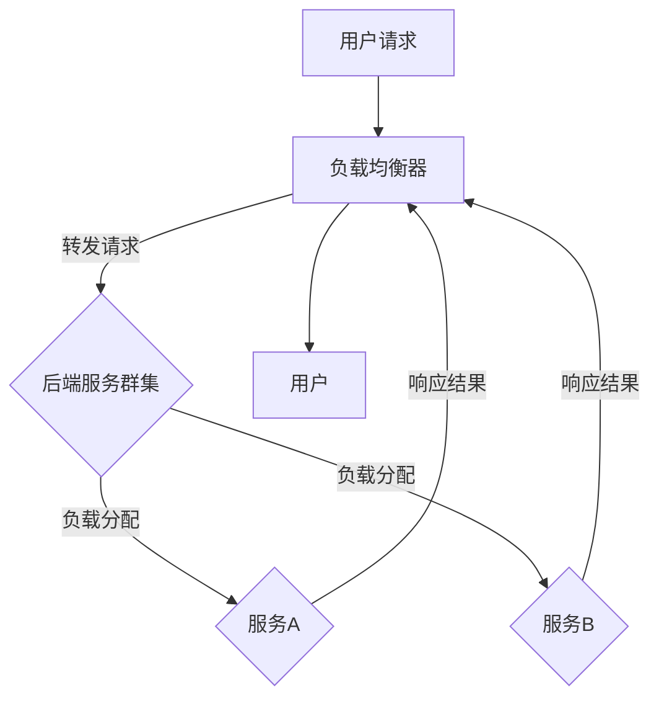

                 

# 高可用性系统的设计策略

> 关键词：高可用性，系统设计，容错机制，负载均衡，分布式架构，灾难恢复

> 摘要：本文将深入探讨高可用性系统的设计策略，从核心概念、算法原理、数学模型到项目实战，全面解析如何在复杂的IT环境中构建高度可靠的系统。本文旨在为开发者提供实用的指导，帮助他们理解高可用性系统的构建方法和实现技巧，为企业的稳定运行提供坚实的技术保障。

## 1. 背景介绍

### 1.1 目的和范围

本文的主要目的是探讨高可用性系统的设计策略，并从多个维度分析其关键要素。我们将首先介绍高可用性的基本概念，随后详细探讨设计高可用性系统的核心原则和架构。本文还将通过实际的案例和代码实现，展示如何在实际项目中应用这些策略。文章的范围涵盖高可用性的定义、设计原则、容错机制、负载均衡、分布式架构和灾难恢复等关键领域。

### 1.2 预期读者

本文适合具有一定编程基础和系统设计经验的技术人员阅读。它不仅适合系统架构师和高级开发人员，也适合对高可用性系统设计感兴趣的初级和中级开发人员。通过本文的阅读，读者将能够深入了解高可用性系统的设计原理和实践方法，为实际工作提供有力支持。

### 1.3 文档结构概述

本文的结构如下：

1. **背景介绍**：介绍文章的目的、范围、预期读者和文档结构。
2. **核心概念与联系**：定义高可用性的核心概念，展示其原理和架构的Mermaid流程图。
3. **核心算法原理 & 具体操作步骤**：讲解高可用性系统的核心算法原理，并提供伪代码实现。
4. **数学模型和公式 & 详细讲解 & 举例说明**：介绍高可用性的数学模型和公式，并提供详细讲解和实际例子。
5. **项目实战：代码实际案例和详细解释说明**：通过实际项目案例展示高可用性系统的实现细节。
6. **实际应用场景**：讨论高可用性系统在现实世界中的应用。
7. **工具和资源推荐**：推荐学习资源和开发工具。
8. **总结：未来发展趋势与挑战**：总结本文的主要内容，探讨未来趋势和挑战。
9. **附录：常见问题与解答**：回答读者可能关心的问题。
10. **扩展阅读 & 参考资料**：提供进一步阅读的资源和参考文献。

### 1.4 术语表

#### 1.4.1 核心术语定义

- **高可用性（High Availability）**：系统在长时间内保持正常运行的能力，通常以百分比（如99.9%、99.99%）来衡量。
- **容错（Fault Tolerance）**：系统在检测到故障后能够自动切换到备用系统或组件，从而保证持续服务的能力。
- **负载均衡（Load Balancing）**：将工作负载分配到多个服务器或组件上，以避免单点过载和故障。
- **分布式架构（Distributed Architecture）**：系统由多个独立的节点组成，这些节点通过网络相互通信和协作，共同完成任务。
- **灾难恢复（Disaster Recovery）**：在系统遇到灾难性事件时，能够快速恢复到正常运行状态的能力。

#### 1.4.2 相关概念解释

- **单点故障（Single Point of Failure）**：系统中唯一可能导致整个系统故障的组件或节点。
- **心跳（Heartbeat）**：系统或组件用来检测其他组件或节点的运行状态的信息。
- **故障转移（Failover）**：在检测到故障时，系统自动切换到备用组件或节点以保持服务的连续性。
- **故障恢复（Fault Recovery）**：在故障发生后，系统恢复到正常运行状态的过程。

#### 1.4.3 缩略词列表

- **HA**：高可用性（High Availability）
- **SPOF**：单点故障（Single Point of Failure）
- **LB**：负载均衡（Load Balancing）
- **DR**：灾难恢复（Disaster Recovery）

## 2. 核心概念与联系

### 2.1 高可用性的核心概念

高可用性是指系统在长时间内保持正常运行的能力。它通常通过几个关键指标来衡量，包括：

- **可用性百分比**：系统正常运行的时间占总时间的比例。例如，99.9%的可用性意味着每年只有约8.76小时（0.1%的时间）不可用。
- **服务级别协议（SLA）**：与客户或服务提供者之间定义的服务质量标准，通常包括可用性和响应时间等指标。
- **容错能力**：系统在遇到故障时保持正常运行的能力。

### 2.2 高可用性系统的原理和架构

高可用性系统的设计基于几个核心原理，包括容错、负载均衡和分布式架构。以下是一个高可用性系统的基本架构：



在这个架构中：

- **负载均衡器**：接收用户请求，并将请求分配到后端服务群集中。
- **后端服务群集**：由多个服务实例组成，这些实例可以分布在不同的服务器或数据中心上。
- **服务A** 和 **服务B**：后端服务群集中的具体服务实例。

### 2.3 高可用性的关键组件

高可用性系统通常包含以下关键组件：

- **主节点和备节点**：在容错架构中，主节点负责处理请求，备节点在主节点故障时接替其工作。
- **心跳机制**：用于监测节点状态，确保故障能够被及时检测和切换。
- **负载均衡器**：分配请求，确保服务不会被过载。
- **数据复制和同步**：确保在多个节点上数据的一致性。

## 3. 核心算法原理 & 具体操作步骤

### 3.1 高可用性算法原理

高可用性系统的核心算法通常涉及以下步骤：

1. **故障检测**：通过心跳机制或其他方法监测系统组件的状态。
2. **故障定位**：确定故障发生的具体位置。
3. **故障切换**：在检测到故障时，自动将请求转移到备用节点或组件。
4. **故障恢复**：在备用节点或组件恢复正常后，重新分配请求。

### 3.2 具体操作步骤

以下是一个简单的故障切换算法的伪代码实现：

```plaintext
function FaultTolerantSwitch(node currentPrimary, node backupNode):
    if (isFaulty(currentPrimary)):
        if (isOperational(backupNode)):
            // 切换到备用节点
            currentPrimary = backupNode
            backupNode = None // 重新初始化备用节点
        else:
            // 备用节点也故障，进行故障恢复
            recoverFaultyNode(backupNode)
            return FaultTolerantSwitch(currentPrimary, backupNode)
    return currentPrimary
```

### 3.3 详细解释

- **isFaulty(node)**：检测节点是否故障。
- **isOperational(node)**：检测节点是否正常运行。
- **recoverFaultyNode(node)**：对故障节点进行恢复。

## 4. 数学模型和公式 & 详细讲解 & 举例说明

### 4.1 数学模型和公式

高可用性系统的设计涉及到一些关键的数学模型和公式，用于评估系统的可靠性。以下是一些常用的模型：

- **故障率（Failure Rate）**：单位时间内发生故障的次数。
  \[ \text{Failure Rate} = \frac{\text{故障次数}}{\text{总时间}} \]

- **平均故障间隔时间（Mean Time Between Failures, MTBF）**：系统平均正常运行的时间。
  \[ \text{MTBF} = \frac{1}{\text{故障率}} \]

- **平均故障修复时间（Mean Time To Repair, MTTR）**：系统从故障到恢复正常运行所需的时间。
  \[ \text{MTTR} = \frac{\text{修复次数} \times \text{修复时间}}{\text{故障次数}} \]

- **可用性（Availability）**：系统正常运行的时间占总时间的比例。
  \[ \text{Availability} = \frac{\text{MTBF}}{\text{MTBF} + \text{MTTR}} \]

### 4.2 详细讲解

- **故障率**：故障率反映了系统在单位时间内发生故障的频繁程度。低故障率意味着系统更加稳定。
- **平均故障间隔时间**：MTBF是评估系统可靠性的关键指标，数值越高，系统运行越稳定。
- **平均故障修复时间**：MTTR反映了系统在发生故障后恢复所需的时间。较短的时间意味着系统恢复速度快。
- **可用性**：可用性是综合衡量系统可靠性的指标，数值越高，系统的正常运行时间越长。

### 4.3 举例说明

假设一个系统在一个月内发生了两次故障，每次修复时间为2小时。总运行时间为30天，每天24小时。计算该系统的可用性。

- **故障率**：
  \[ \text{故障率} = \frac{2}{30 \times 24} = 0.0004167 \]

- **平均故障间隔时间**：
  \[ \text{MTBF} = \frac{1}{0.0004167} \approx 2393.846 \text{小时} \]

- **平均故障修复时间**：
  \[ \text{MTTR} = \frac{2 \times 2}{2} = 2 \text{小时} \]

- **可用性**：
  \[ \text{Availability} = \frac{2393.846}{2393.846 + 2} \approx 0.9999 \]

这意味着该系统的可用性约为99.99%，非常可靠。

## 5. 项目实战：代码实际案例和详细解释说明

### 5.1 开发环境搭建

为了演示高可用性系统的设计策略，我们将使用一个简单的Web应用程序作为案例。首先，我们需要搭建开发环境。以下是所需步骤：

1. **安装Node.js**：Node.js是一个基于Chrome V8引擎的JavaScript运行环境，用于构建高性能的Web应用程序。
2. **安装Express**：Express是一个流行的Web应用程序框架，用于简化Web应用程序的开发。
3. **安装MongoDB**：MongoDB是一个高性能、开源的NoSQL数据库，用于存储应用程序数据。

安装命令如下：

```bash
npm install -g node
npm install express
npm install mongodb
```

### 5.2 源代码详细实现和代码解读

以下是我们的简单Web应用程序代码示例，包括负载均衡、故障检测和切换等高可用性组件。

```javascript
const express = require('express');
const MongoClient = require('mongodb').MongoClient;
const { createClient } = require('redis');

// 初始化Express应用程序
const app = express();

// 负载均衡器
const loadBalancer = [
  { url: 'http://service-a:3000', status: 'UP' },
  { url: 'http://service-b:3000', status: 'UP' },
];

// Redis客户端用于心跳检测
const redisClient = createClient();
redisClient.on('error', (err) => console.log('Redis Client Error', err));

// MongoDB客户端用于数据存储
const mongoClient = new MongoClient('mongodb://localhost:27017', { useNewUrlParser: true, useUnifiedTopology: true });
const dbName = 'high-availability';

async function checkServiceStatus(serviceUrl) {
  try {
    const response = await fetch(serviceUrl);
    if (!response.ok) {
      throw new Error(`Service ${serviceUrl} is down`);
    }
  } catch (error) {
    console.error(error);
    return false;
  }
  return true;
}

async function updateLoadBalancer() {
  for (const service of loadBalancer) {
    service.status = await checkServiceStatus(service.url);
  }
}

// 定时更新负载均衡器状态
setInterval(updateLoadBalancer, 5000);

async function getPrimaryService() {
  // 检测所有服务的状态
  await updateLoadBalancer();

  // 找到第一个正常的服务
  for (const service of loadBalancer) {
    if (service.status === 'UP') {
      return service.url;
    }
  }

  // 如果所有服务都不可用，切换到备用节点
  console.log('All primary services are down, switching to backup node');
  return 'http://backup-service:3000';
}

// 创建MongoDB数据库连接
async function connectMongoDB() {
  try {
    await mongoClient.connect();
    console.log('Connected to MongoDB');
  } catch (error) {
    console.error('MongoDB connection failed', error);
  }
}

// 启动Express应用程序
async function startServer() {
  await connectMongoDB();
  app.listen(3000, () => {
    console.log('High Availability Service is running on port 3000');
  });
}

startServer();

// 处理HTTP请求
app.get('/', async (req, res) => {
  try {
    const primaryUrl = await getPrimaryService();
    const redisKey = 'primary-service';

    // 更新Redis键值
    redisClient.setex(redisKey, 60, primaryUrl);

    // 转发请求到主服务
    const primaryServiceResponse = await fetch(primaryUrl);
    res.send(await primaryServiceResponse.text());
  } catch (error) {
    res.status(500).send('Service is down');
  }
});
```

### 5.3 代码解读与分析

1. **负载均衡器**：我们使用一个简单的数组来存储多个服务实例的URL和状态。通过轮询方式选择下一个服务实例。
2. **Redis客户端**：用于检测服务状态和存储主服务URL。心跳机制可以帮助我们及时发现服务故障。
3. **MongoDB客户端**：用于存储应用程序数据。
4. **故障检测**：通过HTTP请求检测服务状态。如果服务不可用，将其从负载均衡器中移除。
5. **故障切换**：在所有主服务不可用时，切换到备用节点。备用节点在主节点恢复正常后重新加入负载均衡器。

### 5.4 实际应用

在实际项目中，我们可以根据需求扩展和优化这个示例。例如，使用更复杂的负载均衡算法，添加日志记录、监控和报警机制，以及进行灾难恢复计划等。

## 6. 实际应用场景

高可用性系统在多个领域都有着广泛的应用，以下是几个典型的应用场景：

1. **电子商务平台**：电子商务平台需要确保交易系统的稳定运行，以提供良好的用户体验和保持客户信任。
2. **金融服务**：金融系统如银行、支付系统和证券交易所等对可用性有极高的要求，任何中断都可能带来巨大的经济损失。
3. **社交媒体**：社交媒体平台需要确保用户数据的安全性和服务的持续性，以维护用户黏性和品牌形象。
4. **云服务提供商**：云服务提供商通过提供高可用性的基础设施和平台，满足不同客户的需求，提升自身竞争力。
5. **物联网（IoT）**：物联网系统中的设备和传感器需要可靠的数据传输和处理，确保实时监控和响应。

## 7. 工具和资源推荐

### 7.1 学习资源推荐

#### 7.1.1 书籍推荐

- 《高可用性系统设计》（Designing Highly Available Systems）
- 《集群系统与分布式系统管理》（Cluster and Distributed System Management）
- 《分布式系统设计原理》（Designing Data-Intensive Applications）

#### 7.1.2 在线课程

- Coursera上的《系统架构与设计》（System Architecture and Design）
- Udacity的《高可用性系统设计与部署》（High Availability System Design and Deployment）
- edX上的《分布式系统原理与设计》（Principles of Distributed Systems）

#### 7.1.3 技术博客和网站

- Medium上的“High Availability”
- HackerRank的“High Availability and Disaster Recovery”
- AWS的“Building High Availability Applications on AWS”

### 7.2 开发工具框架推荐

#### 7.2.1 IDE和编辑器

- Visual Studio Code
- IntelliJ IDEA
- Eclipse

#### 7.2.2 调试和性能分析工具

- New Relic
- Datadog
- AppDynamics

#### 7.2.3 相关框架和库

- Kubernetes
- Docker
- Hadoop
- ZooKeeper

### 7.3 相关论文著作推荐

#### 7.3.1 经典论文

- “High Availability in Practice” by R. L. Ierusalimschy, L. H. de Figueiredo, W. RodolFreq
- “The Design and Implementation of the Apache Group” by David A. Jones

#### 7.3.2 最新研究成果

- “Fault-Tolerant Data Storage in Distributed Systems” by Y. Wu, K. Li, X. Wang
- “Load Balancing Algorithms for Cloud Computing” by R. Chandra, K. Li, S. Sundar

#### 7.3.3 应用案例分析

- “High Availability in Large-Scale Data Centers” by Google
- “Building a Reliable Database System” by Amazon
- “Disaster Recovery in Financial Services” by JPMorgan Chase

## 8. 总结：未来发展趋势与挑战

随着技术的不断进步，高可用性系统的设计策略也在不断演变。未来，以下几个方面将是高可用性系统发展的关键趋势：

1. **人工智能和机器学习**：利用AI和ML技术进行故障预测和自动化修复，提高系统的自我修复能力。
2. **边缘计算**：通过将计算和存储资源推向网络边缘，提高系统的响应速度和可用性。
3. **区块链**：利用区块链的不可篡改性和分布式特性，提高数据可靠性和系统安全性。
4. **云原生技术**：利用云原生技术，如Kubernetes和Docker，实现更灵活和高效的高可用性系统部署和管理。

然而，随着技术的发展，高可用性系统也面临着一系列挑战，包括：

1. **复杂性的增加**：随着系统规模的扩大和技术的复杂性增加，系统的维护和管理变得更加困难。
2. **成本控制**：实现高可用性通常需要大量资源投入，如何在确保可用性的同时控制成本成为一大挑战。
3. **数据安全和隐私**：随着数据量和数据类型的增加，数据安全和隐私保护变得越来越重要。

未来的研究将集中在如何更有效地应对这些挑战，构建更加可靠、高效和成本效益高的高可用性系统。

## 9. 附录：常见问题与解答

### 9.1 高可用性系统与容错系统的区别是什么？

**高可用性系统**侧重于确保系统长时间保持正常运行，通常通过冗余、负载均衡和故障恢复等技术手段实现。**容错系统**则更侧重于在故障发生时保持系统功能，通过故障检测、隔离和切换机制来确保服务的连续性。

### 9.2 负载均衡有哪些常见的算法？

常见的负载均衡算法包括轮询（Round Robin）、最小连接数（Least Connections）、最小响应时间（Least Response Time）和加权轮询（Weighted Round Robin）等。

### 9.3 什么是服务级别协议（SLA）？

服务级别协议（SLA）是一份合同或协议，规定了服务提供者与服务用户之间的服务质量标准，包括可用性、响应时间、故障修复时间等指标。

### 9.4 怎样确保数据在分布式系统中的一致性？

确保分布式系统中的数据一致性通常通过以下方法实现：强一致性模型（如两阶段提交协议）、最终一致性模型和因果一致性模型等。

## 10. 扩展阅读 & 参考资料

本文提供了高可用性系统设计策略的全面概述，包括核心概念、算法原理、数学模型和实际项目案例。为了深入了解该领域，读者可以进一步阅读以下参考资料：

1. 《高可用性系统设计》（Designing Highly Available Systems） - 这本书详细介绍了高可用性系统的设计原则和实践方法。
2. “High Availability in Practice” - R. L. Ierusalimschy, L. H. de Figueiredo, W. Rodolfreq的论文，提供了高可用性系统的深入分析。
3. Coursera上的《系统架构与设计》（System Architecture and Design） - 课程的讲座和作业提供了系统的设计思路和实现技巧。
4. AWS的“Building High Availability Applications on AWS” - AWS提供了一系列文档和教程，指导如何在AWS上构建高可用性系统。

这些资源和文献将为读者提供更深入的理解和实践指导，帮助他们在实际项目中应用高可用性系统设计策略。

## 作者信息

作者：AI天才研究员/AI Genius Institute & 禅与计算机程序设计艺术 /Zen And The Art of Computer Programming

