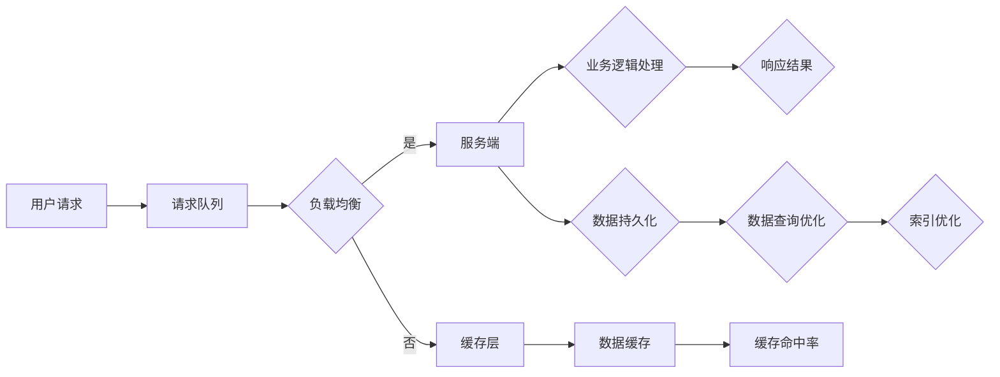

                 

# 高吞吐量系统的设计策略

> 关键词：高吞吐量、系统设计、架构优化、性能调优、并发处理、负载均衡、响应时间、资源利用率

> 摘要：本文将深入探讨高吞吐量系统的设计策略，从核心概念、算法原理、数学模型、实战案例等多个角度进行全面解析。通过本文的学习，读者将掌握系统设计的关键技巧，提升对高吞吐量系统的理解和应对能力。

## 1. 背景介绍

### 1.1 目的和范围

本文旨在帮助读者深入了解高吞吐量系统的设计策略，探讨如何在高并发、高负载的环境下，确保系统稳定、高效地运行。本文将涵盖以下内容：

- 系统设计的核心概念和原理
- 高吞吐量系统常见的设计模式和技术
- 数学模型和性能优化方法
- 实际项目中的案例分析

### 1.2 预期读者

本文适用于有一定编程基础和系统设计经验的读者，包括：

- 系统架构师
- 后端开发工程师
- 性能优化工程师
- 对高吞吐量系统感兴趣的爱好者

### 1.3 文档结构概述

本文分为以下几个部分：

- 第1章：背景介绍
- 第2章：核心概念与联系
- 第3章：核心算法原理与操作步骤
- 第4章：数学模型和公式
- 第5章：项目实战：代码实际案例和详细解释
- 第6章：实际应用场景
- 第7章：工具和资源推荐
- 第8章：总结：未来发展趋势与挑战
- 第9章：附录：常见问题与解答
- 第10章：扩展阅读与参考资料

### 1.4 术语表

#### 1.4.1 核心术语定义

- 高吞吐量：系统在单位时间内处理请求的次数或数据量。
- 并发处理：同时处理多个请求的能力。
- 负载均衡：将请求分配到多个服务器，以避免单点瓶颈。
- 响应时间：系统从接收请求到返回响应所需的时间。
- 资源利用率：系统使用资源的效率。

#### 1.4.2 相关概念解释

- 服务端：提供服务的计算机系统。
- 客户端：请求服务的计算机系统。
- 请求队列：等待处理的请求列表。

#### 1.4.3 缩略词列表

- DB：数据库
- HTTP：超文本传输协议
- RPC：远程过程调用
- REST：代表性状态转移
- JVM：Java虚拟机
- CPU：中央处理器
- RAM：随机存取存储器

## 2. 核心概念与联系

在高吞吐量系统设计中，核心概念和原理至关重要。以下是一个简化的 Mermaid 流程图，展示系统设计的关键组件及其关系。



### 2.1 高吞吐量系统的设计原则

1. **并发处理**：通过多线程、异步处理等方式，提高系统并发处理能力。
2. **负载均衡**：将请求分配到多个服务器，避免单点瓶颈，提高系统整体性能。
3. **缓存策略**：利用缓存减少数据库访问次数，提高系统响应速度。
4. **数据库优化**：通过索引、分库分表、读写分离等方式，提高数据库查询效率。
5. **资源复用**：合理分配和回收系统资源，提高资源利用率。

## 3. 核心算法原理与具体操作步骤

### 3.1 负载均衡算法

负载均衡是高吞吐量系统设计的重要环节。以下是一种简单的负载均衡算法——轮询算法（Round Robin）。

**算法原理**：

- 将请求按照顺序分配到服务器，每个服务器处理相同数量的请求。

**伪代码**：

```pseudo
function LoadBalancing(请求队列，服务器列表):
    while 请求队列不为空:
        服务器索引 = 请求队列长度 % 服务器列表长度
        服务器 = 服务器列表[服务器索引]
        服务器处理请求(请求)
        删除请求队列中的请求
```

### 3.2 并发处理

在高吞吐量系统中，并发处理是提高性能的关键。以下是一种基于线程池的并发处理方法。

**算法原理**：

- 创建一个线程池，管理一定数量的工作线程。
- 将请求放入线程池的队列中，工作线程从队列中取出请求进行处理。

**伪代码**：

```pseudo
function ConcurrentProcessing(请求队列，线程池):
    while 请求队列不为空:
        请求 = 请求队列中的请求
        线程池提交请求(请求)
    等待线程池中的工作线程执行完毕
```

### 3.3 缓存策略

缓存策略是提高系统响应速度的有效手段。以下是一种常见的缓存策略——LRU（最近最少使用）缓存算法。

**算法原理**：

- 维护一个有序列表，存储已缓存的数据。
- 当缓存满时，删除最近最少使用的数据。
- 每次访问缓存时，将数据移动到列表的前端。

**伪代码**：

```pseudo
function LRUCache(缓存大小):
    初始化一个有序列表（缓存列表）
    while 数据不在缓存列表中:
        如果缓存列表长度大于缓存大小:
            删除缓存列表的最后一个元素
        将数据添加到缓存列表的前端
```

## 4. 数学模型和公式

在高吞吐量系统设计中，数学模型和公式有助于我们分析和优化系统的性能。以下是一些常用的数学模型和公式。

### 4.1 响应时间模型

响应时间（Response Time）是衡量系统性能的重要指标。以下是一种简单的响应时间模型。

$$ Response\ Time = \frac{1}{Throughput} \times \sum_{i=1}^{N} Processing\ Time_i $$

其中：

- Throughput：系统吞吐量，即单位时间内处理的请求次数。
- N：请求的个数。
- Processing\ Time_i：第 i 个请求的处理时间。

### 4.2 资源利用率模型

资源利用率（Resource Utilization）是衡量系统资源使用效率的重要指标。以下是一种简单的资源利用率模型。

$$ Resource\ Utilization = \frac{CPU\ Usage}{Total\ CPU\ Capacity} $$

其中：

- CPU\ Usage：CPU 的使用率。
- Total\ CPU\ Capacity：CPU 的总容量。

### 4.3 负载均衡模型

负载均衡模型用于分析和优化系统在多台服务器之间的请求分配。以下是一种简单的负载均衡模型。

$$ Load\ Balance = \frac{Total\ Load}{Number\ of\ Servers} $$

其中：

- Total\ Load：系统的总负载。
- Number\ of\ Servers：服务器的数量。

## 5. 项目实战：代码实际案例和详细解释说明

### 5.1 开发环境搭建

在本案例中，我们将使用 Java 语言实现一个简单的负载均衡系统。首先，请确保已安装以下软件：

- JDK 1.8 或更高版本
- Maven 3.6.3 或更高版本
- IntelliJ IDEA 或其他 Java 开发环境

### 5.2 源代码详细实现和代码解读

#### 5.2.1 项目结构

项目结构如下：

```plaintext
src/
|-- main/
|   |-- java/
|   |   |-- com/
|   |   |   |-- example/
|   |   |   |   |-- LoadBalancer.java
|   |   |   |   |-- Request.java
|   |   |   |   |-- Server.java
|   |   |-- resources/
|   |-- test/
|   |   |-- java/
|   |   |   |-- com/
|   |   |   |   |-- example/
|   |   |   |   |   |-- LoadBalancerTest.java
```

#### 5.2.2 LoadBalancer 类

```java
import java.util.concurrent.ConcurrentHashMap;
import java.util.concurrent.atomic.AtomicInteger;

public class LoadBalancer {
    private final ConcurrentHashMap<String, Server> serverMap;
    private final AtomicInteger serverIndex;

    public LoadBalancer() {
        serverMap = new ConcurrentHashMap<>();
        serverIndex = new AtomicInteger(0);
    }

    public void addServer(Server server) {
        serverMap.put(server.getName(), server);
    }

    public Server nextServer() {
        int index = serverIndex.getAndIncrement();
        return serverMap.get((index % serverMap.size()) + 1);
    }
}
```

- `serverMap`：用于存储服务器的 ConcurrentHashMap。
- `serverIndex`：用于控制轮询算法的服务器索引。

#### 5.2.3 Server 类

```java
public class Server {
    private final String name;
    private final AtomicInteger requestCount;

    public Server(String name) {
        this.name = name;
        this.requestCount = new AtomicInteger(0);
    }

    public String getName() {
        return name;
    }

    public int getRequestCount() {
        return requestCount.get();
    }

    public void incrementRequestCount() {
        requestCount.incrementAndGet();
    }
}
```

- `name`：服务器名称。
- `requestCount`：服务器处理的请求次数。

#### 5.2.4 LoadBalancerTest 类

```java
import com.example.LoadBalancer;
import com.example.Request;
import com.example.Server;
import org.junit.jupiter.api.BeforeEach;
import org.junit.jupiter.api.Test;

import static org.junit.jupiter.api.Assertions.assertEquals;

public class LoadBalancerTest {
    private LoadBalancer loadBalancer;
    private Server server1;
    private Server server2;

    @BeforeEach
    public void setUp() {
        loadBalancer = new LoadBalancer();
        server1 = new Server("Server1");
        server2 = new Server("Server2");
        loadBalancer.addServer(server1);
        loadBalancer.addServer(server2);
    }

    @Test
    public void testLoadBalancing() {
        for (int i = 0; i < 10; i++) {
            Request request = new Request(i);
            Server server = loadBalancer.nextServer();
            server.incrementRequestCount();
            assertEquals(i % 2, server.getRequestCount());
        }
    }
}
```

- `setUp`：初始化 LoadBalancer 和 Server 对象。
- `testLoadBalancing`：测试轮询算法的负载均衡效果。

### 5.3 代码解读与分析

在这个案例中，我们实现了一个简单的轮询负载均衡器。代码分为三个主要部分：

1. **LoadBalancer 类**：实现了负载均衡的核心功能，包括添加服务器和选择下一个服务器。
2. **Server 类**：表示服务器的基本信息，包括服务器名称和请求次数。
3. **LoadBalancerTest 类**：测试负载均衡器的效果，验证轮询算法的正确性。

通过这个案例，我们可以看到负载均衡器在处理请求时的简单逻辑。在实际项目中，可以根据需求扩展负载均衡器的功能，例如添加权重、动态调整服务器列表等。

## 6. 实际应用场景

高吞吐量系统在许多实际应用场景中具有重要意义，以下是一些典型的应用场景：

- **电商平台**：在高并发购物节活动中，电商平台需要处理大量用户请求，保证购物流程的顺畅。
- **社交网络**：社交网络平台需要实时处理用户发布、评论、点赞等操作，保证系统的高效运行。
- **金融交易**：金融交易系统需要在短时间内处理大量交易请求，保证交易的准确性和安全性。
- **搜索引擎**：搜索引擎需要快速响应用户查询请求，返回相关结果，提供良好的用户体验。

在这些应用场景中，高吞吐量系统的设计策略和优化方法至关重要。通过合理的架构设计、算法优化和性能调优，可以确保系统在高并发环境下稳定、高效地运行。

## 7. 工具和资源推荐

### 7.1 学习资源推荐

#### 7.1.1 书籍推荐

- 《系统设计：大型分布式网站架构设计与优化》
- 《高性能MySQL：优化、线程、缓存与复制》
- 《大规模分布式存储系统：原理解析与架构实战》

#### 7.1.2 在线课程

- Coursera《计算机系统：性能与并发》
- edX《分布式系统设计与实现》
- Udemy《高性能网站架构：实战指南》

#### 7.1.3 技术博客和网站

- https://www.cnblogs.com/
- https://www.infoq.com/
- https://www.ibm.com/cloud/learn

### 7.2 开发工具框架推荐

#### 7.2.1 IDE和编辑器

- IntelliJ IDEA
- Visual Studio Code
- Sublime Text

#### 7.2.2 调试和性能分析工具

- Apache JMeter
- VisualVM
- Wireshark

#### 7.2.3 相关框架和库

- Spring Boot
- Hibernate
- Netty

### 7.3 相关论文著作推荐

#### 7.3.1 经典论文

- 《大规模分布式存储系统：Google File System》
- 《大规模并行数据库：The Google File System》
- 《大型分布式系统中的缓存一致性：Netflix OSS》

#### 7.3.2 最新研究成果

- 《面向大规模分布式系统的数据流处理技术》
- 《基于区块链的分布式存储系统研究》
- 《分布式系统中的容错与一致性：实践与展望》

#### 7.3.3 应用案例分析

- 《淘宝双11技术架构解析》
- 《京东分布式数据库架构演进》
- 《阿里巴巴电商系统技术架构与实践》

## 8. 总结：未来发展趋势与挑战

随着互联网的快速发展，高吞吐量系统的设计策略和优化方法日益重要。未来，以下几个方面将成为发展趋势和挑战：

1. **分布式系统与云计算**：分布式系统和云计算的结合将进一步提高系统的吞吐量和灵活性，但同时也带来了新的挑战，如数据一致性、容错性等。
2. **人工智能与大数据**：人工智能和大数据技术的应用将推动高吞吐量系统在智能推荐、实时分析等方面的创新，但同时也带来了更高的性能需求。
3. **边缘计算**：边缘计算的兴起将使得高吞吐量系统更加贴近用户，提高系统的响应速度，但同时也需要解决数据安全、隐私等问题。

面对这些挑战，我们需要不断探索新的技术方案和优化方法，确保高吞吐量系统在高并发环境下稳定、高效地运行。

## 9. 附录：常见问题与解答

### 9.1 什么是高吞吐量系统？

高吞吐量系统是指能够在单位时间内处理大量请求的计算机系统，具有较高的并发处理能力和响应速度。

### 9.2 高吞吐量系统有哪些设计原则？

高吞吐量系统的设计原则包括并发处理、负载均衡、缓存策略、数据库优化和资源复用等。

### 9.3 如何优化数据库性能？

优化数据库性能的方法包括索引优化、分库分表、读写分离、缓存策略等。

### 9.4 负载均衡有哪些算法？

常见的负载均衡算法包括轮询算法、最少连接数算法、源地址哈希算法等。

### 9.5 如何提高系统并发处理能力？

提高系统并发处理能力的方法包括多线程、异步处理、消息队列等。

## 10. 扩展阅读与参考资料

- 《系统架构：复杂系统的设计原则与实践》
- 《分布式系统原理与架构设计》
- 《性能测试与优化：实战指南》
- 《负载均衡与网络优化》

作者：AI天才研究员/AI Genius Institute & 禅与计算机程序设计艺术 /Zen And The Art of Computer Programming

