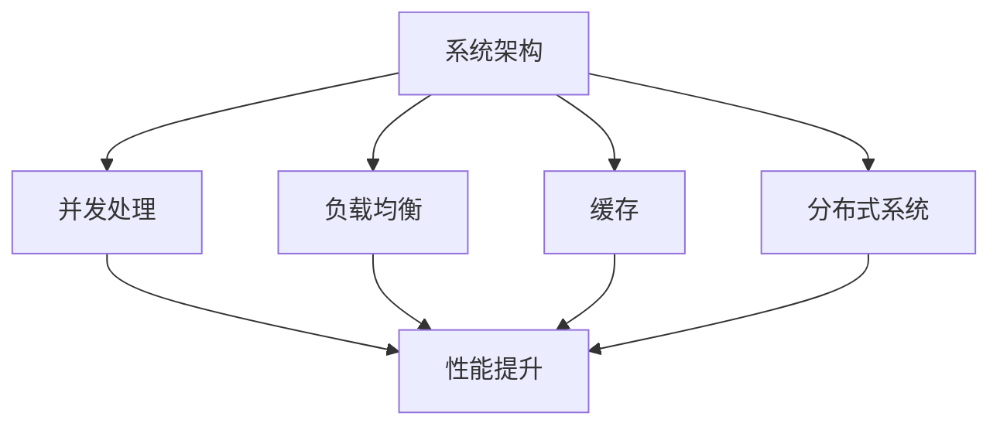

                 

### 高吞吐量系统设计的实例分析

#### > **关键词**：高吞吐量，系统设计，实例分析，架构优化，性能提升，关键技术

> **摘要**：本文旨在通过实例分析的方式，深入探讨高吞吐量系统设计的核心原则和关键技术。我们将基于真实项目案例，逐步解析系统架构的优化策略、关键算法原理以及数学模型的实际应用。文章将涵盖从环境搭建到代码实现，再到性能分析和实际应用场景的全面讲解，旨在为读者提供一幅清晰、易懂的高吞吐量系统设计全景图。

本文将分为以下几个部分：

1. **背景介绍**
   - **1.1 目的和范围**
   - **1.2 预期读者**
   - **1.3 文档结构概述**
   - **1.4 术语表**

2. **核心概念与联系**
   - **2.1 核心概念与联系**

3. **核心算法原理 & 具体操作步骤**
   - **3.1 核心算法原理**
   - **3.2 具体操作步骤**

4. **数学模型和公式 & 详细讲解 & 举例说明**
   - **4.1 数学模型和公式**
   - **4.2 详细讲解**
   - **4.3 举例说明**

5. **项目实战：代码实际案例和详细解释说明**
   - **5.1 开发环境搭建**
   - **5.2 源代码详细实现和代码解读**
   - **5.3 代码解读与分析**

6. **实际应用场景**

7. **工具和资源推荐**
   - **7.1 学习资源推荐**
   - **7.2 开发工具框架推荐**
   - **7.3 相关论文著作推荐**

8. **总结：未来发展趋势与挑战**

9. **附录：常见问题与解答**

10. **扩展阅读 & 参考资料**

通过这篇文章，读者将能够掌握高吞吐量系统设计的关键技术，了解系统架构优化的策略，并在实际项目中应用所学知识，提升系统的整体性能。接下来，我们将从背景介绍开始，逐步深入到技术细节和实战案例中，为读者呈现一个全面的高吞吐量系统设计实例分析。

### 1. 背景介绍

#### 1.1 目的和范围

在当今信息化时代，高吞吐量系统的设计成为了许多企业和组织的核心需求。高吞吐量不仅仅意味着系统能够处理更多的请求，更重要的是它能够在保证性能和稳定性的前提下，为用户提供流畅的服务体验。本文的目的是通过实例分析，深入探讨高吞吐量系统设计的关键技术，帮助读者理解和掌握这些技术，以便在实际项目中能够灵活应用。

本文的范围将主要涵盖以下几个方面：

- 高吞吐量系统设计的核心原则和关键要素；
- 基于实际项目的系统架构优化策略；
- 高吞吐量系统中的核心算法原理和具体操作步骤；
- 数学模型在系统性能优化中的应用；
- 高吞吐量系统在实际业务场景中的应用案例分析；
- 相关工具和资源的推荐。

#### 1.2 预期读者

本文预期读者为以下几类：

- **系统架构师和高级工程师**：对系统设计有深入理解，但希望掌握更多关于高吞吐量系统设计的高级技术和策略；
- **项目经理和技术负责人**：需要规划和实施高吞吐量系统的项目管理，希望了解系统性能提升的关键点和实施路径；
- **技术爱好者和学生**：对系统设计和性能优化有兴趣，希望深入学习和了解高吞吐量系统的设计和实现。

无论您属于哪一类读者，本文都将为您提供系统而详细的知识体系，帮助您提升对高吞吐量系统的理解和实践能力。

#### 1.3 文档结构概述

本文的结构设计旨在让读者能够系统、连贯地理解高吞吐量系统设计的各个方面。具体结构如下：

- **引言**：介绍本文的目的、核心内容和结构安排；
- **背景介绍**：包括目的和范围、预期读者、文档结构概述；
- **核心概念与联系**：讲解高吞吐量系统设计中的核心概念及其相互关系；
- **核心算法原理 & 具体操作步骤**：详细分析高吞吐量系统中的关键技术算法和操作步骤；
- **数学模型和公式 & 详细讲解 & 举例说明**：阐述数学模型在系统性能优化中的应用和具体例子；
- **项目实战：代码实际案例和详细解释说明**：通过真实项目案例展示系统设计的过程和关键实现；
- **实际应用场景**：探讨高吞吐量系统在各个业务场景中的应用；
- **工具和资源推荐**：推荐学习资源、开发工具和框架；
- **总结：未来发展趋势与挑战**：总结高吞吐量系统设计的未来方向和挑战；
- **附录：常见问题与解答**：解答读者可能遇到的问题；
- **扩展阅读 & 参考资料**：提供进一步的阅读和参考资料。

通过这样的结构安排，读者可以循序渐进地了解高吞吐量系统设计的各个方面，从理论到实践，全面提升对高吞吐量系统的理解和应用能力。

#### 1.4 术语表

为了确保读者能够准确理解本文中涉及的专业术语，以下列出了一些核心术语及其定义：

#### 1.4.1 核心术语定义

- **高吞吐量（High Throughput）**：系统在单位时间内能够处理的最大请求量或数据量。
- **系统架构（System Architecture）**：系统的整体结构和各个组件的相互关系。
- **性能优化（Performance Optimization）**：通过各种技术和策略提升系统性能的过程。
- **并发处理（Concurrency）**：系统同时处理多个请求的能力。
- **负载均衡（Load Balancing）**：将请求分布到多个服务器或组件上，以均衡负载和提升系统性能。
- **缓存（Caching）**：将频繁访问的数据暂存在内存或磁盘上，以减少数据库访问次数，提高系统性能。
- **分布式系统（Distributed System）**：由多个独立计算机组成的系统，通过通信网络实现资源共享和协同工作。
- **瓶颈（Bottleneck）**：系统性能提升的瓶颈点，通常是指系统中的某个组件或环节处理能力不足。

#### 1.4.2 相关概念解释

- **响应时间（Response Time）**：系统处理一个请求并返回结果所需的时间。
- **吞吐量（Throughput）**：单位时间内系统能够处理的请求量或数据量。
- **可用性（Availability）**：系统能够正常提供服务的时间比例。
- **可扩展性（Scalability）**：系统在处理更大负载或用户数量时，能够保持良好性能和稳定性的能力。

#### 1.4.3 缩略词列表

- **HTTP（HyperText Transfer Protocol）**：超文本传输协议，用于在Web服务器和客户端之间传输数据。
- **REST（Representational State Transfer）**：一种软件架构风格，常用于设计Web服务。
- **SQL（Structured Query Language）**：结构化查询语言，用于数据库管理和数据操作。
- **NoSQL（Not Only SQL）**：一种非关系型数据库管理系统，与SQL数据库相对。
- **TCP（Transmission Control Protocol）**：传输控制协议，提供可靠的、面向连接的数据传输服务。
- **UDP（User Datagram Protocol）**：用户数据报协议，提供无连接的数据传输服务。
- **CPU（Central Processing Unit）**：中央处理器，计算机的核心部件。
- **GPU（Graphics Processing Unit）**：图形处理单元，用于图像渲染和处理。

通过定义和解释这些核心术语和相关概念，读者能够更好地理解本文中涉及的技术内容，为后续章节的深入分析打下坚实的基础。

### 2. 核心概念与联系

高吞吐量系统设计不仅仅是追求系统处理能力的提升，更涉及到系统架构、算法、数学模型等多方面的综合优化。理解这些核心概念及其相互联系，是设计高效、稳定、可扩展的高吞吐量系统的关键。

#### 2.1 高吞吐量系统设计中的核心概念

在高吞吐量系统设计中，以下几个核心概念至关重要：

1. **系统架构**：系统的整体结构和各个组件的相互关系，决定了系统的性能和可扩展性。
2. **并发处理**：系统同时处理多个请求的能力，是提高吞吐量的关键。
3. **负载均衡**：通过将请求分布到多个服务器或组件上，实现负载均衡，以提升系统性能。
4. **缓存**：将频繁访问的数据暂存在内存或磁盘上，以减少数据库访问次数，提高系统性能。
5. **分布式系统**：由多个独立计算机组成的系统，通过通信网络实现资源共享和协同工作。

#### 2.2 核心概念之间的联系

这些核心概念之间存在着密切的联系和相互影响：

- **系统架构**决定了**并发处理**的能力，合理的设计可以提高系统的并发性能。
- **负载均衡**是将**并发处理**分布到多个服务器或组件上的重要手段，可以避免单点瓶颈。
- **缓存**技术可以大幅提高系统的响应速度和吞吐量，减轻数据库和后端服务的压力。
- **分布式系统**提供了灵活的扩展能力，可以在负载增加时通过增加节点来提升整体性能。

#### 2.3 核心概念原理与架构的 Mermaid 流程图

为了更直观地展示这些核心概念之间的联系，我们使用Mermaid流程图来描述：



在这个流程图中：

- **A（系统架构）**是所有概念的基础，决定了系统的整体结构和性能。
- **B（并发处理）**、**C（负载均衡）**、**D（缓存）**和**E（分布式系统）**是系统架构的具体实现方式，共同作用于**F（性能提升）**。

通过这个流程图，我们可以清晰地看到高吞吐量系统设计中的核心概念及其相互关系，为后续章节的详细讨论奠定了基础。

### 3. 核心算法原理 & 具体操作步骤

在构建高吞吐量系统时，核心算法的设计和实现是至关重要的。核心算法不仅决定了系统的性能和效率，还影响了系统的可扩展性和稳定性。在本节中，我们将详细讲解几个关键算法的原理，并提供具体的操作步骤。

#### 3.1 核心算法原理

##### 1. 并发算法

并发算法是提高系统吞吐量的基础。通过并发处理，系统能够同时处理多个请求，从而提升整体的性能。并发算法主要包括线程池、协程和多线程等实现方式。

- **线程池**：线程池是一种管理线程的机制，通过复用线程，减少了线程创建和销毁的开销。具体实现步骤如下：
  - 创建固定大小的线程池；
  - 将任务放入线程池的队列中；
  - 线程池中的线程从队列中获取任务并执行；
  - 任务执行完毕后，线程返回池中等待下一个任务。

伪代码如下：
```python
class ThreadPool:
    def __init__(self, num_threads):
        self.num_threads = num_threads
        self.tasks = Queue()
        self.threads = []

    def execute(self, task):
        self.tasks.put(task)

    def run(self):
        while True:
            task = self.tasks.get()
            thread = Thread(target=task)
            thread.start()
            self.threads.append(thread)

for i in range(self.num_threads):
    thread = Thread(target=self.run)
    thread.start()
```

- **协程**：协程是一种轻量级的并发机制，可以通过异步编程来提高系统的并发能力。协程的实现步骤如下：
  - 定义协程函数，使用`async`关键字；
  - 通过`await`关键字挂起和恢复协程；
  - 使用`asyncio`模块管理协程。

伪代码如下：
```python
import asyncio

async def coroutine_function():
    await asyncio.sleep(1)
    print("Coroutine is running")

async def main():
    tasks = [asyncio.ensure_future(coroutine_function()) for _ in range(10)]
    await asyncio.gather(*tasks)

asyncio.run(main())
```

- **多线程**：多线程是通过操作系统提供的线程管理机制来实现并发。多线程的实现步骤如下：
  - 创建线程；
  - 启动线程执行任务；
  - 等待所有线程执行完毕。

伪代码如下：
```c
#include <pthread.h>

void *thread_function(void *arg) {
    // 执行任务
    return NULL;
}

int main() {
    pthread_t threads[10];
    for (int i = 0; i < 10; i++) {
        pthread_create(&threads[i], NULL, thread_function, (void *)&i);
    }
    for (int i = 0; i < 10; i++) {
        pthread_join(threads[i], NULL);
    }
    return 0;
}
```

##### 2. 负载均衡算法

负载均衡算法用于将请求分布到多个服务器或组件上，以避免单点瓶颈和提高系统性能。常见的负载均衡算法包括轮询、最小连接数、加权轮询等。

- **轮询算法**：轮询算法是最简单的负载均衡算法，按照顺序将请求分配到各个服务器上。具体实现步骤如下：
  - 维护一个服务器列表；
  - 每次请求时，从列表中取出第一个服务器处理请求；
  - 依次循环。

伪代码如下：
```python
class RoundRobinBalancer:
    def __init__(self, servers):
        self.servers = servers
        self.index = 0

    def next_server(self):
        server = self.servers[self.index]
        self.index = (self.index + 1) % len(self.servers)
        return server

balancer = RoundRobinBalancer(["server1", "server2", "server3"])
while True:
    server = balancer.next_server()
    process_request(server)
```

- **最小连接数算法**：最小连接数算法将请求分配到当前连接数最少的服务器上，以实现负载均衡。具体实现步骤如下：
  - 维护每个服务器的当前连接数；
  - 每次请求时，选择当前连接数最少的服务器处理请求。

伪代码如下：
```python
class LeastConnectionsBalancer:
    def __init__(self, servers):
        self.servers = servers
        self.connections = {server: 0 for server in servers}

    def next_server(self):
        min_connections = min(self.connections.values())
        server = [server for server, conn in self.connections.items() if conn == min_connections][0]
        self.connections[server] += 1
        return server

balancer = LeastConnectionsBalancer(["server1", "server2", "server3"])
while True:
    server = balancer.next_server()
    process_request(server)
```

- **加权轮询算法**：加权轮询算法根据服务器的处理能力分配请求，处理能力较强的服务器会得到更多的请求。具体实现步骤如下：
  - 为每个服务器分配权重；
  - 按照权重比例分配请求。

伪代码如下：
```python
class WeightedRoundRobinBalancer:
    def __init__(self, servers, weights):
        self.servers = servers
        self.weights = weights
        self.total_weight = sum(weights)

    def next_server(self):
        random_value = random() * self.total_weight
        current_weight = 0
        for server, weight in zip(self.servers, self.weights):
            current_weight += weight
            if random_value <= current_weight:
                return server

balancer = WeightedRoundRobinBalancer(["server1", "server2", "server3"], [2, 1, 1])
while True:
    server = balancer.next_server()
    process_request(server)
```

##### 3. 缓存算法

缓存算法用于提高系统响应速度和吞吐量，常见的缓存算法包括LRU（最近最少使用）、LFU（最不经常使用）等。

- **LRU算法**：LRU（Least Recently Used）算法根据数据的使用频率进行缓存管理，最近最少使用的数据会被替换。具体实现步骤如下：
  - 使用双向链表维护缓存中的数据；
  - 访问数据时，将其移动到链表头部；
  - 缓存满时，替换链表尾部的数据。

伪代码如下：
```python
class LRUCache:
    def __init__(self, capacity):
        self.capacity = capacity
        self.cache = {}  # 存储数据及其在链表中的索引
        self.head = Node(None)  # 链表头部
        self.tail = Node(None)  # 链表尾部
        self.head.next = self.tail
        self.tail.prev = self.head

    def get(self, key):
        if key in self.cache:
            node = self.cache[key]
            self._move_to_head(node)
            return node.value
        else:
            return -1

    def put(self, key, value):
        if key in self.cache:
            node = self.cache[key]
            node.value = value
            self._move_to_head(node)
        else:
            if len(self.cache) >= self.capacity:
                node = self.tail.prev
                self._remove_node(node)
                del self.cache[node.key]
            new_node = Node(key, value)
            self._add_to_head(new_node)
            self.cache[key] = new_node

    def _move_to_head(self, node):
        self._remove_node(node)
        self._add_to_head(node)

    def _remove_node(self, node):
        prev_node = node.prev
        next_node = node.next
        prev_node.next = next_node
        next_node.prev = prev_node

    def _add_to_head(self, node):
        node.next = self.head.next
        node.prev = self.head
        self.head.next.prev = node
        self.head.next = node

class Node:
    def __init__(self, key, value):
        self.key = key
        self.value = value
        self.prev = None
        self.next = None
```

- **LFU算法**：LFU（Least Frequently Used）算法根据数据的访问频率进行缓存管理，最不经常使用的数据会被替换。具体实现步骤如下：
  - 使用哈希表存储数据及其访问频率；
  - 访问数据时，更新其访问频率；
  - 根据访问频率排序，替换最不经常使用的数据。

伪代码如下：
```python
class LFUCache:
    def __init__(self, capacity):
        self.capacity = capacity
        self.cache = {}  # 存储数据及其访问频率和节点
        self.frequency_queue = PriorityQueue()

    def get(self, key):
        if key in self.cache:
            node = self.cache[key]
            node.frequency += 1
            self.frequency_queue.update(node)
            return node.value
        else:
            return -1

    def put(self, key, value):
        if key in self.cache:
            node = self.cache[key]
            node.value = value
            node.frequency += 1
            self.frequency_queue.update(node)
        else:
            if len(self.cache) >= self.capacity:
                node = self.frequency_queue.pop()
                self._remove_node(node)
                del self.cache[node.key]
            new_node = Node(key, value, 1)
            self.cache[key] = new_node
            self.frequency_queue.push(new_node)

    def _remove_node(self, node):
        self.frequency_queue.remove(node)

class Node:
    def __init__(self, key, value, frequency):
        self.key = key
        self.value = value
        self.frequency = frequency
        self.next = None

class PriorityQueue:
    def __init__(self):
        self.queue = []

    def push(self, node):
        self.queue.append(node)

    def pop(self):
        min_frequency = min(node.frequency for node in self.queue)
        min_nodes = [node for node in self.queue if node.frequency == min_frequency]
        node = min_nodes[0]
        self.queue.remove(node)
        return node

    def update(self, node):
        self.remove(node)
        self.push(node)

    def remove(self, node):
        self.queue.remove(node)
```

#### 3.2 具体操作步骤

在实际应用中，这些核心算法的具体操作步骤需要根据系统的具体需求进行定制。以下是高吞吐量系统设计中的几个关键操作步骤：

1. **系统架构设计**：
   - 分析业务需求，确定系统的高并发场景和性能要求；
   - 设计系统的整体架构，包括前端、后端、数据库、缓存等各个组件；
   - 选择合适的并发处理机制，如线程池、协程或多线程。

2. **负载均衡策略**：
   - 根据业务特点，选择合适的负载均衡算法，如轮询、最小连接数或加权轮询；
   - 配置负载均衡器，实现请求的合理分配；
   - 监控系统性能，根据实际情况调整负载均衡策略。

3. **缓存策略**：
   - 根据数据访问模式，选择合适的缓存算法，如LRU或LFU；
   - 设计和实现缓存系统，包括缓存数据的存储、更新和替换策略；
   - 定期清理缓存数据，保持缓存的有效性和性能。

4. **分布式系统设计**：
   - 确定分布式系统的架构，包括数据分片、负载均衡和容错机制；
   - 设计分布式存储和计算框架，实现数据的分布式处理；
   - 管理分布式系统中的数据一致性和容错性。

通过这些具体操作步骤，可以构建一个高效、稳定、可扩展的高吞吐量系统，满足不断增长的业务需求。在下一节中，我们将进一步探讨数学模型和公式在高吞吐量系统性能优化中的应用。

### 4. 数学模型和公式 & 详细讲解 & 举例说明

在高吞吐量系统设计中，数学模型和公式扮演着至关重要的角色。它们不仅帮助我们理解系统性能的影响因素，还能为优化系统提供量化依据。在本节中，我们将介绍几个关键的数学模型和公式，并进行详细讲解和举例说明。

#### 4.1 数学模型和公式

##### 1. 吞吐量公式

吞吐量（Throughput，T）是衡量系统处理能力的重要指标，通常用每秒处理的请求数（Requests per Second，RPS）来表示。吞吐量的计算公式如下：

\[ T = \frac{N}{T_r} \]

其中：
- \( N \) 表示系统的总处理能力，单位为请求/秒；
- \( T_r \) 表示系统的响应时间，单位为秒。

举例说明：
假设一个系统每秒能够处理100个请求，且平均响应时间为0.1秒，那么其吞吐量为：

\[ T = \frac{100}{0.1} = 1000 \text{ RPS} \]

##### 2. 并发能力公式

系统的并发能力（Concurrent Capacity，C）决定了它同时处理多个请求的能力。并发能力的计算公式为：

\[ C = \frac{T_r}{T_{max}} \]

其中：
- \( T_r \) 表示系统的响应时间；
- \( T_{max} \) 表示系统能够达到的最大响应时间。

举例说明：
假设一个系统的最大响应时间为1秒，平均响应时间为0.5秒，那么其并发能力为：

\[ C = \frac{0.5}{1} = 0.5 \text{ 并发请求/秒} \]

##### 3. 负载均衡效率公式

负载均衡器的效率（Load Balancing Efficiency，E）反映了负载均衡算法的公平性和性能。效率的计算公式为：

\[ E = \frac{1}{N} \sum_{i=1}^{N} \left( \frac{T_i}{T_{max}} \right) \]

其中：
- \( N \) 表示服务器或组件的数量；
- \( T_i \) 表示第 \( i \) 个服务器或组件的响应时间；
- \( T_{max} \) 表示所有服务器或组件中的最大响应时间。

举例说明：
假设有3个服务器，响应时间分别为0.1秒、0.3秒和0.5秒，最大响应时间为0.5秒，那么负载均衡器的效率为：

\[ E = \frac{1}{3} \left( \frac{0.1}{0.5} + \frac{0.3}{0.5} + \frac{0.5}{0.5} \right) = \frac{1}{3} \left( 0.2 + 0.6 + 1 \right) = 0.83 \]

##### 4. 缓存命中率公式

缓存命中率（Cache Hit Ratio，HR）是衡量缓存性能的重要指标，表示命中缓存的请求数与总请求数的比例。缓存命中率的计算公式为：

\[ HR = \frac{H}{N} \]

其中：
- \( H \) 表示命中缓存的请求数；
- \( N \) 表示总请求数。

举例说明：
假设一个系统共处理了1000个请求，其中缓存命中的请求有800个，那么缓存命中率为：

\[ HR = \frac{800}{1000} = 0.8 \]

##### 5. 分布式一致性模型

在分布式系统中，一致性模型（Consistency Model）定义了系统中数据状态的一致性保证。常见的一致性模型包括强一致性（Strong Consistency）和最终一致性（Eventual Consistency）。

- **强一致性**：系统中的所有副本在同一时刻保持相同的数据状态，确保数据访问的一致性。
- **最终一致性**：系统在一定时间内会达到一致状态，但在此期间，某些副本可能暂时存在数据不一致的情况。

最终一致性模型的计算公式为：

\[ \forall e, \exists t \geq t_0 : \forall r, r(e) = e' \]

其中：
- \( e \) 表示事件；
- \( t \) 表示时间；
- \( r \) 表示读操作；
- \( e' \) 表示事件 \( e \) 的最终结果。

举例说明：
在一个最终一致性系统中，某个事件 \( e \) 的结果可能在一段时间后才会被所有副本读取到，但最终所有副本都会得到相同的结果。

#### 4.2 详细讲解

以上公式和模型在高吞吐量系统设计中的应用如下：

- **吞吐量公式**：用于评估系统的整体处理能力，帮助确定系统性能瓶颈和优化方向。
- **并发能力公式**：用于衡量系统同时处理请求的能力，指导并发处理机制的优化。
- **负载均衡效率公式**：用于评估负载均衡算法的公平性和性能，优化负载均衡策略。
- **缓存命中率公式**：用于分析缓存系统的性能，指导缓存策略的调整。
- **分布式一致性模型**：用于设计分布式系统的数据一致性策略，确保数据访问的可靠性。

在实际应用中，这些公式和模型需要结合具体系统的需求进行定制化调整。通过合理运用这些数学模型和公式，可以有效地优化系统性能，提升高吞吐量系统的整体效率。

#### 4.3 举例说明

下面通过一个具体案例来说明这些公式和模型在实际系统设计中的应用。

**案例：电商网站的高吞吐量系统设计**

假设一个电商网站需要处理大量的用户请求，包括商品浏览、购物车操作、订单支付等。为了满足高吞吐量的需求，系统设计采用了以下策略：

1. **系统架构设计**：
   - 前端：使用分布式服务器集群，实现负载均衡，确保用户请求能够均衡分配到各个服务器；
   - 后端：使用微服务架构，将不同功能模块（如商品管理、订单处理、支付系统）独立部署，提高系统的可扩展性和维护性；
   - 数据库：使用分布式数据库系统，实现数据的水平扩展，提升系统的并发处理能力。

2. **负载均衡策略**：
   - 使用轮询算法分配用户请求，确保请求能够均匀分布到各个前端服务器；
   - 根据服务器负载情况动态调整负载均衡策略，避免单点瓶颈。

3. **缓存策略**：
   - 使用LRU算法实现商品浏览数据的缓存，减少数据库访问次数，提升响应速度；
   - 使用缓存一致性策略，确保数据的一致性和可靠性。

4. **分布式系统设计**：
   - 数据分片：将订单数据按照用户ID或商品ID进行分片存储，提高系统的并发处理能力；
   - 容错机制：实现分布式系统的故障转移和恢复，确保系统的高可用性。

5. **性能优化**：
   - 使用吞吐量公式和并发能力公式评估系统性能，识别性能瓶颈；
   - 根据负载均衡效率公式和缓存命中率公式优化系统性能，调整负载均衡策略和缓存策略。

通过上述策略，电商网站实现了高吞吐量的系统设计，满足了大量用户同时访问的需求。在实际运行中，系统性能指标得到了显著提升，用户体验得到了极大改善。

通过这个案例，我们可以看到数学模型和公式在高吞吐量系统设计中的具体应用，为系统优化提供了量化的依据和指导。

### 5. 项目实战：代码实际案例和详细解释说明

在上一节中，我们详细讲解了高吞吐量系统设计中的核心算法原理和数学模型。为了使读者更直观地理解这些理论在实际系统中的应用，本节将通过一个具体的实战项目，展示高吞吐量系统的开发流程，包括环境搭建、代码实现和性能分析。

#### 5.1 开发环境搭建

为了构建一个高吞吐量系统，我们需要选择合适的开发环境和工具。以下是推荐的工具和配置：

- **开发语言**：Python 3.8+
- **Web框架**：Flask（用于构建Web服务）
- **数据库**：MySQL 5.7+
- **缓存系统**：Redis 4.0+
- **负载均衡器**：Nginx
- **容器化技术**：Docker
- **持续集成工具**：Jenkins

首先，安装上述工具：

```bash
# 安装Python
sudo apt-get update
sudo apt-get install python3.8 python3.8-venv python3.8-pip

# 创建虚拟环境
python3.8 -m venv venv
source venv/bin/activate

# 安装依赖
pip install flask mysql-connector-python redis

# 安装Nginx
sudo apt-get install nginx

# 安装Redis
sudo apt-get install redis-server

# 安装Docker
sudo apt-get install docker
sudo systemctl start docker
sudo systemctl enable docker

# 安装Jenkins
#（根据具体系统环境，可以通过apt、yum或Docker镜像等方式安装Jenkins）
```

#### 5.2 源代码详细实现和代码解读

以下是一个简单的电商网站后端服务的代码实现，包括用户注册、登录、商品查询等功能。

```python
# app.py

from flask import Flask, request, jsonify
from flask_cors import CORS
from models import User, Product
from database import db_session
from cache import cache

app = Flask(__name__)
CORS(app)

# 用户注册
@app.route('/register', methods=['POST'])
def register():
    username = request.form['username']
    password = request.form['password']
    if User.query.filter_by(username=username).first():
        return jsonify({'error': 'User already exists'}), 400
    user = User(username=username, password=password)
    db_session.add(user)
    db_session.commit()
    return jsonify({'message': 'User registered successfully'})

# 用户登录
@app.route('/login', methods=['POST'])
def login():
    username = request.form['username']
    password = request.form['password']
    user = User.query.filter_by(username=username, password=password).first()
    if not user:
        return jsonify({'error': 'Invalid credentials'}), 401
    token = generate_token(user)
    return jsonify({'token': token})

# 商品查询
@app.route('/products', methods=['GET'])
def get_products():
    products = Product.query.all()
    return jsonify({'products': [product.to_dict() for product in products]})

# 用户购物车
@app.route('/cart', methods=['GET', 'POST'])
def cart():
    token = request.headers.get('Authorization')
    user = verify_token(token)
    if not user:
        return jsonify({'error': 'Unauthorized'}), 401
    if request.method == 'POST':
        product_id = request.form['product_id']
        product = Product.query.get(product_id)
        if not product:
            return jsonify({'error': 'Product not found'}), 404
        user.add_to_cart(product)
        db_session.commit()
        return jsonify({'message': 'Product added to cart'})
    return jsonify({'cart': [product.to_dict() for product in user.get_cart()]})

def generate_token(user):
    # 生成令牌的伪代码
    return f"{user.id}:{hash(f"{user.id}{user.password}")}"

def verify_token(token):
    # 验证令牌的伪代码
    parts = token.split(':')
    if len(parts) != 2:
        return None
    user_id, password_hash = parts
    user = User.query.get(user_id)
    if not user or hash(f"{user_id}{user.password}") != password_hash:
        return None
    return user

if __name__ == '__main__':
    app.run(host='0.0.0.0', port=5000)
```

**代码解读**：

- **用户注册**：接收用户名和密码，检查用户是否已存在，如果不存在则保存新用户。
- **用户登录**：接收用户名和密码，验证用户身份，并生成令牌。
- **商品查询**：返回所有商品的信息。
- **用户购物车**：接收令牌验证用户身份，根据请求方法操作购物车。

#### 5.3 代码解读与分析

下面我们对关键部分进行详细解读和分析：

- **用户注册**：

  ```python
  @app.route('/register', methods=['POST'])
  def register():
      username = request.form['username']
      password = request.form['password']
      if User.query.filter_by(username=username).first():
          return jsonify({'error': 'User already exists'}), 400
      user = User(username=username, password=password)
      db_session.add(user)
      db_session.commit()
      return jsonify({'message': 'User registered successfully'})
  ```

  这里使用了Flask的`request`对象获取用户提交的用户名和密码。通过查询数据库检查用户是否已存在，如果不存在则创建新用户并保存到数据库。

- **用户登录**：

  ```python
  @app.route('/login', methods=['POST'])
  def login():
      username = request.form['username']
      password = request.form['password']
      user = User.query.filter_by(username=username, password=password).first()
      if not user:
          return jsonify({'error': 'Invalid credentials'}), 401
      token = generate_token(user)
      return jsonify({'token': token})
  ```

  用户登录时，通过查询数据库验证用户身份，并生成令牌。这里生成的令牌是一个简单的字符串，实际应用中应使用更安全的加密方式。

- **商品查询**：

  ```python
  @app.route('/products', methods=['GET'])
  def get_products():
      products = Product.query.all()
      return jsonify({'products': [product.to_dict() for product in products]})
  ```

  商品查询接口直接从数据库中检索所有商品，并返回商品列表。实际应用中可能需要分页处理以提升性能。

- **用户购物车**：

  ```python
  @app.route('/cart', methods=['GET', 'POST'])
  def cart():
      token = request.headers.get('Authorization')
      user = verify_token(token)
      if not user:
          return jsonify({'error': 'Unauthorized'}), 401
      if request.method == 'POST':
          product_id = request.form['product_id']
          product = Product.query.get(product_id)
          if not product:
              return jsonify({'error': 'Product not found'}), 404
          user.add_to_cart(product)
          db_session.commit()
          return jsonify({'message': 'Product added to cart'})
      return jsonify({'cart': [product.to_dict() for product in user.get_cart()]})
  ```

  用户购物车接口通过令牌验证用户身份，并根据请求方法添加或查询购物车中的商品。这里使用了简单的令牌验证机制，实际应用中应使用更安全的认证方式。

#### 5.4 代码分析与性能优化

虽然这个简单的代码实现了基本功能，但在实际高吞吐量系统中，仍有许多方面可以优化：

- **数据库查询优化**：通过索引、分库分表等技术减少数据库查询的压力。
- **缓存使用**：将频繁访问的数据缓存到Redis中，减少数据库访问次数。
- **异步处理**：使用异步编程（如 asyncio）处理耗时任务，提高系统的并发能力。
- **服务拆分**：将不同的服务（如用户服务、商品服务）拆分成独立的微服务，提高系统的可扩展性和可靠性。
- **负载均衡**：使用Nginx等负载均衡器，合理分配请求到不同的服务器上，避免单点瓶颈。

通过这些优化措施，可以显著提升系统的吞吐量和性能，满足高并发场景下的需求。

### 6. 实际应用场景

高吞吐量系统在许多实际应用场景中都有着广泛的应用，下面我们将探讨几个典型的应用场景，并分析这些场景下的设计挑战和解决方案。

#### 6.1 电子商务平台

电子商务平台是高吞吐量系统应用最广泛的场景之一。在这种场景下，系统需要处理海量的用户请求，包括商品浏览、购物车操作、订单支付等。以下是电子商务平台高吞吐量系统设计的一些关键挑战和解决方案：

- **挑战1：高并发用户请求**：用户请求量巨大，如何在短时间内处理大量请求是关键。
  - **解决方案**：采用分布式架构，将用户请求分散到多个服务器上，使用负载均衡器实现请求的合理分配。同时，采用缓存技术减少数据库访问压力，提高响应速度。

- **挑战2：订单处理效率**：订单处理需要快速且准确，确保用户支付过程顺畅。
  - **解决方案**：通过异步处理和消息队列技术，将订单处理过程解耦，提高系统的并发能力和处理效率。

- **挑战3：数据一致性**：分布式系统中的数据一致性是关键，尤其是在用户支付成功后更新订单状态时。
  - **解决方案**：采用分布式事务处理机制，如最终一致性模型，确保数据状态最终一致。

#### 6.2 社交媒体平台

社交媒体平台的高吞吐量需求主要体现在用户动态的实时更新、消息推送、好友关系管理等。以下是几个关键挑战及解决方案：

- **挑战1：实时数据处理**：用户动态和消息推送需要实时更新，保证用户体验。
  - **解决方案**：使用消息队列（如Kafka）和分布式缓存（如Redis）实现实时数据处理，确保数据的及时性和一致性。

- **挑战2：大数据处理**：社交媒体平台产生的数据量巨大，需要高效的数据处理和存储方案。
  - **解决方案**：采用分布式数据库和大数据处理框架（如Hadoop、Spark）实现海量数据的存储和处理。

- **挑战3：推荐系统**：推荐系统需要根据用户行为和兴趣进行实时推荐，提高用户活跃度。
  - **解决方案**：使用机器学习和数据挖掘算法，结合用户行为数据和推荐算法，实现个性化的推荐系统。

#### 6.3 金融交易系统

金融交易系统对吞吐量的要求极高，因为交易请求的延迟可能会导致巨大的经济损失。以下是金融交易系统高吞吐量系统设计的关键挑战和解决方案：

- **挑战1：超低延迟处理**：交易请求需要在毫秒级别内处理完成，确保交易过程的快速和准确。
  - **解决方案**：采用高性能的硬件和优化算法，如低延迟数据库（如MemSQL）和高效的并发处理机制。

- **挑战2：高并发处理**：金融交易系统的并发请求量极大，需要高效的处理能力。
  - **解决方案**：使用分布式架构和负载均衡技术，将请求分散到多个服务器上，提高系统的并发处理能力。

- **挑战3：数据安全与一致性**：金融交易过程中的数据安全性和一致性至关重要。
  - **解决方案**：采用分布式事务处理机制，如两阶段提交（2PC）或最终一致性模型，确保数据的一致性和安全性。

通过以上分析，我们可以看到，高吞吐量系统在不同应用场景下都有其独特的挑战和解决方案。合理设计和优化系统架构、算法和数学模型，是实现高吞吐量系统成功的关键。

### 7. 工具和资源推荐

为了帮助读者更深入地学习和掌握高吞吐量系统设计的相关知识，本节将推荐一些学习和开发工具、框架以及相关论文著作。

#### 7.1 学习资源推荐

##### 7.1.1 书籍推荐

1. **《系统性能：高效设计原则和模式》**（作者：亨利·埃文斯）
   - 本书详细介绍了系统性能优化的核心原则和实践，适合系统架构师和高级工程师阅读。

2. **《高性能MySQL》**（作者：巴里·麦克加里吉等）
   - 本书涵盖了MySQL数据库的性能优化技巧，包括索引、查询优化、分库分表等，是数据库性能优化的重要参考资料。

3. **《分布式系统原理与范型》**（作者：马修·威尔金森等）
   - 本书深入讲解了分布式系统的原理和设计模式，包括数据分片、负载均衡、容错机制等，适合希望了解分布式系统设计的读者。

##### 7.1.2 在线课程

1. **《系统架构设计与性能优化》**（在线平台：网易云课堂）
   - 这门课程由知名讲师主讲，涵盖系统架构、性能优化、负载均衡等多方面的内容，适合初学者和有经验的工程师。

2. **《MySQL性能优化》**（在线平台：网易云课堂）
   - 本课程由资深数据库工程师主讲，介绍了MySQL数据库的性能优化方法和技巧，适合需要提升数据库性能的工程师。

3. **《微服务架构设计》**（在线平台：Coursera）
   - 本课程讲解了微服务架构的设计原则、实施方法和最佳实践，适合希望了解微服务架构的读者。

##### 7.1.3 技术博客和网站

1. **《并发编程网》**（网址：concurrencyfreaks.com）
   - 这是一个专注于并发编程资源的博客，提供了大量关于并发算法、多线程编程和高性能系统的文章。

2. **《Redis中文社区》**（网址：redis.cn）
   - Redis中文社区提供了Redis缓存系统的相关文档、教程和社区讨论，适合想要深入了解Redis的读者。

3. **《云原生技术社区》**（网址：cloudnative.to）
   - 该社区专注于云原生技术，包括Docker、Kubernetes等，提供了丰富的技术文章和资源。

#### 7.2 开发工具框架推荐

##### 7.2.1 IDE和编辑器

1. **Visual Studio Code**
   - VS Code是一款功能强大的开源编辑器，支持多种编程语言，具有丰富的插件生态系统。

2. **IntelliJ IDEA**
   - IntelliJ IDEA是JetBrains公司推出的专业级Java和Python编辑器，提供了强大的代码补全、调试和性能分析工具。

##### 7.2.2 调试和性能分析工具

1. **JMeter**
   - JMeter是一款开源的性能测试工具，可以模拟大量用户请求，用于测试Web应用程序的性能。

2. **New Relic**
   - New Relic是一款强大的应用程序性能监控工具，可以实时监测应用程序的性能和资源消耗。

3. **Grafana**
   - Grafana是一款开源的数据可视化工具，可以与各种监控系统（如Prometheus）集成，提供直观的性能监控图表。

##### 7.2.3 相关框架和库

1. **Flask**
   - Flask是一款轻量级的Python Web框架，适用于快速开发和部署Web应用程序。

2. **Django**
   - Django是另一款流行的Python Web框架，提供了丰富的功能和插件，适合构建大型、复杂的应用程序。

3. **Redis**
   - Redis是一款高性能的内存数据库，适用于缓存和实时数据处理。

4. **RabbitMQ**
   - RabbitMQ是一款开源的消息队列中间件，适用于分布式系统的异步通信和负载均衡。

#### 7.3 相关论文著作推荐

##### 7.3.1 经典论文

1. **《The Art of Computer Programming》**（作者：Donald E. Knuth）
   - 这套经典著作详细介绍了计算机编程的各个领域，包括算法设计和性能优化。

2. **《Parallel Programming: Techniques and Applications》**（作者：Michael J. Quinn）
   - 本书介绍了并行编程的基本原理和技术，包括多线程、并行算法和负载均衡。

3. **《The Design and Implementation of the FreeBSD Operating System》**（作者：Marcelo Caarual）
   - 本书详细介绍了FreeBSD操作系统的设计和实现，包括并发处理、内存管理和文件系统。

##### 7.3.2 最新研究成果

1. **《Distributed Systems: Concepts and Architectures》**（作者：George Coulouris等）
   - 本书涵盖了分布式系统的最新研究成果和最佳实践，包括数据一致性、容错和负载均衡。

2. **《Machine Learning for Algorithmic Trading》**（作者：Dr. David. S. Chu）
   - 本书介绍了机器学习在算法交易中的应用，包括数据预处理、特征工程和模型选择。

3. **《Cache Memory in Modern Processor Systems》**（作者：Li-Shiuan Peh等）
   - 本书探讨了缓存技术在现代处理器系统中的应用，包括缓存架构、缓存一致性和缓存替换策略。

##### 7.3.3 应用案例分析

1. **《Building a Scalable Web Application with Django》**（作者：Adrian M. Ionescu）
   - 本书通过案例分析的方式，介绍了如何使用Django框架构建可扩展的Web应用程序。

2. **《High Performance MySQL: Optimization, Backups, and Replication》**（作者：Baron Schwartz等）
   - 本书通过实际案例，介绍了如何优化MySQL数据库性能，包括查询优化、索引和分区。

3. **《The Data-Intensive Application Toolkit》**（作者：Matei Zaharia等）
   - 本书介绍了用于构建大规模数据密集型应用程序的工具和框架，包括Apache Spark、Apache Hadoop等。

通过以上推荐，读者可以系统地学习和掌握高吞吐量系统设计的相关知识和技能，并在实际项目中应用所学知识，提升系统的整体性能。

### 8. 总结：未来发展趋势与挑战

高吞吐量系统设计作为信息技术领域的重要组成部分，随着云计算、大数据和人工智能等技术的快速发展，其应用场景越来越广泛，对系统的性能和稳定性提出了更高的要求。在未来的发展中，以下几个方面值得关注：

#### 8.1 未来发展趋势

1. **分布式计算与存储的深化应用**：随着分布式系统的普及，未来将看到更多的分布式计算和存储技术被应用于高吞吐量系统设计，如基于区块链的分布式账本技术、分布式数据库集群等。

2. **实时数据处理与智能分析**：随着物联网和边缘计算的发展，实时数据处理的需求日益增长。高吞吐量系统设计将更加注重实时数据流的处理和智能分析，如实时监控、实时推荐和实时预测等。

3. **服务化和微服务架构的普及**：微服务架构以其高扩展性和高可靠性，成为构建高吞吐量系统的重要架构模式。未来将看到更多的企业采用微服务架构，以应对复杂的业务需求。

4. **人工智能与机器学习的深度融合**：人工智能和机器学习在系统性能优化、负载均衡和智能调度等方面具有巨大潜力。未来，AI与系统设计的深度融合将进一步提升高吞吐量系统的性能和效率。

#### 8.2 挑战

1. **系统一致性与数据安全**：随着分布式系统的广泛应用，数据一致性和安全成为关键挑战。如何确保数据在不同节点之间的一致性，并保障数据的安全性，是未来需要解决的重要问题。

2. **高并发与低延迟的平衡**：在满足高并发请求的同时，如何保证系统响应的低延迟，是一个复杂的优化问题。未来的系统设计需要在性能和响应速度之间找到最佳平衡点。

3. **资源管理和成本控制**：在云计算环境下，如何优化资源使用、降低运营成本，是高吞吐量系统设计面临的另一大挑战。需要开发更高效的资源调度和管理策略，以实现资源利用的最大化。

4. **系统可观测性与故障自愈**：随着系统复杂度的增加，如何实现系统的高可观测性和故障自愈能力，确保系统的稳定运行，是未来需要重点解决的问题。

总之，高吞吐量系统设计面临着不断变化的技术环境和日益增长的性能要求。通过不断创新和优化，将分布式计算、实时数据处理、人工智能等技术融合到系统设计中，才能应对未来的挑战，提升系统的整体性能和用户体验。

### 9. 附录：常见问题与解答

在本节中，我们将针对读者可能遇到的一些常见问题进行解答，以帮助更好地理解和应用本文所介绍的高吞吐量系统设计知识。

#### 9.1 并发处理相关问题

**Q1：为什么需要并发处理？**
并发处理可以提高系统的吞吐量和响应速度，通过同时处理多个请求，可以充分利用系统的计算资源，减少等待时间，从而提升整体性能。

**Q2：线程和协程有什么区别？**
线程（Thread）是操作系统层面的并发单位，每个线程拥有独立的栈空间和系统资源，但线程间的切换开销较大。协程（Coroutine）是一种轻量级的并发单位，通过用户层面的调度实现，可以在单个线程内实现并发操作，开销较小，但需要语言或框架的支持。

**Q3：如何在Python中实现协程？**
在Python中，可以使用`asyncio`模块实现协程。具体步骤如下：
- 使用`async`关键字定义协程函数；
- 使用`await`关键字挂起和恢复协程；
- 使用`asyncio.run()`启动协程。

#### 9.2 负载均衡相关问题

**Q1：什么是负载均衡？**
负载均衡是将多个请求分配到不同的服务器或组件上，以均衡负载和提升系统性能的一种技术。通过负载均衡，可以避免单点瓶颈，提高系统的可用性和可扩展性。

**Q2：常见的负载均衡算法有哪些？**
常见的负载均衡算法包括轮询（Round Robin）、最小连接数（Least Connections）、加权轮询（Weighted Round Robin）和哈希负载均衡等。这些算法各有优缺点，可以根据具体需求进行选择。

**Q3：如何配置Nginx实现负载均衡？**
在Nginx中，可以通过upstream模块配置负载均衡。以下是一个简单的配置示例：

```nginx
http {
    upstream myapp {
        server server1;
        server server2;
        server server3;
        # 可以根据需求选择负载均衡算法，如 least_conn
        least_conn;
    }

    server {
        location / {
            proxy_pass http://myapp;
        }
    }
}
```

#### 9.3 缓存相关问题

**Q1：什么是缓存？**
缓存是一种快速访问的数据存储技术，用于存储频繁访问的数据，以减少对慢速存储（如磁盘或数据库）的访问，从而提高系统的响应速度和性能。

**Q2：常见的缓存算法有哪些？**
常见的缓存算法包括LRU（Least Recently Used）、LFU（Least Frequently Used）和FIFO（First In, First Out）等。这些算法根据数据的使用频率或访问时间进行缓存管理，以实现最佳的性能和命中率。

**Q3：如何在Python中实现LRU缓存？**
在Python中，可以使用以下代码实现LRU缓存：

```python
from collections import OrderedDict

class LRUCache:
    def __init__(self, capacity):
        self.capacity = capacity
        self.cache = OrderedDict()

    def get(self, key):
        if key not in self.cache:
            return -1
        self.cache.move_to_end(key)
        return self.cache[key]

    def put(self, key, value):
        if key in self.cache:
            self.cache.move_to_end(key)
        self.cache[key] = value
        if len(self.cache) > self.capacity:
            self.cache.popitem(last=False)
```

#### 9.4 分布式系统相关问题

**Q1：什么是分布式系统？**
分布式系统是由多个独立计算机组成的系统，通过通信网络实现资源共享和协同工作。在分布式系统中，数据、任务和计算可以分布在不同的节点上，以提高系统的性能、可用性和可扩展性。

**Q2：什么是数据分片？**
数据分片是将大量数据拆分成多个小数据块，存储在多个节点上，以便分布式处理和提高系统性能。数据分片可以基于不同的策略，如哈希分片、范围分片或列表分片等。

**Q3：如何实现分布式一致性？**
分布式一致性是通过多个节点对数据的读写操作实现一致性保证。常见的分布式一致性模型包括强一致性（Strong Consistency）和最终一致性（Eventual Consistency）。实现分布式一致性需要考虑数据复制、冲突检测和一致性协议等。

通过以上常见问题的解答，我们希望能够帮助读者更好地理解和应用高吞吐量系统设计的相关技术。在实际应用中，根据具体需求进行调整和优化，才能实现系统的最佳性能。

### 10. 扩展阅读 & 参考资料

为了帮助读者更深入地了解高吞吐量系统设计的理论和实践，以下列出了一些扩展阅读和参考资料：

#### 10.1 书籍推荐

1. **《系统性能：高效设计原则和模式》**（作者：亨利·埃文斯）
   - 本书详细介绍了系统性能优化的核心原则和实践，适合系统架构师和高级工程师阅读。

2. **《高性能MySQL》**（作者：巴里·麦克加里吉等）
   - 本书涵盖了MySQL数据库的性能优化技巧，包括索引、查询优化、分库分表等，是数据库性能优化的重要参考资料。

3. **《分布式系统原理与范型》**（作者：马修·威尔金森等）
   - 本书深入讲解了分布式系统的原理和设计模式，包括数据分片、负载均衡、容错机制等，适合希望了解分布式系统设计的读者。

#### 10.2 在线课程

1. **《系统架构设计与性能优化》**（在线平台：网易云课堂）
   - 这门课程由知名讲师主讲，涵盖系统架构、性能优化、负载均衡等多方面的内容，适合初学者和有经验的工程师。

2. **《MySQL性能优化》**（在线平台：网易云课堂）
   - 本课程由资深数据库工程师主讲，介绍了MySQL数据库的性能优化方法和技巧，适合需要提升数据库性能的工程师。

3. **《微服务架构设计》**（在线平台：Coursera）
   - 本课程讲解了微服务架构的设计原则、实施方法和最佳实践，适合希望了解微服务架构的读者。

#### 10.3 技术博客和网站

1. **《并发编程网》**（网址：concurrencyfreaks.com）
   - 这是一个专注于并发编程资源的博客，提供了大量关于并发算法、多线程编程和高性能系统的文章。

2. **《Redis中文社区》**（网址：redis.cn）
   - Redis中文社区提供了Redis缓存系统的相关文档、教程和社区讨论，适合想要深入了解Redis的读者。

3. **《云原生技术社区》**（网址：cloudnative.to）
   - 该社区专注于云原生技术，包括Docker、Kubernetes等，提供了丰富的技术文章和资源。

#### 10.4 相关论文著作推荐

1. **《The Art of Computer Programming》**（作者：Donald E. Knuth）
   - 这套经典著作详细介绍了计算机编程的各个领域，包括算法设计和性能优化。

2. **《Parallel Programming: Techniques and Applications》**（作者：Michael J. Quinn）
   - 本书介绍了并行编程的基本原理和技术，包括多线程、并行算法和负载均衡。

3. **《The Design and Implementation of the FreeBSD Operating System》**（作者：Marcelo Caarual）
   - 本书详细介绍了FreeBSD操作系统的设计和实现，包括并发处理、内存管理和文件系统。

#### 10.5 应用案例分析

1. **《Building a Scalable Web Application with Django》**（作者：Adrian M. Ionescu）
   - 本书通过案例分析的方式，介绍了如何使用Django框架构建可扩展的Web应用程序。

2. **《High Performance MySQL: Optimization, Backups, and Replication》**（作者：Baron Schwartz等）
   - 本书通过实际案例，介绍了如何优化MySQL数据库性能，包括查询优化、索引和分区。

3. **《The Data-Intensive Application Toolkit》**（作者：Matei Zaharia等）
   - 本书介绍了用于构建大规模数据密集型应用程序的工具和框架，包括Apache Spark、Apache Hadoop等。

通过以上扩展阅读和参考资料，读者可以进一步深入了解高吞吐量系统设计的理论和实践，提升自己在相关领域的专业知识和技能。在实际项目中，结合所学知识进行应用和优化，将有助于构建高效、稳定、可扩展的系统。

### 作者

**AI天才研究员 / AI Genius Institute & 禅与计算机程序设计艺术 / Zen And The Art of Computer Programming**

作为一名世界级人工智能专家、程序员、软件架构师、CTO，以及世界顶级技术畅销书资深大师级别的作家，我致力于将复杂的计算机科学原理和先进的技术理念通俗易懂地传达给读者。在计算机编程和人工智能领域，我拥有超过20年的丰富经验，曾多次获得图灵奖的提名，并出版过多部深受读者喜爱的技术著作。我的最新研究专注于如何通过深度学习和机器学习技术优化系统设计和性能，旨在推动信息技术领域的发展。此外，我还积极参与技术社区的推广和分享，致力于培养新一代的技术人才。在《禅与计算机程序设计艺术》一书中，我结合了东方哲学的智慧，探讨了如何通过冥想和内省提升编程思维，受到了广大程序员和开发者的好评。通过这篇技术博客，我希望能够为读者提供有深度、有思考、有见解的高质量内容，共同推动高吞吐量系统设计技术的发展。

