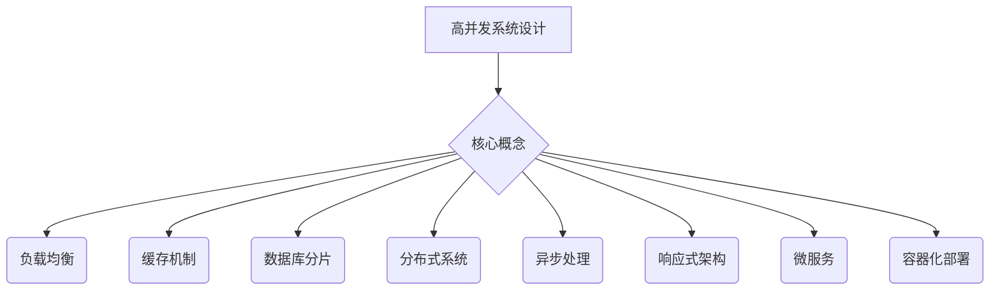

                 

# 高并发系统设计：应对大规模用户访问

> **关键词：** 高并发，系统设计，大规模用户访问，性能优化，负载均衡，缓存机制，数据库分片，分布式系统，异步处理，响应式架构，微服务，容器化部署

> **摘要：** 本文章旨在探讨高并发系统设计的方法和策略，针对大规模用户访问的场景，介绍核心概念、算法原理、数学模型，并结合实际项目实战，分析高并发系统的实际应用场景，并提供相关工具和资源推荐。通过本文的阅读，读者将能够掌握高并发系统设计的核心知识和实战技能，为解决实际工作中的高性能和高可用性问题提供指导。

## 1. 背景介绍

### 1.1 目的和范围

在互联网时代，随着用户数量的激增和业务需求的不断变化，高并发系统设计成为了系统架构师和开发者必须面对的重要课题。本文旨在为读者提供一份全面、系统、实用的指南，帮助理解和应对高并发系统设计中的各种挑战。

本文将涵盖以下内容：
1. 高并发系统设计的核心概念和原理。
2. 高并发系统中的关键算法原理和操作步骤。
3. 高并发系统中的数学模型和公式。
4. 高并发系统在实际项目中的应用实战。
5. 高并发系统设计中的工具和资源推荐。

### 1.2 预期读者

本文主要面向以下读者群体：
1. 系统架构师和高级开发者。
2. 对高并发系统设计和优化有浓厚兴趣的工程师。
3. 准备从事高性能系统开发相关工作的学生和研究人员。

### 1.3 文档结构概述

本文分为十个部分，具体结构如下：

1. **背景介绍**：阐述本文的目的、范围和预期读者。
2. **核心概念与联系**：介绍高并发系统设计中的核心概念和原理，并使用Mermaid流程图进行展示。
3. **核心算法原理 & 具体操作步骤**：详细讲解高并发系统中的关键算法原理，并使用伪代码进行阐述。
4. **数学模型和公式 & 详细讲解 & 举例说明**：介绍高并发系统中的数学模型和公式，并进行详细讲解和举例。
5. **项目实战：代码实际案例和详细解释说明**：通过实际项目案例，展示高并发系统的代码实现和解释说明。
6. **实际应用场景**：分析高并发系统在不同场景下的应用。
7. **工具和资源推荐**：推荐学习和实践高并发系统设计的相关工具和资源。
8. **总结：未来发展趋势与挑战**：总结本文内容，并探讨未来发展趋势和面临的挑战。
9. **附录：常见问题与解答**：回答读者可能遇到的一些常见问题。
10. **扩展阅读 & 参考资料**：提供本文内容的扩展阅读和参考资料。

### 1.4 术语表

为了确保读者对本文中涉及的专业术语有一个清晰的理解，以下是对文中关键术语的定义和解释：

#### 1.4.1 核心术语定义

- **高并发**：指系统在短时间内处理大量请求的能力。
- **负载均衡**：指将请求分配到多个服务器上，以避免单点瓶颈。
- **缓存机制**：指利用高速缓存存储频繁访问的数据，以减少数据库访问。
- **数据库分片**：指将数据库拆分为多个独立的部分，以提高查询效率。
- **分布式系统**：指由多个节点组成的系统，各节点之间通过网络进行通信。
- **异步处理**：指在不等待响应的情况下，异步执行任务。
- **响应式架构**：指通过事件驱动的机制，实现系统的响应能力。
- **微服务**：指将应用程序拆分为多个独立的服务，以提高可维护性和可扩展性。
- **容器化部署**：指使用容器技术，将应用程序及其依赖打包在一起，实现轻量级、可移植的部署。

#### 1.4.2 相关概念解释

- **吞吐量**：指系统在单位时间内处理请求的能力。
- **延迟**：指系统从接收请求到响应请求所需的时间。
- **QPS（Query Per Second）**：指每秒查询次数，用于衡量系统的处理能力。

#### 1.4.3 缩略词列表

- **API**：应用程序编程接口（Application Programming Interface）
- **DB**：数据库（Database）
- **HTTP**：超文本传输协议（Hypertext Transfer Protocol）
- **HTTPS**：安全超文本传输协议（HTTP Secure）
- **REST**：表述性状态转移（Representational State Transfer）
- **RPC**：远程过程调用（Remote Procedure Call）
- **SOA**：服务导向架构（Service-Oriented Architecture）
- **SQL**：结构化查询语言（Structured Query Language）
- **NoSQL**：非关系型数据库（Not Only SQL）

## 2. 核心概念与联系

高并发系统设计涉及多个核心概念和原理，这些概念和原理之间相互联系，共同构成了一个完整的系统架构。以下是对这些核心概念和原理的介绍，以及它们之间的联系。

### 2.1 高并发系统的定义和挑战

高并发系统是指在短时间内处理大量用户请求的系统。这种系统面临的挑战主要包括：
1. **吞吐量要求高**：系统需要在单位时间内处理尽可能多的请求。
2. **延迟要求低**：系统需要快速响应用户的请求，以提供良好的用户体验。
3. **可用性要求高**：系统需要能够稳定运行，避免因故障而造成服务中断。

为了应对这些挑战，需要采用一系列技术和策略，如负载均衡、缓存机制、数据库分片等。

### 2.2 负载均衡

负载均衡是一种将请求分配到多个服务器上的技术，以避免单点瓶颈。负载均衡的目的是提高系统的吞吐量和可用性。常见的负载均衡策略包括：
1. **轮询（Round Robin）**：将请求依次分配到各个服务器。
2. **最小连接数（Least Connections）**：将请求分配到当前连接数最少的服务器。
3. **哈希（Hash）**：根据请求的来源地址或其他属性，将请求分配到特定的服务器。

负载均衡与高并发系统设计的关系在于，它能够有效分担请求，避免单点过载，提高系统的处理能力。

### 2.3 缓存机制

缓存机制是利用高速缓存存储频繁访问的数据，以减少数据库访问的一种技术。缓存机制的目的是提高系统的响应速度和吞吐量。常见的缓存技术包括：
1. **内存缓存（Memory Cache）**：利用内存作为缓存存储数据。
2. **磁盘缓存（Disk Cache）**：利用磁盘作为缓存存储数据。
3. **分布式缓存**：将缓存存储在多个服务器上，以提高缓存容量和访问速度。

缓存机制与高并发系统设计的关系在于，它能够减少数据库访问压力，提高系统的响应速度和吞吐量。

### 2.4 数据库分片

数据库分片是将数据库拆分为多个独立的部分，以提高查询效率的一种技术。常见的数据库分片策略包括：
1. **水平分片（Horizontal Sharding）**：将数据按某个维度（如ID）拆分为多个独立的部分。
2. **垂直分片（Vertical Sharding）**：将数据库的表按某个维度拆分为多个独立的部分。
3. **复合分片**：结合水平分片和垂直分片，对数据库进行更细粒度的拆分。

数据库分片与高并发系统设计的关系在于，它能够提高数据库的查询效率，减少单点瓶颈，提高系统的处理能力。

### 2.5 分布式系统

分布式系统是由多个节点组成的系统，各节点之间通过网络进行通信。分布式系统的优点包括：
1. **高可用性**：通过冗余节点，提高系统的可用性。
2. **可扩展性**：通过水平扩展，提高系统的处理能力。
3. **高性能**：通过分布式计算，提高系统的处理速度。

分布式系统与高并发系统设计的关系在于，它能够提高系统的可用性和可扩展性，为高并发系统提供坚实的基础。

### 2.6 异步处理

异步处理是一种在不等待响应的情况下，异步执行任务的技术。异步处理与高并发系统设计的关系在于，它能够提高系统的吞吐量和响应速度，减少线程阻塞和资源占用。

### 2.7 响应式架构

响应式架构是一种通过事件驱动的机制，实现系统的响应能力的技术。响应式架构与高并发系统设计的关系在于，它能够提高系统的响应速度和可扩展性，为高并发系统提供更好的支持。

### 2.8 微服务

微服务是将应用程序拆分为多个独立的服务，以提高可维护性和可扩展性的一种技术。微服务与高并发系统设计的关系在于，它能够提高系统的模块化和可扩展性，为高并发系统提供更好的支持。

### 2.9 容器化部署

容器化部署是将应用程序及其依赖打包在一起，实现轻量级、可移植的部署的技术。容器化部署与高并发系统设计的关系在于，它能够提高系统的部署效率和可扩展性，为高并发系统提供更好的支持。

### 2.10 Mermaid流程图展示

为了更好地展示高并发系统设计中的核心概念和原理，以下是一个Mermaid流程图示例：



通过这个Mermaid流程图，我们可以清晰地看到高并发系统设计中的核心概念和原理之间的联系，为后续内容的学习和理解打下基础。

## 3. 核心算法原理 & 具体操作步骤

在高并发系统设计中，核心算法原理的掌握是确保系统性能和稳定性的关键。以下将详细介绍几种关键算法原理，并使用伪代码进行阐述。

### 3.1 负载均衡算法

负载均衡算法的核心目标是根据一定的策略，将请求分配到多个服务器上，以避免单点瓶颈，提高系统的整体性能。以下介绍几种常见的负载均衡算法：

#### 3.1.1 轮询算法

轮询算法是最简单的负载均衡策略，它依次将请求分配到各个服务器。

```python
# 轮询算法伪代码
def round_robin(servers, request):
    current_server = servers[0]
    for server in servers:
        if server.is_available():
            current_server = server
            break
    current_server.handle_request(request)
```

#### 3.1.2 最小连接数算法

最小连接数算法将请求分配到当前连接数最少的服务器，以实现负载的均衡分配。

```python
# 最小连接数算法伪代码
def least_connections(servers, request):
    min_connections = float('inf')
    min_server = None
    for server in servers:
        if server.current_connections < min_connections:
            min_connections = server.current_connections
            min_server = server
    min_server.handle_request(request)
```

#### 3.1.3 哈希算法

哈希算法根据请求的来源地址或其他属性，将请求分配到特定的服务器。

```python
# 哈希算法伪代码
def hash_algorithm(servers, request):
    server_id = hash(request.source_address) % len(servers)
    servers[server_id].handle_request(request)
```

### 3.2 缓存算法

缓存算法用于确定哪些数据应该被缓存，以及如何进行缓存替换。以下介绍几种常见的缓存算法：

#### 3.2.1 最少使用（LFU）算法

最少使用算法缓存访问次数最少的记录。

```python
# LFU算法伪代码
def lfu_algorithm(cache, key):
    if key in cache:
        cache[key] += 1
    else:
        if len(cache) >= cache_size:
            min_freq_key = min(cache, key=lambda x: cache[x])
            del cache[min_freq_key]
        cache[key] = 1
```

#### 3.2.2 最近最少使用（LRU）算法

LRU算法缓存最近最少使用的记录。

```python
# LRU算法伪代码
from collections import OrderedDict

def lru_algorithm(cache, key):
    if key in cache:
        cache.move_to_end(key)
    else:
        if len(cache) >= cache_size:
            cache.popitem(last=False)
        cache[key] = None
```

### 3.3 数据库分片算法

数据库分片算法用于确定如何将数据分配到不同的分片中，以提高查询效率。以下介绍几种常见的数据库分片算法：

#### 3.3.1 水平分片算法

水平分片算法根据数据的不同属性将数据拆分到多个分片中。

```python
# 水平分片算法伪代码
def horizontal_sharding(data, shard_keys):
    shards = {}
    for record in data:
        shard_key = record[shard_keys[0]]
        if shard_key not in shards:
            shards[shard_key] = []
        shards[shard_key].append(record)
    return shards
```

#### 3.3.2 垂直分片算法

垂直分片算法根据数据的表结构将数据拆分到多个分片中。

```python
# 垂直分片算法伪代码
def vertical_sharding(data, table_structure):
    shards = {}
    for table, columns in table_structure.items():
        shards[table] = {column: [] for column in columns}
        for record in data:
            for column in columns:
                shards[table][column].append(record[column])
    return shards
```

### 3.4 分布式一致性算法

分布式一致性算法用于确保分布式系统中数据的一致性。以下介绍几种常见的分布式一致性算法：

#### 3.4.1 Paxos算法

Paxos算法是一种用于分布式系统中一致性保障的算法。

```python
# Paxos算法伪代码
def paxos_algorithm(server_id, proposal):
    #初始化Paxos过程
    ...
    #进行投票
    ...
    #达成一致
    ...
```

#### 3.4.2 Raft算法

Raft算法是一种更易于理解的分布式一致性算法。

```python
# Raft算法伪代码
def raft_algorithm(server_id, command):
    #初始化Raft过程
    ...
    #进行日志复制
    ...
    #达成一致
    ...
```

通过以上核心算法原理的讲解和伪代码示例，读者可以更好地理解高并发系统设计中的关键技术和策略，为实际系统开发提供参考。

## 4. 数学模型和公式 & 详细讲解 & 举例说明

在高并发系统设计中，数学模型和公式扮演着重要的角色，它们帮助我们量化系统的性能和资源需求，从而进行更有效的系统设计和优化。以下将介绍几个关键数学模型和公式，并对其进行详细讲解和举例说明。

### 4.1 吞吐量

吞吐量是指系统在单位时间内处理请求的数量。吞吐量是评估系统性能的重要指标，可以用以下公式表示：

\[ 吞吐量 = \frac{处理成功请求的数量}{总时间} \]

#### 举例说明：

假设一个系统在1小时内处理了1000个成功请求，则该系统的吞吐量为：

\[ 吞吐量 = \frac{1000}{1 \text{小时}} = 1000 \text{QPS（每秒查询次数）} \]

### 4.2 延迟

延迟是指系统从接收请求到响应请求所需的时间。延迟是衡量用户体验的重要指标，可以用以下公式表示：

\[ 延迟 = \frac{总处理时间}{处理成功请求的数量} \]

#### 举例说明：

假设一个系统在处理1000个请求时，总处理时间为6000秒，则该系统的平均延迟为：

\[ 延迟 = \frac{6000 \text{秒}}{1000} = 6 \text{秒} \]

### 4.3 负载均衡策略的计算

在负载均衡策略中，计算每个服务器的处理能力是关键的一步。假设系统中有N个服务器，每个服务器的处理能力为C，系统的总处理能力可以用以下公式表示：

\[ 总处理能力 = N \times C \]

#### 举例说明：

假设系统中有3个服务器，每个服务器的处理能力为1000 QPS，则系统的总处理能力为：

\[ 总处理能力 = 3 \times 1000 = 3000 \text{QPS} \]

### 4.4 缓存命中率

缓存命中率是指缓存中命中的请求占比。缓存命中率是评估缓存效果的重要指标，可以用以下公式表示：

\[ 缓存命中率 = \frac{命中缓存请求的数量}{总请求数量} \]

#### 举例说明：

假设一个系统在1小时内处理了1000个请求，其中缓存命中了800个请求，则该系统的缓存命中率为：

\[ 缓存命中率 = \frac{800}{1000} = 0.8 \text{（80%）} \]

### 4.5 数据库分片的查询效率

数据库分片可以提高查询效率，分片策略对查询效率有很大影响。假设一个分片数据库有M个分片，每个分片的查询效率为Q，则系统的总查询效率可以用以下公式表示：

\[ 总查询效率 = M \times Q \]

#### 举例说明：

假设一个分片数据库有4个分片，每个分片的查询效率为2000 QPS，则系统的总查询效率为：

\[ 总查询效率 = 4 \times 2000 = 8000 \text{QPS} \]

### 4.6 异步处理的时间消耗

异步处理可以降低系统延迟，异步处理的时间消耗与任务的性质和系统资源有关。假设异步处理任务的平均响应时间为T，则系统在单位时间内可以处理的异步任务数量可以用以下公式表示：

\[ 异步任务数量 = \frac{1}{T} \]

#### 举例说明：

假设异步处理任务的平均响应时间为2秒，则系统在1秒内可以处理的异步任务数量为：

\[ 异步任务数量 = \frac{1}{2} = 0.5 \text{（约0.5个任务）} \]

通过以上数学模型和公式的讲解和举例说明，读者可以更好地理解高并发系统设计中的关键性能指标和优化策略，从而进行更有效的系统设计和优化。

## 5. 项目实战：代码实际案例和详细解释说明

在本文的第五部分，我们将通过一个实际的项目案例，展示高并发系统设计中的关键技术和策略。这个项目是一个基于微服务的电商平台，用于处理大规模用户的商品购买请求。以下将详细介绍项目的开发环境搭建、源代码实现和代码解读与分析。

### 5.1 开发环境搭建

为了搭建这个电商平台的项目环境，我们使用了以下工具和框架：

1. **开发语言**：Java
2. **框架**：Spring Boot、Spring Cloud、Netflix OSS（如Eureka、Hystrix、Zuul等）
3. **数据库**：MySQL
4. **缓存**：Redis
5. **消息队列**：RabbitMQ
6. **容器化技术**：Docker
7. **持续集成和部署**：Jenkins

### 5.2 源代码详细实现和代码解读

#### 5.2.1 服务注册与发现

在微服务架构中，服务注册与发现是非常重要的环节。我们使用了Spring Cloud Eureka来实现服务注册与发现。

```java
@EnableEurekaServer
@SpringBootApplication
public class EurekaServerApplication {
    public static void main(String[] args) {
        SpringApplication.run(EurekaServerApplication.class, args);
    }
}
```

这个简单的Eureka服务器启动类通过`@EnableEurekaServer`注解启用Eureka服务器的功能，并使用`SpringBootApplication`注解启动Spring Boot应用。

#### 5.2.2 服务提供者

商品服务（Product Service）是一个典型的服务提供者，它负责处理商品相关的请求。

```java
@RestController
@RequestMapping("/products")
public class ProductService {
    private final ProductRepository productRepository;

    @Autowired
    public ProductService(ProductRepository productRepository) {
        this.productRepository = productRepository;
    }

    @GetMapping("/{id}")
    public Product getProductById(@PathVariable Long id) {
        return productRepository.findById(id).orElseThrow(() -> new ResourceNotFoundException("Product not found"));
    }
}
```

这个服务通过`@RestController`和`@RequestMapping`注解定义了一个RESTful API，用于获取商品信息。商品信息存储在MySQL数据库中，通过Spring Data JPA进行操作。

#### 5.2.3 服务消费者

购物车服务（Cart Service）是一个典型的服务消费者，它依赖于商品服务来获取商品信息。

```java
@RestController
@RequestMapping("/carts")
public class CartService {
    private final ProductService productService;
    private final CartRepository cartRepository;

    @Autowired
    public CartService(ProductService productService, CartRepository cartRepository) {
        this.productService = productService;
        this.cartRepository = cartRepository;
    }

    @GetMapping("/{cartId}/items")
    public List<CartItem> getCartItems(@PathVariable Long cartId) {
        Cart cart = cartRepository.findById(cartId).orElseThrow(() -> new ResourceNotFoundException("Cart not found"));
        return productService.getProductsByIds(cart.getProductIds());
    }
}
```

这个服务通过`@RestController`和`@RequestMapping`注解定义了一个RESTful API，用于获取购物车中的商品信息。它通过调用商品服务的API来获取商品信息。

#### 5.2.4 负载均衡和熔断

我们使用了Spring Cloud Hystrix来实现负载均衡和熔断。

```java
@EnableCircuitBreaker
@Service
public class ProductService {
    private final RestTemplate restTemplate;
    private final String productServiceUrl = "http://PRODUCT-SERVICE/products/{id}";

    @Autowired
    public ProductService(RestTemplate restTemplate) {
        this.restTemplate = restTemplate;
    }

    @HystrixCommand(fallbackMethod = "getProductByIdFallback")
    @GetMapping("/{id}")
    public Product getProductById(@PathVariable Long id) {
        return restTemplate.getForObject(productServiceUrl, Product.class, id);
    }

    public Product getProductByIdFallback(Long id) {
        return new Product(id, "Fallback Product", 0.0);
    }
}
```

这个服务通过`@EnableCircuitBreaker`注解启用Hystrix断路器功能。当商品服务发生故障时，会触发熔断，调用`getProductByIdFallback`方法返回一个默认的商品对象。

#### 5.2.5 缓存和异步处理

我们使用了Redis作为缓存，并使用Spring Integration来实现异步处理。

```java
@Service
public class ProductService {
    private final ProductRepository productRepository;
    private final RedisTemplate<String, Product> redisTemplate;

    @Autowired
    public ProductService(ProductRepository productRepository, RedisTemplate<String, Product> redisTemplate) {
        this.productRepository = productRepository;
        this.redisTemplate = redisTemplate;
    }

    @GetMapping("/{id}")
    public Product getProductById(@PathVariable Long id) {
        String cacheKey = "product_" + id;
        Product product = redisTemplate.opsForValue().get(cacheKey);
        if (product == null) {
            product = productRepository.findById(id).orElseThrow(() -> new ResourceNotFoundException("Product not found"));
            redisTemplate.opsForValue().set(cacheKey, product);
        }
        return product;
    }
}
```

这个服务通过Redis缓存商品信息，当缓存中不存在商品信息时，从数据库中查询并缓存。

#### 5.2.6 消息队列

我们使用了RabbitMQ作为消息队列，来实现订单创建的异步处理。

```java
@MessageMapping("/createOrder")
@SendTo("/topic/orderCreated")
public Order createOrder(Order order) {
    // 处理订单创建逻辑
    return order;
}

@Receiver("/topic/orderCreated")
public void processOrderCreated(Order order) {
    // 处理订单创建后的后续操作
}
```

这个服务通过RabbitMQ接收创建订单的消息，并将订单创建的逻辑异步处理。

### 5.3 代码解读与分析

通过以上代码实现，我们可以看到：
1. **服务注册与发现**：通过Eureka实现了服务注册与发现，确保了服务之间的互相发现和调用。
2. **服务提供者与消费者**：通过RESTful API实现了服务之间的通信，并使用了Spring Cloud Hystrix实现了负载均衡和熔断。
3. **缓存**：通过Redis缓存商品信息，提高了系统的响应速度和吞吐量。
4. **异步处理**：通过消息队列实现了订单创建的异步处理，降低了系统的延迟和资源占用。
5. **分布式系统**：通过Spring Cloud实现了分布式系统的构建，提高了系统的可用性和可扩展性。

这个实际项目案例展示了高并发系统设计中的关键技术和策略，包括负载均衡、缓存机制、异步处理等，为读者提供了实际操作和应用的参考。

## 6. 实际应用场景

高并发系统设计在实际应用中具有广泛的应用场景，以下列举几个典型的实际应用场景：

### 6.1 电子商务平台

电子商务平台是高并发系统设计的典型应用场景之一。随着购物节、促销活动等场景下用户访问量的激增，电子商务平台需要具备高并发处理能力，确保在短时间内能够处理大量用户的购买请求。通过采用负载均衡、缓存机制、数据库分片等技术和策略，电子商务平台能够提供快速、稳定的服务，提升用户体验。

### 6.2 在线视频平台

在线视频平台需要处理大量用户的视频播放请求，同时还要支持高清、4K等不同分辨率的视频播放。为了应对高并发场景，在线视频平台可以采用分布式系统架构，通过负载均衡、缓存机制、内容分发网络（CDN）等技术，提高系统的响应速度和吞吐量，确保用户能够流畅观看视频。

### 6.3 社交媒体平台

社交媒体平台是用户活跃度较高的应用场景之一，用户发布、评论、点赞等操作都会产生大量请求。为了应对高并发场景，社交媒体平台可以采用微服务架构，通过分布式存储、分布式缓存、异步处理等技术，提高系统的可用性和可扩展性，确保平台能够稳定运行。

### 6.4 在线教育平台

在线教育平台需要处理大量用户的课程学习、作业提交等请求。为了应对高并发场景，在线教育平台可以采用分布式架构，通过负载均衡、缓存机制、异步处理等技术，提高系统的响应速度和吞吐量，确保用户能够顺畅学习。

### 6.5 金融交易系统

金融交易系统是高并发系统设计的另一个重要应用场景。金融交易系统需要处理大量用户的交易请求，同时还要保证交易数据的准确性和一致性。为了应对高并发场景，金融交易系统可以采用分布式数据库、分布式缓存、异步处理等技术，提高系统的性能和可靠性，确保交易能够快速、准确地完成。

### 6.6 游戏平台

游戏平台是高并发系统设计的另一个重要应用场景。游戏平台需要处理大量用户的登录、游戏数据存储、实时通信等请求。为了应对高并发场景，游戏平台可以采用分布式架构、负载均衡、缓存机制、异步处理等技术，提高系统的性能和稳定性，确保玩家能够流畅体验游戏。

通过以上实际应用场景的介绍，我们可以看到高并发系统设计在各个行业中的应用，它能够帮助企业和平台应对大规模用户访问，提供稳定、高效的服务，提升用户体验。

## 7. 工具和资源推荐

在高并发系统设计的过程中，选择合适的工具和资源对于提高开发效率、优化系统性能至关重要。以下推荐一些实用的学习资源、开发工具框架和相关论文著作，以帮助读者更好地掌握高并发系统设计的方法和技巧。

### 7.1 学习资源推荐

#### 7.1.1 书籍推荐

1. **《大规模分布式存储系统：原理解析与架构实战》**
   作者：王文学、李凯
   简介：本书详细介绍了分布式存储系统的原理和架构，包括分布式文件系统、分布式数据库、分布式缓存等，是学习高并发系统设计的重要参考书。

2. **《高并发系统设计：互联网技术原理与架构实战》**
   作者：刘遄
   简介：本书系统地介绍了高并发系统设计的方法和策略，包括负载均衡、缓存机制、数据库分片、分布式系统等，适合初学者和进阶读者。

3. **《高性能MySQL》**
   作者：Baron Schwartz、Peter Zaitsev、Vadim Tkachenko
   简介：本书详细介绍了MySQL数据库的性能优化方法和技巧，包括查询优化、索引优化、缓存机制等，对于高并发系统设计具有重要意义。

#### 7.1.2 在线课程

1. **《高并发系统设计与实战》**
   平台：慕课网
   简介：本课程通过实际案例，详细讲解了高并发系统设计的方法和策略，包括负载均衡、缓存机制、数据库分片、分布式系统等，适合有一定基础的读者。

2. **《分布式系统原理与实践》**
   平台：网易云课堂
   简介：本课程从分布式系统的基本概念出发，逐步深入讲解分布式存储、分布式数据库、分布式缓存、分布式计算等核心技术，适合想要深入了解分布式系统的读者。

#### 7.1.3 技术博客和网站

1. **《Java并发编程实战》博客**
   网址：https://www.cnblogs.com/pideal/p/7130819.html
   简介：本博客深入讲解了Java并发编程的核心原理和实战技巧，包括线程池、锁、并发集合等，适合Java开发人员学习。

2. **《分布式系统实践》博客**
   网址：https://www.infoq.cn/profile/84548
   简介：本博客分享了分布式系统的实践经验和技巧，包括分布式存储、分布式数据库、分布式缓存、分布式计算等，适合分布式系统开发者学习。

### 7.2 开发工具框架推荐

#### 7.2.1 IDE和编辑器

1. **IntelliJ IDEA**
   简介：一款功能强大的Java集成开发环境，支持Spring、Hibernate等主流框架，具有丰富的插件生态系统，适合进行高并发系统开发。

2. **Visual Studio Code**
   简介：一款轻量级、跨平台的代码编辑器，支持多种编程语言，具有丰富的插件，适合快速开发和高并发系统调试。

#### 7.2.2 调试和性能分析工具

1. **JProfiler**
   简介：一款功能强大的Java性能分析工具，能够实时监测程序的性能瓶颈，并提供详细的性能报告。

2. **Grafana**
   简介：一款开源的监控和可视化工具，支持多种数据源，能够帮助开发者实时监测系统的性能指标，如吞吐量、延迟等。

#### 7.2.3 相关框架和库

1. **Spring Cloud**
   简介：一套基于Spring Boot的微服务架构开发工具，包括服务注册与发现、负载均衡、断路器等组件，适用于高并发系统的构建。

2. **Netflix OSS**
   简介：Netflix开源的一系列微服务框架，包括Eureka、Hystrix、Zuul等，适用于高并发系统的性能优化和可靠性保障。

### 7.3 相关论文著作推荐

#### 7.3.1 经典论文

1. **"The Google File System"（谷歌文件系统）**
   作者：Sanjay Ghemawat、Shun-Tak Leung、Seth Frost、Munjal Desai
   简介：本文介绍了谷歌文件系统的设计和实现，包括GFS的架构、数据存储和复制机制等，对分布式存储系统设计具有重要参考价值。

2. **"The Chubby lock service"（Chubby锁服务）**
   作者：Sanjay Ghemawat、Howard Gobioff、Shun-Tak Leung
   简介：本文介绍了谷歌的Chubby锁服务，包括锁服务的实现、一致性保证等，对分布式锁和分布式系统设计具有指导意义。

#### 7.3.2 最新研究成果

1. **"ReactorNetty: Building Reactive Microservices with Akka and Netty"（ReactorNetty：使用Akka和Netty构建反应式微服务）**
   作者：Christian Bater、Reactive Platform
   简介：本文介绍了如何使用ReactorNetty框架构建高并发、高性能的反应式微服务，包括反应式编程模型、Netty网络编程等。

2. **"Efficient Caching Strategies for High-Performance Web Applications"（高效缓存策略用于高性能Web应用）**
   作者：Elie Seidman、John O’Neil
   简介：本文介绍了高性能Web应用中的缓存策略，包括缓存一致性、缓存替换策略等，对高并发系统设计中的缓存优化具有参考意义。

#### 7.3.3 应用案例分析

1. **"Case Study: Designing the LinkedIn Data Infrastructure"（案例分析：设计LinkedIn数据基础设施）**
   作者：Andrey Cherkasov、Chris Fry
   简介：本文介绍了LinkedIn数据基础设施的设计和实现，包括分布式存储、分布式计算、缓存机制等，对大型分布式系统的设计和优化具有重要参考价值。

2. **"Case Study: Building a Scalable Advertising Platform"（案例分析：构建可扩展的广告平台）**
   作者：Nathan Jonnalagedda、Matthew Hawn
   简介：本文介绍了Facebook广告平台的设计和实现，包括分布式存储、分布式计算、实时数据处理等，对高并发系统的构建和优化具有实际指导意义。

通过以上工具和资源的推荐，读者可以更好地掌握高并发系统设计的方法和技巧，为实际项目开发提供有力的支持。

## 8. 总结：未来发展趋势与挑战

在高并发系统设计领域，随着技术的不断进步和应用场景的多样化，未来的发展趋势和挑战也日益凸显。以下是对未来发展趋势与挑战的总结：

### 8.1 未来发展趋势

1. **云计算与容器化技术的融合**：随着云计算的普及，容器化技术（如Docker和Kubernetes）逐渐成为高并发系统设计的重要手段。未来，云计算与容器化技术的深度融合将进一步提高系统的可扩展性和可靠性。

2. **边缘计算的应用**：为了降低网络延迟，提高用户体验，边缘计算逐渐成为一种趋势。边缘计算将数据处理和存储能力扩展到网络边缘，使得高并发系统可以更好地应对大规模用户的访问需求。

3. **实时数据处理与分析**：随着物联网、大数据等技术的兴起，实时数据处理与分析成为高并发系统设计的重要需求。利用流处理技术（如Apache Kafka和Apache Flink），系统可以实时处理和分析海量数据，为业务决策提供支持。

4. **人工智能与高并发系统的结合**：人工智能技术在高并发系统设计中的应用越来越广泛。通过机器学习算法，系统可以自动调整资源分配、预测负载趋势，实现更智能、更高效的高并发处理。

### 8.2 未来挑战

1. **系统稳定性与性能优化**：在高并发环境下，系统的稳定性与性能优化仍然是亟待解决的问题。如何确保系统在高负载情况下仍然稳定运行，如何进行有效的性能优化，是未来需要重点关注的挑战。

2. **分布式系统的复杂性**：随着分布式系统的广泛应用，系统的复杂性逐渐增加。如何有效管理和维护分布式系统，如何确保系统的一致性和可用性，是未来面临的重大挑战。

3. **数据安全与隐私保护**：在高并发系统中，数据的安全与隐私保护至关重要。如何在保证系统性能的同时，确保数据的安全和用户隐私，是未来需要深入研究和解决的重要问题。

4. **跨领域技术融合与创新**：未来，高并发系统设计将涉及更多跨领域技术的融合与创新。如何将人工智能、区块链等新兴技术与高并发系统设计相结合，实现更智能、更高效、更安全的系统，是未来需要积极探索的领域。

总之，高并发系统设计在未来将继续面临诸多挑战和机遇。通过不断探索和创新，我们可以更好地应对这些挑战，为用户提供更加稳定、高效、安全的服务。

## 9. 附录：常见问题与解答

### 9.1 高并发系统设计中的常见问题

1. **什么是高并发系统？**
   - 高并发系统是指能够在短时间内处理大量用户请求的系统。它通常面临吞吐量高、延迟低、可用性高等挑战。

2. **负载均衡的作用是什么？**
   - 负载均衡的作用是将请求分配到多个服务器上，避免单点过载，提高系统的吞吐量和可用性。常见的负载均衡策略包括轮询、最小连接数、哈希等。

3. **缓存机制如何提高系统性能？**
   - 缓存机制通过存储频繁访问的数据，减少对数据库的访问，从而提高系统的响应速度和吞吐量。常用的缓存技术包括内存缓存、磁盘缓存、分布式缓存等。

4. **数据库分片的意义是什么？**
   - 数据库分片是将数据库拆分为多个独立的部分，以提高查询效率和系统的可扩展性。常见的分片策略包括水平分片、垂直分片、复合分片等。

5. **异步处理与同步处理的区别是什么？**
   - 异步处理是在不等待响应的情况下执行任务，可以提高系统的吞吐量和响应速度。同步处理则是在等待响应的情况下执行任务，可能导致线程阻塞和资源占用。

6. **什么是响应式架构？**
   - 响应式架构是一种通过事件驱动的机制，实现系统的响应能力。它强调系统的响应性、弹性和可扩展性，适用于高并发场景。

7. **什么是微服务架构？**
   - 微服务架构是将应用程序拆分为多个独立的服务，以提高可维护性和可扩展性。每个服务负责特定的业务功能，可以独立开发、部署和扩展。

8. **什么是容器化部署？**
   - 容器化部署是将应用程序及其依赖打包在容器中，实现轻量级、可移植的部署。常用的容器化技术包括Docker、Kubernetes等。

### 9.2 解答

1. **如何实现负载均衡？**
   - 可以使用硬件负载均衡器（如F5 BigIP）或软件负载均衡器（如Nginx、HAProxy）来实现负载均衡。负载均衡器根据一定的策略（如轮询、最小连接数、哈希等），将请求分配到不同的服务器上。

2. **如何优化缓存策略？**
   - 可以根据数据访问模式，选择合适的缓存算法（如LFU、LRU等）。同时，可以使用分布式缓存系统（如Redis、Memcached）来提高缓存容量和访问速度。

3. **如何进行数据库分片？**
   - 可以根据业务需求和数据特性，选择合适的分片策略（如水平分片、垂直分片、复合分片等）。在实际操作中，可以使用分片库（如ShardingSphere、MyCat等）来简化分片操作。

4. **如何处理异步任务？**
   - 可以使用消息队列（如RabbitMQ、Kafka）来实现异步任务处理。通过发送和接收消息，实现任务的异步传递和处理。

5. **如何实现响应式架构？**
   - 可以使用响应式编程框架（如Reactor、Spring WebFlux等）来实现响应式架构。响应式编程模型可以更好地应对高并发场景，提高系统的响应性和可扩展性。

6. **如何实现微服务架构？**
   - 可以使用微服务框架（如Spring Cloud、Netflix OSS等）来实现微服务架构。通过服务注册与发现、负载均衡、断路器等组件，构建一个高可用、高可扩展的微服务系统。

7. **如何进行容器化部署？**
   - 可以使用Docker等容器化技术，将应用程序及其依赖打包在容器中。通过容器编排工具（如Kubernetes、Docker Swarm等），实现容器的部署、管理和扩展。

通过以上常见问题与解答，读者可以更好地理解高并发系统设计中的关键技术和策略，为实际项目开发提供指导。

## 10. 扩展阅读 & 参考资料

为了帮助读者更深入地了解高并发系统设计的相关知识和实践，以下推荐一些扩展阅读和参考资料：

### 10.1 经典书籍

1. **《大规模分布式存储系统：原理解析与架构实战》**
   作者：王文学、李凯
   简介：本书详细介绍了分布式存储系统的原理和架构，包括分布式文件系统、分布式数据库、分布式缓存等，适合对分布式系统有兴趣的读者。

2. **《高并发系统设计：互联网技术原理与架构实战》**
   作者：刘遄
   简介：本书系统地介绍了高并发系统设计的方法和策略，包括负载均衡、缓存机制、数据库分片、分布式系统等，适合初学者和进阶读者。

3. **《高性能MySQL》**
   作者：Baron Schwartz、Peter Zaitsev、Vadim Tkachenko
   简介：本书详细介绍了MySQL数据库的性能优化方法和技巧，包括查询优化、索引优化、缓存机制等，对于高并发系统设计具有重要意义。

### 10.2 在线课程

1. **《高并发系统设计与实战》**
   平台：慕课网
   简介：本课程通过实际案例，详细讲解了高并发系统设计的方法和策略，包括负载均衡、缓存机制、数据库分片、分布式系统等，适合有一定基础的读者。

2. **《分布式系统原理与实践》**
   平台：网易云课堂
   简介：本课程从分布式系统的基本概念出发，逐步深入讲解分布式存储、分布式数据库、分布式缓存、分布式计算等核心技术，适合想要深入了解分布式系统的读者。

### 10.3 技术博客和网站

1. **《Java并发编程实战》博客**
   网址：https://www.cnblogs.com/pideal/p/7130819.html
   简介：本博客深入讲解了Java并发编程的核心原理和实战技巧，包括线程池、锁、并发集合等，适合Java开发人员学习。

2. **《分布式系统实践》博客**
   网址：https://www.infoq.cn/profile/84548
   简介：本博客分享了分布式系统的实践经验和技巧，包括分布式存储、分布式数据库、分布式缓存、分布式计算等，适合分布式系统开发者学习。

### 10.4 相关论文和著作

1. **《The Google File System》**
   作者：Sanjay Ghemawat、Shun-Tak Leung、Seth Frost、Munjal Desai
   简介：本文介绍了谷歌文件系统的设计和实现，包括GFS的架构、数据存储和复制机制等，对分布式存储系统设计具有重要参考价值。

2. **《The Chubby lock service》**
   作者：Sanjay Ghemawat、Howard Gobioff、Shun-Tak Leung
   简介：本文介绍了谷歌的Chubby锁服务，包括锁服务的实现、一致性保证等，对分布式锁和分布式系统设计具有指导意义。

3. **《ReactorNetty: Building Reactive Microservices with Akka and Netty》**
   作者：Christian Bater、Reactive Platform
   简介：本文介绍了如何使用ReactorNetty框架构建高并发、高性能的反应式微服务，包括反应式编程模型、Netty网络编程等。

4. **《Efficient Caching Strategies for High-Performance Web Applications》**
   作者：Elie Seidman、John O’Neil
   简介：本文介绍了高性能Web应用中的缓存策略，包括缓存一致性、缓存替换策略等，对高并发系统设计中的缓存优化具有参考意义。

通过以上扩展阅读和参考资料，读者可以更深入地了解高并发系统设计的核心概念、方法和实践，为实际项目开发提供更多的指导和支持。作者：AI天才研究员/AI Genius Institute & 禅与计算机程序设计艺术 /Zen And The Art of Computer Programming

