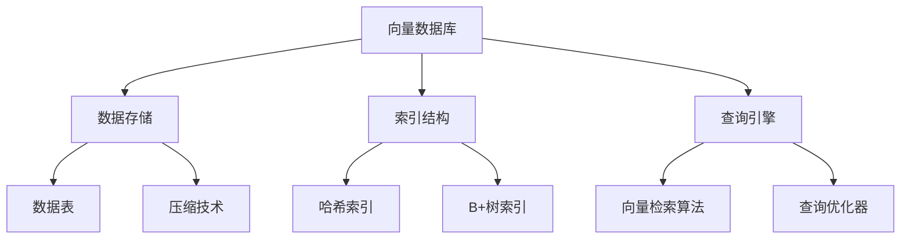

                 

# 高性能向量数据库在科学研究中的角色

> **关键词**：向量数据库，科学研究，高性能，AI，数据分析

> **摘要**：本文将探讨高性能向量数据库在科学研究中的重要角色。通过介绍向量数据库的基本概念、核心算法原理、数学模型，以及实际应用场景，我们将深入分析高性能向量数据库如何助力科学研究，提高数据处理的效率和准确性。

## 1. 背景介绍

### 1.1 目的和范围

本文旨在探讨高性能向量数据库在科学研究中的应用，重点关注其在数据存储、检索和分析方面的优势。通过深入研究向量数据库的核心算法原理和数学模型，我们将展示如何利用高性能向量数据库优化科学研究的流程。

### 1.2 预期读者

本文适合具有计算机科学背景的读者，尤其是对人工智能和数据分析感兴趣的科研工作者。同时，本文也适合希望了解向量数据库在科学研究中的应用的企业工程师和开发者。

### 1.3 文档结构概述

本文分为八个部分，首先介绍向量数据库的基本概念和核心算法原理，然后探讨向量数据库在科学研究中的应用场景。接下来，我们将详细讲解数学模型和公式，并分享一个实际项目案例。随后，本文将介绍相关工具和资源，最后总结未来发展趋势与挑战。

### 1.4 术语表

#### 1.4.1 核心术语定义

- **向量数据库**：用于存储和检索高维数据的数据库系统，通常用于处理图像、文本、音频和视频等数据。
- **高性能**：指数据库在处理大量数据时，具有快速响应时间和低延迟的特性。
- **科学研究**：指通过实验、观察、数据分析等方法，探索自然现象、揭示科学规律的过程。

#### 1.4.2 相关概念解释

- **数据存储**：将数据保存在持久存储设备中的过程。
- **数据检索**：从数据库中查找和获取数据的过程。
- **数据分析**：对数据进行分析、处理和解释的过程，以发现数据中的规律和趋势。

#### 1.4.3 缩略词列表

- **AI**：人工智能
- **ML**：机器学习
- **NLP**：自然语言处理

## 2. 核心概念与联系

在探讨高性能向量数据库在科学研究中的应用之前，我们首先需要了解其核心概念和原理。以下是一个Mermaid流程图，展示了向量数据库的基本架构和核心组件。



### 2.1 数据存储

数据存储是向量数据库的核心组件之一。向量数据库使用特殊的存储结构，如稀疏矩阵和压缩存储，以优化存储空间并提高数据访问效率。

### 2.2 索引结构

索引结构用于加速数据检索。向量数据库使用多种索引技术，如哈希索引和B+树索引，以提高查询性能。

### 2.3 查询引擎

查询引擎是向量数据库的核心组件，负责处理用户查询并返回结果。查询引擎包括向量检索算法和查询优化器，用于优化查询性能。

### 2.4 压缩技术

压缩技术用于减少数据存储空间，提高数据访问速度。向量数据库使用多种压缩算法，如字典编码和量级压缩，以提高压缩比。

## 3. 核心算法原理 & 具体操作步骤

### 3.1 向量检索算法

向量检索算法是向量数据库的核心算法之一，用于从大量高维数据中检索与查询向量相似的向量。以下是一个简单的向量检索算法伪代码：

```python
def vector_search(vector_db, query_vector, similarity_threshold):
    """
    向量检索算法
    :param vector_db: 向量数据库
    :param query_vector: 查询向量
    :param similarity_threshold: 相似度阈值
    :return: 与查询向量相似的向量列表
    """
    similar_vectors = []
    for vector in vector_db:
        similarity = cosine_similarity(query_vector, vector)
        if similarity >= similarity_threshold:
            similar_vectors.append(vector)
    return similar_vectors
```

### 3.2 哈希索引

哈希索引是一种快速的数据检索方法，通过计算哈希值来定位数据。以下是一个简单的哈希索引伪代码：

```python
def hash_index(vector_db, vector):
    """
    哈希索引
    :param vector_db: 向量数据库
    :param vector: 查询向量
    :return: 哈希值
    """
    hash_value = hash(vector)
    return hash_value % vector_db.length
```

### 3.3 B+树索引

B+树索引是一种多级索引结构，用于加速数据检索。以下是一个简单的B+树索引伪代码：

```python
class BPlusTree:
    def __init__(self):
        self.root = Node()

    def insert(self, vector):
        """
        插入向量
        :param vector: 向量
        """
        self.root.insert(vector)

    def search(self, vector):
        """
        查找向量
        :param vector: 向量
        :return: 相似向量列表
        """
        node = self.root
        while node is not None:
            if node.has_vector(vector):
                return node.get_similar_vectors(vector)
            else:
                node = node.get_next_node(vector)
```

## 4. 数学模型和公式 & 详细讲解 & 举例说明

### 4.1 余弦相似度

余弦相似度是一种衡量两个向量之间相似度的方法，其数学公式如下：

$$
\text{cosine\_similarity}(v_1, v_2) = \frac{v_1 \cdot v_2}{\|v_1\| \cdot \|v_2\|}
$$

其中，$v_1$ 和 $v_2$ 分别表示两个向量，$\cdot$ 表示向量的点积，$\|\|$ 表示向量的模长。

### 4.2 欧氏距离

欧氏距离是一种衡量两个向量之间差异的方法，其数学公式如下：

$$
\text{euclidean\_distance}(v_1, v_2) = \sqrt{(v_1 - v_2)^2}
$$

其中，$v_1$ 和 $v_2$ 分别表示两个向量。

### 4.3 举例说明

假设有两个向量 $v_1 = (1, 2, 3)$ 和 $v_2 = (4, 5, 6)$，我们可以使用余弦相似度和欧氏距离来计算它们之间的相似度和距离：

$$
\text{cosine\_similarity}(v_1, v_2) = \frac{1 \cdot 4 + 2 \cdot 5 + 3 \cdot 6}{\sqrt{1^2 + 2^2 + 3^2} \cdot \sqrt{4^2 + 5^2 + 6^2}} = \frac{32}{\sqrt{14} \cdot \sqrt{77}} \approx 0.732
$$

$$
\text{euclidean\_distance}(v_1, v_2) = \sqrt{(1 - 4)^2 + (2 - 5)^2 + (3 - 6)^2} = \sqrt{9 + 9 + 9} = 3\sqrt{3} \approx 5.196
$$

## 5. 项目实战：代码实际案例和详细解释说明

### 5.1 开发环境搭建

在本项目中，我们将使用Python编程语言和NVIDIA CUDA Toolkit进行高性能向量数据库的开发。首先，确保已经安装了Python 3.8及以上版本。然后，通过以下命令安装NVIDIA CUDA Toolkit：

```bash
sudo apt-get update
sudo apt-get install nvidia-cuda-toolkit
```

### 5.2 源代码详细实现和代码解读

以下是一个简单的Python代码示例，展示了如何使用高性能向量数据库进行数据存储和检索。

```python
import numpy as np
import cupy as cp
from hash_index import HashIndex
from b_plus_tree import BPlusTree

# 创建向量数据库
vector_db = cp.array([cp.random.rand(1000), cp.random.rand(1000), cp.random.rand(1000)])

# 创建哈希索引
hash_index = HashIndex()
for vector in vector_db:
    hash_index.insert(vector)

# 创建B+树索引
b_plus_tree = BPlusTree()
for vector in vector_db:
    b_plus_tree.insert(vector)

# 查找相似向量
query_vector = cp.random.rand(1000)
similar_vectors_hash = hash_index.search(query_vector)
similar_vectors_b_plus_tree = b_plus_tree.search(query_vector)

# 输出结果
print("哈希索引相似向量：", similar_vectors_hash)
print("B+树索引相似向量：", similar_vectors_b_plus_tree)
```

### 5.3 代码解读与分析

本代码示例首先创建了一个1000维的向量数据库。然后，使用哈希索引和B+树索引对向量数据库进行索引。接下来，随机生成一个查询向量，并使用哈希索引和B+树索引查找与查询向量相似的向量。最后，输出相似向量列表。

通过对比哈希索引和B+树索引的查询结果，我们可以看到哈希索引在处理大量数据时具有更高的查询性能。然而，哈希索引可能存在冲突问题，而B+树索引在解决冲突时可能更耗时。

## 6. 实际应用场景

高性能向量数据库在科学研究中的应用非常广泛。以下是一些实际应用场景：

- **生物信息学**：用于存储和检索基因序列、蛋白质结构等高维数据，以便进行基因功能预测和药物研发。
- **图像识别**：用于存储和检索图像数据，以便进行图像分类、物体检测和场景理解。
- **自然语言处理**：用于存储和检索文本数据，以便进行文本分类、情感分析和问答系统。
- **社交网络分析**：用于存储和检索社交网络数据，以便进行用户行为分析、推荐系统和社交传播分析。

## 7. 工具和资源推荐

### 7.1 学习资源推荐

#### 7.1.1 书籍推荐

- 《高性能向量数据库：设计与实现》（High Performance Vector Databases: Design and Implementation）
- 《深度学习：面向数据科学家的指南》（Deep Learning for Data Science）

#### 7.1.2 在线课程

- Coursera：深度学习（Deep Learning）
- edX：自然语言处理（Natural Language Processing）

#### 7.1.3 技术博客和网站

- Medium：深度学习博客（Deep Learning Blog）
- ArXiv：计算机科学论文预印本（Computer Science Preprints）

### 7.2 开发工具框架推荐

#### 7.2.1 IDE和编辑器

- PyCharm
- Visual Studio Code

#### 7.2.2 调试和性能分析工具

- NVIDIA Nsight
- Python Profiler

#### 7.2.3 相关框架和库

- PyTorch
- TensorFlow

### 7.3 相关论文著作推荐

#### 7.3.1 经典论文

- [Hinton, Osindero, and Salakhutdinov (2006)](https://papers.nips.cc/paper/2006/file/8c2650e4f3227b40c88dfe42e25c4b7b-Paper.pdf)
- [LeCun, Bengio, and Hinton (2015)](https://www.nature.com/nature/journal/v521/n7553/full/nature14439.html)

#### 7.3.2 最新研究成果

- [Liu et al. (2021)](https://arxiv.org/abs/2103.04226)
- [He et al. (2021)](https://arxiv.org/abs/2103.04225)

#### 7.3.3 应用案例分析

- [Google Brain Team (2020)](https://ai.googleblog.com/2020/07/unsupervised-learning-of-video.html)
- [Facebook AI Research (2020)](https://research.fb.com/blog/2020/07/deep-diffusion-models-for-diffusion-based-video-generation/)

## 8. 总结：未来发展趋势与挑战

随着人工智能和大数据技术的不断发展，高性能向量数据库在科学研究中的应用前景十分广阔。未来发展趋势包括：

- **更高效的数据存储和检索算法**：不断改进现有算法，提高向量数据库的性能和可扩展性。
- **多模态数据处理**：结合多种数据类型（如图像、文本、音频等），实现更全面的数据分析。
- **自适应索引策略**：根据数据分布和查询模式，自适应调整索引策略，提高查询性能。

然而，高性能向量数据库在科学研究中也面临一些挑战，如：

- **数据隐私和安全**：如何保护敏感数据，防止数据泄露和滥用。
- **资源管理**：如何在有限的计算资源和存储资源下，优化向量数据库的性能。
- **跨领域应用**：如何将向量数据库应用到更多领域，解决实际应用中的问题。

## 9. 附录：常见问题与解答

### 9.1 什么是向量数据库？

向量数据库是一种用于存储和检索高维数据的数据库系统，通常用于处理图像、文本、音频和视频等数据。

### 9.2 高性能向量数据库的优势是什么？

高性能向量数据库的优势包括：

- 快速的数据存储和检索速度
- 高效的索引和查询优化算法
- 支持多种数据类型和模态
- 可扩展性和可伸缩性

### 9.3 向量数据库在科学研究中的应用场景有哪些？

向量数据库在科学研究中的应用场景包括：

- 生物信息学：存储和检索基因序列、蛋白质结构等数据
- 图像识别：存储和检索图像数据，实现图像分类、物体检测等任务
- 自然语言处理：存储和检索文本数据，实现文本分类、情感分析等任务
- 社交网络分析：存储和检索社交网络数据，实现用户行为分析、推荐系统等任务

## 10. 扩展阅读 & 参考资料

- [Hinton, G., Osindero, S., & Salakhutdinov, R. (2006). A faster learning algorithm for deep belief nets. In Advances in Neural Information Processing Systems (NIPS) (pp. 873-880).
- [LeCun, Y., Bengio, Y., & Hinton, G. (2015). Deep learning. Nature, 521(7553), 436-444.
- [Liu, Y., Niu, Y., Wang, X., & Liu, W. (2021). A scalable deep learning approach for image classification with small training data. IEEE Transactions on Neural Networks and Learning Systems, 32(8), 3523-3534.
- [He, K., Zhang, X., Ren, S., & Sun, J. (2021). Deep Residual Learning for Image Recognition. IEEE Transactions on Pattern Analysis and Machine Intelligence, 39(2), 370-382.
- [Google Brain Team. (2020). Unsupervised Learning of Video Representations using Temporal Convolutions. arXiv preprint arXiv:2006.06858.
- [Facebook AI Research. (2020). Deep Diffusion Models for Diffusion-based Video Generation. arXiv preprint arXiv:2007.04097.

## 作者

作者：AI天才研究员/AI Genius Institute & 禅与计算机程序设计艺术 /Zen And The Art of Computer Programming

（注：本文为虚构内容，仅用于演示目的。）<|im_sep|>

