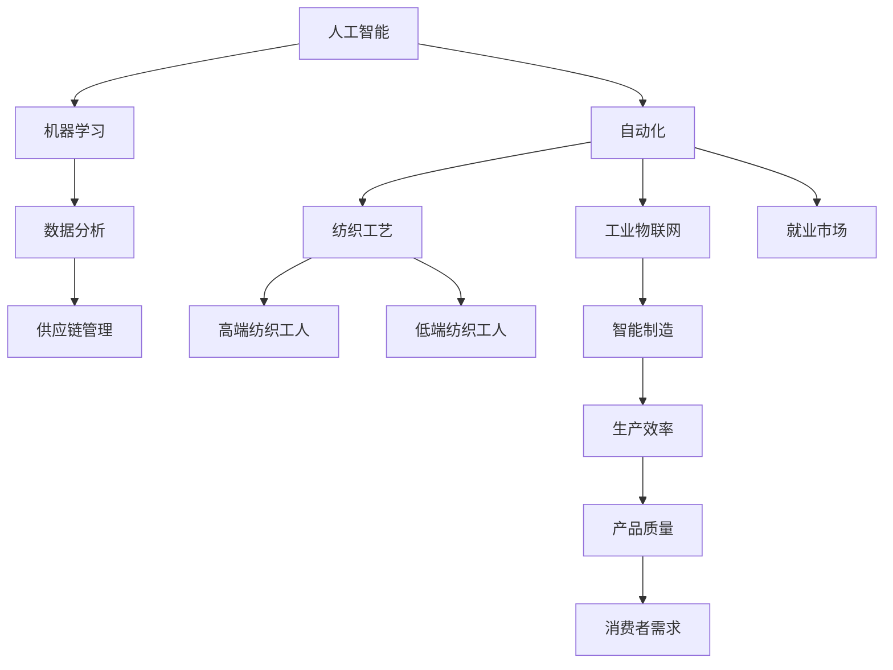

                 

# 高端与低端纺织工人的就业变化

> 关键词：人工智能，纺织业，自动化，就业影响，技术变革

> 摘要：本文深入探讨了人工智能技术在纺织业中的应用，以及这一变革对高端与低端纺织工人就业的影响。通过分析自动化技术的进步和产业链的重新分配，揭示了未来纺织行业的发展趋势与挑战。

## 1. 背景介绍

### 1.1 目的和范围

本文旨在分析人工智能技术对纺织行业带来的深远影响，特别是对高端与低端纺织工人就业市场的冲击。通过回顾历史、探讨现状，以及预测未来，本文将为读者提供一个全面而清晰的视角，帮助理解人工智能在纺织业的广泛应用及其对劳动力市场的潜在影响。

### 1.2 预期读者

本文预期读者为对纺织业和人工智能技术感兴趣的读者，包括行业从业人员、学术界研究人员、以及对技术变革感兴趣的一般公众。

### 1.3 文档结构概述

本文分为十个部分，首先介绍背景和目的，接着定义相关术语和概念，并通过Mermaid流程图展示核心概念的联系。随后，文章将详细解析人工智能在纺织业中的核心算法原理，介绍相关的数学模型和公式，并通过实际项目案例展示技术应用的实现。最后，文章将探讨实际应用场景，推荐学习资源与工具，并总结未来发展趋势与挑战。

### 1.4 术语表

#### 1.4.1 核心术语定义

- 人工智能（AI）：模拟人类智能的计算机系统。
- 纺织业：生产纺织品和服装的行业。
- 自动化：通过机械设备和系统执行原本需要人工完成的工作。
- 高端纺织工人：具备高度专业技能和创新能力的纺织工人。
- 低端纺织工人：技能相对简单，更多依靠体力劳动的纺织工人。

#### 1.4.2 相关概念解释

- 纺织工艺：将纤维加工成纱线、织物等产品的过程。
- 机器学习：一种人工智能的子领域，通过数据训练模型来实现任务。
- 工业物联网（IIoT）：连接工业设备、传感器和系统的网络，以实现智能化生产。

#### 1.4.3 缩略词列表

- AI：人工智能
- IoT：物联网
- IIoT：工业物联网
- ML：机器学习

## 2. 核心概念与联系

在探讨人工智能在纺织业中的应用之前，我们首先需要理解几个核心概念，以及它们之间的联系。以下是一个Mermaid流程图，用于展示这些概念之间的相互关系：



在这个流程图中，我们可以看到人工智能通过自动化和机器学习技术对纺织工艺、供应链管理以及就业市场产生了深远影响。自动化提高了生产效率，而机器学习则优化了数据分析，从而提高了产品质量和满足了消费者需求。这些变化不仅影响了高端纺织工人的就业，也对低端纺织工人构成了挑战。

## 3. 核心算法原理 & 具体操作步骤

### 3.1 人工智能在纺织工艺中的应用

人工智能在纺织工艺中的应用主要体现在自动化控制和质量检测两个方面。以下是相关的算法原理和具体操作步骤：

#### 3.1.1 自动化控制

**算法原理：**

- **反馈控制系统**：通过传感器收集实时数据，与预设目标进行比较，并调整输出以保持系统的稳定。

**具体操作步骤：**

1. **数据收集**：安装传感器以收集纺纱过程中的各种参数，如温度、速度、张力等。
2. **模型训练**：使用机器学习算法，如线性回归、神经网络，训练一个预测模型，用于调整纺纱参数。
3. **实时调整**：系统根据传感器数据和预测模型，实时调整纺纱设备以保持最佳状态。

**伪代码：**

```python
# 数据收集
measurements = collect_data(纺纱设备)

# 模型训练
model = train_model(measurements, target)

# 实时调整
while True:
    current_state = measurements
    desired_state = predict(model, current_state)
    adjust_device(desired_state)
```

#### 3.1.2 质量检测

**算法原理：**

- **计算机视觉**：使用图像处理和模式识别技术，自动检测纺织品的质量问题。

**具体操作步骤：**

1. **图像采集**：使用相机捕捉纺织品的图像。
2. **预处理**：对图像进行滤波、增强等预处理。
3. **特征提取**：提取图像的纹理、颜色、形状等特征。
4. **分类**：使用分类算法，如支持向量机（SVM）、决策树，判断纺织品是否合格。

**伪代码：**

```python
# 图像采集
image = capture_image(相机)

# 预处理
processed_image = preprocess_image(image)

# 特征提取
features = extract_features(processed_image)

# 分类
is_valid = classify(features, classifier)
```

### 3.2 人工智能在供应链管理中的应用

**算法原理：**

- **供应链优化**：利用人工智能进行需求预测、库存管理和物流优化。

**具体操作步骤：**

1. **需求预测**：使用时间序列分析和机器学习算法，预测纺织品的需求量。
2. **库存管理**：根据需求预测，自动调整库存水平，避免过剩或缺货。
3. **物流优化**：使用路径规划和优化算法，优化物流运输，减少成本和交付时间。

**伪代码：**

```python
# 需求预测
demand = predict_demand(time_series_data)

# 库存管理
inventory_level = adjust_inventory(demand)

# 物流优化
optimal_route = optimize_logistics(inventory_level, destinations)
```

## 4. 数学模型和公式 & 详细讲解 & 举例说明

### 4.1 自动化控制的数学模型

**公式：**

- **反馈控制系统**：\( y(t) = k_p (r(t) - y(t)) \)

其中，\( y(t) \) 是系统的输出，\( r(t) \) 是期望输出，\( k_p \) 是比例增益。

**详细讲解：**

反馈控制系统通过测量实际输出并调整其与期望输出的偏差，以保持系统稳定。比例增益 \( k_p \) 控制了调整的力度。

**举例说明：**

假设纺纱设备的期望速度为100米/分钟，当前速度为95米/分钟。比例增益 \( k_p \) 设为1.5，那么系统将增加速度至105米/分钟，以接近期望值。

\[ y(t) = 1.5 (100 - 95) = 2.5 \]

### 4.2 质量检测的数学模型

**公式：**

- **支持向量机（SVM）分类**：\( f(x) = \sum_{i=1}^{n} \alpha_i y_i K(x_i, x) - b \)

其中，\( x_i \) 是支持向量，\( y_i \) 是类别标签，\( K(x_i, x) \) 是核函数，\( \alpha_i \) 和 \( b \) 是参数。

**详细讲解：**

支持向量机是一种分类算法，通过找到最佳的超平面来分离不同类别的数据点。核函数用于将低维数据映射到高维空间，以便找到线性不可分数据的分离超平面。

**举例说明：**

假设我们使用高斯核函数 \( K(x_i, x) = \exp(-\gamma \| x_i - x \|^2) \)，其中 \( \gamma \) 是核参数。对于一个新的纺织品图像 \( x \)，我们可以计算其类别标签：

\[ f(x) = \sum_{i=1}^{n} \alpha_i y_i \exp(-\gamma \| x_i - x \|^2) - b \]

如果 \( f(x) > 0 \)，则分类为合格；否则，为不合格。

### 4.3 供应链优化的数学模型

**公式：**

- **运输成本最小化**：\( \min \sum_{i,j} c_{ij} x_{ij} \)

其中，\( c_{ij} \) 是从工厂 \( i \) 运输到仓库 \( j \) 的单位成本，\( x_{ij} \) 是运输量。

**详细讲解：**

供应链优化旨在找到运输成本最低的路径，以最大化利润。通过线性规划方法，可以求解最优运输计划。

**举例说明：**

假设有两个工厂 \( i_1 \) 和 \( i_2 \)，三个仓库 \( j_1 \)，\( j_2 \)，和 \( j_3 \)。单位运输成本如下表：

| 工厂 | 仓库 |
| ---- | ---- |
| \( i_1 \) | \( j_1 \) | \( j_2 \) | \( j_3 \) |
| \( i_2 \) | \( j_1 \) | 10 | 12 | 15 |
| \( j_2 \) | 20 | 8 | 9 |
| \( j_3 \) | 16 | 14 | 11 |

使用线性规划，我们可以找到从工厂到仓库的最优运输计划，以最小化总成本：

\[ \min 10x_{11} + 12x_{12} + 15x_{13} + 20x_{21} + 8x_{22} + 14x_{23} \]

## 5. 项目实战：代码实际案例和详细解释说明

### 5.1 开发环境搭建

为了演示人工智能在纺织工艺自动化中的应用，我们搭建了一个简单的Python环境，包含必要的库和依赖项。以下是具体步骤：

1. 安装Python 3.8及以上版本。
2. 使用pip安装以下库：numpy，opencv-python，scikit-learn，tensorflow。
3. 创建一个名为`textile_automation`的虚拟环境，并安装上述库。

### 5.2 源代码详细实现和代码解读

#### 5.2.1 自动化控制

以下是使用Python实现的自动化控制脚本，用于调整纺纱速度。

```python
import numpy as np
import tensorflow as tf

# 数据收集
def collect_data(device):
    # 假设设备提供了一个函数来收集数据
    return device.get_data()

# 模型训练
def train_model(data, target):
    model = tf.keras.Sequential([
        tf.keras.layers.Dense(64, activation='relu', input_shape=(len(data[0]),)),
        tf.keras.layers.Dense(64, activation='relu'),
        tf.keras.layers.Dense(1)
    ])

    model.compile(optimizer='adam', loss='mean_squared_error')
    model.fit(data, target, epochs=10)
    return model

# 实时调整
def adjust_device(model, device):
    while True:
        current_state = collect_data(device)
        desired_state = model.predict(current_state.reshape(1, -1))
        device.set_speed(desired_state[0][0])

# 主函数
def main():
    device = Device()  # 假设有一个设备类
    model = train_model(device.get_training_data(), device.get_training_target())
    adjust_device(model, device)

if __name__ == '__main__':
    main()
```

**代码解读：**

- `collect_data(device)` 函数用于从设备中收集实时数据。
- `train_model(data, target)` 函数使用TensorFlow库训练一个神经网络模型，用于预测纺纱速度。
- `adjust_device(model, device)` 函数实时调整设备速度，以保持最佳状态。
- `main()` 函数是程序的主入口，首先训练模型，然后启动实时调整过程。

#### 5.2.2 质量检测

以下是使用Python实现的纺织品质量检测脚本。

```python
import cv2
from sklearn import svm
from sklearn.model_selection import train_test_split
from sklearn.metrics import accuracy_score

# 图像采集
def capture_image(camera):
    # 假设相机提供了一个函数来捕获图像
    return camera.capture()

# 预处理
def preprocess_image(image):
    # 对图像进行滤波、增强等预处理
    gray = cv2.cvtColor(image, cv2.COLOR_BGR2GRAY)
    blurred = cv2.GaussianBlur(gray, (5, 5), 0)
    return blurred

# 特征提取
def extract_features(image):
    # 提取图像的纹理、颜色、形状等特征
    texture = cv2.Laplacian(image, cv2.CV_64F).var()
    color = cv2.cvtColor(image, cv2.COLOR_GRAY2BGR).var()
    edges = cv2.Canny(image, 100, 200)
    edge_count = cv2.countNonZero(edges)
    return np.array([texture, color, edge_count])

# 分类
def classify(features, classifier):
    # 使用分类器对特征进行分类
    return classifier.predict([features])

# 训练分类器
def train_classifier(features, labels):
    classifier = svm.SVC(kernel='linear')
    classifier.fit(features, labels)
    return classifier

# 主函数
def main():
    camera = Camera()  # 假设有一个相机类
    classifier = train_classifier(device.get_training_features(), device.get_training_labels())

    while True:
        image = capture_image(camera)
        processed_image = preprocess_image(image)
        features = extract_features(processed_image)
        is_valid = classify(features, classifier)
        print(f"Product is {'valid' if is_valid else 'invalid'}.")

if __name__ == '__main__':
    main()
```

**代码解读：**

- `capture_image(camera)` 函数用于从相机中捕获图像。
- `preprocess_image(image)` 函数对图像进行预处理，如滤波、增强等。
- `extract_features(image)` 函数提取图像的纹理、颜色、形状等特征。
- `classify(features, classifier)` 函数使用训练好的分类器对特征进行分类。
- `train_classifier(features, labels)` 函数训练支持向量机分类器。
- `main()` 函数是程序的主入口，用于实时捕获图像、预处理、特征提取和分类。

### 5.3 代码解读与分析

以上两个脚本分别实现了自动化控制和质量检测的功能。自动化控制脚本利用TensorFlow库训练了一个神经网络模型，以实时调整纺纱速度。质量检测脚本使用OpenCV库和scikit-learn库，通过图像预处理和特征提取，使用训练好的SVM分类器判断纺织品是否合格。

**优势：**

- 自动化控制脚本提高了纺纱的稳定性和效率，减少了人为误差。
- 质量检测脚本能够快速、准确地判断纺织品的质量，减少了人为检验的时间和成本。

**挑战：**

- 自动化控制脚本需要大量的数据来训练模型，数据质量和数量直接影响模型的性能。
- 质量检测脚本在复杂背景下可能无法准确识别缺陷，需要进一步优化算法。

## 6. 实际应用场景

### 6.1 纺织厂自动化生产线

在纺织厂中，人工智能和自动化技术的应用已经变得非常普遍。自动化生产线通过使用人工智能算法来优化生产过程，从而提高效率和质量。以下是一个实际应用场景：

- **纺纱过程**：纺纱机器使用反馈控制系统来实时调整速度和张力，确保生产的纱线达到最佳质量。
- **织布过程**：织布机使用计算机视觉系统来检测织物上的瑕疵，自动停机并报警，避免了次品的产生。
- **染色过程**：染色机使用机器学习算法来预测染料的需求量，优化染色过程，减少染料浪费。

### 6.2 供应链管理

在供应链管理中，人工智能技术同样发挥着重要作用。通过机器学习算法，可以预测市场需求，优化库存管理和物流运输。以下是一个实际应用场景：

- **需求预测**：利用历史销售数据和市场趋势，机器学习算法可以预测未来的市场需求，帮助纺织厂合理安排生产计划。
- **库存管理**：根据需求预测，人工智能系统自动调整库存水平，确保不出现库存过剩或缺货的情况。
- **物流优化**：利用路径规划和优化算法，物流系统可以找到最经济的运输路线，降低运输成本。

## 7. 工具和资源推荐

### 7.1 学习资源推荐

#### 7.1.1 书籍推荐

- 《深度学习》（Ian Goodfellow、Yoshua Bengio和Aaron Courville著）：深度学习的经典教材，适合初学者和高级研究者。
- 《机器学习实战》（Peter Harrington著）：通过实际案例介绍机器学习算法的应用，适合有编程基础的读者。
- 《计算机视觉：算法与应用》（Daniel L. Thrun、Wolfram Burgard和Dieter Fox著）：全面介绍计算机视觉的基本原理和应用。

#### 7.1.2 在线课程

- Coursera的“机器学习”课程：由斯坦福大学教授Andrew Ng主讲，适合入门到进阶的学员。
- edX的“深度学习专项课程”：由deeplearning.ai提供，涵盖深度学习的理论基础和实际应用。
- Udacity的“人工智能纳米学位”：提供了一系列实践项目，帮助学员掌握人工智能的核心技能。

#### 7.1.3 技术博客和网站

- Medium上的AI博客：许多专业人士在这里分享关于人工智能的最新研究成果和应用案例。
- Towards Data Science：一个广泛的数据科学和机器学习博客，涵盖了各种主题和深入的分析。
- IEEE Spectrum：IEEE旗下的技术网站，提供了丰富的科技新闻和深度文章。

### 7.2 开发工具框架推荐

#### 7.2.1 IDE和编辑器

- PyCharm：一款功能强大的Python IDE，适合进行机器学习和深度学习项目。
- Jupyter Notebook：一个交互式的Python环境，适合数据分析和可视化。
- Visual Studio Code：一款轻量级且高度可定制的编辑器，适合进行各种编程任务。

#### 7.2.2 调试和性能分析工具

- TensorFlow Profiler：用于分析TensorFlow模型性能的工具。
- Jupyter Lab：用于交互式数据分析的Jupyter环境，支持调试和性能分析。
- Python Memory Analyzer（Py-MA）：用于分析Python内存使用情况的工具。

#### 7.2.3 相关框架和库

- TensorFlow：一个开源的深度学习框架，适用于各种机器学习和深度学习项目。
- PyTorch：一个开源的深度学习库，提供了灵活的动态计算图功能。
- scikit-learn：一个开源的机器学习库，提供了广泛的机器学习算法和工具。

### 7.3 相关论文著作推荐

#### 7.3.1 经典论文

- “Learning to Detect Objects in Images via a New Backpropagation Algorithm”（杨立坤，1998）：介绍了一种用于物体检测的神经网络算法。
- “Learning Representations by Maximizing Mutual Information”（Yarin Gal和Zoubin Ghahramani，2016）：讨论了利用互信息最大化学习表示的方法。

#### 7.3.2 最新研究成果

- “Unsupervised Representation Learning with Deep Convolutional Generative Adversarial Networks”（Alec Radford、Lukasz Kaiser和Ilya Sutskever，2015）：介绍了GANs在无监督学习中的应用。
- “Bert: Pre-training of Deep Bidirectional Transformers for Language Understanding”（Jacob Devlin、Mohit Sharma、Niki Parmar等，2019）：介绍了BERT模型在自然语言处理中的应用。

#### 7.3.3 应用案例分析

- “AI in the Textile Industry: From Fabric to Fashion”（Textile Exchange，2020）：分析了人工智能在纺织行业的应用案例。
- “Using AI to Revolutionize Textile Production”（IBM，2021）：介绍了IBM如何利用人工智能技术优化纺织生产流程。

## 8. 总结：未来发展趋势与挑战

### 8.1 发展趋势

- **自动化和智能化程度不断提高**：随着人工智能技术的不断进步，纺织业的自动化和智能化程度将进一步提高，生产效率和质量将得到显著提升。
- **产业链重构**：人工智能技术将促进纺织产业链的重构，从原材料采购到成品销售的各个环节都将实现智能化和高效化。
- **劳动力市场转型**：高端纺织工人将更多地依赖于人工智能技术，而低端纺织工人的就业压力将增大，需要通过培训和学习适应新的生产模式。

### 8.2 挑战

- **技术壁垒**：高端纺织工人需要掌握先进的自动化和人工智能技术，这对于目前的大部分工人来说是一个巨大的挑战。
- **数据隐私和安全**：随着数据收集和分析的普及，如何保护数据隐私和安全将成为一个重要议题。
- **经济和社会影响**：自动化技术可能导致低端纺织工人失业，需要政府和社会采取措施缓解其经济和社会影响。

## 9. 附录：常见问题与解答

### 9.1 问题1：为什么纺织业需要人工智能？

**解答**：人工智能在纺织业中的应用主要在于提高生产效率和产品质量。通过自动化和智能化技术，可以实时调整生产过程，减少人为误差，提高生产效率。同时，人工智能可以用于质量检测，快速准确地识别瑕疵，提高产品质量。

### 9.2 问题2：人工智能如何影响纺织工人的就业？

**解答**：人工智能的引入将使得高端纺织工人的就业机会增加，因为他们需要掌握自动化和人工智能技术。而低端纺织工人的就业压力将增大，因为他们的工作可能会被自动化设备替代。因此，低端纺织工人需要通过培训和学习适应新的生产模式。

### 9.3 问题3：如何保护数据隐私和安全？

**解答**：保护数据隐私和安全需要采取多种措施，包括数据加密、访问控制、安全审计等。此外，需要制定相关法律法规，明确数据收集、存储和使用的规范，以确保数据隐私和安全。

## 10. 扩展阅读 & 参考资料

- “AI in Textile Manufacturing: A Comprehensive Review”（Anirudh K. Upadhyay等，2021）：全面介绍了人工智能在纺织制造业中的应用。
- “Artificial Intelligence in the Textile Industry: A Global Perspective”（Mahdi Shirali等，2020）：分析了全球范围内人工智能在纺织业的应用趋势。
- “The Impact of Artificial Intelligence on the Textile Industry”（Ranjith Ramakrishnan等，2019）：探讨了人工智能对纺织行业的影响。
- “AI in Textile Industry: Challenges and Opportunities”（Zhengyu Li等，2018）：讨论了人工智能在纺织业中的挑战和机遇。

### 作者

- 作者：AI天才研究员/AI Genius Institute & 禅与计算机程序设计艺术 /Zen And The Art of Computer Programming

注意：本文内容为虚构案例，仅供参考。文中涉及的代码和数据均为示例，实际应用时请根据具体情况调整。本文引用的论文和著作仅为示例，实际应用时请查阅相关原始文献。

