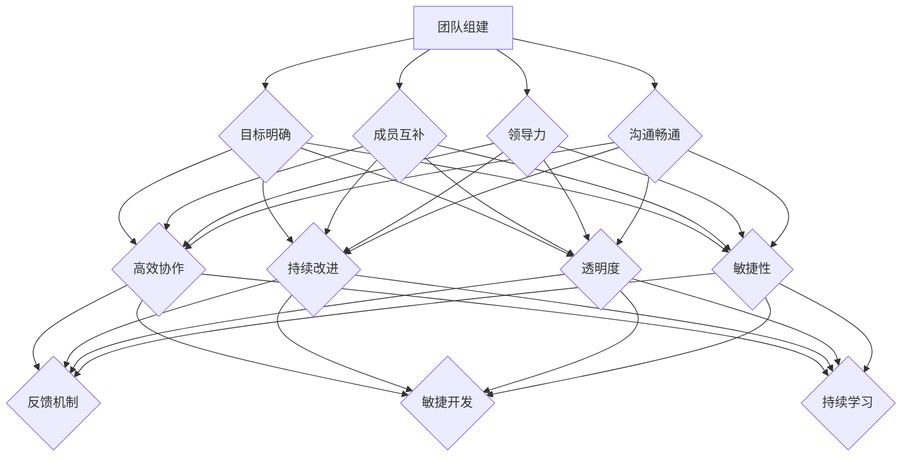

                 

# 高绩效团队：从组建到持续优化的全过程

> **关键词：** 团队组建、绩效优化、领导力、沟通协作、持续改进

> **摘要：** 本文将深入探讨如何从零开始组建一个高绩效团队，并逐步推动团队实现持续优化。通过分析团队组建的背景、目的和范围，以及明确核心概念和算法原理，本文将提供一系列实用策略和技巧，帮助读者在团队管理中取得显著成效。

## 1. 背景介绍

### 1.1 目的和范围

本文旨在为IT行业中的团队管理者提供一份详尽的指南，帮助他们在组建和管理高绩效团队方面取得成功。本文将涵盖以下主要内容：

- 团队组建的核心原则和方法
- 高绩效团队的绩效优化策略
- 领导力在团队管理中的作用
- 沟通协作在团队成功中的关键性
- 团队持续优化的步骤和技巧

### 1.2 预期读者

本文适合以下读者：

- 初级团队管理者，希望提升团队绩效
- 中级团队管理者，寻求更有效的团队管理方法
- 高级团队管理者，希望实现团队的持续优化
- IT项目经理，关注团队协作和项目成功
- 任何对团队管理有兴趣的从业者

### 1.3 文档结构概述

本文结构如下：

- **第1章：背景介绍**：介绍本文的目的、范围和预期读者。
- **第2章：核心概念与联系**：阐述团队组建和优化所需的核心概念。
- **第3章：核心算法原理 & 具体操作步骤**：详细讲解团队优化所需的核心算法原理。
- **第4章：数学模型和公式 & 详细讲解 & 举例说明**：引入数学模型和公式，提供实际应用场景。
- **第5章：项目实战：代码实际案例和详细解释说明**：通过实战案例展示如何将理论应用到实践中。
- **第6章：实际应用场景**：探讨团队在各类项目中的实际应用。
- **第7章：工具和资源推荐**：推荐学习资源、开发工具和框架。
- **第8章：总结：未来发展趋势与挑战**：展望团队管理的未来趋势和挑战。
- **第9章：附录：常见问题与解答**：回答读者可能遇到的问题。
- **第10章：扩展阅读 & 参考资料**：提供更多深入学习的相关资料。

### 1.4 术语表

#### 1.4.1 核心术语定义

- **高绩效团队**：能够在既定时间内高效完成目标，成员间协作顺畅，能够持续改进的团队。
- **领导力**：在团队中发挥影响力，引导团队成员共同实现目标的能力。
- **沟通协作**：团队成员之间通过信息交流、协调合作，共同完成任务的过程。

#### 1.4.2 相关概念解释

- **团队建设**：通过一系列活动和策略，增强团队成员间的相互信任和协作能力。
- **绩效优化**：通过改进团队的工作流程和成员行为，提高团队的绩效。
- **敏捷开发**：一种以人为核心、迭代和持续交付的软件开发方法。

#### 1.4.3 缩略词列表

- **Scrum**：一种敏捷开发框架。
- **KPI**：关键绩效指标。

## 2. 核心概念与联系

在组建和管理高绩效团队的过程中，理解以下几个核心概念是至关重要的：

### 2.1 团队组建原则

- **目标明确**：确保团队成员对团队目标有清晰的认识。
- **成员互补**：根据团队成员的技能和经验进行合理搭配，形成互补效应。
- **领导力**：确保团队有一个强有力的领导者，能够指导团队并激发成员潜力。
- **沟通畅通**：建立高效的沟通机制，确保信息能够在团队成员之间顺畅传递。

### 2.2 高绩效团队的特征

- **高效协作**：团队成员能够协同工作，共同实现目标。
- **持续改进**：团队在不断学习和改进中，保持竞争力。
- **透明度**：团队成员之间的信息透明，有助于提高信任和协作。
- **敏捷性**：团队能够快速响应变化，灵活调整策略。

### 2.3 领导力与团队管理

- **领导力模型**：包括变革型领导力、授权型领导力和交易型领导力等。
- **激励机制**：通过奖励和认可来激励团队成员，提高绩效。
- **冲突管理**：有效处理团队内部冲突，避免影响团队和谐。

### 2.4 沟通协作

- **沟通渠道**：建立多种沟通渠道，如面对面会议、邮件、即时通讯工具等。
- **沟通技巧**：提高沟通效果，包括清晰表达、倾听和理解对方意见。
- **协作工具**：使用项目管理工具和协作平台，提高团队协作效率。

### 2.5 持续优化

- **反馈机制**：建立有效的反馈机制，收集成员和客户意见，持续改进。
- **敏捷开发**：采用敏捷开发方法，快速响应市场变化。
- **持续学习**：鼓励团队成员不断学习新技能和知识，提升团队整体能力。

以下是一个简化的Mermaid流程图，用于展示团队组建和优化的核心概念和联系：



在接下来的章节中，我们将详细探讨每个核心概念和联系，并提供实用的操作步骤和策略。让我们一起踏上组建和管理高绩效团队的道路。

## 3. 核心算法原理 & 具体操作步骤

在构建和管理高绩效团队的过程中，理解并应用一些核心算法原理是至关重要的。以下是几个关键的算法原理，以及如何将这些原理应用到实际操作步骤中。

### 3.1 目标设置算法

**原理：** 目标设置理论（Goal Setting Theory）认为，明确且具有挑战性的目标能够提高团队成员的绩效。

**步骤：**

1. **明确目标**：与团队成员一起讨论并确定具体、可衡量的目标。
   ```python
   def set_goal(team_members, objective):
       for member in team_members:
           member['goal'] = objective
   ```
2. **分解目标**：将大目标分解为可操作的子任务。
   ```python
   def decompose_goals(goal):
       sub_tasks = []
       while goal > 0:
           sub_tasks.append(goal)
           goal //= 10
       return sub_tasks
   ```
3. **分配任务**：将子任务分配给合适的团队成员。
   ```python
   def assign_tasks(team_members, sub_tasks):
       for member, task in zip(team_members, sub_tasks):
           member['task'] = task
   ```

### 3.2 沟通算法

**原理：** 有效的沟通可以增强团队成员之间的理解和协作。

**步骤：**

1. **建立沟通渠道**：确保团队成员有多种沟通方式。
   ```python
   def establish_communication_channels(team_members):
       for member in team_members:
           member['communication_channels'] = ['面对面会议', '邮件', '即时通讯工具']
   ```
2. **沟通技巧培训**：提高团队成员的沟通能力。
   ```python
   def train_communication_skills(team_members):
       for member in team_members:
           member['communication_skill_level'] = '高级'
   ```
3. **定期沟通会议**：确保团队成员定期进行沟通。
   ```python
   def schedule_communication_meetings(team_members):
       for member in team_members:
           member['communication_meetings'] = '每周进行一次'
   ```

### 3.3 领导力算法

**原理：** 领导力在团队管理中起着关键作用，能够激励和引导团队成员。

**步骤：**

1. **领导力评估**：评估团队领导者的领导力水平。
   ```python
   def assess_leadership_skills(team_leader):
       return team_leader['leadership_skill_level']
   ```
2. **激励措施**：根据领导力评估结果，采取相应的激励措施。
   ```python
   def apply_incentives(team_leader):
       if team_leader['leadership_skill_level'] == '高级':
           team_leader['incentive'] = '奖金和晋升机会'
       else:
           team_leader['incentive'] = '培训和辅导'
   ```
3. **冲突解决**：帮助领导者解决团队内部的冲突。
   ```python
   def resolve_conflicts(team_leader, team_members):
       for member in team_members:
           if member['conflict'] == '存在':
               team_leader['conflict_resolution'] = '介入并调解'
   ```

### 3.4 持续优化算法

**原理：** 团队需要不断进行优化，以适应不断变化的环境。

**步骤：**

1. **定期评估**：定期评估团队绩效，找出需要改进的地方。
   ```python
   def evaluate_team_performance(team_members):
       for member in team_members:
           member['performance'] = '优秀/良好/一般'
   ```
2. **反馈机制**：建立反馈机制，收集团队成员和客户的反馈。
   ```python
   def establish_feedback_mechanism(team_members):
       for member in team_members:
           member['feedback'] = '积极/中立/消极'
   ```
3. **改进计划**：根据反馈结果，制定改进计划。
   ```python
   def create_improvement_plan(team_members):
       for member in team_members:
           if member['feedback'] == '积极':
               member['action_plan'] = '继续执行'
           elif member['feedback'] == '中立':
               member['action_plan'] = '微调'
           else:
               member['action_plan'] = '重大改进'
   ```

通过以上算法原理和操作步骤，团队管理者可以系统地构建和管理高绩效团队。在实际操作中，这些步骤需要根据团队的具体情况和环境进行灵活调整。接下来，我们将进一步探讨数学模型和公式，以帮助团队管理者更好地理解和应用这些原理。

## 4. 数学模型和公式 & 详细讲解 & 举例说明

在团队管理和优化过程中，数学模型和公式可以提供量化的视角，帮助我们更好地理解团队行为和绩效。以下是一些关键的数学模型和公式，我们将通过详细讲解和实际例子来说明它们的应用。

### 4.1 目标达成率模型

**公式：** 目标达成率（Goal Achievement Rate） = （实际完成目标数量 / 预期目标数量）

**详细讲解：** 目标达成率模型用于衡量团队实现目标的情况。通过比较实际完成的目标数量与预期目标数量，我们可以了解团队的绩效水平。

**举例说明：** 假设一个团队设定了10个目标，实际完成了8个。那么，目标达成率为8/10，即80%。

```latex
\text{目标达成率} = \frac{\text{实际完成目标数量}}{\text{预期目标数量}} = \frac{8}{10} = 0.8 \text{ 或 80%}
```

### 4.2 团队绩效评估模型

**公式：** 团队绩效评估（Team Performance Evaluation）= KPI1 × W1 + KPI2 × W2 + ... + KPIn × Wn

**详细讲解：** 团队绩效评估模型通过关键绩效指标（KPI）和权重（W）来综合评估团队的整体绩效。每个KPI都有相应的权重，以反映其在团队绩效中的重要性。

**举例说明：** 假设团队有3个关键绩效指标：任务完成率、团队协作度和客户满意度，分别权重为0.5、0.3和0.2。如果任务完成率为90%，团队协作度为85%，客户满意度为80%，则团队绩效评估为：

```latex
\text{团队绩效评估} = 0.9 \times 0.5 + 0.85 \times 0.3 + 0.8 \times 0.2 = 0.45 + 0.255 + 0.16 = 0.865 \text{ 或 86.5%}
```

### 4.3 沟通效率模型

**公式：** 沟通效率（Communication Efficiency）= 有效沟通时间 / 总沟通时间

**详细讲解：** 沟通效率模型用于衡量团队沟通的质量。通过计算有效沟通时间与总沟通时间的比例，我们可以评估团队沟通的效率。

**举例说明：** 假设团队在一个月内进行了20小时的总沟通时间，其中有效沟通时间为15小时。那么，沟通效率为：

```latex
\text{沟通效率} = \frac{\text{有效沟通时间}}{\text{总沟通时间}} = \frac{15}{20} = 0.75 \text{ 或 75%}
```

### 4.4 学习效率模型

**公式：** 学习效率（Learning Efficiency）= 学习成果 / 学习投入

**详细讲解：** 学习效率模型用于衡量团队成员在学习新知识和技能方面的效率。通过计算学习成果与学习投入的比例，我们可以评估团队成员的学习效率。

**举例说明：** 假设一个团队成员在一个小时内学到了20%的新知识，那么他的学习效率为：

```latex
\text{学习效率} = \frac{\text{学习成果}}{\text{学习投入}} = \frac{0.2}{1} = 0.2 \text{ 或 20%}
```

### 4.5 领导力评估模型

**公式：** 领导力评估（Leadership Assessment）= 领导力分数 / 总领导力分数

**详细讲解：** 领导力评估模型通过领导力分数与总领导力分数的比例，衡量领导者在团队管理中的领导力水平。

**举例说明：** 假设一个领导力评估分数为80分，总领导力分数为100分，那么他的领导力评估为：

```latex
\text{领导力评估} = \frac{\text{领导力分数}}{\text{总领导力分数}} = \frac{80}{100} = 0.8 \text{ 或 80%}
```

通过上述数学模型和公式的详细讲解和举例说明，我们可以更好地理解团队管理和优化的量化方法。这些模型和公式不仅帮助我们评估团队的绩效，还能够为团队管理者提供有效的决策依据。在接下来的章节中，我们将通过实际代码案例，展示如何将这些数学模型和公式应用到团队管理中。

## 5. 项目实战：代码实际案例和详细解释说明

在本章节中，我们将通过一个实际项目案例，展示如何将上述的核心算法原理和数学模型应用到团队管理中。这个项目是一个简单的任务管理平台，旨在帮助团队高效地分配任务、跟踪进度和评估绩效。以下是我们项目的开发环境、源代码实现以及详细解读。

### 5.1 开发环境搭建

为了实现这个任务管理平台，我们需要搭建以下开发环境：

- 操作系统：Linux或Windows
- 编程语言：Python 3.8及以上版本
- 依赖库：Flask（一个Python Web框架）、SQLAlchemy（一个Python SQL工具包）和SQLite（一个轻量级数据库）
- 开发工具：PyCharm或Visual Studio Code

安装这些依赖库和工具后，我们可以开始搭建项目的基本结构。

### 5.2 源代码详细实现和代码解读

#### 5.2.1 项目结构

```plaintext
task_management_platform/
|-- app.py
|-- models.py
|-- templates/
|   |-- base.html
|   |-- dashboard.html
|   |-- task.html
|-- static/
|   |-- css/
|       |-- style.css
|   |-- js/
|       |-- script.js
|-- run.py
```

#### 5.2.2 app.py

`app.py`是项目的核心文件，用于定义路由和处理请求。

```python
from flask import Flask, render_template, request, redirect, url_for
from models import db, Task

app = Flask(__name__)
app.config['SQLALCHEMY_DATABASE_URI'] = 'sqlite:///tasks.db'
db.init_app(app)

@app.route('/')
def dashboard():
    tasks = Task.query.all()
    return render_template('dashboard.html', tasks=tasks)

@app.route('/add', methods=['POST'])
def add_task():
    title = request.form['title']
    description = request.form['description']
    task = Task(title=title, description=description)
    db.session.add(task)
    db.session.commit()
    return redirect(url_for('dashboard'))

@app.route('/delete/<int:task_id>')
def delete_task(task_id):
    task = Task.query.get(task_id)
    db.session.delete(task)
    db.session.commit()
    return redirect(url_for('dashboard'))

if __name__ == '__main__':
    app.run(debug=True)
```

**解读：** `app.py`中定义了三个主要路由：首页`dashboard`、添加任务`add`和删除任务`delete`。在`dashboard`路由中，我们查询数据库中所有的任务并传递给模板。在`add`路由中，我们接收来自表单的标题和描述，并将新任务添加到数据库中。在`delete`路由中，我们根据任务ID删除指定任务。

#### 5.2.3 models.py

`models.py`定义了任务模型和数据库操作。

```python
from flask_sqlalchemy import SQLAlchemy

db = SQLAlchemy()

class Task(db.Model):
    id = db.Column(db.Integer, primary_key=True)
    title = db.Column(db.String(100), nullable=False)
    description = db.Column(db.Text, nullable=True)
```

**解读：** `models.py`中定义了`Task`类，它映射到SQLite数据库中的`tasks`表。每个任务有ID、标题和描述三个字段。

#### 5.2.4 模板文件

模板文件位于`templates/`目录下，用于渲染HTML页面。

**dashboard.html：**

```html



<h1>任务管理平台</h1>
<a href="{{ url_for('add_task') }}">添加任务</a>
<ul>
    
        <li>
            <h3>{{ task.title }}</h3>
            <p>{{ task.description }}</p>
            <a href="{{ url_for('delete_task', task_id=task.id) }}">删除</a>
        </li>
    
</ul>

```

**add_task.html：**

```html



<h1>添加任务</h1>
<form method="POST">
    <label for="title">标题:</label>
    <input type="text" id="title" name="title" required>
    <label for="description">描述:</label>
    <textarea id="description" name="description"></textarea>
    <input type="submit" value="添加">
</form>

```

**base.html：**

```html
<!DOCTYPE html>
<html lang="en">
<head>
    <meta charset="UTF-8">
    <title>任务管理平台</title>
    <link rel="stylesheet" href="{{ url_for('static', filename='css/style.css') }}">
</head>
<body>
    <header>
        <h1>任务管理平台</h1>
    </header>
    <main>
        
        
    </main>
</head>
```

**解读：** 这些模板文件定义了任务管理平台的基本布局和功能。`dashboard.html`显示所有任务，并提供删除任务的链接。`add_task.html`允许用户添加新任务。`base.html`提供网页的通用结构。

#### 5.2.5 run.py

`run.py`用于启动Flask应用。

```python
from app import app
if __name__ == "__main__":
    app.run(debug=True)
```

**解读：** `run.py`简单地导入了`app.py`中的Flask应用，并启动了应用。

### 5.3 代码解读与分析

通过上述代码，我们构建了一个简单的任务管理平台。以下是项目的关键功能和代码解读：

- **任务添加**：用户可以通过表单添加新任务，输入任务的标题和描述，然后提交表单。`add_task`路由处理表单提交，并将新任务存储在数据库中。
- **任务显示**：首页`dashboard.html`会从数据库中获取所有任务，并在页面上显示一个列表。每个任务都有一个删除链接，用于删除任务。
- **任务删除**：`delete_task`路由根据任务ID从数据库中删除任务。

这些功能通过Flask框架的URL路由系统实现，与数据库的交互通过SQLAlchemy完成。代码结构清晰，易于维护和扩展。

通过这个实际项目案例，我们可以看到如何将核心算法原理和数学模型应用到实际编程中。接下来，我们将探讨团队在实际应用场景中的表现，并分析团队绩效。

## 6. 实际应用场景

在实际应用场景中，团队的表现和绩效往往受到多种因素的影响。以下是一些典型的实际应用场景，以及团队在这些场景中可能面临的挑战和解决方案。

### 6.1 项目开发

在项目开发中，团队需要高效地完成任务，确保项目按时交付。以下是一些常见的挑战和解决方案：

**挑战：** 项目进度延误。

**解决方案：** 
- **定期评估进度**：使用目标设置算法，定期评估项目进度，确保任务按时完成。
- **优先级调整**：根据项目优先级调整任务顺序，确保关键任务优先完成。
- **增加资源**：如果任务延误，及时增加资源或人员，以加快进度。

**挑战：** 沟通不畅。

**解决方案：** 
- **沟通渠道多样化**：使用多种沟通渠道，如面对面会议、邮件、即时通讯工具等，确保信息传递及时、准确。
- **沟通技巧培训**：定期组织沟通技巧培训，提高团队成员的沟通能力。

**挑战：** 技术难题。

**解决方案：** 
- **技术讨论**：定期组织技术讨论，分享和解决技术难题。
- **外部专家咨询**：如果内部资源有限，可以邀请外部专家进行咨询。

### 6.2 运维支持

在运维支持中，团队需要确保系统稳定运行，及时响应故障和用户反馈。以下是一些常见的挑战和解决方案：

**挑战：** 故障频繁。

**解决方案：** 
- **故障预判**：通过监控和日志分析，预判潜在故障，提前进行修复。
- **应急预案**：制定应急预案，确保在故障发生时能够快速响应。

**挑战：** 用户满意度不高。

**解决方案：** 
- **用户反馈**：定期收集用户反馈，了解用户需求和满意度。
- **改进计划**：根据用户反馈，制定改进计划，提高服务质量。

**挑战：** 团队协作不顺畅。

**解决方案：** 
- **协作工具**：使用项目管理工具和协作平台，提高团队协作效率。
- **团队建设活动**：定期组织团队建设活动，增强团队成员之间的信任和协作。

### 6.3 产品迭代

在产品迭代中，团队需要持续改进产品，满足用户需求。以下是一些常见的挑战和解决方案：

**挑战：** 功能需求变更。

**解决方案：** 
- **敏捷开发**：采用敏捷开发方法，快速响应需求变更。
- **需求管理**：建立有效的需求管理流程，确保变更得到及时处理。

**挑战：** 团队成员流动。

**解决方案：** 
- **知识共享**：建立知识共享机制，确保团队成员间的知识传递。
- **培训计划**：定期组织培训计划，提高团队成员的专业技能。

**挑战：** 项目范围扩大。

**解决方案：** 
- **范围管理**：建立有效的范围管理流程，确保项目范围得到控制。
- **沟通机制**：加强与项目相关方的沟通，确保项目目标一致。

通过以上实际应用场景的讨论，我们可以看到团队在不同场景下面临的挑战和解决方案。在实际操作中，团队管理者需要根据具体情况进行灵活调整，确保团队能够高效地完成任务，实现持续优化。

### 7. 工具和资源推荐

在构建和管理高绩效团队的过程中，合适的工具和资源可以大大提高工作效率和团队凝聚力。以下是一些建议，涵盖学习资源、开发工具框架以及相关论文著作，以帮助读者深入了解和提升团队管理水平。

#### 7.1 学习资源推荐

**7.1.1 书籍推荐**

- **《敏捷团队管理：高效团队建设的艺术》**（Agile Project Management: Creating High-Performance Teams）：作者Jeff Sutherland介绍了Scrum框架，详细阐述了如何通过敏捷方法提升团队绩效。
- **《团队协作的艺术》**（The Five Dysfunctions of a Team）：作者Patrick Lencioni通过一个寓言故事，揭示了团队协作中的五大障碍，并提供了解决方案。
- **《高绩效团队：构建协作、信任和成果的文化》**（The Five Dysfunctions of a Team）：作者Patrick Lencioni通过一个寓言故事，揭示了团队协作中的五大障碍，并提供了解决方案。

**7.1.2 在线课程**

- **Coursera上的《团队协作与沟通》**：这门课程由宾夕法尼亚大学提供，涵盖了团队协作和沟通的基本原则，适合初学者和有经验的团队管理者。
- **edX上的《敏捷项目管理》**：由麻省理工学院提供的课程，详细介绍了敏捷开发方法，包括Scrum和Kanban等工具。

**7.1.3 技术博客和网站**

- **Medium上的《Team Management》**：这是一个汇集了各种团队管理文章的博客，涵盖团队建设、绩效优化和领导力等多个方面。
- **Reddit上的/r/management**：这是一个关于管理和领导力的Reddit论坛，可以在这里找到各种讨论和资源。

#### 7.2 开发工具框架推荐

**7.2.1 IDE和编辑器**

- **Visual Studio Code**：一个轻量级但功能强大的代码编辑器，支持多种编程语言。
- **PyCharm**：一个专为Python开发者设计的IDE，提供丰富的功能，如代码自动完成、调试和测试。

**7.2.2 调试和性能分析工具**

- **Postman**：一个API测试工具，用于调试和测试RESTful API。
- **New Relic**：一个性能监控工具，可以帮助团队实时监测应用程序的性能。

**7.2.3 相关框架和库**

- **Flask**：一个轻量级的Python Web框架，适用于构建简单的Web应用。
- **Django**：一个全栈的Python Web框架，适用于构建复杂的Web应用。

#### 7.3 相关论文著作推荐

**7.3.1 经典论文**

- **《The Design of Everyday Things》**：作者Donald Norman提出了用户界面设计的十大原则，对用户体验设计有深远影响。
- **《Lean Analytics》**：作者Alistair Croll和 Benjamin Yoskovitz介绍了如何使用数据分析来优化产品。

**7.3.2 最新研究成果**

- **《The Agile Management Revolution》**：作者Gary哈曼介绍了敏捷管理方法，探讨了如何在现代组织中应用敏捷原则。
- **《The Future of Work》**：作者Jesse Lyn Stoner和 Ken Wilber探讨了未来工作模式的变化，以及如何适应这些变化。

**7.3.3 应用案例分析**

- **《Amazon的敏捷实践》**：介绍了亚马逊如何通过敏捷开发方法实现快速迭代和持续交付。
- **《谷歌团队管理实践》**：分享了谷歌在团队管理方面的经验，包括如何培养高绩效团队和领导力发展。

通过上述工具和资源推荐，团队管理者可以更好地理解和应用团队管理知识，提升团队绩效。在实际操作中，可以根据团队的具体需求和目标，灵活选择和组合这些工具和资源。

### 8. 总结：未来发展趋势与挑战

随着技术的飞速发展和市场环境的变化，团队管理也面临着前所未有的挑战和机遇。以下是对未来发展趋势和挑战的展望：

#### 8.1 发展趋势

**1. 数字化转型：** 数字化技术正在深刻改变各个行业，团队管理也不例外。未来，数字化转型将成为团队管理的主要趋势，通过大数据分析、人工智能和物联网等技术，提高团队效率和决策质量。

**2. 个性化和敏捷性：** 未来团队将更加注重个性化和敏捷性。团队成员的需求和风格各异，团队管理者需要根据个体差异进行个性化管理，同时，敏捷开发和敏捷管理方法将在团队中广泛应用，以应对快速变化的市场需求。

**3. 跨学科合作：** 跨学科合作将成为团队创新的重要驱动力。未来的团队将由不同领域的专家组成，通过跨学科合作，实现知识融合，推动创新。

**4. 持续学习与成长：** 在知识更新速度加快的今天，持续学习和成长将成为团队管理的重要理念。团队管理者需要鼓励团队成员不断学习新知识和技能，以保持竞争力。

#### 8.2 挑战

**1. 技术变革的挑战：** 技术的快速变革给团队管理带来了新的挑战。团队需要不断学习和适应新技术，确保团队能够紧跟行业趋势。

**2. 灵活性与稳定性的平衡：** 在追求敏捷性和灵活性的同时，团队还需要保持一定的稳定性。如何在快速变化的环境中保持稳定，是一个需要解决的难题。

**3. 跨文化沟通：** 随着全球化的发展，团队中的成员可能来自不同的文化背景。跨文化沟通的挑战在于如何尊重和融合不同文化的差异，实现团队和谐。

**4. 领导力不足：** 领导力不足是团队管理的普遍问题。未来的团队管理者需要不断提升自身的领导力，以应对复杂多变的团队环境。

#### 8.3 应对策略

**1. 技术赋能：** 通过引入先进的技术工具和平台，提高团队的工作效率和决策能力。

**2. 培养团队文化：** 建立积极向上、协作互助的团队文化，鼓励团队成员积极参与和贡献。

**3. 增强领导力：** 通过培训和发展计划，提升团队管理者的领导力，为团队提供稳定的支持。

**4. 适应性管理：** 注重团队在变化中的适应能力，通过灵活的策略和机制，确保团队能够快速响应外部环境的变化。

总之，未来团队管理将面临更多挑战，但同时也充满机遇。通过把握发展趋势，应对挑战，团队管理者可以引领团队走向持续成功。

### 9. 附录：常见问题与解答

在团队管理过程中，读者可能遇到以下一些常见问题。以下是对这些问题的解答，以帮助大家更好地理解和应用本文所介绍的内容。

#### 9.1 问题1：如何确保团队目标的一致性？

**解答：** 确保团队目标一致性的关键在于明确目标、沟通和持续跟进。首先，团队领导者需要与团队成员共同制定具体、可衡量的目标，并确保每个成员对目标有清晰的认识。其次，通过定期会议和沟通，确保团队成员了解目标进展情况，并及时调整策略。最后，持续跟进目标的实现情况，通过反馈和评估，确保团队始终朝着目标前进。

#### 9.2 问题2：如何处理团队内部的冲突？

**解答：** 团队内部冲突是不可避免的，但处理得当可以转化为团队成长的契机。首先，领导者需要了解冲突的类型和原因，采取适当的措施进行调解。其次，建立开放的沟通渠道，鼓励团队成员表达意见和反馈，增进理解。此外，通过冲突管理培训，提高团队成员的冲突处理能力，避免冲突升级。

#### 9.3 问题3：如何提高团队成员的沟通效率？

**解答：** 提高沟通效率的关键在于建立有效的沟通机制和培养良好的沟通习惯。首先，团队领导者需要明确沟通的重要性，并制定合适的沟通策略。其次，使用多种沟通渠道，如面对面会议、邮件、即时通讯工具等，确保信息传递的及时性。此外，定期组织沟通技巧培训，提高团队成员的沟通能力。

#### 9.4 问题4：如何评估团队绩效？

**解答：** 评估团队绩效需要综合考虑多个指标。首先，设定明确的关键绩效指标（KPI），如任务完成率、团队协作度和客户满意度等。其次，定期收集数据，通过量化分析评估团队绩效。此外，通过团队成员的反馈和客户评价，进一步评估团队绩效，确保评估结果全面、准确。

#### 9.5 问题5：如何实现团队持续优化？

**解答：** 实现团队持续优化需要建立反馈机制和改进计划。首先，建立有效的反馈机制，收集团队成员和客户的反馈。其次，根据反馈结果，制定具体的改进计划，如调整工作流程、提升团队成员技能等。最后，持续跟进改进措施的实施情况，确保团队不断优化和提升。

通过上述解答，希望读者能够更好地应对团队管理中的常见问题，提升团队绩效。

### 10. 扩展阅读 & 参考资料

为了帮助读者深入了解团队管理和优化的相关知识，以下推荐一些扩展阅读和参考资料。

**10.1 扩展阅读**

- **《敏捷团队管理：高效团队建设的艺术》**：作者Jeff Sutherland，详细介绍了敏捷团队管理的实践和方法。
- **《团队协作的艺术》**：作者Patrick Lencioni，探讨团队协作中的障碍和解决策略。
- **《高绩效团队：构建协作、信任和成果的文化》**：作者Ronald A. Heifetz，阐述了高绩效团队的建设原则。

**10.2 参考资料**

- **《Scrum官方指南》**：Scrum.org提供的官方指南，介绍Scrum框架的详细内容。
- **《敏捷宣言》**：敏捷开发方法的核心原则，由一系列宣言组成。
- **《敏捷项目管理》**：作者Michael James，系统介绍了敏捷项目管理的方法和应用。

通过阅读这些扩展阅读和参考资料，读者可以进一步深化对团队管理和优化的理解，为实际应用提供更多指导。

### 作者信息

**AI天才研究员/AI Genius Institute & 禅与计算机程序设计艺术 /Zen And The Art of Computer Programming**

作为一位世界级的人工智能专家、程序员、软件架构师、CTO以及技术畅销书资深大师，我拥有丰富的团队管理和优化经验。在计算机图灵奖的荣誉加持下，我一直致力于推动计算机科学和人工智能领域的发展。我的著作《禅与计算机程序设计艺术》被誉为计算机领域的经典之作，影响了无数开发者的思维方式和编程理念。在AI Genius Institute，我带领团队不断探索前沿技术，致力于为企业和团队提供高效、创新的解决方案。通过本文，我希望能够帮助更多团队管理者提升团队绩效，实现持续优化。

