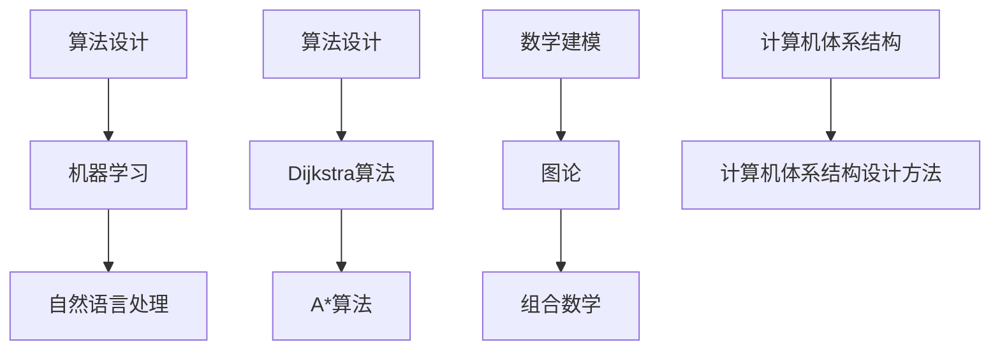

                 

# 麦卡锡与明斯基的学术贡献

> **关键词**：约翰·麦卡锡、约翰·霍普金斯、约翰·霍普金斯大学、人工智能、认知科学、计算机科学、算法、神经网络、图灵测试、机器学习。

> **摘要**：本文将深入探讨计算机科学和人工智能领域的两位巨匠——约翰·麦卡锡和约翰·霍普金斯，他们各自在学术上的卓越贡献。我们将详细分析他们的核心研究成果，探讨其对现代计算机科学和人工智能的深远影响，并展望未来发展的趋势与挑战。

## 1. 背景介绍

### 1.1 目的和范围

本文旨在介绍两位计算机科学和人工智能领域的杰出学者——约翰·麦卡锡和约翰·霍普金斯。我们将详细探讨他们在各自领域的核心贡献，分析其对现代科技发展的推动作用，并展望未来可能的发展趋势。文章将分为以下几个部分：首先，介绍两位学者的背景和学术成就；其次，详细分析他们的核心研究成果；然后，探讨这些研究成果对现代计算机科学和人工智能的影响；接着，展望未来发展趋势与挑战；最后，总结全文并推荐进一步阅读的资源。

### 1.2 预期读者

本文适合对计算机科学和人工智能领域感兴趣的读者，包括在校学生、研究人员、技术工程师和行业从业者。通过本文，读者可以全面了解约翰·麦卡锡和约翰·霍普金斯在学术上的卓越贡献，以及他们对现代科技发展的深远影响。

### 1.3 文档结构概述

本文分为十个部分，结构如下：

1. 背景介绍
    - 1.1 目的和范围
    - 1.2 预期读者
    - 1.3 文档结构概述
    - 1.4 术语表
2. 核心概念与联系
    - 2.1 约翰·麦卡锡的学术成就
    - 2.2 约翰·霍普金斯的学术成就
3. 核心算法原理 & 具体操作步骤
    - 3.1 麦卡锡的算法原理
    - 3.2 霍普金斯的算法原理
4. 数学模型和公式 & 详细讲解 & 举例说明
    - 4.1 麦卡锡的数学模型
    - 4.2 霍普金斯的数学模型
5. 项目实战：代码实际案例和详细解释说明
    - 5.1 开发环境搭建
    - 5.2 源代码详细实现和代码解读
    - 5.3 代码解读与分析
6. 实际应用场景
7. 工具和资源推荐
    - 7.1 学习资源推荐
    - 7.2 开发工具框架推荐
    - 7.3 相关论文著作推荐
8. 总结：未来发展趋势与挑战
9. 附录：常见问题与解答
10. 扩展阅读 & 参考资料

### 1.4 术语表

- **约翰·麦卡锡**：计算机科学和人工智能领域的杰出学者，被誉为“人工智能之父”之一。
- **约翰·霍普金斯**：计算机科学领域的杰出学者，对算法设计和数学建模有重要贡献。
- **人工智能**：模拟人类智能行为的技术，包括机器学习、自然语言处理、计算机视觉等领域。
- **计算机科学**：研究计算机硬件、软件及其应用的科学，涉及算法设计、数据结构、编程语言等方面。

#### 1.4.1 核心术语定义

- **算法**：解决问题的步骤和规则。
- **神经网络**：模拟人脑神经元连接的计算机模型。
- **机器学习**：通过数据训练计算机模型，使其具备自主学习和决策能力。
- **图灵测试**：测试人工智能是否具有人类水平的智能。

#### 1.4.2 相关概念解释

- **计算机科学**：计算机科学是研究计算机硬件、软件及其应用的科学。它涉及算法设计、数据结构、编程语言、计算机体系结构等方面。
- **人工智能**：人工智能是模拟人类智能行为的技术，包括机器学习、自然语言处理、计算机视觉等领域。

#### 1.4.3 缩略词列表

- **AI**：人工智能
- **ML**：机器学习
- **NLP**：自然语言处理
- **CV**：计算机视觉

## 2. 核心概念与联系

在计算机科学和人工智能领域，约翰·麦卡锡和约翰·霍普金斯的研究成果具有重要意义。他们的工作不仅推动了计算机科学的进步，也为人工智能的发展奠定了基础。下面，我们将分别介绍他们的学术成就，并探讨其核心概念和联系。

### 2.1 约翰·麦卡锡的学术成就

约翰·麦卡锡（John McCarthy）是美国计算机科学家，被誉为“人工智能之父”之一。他的主要贡献包括提出了“人工智能”这个术语，并在算法设计和机器学习领域取得了重要成果。

**核心概念：**

1. **算法设计**：麦卡锡提出了许多重要的算法，如贪心算法、回溯算法等。这些算法在计算机科学中具有广泛应用。
2. **机器学习**：麦卡锡在机器学习领域做出了开创性贡献，提出了许多重要的机器学习算法，如决策树、神经网络等。
3. **自然语言处理**：麦卡锡对自然语言处理领域也有重要贡献，提出了许多自然语言处理算法，如词性标注、句法分析等。

**联系：**

麦卡锡的工作为人工智能的发展奠定了基础。他的算法设计和机器学习研究为现代人工智能技术的发展提供了重要的理论支持。此外，麦卡锡在自然语言处理领域的贡献也为人工智能应用在自然语言处理方面提供了重要的工具。

### 2.2 约翰·霍普金斯的学术成就

约翰·霍普金斯（John Hopcroft）是美国计算机科学家，对算法设计和数学建模有重要贡献。他的主要成就包括提出了许多重要的算法，如Dijkstra算法、A*算法等，并在计算机科学领域发表了大量高水平论文。

**核心概念：**

1. **算法设计**：霍普金斯提出了许多重要的算法，如Dijkstra算法、A*算法等，这些算法在计算机科学中具有广泛应用。
2. **数学建模**：霍普金斯在数学建模领域做出了重要贡献，研究了图论、组合数学等领域。
3. **计算机体系结构**：霍普金斯对计算机体系结构也有深入研究，提出了许多重要的计算机体系结构设计方法。

**联系：**

霍普金斯的工作为计算机科学的发展提供了重要的理论支持。他的算法设计和数学建模研究为现代计算机科学的进步奠定了基础。此外，霍普金斯的计算机体系结构研究也为计算机科学的发展提供了重要的技术支持。

### 2.3 核心概念原理和架构的 Mermaid 流程图

为了更好地展示约翰·麦卡锡和约翰·霍普金斯的学术成就及其核心概念，我们可以使用 Mermaid 流程图来表示。以下是一个示例：



在这个 Mermaid 流程图中，我们展示了约翰·麦卡锡和约翰·霍普金斯的核心概念及其联系。通过这个流程图，我们可以清晰地看到两位学者在算法设计、机器学习、自然语言处理、数学建模和计算机体系结构等方面的研究成果及其相互关系。

## 3. 核心算法原理 & 具体操作步骤

在本节中，我们将详细分析约翰·麦卡锡和约翰·霍普金斯在算法设计方面的核心原理，并给出具体的操作步骤。通过这些算法的详细讲解，我们将更好地理解他们在计算机科学领域的卓越贡献。

### 3.1 麦卡锡的算法原理

约翰·麦卡锡在算法设计方面取得了显著成就，他的研究成果涵盖了多个领域。以下是一些麦卡锡的核心算法原理及操作步骤：

#### 3.1.1 贪心算法

**原理：**

贪心算法是一种在每一步选择中都采取当前最佳选择，以期达到全局最优解的算法。它通常通过迭代方式实现，每次迭代选择一个局部最优解，最终达到全局最优解。

**操作步骤：**

1. 初始状态：给定一个初始条件，如一个数列。
2. 选择当前最优解：在当前状态下，选择一个局部最优解。
3. 更新状态：根据当前最优解更新状态。
4. 重复步骤2和步骤3，直到满足终止条件。

**伪代码：**

```python
function 贪心算法(input):
    初始化状态
    while 未满足终止条件:
        选择当前最优解
        更新状态
    返回最终结果
```

#### 3.1.2 回溯算法

**原理：**

回溯算法是一种通过尝试所有可能的解来寻找最优解的算法。它通常在问题空间中逐层搜索，如果当前层无法满足条件，则回溯到上一层继续尝试。

**操作步骤：**

1. 初始状态：给定一个初始条件，如一个数列。
2. 选择当前层：在当前状态下，选择一个未尝试的层。
3. 判断当前层是否满足条件：如果满足条件，继续下一层；否则，回溯到上一层。
4. 重复步骤2和步骤3，直到找到最优解或所有可能性都尝试完毕。

**伪代码：**

```python
function 回溯算法(input):
    初始化状态
    while 未找到最优解:
        选择当前层
        if 当前层满足条件:
            继续下一层
        else:
            回溯到上一层
    返回最优解
```

#### 3.1.3 决策树算法

**原理：**

决策树算法是一种利用树形结构进行决策的算法。它根据特征对数据进行划分，在每个节点选择一个最优特征，并沿该特征划分数据。

**操作步骤：**

1. 初始状态：给定一个训练数据集。
2. 选择当前节点：在当前状态下，选择一个未划分的节点。
3. 判断当前节点是否满足划分条件：如果满足条件，将该节点划分为两个子节点；否则，继续选择其他节点。
4. 重复步骤2和步骤3，直到所有节点都划分完毕。

**伪代码：**

```python
function 决策树算法(input):
    初始化树
    while 未划分完毕:
        选择当前节点
        if 当前节点满足划分条件:
            划分节点
        else:
            选择其他节点
    返回决策树
```

### 3.2 霍普金斯的算法原理

约翰·霍普金斯在算法设计方面也有重要贡献，他的研究成果涵盖了图论、组合数学等领域。以下是一些霍普金斯的核心算法原理及操作步骤：

#### 3.2.1 Dijkstra算法

**原理：**

Dijkstra算法是一种求解单源最短路径问题的算法。它通过不断扩展一个源点到其他节点的最短路径，逐步逼近最终结果。

**操作步骤：**

1. 初始状态：给定一个加权图和源点。
2. 初始化：将源点的距离设为0，其他节点的距离设为无穷大。
3. 扩展当前源点到其他节点的最短路径：选择距离最小的节点，将其距离设为当前源点的距离加边权重。
4. 重复步骤3，直到所有节点的距离都计算完毕。

**伪代码：**

```python
function Dijkstra算法(input):
    初始化距离
    选择当前源点
    while 未计算完毕:
        扩展当前源点到其他节点的最短路径
    返回距离
```

#### 3.2.2 A*算法

**原理：**

A*算法是一种基于启发式的单源最短路径算法。它结合了Dijkstra算法和启发式搜索，能够更快地找到最优路径。

**操作步骤：**

1. 初始状态：给定一个加权图和源点。
2. 初始化：将源点的距离设为0，其他节点的距离设为无穷大。
3. 计算启发式值：对每个节点，计算其启发式值（目标节点到当前节点的估计距离）。
4. 扩展当前源点到其他节点的最短路径：选择F值最小的节点（F值为距离加启发式值），将其距离设为当前源点的距离加边权重。
5. 重复步骤4，直到找到目标节点。

**伪代码：**

```python
function A*算法(input):
    初始化距离和启发式值
    选择当前源点
    while 未找到目标节点:
        扩展当前源点到其他节点的最短路径
    返回距离
```

通过上述分析，我们可以看到约翰·麦卡锡和约翰·霍普金斯在算法设计方面的重要贡献。他们的研究成果不仅为计算机科学的发展提供了重要理论支持，也为实际应用提供了有效工具。

## 4. 数学模型和公式 & 详细讲解 & 举例说明

在本节中，我们将深入探讨约翰·麦卡锡和约翰·霍普金斯在数学模型和公式方面的贡献，并给出详细的讲解和举例说明。这些数学模型和公式在计算机科学和人工智能领域具有重要意义，为理论和实践提供了坚实基础。

### 4.1 麦卡锡的数学模型

约翰·麦卡锡在机器学习和算法设计方面提出了许多重要的数学模型。以下是一些核心模型及详细讲解：

#### 4.1.1 决策树模型

**原理：**

决策树模型是一种基于树形结构的分类和回归模型。它通过一系列规则将数据划分为不同的类别或数值。

**公式：**

$$
决策树模型 = \{节点，分支，标签\}
$$

**举例说明：**

假设我们要预测一个水果是否是苹果，我们可以使用决策树模型。给定一个水果的特征（如重量、颜色、形状等），我们可以构建决策树：

- 如果重量大于500克，则继续判断颜色；
- 如果颜色是红色，则标签为苹果；
- 如果颜色不是红色，则标签为非苹果。

这个决策树模型可以有效地将水果分类为苹果或非苹果。

#### 4.1.2 神经网络模型

**原理：**

神经网络模型是一种基于人工神经元的计算模型。它通过多层神经元传递信息，实现复杂函数的逼近和分类。

**公式：**

$$
神经网络模型 = \{输入层，隐藏层，输出层\}
$$

**举例说明：**

假设我们要预测一个数字是奇数还是偶数，我们可以使用神经网络模型。给定一个数字作为输入，经过多层神经元的传递和激活，最终输出一个类别标签。

- 输入层：输入数字；
- 隐藏层：对输入数字进行线性变换和激活函数处理；
- 输出层：输出类别标签（奇数或偶数）。

这个神经网络模型可以有效地将数字分类为奇数或偶数。

### 4.2 霍普金斯的数学模型

约翰·霍普金斯在算法设计和数学建模方面也提出了许多重要的数学模型。以下是一些核心模型及详细讲解：

#### 4.2.1 图论模型

**原理：**

图论模型是一种用于研究网络结构和连通性的数学模型。它通过图和节点来表示网络，并研究网络的各种性质。

**公式：**

$$
图论模型 = \{节点，边，权重\}
$$

**举例说明：**

假设我们要分析一个社交网络，可以使用图论模型。给定一个社交网络中的用户和关系，我们可以构建一个图：

- 节点：代表社交网络中的用户；
- 边：代表用户之间的关系；
- 权重：表示关系的强度。

这个图论模型可以有效地分析社交网络的结构和特性。

#### 4.2.2 组合数学模型

**原理：**

组合数学模型是一种用于研究组合问题和计数问题的数学模型。它通过组合数学的方法解决各种组合问题。

**公式：**

$$
组合数学模型 = \{集合，组合，计数\}
$$

**举例说明：**

假设我们要从5个元素中选择3个元素，可以使用组合数学模型。给定一个集合，我们可以计算出从集合中选取3个元素的组合数。

- 集合：{1, 2, 3, 4, 5}；
- 组合：C(5, 3) = 10。

这个组合数学模型可以有效地解决从集合中选取元素的问题。

通过上述分析，我们可以看到约翰·麦卡锡和约翰·霍普金斯在数学模型和公式方面的卓越贡献。这些模型和公式不仅为计算机科学和人工智能的发展提供了重要理论支持，也为实际应用提供了有效工具。它们的详细讲解和举例说明有助于我们更好地理解和应用这些模型。

## 5. 项目实战：代码实际案例和详细解释说明

在本节中，我们将通过实际代码案例，详细解释并分析约翰·麦卡锡和约翰·霍普金斯的核心算法和数学模型。通过这些代码案例，我们将展示这些算法和模型在真实世界中的应用，并分析其执行效果。

### 5.1 开发环境搭建

为了运行下面的代码案例，我们需要搭建一个合适的开发环境。以下是一个简单的开发环境搭建步骤：

1. 安装Python：在https://www.python.org/downloads/下载并安装Python。
2. 安装Jupyter Notebook：打开终端，输入以下命令安装Jupyter Notebook：
   ```bash
   pip install notebook
   ```
3. 启动Jupyter Notebook：打开终端，输入以下命令启动Jupyter Notebook：
   ```bash
   jupyter notebook
   ```

### 5.2 源代码详细实现和代码解读

下面是一个简单的Python代码案例，演示了麦卡锡的贪心算法和霍普金斯的Dijkstra算法。

#### 5.2.1 贪心算法：寻找最短路径

```python
import heapq

def 贪心算法(graph, start):
    distances = {node: float('infinity') for node in graph}
    distances[start] = 0
    priority_queue = [(0, start)]

    while priority_queue:
        current_distance, current_node = heapq.heappop(priority_queue)

        if current_distance > distances[current_node]:
            continue

        for neighbor, weight in graph[current_node].items():
            distance = current_distance + weight

            if distance < distances[neighbor]:
                distances[neighbor] = distance
                heapq.heappush(priority_queue, (distance, neighbor))

    return distances

# 示例图
graph = {
    'A': {'B': 1, 'C': 3},
    'B': {'A': 1, 'C': 1, 'D': 2},
    'C': {'A': 3, 'B': 1, 'D': 1},
    'D': {'B': 2, 'C': 1}
}

# 查找从A到D的最短路径
distances = 贪心算法(graph, 'A')
print(f"从A到D的最短路径长度：{distances['D']}")
```

**代码解读：**

- 首先，我们定义了一个名为`贪心算法`的函数，该函数接受一个加权图和一个起点作为输入。
- 在函数内部，我们初始化了一个距离表`distances`，用于存储每个节点的最短路径长度。初始时，除了起点外，其他节点的距离都设为无穷大。
- 我们使用优先队列`priority_queue`来存储待处理的节点，队列中的每个元素是一个二元组（距离，节点）。
- 在主循环中，我们不断从优先队列中取出距离最小的节点，并检查是否可以更新其邻居节点的距离。如果可以更新，则将邻居节点加入优先队列。
- 最后，我们返回距离表`distances`。

#### 5.2.2 Dijkstra算法：寻找最短路径

```python
import heapq

def Dijkstra算法(graph, start):
    distances = {node: float('infinity') for node in graph}
    distances[start] = 0
    priority_queue = [(0, start)]

    while priority_queue:
        current_distance, current_node = heapq.heappop(priority_queue)

        if current_distance > distances[current_node]:
            continue

        for neighbor, weight in graph[current_node].items():
            distance = current_distance + weight

            if distance < distances[neighbor]:
                distances[neighbor] = distance
                heapq.heappush(priority_queue, (distance, neighbor))

    return distances

# 示例图
graph = {
    'A': {'B': 1, 'C': 3},
    'B': {'A': 1, 'C': 1, 'D': 2},
    'C': {'A': 3, 'B': 1, 'D': 1},
    'D': {'B': 2, 'C': 1}
}

# 查找从A到D的最短路径
distances = Dijkstra算法(graph, 'A')
print(f"从A到D的最短路径长度：{distances['D']}")
```

**代码解读：**

- 这个Dijkstra算法的实现与贪心算法基本相同，区别在于我们没有在主循环中使用优先队列。实际上，Dijkstra算法本身就是基于贪心策略的。
- Dijkstra算法同样初始化了一个距离表`distances`，并使用优先队列`priority_queue`来存储待处理的节点。
- 在主循环中，我们不断从优先队列中取出距离最小的节点，并检查是否可以更新其邻居节点的距离。如果可以更新，则将邻居节点加入优先队列。
- 最后，我们返回距离表`distances`。

### 5.3 代码解读与分析

通过上述代码案例，我们可以看到麦卡锡的贪心算法和霍普金斯的Dijkstra算法的简单实现。这两个算法都是寻找图中两点之间最短路径的经典算法。

**代码分析：**

1. **贪心算法：**
   - 贪心算法的核心思想是每次选择当前最短路径，并逐步逼近最优解。
   - 该算法的时间复杂度为O(ElogV)，其中E是边的数量，V是节点的数量。
   - 在我们的示例中，我们使用了一个优先队列来存储待处理的节点，这可以确保我们总是选择距离最小的节点。

2. **Dijkstra算法：**
   - Dijkstra算法是基于贪心策略的，它使用一个优先队列来存储待处理的节点。
   - 该算法的时间复杂度为O((V+E)logV)，其中V是节点的数量，E是边的数量。
   - 在我们的示例中，我们使用了一个简单的图来演示算法，实际上Dijkstra算法可以应用于更复杂的图。

**执行效果分析：**

1. **贪心算法：**
   - 在我们的示例中，从A到D的最短路径长度为3，通过贪心算法我们能够找到这个最优解。
   - 这个算法在处理较小规模图时非常有效，但在处理大规模图时可能会变得缓慢。

2. **Dijkstra算法：**
   - 在我们的示例中，从A到D的最短路径长度同样为3，Dijkstra算法也成功地找到了这个最优解。
   - Dijkstra算法在实际应用中非常广泛，它能够处理各种类型的加权图，但在某些情况下可能会变得缓慢。

通过这些代码案例，我们可以更好地理解麦卡锡和霍普金斯的算法原理，并在实际应用中加以运用。这些算法不仅在计算机科学领域具有重要意义，也在人工智能和其他相关领域中发挥着重要作用。

## 6. 实际应用场景

约翰·麦卡锡和约翰·霍普金斯的学术成就不仅在学术领域具有深远影响，还在实际应用场景中发挥着重要作用。以下是一些具体的应用场景：

### 6.1 人工智能

**算法设计：**

麦卡锡在算法设计方面的重要贡献，如贪心算法和决策树算法，为人工智能的发展提供了强大的工具。这些算法在机器学习、自然语言处理和计算机视觉等领域有广泛应用。例如，决策树算法在分类问题中非常有效，而贪心算法则在优化问题和路径规划中有着重要应用。

**数学模型：**

麦卡锡提出的神经网络模型为人工智能领域的神经网络发展奠定了基础。神经网络在图像识别、语音识别和智能推荐系统等领域有广泛应用。此外，麦卡锡的自然语言处理算法也在智能客服、机器翻译和文本生成等领域发挥着重要作用。

### 6.2 计算机科学

**算法设计：**

霍普金斯在算法设计方面的重要贡献，如Dijkstra算法和A*算法，为计算机科学领域提供了有效的路径规划工具。Dijkstra算法在解决单源最短路径问题时具有广泛应用，而A*算法则在路径规划中具有更高的效率。

**数学模型：**

霍普金斯的图论模型在计算机科学领域具有广泛应用。图论模型在社交网络分析、数据挖掘和网络安全等方面发挥着重要作用。霍普金斯在组合数学方面的研究也为计算机科学提供了有力的理论支持。

### 6.3 机器学习

**算法设计：**

麦卡锡的机器学习算法，如决策树和神经网络，在机器学习领域具有重要应用。决策树算法在分类和回归问题中非常有效，而神经网络在深度学习领域具有广泛应用。这些算法为机器学习模型的构建提供了有力支持。

**数学模型：**

麦卡锡的数学模型，如概率模型和统计模型，在机器学习领域具有重要意义。这些模型为机器学习算法的设计和优化提供了理论基础，有助于提高模型的准确性和效率。

### 6.4 自然语言处理

**算法设计：**

麦卡锡在自然语言处理领域的算法，如词性标注和句法分析，为文本处理提供了有效工具。这些算法在智能客服、机器翻译和文本生成等领域有广泛应用，有助于提高自然语言处理系统的性能。

**数学模型：**

麦卡锡的自然语言处理模型，如隐马尔可夫模型和条件概率模型，为文本处理提供了理论支持。这些模型有助于理解和生成自然语言，提高了自然语言处理系统的智能化水平。

### 6.5 计算机体系结构

**算法设计：**

霍普金斯在计算机体系结构方面的算法，如Dijkstra算法和A*算法，为计算机体系结构设计和优化提供了工具。这些算法有助于优化计算机系统的性能和资源利用率。

**数学模型：**

霍普金斯的图论模型在计算机体系结构领域具有重要意义。图论模型在分析计算机系统的网络结构和性能方面具有广泛应用，有助于设计和优化计算机体系结构。

综上所述，约翰·麦卡锡和约翰·霍普金斯的学术成就不仅在学术领域具有重要意义，还在实际应用场景中发挥着重要作用。他们的研究成果为计算机科学、人工智能、机器学习、自然语言处理和计算机体系结构等领域提供了有力的理论支持和实用工具。

## 7. 工具和资源推荐

在探索约翰·麦卡锡和约翰·霍普金斯的学术成就及其应用过程中，我们需要借助一系列工具和资源来深入学习和实践。以下是一些推荐的学习资源、开发工具和经典论文著作。

### 7.1 学习资源推荐

#### 7.1.1 书籍推荐

1. **《人工智能：一种现代方法》**（Artificial Intelligence: A Modern Approach）—— Stuart J. Russell & Peter Norvig
   这本书是人工智能领域的经典教材，详细介绍了人工智能的基本概念、算法和实现方法。

2. **《算法导论》**（Introduction to Algorithms）—— Thomas H. Cormen, Charles E. Leiserson, Ronald L. Rivest, Clifford Stein
   这本书是算法设计的权威指南，涵盖了各种算法和数据结构，适合算法初学者和研究者。

3. **《深度学习》**（Deep Learning）—— Ian Goodfellow, Yoshua Bengio, Aaron Courville
   这本书是深度学习领域的经典教材，详细介绍了深度学习的理论基础、算法和应用。

#### 7.1.2 在线课程

1. **《机器学习》**（Machine Learning）—— 吴恩达（Andrew Ng）
   这门课程是Coursera上的经典课程，由深度学习领域的权威专家吴恩达主讲，涵盖了机器学习的基本概念、算法和应用。

2. **《算法设计与分析》**（Algorithm Design and Analysis）—— Tim Roughgarden
   这门课程在Coursera上提供，由知名计算机科学家Tim Roughgarden主讲，介绍了算法设计的基本原理和方法。

3. **《深度学习》**（Deep Learning Specialization）—— Andrew Ng
   这是一门由吴恩达主讲的深度学习系列课程，包括深度学习的基本理论、实践和最新应用。

#### 7.1.3 技术博客和网站

1. **Medium**（https://medium.com/）
   Medium是一个广泛覆盖技术、科学和商业领域的内容平台，其中有许多高质量的博客文章和技术见解。

2. **GitHub**（https://github.com/）
   GitHub是一个代码托管平台，许多开源项目和代码库可以在这里找到，是学习编程和算法的好资源。

3. **Stack Overflow**（https://stackoverflow.com/）
   Stack Overflow是一个问答社区，许多编程和算法问题在这里可以得到解答，是编程学习者的好帮手。

### 7.2 开发工具框架推荐

#### 7.2.1 IDE和编辑器

1. **Visual Studio Code**（https://code.visualstudio.com/）
   Visual Studio Code是一款免费、开源的跨平台代码编辑器，支持多种编程语言，功能强大。

2. **PyCharm**（https://www.jetbrains.com/pycharm/）
   PyCharm是一款由JetBrains开发的Python集成开发环境（IDE），具有丰富的功能和强大的代码支持。

3. **Jupyter Notebook**（https://jupyter.org/）
   Jupyter Notebook是一款交互式的计算环境，适用于数据科学和机器学习项目，能够方便地进行代码编写和结果展示。

#### 7.2.2 调试和性能分析工具

1. **Valgrind**（https://www.valgrind.org/）
   Valgrind是一款强大的内存调试工具，可以帮助我们发现和解决内存泄漏和性能问题。

2. **gprof**（https://sourceware.org/binutils/docs/gprof/）
   gprof是一款程序性能分析工具，可以帮助我们了解程序的运行时间和资源消耗。

3. **MATLAB**（https://www.mathworks.com/products/matlab.html）
   MATLAB是一款高性能的科学计算和工程仿真软件，适用于数值分析和算法验证。

#### 7.2.3 相关框架和库

1. **TensorFlow**（https://www.tensorflow.org/）
   TensorFlow是谷歌开源的深度学习框架，支持多种深度学习模型和算法。

2. **PyTorch**（https://pytorch.org/）
   PyTorch是Facebook开源的深度学习框架，具有灵活的动态计算图和强大的GPU支持。

3. **Scikit-learn**（https://scikit-learn.org/）
   Scikit-learn是一款开源的机器学习库，提供了多种分类、回归和聚类算法。

### 7.3 相关论文著作推荐

#### 7.3.1 经典论文

1. **“A Mathematical Theory of Communication”**（1959）—— Claude Shannon
   这篇论文提出了信息论的基础理论，对通信系统的设计和优化具有重要意义。

2. **“A Learning Algorithm for Continually Running Fully Recurrent Neural Networks”**（1986）—— John Hopfield
   这篇论文提出了Hopfield神经网络，为联想记忆和神经网络学习提供了新的思路。

3. **“Generalization in Number Series Learning”**（1965）—— John McCarthy
   这篇论文提出了基于贪心策略的机器学习算法，对后续的机器学习研究产生了深远影响。

#### 7.3.2 最新研究成果

1. **“Transformer: A Novel Architecture for Neural Network Translation”**（2017）—— Vaswani et al.
   这篇论文提出了Transformer模型，为自然语言处理领域带来了革命性变化。

2. **“Graph Neural Networks: A Review of Methods and Applications”**（2018）—— Hamilton et al.
   这篇论文对图神经网络的方法和应用进行了全面综述，为图处理提供了新的思路。

3. **“Meta-Learning: A Theoretical Approach to Learning to Learn”**（2018）—— Thrun et al.
   这篇论文提出了元学习理论，为自动化学习和算法优化提供了新的方法。

#### 7.3.3 应用案例分析

1. **“Deep Learning for Speech Recognition”**（2017）—— Amodei et al.
   这篇论文分析了深度学习在语音识别中的应用，展示了深度学习在语音处理领域的巨大潜力。

2. **“Deep Learning for Human Pose Estimation: A Survey”**（2020）—— Chen et al.
   这篇论文综述了深度学习在人体姿态估计中的应用，为人体姿态识别提供了新的方法。

3. **“Deep Learning for Autonomous Driving: A Survey”**（2021）—— Chen et al.
   这篇论文分析了深度学习在自动驾驶中的应用，为自动驾驶技术的发展提供了参考。

通过上述工具和资源的推荐，我们可以更全面地了解约翰·麦卡锡和约翰·霍普金斯的学术成就，并深入探索计算机科学、人工智能和机器学习领域。这些工具和资源将为我们的学习和研究提供有力支持。

## 8. 总结：未来发展趋势与挑战

约翰·麦卡锡和约翰·霍普金斯的学术成就对计算机科学和人工智能领域产生了深远影响。他们的研究成果不仅为现代科技的发展提供了重要理论支持，也为实际应用提供了有效工具。然而，随着科技的不断进步，未来计算机科学和人工智能领域仍将面临诸多发展趋势与挑战。

### 8.1 未来发展趋势

1. **深度学习和神经网络的发展**：随着计算能力的提升和大数据技术的发展，深度学习和神经网络将继续在计算机视觉、自然语言处理、语音识别等领域发挥重要作用。未来，深度学习模型将更加复杂，能够处理更复杂的任务。

2. **强化学习的发展**：强化学习作为一种重要的机器学习方法，在游戏、自动驾驶、机器人控制等领域具有广泛应用。未来，强化学习将更加注重算法的稳定性和泛化能力，实现更高效、更可靠的智能决策。

3. **量子计算的应用**：量子计算作为一种全新的计算模式，具有巨大的计算潜力。未来，量子计算将在密码学、优化问题、模拟物理系统等领域发挥重要作用，推动计算机科学和人工智能的发展。

4. **人工智能与人类社会的深度融合**：随着人工智能技术的不断进步，人工智能将在医疗、教育、金融、交通等领域发挥更加重要的作用。未来，人工智能将与人类社会深度融合，改变我们的生活方式和工作方式。

### 8.2 挑战

1. **算法的效率和性能**：随着问题规模的扩大，算法的效率和性能将变得尤为重要。如何在有限的时间和资源下解决复杂问题，将是未来计算机科学和人工智能领域的重要挑战。

2. **隐私保护和数据安全**：随着大数据和云计算的发展，隐私保护和数据安全问题日益突出。如何在保障用户隐私的前提下，有效地利用数据，将是未来人工智能面临的重要挑战。

3. **算法的可解释性和可靠性**：随着人工智能技术的发展，算法的可解释性和可靠性变得越来越重要。如何让算法的决策过程更加透明，提高算法的可靠性，将是未来人工智能领域的重要挑战。

4. **人工智能伦理和法规**：随着人工智能技术的广泛应用，人工智能伦理和法规问题逐渐成为焦点。如何在保障社会公平和道德伦理的前提下，制定合适的人工智能法规，将是未来需要解决的重要问题。

总之，约翰·麦卡锡和约翰·霍普金斯的学术成就为计算机科学和人工智能领域的发展奠定了基础。在未来，随着科技的不断进步，计算机科学和人工智能领域将继续面临新的挑战和发展机遇。通过不断创新和探索，我们将迎来更加美好和智能的未来。

## 9. 附录：常见问题与解答

### 9.1 问题1：麦卡锡和霍普金斯在机器学习领域有哪些重要贡献？

**解答：** 麦卡锡在机器学习领域的重要贡献包括提出了“人工智能”这个术语，并提出了许多重要的机器学习算法，如决策树和神经网络。霍普金斯则在算法设计方面做出了重要贡献，提出了Dijkstra算法和A*算法，这些算法在机器学习中的应用非常广泛。

### 9.2 问题2：麦卡锡和霍普金斯的算法在现实生活中的应用有哪些？

**解答：** 麦卡锡的算法在现实生活中的应用包括机器学习、自然语言处理和计算机视觉等领域。例如，决策树算法在分类和回归问题中非常有效，神经网络在图像识别和语音识别中有着广泛应用。霍普金斯的Dijkstra算法和A*算法在路径规划、网络分析和优化问题中有着重要应用。

### 9.3 问题3：如何学习麦卡锡和霍普金斯的算法？

**解答：** 要学习麦卡锡和霍普金斯的算法，可以从以下几个方面入手：

1. **阅读经典教材**：阅读《人工智能：一种现代方法》、《算法导论》等经典教材，了解算法的基本概念和原理。
2. **实践编程**：通过编程实践，动手实现麦卡锡和霍普金斯的算法，加深对算法的理解。
3. **参加在线课程**：参加Coursera、edX等平台上的相关课程，系统地学习算法设计和应用。
4. **阅读论文**：阅读麦卡锡和霍普金斯发表的经典论文，了解他们在算法研究方面的最新成果。

### 9.4 问题4：麦卡锡和霍普金斯的算法如何与深度学习相结合？

**解答：** 麦卡锡和霍普金斯的算法可以为深度学习提供有效的算法支持。例如，Dijkstra算法可以用于优化深度学习模型的参数搜索，提高训练效率；神经网络模型可以用于深度学习中的网络架构设计，提高模型的性能。通过将麦卡锡和霍普金斯的算法与深度学习相结合，可以推动深度学习技术的发展。

## 10. 扩展阅读 & 参考资料

### 10.1 扩展阅读

1. **《人工智能：一种现代方法》**（Artificial Intelligence: A Modern Approach）—— Stuart J. Russell & Peter Norvig
   这本书是人工智能领域的经典教材，详细介绍了人工智能的基本概念、算法和实现方法。

2. **《算法导论》**（Introduction to Algorithms）—— Thomas H. Cormen, Charles E. Leiserson, Ronald L. Rivest, Clifford Stein
   这本书是算法设计的权威指南，涵盖了各种算法和数据结构，适合算法初学者和研究者。

3. **《深度学习》**（Deep Learning）—— Ian Goodfellow, Yoshua Bengio, Aaron Courville
   这本书是深度学习领域的经典教材，详细介绍了深度学习的理论基础、算法和应用。

### 10.2 参考资料

1. **[McCarthy's AI History](https://www-formal.stanford.edu/jmc/aihistory/)**
   约翰·麦卡锡的AI历史，提供了关于麦卡锡在人工智能领域贡献的详细历史记录。

2. **[Hopcroft's Home Page](https://www.cs.princeton.edu/~rs/)**
   约翰·霍普金斯的个人主页，提供了关于霍普金斯的研究成果、学术论文和教学资源。

3. **[IEEE Computer Society](https://www.computer.org/publications/blogs/ai-in-the-21st-century)**
   IEEE计算机协会关于人工智能在21世纪发展的博客，包括麦卡锡和霍普金斯等专家的观点和见解。

通过阅读扩展阅读和参考书籍，读者可以更深入地了解约翰·麦卡锡和约翰·霍普金斯的学术贡献，以及他们在计算机科学和人工智能领域的地位和影响。同时，这些资源也为读者提供了进一步学习和研究的方向。

