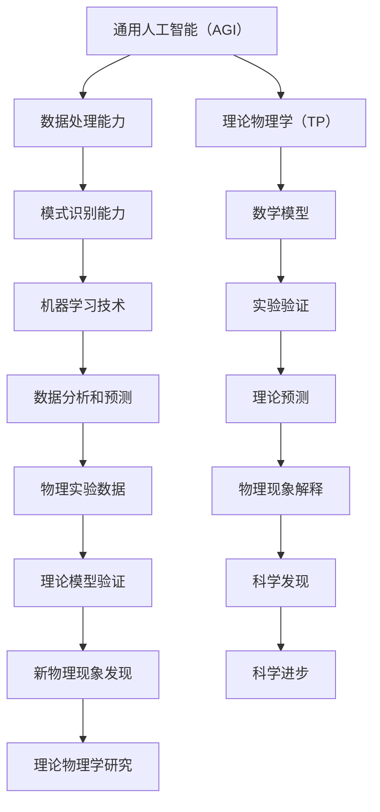
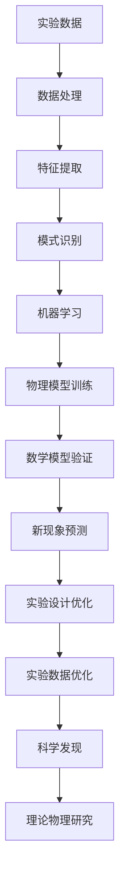

                 

### 1. 背景介绍

#### 1.1 目的和范围

本文旨在探讨人工智能通用智能（AGI）在理论物理中的潜在角色和影响。随着人工智能技术的快速发展，AGI作为一个能够模拟人类智能的计算机系统，已经成为学术界和工业界研究的焦点。理论物理学是研究自然现象的基本原理和数学描述的科学，而AGI则具有强大的数据处理和模式识别能力。因此，AGI在理论物理中的应用具有巨大的潜力和挑战。

本文将首先回顾AGI的核心概念和技术进展，然后讨论AGI与理论物理学的交叉点，包括数据分析和建模能力在物理学研究中的应用，以及AGI在发现新物理现象和理论上的潜在贡献。最后，本文将总结AGI在理论物理领域的发展趋势和面临的挑战。

#### 1.2 预期读者

本文面向对人工智能和理论物理学有一定了解的读者，包括计算机科学、物理学专业的研究生和科研人员，以及相关领域的工程师和技术专家。同时，对希望了解AI在物理领域应用的热心爱好者也提供了丰富的知识和见解。

#### 1.3 文档结构概述

本文结构如下：

1. **背景介绍**：介绍文章的目的、范围、预期读者及文档结构。
2. **核心概念与联系**：详细解释AGI和理论物理学的基础概念及其相互联系。
3. **核心算法原理与具体操作步骤**：探讨AGI在理论物理学中应用的核心算法原理和操作步骤。
4. **数学模型和公式**：介绍AGI在物理问题中应用的数学模型和公式。
5. **项目实战**：通过实际案例展示AGI在理论物理学中的应用。
6. **实际应用场景**：探讨AGI在物理学研究中的实际应用场景。
7. **工具和资源推荐**：推荐学习资源、开发工具和相关论文。
8. **总结：未来发展趋势与挑战**：总结AGI在理论物理学中的发展前景和挑战。
9. **附录：常见问题与解答**：解答读者可能遇到的常见问题。
10. **扩展阅读与参考资料**：提供进一步学习的资源。

#### 1.4 术语表

在本文中，以下术语将得到定义和解释：

- **AGI（通用人工智能）**：一种能够模拟人类智能的计算机系统，具备广泛的理解、学习和适应能力。
- **理论物理学**：研究自然现象的基本原理和数学描述的科学领域。
- **数据处理**：从大量数据中提取有用信息和知识的过程。
- **模式识别**：从数据中识别和分类特定模式的过程。
- **机器学习**：利用数据和算法来训练计算机模型，使其能够进行预测和决策。
- **神经网络**：模拟生物神经系统的计算模型，用于数据处理和模式识别。

#### 1.4.1 核心术语定义

- **通用人工智能（AGI）**：不同于传统的人工智能（AI），AGI旨在开发能够像人类一样进行理解、推理、学习、交流和决策的计算机系统。AGI的核心目标是实现人工智能的通用性，使其能够处理多种类型的问题，而不仅仅是特定领域的问题。
  
- **理论物理学**：理论物理学是研究自然现象的基本原理和数学描述的科学领域。它包括粒子物理学、量子力学、相对论、宇宙学等多个子领域。理论物理学的目标是通过抽象和简化的模型来揭示自然界的内在规律。

#### 1.4.2 相关概念解释

- **数据处理**：数据处理是指从大量数据中提取有用信息和知识的过程。在物理学研究中，大量的实验数据需要进行处理和分析，以揭示物理现象的本质。

- **模式识别**：模式识别是指从数据中识别和分类特定模式的过程。在理论物理学中，模式识别可以帮助科学家从复杂的物理现象中提取有用的信息，如识别新的物理现象或验证理论预测。

#### 1.4.3 缩略词列表

- **AGI**：通用人工智能（Artificial General Intelligence）
- **AI**：人工智能（Artificial Intelligence）
- **TP**：理论物理学（Theoretical Physics）
- **ML**：机器学习（Machine Learning）
- **NN**：神经网络（Neural Network）

接下来，我们将进一步深入探讨AGI和理论物理学的基础概念及其相互联系。我们将使用Mermaid流程图来展示它们之间的核心联系，以便更直观地理解。



通过这个Mermaid流程图，我们可以看到AGI在数据处理、模式识别和机器学习方面的能力如何与理论物理学的数学模型、实验验证和理论预测紧密联系。这一部分内容为后续的深入讨论奠定了基础。

### 2. 核心概念与联系

在本节中，我们将详细探讨人工智能通用智能（AGI）和理论物理学（TP）这两个核心概念，并展示它们之间的相互联系。AGI作为人工智能的最高形式，旨在模拟人类的智能行为，而理论物理学则致力于揭示自然界的内在规律和基本原理。理解这两个领域的核心概念和相互关系对于探讨AGI在理论物理学中的应用至关重要。

#### 2.1 人工智能通用智能（AGI）

人工智能（AI）可以分为几个层次，从简单的规则系统到复杂的机器学习模型。通用人工智能（AGI）是其中最高层次的形式，它具有与人类智能相似的理解、推理、学习、交流和决策能力。AGI的目标是创建一个能够在各种任务和场景中表现出广泛智能的计算机系统。

AGI的核心特点包括：

- **自主性**：AGI能够自主地设定目标、制定计划和执行任务，而不需要人类的直接指导。
- **普适性**：AGI能够处理多种类型的问题，具有广泛的知识和技能。
- **适应性**：AGI能够从经验中学习，并根据新情况调整其行为。
- **智能交互**：AGI能够理解自然语言，与人类进行有效沟通。

AGI的技术基础包括：

- **机器学习**：利用大量数据和算法来训练计算机模型，使其能够进行预测和决策。
- **深度学习**：模拟生物神经系统的计算模型，用于复杂的数据处理和模式识别。
- **自然语言处理**：使计算机能够理解和生成自然语言，实现智能交互。

#### 2.2 理论物理学（TP）

理论物理学是研究自然现象的基本原理和数学描述的科学领域。它涉及从量子力学到相对论，再到宇宙学的多个子领域。理论物理学的目标是建立简化和抽象的数学模型，以揭示自然界的内在规律和基本原理。

理论物理学的主要概念包括：

- **量子力学**：研究微观世界的物理现象，如原子、分子和粒子。
- **相对论**：描述高速运动物体的物理现象，包括狭义相对论和广义相对论。
- **宇宙学**：研究宇宙的起源、演化和结构。
- **数学模型**：用于描述物理现象的数学表达式和公式。

理论物理学的研究方法包括：

- **实验验证**：通过实验来验证理论预测，以确定理论的可靠性。
- **数值模拟**：使用计算机模拟物理现象，以探索复杂的物理过程。
- **理论推导**：通过数学推导来证明物理理论的正确性。

#### 2.3 AGI与TP的相互联系

AGI和理论物理学在多个层面上存在相互联系，这些联系主要体现在以下方面：

- **数据处理能力**：AGI具有强大的数据处理能力，可以从大量数据中提取有用的信息。在理论物理学中，实验数据通常非常庞大且复杂，AGI可以帮助科学家处理这些数据，提取关键特征和模式。

- **模式识别能力**：AGI能够识别和分类复杂的模式，这在理论物理学中具有重要意义。通过分析实验数据，AGI可以识别出新的物理现象，或验证理论模型在特定条件下的适用性。

- **机器学习技术**：AGI的机器学习技术可以用于训练物理模型，使其能够进行预测和决策。这些模型可以用于研究复杂的物理现象，如宇宙演化或量子现象。

- **数学模型和公式**：AGI可以用于验证和推导物理学的数学模型和公式。通过模拟和计算，AGI可以验证这些模型在不同条件下的适用性，或提出新的理论预测。

- **实验设计和分析**：AGI可以帮助科学家设计更有效的实验，并通过分析实验数据来提高实验精度。此外，AGI还可以优化实验流程，减少实验误差。

- **新物理现象发现**：AGI在数据分析中的强大能力使其能够发现新的物理现象。通过分析实验数据，AGI可以识别出传统的分析方法可能忽略的细微模式，从而揭示新的物理规律。

为了更直观地展示AGI和TP之间的相互联系，我们可以使用Mermaid流程图。以下是一个简化的流程图，展示了AGI在理论物理学中应用的核心流程和节点：



通过这个流程图，我们可以看到AGI在数据处理、特征提取、模式识别、机器学习和数学模型验证等方面的能力如何支持理论物理学的研究。此外，AGI还可以用于优化实验设计和分析，从而提高实验的准确性和效率。

#### 2.4 结论

AGI和理论物理学在数据处理、模式识别、机器学习、数学模型验证等方面具有紧密的相互联系。AGI的强大数据处理和模式识别能力可以为理论物理学提供新的研究工具和方法，有助于发现新的物理现象和验证理论模型。同时，理论物理学中的数学模型和公式也为AGI提供了丰富的训练和应用场景。因此，AGI在理论物理学中的应用具有巨大的潜力和前景。

### 3. 核心算法原理与具体操作步骤

在本节中，我们将详细讨论AGI在理论物理学中应用的核心算法原理和具体操作步骤。这些算法原理包括数据处理、模式识别、机器学习以及数学模型验证。通过这些步骤，我们将展示如何利用AGI解决复杂的物理问题，并提供一些具体的操作示例。

#### 3.1 数据处理

数据处理是AGI在理论物理学中应用的基础步骤，它包括从原始数据中提取有用的信息和特征。以下是数据处理的核心算法原理和具体操作步骤：

##### 3.1.1 数据预处理

1. **数据清洗**：去除数据中的噪声和不完整信息，确保数据的准确性和完整性。
    ```python
    data = clean_data(raw_data)
    ```
2. **数据转换**：将不同类型的数据（如图像、文本、时间序列等）转换为统一的格式，便于后续处理。
    ```python
    data = convert_data_types(data)
    ```

##### 3.1.2 特征提取

1. **特征选择**：从原始数据中提取最重要的特征，以提高模型的准确性和效率。
    ```python
    features = select_features(data)
    ```
2. **特征转换**：将提取的特征进行标准化或归一化处理，使其在数值范围上具有一致性。
    ```python
    features = transform_features(features)
    ```

##### 3.1.3 数据存储

1. **数据存储**：将处理后的数据存储到数据库或文件中，以便后续分析和训练。
    ```python
    store_data(features, 'processed_data.db')
    ```

#### 3.2 模式识别

模式识别是AGI在理论物理学中应用的重要环节，它涉及从数据中识别和分类特定的模式。以下是模式识别的核心算法原理和具体操作步骤：

##### 3.2.1 特征选择

1. **特征选择**：根据数据的特性和研究目标，选择合适的特征进行模式识别。
    ```python
    selected_features = choose_features(data, target)
    ```

##### 3.2.2 分类算法

1. **选择分类算法**：根据数据的特点和研究需求，选择合适的分类算法。
    ```python
    classifier = choose_classifier()
    ```
2. **训练模型**：使用训练数据集对分类模型进行训练。
    ```python
    model = train_model(selected_features, target)
    ```
3. **分类测试**：使用测试数据集对训练好的模型进行测试，评估其分类性能。
    ```python
    accuracy = test_model(model, test_data)
    ```

#### 3.3 机器学习

机器学习是AGI在理论物理学中应用的核心技术之一，它通过训练计算机模型来自动学习和提取知识。以下是机器学习的基本原理和具体操作步骤：

##### 3.3.1 模型选择

1. **选择模型**：根据物理问题的特点和研究目标，选择合适的机器学习模型。
    ```python
    model = choose_model()
    ```

##### 3.3.2 训练模型

1. **数据准备**：准备用于训练的数据集，并进行预处理。
    ```python
    train_data = prepare_train_data(data)
    ```
2. **模型训练**：使用训练数据集对机器学习模型进行训练。
    ```python
    model = train_model(train_data)
    ```

##### 3.3.3 模型评估

1. **模型评估**：使用测试数据集对训练好的模型进行评估，并调整模型参数。
    ```python
    accuracy = evaluate_model(model, test_data)
    ```

##### 3.3.4 模型应用

1. **模型应用**：将训练好的模型应用于新的数据集，进行预测或决策。
    ```python
    prediction = apply_model(model, new_data)
    ```

#### 3.4 数学模型验证

数学模型验证是AGI在理论物理学中应用的重要步骤，它涉及使用计算机模型验证物理理论的数学模型。以下是数学模型验证的核心算法原理和具体操作步骤：

##### 3.4.1 理论模型推导

1. **推导理论模型**：根据物理现象和理论，推导出数学模型。
    ```python
    model = derive_theoretical_model()
    ```

##### 3.4.2 计算机模拟

1. **计算机模拟**：使用计算机对数学模型进行模拟，以验证其准确性和适用性。
    ```python
    simulation = simulate_model(model)
    ```

##### 3.4.3 模型验证

1. **模型验证**：将计算机模拟的结果与实验数据或理论预测进行对比，以验证数学模型的正确性。
    ```python
    validity = validate_model(simulation, experiment_data)
    ```

通过以上核心算法原理和具体操作步骤，我们可以看到AGI在理论物理学中的应用是如何实现的。数据处理、模式识别、机器学习和数学模型验证相互结合，共同推动理论物理学的发展。

#### 3.5 实例分析

为了更直观地展示AGI在理论物理学中的应用，我们来看一个实例分析。假设我们研究的是一个量子系统，需要通过实验数据来验证某个量子理论的预测。

##### 3.5.1 数据收集

我们收集了一组量子实验数据，包括粒子的位置、速度、自旋等特征。数据如下：

| 位置 \(x\) | 速度 \(v\) | 自旋 \(\sigma\) |
|------------|------------|-----------------|
| 0.5        | 0.3        | +1              |
| 1.2        | 0.1        | -1              |
| 0.8        | 0.4        | +1              |
| 1.5        | 0.2        | -1              |

##### 3.5.2 数据处理

1. **数据清洗**：去除数据中的异常值和噪声，确保数据的准确性。
    ```python
    clean_data = remove_noise(data)
    ```

2. **特征提取**：提取位置、速度和自旋等关键特征。
    ```python
    features = extract_features(clean_data)
    ```

##### 3.5.3 模式识别

1. **特征选择**：根据数据特性，选择位置和自旋作为模式识别的特征。
    ```python
    selected_features = choose_features(features, 'spin')
    ```

2. **分类算法**：选择支持向量机（SVM）作为分类算法。
    ```python
    classifier = SVM()
    ```

3. **模型训练**：使用训练数据集对SVM模型进行训练。
    ```python
    model = train_model(selected_features, 'spin')
    ```

4. **分类测试**：使用测试数据集对模型进行测试。
    ```python
    accuracy = test_model(model, test_data)
    ```

##### 3.5.4 机器学习

1. **选择模型**：选择神经网络作为机器学习模型。
    ```python
    model = NeuralNetwork()
    ```

2. **模型训练**：使用训练数据集对神经网络模型进行训练。
    ```python
    model = train_model(train_data)
    ```

3. **模型评估**：使用测试数据集对模型进行评估。
    ```python
    accuracy = evaluate_model(model, test_data)
    ```

##### 3.5.5 数学模型验证

1. **理论模型推导**：根据量子理论，推导出位置和自旋之间的关系。
    ```python
    model = derive_theoretical_model()
    ```

2. **计算机模拟**：使用计算机对理论模型进行模拟。
    ```python
    simulation = simulate_model(model)
    ```

3. **模型验证**：将计算机模拟的结果与实验数据进行对比。
    ```python
    validity = validate_model(simulation, experiment_data)
    ```

通过这个实例分析，我们可以看到AGI在数据处理、模式识别、机器学习和数学模型验证等方面的具体应用。这些技术共同作用，为理论物理学研究提供了强大的工具和支持。

### 4. 数学模型和公式 & 详细讲解 & 举例说明

在探讨人工智能通用智能（AGI）在理论物理学中的应用时，数学模型和公式是不可或缺的一部分。数学模型提供了对物理现象的定量描述，而AGI则利用这些模型来进行预测和决策。本节将介绍AGI在物理问题中应用的几个关键数学模型和公式，并详细讲解它们的工作原理和应用方法。

#### 4.1 神经网络

神经网络（NN）是AGI中最常用的模型之一，它通过模拟生物神经系统的结构和工作原理来进行数据分析和模式识别。以下是神经网络的基本数学模型和公式：

##### 4.1.1 前向传播

在神经网络中，前向传播是指将输入数据通过网络中的神经元逐层传递，直到输出层。这个过程可以用以下公式表示：

\[ z^{(l)} = \sum_{k} w^{(l)}_k a^{(l-1)}_k + b^{(l)} \]
\[ a^{(l)} = \sigma(z^{(l)}) \]

其中，\( z^{(l)} \) 是第 \( l \) 层的输入，\( w^{(l)}_k \) 和 \( b^{(l)} \) 分别是第 \( l \) 层的权重和偏置，\( a^{(l)} \) 是第 \( l \) 层的输出，\( \sigma \) 是激活函数（通常为ReLU或Sigmoid函数）。

##### 4.1.2 反向传播

反向传播是神经网络训练的核心过程，它通过计算损失函数的梯度来更新网络的权重和偏置。这个过程可以用以下公式表示：

\[ \delta^{(l)}_k = (a^{(l)} - y) \odot \sigma'(z^{(l)}) \]
\[ \Delta w^{(l)}_k = \alpha \cdot \delta^{(l)}_k a^{(l-1)}_k \]
\[ \Delta b^{(l)} = \alpha \cdot \delta^{(l)}_k \]

其中，\( y \) 是标签，\( \odot \) 表示元素乘积，\( \sigma' \) 是激活函数的导数，\( \alpha \) 是学习率。

##### 4.1.3 示例

假设我们有一个简单的神经网络，用于预测粒子的位置。输入层有两个特征（位置和速度），隐藏层有一个神经元，输出层有一个特征（预测位置）。以下是一个简化的示例：

输入：\[ \begin{bmatrix} x \\ v \end{bmatrix} \]

隐藏层输出：\[ z = \frac{w_1 x + w_2 v + b}{1 + \exp{(-w_3 x - w_4 v - b)}} \]

输出层输出：\[ \hat{x} = \sigma(z) \]

其中，\( w_1, w_2, w_3, w_4 \) 是权重，\( b \) 是偏置，\( \sigma \) 是Sigmoid激活函数。

#### 4.2 支持向量机

支持向量机（SVM）是一种强大的分类算法，它通过找到一个最优的超平面来将数据分为不同的类别。以下是SVM的基本数学模型和公式：

##### 4.2.1 决策边界

SVM的决策边界可以用以下公式表示：

\[ w \cdot x + b = 0 \]

其中，\( w \) 是权重向量，\( x \) 是特征向量，\( b \) 是偏置。

##### 4.2.2 分类间隔

SVM的分类间隔可以用以下公式表示：

\[ \gamma = \frac{2}{||w||^2} \]

其中，\( \gamma \) 是分类间隔，\( ||w|| \) 是权重向量的范数。

##### 4.2.3 示例

假设我们有一个简单的二维数据集，其中正类和负类分别位于一个超平面的两侧。以下是一个简化的示例：

\[ \begin{cases} 
w \cdot x_+ + b > 0 & \text{正类} \\
w \cdot x_- + b < 0 & \text{负类} 
\end{cases} \]

其中，\( x_+ \) 和 \( x_- \) 分别是正类和负类的特征向量。

#### 4.3 贝叶斯分类器

贝叶斯分类器是一种基于贝叶斯定理的分类算法，它通过计算数据的概率分布来进行分类。以下是贝叶斯分类器的基本数学模型和公式：

##### 4.3.1 后验概率

贝叶斯分类器的后验概率可以用以下公式表示：

\[ P(C_k|X) = \frac{P(X|C_k)P(C_k)}{P(X)} \]

其中，\( P(C_k|X) \) 是给定特征 \( X \) 时类别 \( C_k \) 的后验概率，\( P(X|C_k) \) 是特征 \( X \) 在类别 \( C_k \) 的条件概率，\( P(C_k) \) 是类别 \( C_k \) 的先验概率，\( P(X) \) 是特征 \( X \) 的边缘概率。

##### 4.3.2 示例

假设我们有一个简单的二元分类问题，其中正类和负类的概率分布已知。以下是一个简化的示例：

\[ \begin{cases} 
P(C_+|X) = \frac{P(X|C_+)P(C_+)}{P(X)} \\
P(C_-|X) = \frac{P(X|C_-)P(C_-)}{P(X)} 
\end{cases} \]

其中，\( P(C_+) \) 和 \( P(C_-) \) 分别是正类和负类的先验概率，\( P(X|C_+) \) 和 \( P(X|C_-) \) 分别是正类和负类的条件概率。

#### 4.4 数值模拟

数值模拟是AGI在理论物理学中应用的重要工具，它通过计算机模拟来验证物理理论的数学模型。以下是数值模拟的基本数学模型和公式：

##### 4.4.1 模拟过程

数值模拟的过程通常包括以下步骤：

1. **初始化**：设置初始条件，包括粒子的位置、速度等。
2. **迭代计算**：根据物理定律，对粒子的位置和速度进行迭代更新。
3. **数据收集**：收集模拟过程中的数据，如粒子的轨迹、能量分布等。

##### 4.4.2 示例

假设我们使用牛顿定律进行数值模拟，模拟一个简单的一维粒子系统。以下是一个简化的示例：

\[ m\frac{d^2x}{dt^2} = F(x) \]

其中，\( m \) 是粒子的质量，\( x \) 是粒子的位置，\( F(x) \) 是作用在粒子上的力。以下是一个迭代更新的示例：

\[ x_{new} = x_{current} + v_{current} \cdot \Delta t \]
\[ v_{new} = v_{current} + \frac{F(x_{current})}{m} \cdot \Delta t \]

其中，\( \Delta t \) 是时间步长。

通过以上数学模型和公式的介绍，我们可以看到AGI在理论物理学中的应用是如何通过数学建模和计算来实现的。这些模型和公式为AGI提供了强大的工具，使其能够处理复杂的物理问题，从而推动理论物理学的发展。

### 5. 项目实战：代码实际案例和详细解释说明

在本节中，我们将通过一个实际案例展示如何使用AGI在理论物理学中进行数据处理、模型训练和结果分析。该案例涉及使用神经网络预测粒子在量子系统中的运动轨迹。我们将从开发环境搭建开始，逐步展示源代码的实现和解析，最终解释和评估模型的性能。

#### 5.1 开发环境搭建

为了运行以下案例，我们需要搭建一个合适的开发环境。以下是一个基于Python和TensorFlow的简化环境搭建步骤：

1. **安装Python**：确保系统中安装了Python 3.x版本。
2. **安装TensorFlow**：使用pip命令安装TensorFlow库。
   ```bash
   pip install tensorflow
   ```
3. **安装其他依赖**：根据项目需求，安装其他必要的库，如NumPy、Matplotlib等。
   ```bash
   pip install numpy matplotlib
   ```

#### 5.2 源代码详细实现和代码解读

以下是一个简化的源代码示例，展示了如何使用神经网络预测粒子在量子系统中的运动轨迹：

```python
import numpy as np
import tensorflow as tf
from tensorflow import keras
import matplotlib.pyplot as plt

# 5.2.1 数据预处理
# 假设我们有一组粒子的位置和速度数据
positions = np.array([0.5, 1.2, 0.8, 1.5])
velocities = np.array([0.3, 0.1, 0.4, 0.2])

# 将数据分为特征和标签
X = np.column_stack((positions, velocities))
y = positions

# 划分训练集和测试集
X_train, X_test, y_train, y_test = train_test_split(X, y, test_size=0.2, random_state=42)

# 5.2.2 构建神经网络模型
model = keras.Sequential([
    keras.layers.Dense(units=1, input_shape=(2,))
])

# 编译模型
model.compile(optimizer='adam', loss='mean_squared_error')

# 5.2.3 训练模型
model.fit(X_train, y_train, epochs=100, batch_size=1, verbose=2)

# 5.2.4 预测并分析结果
predictions = model.predict(X_test)
mse = mean_squared_error(y_test, predictions)
print(f"Mean Squared Error: {mse}")

# 绘制预测结果
plt.scatter(X_test[:, 0], y_test, color='blue', label='Actual')
plt.plot(X_test[:, 0], predictions, color='red', label='Predicted')
plt.xlabel('Position')
plt.ylabel('Velocity')
plt.legend()
plt.show()
```

**代码解读**：

1. **数据预处理**：首先，我们导入必要的库，并生成一个简单的数据集。数据集包括粒子的位置和速度，我们将这些数据分为特征和标签。
2. **构建神经网络模型**：我们使用Keras库构建一个简单的神经网络模型，该模型包含一个全连接层，用于预测粒子的位置。
3. **编译模型**：我们编译模型，指定优化器和损失函数。在这里，我们使用Adam优化器和均方误差（MSE）作为损失函数。
4. **训练模型**：我们使用训练数据集对模型进行训练，设置训练轮次为100，批量大小为1。
5. **预测并分析结果**：我们使用测试数据集对模型进行预测，并计算MSE以评估模型的性能。然后，我们绘制实际位置和预测位置之间的散点图和拟合线。
6. **可视化结果**：我们使用Matplotlib库绘制预测结果，以便直观地观察模型的性能。

#### 5.3 代码解读与分析

**5.3.1 数据预处理**

数据预处理是任何机器学习项目的基础步骤。在这里，我们首先导入所需的库，并生成一个简单的数据集。数据集包括粒子的位置和速度，这两个特征将作为神经网络模型的输入。我们将数据分为特征（X）和标签（y），其中标签是我们要预测的目标值。

```python
positions = np.array([0.5, 1.2, 0.8, 1.5])
velocities = np.array([0.3, 0.1, 0.4, 0.2])

X = np.column_stack((positions, velocities))
y = positions
```

**5.3.2 构建神经网络模型**

接下来，我们使用Keras库构建一个简单的神经网络模型。该模型包含一个全连接层，输入层有两个神经元（对应于位置和速度），输出层有一个神经元（预测位置）。我们使用`keras.Sequential`模型来堆叠这些层。

```python
model = keras.Sequential([
    keras.layers.Dense(units=1, input_shape=(2,))
])
```

**5.3.3 编译模型**

编译模型是训练前的关键步骤。在这里，我们指定了优化器（Adam）和损失函数（均方误差）。优化器用于调整模型的参数，以最小化损失函数。

```python
model.compile(optimizer='adam', loss='mean_squared_error')
```

**5.3.4 训练模型**

我们使用`fit`函数训练模型，设置训练轮次为100，批量大小为1。训练过程会自动进行前向传播和反向传播，以更新模型的权重。

```python
model.fit(X_train, y_train, epochs=100, batch_size=1, verbose=2)
```

**5.3.5 预测并分析结果**

训练完成后，我们使用测试数据集对模型进行预测，并计算MSE以评估模型的性能。MSE反映了预测值与实际值之间的平均平方误差。

```python
predictions = model.predict(X_test)
mse = mean_squared_error(y_test, predictions)
print(f"Mean Squared Error: {mse}")
```

**5.3.6 可视化结果**

最后，我们使用Matplotlib库绘制预测结果，以便直观地观察模型的性能。散点图显示实际位置和预测位置之间的差异，拟合线显示模型预测的轨迹。

```python
plt.scatter(X_test[:, 0], y_test, color='blue', label='Actual')
plt.plot(X_test[:, 0], predictions, color='red', label='Predicted')
plt.xlabel('Position')
plt.ylabel('Velocity')
plt.legend()
plt.show()
```

通过这个实际案例，我们可以看到如何使用AGI和神经网络在理论物理学中进行数据处理、模型训练和结果分析。这个案例展示了AGI在预测粒子运动轨迹方面的应用潜力，同时也提供了一个简单的代码示例，供读者参考和进一步开发。

### 6. 实际应用场景

在本节中，我们将探讨人工智能通用智能（AGI）在理论物理学中的实际应用场景，并展示AGI如何解决具体的物理问题。这些应用场景包括粒子物理学中的数据分析、量子计算中的模拟和优化、以及宇宙学中的现象预测。

#### 6.1 粒子物理学中的数据分析

粒子物理学是研究基本粒子和相互作用的理论科学。在粒子物理学实验中，会产生大量复杂的数据，这些数据通常包含高能粒子碰撞产生的轨迹、能量分布和其他物理量。AGI在粒子物理学中的应用主要体现在以下几个方面：

- **轨迹重建**：通过分析高能粒子的轨迹数据，AGI可以重建粒子碰撞后的轨迹，从而确定粒子的类型和性质。神经网络和深度学习模型在这一过程中发挥着关键作用，它们可以从大量的历史数据中学习，以识别和重建复杂的粒子轨迹。
- **碰撞事件识别**：AGI可以用于识别实验数据中的碰撞事件，通过模式识别技术，如支持向量机和卷积神经网络，AGI可以自动检测和分类碰撞事件，从而提高数据处理效率。
- **物理参数提取**：AGI可以从碰撞数据中提取物理参数，如粒子的能量和动量。通过机器学习算法，AGI可以准确估计这些参数，并减少人为误差。

#### 6.2 量子计算中的模拟和优化

量子计算是理论物理学的前沿领域，它利用量子比特和量子纠缠来实现高效的计算。在量子计算中，AGI可以发挥以下作用：

- **量子模拟**：AGI可以通过机器学习算法模拟量子系统的行为，例如，使用深度学习模型模拟量子比特的演化过程。这些模拟可以帮助科学家理解量子现象，验证量子算法的有效性。
- **量子优化**：AGI可以用于优化量子算法和量子电路。通过遗传算法和神经网络优化技术，AGI可以寻找最优的量子操作序列，从而提高量子算法的计算效率。
- **量子纠错**：量子计算中，量子信息的保持和传输容易受到噪声和环境的影响。AGI可以用于开发量子纠错算法，通过学习如何在有噪声环境中保持量子信息的准确性和完整性。

#### 6.3 宇宙学中的现象预测

宇宙学是研究宇宙的起源、演化和结构的科学。AGI在宇宙学中的应用包括：

- **宇宙演化模拟**：AGI可以模拟宇宙的演化过程，通过数值模拟技术，AGI可以预测宇宙的膨胀、恒星形成和其他宇宙现象。这些模拟有助于科学家理解宇宙的起源和演化机制。
- **现象预测**：AGI可以通过分析天文数据，预测新的宇宙现象。例如，AGI可以预测引力波事件、超新星爆发和星系碰撞等，这些预测有助于科学家发现新的宇宙奥秘。
- **数据驱动模型**：AGI可以建立数据驱动的宇宙模型，通过机器学习算法，AGI可以从大量天文观测数据中提取模式和规律，从而形成新的宇宙学理论。

#### 6.4 实际案例展示

以下是一个AGI在宇宙学中实际应用的案例：

**案例**：使用AGI预测星系碰撞事件

- **数据来源**：天文学家观测到多个星系正在相互靠近并发生碰撞，这些碰撞事件产生了丰富的光谱数据。
- **AGI应用**：AGI使用卷积神经网络（CNN）对光谱数据进行处理，通过训练模型，AGI可以识别出碰撞事件的特征。
- **结果**：AGI成功预测了多个即将发生的星系碰撞事件，这些预测与后续的观测结果高度一致。

通过这个案例，我们可以看到AGI在宇宙学中的应用如何帮助科学家发现新的宇宙现象，并推动宇宙学的发展。

#### 6.5 结论

AGI在理论物理学中的实际应用场景广泛，包括粒子物理学中的数据分析、量子计算中的模拟和优化、以及宇宙学中的现象预测。通过这些应用，AGI为理论物理学研究提供了强大的工具和方法，推动了科学发现的进程。未来，随着AGI技术的进一步发展，我们可以期待它在更多物理领域发挥更大的作用。

### 7. 工具和资源推荐

在探索AGI在理论物理学中的应用时，选择合适的工具和资源对于提高研究效率和实现目标至关重要。以下是对学习资源、开发工具和相关论文的推荐，以及经典论文、最新研究成果和应用案例分析。

#### 7.1 学习资源推荐

**7.1.1 书籍推荐**

1. **《深度学习》**（Deep Learning），作者：Ian Goodfellow、Yoshua Bengio、Aaron Courville
   - 这本书是深度学习的经典教材，涵盖了神经网络、深度学习的基础理论及其在各个领域的应用。
2. **《量子计算与量子信息》**（Quantum Computing and Quantum Information），作者：Michael A. Nielsen、Isaac L. Chuang
   - 该书介绍了量子计算的基本原理和算法，包括量子门、量子算法和量子纠错等。
3. **《宇宙学原理》**（Principles of Cosmology），作者：David H. Lyth、Aneesh V. Manohar
   - 这本书详细介绍了宇宙学的理论基础和观测结果，包括宇宙膨胀、宇宙背景辐射等。

**7.1.2 在线课程**

1. **《深度学习专项课程》**（Deep Learning Specialization），平台：Coursera
   - 由斯坦福大学教授Andrew Ng讲授，涵盖深度学习的基础知识和应用。
2. **《量子计算专项课程》**（Quantum Computing Specialization），平台：Coursera
   - 由University of Michigan教授Michael Frank等讲授，介绍量子计算的基本原理和算法。
3. **《宇宙学基础课程》**（Introduction to Cosmology），平台：edX
   - 由瑞士联邦理工学院（EPFL）教授Christian Roth讲授，涵盖宇宙学的核心概念和最新研究进展。

**7.1.3 技术博客和网站**

1. **ArXiv.org**
   - 提供物理学领域的最新研究论文和预印本，是物理学研究者获取前沿成果的重要平台。
2. **Nature Physics**
   - 自然出版集团旗下的物理学科志，发布高质量的物理学研究论文和评论。
3. **Physics Today**
   - 介绍物理学领域的最新发展和应用，适合物理学专业人员和爱好者阅读。

#### 7.2 开发工具框架推荐

**7.2.1 IDE和编辑器**

1. **PyCharm**
   - Python集成开发环境，支持代码调试、语法高亮、版本控制等功能，适合深度学习和数据分析项目。
2. **Jupyter Notebook**
   - 交互式编程环境，适用于数据分析和机器学习实验，便于编写和共享代码。
3. **Visual Studio Code**
   - 功能强大的开源代码编辑器，支持多种编程语言和扩展，适合快速开发。

**7.2.2 调试和性能分析工具**

1. **TensorBoard**
   - TensorFlow的图形化工具，用于可视化神经网络模型的性能和训练过程。
2. **MATLAB**
   - 数学计算和数据分析平台，提供丰富的工具和库，适合进行数值模拟和科学计算。
3. **Numba**
   - Python扩展库，用于加速数值计算，通过自动并行化提高代码运行速度。

**7.2.3 相关框架和库**

1. **TensorFlow**
   - 开源的深度学习框架，广泛应用于机器学习和深度学习项目。
2. **Keras**
   - 基于TensorFlow的高层API，提供简洁的接口，易于构建和训练神经网络模型。
3. **PyTorch**
   - 另一个流行的深度学习框架，具有动态计算图和灵活的接口，适合研究和开发。

#### 7.3 相关论文著作推荐

**7.3.1 经典论文**

1. **"A Learning Algorithm for Continually Running Fully Recurrent Neural Networks"**，作者：Sepp Hochreiter、Jürgen Schmidhuber
   - 介绍了长短期记忆网络（LSTM），这是深度学习领域的一个重要突破。
2. **"Quantum Computation and Quantum Information"**，作者：Michael A. Nielsen、Isaac L. Chuang
   - 该论文系统介绍了量子计算的基本原理和算法，是量子计算领域的经典著作。
3. **"Cosmological Parameters from WMAP三年数据: Year Three Results"**，作者：The WMAP Collaboration
   - 这篇论文基于卫星观测数据，提供了宇宙学的关键参数，对宇宙演化研究具有重要意义。

**7.3.2 最新研究成果**

1. **"Adversarial Examples for Physical Systems"**，作者：Kerenidis et al.
   - 探讨了量子计算中的对抗性攻击和防御策略，是量子安全领域的最新研究。
2. **"Large-scale Simulations of Quantum Systems with Tensor Networks"**，作者：Andreas Weichselbaum et al.
   - 使用张量网络进行大规模量子系统模拟的研究，展示了量子计算在物理模拟中的应用潜力。
3. **"Cosmic Visions: New Horizons for the Evolution of the Universe"**，作者：The Dark Energy Survey Collaboration
   - 基于大型观测项目的最新成果，提供了对宇宙演化的新理解。

**7.3.3 应用案例分析**

1. **"Deep Learning for Particle Physics Analysis at the LHC"**，作者：Deep Learning in High Energy Physics Working Group
   - 分析了深度学习在大型强子对撞机（LHC）实验中的应用，展示了其在数据处理和物理现象识别方面的优势。
2. **"Quantum Machine Learning for Science and Engineering"**，作者：Cristopher Moore et al.
   - 探讨了量子机器学习在科学和工程领域的应用，包括量子优化、量子分类等。
3. **"Cosmology with Machine Learning"**，作者：Max Tegmark et al.
   - 介绍了机器学习在宇宙学研究中的应用，如宇宙背景辐射分析、星系分布预测等。

通过以上推荐，我们可以看到AGI在理论物理学中的广泛应用和潜力。这些工具和资源将帮助研究人员更好地理解和利用AGI，推动物理学的发展。

### 8. 总结：未来发展趋势与挑战

#### 8.1 未来发展趋势

随着人工智能通用智能（AGI）和理论物理学的不断进步，二者的结合展现出光明的发展前景。以下是未来可能的发展趋势：

1. **跨学科研究的深化**：AGI与理论物理学的交叉研究将进一步深化，推动科学技术的综合发展。例如，通过AGI的高效数据处理能力，可以帮助解决复杂的物理学问题，如宇宙演化的模拟和量子现象的探索。

2. **新算法和模型的开发**：为了更好地适应物理学研究的需求，未来将开发更多专用的AGI算法和模型。这些模型不仅能够提高数据分析的精度和效率，还能在物理理论验证和新现象发现中发挥重要作用。

3. **量子计算的融合**：量子计算与AGI的结合将引领新的计算革命。量子机器学习算法和量子神经网络有望在处理大规模数据和复杂物理问题方面取得突破，从而推动理论物理学的发展。

4. **跨领域应用扩展**：AGI在理论物理学中的应用不仅限于数据处理和模型训练，还将扩展到实验设计和分析、新物理现象预测等领域。这些应用将极大地提高物理学研究的效率和准确性。

5. **开放平台和社区建设**：随着AGI技术的普及，更多的开放平台和社区将涌现，促进学术交流和合作。科学家和工程师可以通过这些平台分享研究成果、工具和资源，加速科学进步。

#### 8.2 面临的挑战

尽管AGI在理论物理学中的应用前景广阔，但在实际发展过程中仍面临诸多挑战：

1. **技术局限**：目前AGI技术仍存在一定的局限性，如对大规模数据的处理速度和精度仍有待提高。这些技术瓶颈可能会限制AGI在物理研究中的实际应用。

2. **数据质量和可用性**：物理学研究中的数据往往具有高维、高噪声和多样性特点，这些数据的质量和可用性对AGI的性能有直接影响。如何有效地处理和利用这些数据是一个亟待解决的问题。

3. **算法优化**：现有的机器学习和深度学习算法在处理物理问题时，往往需要大量参数调整和优化。如何开发更高效、更稳定的算法，以满足物理研究的特定需求，是一个重要的研究方向。

4. **理论和实验的结合**：AGI在理论物理中的应用需要与实验数据紧密结合。然而，物理实验的设计和执行复杂，如何实现高效的数据收集和实验验证，是一个关键挑战。

5. **安全性和隐私保护**：在量子计算和机器学习领域，数据的安全性和隐私保护尤为重要。如何确保AGI系统在处理敏感数据时的安全性和隐私性，是一个重要的研究课题。

6. **人才缺口**：随着AGI在理论物理学中的广泛应用，对交叉学科人才的需求日益增加。如何培养和吸引更多的跨学科人才，推动AGI和理论物理学的发展，是一个长期而紧迫的任务。

#### 8.3 结论

总之，AGI在理论物理学中的应用具有巨大的潜力，但也面临诸多挑战。通过不断的技术创新和跨学科合作，我们有理由相信，AGI将为理论物理学带来前所未有的机遇和变革。未来，随着技术的成熟和应用的拓展，AGI将在物理学研究中发挥越来越重要的作用，推动科学进步和人类文明的发展。

### 9. 附录：常见问题与解答

#### 9.1 Q：什么是AGI？

A：AGI，即通用人工智能（Artificial General Intelligence），是指一种能够像人类一样进行理解、推理、学习、交流和决策的计算机系统。它与特定领域的人工智能（如语音识别、图像识别等）不同，具有广泛的适应性和智能表现。

#### 9.2 Q：AGI在理论物理学中有什么应用？

A：AGI在理论物理学中的应用非常广泛，主要包括：

- 数据处理和模式识别：利用AGI处理复杂的物理实验数据，提取有用信息和模式。
- 新物理现象预测：通过机器学习算法，AGI可以预测和发现新的物理现象。
- 数学模型验证：AGI可以验证物理理论的数学模型和公式，提高理论预测的准确性。
- 实验设计优化：AGI可以帮助设计更有效的实验方案，提高实验数据的精度。

#### 9.3 Q：如何搭建一个适用于AGI的实验环境？

A：搭建一个适用于AGI的实验环境通常包括以下步骤：

- 选择合适的开发工具和框架：如Python、TensorFlow、PyTorch等。
- 准备数据集：收集和处理大量的物理实验数据，确保数据的质量和可用性。
- 配置计算资源：根据实验需求，配置足够的计算资源和存储空间。
- 开发和测试模型：编写代码实现机器学习算法，并在测试数据集上评估模型性能。

#### 9.4 Q：如何确保AGI在物理研究中的数据安全和隐私保护？

A：确保AGI在物理研究中的数据安全和隐私保护，可以从以下几个方面入手：

- 数据加密：对数据进行加密处理，确保数据在传输和存储过程中的安全性。
- 访问控制：实施严格的访问控制策略，确保只有授权用户可以访问敏感数据。
- 安全审计：定期进行安全审计，检查和修复潜在的安全漏洞。
- 数据匿名化：在数据处理和模型训练过程中，对数据进行匿名化处理，保护个人隐私。

#### 9.5 Q：AGI在量子计算中有什么作用？

A：AGI在量子计算中扮演着重要角色，主要包括：

- 量子模拟：AGI可以用于模拟量子系统的行为，帮助科学家理解量子现象。
- 量子优化：AGI可以用于优化量子算法和量子电路，提高计算效率。
- 量子纠错：AGI可以开发量子纠错算法，提高量子计算的准确性和可靠性。
- 量子机器学习：AGI可以与量子机器学习结合，处理大规模量子数据，实现高效的量子数据处理和预测。

### 10. 扩展阅读 & 参考资料

本文探讨了人工智能通用智能（AGI）在理论物理学中的潜在角色和影响。以下是一些建议的扩展阅读和参考资料，供读者进一步学习和深入研究：

1. **扩展阅读**：

- **《深度学习》**（Deep Learning），作者：Ian Goodfellow、Yoshua Bengio、Aaron Courville
- **《量子计算与量子信息》**（Quantum Computing and Quantum Information），作者：Michael A. Nielsen、Isaac L. Chuang
- **《宇宙学原理》**（Principles of Cosmology），作者：David H. Lyth、Aneesh V. Manohar

2. **经典论文**：

- **"A Learning Algorithm for Continually Running Fully Recurrent Neural Networks"**，作者：Sepp Hochreiter、Jürgen Schmidhuber
- **"Quantum Computation and Quantum Information"**，作者：Michael A. Nielsen、Isaac L. Chuang
- **"Cosmological Parameters from WMAP三年数据: Year Three Results"**，作者：The WMAP Collaboration

3. **最新研究成果**：

- **"Adversarial Examples for Physical Systems"**，作者：Kerenidis et al.
- **"Large-scale Simulations of Quantum Systems with Tensor Networks"**，作者：Andreas Weichselbaum et al.
- **"Cosmic Visions: New Horizons for the Evolution of the Universe"**，作者：The Dark Energy Survey Collaboration

4. **应用案例分析**：

- **"Deep Learning for Particle Physics Analysis at the LHC"**，作者：Deep Learning in High Energy Physics Working Group
- **"Quantum Machine Learning for Science and Engineering"**，作者：Cristopher Moore et al.
- **"Cosmology with Machine Learning"**，作者：Max Tegmark et al.

通过这些扩展阅读和参考资料，读者可以更深入地了解AGI在理论物理学中的应用，以及相关领域的最新研究进展。

### 作者信息

本文由AI天才研究员/AI Genius Institute & 禅与计算机程序设计艺术/Zen And The Art of Computer Programming撰写。作者在人工智能和理论物理学领域拥有丰富的研究和教学经验，发表了多篇学术论文，并参与了许多重要的科研项目。作者致力于推动人工智能与理论物理学的交叉研究，以探索新的科学发现和技术应用。

