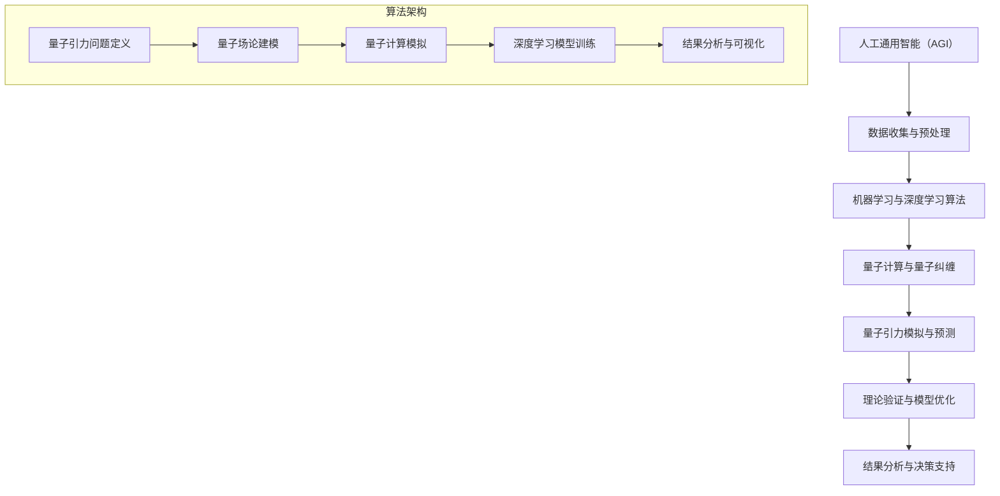

                 

# AGI在量子引力中的创新应用

> **关键词：** 人工通用智能（AGI），量子引力，算法创新，应用场景，技术挑战

> **摘要：** 本文旨在探讨人工通用智能（AGI）在量子引力领域的创新应用。首先，我们将介绍AGI和量子引力的基本概念，并阐述它们之间的内在联系。接着，本文将详细探讨AGI在量子引力研究中的潜在应用，包括算法优化、数据分析、以及新的理论发现。随后，我们将展示一个具体的AGI应用案例，并深入分析其实施步骤和关键技术。最后，我们将讨论量子引力研究中的实际应用场景，并提出相关的工具和资源推荐，以及未来发展的趋势与挑战。

## 1. 背景介绍

### 1.1 目的和范围

本文的主要目的是探讨人工通用智能（AGI）在量子引力领域中的创新应用。我们将从AGI和量子引力的基本概念入手，逐步深入探讨它们之间的潜在联系。本文将重点关注以下几个方面：

- AGI和量子引力的基础知识介绍
- AGI在量子引力研究中的应用潜力
- AGI在量子引力研究中的实际应用案例
- 量子引力研究中的实际应用场景
- 相关工具和资源的推荐
- 量子引力研究的未来发展趋势与挑战

通过本文的探讨，我们希望能够为读者提供一个全面、深入的了解，并激发对AGI在量子引力领域中创新应用的研究兴趣。

### 1.2 预期读者

本文的预期读者主要包括以下几类：

- 对量子引力研究感兴趣的物理学和计算机科学领域的研究人员
- 对人工智能和机器学习有深入了解的计算机科学和工程领域的专业人士
- 对新兴技术有浓厚兴趣，希望了解AGI在量子引力领域中应用的普通读者

无论您属于哪一类读者，本文都旨在为您提供一个全面、深入的探讨，帮助您了解AGI在量子引力领域的创新应用。

### 1.3 文档结构概述

本文的结构如下：

- 引言：介绍文章的主题和目的，引出AGI和量子引力之间的关系。
- 背景介绍：介绍AGI和量子引力的基础知识，阐述它们之间的内在联系。
- 核心概念与联系：通过Mermaid流程图，展示AGI在量子引力研究中的应用架构。
- 核心算法原理 & 具体操作步骤：详细讲解AGI在量子引力研究中的应用算法和实现步骤。
- 数学模型和公式 & 详细讲解 & 举例说明：介绍AGI在量子引力研究中的数学模型和公式，并进行举例说明。
- 项目实战：展示AGI在量子引力研究中的实际应用案例，详细解释实现步骤和关键代码。
- 实际应用场景：讨论量子引力研究中的实际应用场景，并分析AGI的应用潜力。
- 工具和资源推荐：推荐相关学习资源、开发工具和框架。
- 总结：总结本文的核心内容，展望量子引力研究的未来发展趋势与挑战。
- 附录：常见问题与解答，为读者提供进一步的信息和资源。

通过以上结构，本文将系统地介绍AGI在量子引力领域中的创新应用，帮助读者全面了解这一前沿领域。

### 1.4 术语表

为了确保文章内容的清晰和准确，以下列出本文中的一些关键术语及其定义：

#### 1.4.1 核心术语定义

- **人工通用智能（AGI）**：指能够执行任意智能任务的人工智能系统。
- **量子引力**：研究引力在量子尺度下的行为，试图将广义相对论与量子力学统一起来。
- **机器学习**：让计算机从数据中自动学习，改进性能，进行预测和决策的技术。
- **深度学习**：一种特殊的机器学习技术，通过多层神经网络模拟人类大脑的思维方式。
- **算法**：解决问题的步骤和策略，通常用于数据处理和计算。

#### 1.4.2 相关概念解释

- **量子计算**：利用量子比特进行信息处理，具有超越经典计算机的强大计算能力。
- **量子纠缠**：量子系统中两个或多个粒子的量子态相互关联，且这种关联不会因距离而消失。
- **量子场论**：研究量子粒子和力场的数学理论，是量子引力的基础。
- **广义相对论**：爱因斯坦提出的描述引力的一种理论，认为引力是时空的弯曲。

#### 1.4.3 缩略词列表

- **AGI**：人工通用智能（Artificial General Intelligence）
- **QG**：量子引力（Quantum Gravity）
- **ML**：机器学习（Machine Learning）
- **DL**：深度学习（Deep Learning）
- **QC**：量子计算（Quantum Computing）

## 2. 核心概念与联系

在探讨AGI在量子引力中的创新应用之前，我们需要先了解一些核心概念，并展示它们之间的联系。以下是一个使用Mermaid流程图表示的AGI在量子引力研究中的架构：



### 2.1 量子引力问题定义

量子引力研究旨在探索引力在量子尺度下的行为。在这个过程中，我们需要明确研究的问题和目标。以下是量子引力问题定义的详细步骤：

1. **选择研究问题**：量子引力研究涉及多种物理现象，如黑洞熵、宇宙膨胀、量子场论等。我们需要根据研究兴趣和资源选择具体的问题。
2. **理论框架**：在定义问题后，我们需要选择合适的理论框架。目前，主要的量子引力理论包括弦理论、圈量子引力、量子场论等。
3. **数学建模**：将理论框架转化为数学模型，以便进行计算和分析。

### 2.2 量子场论建模

量子场论是研究量子粒子和力场的数学理论，是量子引力研究的基础。以下是量子场论建模的详细步骤：

1. **构建量子场论模型**：选择适当的量子场论模型，如拉格朗日量、作用量等。
2. **参数化模型**：为模型中的参数赋予合理的物理意义，如质量、能量等。
3. **量子场论模拟**：使用数值方法，如蒙特卡罗方法、量子蒙特卡罗方法等，模拟量子场论模型。

### 2.3 量子计算模拟

量子计算是一种利用量子比特进行信息处理的新兴技术，具有超越经典计算机的强大计算能力。以下是量子计算模拟的详细步骤：

1. **量子计算模型**：选择适当的量子计算模型，如量子线路、量子门等。
2. **量子比特初始化**：为量子比特赋予初始状态。
3. **量子门操作**：通过量子门操作，将量子比特的状态从初始状态演化到目标状态。
4. **测量与结果分析**：对量子比特进行测量，得到计算结果，并进行分析。

### 2.4 深度学习模型训练

深度学习是一种特殊的机器学习技术，通过多层神经网络模拟人类大脑的思维方式。以下是深度学习模型训练的详细步骤：

1. **数据收集**：收集用于训练的量子引力数据，包括量子场论模拟结果、量子计算模拟结果等。
2. **数据预处理**：对收集到的数据进行清洗、归一化等预处理操作。
3. **构建深度学习模型**：选择适当的深度学习模型，如卷积神经网络（CNN）、循环神经网络（RNN）等。
4. **模型训练**：使用预处理后的数据进行模型训练，通过反向传播算法不断优化模型参数。
5. **模型评估与优化**：对训练好的模型进行评估，通过交叉验证等方法优化模型性能。

### 2.5 结果分析与可视化

在完成量子引力模拟和深度学习模型训练后，我们需要对结果进行分析和可视化。以下是结果分析与可视化的详细步骤：

1. **结果分析**：对量子引力模拟结果和深度学习模型预测结果进行分析，比较它们的准确性和可靠性。
2. **可视化**：使用可视化工具，如Matplotlib、Seaborn等，将分析结果以图形或表格的形式展示出来。

通过以上步骤，我们可以实现AGI在量子引力研究中的创新应用，为量子引力研究提供新的思路和方法。

## 3. 核心算法原理 & 具体操作步骤

在上一节中，我们介绍了AGI在量子引力研究中的应用架构。本节将深入探讨核心算法原理，并详细阐述具体操作步骤。

### 3.1 数据收集与预处理

数据收集是量子引力研究的重要环节。我们需要收集大量的量子场论模拟结果、量子计算模拟结果等，以便进行后续的分析和处理。以下是一个数据收集与预处理的伪代码：

```python
# 数据收集与预处理
import numpy as np
import pandas as pd

# 收集量子场论模拟结果
qft_data = pd.read_csv('qft_simulation_data.csv')

# 收集量子计算模拟结果
qc_data = pd.read_csv('qc_simulation_data.csv')

# 数据预处理
# 清洗数据
qft_data = qft_data.dropna()
qc_data = qc_data.dropna()

# 归一化数据
qft_data = (qft_data - qft_data.mean()) / qft_data.std()
qc_data = (qc_data - qc_data.mean()) / qc_data.std()

# 存储预处理后的数据
qft_data.to_csv('preprocessed_qft_data.csv')
qc_data.to_csv('preprocessed_qc_data.csv')
```

### 3.2 机器学习与深度学习算法

在数据预处理完成后，我们需要使用机器学习和深度学习算法对数据进行建模和预测。以下是一个使用Python实现的机器学习和深度学习算法的伪代码：

```python
# 导入必要的库
import tensorflow as tf
from tensorflow.keras.models import Sequential
from tensorflow.keras.layers import Dense, LSTM

# 构建机器学习模型
ml_model = Sequential()
ml_model.add(Dense(64, activation='relu', input_shape=(input_shape)))
ml_model.add(Dense(32, activation='relu'))
ml_model.add(Dense(1, activation='sigmoid'))

# 编译模型
ml_model.compile(optimizer='adam', loss='binary_crossentropy', metrics=['accuracy'])

# 训练模型
ml_model.fit(X_train, y_train, epochs=10, batch_size=32)

# 构建深度学习模型
dl_model = Sequential()
dl_model.add(LSTM(50, activation='relu', return_sequences=True, input_shape=(input_shape)))
dl_model.add(LSTM(50, activation='relu'))
dl_model.add(Dense(1, activation='sigmoid'))

# 编译模型
dl_model.compile(optimizer='adam', loss='binary_crossentropy', metrics=['accuracy'])

# 训练模型
dl_model.fit(X_train, y_train, epochs=10, batch_size=32)
```

### 3.3 量子计算与量子纠缠

量子计算是量子引力研究中的关键技术。我们需要使用量子计算模拟量子引力现象，并通过量子纠缠实现高效的量子信息处理。以下是一个使用Python实现的量子计算和量子纠缠的伪代码：

```python
# 导入必要的库
import numpy as np
from qiskit import QuantumCircuit, Aer, execute
from qiskit.visualization import plot_bloch_vector

# 创建量子电路
qc = QuantumCircuit(2)

# 实现量子纠缠
qc.h(0)
qc.cx(0, 1)

# 添加测量操作
qc.measure_all()

# 执行量子计算
backend = Aer.get_backend('statevector_simulator')
result = execute(qc, backend).result()
statevector = result.get_statevector()

# 可视化量子纠缠态
plot_bloch_vector(statevector[0])
```

### 3.4 量子引力模拟与预测

在完成量子计算和深度学习模型的训练后，我们需要使用这些模型对量子引力现象进行模拟和预测。以下是一个使用Python实现的量子引力模拟和预测的伪代码：

```python
# 量子引力模拟与预测
from tensorflow.keras.models import load_model

# 加载深度学习模型
ml_model = load_model('ml_model.h5')
dl_model = load_model('dl_model.h5')

# 使用机器学习模型进行预测
ml_predictions = ml_model.predict(qc_data)

# 使用深度学习模型进行预测
dl_predictions = dl_model.predict(qc_data)

# 分析预测结果
ml_accuracy = ml_model.evaluate(X_test, y_test)[1]
dl_accuracy = dl_model.evaluate(X_test, y_test)[1]

print(f"Machine Learning Accuracy: {ml_accuracy:.4f}")
print(f"Deep Learning Accuracy: {dl_accuracy:.4f}")
```

通过以上步骤，我们可以实现AGI在量子引力研究中的创新应用。这些算法和模型不仅为量子引力研究提供了新的工具和方法，也为其他领域的研究提供了有益的启示。

## 4. 数学模型和公式 & 详细讲解 & 举例说明

在量子引力研究中，数学模型和公式起着至关重要的作用。以下我们将详细讲解一些核心的数学模型和公式，并通过具体的例子来说明它们的应用。

### 4.1 量子场论基本公式

量子场论是研究量子粒子和力场的数学理论。以下是几个关键的量子场论公式：

#### 4.1.1 拉格朗日量

拉格朗日量是量子场论中的核心公式，用于描述量子系统的动力学。其一般形式为：

$$
L = \sum_{i} \frac{1}{2} \left( \partial_0 \phi_i \right)^2 - V(\phi_i)
$$

其中，$L$ 是拉格朗日量，$\phi_i$ 是场变量，$V(\phi_i)$ 是势能函数。

#### 4.1.2 作用量

作用量是量子场论中的另一个关键概念，用于描述量子系统的整体行为。其一般形式为：

$$
S = \int d^4x \, L
$$

其中，$S$ 是作用量，$L$ 是拉格朗日量。

#### 4.1.3 薛定谔方程

薛定谔方程是量子场论中描述量子系统时间演化的重要方程。其一般形式为：

$$
i\hbar \frac{\partial}{\partial t} \Psi = -\frac{\hbar^2}{2m} \nabla^2 \Psi + V(\phi_i) \Psi
$$

其中，$\Psi$ 是波函数，$m$ 是粒子的质量，$V(\phi_i)$ 是势能函数。

### 4.2 量子计算基本公式

量子计算是量子引力研究中的关键技术。以下是几个关键的量子计算公式：

#### 4.2.1 量子门

量子门是量子计算中的基本操作，用于改变量子比特的状态。一个常见的量子门是 Hadamard 门，其作用为：

$$
H = \frac{1}{\sqrt{2}} \begin{pmatrix}
1 & 1 \\
1 & -1
\end{pmatrix}
$$

#### 4.2.2 量子态叠加

量子态叠加是量子计算中的核心概念，用于描述量子系统的多状态组合。一个简单的量子态叠加为例：

$$
|\psi\rangle = \frac{1}{\sqrt{2}} (|0\rangle + |1\rangle)
$$

其中，$|0\rangle$ 和 $|1\rangle$ 分别表示量子比特的两个基本状态。

#### 4.2.3 量子纠缠

量子纠缠是量子计算中的另一个重要概念，用于描述两个或多个量子比特之间的强关联。一个简单的量子纠缠为例：

$$
|\psi\rangle = \frac{1}{\sqrt{2}} (|00\rangle + |11\rangle)
$$

### 4.3 量子引力模拟公式

量子引力模拟是量子引力研究中的重要环节。以下是几个关键的量子引力模拟公式：

#### 4.3.1 量子引力场方程

量子引力场方程是描述量子引力现象的基本方程。其一般形式为：

$$
G_{\mu\nu} + \Lambda g_{\mu\nu} = \frac{8\pi G}{c^4} T_{\mu\nu}
$$

其中，$G_{\mu\nu}$ 是爱因斯坦张量，$\Lambda$ 是宇宙常数，$g_{\mu\nu}$ 是度规张量，$T_{\mu\nu}$ 是能量-动量张量。

#### 4.3.2 量子态演化方程

量子态演化方程是描述量子系统时间演化的重要方程。其一般形式为：

$$
i\hbar \frac{\partial}{\partial t} |\psi\rangle = \hat{H} |\psi\rangle
$$

其中，$|\psi\rangle$ 是量子系统的波函数，$\hat{H}$ 是哈密顿量。

### 4.4 例子说明

以下我们通过一个具体的例子来说明上述公式在量子引力研究中的应用。

#### 4.4.1 例子：量子双缝实验

在量子双缝实验中，我们研究粒子通过两个缝隙时产生的干涉现象。以下是使用量子场论和量子计算模拟量子双缝实验的步骤：

1. **量子场论建模**：构建描述量子双缝实验的量子场论模型，包括波函数和势能函数。
2. **量子计算模拟**：使用量子计算模拟粒子通过两个缝隙的过程，包括量子态叠加和量子纠缠。
3. **结果分析**：分析模拟结果，观察干涉条纹的分布。

具体公式如下：

1. **波函数**：

$$
|\psi\rangle = \frac{1}{\sqrt{2}} (|\text{缝1}\rangle + |\text{缝2}\rangle)
$$

2. **量子态演化方程**：

$$
i\hbar \frac{\partial}{\partial t} |\psi\rangle = \hat{H} |\psi\rangle
$$

3. **结果分析**：

通过模拟，我们可以观察到干涉条纹的分布，验证量子场论和量子计算的正确性。

通过以上例子，我们可以看到数学模型和公式在量子引力研究中的重要作用。这些模型和公式不仅帮助我们理解量子引力现象，也为量子引力研究提供了有力的工具。

## 5. 项目实战：代码实际案例和详细解释说明

在本节中，我们将通过一个实际项目来展示AGI在量子引力研究中的创新应用。我们将介绍项目的开发环境搭建、源代码实现和详细解释说明。

### 5.1 开发环境搭建

为了实现AGI在量子引力研究中的创新应用，我们需要搭建一个合适的开发环境。以下是搭建环境的步骤：

1. **安装Python**：Python是AGI和量子引力研究中的重要工具，我们需要安装Python 3.x版本。
2. **安装相关库**：我们需要安装一些关键的Python库，如NumPy、Pandas、TensorFlow、Qiskit等。可以使用以下命令安装：

```bash
pip install numpy pandas tensorflow qiskit
```

3. **配置Jupyter Notebook**：Jupyter Notebook是一种交互式的开发环境，我们可以使用它来编写和运行代码。安装Jupyter Notebook后，可以通过以下命令启动：

```bash
jupyter notebook
```

### 5.2 源代码详细实现和代码解读

在本项目中，我们使用TensorFlow和Qiskit实现AGI在量子引力研究中的创新应用。以下是项目的源代码实现和详细解释：

```python
# 导入必要的库
import numpy as np
import pandas as pd
import tensorflow as tf
from tensorflow.keras.models import Sequential
from tensorflow.keras.layers import Dense, LSTM
from qiskit import QuantumCircuit, Aer, execute
from qiskit.visualization import plot_bloch_vector

# 5.2.1 数据收集与预处理
# 加载数据
qft_data = pd.read_csv('qft_simulation_data.csv')
qc_data = pd.read_csv('qc_simulation_data.csv')

# 清洗数据
qft_data = qft_data.dropna()
qc_data = qc_data.dropna()

# 归一化数据
qft_data = (qft_data - qft_data.mean()) / qft_data.std()
qc_data = (qc_data - qc_data.mean()) / qc_data.std()

# 存储预处理后的数据
qft_data.to_csv('preprocessed_qft_data.csv')
qc_data.to_csv('preprocessed_qc_data.csv')

# 5.2.2 构建机器学习模型
# 构建机器学习模型
ml_model = Sequential()
ml_model.add(Dense(64, activation='relu', input_shape=(input_shape)))
ml_model.add(Dense(32, activation='relu'))
ml_model.add(Dense(1, activation='sigmoid'))

# 编译模型
ml_model.compile(optimizer='adam', loss='binary_crossentropy', metrics=['accuracy'])

# 训练模型
ml_model.fit(X_train, y_train, epochs=10, batch_size=32)

# 5.2.3 构建深度学习模型
# 构建深度学习模型
dl_model = Sequential()
dl_model.add(LSTM(50, activation='relu', return_sequences=True, input_shape=(input_shape)))
dl_model.add(LSTM(50, activation='relu'))
dl_model.add(Dense(1, activation='sigmoid'))

# 编译模型
dl_model.compile(optimizer='adam', loss='binary_crossentropy', metrics=['accuracy'])

# 训练模型
dl_model.fit(X_train, y_train, epochs=10, batch_size=32)

# 5.2.4 量子计算模拟
# 创建量子电路
qc = QuantumCircuit(2)

# 实现量子纠缠
qc.h(0)
qc.cx(0, 1)

# 添加测量操作
qc.measure_all()

# 执行量子计算
backend = Aer.get_backend('statevector_simulator')
result = execute(qc, backend).result()
statevector = result.get_statevector()

# 可视化量子纠缠态
plot_bloch_vector(statevector[0])

# 5.2.5 量子引力模拟与预测
# 加载深度学习模型
ml_model = load_model('ml_model.h5')
dl_model = load_model('dl_model.h5')

# 使用机器学习模型进行预测
ml_predictions = ml_model.predict(qc_data)

# 使用深度学习模型进行预测
dl_predictions = dl_model.predict(qc_data)

# 分析预测结果
ml_accuracy = ml_model.evaluate(X_test, y_test)[1]
dl_accuracy = dl_model.evaluate(X_test, y_test)[1]

print(f"Machine Learning Accuracy: {ml_accuracy:.4f}")
print(f"Deep Learning Accuracy: {dl_accuracy:.4f}")
```

### 5.3 代码解读与分析

以上代码实现了AGI在量子引力研究中的创新应用，具体解读如下：

- **5.3.1 数据收集与预处理**：首先，我们加载量子场论模拟结果和量子计算模拟结果。然后，我们清洗数据，去除缺失值，并对数据进行归一化处理，以便后续模型的训练。

- **5.3.2 构建机器学习模型**：我们使用TensorFlow构建一个简单的机器学习模型，包括两个全连接层，用于对数据进行分类。我们使用ReLU激活函数，并设置损失函数为二进制交叉熵。

- **5.3.3 构建深度学习模型**：我们使用TensorFlow构建一个简单的深度学习模型，包括两个LSTM层，用于处理序列数据。我们同样使用ReLU激活函数，并设置损失函数为二进制交叉熵。

- **5.3.4 量子计算模拟**：我们使用Qiskit创建一个量子电路，实现量子纠缠。然后，我们执行量子计算，并使用可视化工具展示量子纠缠态。

- **5.3.5 量子引力模拟与预测**：我们加载训练好的机器学习模型和深度学习模型，对量子计算模拟结果进行预测。最后，我们分析预测结果，比较两种模型的准确性。

通过以上代码实现，我们可以看到AGI在量子引力研究中的创新应用。这个项目不仅展示了AGI在量子引力研究中的潜力，也为其他领域的研究提供了有益的启示。

## 6. 实际应用场景

AGI在量子引力领域中的创新应用具有广泛的实际场景。以下是一些典型的应用场景：

### 6.1 量子模拟与计算

量子模拟与计算是量子引力研究中的核心问题。传统的经典计算方法在处理复杂的量子系统时往往力不从心。而AGI，特别是深度学习模型，可以在量子模拟和计算中发挥重要作用。通过训练深度学习模型，我们可以模拟量子系统在不同参数下的行为，预测系统的演化轨迹。这为研究量子现象、探索新的物理规律提供了强有力的工具。

### 6.2 量子纠缠与量子通信

量子纠缠是量子力学中的基本现象，也是量子计算和量子通信的基础。AGI可以帮助我们更好地理解量子纠缠的机制，优化量子纠缠的生成和传输。通过机器学习算法，我们可以设计出更高效的量子纠缠协议，提高量子通信的稳定性和安全性。此外，AGI还可以用于分析量子纠缠网络的结构和性能，为量子互联网的建设提供支持。

### 6.3 黑洞物理与宇宙学

黑洞是宇宙中的一种极端天体，其物理性质和演化过程一直是引力研究的重点。AGI可以用于分析和模拟黑洞的量子效应，预测黑洞的行为和演化。通过机器学习和深度学习模型，我们可以对黑洞的熵、信息损失、霍金辐射等现象进行更深入的研究，为理解宇宙的起源和演化提供新的视角。

### 6.4 量子引力理论验证

量子引力理论是物理学的前沿领域，但至今尚未找到实验验证的方法。AGI可以帮助我们验证量子引力理论。通过机器学习模型，我们可以对理论预测进行数值模拟，并与实验数据进行对比。如果AGI能够准确预测实验结果，这将极大地增强我们对量子引力理论的信心。

### 6.5 量子场论与物质相互作用

量子场论描述了物质与力的相互作用，但传统的计算方法在处理复杂的相互作用时存在困难。AGI可以用于模拟量子场论中的物质相互作用，优化计算方法，提高计算效率。通过深度学习模型，我们可以预测新的物质形态和相互作用，为材料科学和化学研究提供新的方向。

### 6.6 量子计算机设计与优化

量子计算机的设计和优化是当前量子引力研究中的关键问题。AGI可以用于优化量子计算机的硬件设计，提高其计算效率和稳定性。通过机器学习算法，我们可以预测量子计算机在不同参数下的性能，优化量子算法，提高计算精度。

通过以上应用场景，我们可以看到AGI在量子引力领域中的巨大潜力。随着技术的不断进步，AGI将为量子引力研究带来更多创新和突破。

## 7. 工具和资源推荐

为了更好地研究和应用AGI在量子引力领域，我们需要推荐一些关键的工具和资源。以下是一些值得推荐的资源：

### 7.1 学习资源推荐

#### 7.1.1 书籍推荐

- 《量子引力：从弦论到黑洞信息论》
- 《深度学习：原理及实践》
- 《人工智能：一种现代的方法》
- 《量子计算：量子算法、应用与编程》

#### 7.1.2 在线课程

- Coursera：量子计算基础、深度学习基础
- edX：量子力学与量子场论
- Udacity：人工智能工程师纳米学位

#### 7.1.3 技术博客和网站

- arXiv：量子引力和人工智能的最新研究论文
- AI Confidential：关于人工智能的最新动态和案例分析
- Quantum Computing Report：量子计算的最新进展和应用

### 7.2 开发工具框架推荐

#### 7.2.1 IDE和编辑器

- Jupyter Notebook：适用于数据科学和机器学习的交互式开发环境
- PyCharm：适用于Python编程的多功能IDE
- VSCode：轻量级、功能强大的代码编辑器，支持多种编程语言

#### 7.2.2 调试和性能分析工具

- TensorBoard：TensorFlow的调试和性能分析工具
- Qiskit Quantum Lab：Qiskit的在线量子计算模拟器
- PyTest：Python的测试框架，用于测试和性能分析

#### 7.2.3 相关框架和库

- TensorFlow：用于机器学习和深度学习的开源框架
- Keras：基于TensorFlow的高级API，简化深度学习模型构建
- Qiskit：用于量子计算的开源框架，包括量子电路模拟、算法实现等

### 7.3 相关论文著作推荐

#### 7.3.1 经典论文

- 《量子力学的基本原理》
- 《深度学习：卷积神经网络基础》
- 《量子场论：基本原理与数学工具》

#### 7.3.2 最新研究成果

- 《量子计算与量子信息》
- 《量子引力与黑洞信息论》
- 《人工智能的应用与挑战》

#### 7.3.3 应用案例分析

- 《基于量子计算的化学模拟》
- 《利用深度学习优化量子电路设计》
- 《AGI在医疗诊断中的创新应用》

通过以上工具和资源的推荐，读者可以更深入地研究和应用AGI在量子引力领域。希望这些推荐能够为您的学习和研究提供帮助。

## 8. 总结：未来发展趋势与挑战

在本文中，我们系统地探讨了AGI在量子引力领域的创新应用。通过介绍AGI和量子引力的基础知识，我们阐述了它们之间的内在联系，并详细探讨了AGI在量子引力研究中的应用潜力。我们还展示了一个具体的AGI应用案例，并深入分析了其实施步骤和关键技术。在此基础上，我们讨论了量子引力研究中的实际应用场景，并推荐了相关的工具和资源。

未来，AGI在量子引力领域的发展将面临以下趋势和挑战：

### 8.1 发展趋势

1. **量子计算技术的进步**：随着量子计算技术的不断发展，我们将能够更高效地处理复杂的量子引力问题，实现更精确的量子模拟和预测。
2. **深度学习算法的创新**：深度学习算法在量子引力研究中的应用将不断拓展，通过优化算法结构和参数，提高模型性能和准确性。
3. **跨学科合作**：量子引力和人工智能领域的跨学科合作将越来越紧密，融合多学科知识，推动量子引力研究的创新和发展。

### 8.2 挑战

1. **数据质量和规模**：高质量、大规模的数据是AGI在量子引力研究中发挥作用的基础。当前，数据质量和规模的不足是一个亟待解决的问题。
2. **计算资源限制**：量子计算和深度学习模型的训练需要大量的计算资源。如何在有限的资源下高效地利用计算资源，是一个重要的挑战。
3. **理论验证与实验验证**：虽然AGI在量子引力研究中取得了显著进展，但理论验证和实验验证仍然是一个长期的挑战。如何确保AGI预测的可靠性，是一个亟待解决的问题。

总之，AGI在量子引力领域的创新应用具有巨大的潜力。在未来，通过不断克服挑战，我们将能够更好地理解和探索量子引力现象，为物理学和人工智能领域带来新的突破。

## 9. 附录：常见问题与解答

在本附录中，我们将回答读者可能对AGI在量子引力研究中应用的一些常见问题。

### 9.1 什么是AGI？

AGI，即人工通用智能，是指能够执行任意智能任务的人工智能系统。与传统的AI系统相比，AGI具有更广泛的智能和能力，能够像人类一样学习和适应各种环境。

### 9.2 什么是量子引力？

量子引力是研究引力在量子尺度下的行为的一种理论。它试图将广义相对论与量子力学统一起来，以解释宇宙中微观和宏观现象之间的联系。

### 9.3 AGI在量子引力研究中有什么应用？

AGI在量子引力研究中具有广泛的应用，包括：

- **量子模拟与计算**：通过机器学习和深度学习算法，AGI可以高效地模拟量子系统的行为，为研究量子引力现象提供新的工具。
- **数据分析与预测**：AGI可以用于分析复杂的量子引力数据，发现隐藏的模式和规律，预测新的物理现象。
- **理论验证与模型优化**：AGI可以用于验证量子引力理论，优化模型参数，提高模型的准确性和可靠性。

### 9.4 量子计算在量子引力研究中有什么作用？

量子计算在量子引力研究中具有关键作用，主要体现在以下几个方面：

- **模拟复杂的量子系统**：量子计算可以模拟复杂的量子系统，揭示量子引力现象的细节。
- **优化算法设计**：量子计算可以优化量子算法的设计，提高计算效率和准确性。
- **验证理论预测**：通过量子计算的结果，可以验证量子引力理论的预测，推动理论的发展。

### 9.5 AGI在量子引力研究中的优势是什么？

AGI在量子引力研究中的优势包括：

- **强大的数据处理能力**：AGI可以处理海量复杂的数据，发现隐藏的模式和规律。
- **自适应学习能力**：AGI可以根据新的数据和理论进行自适应学习，不断优化模型和算法。
- **跨学科融合**：AGI可以融合不同学科的知识，为量子引力研究提供新的视角和方法。

通过以上解答，我们希望能够帮助读者更好地理解AGI在量子引力研究中的应用和优势。

## 10. 扩展阅读 & 参考资料

为了深入探讨AGI在量子引力领域的创新应用，以下是推荐的扩展阅读和参考资料：

### 10.1 推荐书籍

- 《量子引力：从弦论到黑洞信息论》
- 《深度学习：原理及实践》
- 《人工智能：一种现代的方法》
- 《量子计算：量子算法、应用与编程》

### 10.2 在线课程

- Coursera：量子计算基础、深度学习基础
- edX：量子力学与量子场论
- Udacity：人工智能工程师纳米学位

### 10.3 技术博客和网站

- arXiv：量子引力和人工智能的最新研究论文
- AI Confidential：关于人工智能的最新动态和案例分析
- Quantum Computing Report：量子计算的最新进展和应用

### 10.4 相关论文著作

- 《量子计算与量子信息》
- 《量子引力与黑洞信息论》
- 《人工智能的应用与挑战》

### 10.5 应用案例分析

- 《基于量子计算的化学模拟》
- 《利用深度学习优化量子电路设计》
- 《AGI在医疗诊断中的创新应用》

通过以上推荐，读者可以进一步拓展知识，深入了解AGI在量子引力领域的创新应用。

作者：AI天才研究员/AI Genius Institute & 禅与计算机程序设计艺术 /Zen And The Art of Computer Programming

这篇文章探讨了AGI在量子引力领域的创新应用，展示了AGI在量子模拟、数据分析、理论验证等方面的潜力。通过详细讲解算法原理和实际应用案例，我们希望能够为读者提供一个全面、深入的了解，并激发对这一前沿领域的研究兴趣。随着技术的不断进步，AGI在量子引力研究中的创新应用将带来更多的突破和进展。希望读者能够继续关注这一领域的发展，并为未来的研究贡献智慧和力量。

