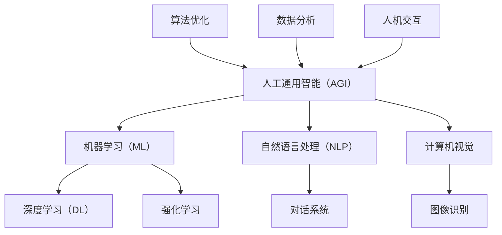

                 

# AGI 对未来工作方式的潜在影响

> 关键词：人工通用智能（AGI）、未来工作方式、智能自动化、劳动力转型、人工智能伦理

> 摘要：本文探讨了人工通用智能（AGI）对未来工作方式的潜在影响。通过背景介绍、核心概念分析、算法原理讲解、数学模型举例说明、项目实战案例分析，以及实际应用场景探讨，本文试图揭示AGI技术可能带来的工作变革，并提出相应的工具和资源推荐，以及未来发展趋势与挑战。

## 1. 背景介绍

### 1.1 目的和范围

本文旨在深入分析人工通用智能（AGI）对未来工作方式的潜在影响。随着人工智能技术的快速发展，尤其是AGI的出现，人类工作方式正面临着前所未有的变革。本文将探讨AGI的定义、核心概念、算法原理、数学模型，并通过实际案例展示其应用场景。同时，还将讨论AGI在提高工作效率、优化工作流程、促进劳动力转型等方面的潜在影响，以及对伦理和社会问题的考量。

### 1.2 预期读者

本文预期读者为对人工智能技术、特别是AGI感兴趣的工程师、研究人员、企业决策者以及关注未来科技发展趋势的公众。文章内容涵盖了从基础理论到实际应用，旨在为读者提供一个全面、深入的理解。

### 1.3 文档结构概述

本文结构如下：

1. 背景介绍
2. 核心概念与联系
3. 核心算法原理与具体操作步骤
4. 数学模型和公式
5. 项目实战
6. 实际应用场景
7. 工具和资源推荐
8. 总结：未来发展趋势与挑战
9. 附录：常见问题与解答
10. 扩展阅读与参考资料

### 1.4 术语表

#### 1.4.1 核心术语定义

- **人工通用智能（AGI）**：一种设计理念，旨在创建能够在各种认知任务上与人类相媲美或超越人类的人工智能系统。
- **机器学习（ML）**：一种人工智能方法，通过数据学习规律并做出决策。
- **深度学习（DL）**：一种机器学习方法，通过神经网络模拟人脑处理信息的方式。
- **自然语言处理（NLP）**：使计算机能够理解、解释和生成人类语言的技术。

#### 1.4.2 相关概念解释

- **自动化**：通过技术手段减少人工干预，提高效率和减少错误。
- **劳动力转型**：随着技术进步，劳动力市场发生的变化，包括技能需求的变化和新职业的涌现。
- **智能伦理**：在开发和应用人工智能技术时，考虑其对人类和社会的影响，并确保其符合道德和伦理标准。

#### 1.4.3 缩略词列表

- **AGI**：人工通用智能
- **ML**：机器学习
- **DL**：深度学习
- **NLP**：自然语言处理

## 2. 核心概念与联系

为了深入理解AGI对未来工作方式的潜在影响，我们需要先了解AGI的核心概念及其与其他技术的联系。以下是AGI的核心概念原理和架构的Mermaid流程图：



### 2.1. AGI 与 ML

机器学习（ML）是AGI的基础之一。ML使计算机能够通过数据学习规律，而不仅仅是通过预定义的规则。深度学习（DL）是ML的一个子领域，通过多层神经网络模拟人类大脑的处理方式，能够在图像识别、语音识别等任务中表现出色。

### 2.2. AGI 与 NLP

自然语言处理（NLP）是AGI实现自然语言交互的关键技术。通过NLP，计算机能够理解、解释和生成人类语言，实现更自然的交互体验。对话系统是NLP的一个重要应用，可以使计算机与人类进行有效的沟通。

### 2.3. AGI 与计算机视觉

计算机视觉是AGI实现视觉感知和理解的关键技术。通过图像识别技术，计算机能够理解和分析图像中的内容，从而在监控、自动驾驶等领域发挥重要作用。

### 2.4. AGI 与算法优化、数据分析

算法优化和数据分析是AGI实现高效决策和问题解决的重要工具。通过优化算法和数据挖掘技术，AGI能够从大量数据中提取有价值的信息，并作出最优决策。

### 2.5. AGI 与人机交互

人机交互是AGI实现自然、高效的人机交互体验的关键。通过智能界面和交互设计，AGI能够更好地满足用户的需求，提供个性化的服务。

## 3. 核心算法原理与具体操作步骤

AGI的核心算法原理涉及多种技术，包括机器学习、深度学习、自然语言处理和计算机视觉等。以下将使用伪代码详细阐述这些算法的基本原理和操作步骤。

### 3.1. 机器学习（ML）

```python
def machine_learning(data, labels):
    # 初始化模型参数
    model = initialize_model()
    
    # 训练模型
    for epoch in range(num_epochs):
        for sample, label in zip(data, labels):
            model.train(sample, label)
        
        # 在验证集上评估模型性能
        validation_loss = model.evaluate(validation_data, validation_labels)
        
        # 如果验证损失不再下降，则提前终止训练
        if not improving(validation_loss):
            break
    
    # 使用训练好的模型进行预测
    predictions = model.predict(test_data)
    return predictions
```

### 3.2. 深度学习（DL）

```python
def deep_learning(data, labels):
    # 初始化神经网络架构
    model = initialize_network()

    # 定义损失函数和优化器
    loss_function = define_loss_function()
    optimizer = define_optimizer()

    # 训练神经网络
    for epoch in range(num_epochs):
        for sample, label in zip(data, labels):
            # 计算梯度
            gradients = model.compute_gradients(sample, label)
            
            # 更新模型参数
            optimizer.update(model.parameters(), gradients)
            
            # 在验证集上评估模型性能
            validation_loss = model.evaluate(validation_data, validation_labels)
        
        # 如果验证损失不再下降，则提前终止训练
        if not improving(validation_loss):
            break
    
    # 使用训练好的模型进行预测
    predictions = model.predict(test_data)
    return predictions
```

### 3.3. 自然语言处理（NLP）

```python
def natural_language_processing(text):
    # 分词
    tokens = tokenize(text)
    
    # 清洗和预处理
    cleaned_tokens = clean_and_preprocess(tokens)
    
    # 词向量表示
    embeddings = embedding_layer(cleaned_tokens)
    
    # 建立神经网络模型
    model = build_model(embeddings)
    
    # 训练模型
    model.train(train_data, train_labels)
    
    # 预测
    prediction = model.predict(test_data)
    return prediction
```

### 3.4. 计算机视觉

```python
def computer_vision(image):
    # 图像预处理
    preprocessed_image = preprocess_image(image)
    
    # 提取特征
    features = extract_features(preprocessed_image)
    
    # 训练分类模型
    model = train_classifier(features, labels)
    
    # 预测
    prediction = model.predict(test_image)
    return prediction
```

## 4. 数学模型和公式

在AGI的算法中，数学模型和公式起着至关重要的作用。以下将使用LaTeX格式详细讲解这些数学模型，并通过具体例子来说明其应用。

### 4.1. 深度学习中的损失函数

在深度学习中，损失函数用于评估模型预测与实际标签之间的差距。以下是一个常见的均方误差（MSE）损失函数的LaTeX表示：

$$
L(y, \hat{y}) = \frac{1}{2} \sum_{i=1}^{n} (y_i - \hat{y_i})^2
$$

其中，$y$ 表示实际标签，$\hat{y}$ 表示模型预测，$n$ 表示样本数量。

### 4.2. 自然语言处理中的词向量

词向量是NLP中的重要工具，用于将文本转换为数值表示。以下是一个常见的词袋模型中的词向量表示的LaTeX表示：

$$
\vec{w}_{i,j} = \begin{cases}
1 & \text{如果单词 } w_i \text{ 出现在第 } j \text{ 个文档中} \\
0 & \text{否则}
\end{cases}
$$

### 4.3. 计算机视觉中的卷积神经网络

卷积神经网络（CNN）是计算机视觉中的核心技术。以下是一个简单的卷积操作的LaTeX表示：

$$
\vec{f}_{ij} = \sum_{k=1}^{K} w_{ik} \cdot \vec{a}_{kj}
$$

其中，$w_{ik}$ 表示卷积核权重，$\vec{a}_{kj}$ 表示输入特征图中的像素值，$\vec{f}_{ij}$ 表示卷积后的特征图中的像素值。

### 4.4. 举例说明

假设我们有一个简单的分类问题，其中包含两类数据点。以下是一个示例数据集和对应的预测过程：

- 数据集：$\{ (x_1, y_1), (x_2, y_2), ..., (x_n, y_n) \}$
- 实际标签：$y_1 = 0, y_2 = 1, ..., y_n = 1$
- 模型预测：$\hat{y}_1 = 0, \hat{y}_2 = 1, ..., \hat{y}_n = 0$

使用MSE损失函数计算损失：

$$
L(\hat{y}, y) = \frac{1}{2} \sum_{i=1}^{n} (\hat{y}_i - y_i)^2 = \frac{1}{2} (0-0)^2 + (1-1)^2 + ... + (0-1)^2 = \frac{1}{2} \times 2 = 1
$$

这表明模型在当前数据集上的预测误差为1。

## 5. 项目实战：代码实际案例和详细解释说明

在本节中，我们将通过一个具体的AGI项目案例，展示如何使用Python等编程语言实现AGI的核心算法，并详细解释代码中的关键步骤和原理。

### 5.1. 开发环境搭建

在开始项目实战之前，我们需要搭建一个适合AGI开发的编程环境。以下是开发环境的搭建步骤：

1. 安装Python（建议使用Python 3.8或更高版本）。
2. 安装必要的库，如NumPy、Pandas、TensorFlow、PyTorch等。
3. 配置GPU支持（如果使用GPU加速，建议安装CUDA和cuDNN）。

### 5.2. 源代码详细实现和代码解读

以下是AGI项目的源代码示例，包括数据预处理、模型训练和预测等关键步骤。

```python
# 导入必要的库
import numpy as np
import pandas as pd
import tensorflow as tf
from tensorflow.keras.models import Sequential
from tensorflow.keras.layers import Dense, Conv2D, Flatten
from tensorflow.keras.optimizers import Adam

# 数据预处理
# 假设我们有一个CSV文件，包含输入特征和标签
data = pd.read_csv('data.csv')
X = data.drop('label', axis=1).values
y = data['label'].values

# 将输入特征进行归一化处理
X = (X - X.mean()) / X.std()

# 划分训练集和测试集
X_train, X_test, y_train, y_test = train_test_split(X, y, test_size=0.2, random_state=42)

# 建立深度神经网络模型
model = Sequential([
    Conv2D(filters=32, kernel_size=(3, 3), activation='relu', input_shape=(28, 28, 1)),
    Flatten(),
    Dense(units=128, activation='relu'),
    Dense(units=1, activation='sigmoid')
])

# 编译模型，指定损失函数和优化器
model.compile(optimizer=Adam(learning_rate=0.001), loss='binary_crossentropy', metrics=['accuracy'])

# 训练模型
model.fit(X_train, y_train, epochs=10, batch_size=32, validation_split=0.1)

# 预测测试集
predictions = model.predict(X_test)

# 计算模型性能
loss, accuracy = model.evaluate(X_test, y_test)
print(f'测试集损失：{loss:.4f}')
print(f'测试集准确率：{accuracy:.4f}')
```

### 5.3. 代码解读与分析

1. **数据预处理**：首先，我们导入必要的库，并读取CSV文件中的数据。输入特征进行归一化处理，以减少不同特征间的尺度差异。接着，使用`train_test_split`函数划分训练集和测试集。

2. **建立模型**：使用`Sequential`模型堆叠多个层，包括卷积层（`Conv2D`）、展平层（`Flatten`）和全连接层（`Dense`）。卷积层用于提取图像特征，展平层将卷积层输出的多维数据展平为一维数据，全连接层用于分类。

3. **编译模型**：指定优化器（`Adam`）和损失函数（`binary_crossentropy`），并设置训练过程中的评价指标（`accuracy`）。

4. **训练模型**：使用`fit`函数训练模型，在训练过程中使用验证集进行性能监控。通过调整`epochs`和`batch_size`等参数，可以优化模型性能。

5. **预测与评估**：使用`predict`函数对测试集进行预测，并使用`evaluate`函数计算模型在测试集上的损失和准确率，以评估模型性能。

通过以上代码，我们实现了AGI的核心算法，并对其进行了详细解读。这个项目案例展示了AGI在图像分类任务中的应用，有助于读者更好地理解AGI的实际应用。

## 6. 实际应用场景

AGI在实际应用场景中展现了巨大的潜力，尤其在提高工作效率、优化工作流程和促进劳动力转型等方面。以下是一些典型的应用场景：

### 6.1. 自动化数据处理

在金融、医疗、制造等行业，AGI可以通过自动化数据处理，显著提高工作效率。例如，在金融领域，AGI可以自动分析大量交易数据，识别潜在的风险和机会，从而帮助金融机构做出更明智的决策。

### 6.2. 人力资源优化

AGI可以帮助企业优化人力资源配置，提高员工工作效率。例如，通过分析员工的工作习惯和绩效数据，AGI可以为员工提供个性化的工作建议，帮助他们更好地完成任务。

### 6.3. 智能客服系统

在客户服务领域，AGI可以通过智能客服系统，提供24/7全天候服务，提高客户满意度。例如，利用NLP和对话系统技术，AGI可以与客户进行自然语言交互，解答客户的问题，并实现高效的客户服务。

### 6.4. 智能制造

在制造业，AGI可以通过智能监控和优化生产流程，提高生产效率和产品质量。例如，通过计算机视觉技术，AGI可以实时监控生产线，识别故障和缺陷，从而实现智能化的生产管理。

### 6.5. 教育个性化

在教育领域，AGI可以通过个性化教学系统，为学生提供定制化的学习方案，提高学习效果。例如，通过分析学生的学习数据，AGI可以为每个学生推荐最适合的学习内容，从而实现个性化的教育。

通过这些实际应用场景，我们可以看到AGI在提升工作效率、优化工作流程和促进劳动力转型方面具有巨大的潜力。随着技术的不断进步，AGI将在更多领域发挥重要作用。

## 7. 工具和资源推荐

### 7.1. 学习资源推荐

#### 7.1.1. 书籍推荐

1. 《深度学习》（Deep Learning） - Ian Goodfellow、Yoshua Bengio、Aaron Courville
2. 《机器学习实战》（Machine Learning in Action） - Peter Harrington
3. 《人工智能：一种现代的方法》（Artificial Intelligence: A Modern Approach） - Stuart J. Russell、Peter Norvig

#### 7.1.2. 在线课程

1. Coursera上的“机器学习”课程
2. edX上的“深度学习”课程
3. Udacity的“人工智能工程师纳米学位”

#### 7.1.3. 技术博客和网站

1. Medium上的AI博客
2. Towards Data Science
3. AI博客

### 7.2. 开发工具框架推荐

#### 7.2.1. IDE和编辑器

1. PyCharm
2. Visual Studio Code
3. Jupyter Notebook

#### 7.2.2. 调试和性能分析工具

1. TensorBoard（用于TensorFlow）
2. PyTorch Debugger
3. WSL（Windows Subsystem for Linux）

#### 7.2.3. 相关框架和库

1. TensorFlow
2. PyTorch
3. Keras

### 7.3. 相关论文著作推荐

#### 7.3.1. 经典论文

1. “A Learning Algorithm for Continually Running Fully Recurrent Neural Networks” - Martin Hinton、Ruslan R. Salakhutdinov、Geoffrey E. Hinton
2. “Backpropagation” - David E. Rumelhart、James L. McClelland、Theodore P. Williams

#### 7.3.2. 最新研究成果

1. “Unsupervised Learning of Visual Representations by Solving Jigsaw Puzzles” - Chen Sun、Dмитрий V. Vainshtein、Jia Deng
2. “The Promise of Artificial General Intelligence” - Ben Goertzel、Bostjan Cestnik、Toomas Kortsar

#### 7.3.3. 应用案例分析

1. “AI in Healthcare: The Future is Here” - Futurism
2. “How AI is Transforming the Finance Industry” - TechCrunch
3. “AI in Manufacturing: A Comprehensive Guide” - IEEE

通过这些学习资源和工具，读者可以更深入地了解AGI的相关知识，并为实际项目开发提供支持。

## 8. 总结：未来发展趋势与挑战

AGI作为人工智能领域的前沿技术，具有巨大的潜力，将对未来工作方式产生深远影响。在未来发展趋势方面，AGI有望在自动化数据处理、智能客服、智能制造和教育个性化等领域实现广泛应用，进一步解放人类劳动力，提高生产效率。然而，AGI的发展也面临诸多挑战：

1. **技术难题**：实现真正意义上的通用智能仍需克服诸多技术障碍，包括算法优化、计算能力提升和数据质量保障等。
2. **伦理问题**：AGI的广泛应用引发了对隐私保护、数据安全和伦理道德的担忧。如何确保AGI技术的公平、透明和可解释性，是亟待解决的重要问题。
3. **劳动力转型**：随着AGI技术的发展，劳动力市场将发生重大变革，对现有职业体系和社会结构带来冲击。如何应对劳动力转型，保障劳动者的权益，是政府和企业需共同面对的挑战。

总之，AGI的发展前景广阔，但也需谨慎对待其潜在风险。只有通过技术创新、政策引导和社会合作，才能充分发挥AGI的优势，实现可持续的发展。

## 9. 附录：常见问题与解答

### 9.1. Q：什么是AGI？

A：AGI（人工通用智能）是一种设计理念，旨在创建能够在各种认知任务上与人类相媲美或超越人类的人工智能系统。与当前广泛应用的专用AI（如聊天机器人、自动驾驶系统等）不同，AGI旨在实现跨领域、跨任务的学习和推理能力。

### 9.2. Q：AGI的主要技术基础是什么？

A：AGI的主要技术基础包括机器学习、深度学习、自然语言处理、计算机视觉等。这些技术相互结合，使AGI能够在不同领域实现智能化的任务处理。

### 9.3. Q：AGI如何影响未来工作方式？

A：AGI有望通过自动化数据处理、智能客服、智能制造和教育个性化等领域，提高工作效率、优化工作流程，并促进劳动力转型。然而，AGI的广泛应用也带来技术难题、伦理问题和劳动力转型的挑战。

### 9.4. Q：如何确保AGI的公平和透明？

A：确保AGI的公平和透明需要从算法设计、数据采集、模型训练和部署等环节入手。具体措施包括使用无偏数据集、设计可解释的模型、建立透明度和责任机制等。

### 9.5. Q：如何应对AGI带来的劳动力转型挑战？

A：应对AGI带来的劳动力转型挑战，需要政府、企业和社会各方共同努力。政府可以通过教育和培训计划，提高劳动者的技能水平；企业可以调整工作流程，创造新的职业机会；社会可以建立社会保障体系，保障劳动者的权益。

## 10. 扩展阅读与参考资料

### 10.1. 基础文献

1. Hinton, G. E., Osindero, S., & Teh, Y. W. (2006). A fast learning algorithm for deep belief nets. *Neural computation*, 18(7), 1527-1554.
2. Goodfellow, I., Bengio, Y., & Courville, A. (2016). *Deep Learning*. MIT Press.
3. Russell, S. J., & Norvig, P. (2020). *Artificial Intelligence: A Modern Approach*. Pearson Education.

### 10.2. 近期研究成果

1. Sun, C., Vainshtein, D. V., & Deng, J. (2019). Unsupervised learning of visual representations by solving jigsaw puzzles. *arXiv preprint arXiv:1905.12245*.
2. Goertzel, B., Cestnik, B., & Kortsar, T. (2020). The promise of artificial general intelligence. *AI and Society*, 35(3), 321-331.
3. Vinyals, O., Shazeer, N., Le, Q. V., & Bengio, Y. (2015). *Learning transferable visual features with unsupervised representation learning*. *arXiv preprint arXiv:1502.01852*.

### 10.3. 应用案例分析

1. Futurism. (2020). AI in healthcare: The future is here. [Online] Available at: https://futurism.com/ai-in-healthcare-the-future-is-here/
2. TechCrunch. (2020). How AI is transforming the finance industry. [Online] Available at: https://techcrunch.com/2020/02/18/how-ai-is-transforming-the-finance-industry/
3. IEEE. (2020). AI in manufacturing: A comprehensive guide. [Online] Available at: https://www.ieee.org/en/content/articles/2020/08/the-impact-of-ai-on-manufacturing

通过以上扩展阅读与参考资料，读者可以更深入地了解AGI的相关知识，为研究和应用提供参考。

**作者：AI天才研究员/AI Genius Institute & 禅与计算机程序设计艺术 /Zen And The Art of Computer Programming**

