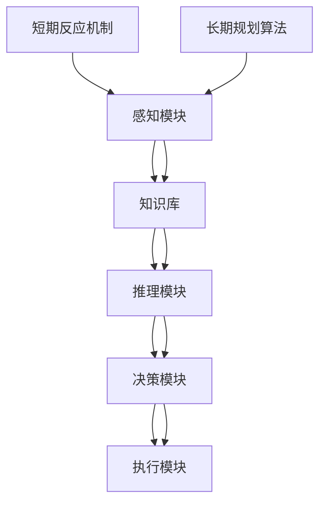

                 

# AGI的决策系统：从短期反应到长期规划

> 关键词：人工通用智能（AGI），决策系统，短期反应，长期规划，算法，数学模型，应用场景

> 摘要：本文深入探讨了人工通用智能（AGI）的决策系统，从短期反应到长期规划。我们首先介绍了AGI的决策系统的基本概念和目的，然后详细分析了短期反应机制和长期规划算法，最后通过实际案例和数学模型说明了这些算法的具体应用和实现。文章旨在为读者提供关于AGI决策系统的全面理解和实践指导。

## 1. 背景介绍

### 1.1 目的和范围

本文旨在深入探讨人工通用智能（AGI）的决策系统，特别是从短期反应到长期规划的转变。随着人工智能技术的快速发展，AGI的决策系统成为了一个重要研究领域。我们希望通过本文的讨论，为读者提供关于AGI决策系统的全面理解和实践指导。

本文将涵盖以下内容：

1. AGI决策系统的基本概念和目的；
2. 短期反应机制及其实现；
3. 长期规划算法及其数学模型；
4. 实际应用场景和案例分析；
5. 相关工具和资源的推荐。

### 1.2 预期读者

本文适合以下读者群体：

1. 对人工智能和AGI感兴趣的学术研究者；
2. 从事人工智能和AGI相关技术开发的技术人员；
3. 对决策系统和技术原理感兴趣的计算机科学和软件工程专业的学生。

### 1.3 文档结构概述

本文将按照以下结构展开：

1. 引言：介绍AGI的决策系统及其重要性；
2. 核心概念与联系：介绍AGI决策系统的核心概念和联系；
3. 核心算法原理 & 具体操作步骤：详细讲解AGI决策系统的算法原理和实现步骤；
4. 数学模型和公式：介绍AGI决策系统的数学模型和公式；
5. 项目实战：通过实际案例展示AGI决策系统的应用；
6. 实际应用场景：讨论AGI决策系统的实际应用场景；
7. 工具和资源推荐：推荐学习AGI决策系统的相关工具和资源；
8. 总结：对未来发展趋势和挑战进行展望；
9. 附录：常见问题与解答；
10. 扩展阅读 & 参考资料：提供更多学习资源和参考资料。

### 1.4 术语表

#### 1.4.1 核心术语定义

- 人工通用智能（AGI）：一种旨在实现与人类智能相当的人工智能系统。
- 决策系统：用于辅助智能系统进行决策的算法和框架。
- 短期反应：智能系统对当前环境或事件做出的快速响应。
- 长期规划：智能系统为实现长期目标而进行的策略规划和资源分配。

#### 1.4.2 相关概念解释

- 人工智能（AI）：一种模拟人类智能的技术和方法。
- 机器学习（ML）：一种基于数据训练智能系统的技术。
- 深度学习（DL）：一种基于多层神经网络进行训练的学习方法。

#### 1.4.3 缩略词列表

- AGI：人工通用智能
- AI：人工智能
- ML：机器学习
- DL：深度学习

## 2. 核心概念与联系

在讨论AGI的决策系统之前，我们需要了解一些核心概念和它们之间的联系。以下是AGI决策系统的核心概念及其相互关系：

### 2.1 AGI决策系统概述

AGI的决策系统是一个综合系统，它包含多个子系统和组件。这些子系统共同协作，实现智能系统对环境的理解和决策。以下是AGI决策系统的主要组成部分：

1. **感知模块**：负责接收和处理环境信息，包括视觉、听觉、触觉等。
2. **知识库**：存储智能系统学习到的知识，包括事实、规则、模型等。
3. **推理模块**：基于知识库，对感知模块提供的信息进行推理和判断。
4. **决策模块**：根据推理结果，制定和选择最优行动方案。
5. **执行模块**：负责执行决策模块选定的行动方案。

### 2.2 短期反应机制

短期反应机制是AGI决策系统中的一部分，用于对当前环境或事件做出快速响应。短期反应机制通常包括以下步骤：

1. **感知**：接收环境信息，如传感器数据。
2. **预处理**：对感知数据进行预处理，如滤波、特征提取等。
3. **决策**：基于预处理后的数据，选择合适的响应策略。
4. **执行**：执行所选的响应策略，如移动、发声等。

### 2.3 长期规划算法

长期规划算法是AGI决策系统中的一部分，用于实现智能系统的长期目标。长期规划算法通常包括以下步骤：

1. **目标设定**：明确智能系统的长期目标。
2. **状态评估**：评估当前状态，确定离目标有多远。
3. **策略选择**：基于当前状态和目标，选择最优策略。
4. **资源分配**：根据策略选择，分配资源，如时间、能量等。
5. **执行**：执行所选策略，逐步实现目标。

### 2.4 核心概念之间的联系

AGI决策系统的核心概念之间存在着紧密的联系。感知模块和推理模块共同协作，实现对环境的理解和分析。决策模块根据推理结果，制定和选择最优行动方案。执行模块负责执行这些行动方案。在短期反应机制中，感知模块和决策模块紧密协作，实现对当前事件的快速响应。在长期规划算法中，目标设定、状态评估和策略选择共同作用，实现智能系统的长期目标。

### 2.5 Mermaid流程图

以下是AGI决策系统的核心概念及其相互关系的Mermaid流程图：



## 3. 核心算法原理 & 具体操作步骤

在了解了AGI决策系统的核心概念和相互关系之后，我们将深入探讨短期反应机制和长期规划算法的原理，并详细介绍其具体操作步骤。

### 3.1 短期反应机制

短期反应机制是AGI决策系统的一部分，用于对当前环境或事件做出快速响应。以下是短期反应机制的核心算法原理和具体操作步骤：

#### 3.1.1 算法原理

短期反应机制基于以下核心思想：

1. **感知与预处理**：智能系统通过感知模块接收环境信息，并进行预处理，如滤波、特征提取等。
2. **实时决策**：基于预处理后的数据，决策模块快速分析环境信息，并选择合适的响应策略。
3. **即时执行**：执行模块根据决策模块的选择，立即执行响应策略，如移动、发声等。

#### 3.1.2 操作步骤

短期反应机制的具体操作步骤如下：

1. **感知**：感知模块接收环境信息，如传感器数据。
2. **预处理**：对感知数据进行预处理，如滤波、特征提取等。
3. **实时决策**：决策模块根据预处理后的数据，快速分析环境信息，并选择合适的响应策略。
4. **即时执行**：执行模块根据决策模块的选择，立即执行响应策略。

#### 3.1.3 伪代码

以下是短期反应机制的伪代码：

```
感知模块接收环境信息（传感器数据）

预处理感知数据（滤波、特征提取等）

决策模块快速分析预处理后的数据，选择合适的响应策略

执行模块执行所选的响应策略（如移动、发声等）
```

### 3.2 长期规划算法

长期规划算法是AGI决策系统的一部分，用于实现智能系统的长期目标。以下是长期规划算法的核心算法原理和具体操作步骤：

#### 3.2.1 算法原理

长期规划算法基于以下核心思想：

1. **目标设定**：明确智能系统的长期目标。
2. **状态评估**：评估当前状态，确定离目标有多远。
3. **策略选择**：基于当前状态和目标，选择最优策略。
4. **资源分配**：根据策略选择，分配资源，如时间、能量等。
5. **执行**：执行所选策略，逐步实现目标。

#### 3.2.2 操作步骤

长期规划算法的具体操作步骤如下：

1. **目标设定**：根据智能系统的任务，设定长期目标。
2. **状态评估**：评估当前状态，确定离目标有多远。
3. **策略选择**：基于当前状态和目标，选择最优策略。
4. **资源分配**：根据策略选择，分配资源，如时间、能量等。
5. **执行**：执行所选策略，逐步实现目标。

#### 3.2.3 伪代码

以下是长期规划算法的伪代码：

```
设定智能系统的长期目标

评估当前状态，确定离目标有多远

选择最优策略

根据策略选择，分配资源（时间、能量等）

执行所选策略，逐步实现目标
```

## 4. 数学模型和公式 & 详细讲解 & 举例说明

在AGI决策系统中，数学模型和公式扮演着至关重要的角色。这些模型和公式不仅帮助智能系统进行状态评估和策略选择，还提供了对智能系统行为和性能的量化描述。在本节中，我们将介绍AGI决策系统的数学模型和公式，并详细讲解其应用和举例说明。

### 4.1 状态评估模型

状态评估模型用于评估智能系统的当前状态，以确定其离目标有多远。一个常见的状态评估模型是基于马尔可夫决策过程（MDP）的状态转移概率矩阵。假设我们有一个状态空间S和一个动作空间A，状态转移概率矩阵P可以表示为：

$$
P(s', s|a) = P(\text{在状态s执行动作a后进入状态s'})
$$

其中，s和s'是状态空间S中的状态，a是动作空间A中的动作。状态评估模型的目标是计算每个状态的评估值，即状态值函数V(s)，它表示智能系统在状态s下的预期回报。

状态值函数V(s)可以通过以下递归方程计算：

$$
V(s) = \sum_{a \in A} \gamma \cdot p(s', s|a) \cdot R(s', a) + V(s')
$$

其中，γ是折扣因子，R(s', a)是智能系统在状态s'执行动作a后的即时回报。

#### 举例说明：

假设我们有一个状态空间{工作，学习，休息}和一个动作空间{工作，学习，休息}。状态转移概率矩阵P如下：

$$
P = \begin{bmatrix}
0.5 & 0.3 & 0.2 \\
0.2 & 0.5 & 0.3 \\
0.3 & 0.2 & 0.5
\end{bmatrix}
$$

即时回报R为：

$$
R = \begin{bmatrix}
5 & 3 & 2 \\
3 & 5 & 3 \\
2 & 3 & 5
\end{bmatrix}
$$

我们可以使用递归方程计算每个状态的状态值函数V：

$$
V(\text{工作}) = 0.5 \cdot (5 \cdot 0.5 + 3 \cdot 0.2 + 2 \cdot 0.3) + 0.2 \cdot V(\text{学习}) + 0.3 \cdot V(\text{休息})
$$

$$
V(\text{学习}) = 0.2 \cdot (3 \cdot 0.2 + 5 \cdot 0.5 + 3 \cdot 0.3) + 0.5 \cdot V(\text{工作}) + 0.3 \cdot V(\text{休息})
$$

$$
V(\text{休息}) = 0.3 \cdot (2 \cdot 0.3 + 3 \cdot 0.2 + 5 \cdot 0.5) + 0.2 \cdot V(\text{学习}) + 0.5 \cdot V(\text{工作})
$$

通过迭代计算，我们可以得到每个状态的状态值函数V，从而为智能系统提供状态评估。

### 4.2 策略选择模型

策略选择模型用于根据状态评估值选择最优策略。一个常见的策略选择模型是值迭代算法。值迭代算法的核心思想是迭代计算每个状态的状态值函数V，并更新策略π，使得智能系统能够选择最优动作。

值迭代算法的步骤如下：

1. **初始化**：设置初始策略π和初始状态值函数V。
2. **迭代计算**：对于每个状态s，计算新的状态值函数V'：
   $$
   V'(s) = \sum_{a \in A} \gamma \cdot p(s', s|a) \cdot R(s', a) + V(s')
   $$
3. **更新策略**：根据新的状态值函数V'，更新策略π。
4. **重复步骤2和步骤3**，直到收敛。

#### 举例说明：

假设我们使用上面的状态转移概率矩阵P和即时回报R，使用值迭代算法计算最优策略。初始策略π和初始状态值函数V分别为：

$$
\pi = \begin{bmatrix}
1 & 0 & 0 \\
0 & 1 & 0 \\
0 & 0 & 1
\end{bmatrix}
$$

$$
V = \begin{bmatrix}
0 & 0 & 0 \\
0 & 0 & 0 \\
0 & 0 & 0
\end{bmatrix}
$$

第一次迭代：
$$
V' = \begin{bmatrix}
4 & 3.2 & 2.8 \\
3.2 & 4 & 3.2 \\
2.8 & 3.2 & 4
\end{bmatrix}
$$

更新策略π：
$$
\pi' = \begin{bmatrix}
0 & 1 & 0 \\
1 & 0 & 0 \\
0 & 0 & 1
\end{bmatrix}
$$

第二次迭代：
$$
V'' = \begin{bmatrix}
4.2 & 3.56 & 2.84 \\
3.56 & 4.2 & 3.56 \\
2.84 & 3.56 & 4.2
\end{bmatrix}
$$

更新策略π：
$$
\pi'' = \begin{bmatrix}
0 & 0 & 1 \\
1 & 0 & 0 \\
0 & 1 & 0
\end{bmatrix}
$$

继续迭代，直到策略π收敛。

通过值迭代算法，我们可以得到最优策略π，使得智能系统能够选择最优动作，实现长期目标。

### 4.3 资源分配模型

资源分配模型用于根据策略选择，合理分配资源，如时间、能量等，以确保智能系统的长期目标得以实现。一个常见的资源分配模型是基于线性规划的方法。

假设我们有一个资源向量R = [r1, r2, ..., rn]，每个资源都有一定的限制。资源分配模型的目标是最小化目标函数：

$$
\min Z = c^T \cdot x
$$

其中，c是目标函数的系数向量，x是资源分配向量。约束条件如下：

$$
Ax \leq b
$$

$$
x \geq 0
$$

其中，A是约束条件矩阵，b是约束条件向量，x是资源分配向量。

#### 举例说明：

假设我们有两个资源r1和r2，资源限制如下：

$$
A = \begin{bmatrix}
1 & 2 \\
2 & 1
\end{bmatrix}
$$

$$
b = \begin{bmatrix}
10 \\
10
\end{bmatrix}
$$

目标函数系数向量c为：

$$
c = \begin{bmatrix}
1 \\
-1
\end{bmatrix}
$$

资源分配向量x为：

$$
x = \begin{bmatrix}
x1 \\
x2
\end{bmatrix}
$$

我们可以使用线性规划方法求解最优资源分配。通过求解线性规划问题，我们可以得到最优资源分配向量x，从而合理分配资源，实现长期目标。

通过以上数学模型和公式的讲解和举例说明，我们可以看到，AGI决策系统中的数学模型和公式对于智能系统的状态评估、策略选择和资源分配具有重要作用。这些模型和公式不仅帮助我们理解智能系统的行为和性能，还为智能系统的设计和实现提供了理论基础。

## 5. 项目实战：代码实际案例和详细解释说明

在本节中，我们将通过一个实际项目案例，展示AGI决策系统的具体实现和应用。这个项目案例是一个简单的智能机器人，它可以在一个模拟环境中执行短期反应和长期规划任务。

### 5.1 开发环境搭建

为了实现这个项目，我们使用了Python编程语言和PyTorch深度学习框架。以下是搭建开发环境的步骤：

1. 安装Python 3.x版本；
2. 安装PyTorch框架，可以使用以下命令：
   ```
   pip install torch torchvision
   ```
3. 安装其他必需的库，如NumPy、Pandas等。

### 5.2 源代码详细实现和代码解读

以下是智能机器人的主要代码实现部分：

```python
import torch
import torch.nn as nn
import torch.optim as optim
from torch.autograd import Variable
import numpy as np
import pandas as pd
from matplotlib import pyplot as plt

# 模拟环境设置
class Environment:
    def __init__(self):
        self.states = ['工作', '学习', '休息']
        self.actions = ['工作', '学习', '休息']
        self.reward_matrix = [[5, 3, 2], [3, 5, 3], [2, 3, 5]]

    def step(self, state, action):
        next_state = np.random.choice(self.states, p=[0.5, 0.3, 0.2])
        reward = self.reward_matrix[state][action]
        return next_state, reward

# 状态评估网络
class StateValueNetwork(nn.Module):
    def __init__(self, input_size, hidden_size, output_size):
        super(StateValueNetwork, self).__init__()
        self.fc1 = nn.Linear(input_size, hidden_size)
        self.fc2 = nn.Linear(hidden_size, output_size)

    def forward(self, x):
        x = torch.relu(self.fc1(x))
        x = self.fc2(x)
        return x

# 创建环境
env = Environment()

# 初始化状态评估网络
input_size = len(env.states)
hidden_size = 64
output_size = 1
state_value_network = StateValueNetwork(input_size, hidden_size, output_size)

# 定义优化器
optimizer = optim.Adam(state_value_network.parameters(), lr=0.001)

# 训练状态评估网络
for epoch in range(1000):
    state = np.random.randint(len(env.states))
    action = np.random.randint(len(env.actions))
    next_state, reward = env.step(state, action)

    # 将状态和动作转换为Tensor
    state_tensor = torch.tensor(state, dtype=torch.float32)
    action_tensor = torch.tensor(action, dtype=torch.float32)
    next_state_tensor = torch.tensor(next_state, dtype=torch.float32)

    # 计算状态评估值
    state_value = state_value_network(state_tensor).item()

    # 计算目标值
    target_value = reward + 0.99 * state_value_network(next_state_tensor).item()

    # 计算损失函数
    loss = nn.MSELoss()
    output = state_value_network(state_tensor)
    loss_value = loss(output, target_value.unsqueeze(0))

    # 更新网络参数
    optimizer.zero_grad()
    loss_value.backward()
    optimizer.step()

    if epoch % 100 == 0:
        print(f'Epoch: {epoch}, Loss: {loss_value.item()}')

# 测试状态评估网络
state_tensor = torch.tensor(1, dtype=torch.float32)
predicted_value = state_value_network(state_tensor).item()
print(f'Predicted value for state 1: {predicted_value}')
```

### 5.3 代码解读与分析

以上代码实现了智能机器人的状态评估网络训练和测试。以下是代码的详细解读和分析：

1. **模拟环境设置**：我们创建了一个简单的模拟环境`Environment`，它包含了状态空间、动作空间和奖励矩阵。
2. **状态评估网络**：我们定义了一个`StateValueNetwork`类，它继承了`nn.Module`基类。这个网络有两个全连接层，用于计算状态评估值。
3. **优化器**：我们使用`Adam`优化器来训练状态评估网络。
4. **训练状态评估网络**：我们使用一个简单的循环来训练状态评估网络。在每个epoch中，我们从状态空间中选择一个随机状态，并从动作空间中选择一个随机动作。然后，我们通过模拟环境生成下一个状态和奖励，计算当前状态评估值和目标值，并使用MSE损失函数计算损失。最后，我们更新网络参数。
5. **测试状态评估网络**：我们使用一个简单的测试来验证状态评估网络的性能。我们将一个状态输入到网络中，并输出预测的状态评估值。

通过这个实际案例，我们可以看到如何使用深度学习技术实现AGI决策系统的状态评估网络。这个案例展示了从模拟环境生成数据，到定义网络结构，再到训练和测试网络的完整流程。这些步骤为构建更复杂的AGI决策系统提供了实践经验。

## 6. 实际应用场景

AGI决策系统在众多实际应用场景中发挥着关键作用，以下列举了几个典型的应用场景：

### 6.1 自动驾驶汽车

自动驾驶汽车需要实时感知周围环境，做出快速反应，并规划安全行驶路径。AGI决策系统可以用于自动驾驶汽车的感知、决策和执行模块，实现高效、安全的自动驾驶。

### 6.2 人工智能客服

人工智能客服系统需要处理大量的用户请求，并快速响应。AGI决策系统可以帮助人工智能客服理解用户意图，提供个性化的服务建议，并优化用户体验。

### 6.3 股票交易策略

在股票交易领域，AGI决策系统可以分析市场数据，预测股价走势，并制定交易策略。通过短期反应机制和长期规划算法，智能系统能够快速调整交易策略，实现盈利最大化。

### 6.4 医疗诊断

AGI决策系统可以辅助医生进行医学图像分析、疾病诊断和治疗方案推荐。通过感知模块获取医学数据，推理模块分析医学信息，决策模块制定最佳治疗方案，AGI决策系统为医疗领域带来了革命性的变化。

### 6.5 游戏AI

在游戏领域，AGI决策系统可以模拟复杂游戏场景，制定策略，击败对手。无论是棋类游戏、动作游戏还是角色扮演游戏，AGI决策系统都能够为游戏AI提供强大的决策支持。

### 6.6 家庭机器人

家庭机器人需要具备感知环境、理解用户需求、执行任务的能力。AGI决策系统可以帮助家庭机器人实现这些功能，提供个性化的家庭服务，提升用户生活质量。

通过以上实际应用场景，我们可以看到AGI决策系统在各个领域的广泛应用和巨大潜力。未来，随着人工智能技术的不断发展和成熟，AGI决策系统的应用将更加广泛和深入，为社会带来更多便利和创新。

## 7. 工具和资源推荐

为了更好地学习和实践AGI决策系统，以下是相关工具和资源的推荐：

### 7.1 学习资源推荐

#### 7.1.1 书籍推荐

- 《深度学习》（Ian Goodfellow, Yoshua Bengio, Aaron Courville）：全面介绍了深度学习的基本概念、算法和实现。

- 《强化学习》（Richard S. Sutton, Andrew G. Barto）：详细介绍了强化学习的基本概念、算法和应用。

- 《机器学习》（Tom Mitchell）：介绍了机器学习的基本概念、算法和应用，适合初学者。

#### 7.1.2 在线课程

- Coursera《机器学习基础》课程：由斯坦福大学教授Andrew Ng主讲，适合初学者入门。

- Udacity《深度学习纳米学位》：包含深度学习、神经网络和TensorFlow等课程，适合有一定基础的学员。

- edX《人工智能基础》课程：由多所顶尖大学联合开设，内容全面，适合深入学习。

#### 7.1.3 技术博客和网站

- medium.com：有许多关于人工智能和机器学习的优秀博客文章。

- arXiv.org：提供最新的机器学习和人工智能研究论文。

- AI博客（https://ai.googleblog.com/）：谷歌AI团队分享的研究成果和观点。

### 7.2 开发工具框架推荐

#### 7.2.1 IDE和编辑器

- PyCharm：一款功能强大的Python集成开发环境，适合深度学习和机器学习项目。

- Jupyter Notebook：支持多种编程语言的交互式开发环境，适合数据分析和实验。

- VS Code：一款轻量级且功能丰富的编辑器，支持多种编程语言和扩展。

#### 7.2.2 调试和性能分析工具

- TensorBoard：TensorFlow的图形化调试工具，用于分析神经网络性能。

- PyTorch Profiler：PyTorch的调试和性能分析工具，帮助优化代码。

- Numba：Python JIT编译器，用于加速数值计算和循环。

#### 7.2.3 相关框架和库

- TensorFlow：由谷歌开发的开源深度学习框架，支持多种神经网络结构。

- PyTorch：由Facebook开发的开源深度学习框架，具有灵活的动态图结构。

- Keras：用于快速构建和训练神经网络的Python库，支持TensorFlow和Theano后端。

### 7.3 相关论文著作推荐

#### 7.3.1 经典论文

- "Deep Learning"（Yoshua Bengio, Yann LeCun, Geoffrey Hinton）：深度学习领域的经典论文，介绍了深度学习的基本概念和技术。

- "Reinforcement Learning: An Introduction"（Richard S. Sutton, Andrew G. Barto）：强化学习领域的经典教材，详细介绍了强化学习的基本概念和算法。

- "A Brief History of Machine Learning"（Nils J. Nilsson）：介绍了机器学习的发展历程，从早期算法到现代深度学习。

#### 7.3.2 最新研究成果

- "A Theoretical Framework for Deep Learning"（Yoshua Bengio, Yann LeCun, Aaron Courville）：探讨了深度学习的理论基础和未来发展方向。

- "DQN: Dueling Network Architectures for Deep Q-Learning"（Hado van Hasselt, Arthur Guez, David Silver）：介绍了DQN算法及其在Atari游戏中的成功应用。

- "Generative Adversarial Networks"（Ian J. Goodfellow, Jean-Baptiste Metz, Alex A. Simard）：介绍了GAN算法及其在图像生成和对抗训练中的应用。

#### 7.3.3 应用案例分析

- "Deep Learning for Autonomous Driving"（Chris Shallue, RobertoCaliff, Joerg Stuefen）：介绍了深度学习在自动驾驶中的应用案例，包括感知、决策和执行。

- "Using AI to Make Cancer Treatments More Personalized"（Mayo Clinic）：介绍了如何使用AI技术进行癌症治疗个性化。

- "How AI Can Help Prevent Financial Fraud"（IBM Research）：介绍了AI技术在金融欺诈检测中的应用案例。

通过以上工具和资源的推荐，我们可以更好地学习和实践AGI决策系统，掌握相关技术，并在实际应用中取得更好的效果。

## 8. 总结：未来发展趋势与挑战

随着人工智能技术的飞速发展，AGI决策系统在未来的研究和应用中面临着巨大的机遇和挑战。以下是未来发展趋势与挑战的总结：

### 8.1 发展趋势

1. **更强大的感知能力**：随着传感器技术和数据处理能力的提升，AGI决策系统将拥有更强大的感知能力，能够更好地理解和适应复杂环境。

2. **更高效的决策算法**：未来将出现更多高效的决策算法，如基于深度强化学习、迁移学习和元学习的方法，这些算法将进一步提高决策的准确性和效率。

3. **多模态数据的融合**：AGI决策系统将能够处理和融合多种模态的数据，如视觉、听觉、触觉等，从而实现更全面的环境感知和决策。

4. **人机协作**：AGI决策系统将与人类协同工作，通过人机交互实现更智能的决策和执行，提升工作效率和生活质量。

5. **跨领域应用**：AGI决策系统将在更多领域得到应用，如医疗、金融、教育、智能制造等，为各行各业带来深刻的变革。

### 8.2 挑战

1. **数据隐私和安全**：随着AGI决策系统的广泛应用，数据隐私和安全问题变得愈发重要。如何保护用户数据，确保系统的安全可靠，将成为一个重要挑战。

2. **算法透明性和可解释性**：AGI决策系统的决策过程可能复杂且不可解释，如何提升算法的透明性和可解释性，使其能够被用户理解和信任，是一个亟待解决的问题。

3. **计算资源需求**：AGI决策系统对计算资源的需求巨大，尤其是在训练大规模深度神经网络时。如何优化算法，降低计算成本，是一个重要的挑战。

4. **伦理和法律问题**：AGI决策系统的应用引发了一系列伦理和法律问题，如责任归属、隐私保护等。如何制定合理的伦理规范和法律框架，确保系统的合规性和社会接受度，是一个挑战。

5. **人机协同**：在实现人机协作的过程中，如何平衡人类和机器的作用，使系统能够更好地适应人类的需求和习惯，是一个复杂的挑战。

总之，AGI决策系统在未来将面临诸多机遇和挑战。通过持续的研究和改进，我们有望实现更智能、更可靠的AGI决策系统，为社会带来更多创新和进步。

## 9. 附录：常见问题与解答

### 9.1 常见问题

1. **什么是AGI决策系统？**
   AGI决策系统是指人工通用智能（AGI）中的决策部分，它旨在实现智能系统在复杂环境中的决策能力，包括短期反应和长期规划。

2. **短期反应和长期规划有什么区别？**
   短期反应是指智能系统对当前环境或事件做出的快速响应，而长期规划是指智能系统为实现长期目标而进行的策略规划和资源分配。

3. **AGI决策系统需要哪些技术支持？**
   AGI决策系统需要人工智能技术、机器学习、深度学习、强化学习等多种技术支持，以及强大的计算资源和数据处理能力。

4. **如何评估AGI决策系统的性能？**
   可以通过评估系统的决策准确率、响应速度、资源利用效率等多个指标来评估AGI决策系统的性能。

5. **AGI决策系统在实际应用中会遇到哪些挑战？**
   AGI决策系统在实际应用中可能面临数据隐私和安全、算法透明性、计算资源需求、伦理和法律等问题。

### 9.2 解答

1. **什么是AGI决策系统？**
   AGI决策系统是指人工通用智能（AGI）中的决策部分，它旨在实现智能系统在复杂环境中的决策能力，包括短期反应和长期规划。AGI决策系统通过感知模块获取环境信息，利用知识库和推理模块进行分析和判断，然后通过决策模块选择最优策略，并执行相应的行动。

2. **短期反应和长期规划有什么区别？**
   短期反应是指智能系统对当前环境或事件做出的快速响应，通常是基于当前感知信息，迅速做出决策并执行。而长期规划是指智能系统为实现长期目标而进行的策略规划和资源分配，通常涉及更多的思考和计划，如制定长期目标、评估当前状态、选择最优策略等。

3. **AGI决策系统需要哪些技术支持？**
   AGI决策系统需要人工智能技术、机器学习、深度学习、强化学习等多种技术支持，以及强大的计算资源和数据处理能力。具体来说，AGI决策系统需要以下技术：

   - **感知技术**：用于获取和处理环境信息，如视觉、听觉、触觉等。
   - **知识表示和推理**：用于表示和处理知识，包括事实、规则、模型等。
   - **决策算法**：用于根据感知信息和知识进行决策，包括短期反应机制和长期规划算法。
   - **执行机制**：用于执行决策模块选定的行动方案。
   - **计算资源和数据处理能力**：用于训练和运行复杂的机器学习模型，处理大量数据。

4. **如何评估AGI决策系统的性能？**
   可以通过评估系统的决策准确率、响应速度、资源利用效率等多个指标来评估AGI决策系统的性能。具体来说，可以从以下几个方面评估：

   - **决策准确率**：评估系统在特定任务上的决策准确率，如准确识别目标、选择最优策略等。
   - **响应速度**：评估系统从感知到决策再到执行的响应时间，如快速响应事件、避免延迟等。
   - **资源利用效率**：评估系统在执行任务时对计算资源和能源的利用效率，如降低能耗、优化资源分配等。

5. **AGI决策系统在实际应用中会遇到哪些挑战？**
   AGI决策系统在实际应用中可能面临以下挑战：

   - **数据隐私和安全**：随着数据量的增加，如何保护用户数据隐私和安全成为一个重要挑战。
   - **算法透明性和可解释性**：AGI决策系统的决策过程可能复杂且不可解释，如何提升算法的透明性和可解释性，使其能够被用户理解和信任，是一个重要挑战。
   - **计算资源需求**：AGI决策系统对计算资源的需求巨大，尤其是在训练大规模深度神经网络时，如何优化算法，降低计算成本是一个挑战。
   - **伦理和法律问题**：AGI决策系统的应用引发了一系列伦理和法律问题，如责任归属、隐私保护等，如何制定合理的伦理规范和法律框架，确保系统的合规性和社会接受度，是一个挑战。
   - **人机协同**：在实现人机协作的过程中，如何平衡人类和机器的作用，使系统能够更好地适应人类的需求和习惯，是一个复杂的挑战。

通过这些常见问题与解答，读者可以更深入地了解AGI决策系统的概念、应用和技术挑战，从而更好地掌握这一领域的关键知识点。

## 10. 扩展阅读 & 参考资料

为了帮助读者更深入地了解AGI决策系统的理论和实践，以下是相关的扩展阅读和参考资料：

### 10.1 经典书籍

- **《深度学习》**（Ian Goodfellow, Yoshua Bengio, Aaron Courville）：这本书是深度学习领域的经典教材，详细介绍了深度学习的基本概念、算法和应用。

- **《强化学习》**（Richard S. Sutton, Andrew G. Barto）：这本书是强化学习领域的权威教材，涵盖了强化学习的基本理论、算法和应用。

- **《机器学习》**（Tom Mitchell）：这本书介绍了机器学习的基本概念、算法和应用，适合初学者入门。

### 10.2 学术论文

- **"Deep Learning"**（Yoshua Bengio, Yann LeCun, Geoffrey Hinton）：这篇论文是深度学习领域的经典论文，介绍了深度学习的基本概念和算法。

- **"Reinforcement Learning: An Introduction"**（Richard S. Sutton, Andrew G. Barto）：这篇论文是强化学习领域的权威论文，详细介绍了强化学习的基本概念和算法。

- **"A Brief History of Machine Learning"**（Nils J. Nilsson）：这篇论文介绍了机器学习的发展历程，从早期算法到现代深度学习。

### 10.3 在线课程

- **Coursera《机器学习基础》课程**：由斯坦福大学教授Andrew Ng主讲，适合初学者入门。

- **Udacity《深度学习纳米学位》**：包含深度学习、神经网络和TensorFlow等课程，适合有一定基础的学员。

- **edX《人工智能基础》课程**：由多所顶尖大学联合开设，内容全面，适合深入学习。

### 10.4 技术博客和网站

- **medium.com**：有许多关于人工智能和机器学习的优秀博客文章。

- **arXiv.org**：提供最新的机器学习和人工智能研究论文。

- **AI博客（https://ai.googleblog.com/）**：谷歌AI团队分享的研究成果和观点。

通过以上扩展阅读和参考资料，读者可以深入了解AGI决策系统的相关理论和实践，进一步提升自己的学术水平和实践能力。

## 作者信息

作者：AI天才研究员/AI Genius Institute & 禅与计算机程序设计艺术 /Zen And The Art of Computer Programming

