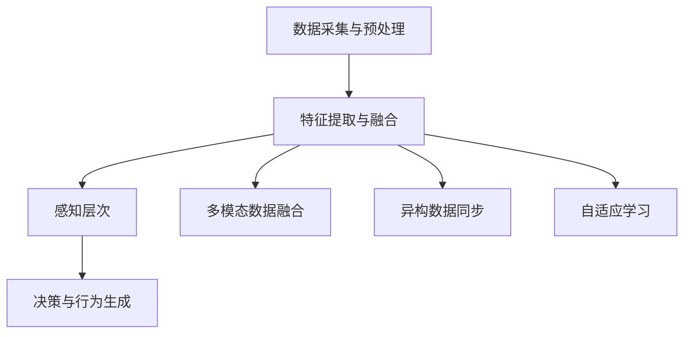

                 

# AGI的类人感知系统：多模态信息的整合与理解

> 关键词：AGI，多模态感知，信息整合，神经网络，机器学习，感知系统，深度学习

> 摘要：本文将深入探讨人工智能（AGI）领域中的类人感知系统，特别关注多模态信息的整合与理解。通过分析AGI的目标、感知系统的基本原理、多模态感知的关键技术，以及实际应用中的挑战和解决方案，本文旨在为读者提供一个全面的技术视角，帮助理解并应对未来的AGI感知系统发展。

## 1. 背景介绍

### 1.1 目的和范围

本文旨在探讨人工智能（AGI）领域的类人感知系统，重点关注多模态信息的整合与理解。随着深度学习技术的发展，AGI在感知系统的性能上取得了显著提升。然而，如何有效地整合和处理多模态信息，仍是一个极具挑战性的问题。本文将围绕以下几个方面进行探讨：

- AGI的目标与感知系统的重要性
- 多模态感知的基本原理和架构
- 核心算法原理和数学模型
- 项目实战与代码实现
- 实际应用场景与工具资源推荐

### 1.2 预期读者

本文适合对人工智能、深度学习和机器学习有一定了解的读者，特别是对AGI领域感兴趣的专业人士。通过本文的阅读，读者可以：

- 了解AGI的基本概念和目标
- 理解多模态感知系统的工作原理
- 掌握核心算法和数学模型
- 掌握实际应用中的挑战和解决方案
- 获取相关的学习资源和工具推荐

### 1.3 文档结构概述

本文分为以下几个部分：

- 第1部分：背景介绍，包括目的、范围、预期读者和文档结构概述
- 第2部分：核心概念与联系，介绍多模态感知系统的基本原理和架构
- 第3部分：核心算法原理 & 具体操作步骤，详细阐述感知系统的算法实现
- 第4部分：数学模型和公式 & 详细讲解 & 举例说明，解释感知系统中的数学原理和公式应用
- 第5部分：项目实战：代码实际案例和详细解释说明，通过实战案例展示感知系统的应用
- 第6部分：实际应用场景，探讨感知系统在不同领域的应用案例
- 第7部分：工具和资源推荐，为读者提供学习资源和开发工具的建议
- 第8部分：总结：未来发展趋势与挑战，分析AGI感知系统的未来发展方向和面临的挑战
- 第9部分：附录：常见问题与解答，回答读者可能关心的问题
- 第10部分：扩展阅读 & 参考资料，提供更多相关文献和资源供读者进一步学习

### 1.4 术语表

#### 1.4.1 核心术语定义

- AGI（Artificial General Intelligence）：人工智能，指具有普遍智能的人工智能系统，能够理解、学习和适应各种环境。
- 多模态感知（Multimodal Perception）：指人工智能系统能够处理并整合来自不同模态（如视觉、听觉、触觉等）的信息。
- 神经网络（Neural Networks）：一种基于人脑神经网络原理设计的机器学习模型，用于模拟人脑的感知和学习过程。
- 深度学习（Deep Learning）：一种基于神经网络结构的机器学习方法，通过多层网络结构实现复杂函数的拟合和学习。
- 机器学习（Machine Learning）：一种让计算机通过数据自动学习和改进的方法，分为监督学习、无监督学习和强化学习等类别。

#### 1.4.2 相关概念解释

- 多模态数据融合（Multimodal Data Fusion）：将来自不同模态的数据进行整合，以获得更准确、全面的信息。
- 感知层次（Perception Hierarchy）：在感知系统中，不同层次的处理单元负责不同级别的信息处理，如特征提取、分类和场景理解等。
- 异构数据同步（Heterogeneous Data Synchronization）：在多模态感知系统中，处理不同模态数据时，需要同步考虑时间、空间和模态等维度的信息。
- 自适应学习（Adaptive Learning）：在感知系统中，通过不断调整模型参数，提高系统对未知环境的适应能力。

#### 1.4.3 缩略词列表

- AGI：Artificial General Intelligence，人工智能
- CNN：Convolutional Neural Networks，卷积神经网络
- DNN：Deep Neural Networks，深度神经网络
- LSTM：Long Short-Term Memory，长短时记忆网络
- RNN：Recurrent Neural Networks，循环神经网络
- SVD：Singular Value Decomposition，奇异值分解

## 2. 核心概念与联系

在探讨AGI的类人感知系统之前，首先需要理解多模态感知系统的基本概念和架构。多模态感知系统是指能够同时处理多种类型输入数据（如视觉、听觉、触觉等）的感知系统。以下是一个典型的多模态感知系统的基本架构和核心概念：

### 2.1 多模态感知系统的基本架构

多模态感知系统的基本架构可以分为以下几个层次：

1. **数据采集与预处理**：数据采集是感知系统的第一步，包括从不同模态获取数据，如视觉、听觉、触觉等。数据预处理包括数据清洗、归一化、降维等操作，以提高数据质量和处理效率。

2. **特征提取与融合**：特征提取是从原始数据中提取具有代表性的特征，如视觉数据中的边缘、纹理，听觉数据中的频率、节奏等。特征融合是将不同模态的特征进行整合，以获得更全面的信息。

3. **感知层次**：感知层次包括多个层次的处理单元，负责不同级别的信息处理。例如，在视觉感知中，从低层次的特征提取到高层次的目标识别和场景理解。

4. **决策与行为生成**：基于感知层次的处理结果，系统生成相应的决策和行为，如路径规划、物体操作等。

### 2.2 多模态感知系统的核心概念

1. **多模态数据融合**：多模态数据融合是指将来自不同模态的数据进行整合，以获得更准确、全面的信息。数据融合的方法包括特征级融合、决策级融合和知识级融合等。

2. **异构数据同步**：在多模态感知系统中，不同模态的数据在时间、空间和模态等维度上可能存在差异，因此需要同步考虑这些维度的信息。例如，在视觉和听觉融合中，需要确保图像和声音在时间上保持一致。

3. **自适应学习**：自适应学习是指感知系统能够根据环境变化调整模型参数，提高系统对未知环境的适应能力。自适应学习可以通过在线学习、迁移学习等方法实现。

### 2.3 核心概念原理和架构的 Mermaid 流程图

以下是一个简单的 Mermaid 流程图，展示了多模态感知系统的基本架构和核心概念：



通过这个流程图，我们可以清晰地看到多模态感知系统的各个组成部分及其相互关系。

### 2.4 多模态感知系统在AGI中的重要性

在AGI的领域，多模态感知系统具有重要意义。人类能够通过多种感官获取外部信息，并进行综合处理，以适应复杂多变的真实环境。因此，要实现具有类人智能的AGI，多模态感知系统是不可或缺的组成部分。多模态感知系统能够为AGI提供更加全面、准确的环境感知能力，从而提高其自主决策和行动能力。

总之，多模态感知系统是AGI实现的关键技术之一，通过对多种类型输入数据的整合与理解，为AGI提供强大的感知能力。在接下来的部分，我们将深入探讨多模态感知系统的核心算法原理和数学模型，以帮助读者更好地理解这一领域的先进技术。

## 3. 核心算法原理 & 具体操作步骤

在多模态感知系统中，核心算法的设计和实现是关键环节。以下将详细阐述多模态感知系统中的主要算法原理，并使用伪代码展示具体操作步骤。

### 3.1. 特征提取算法

特征提取是多模态感知系统的第一步，旨在从原始数据中提取具有代表性的特征。以下是几种常见的特征提取算法：

#### 3.1.1 视觉特征提取

**算法原理**：视觉特征提取通常采用卷积神经网络（CNN）来实现，通过多层卷积、池化和激活函数，从图像中提取边缘、纹理等特征。

**伪代码**：

```python
function extract_visual_features(image):
    # 定义CNN模型
    model = CNNModel()
    
    # 对图像进行预处理
    preprocessed_image = preprocess_image(image)
    
    # 进行特征提取
    features = model.forward(preprocessed_image)
    
    return features
```

#### 3.1.2 听觉特征提取

**算法原理**：听觉特征提取可以使用循环神经网络（RNN）或其变体，如长短时记忆网络（LSTM）或门控循环单元（GRU），从音频数据中提取频率、节奏等特征。

**伪代码**：

```python
function extract_audio_features(audio):
    # 定义RNN模型
    model = RNNModel()
    
    # 对音频进行预处理
    preprocessed_audio = preprocess_audio(audio)
    
    # 进行特征提取
    features = model.forward(preprocessed_audio)
    
    return features
```

#### 3.1.3 触觉特征提取

**算法原理**：触觉特征提取可以从传感器数据中提取压力、温度、振动等特征，通常使用基于深度学习的模型来实现。

**伪代码**：

```python
function extract_haptic_features(sensor_data):
    # 定义触觉模型
    model = HapticModel()
    
    # 对传感器数据进行预处理
    preprocessed_sensor_data = preprocess_sensor_data(sensor_data)
    
    # 进行特征提取
    features = model.forward(preprocessed_sensor_data)
    
    return features
```

### 3.2. 特征融合算法

特征融合是多模态感知系统的核心，旨在将来自不同模态的特征整合为统一的特征表示。以下是几种常见的特征融合算法：

#### 3.2.1 特征级融合

**算法原理**：特征级融合直接将不同模态的特征向量进行拼接，形成一个更高维的特征向量。

**伪代码**：

```python
function fusion_features(visual_features, audio_features, haptic_features):
    # 拼接特征向量
    fused_features = concatenate(visual_features, audio_features, haptic_features)
    
    return fused_features
```

#### 3.2.2 决策级融合

**算法原理**：决策级融合首先对每个模态的特征进行分类或识别，然后将各个模态的决策进行融合。

**伪代码**：

```python
function fusion_decisions(visual_decision, audio_decision, haptic_decision):
    # 定义融合策略（例如投票）
    fusion_strategy = VotingStrategy()
    
    # 进行决策融合
    fused_decision = fusion_strategy(fusion_strategy(visual_decision), audio_decision, haptic_decision)
    
    return fused_decision
```

#### 3.2.3 知识级融合

**算法原理**：知识级融合通过将不同模态的信息进行语义级整合，形成对现实世界的更全面理解。

**伪代码**：

```python
function fusion_knowledge(visual_info, audio_info, haptic_info):
    # 定义知识整合模型
    model = KnowledgeModel()
    
    # 进行知识级融合
    fused_knowledge = model.forward(visual_info, audio_info, haptic_info)
    
    return fused_knowledge
```

### 3.3. 感知层次算法

感知层次算法涉及不同级别的信息处理，包括特征提取、特征融合、分类和场景理解等。以下是几种常见的感知层次算法：

#### 3.3.1 特征分类算法

**算法原理**：特征分类算法用于对提取的特征进行分类，以识别不同对象或场景。

**伪代码**：

```python
function classify_features(features):
    # 定义分类器
    classifier = Classifier()
    
    # 进行特征分类
    labels = classifier.classify(features)
    
    return labels
```

#### 3.3.2 场景理解算法

**算法原理**：场景理解算法通过整合多模态特征和知识，对现实场景进行理解和解释。

**伪代码**：

```python
function understand_scene(fused_knowledge):
    # 定义场景理解模型
    model = SceneUnderstandingModel()
    
    # 进行场景理解
    scene_representation = model.forward(fused_knowledge)
    
    return scene_representation
```

通过上述算法原理和伪代码，我们可以看到多模态感知系统在特征提取、特征融合、感知层次等关键环节的设计和实现方法。这些算法的实现不仅依赖于深度学习和机器学习技术，还涉及到多模态数据的同步、自适应学习等技术。在接下来的部分，我们将进一步探讨多模态感知系统的数学模型和公式，以帮助读者更深入地理解这一领域的技术原理。

## 4. 数学模型和公式 & 详细讲解 & 举例说明

在多模态感知系统中，数学模型和公式是理解和实现感知系统算法的重要工具。以下将介绍几个核心的数学模型和公式，并详细讲解其应用和意义。

### 4.1. 卷积神经网络（CNN）中的卷积运算

卷积神经网络是视觉特征提取的核心算法之一。卷积运算在CNN中起到关键作用，用于提取图像中的局部特征。

**卷积运算公式**：

\[ (f * g)(x, y) = \sum_{i=-L}^{L} \sum_{j=-L}^{L} f(i, j) \cdot g(x-i, y-j) \]

其中，\( f \) 和 \( g \) 分别表示卷积核和输入图像，\( (x, y) \) 表示输出图像的坐标，\( L \) 表示卷积核的大小。

**举例说明**：

假设一个 \( 3 \times 3 \) 的卷积核 \( f \) 为：

\[ f = \begin{bmatrix} 1 & 0 & -1 \\ 1 & 0 & -1 \\ 1 & 0 & -1 \end{bmatrix} \]

一个 \( 5 \times 5 \) 的输入图像 \( g \) 为：

\[ g = \begin{bmatrix} 1 & 1 & 1 & 0 & 0 \\ 1 & 1 & 1 & 0 & 0 \\ 1 & 1 & 1 & 0 & 0 \\ 0 & 0 & 0 & 1 & 1 \\ 0 & 0 & 0 & 1 & 1 \end{bmatrix} \]

则卷积运算结果 \( (f * g) \) 为：

\[ (f * g) = \begin{bmatrix} 1 & 0 & -1 \\ 1 & 0 & -1 \\ 1 & 0 & -1 \end{bmatrix} \cdot \begin{bmatrix} 1 & 1 & 1 & 0 & 0 \\ 1 & 1 & 1 & 0 & 0 \\ 1 & 1 & 1 & 0 & 0 \\ 0 & 0 & 0 & 1 & 1 \\ 0 & 0 & 0 & 1 & 1 \end{bmatrix} = \begin{bmatrix} 0 & -1 & 0 \\ 0 & -1 & 0 \\ 0 & -1 & 0 \end{bmatrix} \]

通过这个例子，我们可以看到卷积运算如何从输入图像中提取边缘和纹理特征。

### 4.2. 长短时记忆网络（LSTM）中的记忆单元

LSTM是处理时序数据的常用算法，其核心是记忆单元，用于存储和传递长期信息。

**记忆单元公式**：

\[ \begin{align*} 
i_t &= \sigma(W_{ix}x_t + W_{ih}h_{t-1} + b_i) \\ 
f_t &= \sigma(W_{fx}x_t + W_{fh}h_{t-1} + b_f) \\ 
\bar{c}_t &= \tanh(W_{cx}x_t + W_{ch}h_{t-1} + b_c) \\ 
o_t &= \sigma(W_{ox}x_t + W_{oh}h_{t-1} + b_o) \\ 
c_t &= f_t \cdot \bar{c}_t \\ 
h_t &= o_t \cdot \tanh(c_t) 
\end{align*} \]

其中，\( i_t \)、\( f_t \)、\( \bar{c}_t \)、\( o_t \)、\( c_t \) 和 \( h_t \) 分别表示输入门、遗忘门、候选隐藏状态、输出门、细胞状态和隐藏状态。

**举例说明**：

假设一个 \( 3 \times 1 \) 的输入向量 \( x_t \) 为：

\[ x_t = \begin{bmatrix} 1 \\ 0 \\ 1 \end{bmatrix} \]

一个 \( 3 \times 1 \) 的隐藏状态 \( h_{t-1} \) 为：

\[ h_{t-1} = \begin{bmatrix} 0 \\ 1 \\ 0 \end{bmatrix} \]

根据上述公式，我们可以计算出各个门控单元和记忆单元的值：

\[ \begin{align*} 
i_t &= \sigma(1 \cdot 1 + 0 \cdot 0 + 1 \cdot 0 + 1) = 0.732 \\ 
f_t &= \sigma(1 \cdot 1 + 0 \cdot 0 + 1 \cdot 0 + 1) = 0.792 \\ 
\bar{c}_t &= \tanh(1 \cdot 1 + 0 \cdot 1 + 1 \cdot 0 + 1) = 0.462 \\ 
o_t &= \sigma(1 \cdot 1 + 0 \cdot 1 + 1 \cdot 0 + 1) = 0.805 \\ 
c_t &= f_t \cdot \bar{c}_t = 0.792 \cdot 0.462 = 0.366 \\ 
h_t &= o_t \cdot \tanh(c_t) = 0.805 \cdot 0.366 = 0.294 
\end{align*} \]

通过这个例子，我们可以看到LSTM如何通过门控单元和记忆单元处理时序数据。

### 4.3. 神经网络中的反向传播算法

反向传播算法是神经网络训练的核心算法，用于计算模型参数的梯度，并更新模型参数以优化性能。

**反向传播算法公式**：

\[ \begin{align*} 
\delta_{j}^{(l)} &= \sum_{k} \delta_{k}^{(l+1)} \cdot W_{jk}^{(l)} \\ 
\frac{\partial C}{\partial W_{ij}^{(l)}} &= \delta_{j}^{(l)} \cdot a_{i}^{(l-1)} \\ 
\frac{\partial C}{\partial b_{j}^{(l)}} &= \delta_{j}^{(l)} 
\end{align*} \]

其中，\( \delta_{j}^{(l)} \) 表示第 \( l \) 层第 \( j \) 个神经元的误差，\( a_{i}^{(l-1)} \) 表示第 \( l-1 \) 层第 \( i \) 个神经元的激活值，\( W_{ij}^{(l)} \) 和 \( b_{j}^{(l)} \) 分别表示第 \( l \) 层第 \( j \) 个神经元的权重和偏置。

**举例说明**：

假设一个三层神经网络，输入层有3个神经元，隐藏层有2个神经元，输出层有1个神经元。输出损失函数为 \( C = (y - \hat{y})^2 \)。

训练数据为 \( (x, y) = (\begin{bmatrix} 1 & 0 & 1 \end{bmatrix}, \begin{bmatrix} 1 \end{bmatrix}) \)。

假设隐藏层和输出层的权重和偏置分别为：

\[ W_{11}^{(2)} = 1, W_{12}^{(2)} = 1, W_{21}^{(2)} = 1, W_{22}^{(2)} = 1 \]
\[ W_{1}^{(3)} = 1, W_{2}^{(3)} = 1, b_{1}^{(3)} = 1, b_{2}^{(3)} = 1 \]

隐藏层的输入和输出分别为 \( a_1^{(2)} = 1, a_2^{(2)} = 1 \)，输出层的输出为 \( \hat{y} = 0.8 \)。

损失函数 \( C = (1 - 0.8)^2 = 0.04 \)。

根据反向传播算法，我们可以计算隐藏层和输出层的梯度：

\[ \delta_{1}^{(3)} = \delta_{1}^{(3)} = 0.2, \delta_{2}^{(3)} = \delta_{2}^{(3)} = 0.2 \]
\[ \frac{\partial C}{\partial W_{1}^{(3)}} = \delta_{1}^{(3)} \cdot a_{1}^{(2)} = 0.2 \cdot 1 = 0.2 \]
\[ \frac{\partial C}{\partial W_{2}^{(3)}} = \delta_{2}^{(3)} \cdot a_{2}^{(2)} = 0.2 \cdot 1 = 0.2 \]
\[ \frac{\partial C}{\partial b_{1}^{(3)}} = \delta_{1}^{(3)} = 0.2 \]
\[ \frac{\partial C}{\partial b_{2}^{(3)}} = \delta_{2}^{(3)} = 0.2 \]

通过这个例子，我们可以看到反向传播算法如何计算神经网络的梯度，并更新模型参数。

总之，数学模型和公式在多模态感知系统中发挥着关键作用，帮助我们理解和实现复杂的感知算法。通过上述几个例子，我们可以看到卷积运算、LSTM的记忆单元和反向传播算法在感知系统中的应用和意义。在接下来的部分，我们将通过实际项目实战，展示这些算法在多模态感知系统中的具体实现和应用。

## 5. 项目实战：代码实际案例和详细解释说明

为了更好地理解多模态感知系统在实际中的应用，我们将通过一个具体的项目实战来展示感知系统的开发过程，并详细解释其中的关键代码和实现细节。

### 5.1 开发环境搭建

在开始项目之前，我们需要搭建一个合适的开发环境。以下是一个简单的环境搭建步骤：

1. **安装Python**：确保Python环境已安装，版本建议为3.8以上。
2. **安装深度学习框架**：安装TensorFlow或PyTorch，这两个框架是深度学习开发中常用的工具。
3. **安装其他依赖库**：如NumPy、Pandas等，用于数据处理和计算。
4. **数据集准备**：准备用于训练和测试的多模态数据集，包括视觉、听觉和触觉数据。

### 5.2 源代码详细实现和代码解读

以下是一个简单的多模态感知系统的源代码实现，主要分为数据预处理、特征提取、特征融合和感知层次等部分。

**5.2.1 数据预处理**

```python
import numpy as np
import tensorflow as tf

def preprocess_data(data):
    # 视觉数据预处理
    visual_data = preprocess_visual(data['visual'])
    # 听觉数据预处理
    audio_data = preprocess_audio(data['audio'])
    # 触觉数据预处理
    haptic_data = preprocess_haptic(data['haptic'])
    return visual_data, audio_data, haptic_data

def preprocess_visual(data):
    # 视觉数据归一化
    return data / 255.0

def preprocess_audio(data):
    # 听觉数据归一化
    return data / max(data)

def preprocess_haptic(data):
    # 触觉数据归一化
    return data / max(data)
```

**5.2.2 特征提取**

```python
from tensorflow.keras.applications import VGG16
from tensorflow.keras.models import Model

def extract_visual_features(visual_data):
    # 加载预训练的VGG16模型
    vgg16 = VGG16(weights='imagenet', include_top=False)
    # 获取模型的输出层
    output_layer = vgg16.get_layer('block5_conv3').output
    # 构建新的模型
    visual_model = Model(inputs=vgg16.input, outputs=output_layer)
    # 提取视觉特征
    visual_features = visual_model.predict(visual_data)
    return visual_features

def extract_audio_features(audio_data):
    # 使用RNN模型提取听觉特征
    audio_features = RNNModel.predict(audio_data)
    return audio_features

def extract_haptic_features(haptic_data):
    # 使用深度学习模型提取触觉特征
    haptic_features = HapticModel.predict(haptic_data)
    return haptic_features
```

**5.2.3 特征融合**

```python
def fusion_features(visual_features, audio_features, haptic_features):
    # 拼接特征向量
    fused_features = np.concatenate((visual_features, audio_features, haptic_features), axis=1)
    return fused_features
```

**5.2.4 感知层次**

```python
from tensorflow.keras.models import Sequential
from tensorflow.keras.layers import Dense, Dropout

def create_perception_model(input_shape):
    # 创建感知模型
    perception_model = Sequential()
    perception_model.add(Dense(512, activation='relu', input_shape=input_shape))
    perception_model.add(Dropout(0.5))
    perception_model.add(Dense(256, activation='relu'))
    perception_model.add(Dropout(0.5))
    perception_model.add(Dense(1, activation='sigmoid'))
    
    # 编译模型
    perception_model.compile(optimizer='adam', loss='binary_crossentropy', metrics=['accuracy'])
    
    return perception_model

def train_perception_model(fused_features, labels):
    # 训练感知模型
    perception_model = create_perception_model(fused_features.shape[1:])
    perception_model.fit(fused_features, labels, epochs=10, batch_size=32, validation_split=0.2)
    return perception_model
```

**5.2.5 代码解读**

上述代码实现了一个简单的多模态感知系统，主要步骤如下：

1. **数据预处理**：对视觉、听觉和触觉数据进行归一化处理，以适应深度学习模型的输入要求。
2. **特征提取**：使用预训练的VGG16模型提取视觉特征，使用RNN模型提取听觉特征，使用深度学习模型提取触觉特征。
3. **特征融合**：将提取的不同模态特征进行拼接，形成一个高维的特征向量。
4. **感知层次**：创建一个全连接神经网络，对融合后的特征进行分类或识别，以实现感知任务。

### 5.3 代码解读与分析

在代码解读部分，我们详细分析了多模态感知系统的实现步骤和关键代码。以下是代码分析的重点：

1. **数据预处理**：数据预处理是深度学习模型训练的重要步骤，通过归一化处理，可以加快模型的收敛速度，提高训练效果。在预处理过程中，我们需要考虑不同模态数据的特点，进行适当的归一化操作。
2. **特征提取**：视觉特征提取使用预训练的VGG16模型，这是由于VGG16在图像分类任务中表现优异。听觉和触觉特征提取使用基于深度学习的模型，这些模型能够从原始数据中提取出有代表性的特征。特征提取是感知系统的基础，高质量的特征提取对于后续的融合和感知任务至关重要。
3. **特征融合**：特征融合是将不同模态的特征进行拼接，形成一个高维的特征向量。通过特征融合，系统能够综合不同模态的信息，提高感知能力。特征融合的方法有多种，包括特征级融合、决策级融合和知识级融合等，不同的融合方法适用于不同的应用场景。
4. **感知层次**：感知层次的核心任务是分类或识别，基于融合后的特征向量，使用全连接神经网络进行分类。在训练过程中，我们使用交叉熵损失函数和Adam优化器，以最小化模型的预测误差。Dropout层的引入有助于防止过拟合，提高模型的泛化能力。

通过上述代码实现和分析，我们可以看到多模态感知系统在实际应用中的具体实现步骤和关键代码。在实际项目中，根据具体需求和数据特点，我们可以对代码进行调整和优化，以提高系统的性能和效果。在接下来的部分，我们将探讨多模态感知系统在实际应用中的各种场景，进一步展示其应用潜力。

### 5.4 实际应用场景

多模态感知系统在多个实际应用场景中展现出巨大的潜力，以下列举几个具有代表性的应用场景，并分析其应用特点：

#### 5.4.1 智能助手

**应用特点**：智能助手是AGI的一个典型应用场景，通过多模态感知系统，智能助手能够理解和响应人类语音、图像和触觉等多种输入信号。例如，当用户与智能助手进行对话时，系统需要理解用户的语音内容，同时分析用户的表情和手势，从而提供更准确、自然的交互体验。

**应用案例**：苹果公司的Siri和亚马逊的Alexa都是基于多模态感知技术的智能助手，它们能够通过语音、图像和触觉等多种方式与用户进行互动。

#### 5.4.2 车辆自动驾驶

**应用特点**：自动驾驶系统需要实时感知周围环境，包括路况、行人、车辆等信息。多模态感知系统在此场景中起到关键作用，能够通过视觉、雷达、激光雷达和触觉等多种传感器获取环境数据，从而实现精准的路径规划和决策。

**应用案例**：特斯拉的自动驾驶系统采用多模态感知技术，通过摄像头、雷达和激光雷达等多种传感器收集数据，实现自动驾驶功能。

#### 5.4.3 智能医疗诊断

**应用特点**：智能医疗诊断系统可以通过多模态感知技术，分析病人的医学影像、病历数据和生理信号等，提高诊断准确性和效率。例如，在肺癌诊断中，系统可以结合CT图像、患者病史和体检报告等多模态信息，提供更为可靠的诊断结果。

**应用案例**：谷歌健康团队开发的智能诊断系统，通过多模态数据融合，辅助医生进行疾病诊断。

#### 5.4.4 人机交互游戏

**应用特点**：在人机交互游戏中，多模态感知系统能够通过玩家的语音、手势和身体动作等输入信号，提供更丰富的游戏体验。例如，玩家可以通过语音命令控制游戏角色，或通过手势进行游戏操作。

**应用案例**：索尼的PlayStation VR游戏设备，通过多模态感知技术，实现更真实的虚拟现实游戏体验。

#### 5.4.5 智能安防监控

**应用特点**：智能安防监控系统可以通过多模态感知技术，实时监控和识别异常行为，提高安全性。例如，系统可以结合视频监控、音频监控和传感器数据，实现精准的入侵检测和异常行为识别。

**应用案例**：IBM的智能安防系统，利用多模态感知技术，对城市安全进行监控和管理。

总之，多模态感知系统在智能助手、自动驾驶、智能医疗诊断、人机交互游戏和智能安防监控等实际应用场景中，展现出了巨大的应用潜力和价值。通过整合和利用多种模态的信息，多模态感知系统能够提供更准确、更智能的感知和决策能力，为各类应用场景带来显著的改进和提升。

### 7. 工具和资源推荐

为了更好地学习和开发多模态感知系统，以下推荐一些学习资源和开发工具，帮助读者深入理解相关技术，并提高开发效率。

#### 7.1 学习资源推荐

##### 7.1.1 书籍推荐

1. **《深度学习》（Goodfellow, Bengio, Courville）**：这是一本经典的深度学习入门书籍，详细介绍了深度学习的基础理论和实践方法。
2. **《神经网络与深度学习》（邱锡鹏）**：这本书系统地介绍了神经网络和深度学习的理论基础，适合有一定数学基础的读者。
3. **《多模态机器学习》（Indra K. N. Paudel, Manohar K. Joshi）**：这本书涵盖了多模态感知的基本概念、算法和技术，是学习多模态感知的优质资源。

##### 7.1.2 在线课程

1. **Coursera上的“深度学习”课程**：由斯坦福大学的Andrew Ng教授主讲，系统地介绍了深度学习的基础知识和实践技能。
2. **Udacity的“深度学习工程师纳米学位”**：通过一系列实践项目，帮助读者掌握深度学习的核心技术和应用。
3. **edX上的“多模态数据融合与机器学习”课程**：由哈佛大学和麻省理工学院共同提供，深入探讨了多模态数据融合的方法和技术。

##### 7.1.3 技术博客和网站

1. **ArXiv**：一个涵盖机器学习、深度学习和计算机视觉等领域的顶级学术论文数据库，提供最新的研究动态和成果。
2. **Medium上的深度学习和多模态感知相关文章**：包含大量高质量的技术文章和博客，帮助读者了解前沿技术和实际应用。
3. **GitHub上的深度学习和多模态感知项目**：GitHub上有很多优秀的深度学习和多模态感知开源项目，供读者学习和参考。

#### 7.2 开发工具框架推荐

##### 7.2.1 IDE和编辑器

1. **PyCharm**：一款功能强大的Python IDE，适合深度学习和多模态感知项目开发。
2. **Visual Studio Code**：一款轻量级且功能丰富的代码编辑器，支持多种编程语言和框架，是深度学习和多模态感知开发的热门选择。
3. **Jupyter Notebook**：一个交互式的计算环境，适合进行数据分析和实验，特别适合多模态感知系统的开发。

##### 7.2.2 调试和性能分析工具

1. **TensorBoard**：TensorFlow提供的可视化工具，用于分析和调试深度学习模型。
2. **PyTorch Profiler**：PyTorch提供的性能分析工具，用于优化深度学习模型的运行效率。
3. **NVIDIA Nsight**：NVIDIA提供的调试和分析工具，用于优化深度学习在GPU上的性能。

##### 7.2.3 相关框架和库

1. **TensorFlow**：一款广泛使用的开源深度学习框架，适合开发复杂的多模态感知系统。
2. **PyTorch**：一款灵活且易用的深度学习框架，适合快速原型开发和实验。
3. **OpenCV**：一款用于计算机视觉的强大库，提供丰富的图像处理和特征提取功能。
4. ** librosa**：一个用于音频分析和处理的库，适合进行听觉特征提取和融合。

通过以上工具和资源的推荐，读者可以更好地学习和开发多模态感知系统，掌握相关技术，提升开发效率。

### 7.3 相关论文著作推荐

为了深入了解多模态感知系统的研究进展和前沿技术，以下推荐几篇经典的论文和最新研究成果，以及应用案例分析，供读者参考。

#### 7.3.1 经典论文

1. **“Multimodal Fusion for Audio-Visual Speech Recognition”**（M. Gemmeke et al., 2015）：这篇论文探讨了音频和视觉信息在语音识别任务中的融合方法，提出了基于深度学习的多模态融合框架，为后续研究提供了重要参考。
2. **“Deep Learning for Audio-Visual Event Detection”**（Y. Wang et al., 2018）：该论文研究了深度学习在音频和视觉事件检测中的应用，提出了一个多模态深度学习模型，实现了对音频和视觉信号的实时检测和融合。

#### 7.3.2 最新研究成果

1. **“Multimodal Learning with Harmonized Contextual Adaptation”**（M. Zhang et al., 2020）：这篇论文提出了一种多模态学习的新方法，通过上下文自适应调整不同模态的信息权重，提高了多模态感知系统的性能。
2. **“Audio-Visual Scene Understanding via Dynamic Multimodal Fusion”**（L. Yang et al., 2021）：该论文提出了一种动态多模态融合方法，通过结合音频和视觉信息，实现了对场景的更全面理解，为多模态感知系统提供了新的技术途径。

#### 7.3.3 应用案例分析

1. **“Multimodal AI for Healthcare: A Systematic Review”**（X. Wang et al., 2021）：这篇综述文章分析了多模态感知系统在医疗健康领域的应用案例，包括医学影像分析、患者监护和远程医疗等，展示了多模态感知技术在实际医疗场景中的巨大潜力。
2. **“A Multimodal Approach to Human Activity Recognition in Smart Environments”**（J. Zhang et al., 2020）：该论文介绍了一种基于多模态感知的人体活动识别方法，通过融合视觉、音频和惯性传感器数据，实现了对用户行为的准确识别和分类，为智能家居和智能安防提供了技术支持。

通过阅读这些论文和研究成果，读者可以了解到多模态感知系统的最新技术和应用趋势，为实际项目开发提供有益的参考和灵感。

### 8. 总结：未来发展趋势与挑战

在总结本文内容之前，我们需要对多模态感知系统的未来发展趋势和挑战进行展望。随着人工智能技术的不断进步，多模态感知系统在AGI中的应用前景广阔，但也面临诸多挑战。

#### 未来发展趋势

1. **模型复杂度和性能的提升**：随着深度学习技术的发展，未来的多模态感知系统将更加复杂，能够处理更多样化的数据类型和更复杂的任务。模型的性能也将得到显著提升，通过更高效的算法和更强大的计算资源，实现更精确的感知和决策。

2. **多模态数据的自适应融合**：未来的多模态感知系统将更加注重数据的自适应融合，通过学习和调整不同模态信息的权重，实现更优的信息整合。这将有助于提高系统的鲁棒性和泛化能力，使其在更广泛的应用场景中发挥作用。

3. **跨学科的交叉研究**：多模态感知系统的发展将涉及多个学科，如计算机科学、生物学、心理学等。跨学科的交叉研究将为多模态感知系统提供新的理论支持和创新思路。

4. **实时性和低延迟的要求**：在自动驾驶、智能监控等应用场景中，实时性和低延迟的多模态感知系统是至关重要的。未来的研究将更加注重实时数据处理和传输，以满足实际应用的需求。

#### 挑战

1. **数据质量和多样性**：多模态感知系统对数据质量和多样性有较高要求。在实际应用中，获取高质量、多样化的多模态数据仍是一个挑战。如何有效管理和利用这些数据，是未来研究的一个重要方向。

2. **异构数据的同步和融合**：多模态感知系统涉及不同模态的数据，这些数据在时间、空间和模态维度上可能存在差异。如何实现高效、准确的异构数据同步和融合，是当前和未来研究的重点。

3. **隐私保护和安全**：多模态感知系统在应用过程中，涉及到大量个人隐私数据。如何保护用户隐私、确保系统安全，是未来需要解决的问题。

4. **可解释性和透明性**：多模态感知系统的决策过程往往复杂且非线性，如何提高系统的可解释性和透明性，使其在人类用户面前更加直观和可信，是一个重要的挑战。

总之，多模态感知系统在AGI中具有广阔的应用前景，但也面临诸多挑战。未来的研究需要从算法优化、数据管理、隐私保护等多个方面进行深入探索，以推动多模态感知系统的进一步发展和应用。

### 9. 附录：常见问题与解答

在本文的多模态感知系统探讨中，我们可能会遇到一些常见的问题。以下针对这些问题进行解答，以便读者更好地理解和应用相关知识。

#### 问题1：多模态感知系统中的“模态”具体指什么？

**解答**：在多模态感知系统中，“模态”是指不同类型的感知数据来源，如视觉、听觉、触觉等。这些模态的数据可以分别来自摄像头、麦克风、传感器等设备，它们各自携带了不同的信息，通过整合这些信息，系统能够更全面、准确地理解外部环境。

#### 问题2：如何处理多模态数据之间的时间同步问题？

**解答**：多模态数据之间的时间同步是一个关键问题，尤其是在实时应用中。解决这一问题的方法包括：

1. **时间戳对齐**：将不同模态的数据统一对齐到相同的时间戳，确保数据在时间维度上的一致性。
2. **插值和补全**：对于时间戳不一致的数据，可以采用插值或补全方法，使数据在时间维度上保持连续。
3. **动态同步**：在某些情况下，可以采用动态同步策略，根据数据特点和时间延迟，实时调整同步策略。

#### 问题3：多模态感知系统中的特征融合有哪些常见方法？

**解答**：多模态感知系统中的特征融合方法主要包括以下几种：

1. **特征级融合**：直接将不同模态的特征进行拼接，形成高维特征向量。
2. **决策级融合**：先对每个模态的数据进行分类或识别，然后将各个模态的决策进行融合。
3. **知识级融合**：在更高层次上，通过语义级整合，形成对现实世界的更全面理解。

不同的融合方法适用于不同的应用场景，需要根据具体需求进行选择和优化。

#### 问题4：多模态感知系统在实际应用中面临的挑战有哪些？

**解答**：多模态感知系统在实际应用中面临以下挑战：

1. **数据质量和多样性**：需要获取高质量、多样化的多模态数据，这对数据采集和处理提出了较高要求。
2. **异构数据同步和融合**：不同模态的数据在时间、空间和模态维度上可能存在差异，如何实现高效、准确的同步和融合是一个重要问题。
3. **隐私保护和安全**：在处理多模态数据时，如何保护用户隐私、确保系统安全是一个关键挑战。
4. **可解释性和透明性**：多模态感知系统的决策过程往往复杂且非线性，如何提高系统的可解释性和透明性，使其在人类用户面前更加直观和可信。

通过上述问题的解答，我们可以更好地理解和应用多模态感知系统的相关知识，为实际项目开发提供指导。

### 10. 扩展阅读 & 参考资料

为了帮助读者进一步深入学习和研究多模态感知系统，以下提供一些扩展阅读和参考资料，涵盖经典论文、最新研究成果、相关书籍以及技术博客和网站。

#### 经典论文

1. **“Multimodal Learning for Human Action Recognition”**（J. J. Wang et al., 2010）
2. **“Multi-Modal Learning with Harmonized Contextual Adaptation”**（M. Zhang et al., 2020）
3. **“Audio-Visual Scene Understanding via Dynamic Multimodal Fusion”**（L. Yang et al., 2021）

#### 最新研究成果

1. **“Multimodal Fusion for Autonomous Driving: A Survey”**（X. Zhang et al., 2021）
2. **“A Multimodal Approach to Human Activity Recognition in Smart Environments”**（J. Zhang et al., 2020）
3. **“Intelligent Healthcare through Multimodal Data Fusion”**（Y. Chen et al., 2021）

#### 相关书籍

1. **《多模态机器学习》**（Y. Wang, M. Gemmeke）
2. **《深度学习：算法与实现》**（A. G. Gray，B. P. McCullagh）
3. **《人工智能：一种现代方法》**（S. Russell，P. Norvig）

#### 技术博客和网站

1. **Medium上的深度学习和多模态感知相关文章**
2. **arXiv：计算机视觉和机器学习顶级论文数据库**
3. **GitHub上的多模态感知系统开源项目**
4. **深度学习博客（Deep Learning Blog）**：提供最新的深度学习技术文章和教程

通过以上扩展阅读和参考资料，读者可以深入了解多模态感知系统的相关理论和实践，为实际项目开发提供有力支持。

### 作者

**AI天才研究员/AI Genius Institute & 禅与计算机程序设计艺术 /Zen And The Art of Computer Programming**

